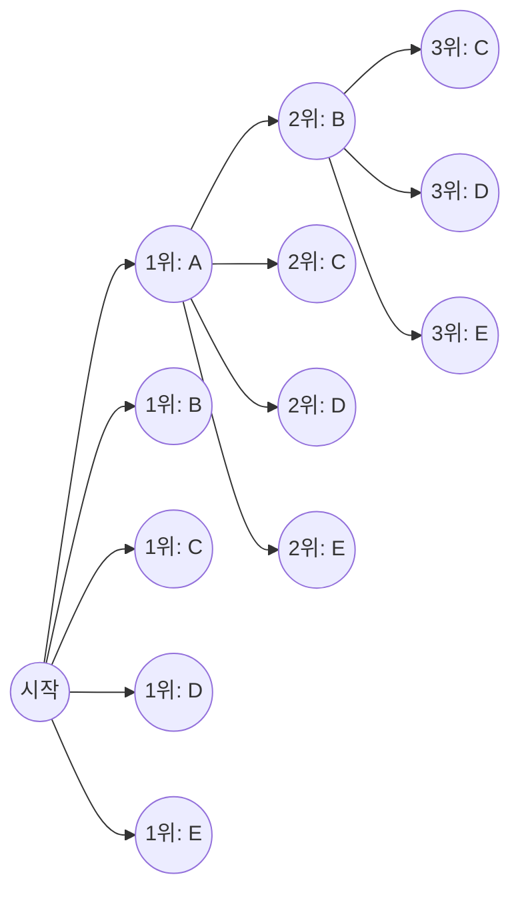
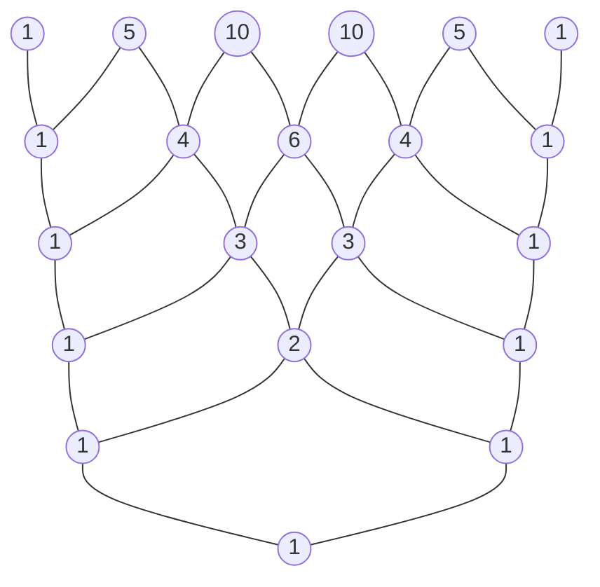

# 머리말

수학의 세계에서 경우의 수를 논리적으로 세는 방법인 '순열'과 '조합'은 확률론과 통계학, 나아가 컴퓨터 과학의 알고리즘에 이르기까지 폭넓은 분야의 기초가 되는 매우 중요한 개념입니다. 그리고 이러한 기초적인 개념을 대수학의 영역으로 확장한 끝에 나타나는 것이 바로 '이항정리'이며, 그 계수들의 나열을 시각적이고 기하학적으로 표현한 것이 '파스칼의 삼각형'입니다. 언뜻 보면 각각 독립된 수학적 주제처럼 보일 수 있지만, 깊이 공부하다 보면 이들이 놀라울 정도로 밀접하게 얽혀 거대하고 아름다운 하나의 수학적 구조를 형성하고 있다는 것을 깨닫게 됩니다.

이 글에서는 순열과 조합의 직관적인 이해와 기본적인 계산 방법에서 출발하여, 좀 더 복잡한 중복순열과 원순열, 나아가 중복조합에 대해 자세히 설명합니다. 그리고 이를 바탕으로 이항정리의 공식과 그 아름다운 대칭성을 이끌어내고, 최종적으로는 파스칼의 삼각형에 숨겨진 신비로운 성질, 자연계의 법칙을 설명하는 피보나치 수열과의 연결 고리, 프랙탈 구조와 같은 심오한 주제까지 빠짐없이 깊이 파고들어 보겠습니다. 수학이 가진 '아름다움'과 '규칙성'을 마음껏 음미하는 여행을 떠나봅시다.

# 순열 (Permutations) 이란

순열이란 서로 다른 $n$ 개의 원소 중에서 $r$ 개를 선택하여 **순서를 부여하여** 나열하는 방법을 뜻합니다. 순열에서 가장 중요한 핵심은 "나열하는 순서가 다르면 완전히 다른 것으로 취급한다"는 점입니다. 예를 들어, 'A', 'B', 'C' 세 장의 카드 중 두 장을 골라 나열할 때 'A-B'와 'B-A'는 서로 다른 순열로 셉니다.

## 순열의 공식

서로 다른 $n$ 개 중에서 $r$ 개를 선택하는 순열의 총 수는 기호 $_n\text{P}_r$ 로 나타내며, 아래의 수식으로 계산됩니다.

$$
_n\text{P}_r = \frac{n!}{(n-r)!}
$$

여기서 $n!$ 은 $n$ 의 팩토리얼(계승)을 나타내며, $n! = n \times (n-1) \times \dots \times 2 \times 1$ 입니다. 팩토리얼은 어떤 수의 모든 원소를 재배열하는 방법의 총 수를 나타냅니다.

## 구체적인 예: 달리기 경주의 순위와 좌석 배치

예를 들어 5명의 학생(A, B, C, D, E)이 달리기 경주를 했을 때, 1위부터 3위까지의 결과가 몇 가지가 될지 논리적으로 생각해 봅시다.

- 1위가 될 가능성이 있는 사람은 5명 중 누군가 (5가지)
- 2위가 될 가능성이 있는 사람은 1위를 한 학생을 제외한 나머지 4명 중 누군가 (4가지)
- 3위가 될 가능성이 있는 사람은 1위와 2위를 한 학생을 제외한 나머지 3명 중 누군가 (3가지)

이때 각각의 경우가 독립적으로 연속해서 일어나므로, 곱의 법칙을 사용하여 다음과 같이 계산합니다.

$$
_5\text{P}_3 = 5 \times 4 \times 3 = 60 \text{ 가지}
$$

이를 앞서 말한 팩토리얼을 이용한 공식에 대입하면 $_5\text{P}_3 = \frac{5!}{(5-3)!} = \frac{120}{2} = 60$ 이 되어, 직관적인 계산과 엄밀한 공식이 완전히 일치함을 확인할 수 있습니다.

# 중복순열과 원순열

순열의 개념을 조금 확장하면 일상생활에서 자주 접하는 다양한 문제들을 해결할 수 있습니다. 여기서는 대표적인 응용 사례인 '중복순열'과 '원순열'에 대해 설명합니다.

## 중복순열 (Permutations with Repetition)

원소를 선택할 때, 같은 원소를 여러 번 반복해서 선택해도 되는 경우의 순열을 **중복순열** 이라고 부릅니다.
서로 다른 $n$ 개의 항목에서 중복을 허용하여 $r$ 개를 뽑아 나열하는 순열의 총 수는 매우 단순한 공식으로 표현됩니다.

$$
n^r
$$

예를 들어, 4자리 비밀번호(0부터 9까지 10종류의 숫자 사용)를 설정하는 경우를 생각해 봅시다. 각 자리에는 0부터 9까지 10가지의 선택지가 있으며, 같은 숫자를 몇 번이든 사용할 수 있습니다. 따라서 설정할 수 있는 비밀번호의 총 수는 다음과 같습니다.

$$
10^4 = 10 \times 10 \times 10 \times 10 = 10000 \text{ 가지}
$$

디지털 기기의 패스워드나 동전의 앞뒷면(2종류)을 여러 번 던진 결과를 세는 것 등은 모두 이 중복순열의 개념에 바탕을 두고 있습니다.

## 원순열 (Circular Permutations)

일렬로 나열하는 것이 아니라, 원형으로 나열하는 경우의 순열을 **원순열** 이라고 부릅니다. 원순열의 특징은 "회전시켜서 같아지는 배열은 1가지로 센다"는 점입니다.

서로 다른 $n$ 개의 항목을 원형으로 나열하는 순열의 총 수는 다음 식으로 계산됩니다.

$$
(n - 1)!
$$

왜 $(n-1)!$ 이 될까요? 그것은 $n$ 개의 원소를 원형으로 배열했을 때, 어느 원소부터 보기 시작하느냐에 따라 $n$ 가지의 시각이 존재하기 때문입니다. 따라서 일렬로 나열하는 일반적인 순열 $n!$ 을 $n$ 으로 나누어 줌으로써 $(n-1)!$ 이 도출됩니다.

예를 들어, 5명이 원탁에 앉는 방법은 몇 가지일까요?
$$
(5 - 1)! = 4! = 4 \times 3 \times 2 \times 1 = 24 \text{ 가지}
$$
회전 대칭성을 고려함으로써 경우의 수는 극적으로 감소합니다. 이 개념은 분자의 입체 구조를 생각하는 화학 분야나 네트워크의 링형 토폴로지 분석 등에서도 응용됩니다.

# 조합 (Combinations) 이란

순열이 나열하는 '순서'를 중시한 반면, 조합은 '어떤 원소가 선택되었는가' 하는 집합의 구성 자체에만 주목합니다. 즉, 조합에서는 **순서를 고려하지 않습니다** . 선택된 원소의 멤버가 같다면, 어떻게 배열되어 있든 같은 1개의 조합으로 취급합니다.

## 조합의 공식

서로 다른 $n$ 개 중에서 $r$ 개를 선택하는 조합의 총 수는 기호 $_n\text{C}_r$ 또는 이항계수 표기법 $\binom{n}{r}$ 로 나타내며, 아래의 수식으로 계산됩니다.

$$
_n\text{C}_r = \binom{n}{r} = \frac{_n\text{P}_r}{r!} = \frac{n!}{r!(n-r)!}
$$

이 공식의 배경에 있는 논리는 매우 명쾌합니다. 먼저, 순서를 고려하여 $r$ 개를 선택하는 방법(순열 $_n\text{P}_r$)을 계산합니다. 하지만 선택된 $r$ 개의 원소는 그 안에서 $r!$ 가지의 배열 방법이 가능합니다. 조합에서는 이것들을 모두 동일한 것으로 간주하므로, 총 수를 $r!$ 로 나누어 중복을 배제하는 것입니다.

## 구체적인 예: 프로젝트 팀 결성

어떤 부서에 소속된 8명의 직원 중에서 신규 프로젝트를 시작하기 위한 3명의 멤버를 선택하는 방법은 몇 가지일까요?
멤버 내의 역할에 명확한 구분이 없다면, 선택되는 순서는 관계없으므로 이는 조합의 문제가 됩니다.

$$
_8\text{C}_3 = \frac{8!}{3!(8-3)!} = \frac{8 \times 7 \times 6}{3 \times 2 \times 1} = 56 \text{ 가지}
$$

선택된 3명이 $\{A, B, C\}$ 이든 $\{B, C, A\}$ 이든, 프로젝트 팀으로는 완전히 동일하기 때문에 1가지로 셉니다. 조합의 사고방식은 복권의 당첨 확률 계산이나 포커 게임의 족보 확률 계산 등 불확실성을 동반하는 사건의 분석에 있어 필수불가결한 도구입니다.

# 중복조합 (Combinations with Repetition)

순열에 중복순열이 있었듯이, 조합에도 **중복조합** 이 존재합니다. 이는 서로 다른 $n$ 종류의 항목에서 중복을 허용하여 $r$ 개를 선택하는 방법의 수를 뜻하며, 기호 $_n\text{H}_r$ 로 나타내는 것이 일반적입니다.

## 중복조합의 계산과 '동그라미와 칸막이' 모델

중복조합은 직접 계산하기가 어렵기 때문에, 보통은 일반적인 조합 문제로 변환하여 풉니다. 그 변환된 총 수는 아래 공식으로 주어집니다.

$$
_n\text{H}_r = _{n+r-1}\text{C}_r = \frac{(n+r-1)!}{r!(n-1)!}
$$

이 공식을 직관적으로 이해하기 위한 아주 훌륭한 모델이 바로 '동그라미(o)와 칸막이(|)' 모델입니다.

예를 들어, 사과, 귤, 바나나 3종류의 과일 중에서 중복을 허용하여 5개의 과일을 사는 방법은 몇 가지일까요? (선택하지 않는 과일이 있어도 좋다고 가정합니다).
여기서는 $n=3$ 종류의 과일에서 $r=5$ 개를 선택합니다.

이것을 5개의 '동그라미'와 3종류의 과일을 구분하기 위한 $3-1 = 2$ 개의 '칸막이'를 일렬로 나열하는 문제로 바꿉니다.

예: `o o | o | o o`
이것은 왼쪽부터 '사과 2개, 귤 1개, 바나나 2개'를 선택했다는 것을 의미합니다.
예: `| o o o | o o`
이것은 '사과 0개, 귤 3개, 바나나 2개'를 의미합니다.

즉, 총 $5 + 2 = 7$ 개의 자리에서 동그라미를 놓을 5개의 자리를 선택하는(또는 칸막이를 놓을 2개의 자리를 선택하는) 조합과 같은 것입니다.

$$
_3\text{H}_5 = _{3+5-1}\text{C}_5 = _7\text{C}_5 = _7\text{C}_2 = \frac{7 \times 6}{2 \times 1} = 21 \text{ 가지}
$$

이 '동그라미와 칸막이' 접근법은 언뜻 보기에 복잡해 보이는 문제를 시각적이고 단순한 구조로 환원하는 수학의 강력한 추상화 능력을 보여줍니다.

# 이항정리 (Binomial Theorem) 와 그 전개

지금까지 배운 순열과 조합의 지식은 대수학의 근간을 이루는 정리 중 하나인 '이항정리'를 이해하기 위한 완벽한 준비 과정이 됩니다. 이항정리는 $(x + y)^n$ 과 같은 두 항의 합의 거듭제곱을 다항식으로 완전하게 전개하기 위한 공식입니다.

## 이항정리의 공식

임의의 양의 정수 $n$ 에 대하여, 다음 등식이 반드시 성립합니다.

$$
(x + y)^n = \sum_{k=0}^{n} \binom{n}{k} x^{n-k} y^k
$$

또는, 전개된 형태로 쓰면 다음과 같습니다.

$$
(x + y)^n = \binom{n}{0}x^n y^0 + \binom{n}{1}x^{n-1} y^1 + \binom{n}{2}x^{n-2} y^2 + \dots + \binom{n}{n}x^0 y^n
$$

전개했을 때의 각 항의 계수는 조합 $\binom{n}{k}$ (즉, $_n\text{C}_k$)와 완전히 일치합니다. 그렇기 때문에 이 계수들을 특별히 **이항계수** 라고 부릅니다.

## 이항정리의 직관적인 증명과 조합과의 관련성

왜 이항식의 전개에 경우의 수인 조합이 나타나는 것일까요? $(x + y)^3$ 의 전개를 예로 들어 그 직관적인 이유를 찾아봅시다.

$$
(x + y)^3 = (x + y)(x + y)(x + y)
$$

이 식을 전개한다는 행위는 분배법칙에 따라 3개의 괄호 $(x+y)$ 각각에서 $x$ 또는 $y$ 중 하나를 선택하고, 그것들을 곱한 모든 패턴을 더하는 것을 의미합니다.

- **$x^3$ 항을 만들려면** : 3개의 괄호 모두에서 $x$ 를 선택해야 합니다. 그런 선택 방법은 $\binom{3}{0} = 1$ 가지입니다.
- **$x^2y$ 항을 만들려면** : 3개의 괄호 중 2개에서 $x$ 를 선택하고, 나머지 1개에서 $y$ 를 선택해야 합니다. 3개의 괄호 중에서 $y$ 를 선택할 1개를 결정하는 방법은 $\binom{3}{1} = 3$ 가지입니다.
- **$xy^2$ 항을 만들려면** : 3개의 괄호 중 1개에서 $x$ 를 선택하고, 나머지 2개에서 $y$ 를 선택합니다. $y$ 를 선택할 2개의 괄호를 결정하는 방법은 $\binom{3}{2} = 3$ 가지입니다.
- **$y^3$ 항을 만들려면** : 3개의 괄호 모두에서 $y$ 를 선택합니다. 선택 방법은 $\binom{3}{3} = 1$ 가지입니다.

따라서 이것들을 모두 더하면 다음과 같이 됩니다.

$$
(x + y)^3 = 1x^3 + 3x^2y + 3xy^2 + 1y^3
$$

일반화하면, "$n$ 개의 괄호의 곱셈에서 $y$ 를 $k$ 개 선택하는(동시에 $x$ 를 $n-k$ 개 선택하는) 방법의 총 수는 몇 개인가"라는 질문에 대한 답이 바로 $\binom{n}{k}$ 가 되는 것입니다. 대수적인 전개식과 조합론이 여기서 멋지게 교차합니다.

# 파스칼의 삼각형: 아름다운 수의 기하학

이항정리의 전개식에 나타나는 이항계수를 위에서부터 $n=0, 1, 2, \dots$ 의 순서대로 피라미드 모양으로 나열한 것을 '파스칼의 삼각형 ([Pascal](https://kenji.blog/ko/p/pascal/)'s Triangle)'이라고 부릅니다. 이 단순한 구조의 삼각형은 단순한 계산 보조 도구라는 틀을 아득히 넘어, 셀 수 없을 정도로 아름답고 깊은 수학적 성질을 그 안에 숨기고 있습니다.

## 파스칼의 삼각형 구축 규칙

파스칼의 삼각형은 맨 위 꼭지점(0번째 줄)에 $1$ 을 놓는 것에서 시작합니다. 그 이후의 줄은 양끝에는 항상 $1$ 을 배치하고, 안쪽의 수들은 모두 "왼쪽 위의 수와 오른쪽 위의 수를 더한 것"이 된다는 극히 단순한 규칙으로 구축됩니다.

위에서부터 $n$ 번째 줄(꼭지점을 0번째 줄로 함), 왼쪽에서부터 $k$ 번째(왼쪽 끝을 0번째로 함)에 배치된 수는 정확히 이항계수 $\binom{n}{k}$ 에 대응합니다. 왼쪽 위의 수 $\binom{n-1}{k-1}$ 과 오른쪽 위의 수 $\binom{n-1}{k}$ 를 더하면 아래의 수 $\binom{n}{k}$ 가 된다는 구조는, 기하학적으로 파스칼의 법칙([Pascal](https://kenji.blog/ko/p/pascal/)'s Rule)이라고 불리는 다음의 중요한 등식을 표현하고 있습니다.

$$
\binom{n}{k} = \binom{n-1}{k-1} + \binom{n-1}{k}
$$

## 파스칼의 삼각형에 숨겨진 놀라운 성질들

파스칼의 삼각형을 찬찬히 관찰하면, 그곳에 무수한 규칙성이 숨겨져 있다는 것을 깨닫게 됩니다. 그중 몇 가지를 소개하겠습니다.

### 1. 완벽한 대칭성 (Symmetry)

각 줄의 수들은 중앙을 축으로 하여 완전히 좌우 대칭을 이룹니다. 이것은 조합의 기본 성질인 $\binom{n}{k} = \binom{n}{n-k}$ 를 직접적으로 반영한 것입니다. 논리적으로 생각하면, $n$ 개 중에서 선택할 $k$ 개를 결정한다는 것은 동시에 "선택받지 못할 $n-k$ 개"를 결정하는 것과 완전히 동치이므로 당연한 결과라 할 수 있습니다.

### 2. 각 줄의 합과 2의 거듭제곱 (Sum of Rows and Powers of 2)

임의의 $n$ 번째 줄의 숫자들을 모두 가로로 더하면, 그 합계는 반드시 $2^n$ 이 됩니다.

- 0번째 줄: $1 = 2^0$
- 1번째 줄: $1 + 1 = 2 = 2^1$
- 2번째 줄: $1 + 2 + 1 = 4 = 2^2$
- 3번째 줄: $1 + 3 + 3 + 1 = 8 = 2^3$
- 4번째 줄: $1 + 4 + 6 + 4 + 1 = 16 = 2^4$

이것은 이항정리 $(x+y)^n = \sum \binom{n}{k} x^{n-k} y^k$ 에서 $x=1, y=1$ 을 대입하여 얻어지는 방정식 $(1+1)^n = \sum \binom{n}{k}$ 로부터 대수적으로 쉽게 증명할 수 있습니다. 집합론의 관점에서 말하자면, $n$ 개의 원소를 가진 집합의 '모든 부분집합의 수'가 $2^n$ 임을 보여줍니다.

### 3. 피보나치 수열과의 숨겨진 연결 고리 (The [Fibonacci](https://kenji.blog/ko/p/fibonacci/) Connection)

파스칼의 삼각형의 수들을 '완만한 사선(대각선)'을 따라 더해 보십시오. 그러면 놀랍게도 수열 $1, 1, 2, 3, 5, 8, 13, 21, \dots$ 이 나타납니다.
이것은 이전의 두 수를 더해서 다음 수를 만드는 **피보나치 수열** 에 다름 아닙니다. 해바라기 씨앗의 배열이나 앵무조개 껍데기의 나선 등 자연계의 모든 곳에서 나타나는 신비로운 수열이, 단지 조합을 나열했을 뿐인 삼각형 안에 깊이 묻혀 있는 것입니다. 인간의 논리적 사고의 산물인 수학이 자연의 섭리와 얼마나 맞닿아 있는지를 보여주는, 매우 아름답고 감동적인 예입니다.

### 4. 프랙탈 구조: 시에르핀스키의 삼각형 (Fractal Geometry)

파스칼의 삼각형을 수십 단, 수백 단으로 거대하게 확장하고, 그 안의 '홀수'를 까맣게 칠하고 '짝수'는 여백으로 남겨 보십시오. 그러면 그곳에는 '시에르핀스키의 삼각형(Sierpinski Gasket)'이라 불리는 자기 유사적인 프랙탈 도형이 선명하게 떠오릅니다.
전체를 확대해도 축소해도 무한히 같은 삼각형 패턴이 반복되는 이 구조는, 정수론과 기하학, 그리고 혼돈 이론(카오스 이론)을 잇는 가교 역할을 하고 있습니다.

# 다항정리 (Multinomial Theorem) 로의 확장

이항정리는 $(x+y)^n$ 의 전개였지만, 이것을 3개 이상의 항의 합, 예를 들어 $(x+y+z)^n$ 이나 $(x_1 + x_2 + \dots + x_m)^n$ 의 전개로 일반화한 것이 **다항정리** 입니다.

다항정리의 전개식에 있는 각 항의 계수는 다항계수라고 불리며, 다음 식으로 계산됩니다.

$$
\frac{n!}{k_1! k_2! \dots k_m!} \quad (\text{단, } k_1 + k_2 + \dots + k_m = n)
$$

이 다항계수는 단순한 대수적인 전개 계수일 뿐만 아니라, "$n$ 개의 서로 다른 아이템을 각각 $k_1$ 개, $k_2$ 개, …, $k_m$ 개의 그룹으로 분할하는 방법의 총 수"를 의미합니다.
이항정리가 기초가 되어 더욱 고차원적인 조합론적 구조로 자연스럽게 확장되어 가는 과정은, 수학이라는 체계가 가진 확장성과 일관성을 멋지게 체현하고 있습니다.

# 이항분포 (Binomial Distribution): 확률론으로의 응용

지금까지 순수 수학으로서의 순열이나 이항정리를 다루어 왔지만, 이러한 개념들은 현실 세계의 문제를 모델링하는 '확률론'이나 '통계학'에서 지극히 실용적인 힘을 발휘합니다. 그 대표적인 예가 **이항분포** 입니다.

이항분포는 '성공' 혹은 '실패' 둘 중 하나의 결과밖에 발생하지 않는 독립적인 시행(베르누이 시행)을 $n$ 번 반복했을 때, '성공'이 정확히 $k$ 번 일어날 확률을 기술하는 확률분포입니다.
1회의 시행에서 성공할 확률을 $p$, 실패할 확률을 $q = 1 - p$ 라고 하면, 정확히 $k$ 번 성공할 확률 $P(X=k)$ 는 다음과 같이 표현됩니다.

$$
P(X=k) = \binom{n}{k} p^k q^{n-k}
$$

이 확률질량함수 식 안에 이항계수 $\binom{n}{k}$ 가 그대로 나타나 있습니다. 이것은 $n$ 번의 시행 중에서 성공할 $k$ 번을 선택하는 조합의 수가 $\binom{n}{k}$ 가지 있기 때문입니다.
동전 던지기의 확률 계산부터 공장에서의 불량품 발생 확률 예측, 나아가 의료 분야에서의 신약 효과 측정에 이르기까지, 이항분포는 현대 사회의 모든 데이터 분석의 근간을 지탱하고 있습니다.

# 요약

본 기사에서는 단순한 '숫자 세기' 규칙인 순열과 조합에서 시작하여 중복순열이나 원순열로의 응용, 나아가 대수학의 이항정리로의 확장, 그리고 파스칼의 삼각형에 대한 시각적 탐구에 이르기까지 광대한 수학의 풍경을 여행해 왔습니다.

"서로 다른 것에서 몇 개를 선택한다"는 지극히 단순하고 원초적인 행위를 수학이라는 엄밀한 언어를 이용해 추상화하고 파고듦으로써, 완전한 대칭성, 2의 거듭제곱 법칙, 자연계를 기술하는 피보나치 수열, 그리고 무한한 프랙탈 구조와 같은, 예상치 못할 정도로 풍부하고 아름다운 수학적 세계가 펼쳐져 있음이 명백해졌습니다.

수학의 공식이나 정리는 단순히 시험 문제를 풀기 위한 무기질적인 도구가 아닙니다. 그것들은 우리를 둘러싼 세계의 배후에 있는 눈에 보이지 않는 질서나, 수들이 엮어내는 압도적으로 아름다운 관계성을 표현한, 인류 최고(至高)의 예술 작품이기도 한 것입니다. 순열이나 조합, 파스칼의 삼각형이 보여주는 이 아름다운 수의 규칙성을 접함으로써, 수학이라는 학문이 가진 진정한 매력과 깊이를 느껴보시기를 바랍니다.
