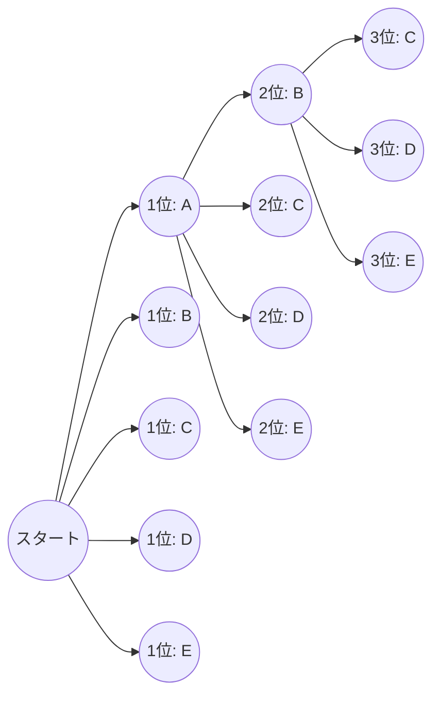
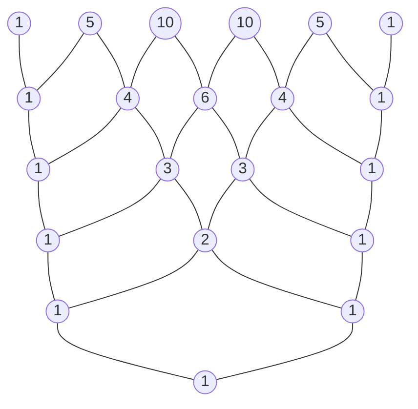

# はじめに

数学の世界において、場合の数を論理的に数え上げる「順列」と「組合せ」は、確率論や統計学、さらには計算機科学のアルゴリズムに至るまで、幅広い分野の基礎となる非常に重要な概念です。そして、これらの基礎的な概念を代数学の領域へと拡張した先に現れるのが「二項定理」であり、その係数の並びを視覚的かつ幾何学的に表現したものが「[パスカル](https://kenji.blog/p/pascal/)の三角形」です。一見するとそれぞれ独立した数学のトピックに見えるかもしれませんが、深く学んでいくと、これらが驚くほど密接に絡み合い、一つの巨大で美しい数学的構造を形作っていることに気がつきます。

この記事では、順列と組合せの直感的な理解と基本的な計算方法から出発し、より複雑な重複順列や円順列、さらには重複組合せについて詳しく解説します。そして、そこから二項定理の公式とその美しい対称性を導き出し、最終的には[パスカル](https://kenji.blog/p/pascal/)の三角形に隠された神秘的な性質や、自然界の法則を記述する[フィボナッチ](https://kenji.blog/p/fibonacci/)数列とのつながり、フラクタル構造といった深遠なテーマまでを、余すところなく掘り下げていきます。数学の持つ「美しさ」と「規則性」を存分に味わう旅へ出かけましょう。

# 順列 (Permutations) とは

順列とは、異なる $n$ 個の要素の中から $r$ 個を選んで、 **順序をつけて** 並べる方法のことを指します。順列において最も重要なポイントは、「並び順が異なれば、それは全く別のものとして扱われる」という点です。例えば、カード「A」「B」「C」から2枚を選んで並べるとき、「A-B」と「B-A」は異なる順列として数えられます。

## 順列の公式

異なる $n$ 個の中から $r$ 個を選ぶ順列の総数は、記号 $_n\text{P}_r$ で表され、以下の数式で計算されます。

$$
_n\text{P}_r = \frac{n!}{(n-r)!}
$$

ここで、$n!$ は $n$ の階乗を表し、$n! = n \times (n-1) \times \dots \times 2 \times 1$ です。階乗は、ある数のすべての要素を並べ替える方法の総数を示しています。

## 具体例：徒競走の順位と座席の配置

例えば、5人の生徒（A, B, C, D, E）で徒競走をしたとき、1位から3位までの結果が何通りあるかを論理的に考えてみましょう。

- 1位になる可能性があるのは、5人のうちの誰か（5通り）
- 2位になる可能性があるのは、1位になった生徒を除いた残り4人の誰か（4通り）
- 3位になる可能性があるのは、1位と2位になった生徒を除いた残り3人の誰か（3通り）

このとき、それぞれの場合が独立して連続して起こるため、積の法則を用いて以下のように計算します。

$$
_5\text{P}_3 = 5 \times 4 \times 3 = 60 \text{ 通り}
$$

これを先ほどの階乗を用いた公式に当てはめると、$_5\text{P}_3 = \frac{5!}{(5-3)!} = \frac{120}{2} = 60$ となり、直感的な計算と厳密な公式が完全に一致することが確認できます。

# 重複順列と円順列

順列の概念を少し拡張すると、日常生活で頻繁に遭遇する様々な問題を解決することができます。ここでは、代表的な応用例である「重複順列」と「円順列」について解説します。

## 重複順列 (Permutations with Repetition)

要素を選ぶ際に、同じ要素を何度でも繰り返し選んでよい場合の順列を **重複順列** と呼びます。
異なる $n$ 個のものから重複を許して $r$ 個を取り出して並べる順列の総数は、非常にシンプルな公式で表されます。

$$
n^r
$$

たとえば、4桁の暗証番号（0から9までの10種類の数字を使用）を設定する場合を考えます。各桁には0から9までの10通りの選択肢があり、同じ数字を何度使っても構いません。したがって、設定できる暗証番号の総数は以下のようになります。

$$
10^4 = 10 \times 10 \times 10 \times 10 = 10000 \text{ 通り}
$$

デジタルのパスワードや、コインの裏表（2種類）を複数回投げる結果の数え上げなどは、すべてこの重複順列の考え方に基づいています。

## 円順列 (Circular Permutations)

一列に並べるのではなく、円形に並べる場合の順列を **円順列** と呼びます。円順列の特徴は、「回転させて同じになる並び方は1通りとして数える」という点です。

異なる $n$ 個のものを円形に並べる順列の総数は、以下の式で計算されます。

$$
(n - 1)!
$$

なぜ $(n-1)!$ になるのでしょうか。それは、$n$ 個の要素を円形に並べた場合、どの要素から見始めるかによって $n$ 通りの見方があるからです。したがって、一列に並べる通常の順列 $n!$ を $n$ で割ることで、$(n-1)!$ が導かれます。

たとえば、5人が円卓に座る方法は何通りあるでしょうか。
$$
(5 - 1)! = 4! = 4 \times 3 \times 2 \times 1 = 24 \text{ 通り}
$$
回転対称性を考慮することで、場合の数は劇的に減少します。この概念は、分子の立体構造を考える化学の分野や、ネットワークのリング型トポロジの解析などでも応用されます。

# 組合せ (Combinations) とは

順列が並べる「順序」を重視したのに対し、組合せは「どの要素が選ばれたか」という集合の構成のみに注目します。つまり、組合せにおいては **順序は考慮しません** 。選ばれた要素のメンバーが同じであれば、どのように並んでいても同じ1つの組合せとして扱われます。

## 組合せの公式

異なる $n$ 個の中から $r$ 個を選ぶ組合せの総数は、記号 $_n\text{C}_r$ または二項係数の記法 $\binom{n}{r}$ で表され、以下の数式で計算されます。

$$
_n\text{C}_r = \binom{n}{r} = \frac{_n\text{P}_r}{r!} = \frac{n!}{r!(n-r)!}
$$

この公式の背後にある論理は非常に鮮やかです。まず、順序を考慮して $r$ 個を選ぶ方法（順列 $_n\text{P}_r$）を計算します。しかし、選ばれた $r$ 個の要素は、その中で $r!$ 通りの並べ方が可能です。組合せではこれらをすべて同一視するため、総数を $r!$ で割って重複を排除しているのです。

## 具体例：プロジェクトチームの結成

ある部署に所属する8人の社員の中から、新規プロジェクトを立ち上げるための3人のメンバーを選ぶ方法は何通りあるでしょうか。
メンバー内の役割に明確な区別がない場合、選ばれる順序は関係ないため、これは組合せの問題となります。

$$
_8\text{C}_3 = \frac{8!}{3!(8-3)!} = \frac{8 \times 7 \times 6}{3 \times 2 \times 1} = 56 \text{ 通り}
$$

選ばれた3人が $\{A, B, C\}$ であっても $\{B, C, A\}$ であっても、プロジェクトチームとしては完全に同一であるため、1通りと数えられます。組合せの考え方は、宝くじの当選確率の計算や、トランプのポーカーの役の確率計算など、不確実性を伴う事象の解析において不可欠なツールです。

# 重複組合せ (Combinations with Repetition)

順列に重複順列があったように、組合せにも **重複組合せ** が存在します。これは、異なる $n$ 種類のものから、重複を許して $r$ 個を選ぶ方法の数を指し、記号 $_n\text{H}_r$ で表されることが一般的です。

## 重複組合せの計算と「丸と仕切り」のモデル

重複組合せは、直接計算することが難しいため、通常は通常の組合せの問題に変換して解きます。その変換の総数は以下の公式で与えられます。

$$
_n\text{H}_r = _{n+r-1}\text{C}_r = \frac{(n+r-1)!}{r!(n-1)!}
$$

この公式を直感的に理解するための非常に優れたモデルが「丸 (o) と仕切り (|)」のモデルです。

たとえば、リンゴ、ミカン、バナナの3種類の果物から、重複を許して5個の果物を買う方法は何通りあるでしょうか。（選ばない果物があってもよいとします）。
ここでは、$n=3$ 種類の果物から $r=5$ 個を選びます。

これを、5個の「丸」と、3種類の果物を分けるための $3-1 = 2$ 個の「仕切り」を一列に並べる問題に置き換えます。

例： `o o | o | o o` 
これは、左から「リンゴ2個、ミカン1個、バナナ2個」を選んだことを意味します。
例： `| o o o | o o`
これは、「リンゴ0個、ミカン3個、バナナ2個」を意味します。

つまり、合計 $5 + 2 = 7$ 個の場所から、丸を置く5つの場所を選ぶ（あるいは仕切りを置く2つの場所を選ぶ）組合せに等しいのです。

$$
_3\text{H}_5 = _{3+5-1}\text{C}_5 = _7\text{C}_5 = _7\text{C}_2 = \frac{7 \times 6}{2 \times 1} = 21 \text{ 通り}
$$

この「丸と仕切り」のアプローチは、一見複雑に見える問題を、視覚的かつ単純な構造に還元する数学の強力な抽象化能力を示しています。

# 二項定理 (Binomial Theorem) とその展開

ここまで学んできた順列と組合せの知識は、代数学の根幹を成す定理の一つである「二項定理」を理解するための完璧な準備となります。二項定理は、$(x + y)^n$ という二つの項の和の累乗を、多項式として完全に展開するための公式です。

## 二項定理の公式

任意の正の整数 $n$ に対して、以下の等式が必ず成り立ちます。

$$
(x + y)^n = \sum_{k=0}^{n} \binom{n}{k} x^{n-k} y^k
$$

あるいは、展開された形で書くと以下のようになります。

$$
(x + y)^n = \binom{n}{0}x^n y^0 + \binom{n}{1}x^{n-1} y^1 + \binom{n}{2}x^{n-2} y^2 + \dots + \binom{n}{n}x^0 y^n
$$

展開したときの各項の係数は、組合せ $\binom{n}{k}$ （すなわち $_n\text{C}_k$）と完全に一致します。そのため、これらの係数は特別に **二項係数** と呼ばれます。

## 二項定理の直感的な証明と組合せとの関連

なぜ二項式の展開に、場合の数である組合せが現れるのでしょうか。$(x + y)^3$ の展開を例にして、その直感的な理由を探ってみましょう。

$$
(x + y)^3 = (x + y)(x + y)(x + y)
$$

この式を展開するという行為は、分配法則に従って、3つの括弧 $(x+y)$ のそれぞれから $x$ または $y$ のどちらか一つを選び、それらを掛け合わせたすべてのパターンを足し合わせることを意味します。

- **$x^3$ の項を作るには** ：3つの括弧すべてから $x$ を選ばなければなりません。そのような選び方は $\binom{3}{0} = 1$ 通りです。
- **$x^2y$ の項を作るには** ：3つの括弧のうち2つから $x$ を選び、残り1つから $y$ を選ぶ必要があります。3つの括弧の中から $y$ を選ぶ1つを決める方法は $\binom{3}{1} = 3$ 通りです。
- **$xy^2$ の項を作るには** ：3つの括弧のうち1つから $x$ を選び、残り2つから $y$ を選びます。$y$ を選ぶ2つの括弧を決める方法は $\binom{3}{2} = 3$ 通りです。
- **$y^3$ の項を作るには** ：3つの括弧すべてから $y$ を選びます。選び方は $\binom{3}{3} = 1$ 通りです。

したがって、これらをすべて足し合わせると、次のようになります。

$$
(x + y)^3 = 1x^3 + 3x^2y + 3xy^2 + 1y^3
$$

一般化すれば、「$n$ 個の括弧の掛け算において、$y$ を $k$ 個選ぶ（同時に $x$ を $n-k$ 個選ぶ）方法の総数はいくつか」という問いに対する答えが、まさに $\binom{n}{k}$ となるのです。代数的な展開式と組合せ論が、ここで見事に交差します。

# [パスカル](https://kenji.blog/p/pascal/)の三角形：美しき数の幾何学

二項定理の展開式に現れる二項係数を、上から $n=0, 1, 2, \dots$ の順にピラミッド状に並べたものを「[パスカル](https://kenji.blog/p/pascal/)の三角形 ([Pascal](https://kenji.blog/p/pascal/)'s Triangle)」と呼びます。この単純な構造の三角形は、単なる計算の補助ツールという枠を遥かに超え、数え切れないほどの美しく深い数学的性質をその内に秘めています。

## [パスカル](https://kenji.blog/p/pascal/)の三角形の構築ルール

[パスカル](https://kenji.blog/p/pascal/)の三角形は、一番上の頂点（0段目）に $1$ を置くことから始まります。それ以降の行は、両端には常に $1$ を配置し、内側の数はすべて「左上の数と右上の数を足し合わせたもの」になるという、極めてシンプルなルールで構築されます。

上から $n$ 段目（頂点を 0 段目とする）、左から $k$ 番目（左端を 0 番目とする）に配置されている数は、まさしく二項係数 $\binom{n}{k}$ に対応しています。左上の数 $\binom{n-1}{k-1}$ と右上の数 $\binom{n-1}{k}$ を足すと、下の数 $\binom{n}{k}$ になるという構造は、[パスカル](https://kenji.blog/p/pascal/)の法則 ([Pascal](https://kenji.blog/p/pascal/)'s Rule) と呼ばれる以下の重要な等式を幾何学的に表現しています。

$$
\binom{n}{k} = \binom{n-1}{k-1} + \binom{n-1}{k}
$$

## [パスカル](https://kenji.blog/p/pascal/)の三角形に隠された驚くべき性質

[パスカル](https://kenji.blog/p/pascal/)の三角形をじっくりと観察すると、そこに無数の規則性が隠されていることに気がつきます。そのうちのいくつかを紹介しましょう。

### 1. 完璧な対称性 (Symmetry)

各行の数は、中央を軸にして完全に左右対称になっています。これは組合せの基本的な性質である $\binom{n}{k} = \binom{n}{n-k}$ を直接的に反映したものです。論理的に考えれば、$n$ 個の中から選ぶ $k$ 個を決定するということは、同時に「選ばれない $n-k$ 個」を決定することと完全に等価であるため、当然の結果と言えます。

### 2. 各行の和と2の累乗 (Sum of Rows and Powers of 2)

任意の $n$ 段目の数字をすべて横に足し合わせると、その合計は必ず $2^n$ になります。

- 0段目: $1 = 2^0$
- 1段目: $1 + 1 = 2 = 2^1$
- 2段目: $1 + 2 + 1 = 4 = 2^2$
- 3段目: $1 + 3 + 3 + 1 = 8 = 2^3$
- 4段目: $1 + 4 + 6 + 4 + 1 = 16 = 2^4$

これは、二項定理 $(x+y)^n = \sum \binom{n}{k} x^{n-k} y^k$ において、$x=1, y=1$ を代入することで得られる方程式 $(1+1)^n = \sum \binom{n}{k}$ から、代数的に容易に証明することができます。集合論の視点から言えば、$n$ 個の要素を持つ集合の「すべての部分集合の数」が $2^n$ であることを示しています。

### 3. [フィボナッチ](https://kenji.blog/p/fibonacci/)数列との隠された繋がり (The [Fibonacci](https://kenji.blog/p/fibonacci/) Connection)

[パスカル](https://kenji.blog/p/pascal/)の三角形の数を「浅い斜めの対角線」に沿って足し合わせてみてください。すると、驚くべきことに数列 $1, 1, 2, 3, 5, 8, 13, 21, \dots$ が現れます。
これは、前の2つの数を足して次の数を作る **[フィボナッチ](https://kenji.blog/p/fibonacci/)数列** に他なりません。ヒマワリの種の配列やオウムガイの殻の螺旋など、自然界のあらゆる場所に現れる神秘的な数列が、組合せを並べただけの三角形の中に深く埋め込まれているのです。人間の論理的思考の産物である数学が、いかに自然の摂理と結びついているかを示す、非常に美しく感動的な例です。

### 4. フラクタル構造：シェルピンスキーのギャスケット (Fractal Geometry)

[パスカル](https://kenji.blog/p/pascal/)の三角形を何十段、何百段と巨大に拡張し、その中の「奇数」を黒く塗りつぶし、「偶数」を白抜きにしてみてください。すると、そこには「シェルピンスキーのギャスケット」と呼ばれる自己相似的なフラクタル図形が鮮明に浮かび上がります。
全体を拡大しても縮小しても、無限に同じ三角形のパターンが繰り返されるこの構造は、数論と幾何学、そして[カオス理論](https://kenji.blog/p/chaos-theory/)をつなぐ架け橋となっています。

# 多項定理 (Multinomial Theorem) への拡張

二項定理は $(x+y)^n$ の展開でしたが、これを3つ以上の項の和、例えば $(x+y+z)^n$ や $(x_1 + x_2 + \dots + x_m)^n$ の展開へと一般化したものが **多項定理** です。

多項定理の展開式における各項の係数は、多項係数と呼ばれ、以下の式で計算されます。

$$
\frac{n!}{k_1! k_2! \dots k_m!} \quad (\text{ただし } k_1 + k_2 + \dots + k_m = n)
$$

この多項係数は、単なる代数的な展開係数であるだけでなく、「$n$ 個の異なるアイテムを、それぞれ $k_1$ 個、$k_2$ 個、…、$k_m$ 個のグループに分割する方法の総数」を意味しています。
二項定理が基礎となり、さらに高次元の組合せ論的構造へと自然に拡張されていく過程は、数学という体系の持つ拡張性と一貫性を見事に体現しています。

# 二項分布 (Binomial Distribution)：確率論への応用

ここまで純粋数学としての順列や二項定理を扱ってきましたが、これらの概念は現実世界の問題をモデリングする「確率論」や「統計学」において極めて実用的な力を発揮します。その代表例が **二項分布** です。

二項分布は、「成功」か「失敗」のどちらかの結果しか生じない独立した試行（ベルヌーイ試行）を $n$ 回繰り返したときに、「成功」がちょうど $k$ 回起こる確率を記述する確率分布です。
1回の試行で成功する確率を $p$、失敗する確率を $q = 1 - p$ とすると、ちょうど $k$ 回成功する確率 $P(X=k)$ は次のように表されます。

$$
P(X=k) = \binom{n}{k} p^k q^{n-k}
$$

この確率質量の式の中に、二項係数 $\binom{n}{k}$ がそのまま現れています。これは、$n$ 回の試行のうち、どの $k$ 回で成功するかを選ぶ組合せの数が $\binom{n}{k}$ 通りあるためです。
コイントスの確率計算から、工場での不良品の発生確率の予測、さらには医療における新薬の効果測定に至るまで、二項分布は現代社会のあらゆるデータ分析の根底を支えています。

# まとめ

本記事では、単純な「数え上げ」のルールである順列と組合せから始まり、重複順列や円順列への応用、さらには代数学の二項定理への拡張、そして[パスカル](https://kenji.blog/p/pascal/)の三角形の視覚的探求に至るまで、広大な数学の風景を旅してきました。

「異なるものからいくつかを選ぶ」という極めてシンプルで原始的な行為を、数学という厳密な言語を用いて抽象化し掘り下げることで、完全な対称性、2の累乗の法則、自然界を記述する[フィボナッチ](https://kenji.blog/p/fibonacci/)数列、そして無限のフラクタル構造といった、予想もつかないほど豊かで美しい数学的世界が広がっていることが明らかになりました。

数学の公式や定理は、単にテストの問題を解くための無機質な道具ではありません。それらは、私たちを取り巻く世界の背後にある目に見えない秩序や、数たちが織りなす圧倒的に美しい関係性を表現した、人類の至高の芸術作品でもあるのです。順列や組合せ、[パスカル](https://kenji.blog/p/pascal/)の三角形が示すこの美しい数の規則性に触れることで、数学という学問の持つ真の魅力と奥深さを感じ取っていただければ幸いです。
