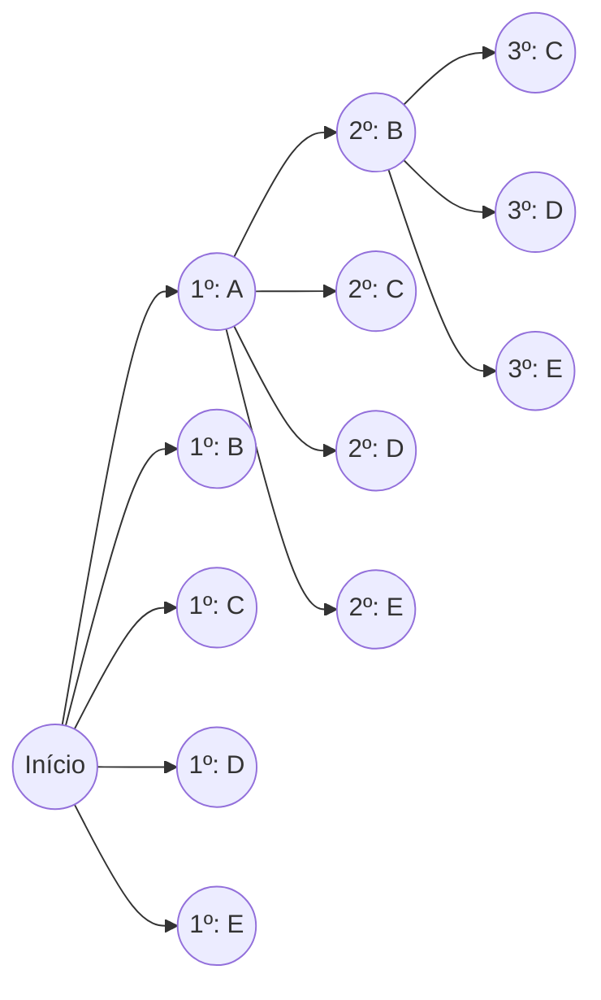
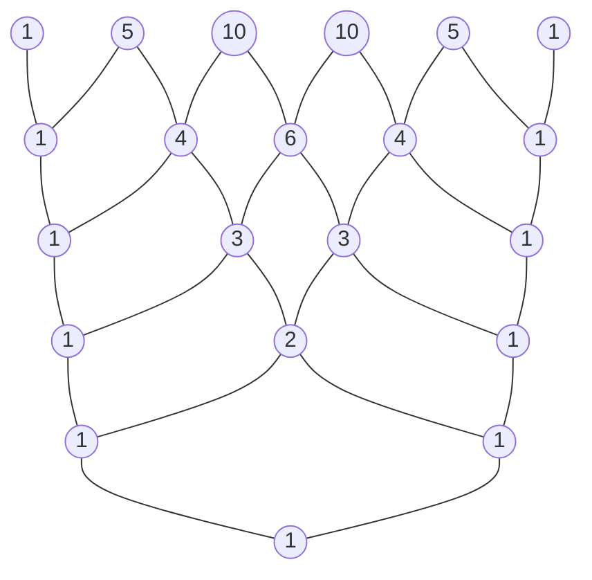

# Introdução

No mundo da matemática, as "permutações" e "combinações" — métodos para contar logicamente o número de resultados possíveis — são conceitos fundamentais cruciais em uma ampla gama de campos, desde a probabilidade e estatística até os algoritmos da ciência da computação. Estender esses conceitos fundamentais para o reino da álgebra nos leva ao "Teorema Binomial", e representar visual e geometricamente a sequência de seus coeficientes produz o "Triângulo de Pascal". À primeira vista, esses podem parecer tópicos matemáticos independentes, mas ao estudá-los profundamente, você percebe que eles estão surpreendentemente entrelaçados, formando uma única, maciça e bela estrutura matemática.

Neste artigo, começaremos com uma compreensão intuitiva e os métodos básicos de cálculo para permutações e combinações, e então explicaremos em detalhes conceitos mais complexos como permutações com repetição, permutações circulares e combinações com repetição. A partir daí, derivaremos a fórmula do Teorema Binomial e sua bela simetria, e finalmente mergulharemos a fundo em temas profundos como as propriedades misteriosas escondidas no Triângulo de Pascal, sua conexão com a sequência de [Fibonacci](https://kenji.blog/pt/p/fibonacci/) que descreve as leis da natureza e estruturas fractais. Vamos embarcar em uma jornada para apreciar plenamente a "beleza" e a "regularidade" da matemática.

# O que são Permutações?

Uma permutação refere-se ao método de escolher $r$ elementos a partir de $n$ elementos distintos e organizá-los **com uma ordem específica**. O ponto mais importante nas permutações é que "se a ordem for diferente, é tratado como um arranjo completamente diferente". Por exemplo, ao escolher e organizar duas cartas de "A", "B" e "C", "A-B" e "B-A" são contadas como permutações diferentes.

## Fórmula da Permutação

O número total de permutações ao escolher $r$ elementos a partir de $n$ elementos distintos é representado pelo símbolo $_n\text{P}_r$ e calculado usando a seguinte fórmula matemática:

$$
_n\text{P}_r = \frac{n!}{(n-r)!}
$$

Aqui, $n!$ representa o fatorial de $n$, e $n! = n \times (n-1) \times \dots \times 2 \times 1$. O fatorial indica o número total de maneiras de reorganizar todos os elementos de um determinado número.

## Exemplo Concreto: Classificações de Corridas e Arranjos de Assentos

Por exemplo, vamos considerar logicamente quantos resultados possíveis existem para o 1º ao 3º lugar quando 5 alunos (A, B, C, D, E) correm uma corrida.

- A pessoa em potencial para o 1º lugar é qualquer um dos 5 alunos (5 maneiras)
- A pessoa em potencial para o 2º lugar é qualquer um dos 4 alunos restantes, excluindo o vencedor do 1º lugar (4 maneiras)
- A pessoa em potencial para o 3º lugar é qualquer um dos 3 alunos restantes, excluindo os vencedores do 1º e 2º lugares (3 maneiras)

Como cada um desses casos acontece de forma independente e consecutiva, nós calculamos da seguinte maneira usando a regra do produto:

$$
_5\text{P}_3 = 5 \times 4 \times 3 = 60 \text{ maneiras}
$$

Quando aplicamos isso à fórmula usando fatoriais mencionada anteriormente, obtemos $_5\text{P}_3 = \frac{5!}{(5-3)!} = \frac{120}{2} = 60$, confirmando que nosso cálculo intuitivo corresponde perfeitamente à fórmula estrita.

# Permutações com Repetição e Permutações Circulares

Ao estender levemente o conceito de permutações, podemos resolver vários problemas frequentemente encontrados na vida diária. Aqui, explicaremos as "permutações com repetição" e "permutações circulares", que são exemplos típicos de aplicação.

## Permutações com Repetição

Ao escolher elementos, uma permutação em que você tem permissão para escolher o mesmo elemento repetidamente qualquer número de vezes é chamada de **permutação com repetição**.
O número total de permutações ao pegar $r$ elementos de $n$ tipos distintos permitindo a repetição é expresso por uma fórmula muito simples:

$$
n^r
$$

Por exemplo, considere configurar um PIN de 4 dígitos (usando 10 tipos de números de 0 a 9). Cada dígito tem 10 opções de 0 a 9, e você pode usar o mesmo número quantas vezes quiser. Portanto, o número total de PINs possíveis a serem configurados é o seguinte:

$$
10^4 = 10 \times 10 \times 10 \times 10 = 10000 \text{ maneiras}
$$

Senhas digitais e a contagem dos resultados do lançamento de uma moeda, cara ou coroa (2 tipos), várias vezes são todas baseadas neste conceito de permutações com repetição.

## Permutações Circulares

Uma permutação em que as coisas são organizadas não em linha reta, mas em círculo, é chamada de **permutação circular**. A característica de uma permutação circular é que "arranjos que se tornam iguais ao serem rotacionados são contados como 1 maneira".

O número total de permutações ao organizar $n$ itens distintos em um círculo é calculado pela seguinte fórmula:

$$
(n - 1)!
$$

Por que é $(n-1)!$? Isso ocorre porque quando $n$ elementos são organizados em um círculo, existem $n$ maneiras de visualizá-lo dependendo de qual elemento você começa a olhar. Portanto, dividindo a permutação normal organizada em uma linha $n!$ por $n$, nós deduzimos $(n-1)!$.

Por exemplo, quantas maneiras existem para 5 pessoas se sentarem a uma mesa redonda?
$$
(5 - 1)! = 4! = 4 \times 3 \times 2 \times 1 = 24 \text{ maneiras}
$$
Ao considerar a simetria rotacional, o número de casos diminui drasticamente. Este conceito também é aplicado em áreas como a química para considerar a estrutura tridimensional das moléculas e na análise de topologias de anel de redes.

# O que são Combinações?

Enquanto as permutações enfatizam a "ordem" do arranjo, as combinações focam apenas na composição do conjunto, ou seja, "quais elementos foram escolhidos". Em outras palavras, nas combinações, **a ordem não é considerada**. Se os membros dos elementos escolhidos forem os mesmos, eles são tratados como a mesma combinação única, independentemente de como estejam arranjados.

## Fórmula da Combinação

O número total de combinações ao escolher $r$ elementos a partir de $n$ elementos distintos é representado pelo símbolo $_n\text{C}_r$ ou a notação de coeficiente binomial $\binom{n}{r}$, e calculado usando a seguinte fórmula matemática:

$$
_n\text{C}_r = \binom{n}{r} = \frac{_n\text{P}_r}{r!} = \frac{n!}{r!(n-r)!}
$$

A lógica por trás desta fórmula é muito elegante. Primeiro, calculamos o número de maneiras de escolher $r$ elementos considerando a ordem (permutação $_n\text{P}_r$). No entanto, os $r$ elementos escolhidos podem ser organizados de $r!$ maneiras entre si. Como as combinações identificam todos esses arranjos como sendo os mesmos, dividimos o número total por $r!$ para eliminar duplicatas.

## Exemplo Concreto: Formando uma Equipe de Projeto

Quantas maneiras existem para escolher 3 membros para lançar um novo projeto entre 8 funcionários pertencentes a um certo departamento?
Se não houver uma distinção clara de funções entre os membros, a ordem na qual eles são escolhidos não importa, tornando este um problema de combinação.

$$
_8\text{C}_3 = \frac{8!}{3!(8-3)!} = \frac{8 \times 7 \times 6}{3 \times 2 \times 1} = 56 \text{ maneiras}
$$

Mesmo que as 3 pessoas escolhidas sejam $\{A, B, C\}$ ou $\{B, C, A\}$, elas são completamente idênticas como equipe de projeto, então são contadas como 1 maneira. O conceito de combinações é uma ferramenta indispensável na análise de eventos que envolvem incertezas, como calcular probabilidades de ganhar na loteria ou as probabilidades de mãos de pôquer nas cartas.

# Combinações com Repetição

Assim como as permutações têm permutações com repetição, as combinações também têm **combinações com repetição**. Isso se refere ao número de maneiras de escolher $r$ itens de $n$ tipos distintos permitindo repetição, e é geralmente representado pelo símbolo $_n\text{H}_r$.

## Calculando Combinações com Repetição e o Modelo "Estrelas e Barras"

Como as combinações com repetição são difíceis de calcular diretamente, elas são geralmente convertidas em problemas de combinação padrão para serem resolvidas. O número total após a conversão é dado pela seguinte fórmula:

$$
_n\text{H}_r = _{n+r-1}\text{C}_r = \frac{(n+r-1)!}{r!(n-1)!}
$$

Um modelo excelentemente intuitivo para entender esta fórmula é o modelo "estrelas e barras" (círculos e divisórias).

Por exemplo, quantas maneiras existem para comprar 5 frutas de 3 tipos de frutas: maçãs, laranjas e bananas, permitindo repetição? (Assumindo que não há problema se algumas frutas não forem escolhidas).
Aqui, nós escolhemos $r=5$ itens de $n=3$ tipos de fruta.

Substituímos isso pelo problema de organizar 5 "círculos" e $3-1 = 2$ "divisórias" usadas para separar os 3 tipos de fruta em uma linha.

Exemplo: `o o | o | o o`
Isso significa escolher "2 maçãs, 1 laranja e 2 bananas" a partir da esquerda.
Exemplo: `| o o o | o o`
Isso significa "0 maçãs, 3 laranjas e 2 bananas".

Em outras palavras, é igual à combinação de escolher 5 lugares para colocar círculos (ou 2 lugares para colocar divisórias) de um total de $5 + 2 = 7$ lugares.

$$
_3\text{H}_5 = _{3+5-1}\text{C}_5 = _7\text{C}_5 = _7\text{C}_2 = \frac{7 \times 6}{2 \times 1} = 21 \text{ maneiras}
$$

Essa abordagem de "estrelas e barras" demonstra a poderosa capacidade de abstração da matemática de reduzir problemas aparentemente complexos em estruturas visuais e simples.

# O Teorema Binomial e sua Expansão

O conhecimento sobre permutações e combinações que aprendemos até agora serve como preparação perfeita para compreender o "Teorema Binomial", um dos teoremas fundamentais da álgebra. O Teorema Binomial é uma fórmula para expandir perfeitamente a potência da soma de dois termos, como $(x + y)^n$, em um polinômio.

## Fórmula do Teorema Binomial

Para qualquer número inteiro positivo $n$, a seguinte igualdade é sempre verdadeira:

$$
(x + y)^n = \sum_{k=0}^{n} \binom{n}{k} x^{n-k} y^k
$$

Alternativamente, escrevendo de forma expandida:

$$
(x + y)^n = \binom{n}{0}x^n y^0 + \binom{n}{1}x^{n-1} y^1 + \binom{n}{2}x^{n-2} y^2 + \dots + \binom{n}{n}x^0 y^n
$$

O coeficiente de cada termo ao ser expandido corresponde perfeitamente à combinação $\binom{n}{k}$ (isto é, $_n\text{C}_k$). Devido a isso, esses coeficientes são especificamente chamados de **coeficientes binomiais**.

## Prova Intuitiva do Teorema Binomial e Relação com as Combinações

Por que as combinações, que são contagens de casos, aparecem na expansão de binômios? Vamos explorar a razão intuitiva usando a expansão de $(x + y)^3$ como exemplo.

$$
(x + y)^3 = (x + y)(x + y)(x + y)
$$

O ato de expandir esta expressão significa escolher $x$ ou $y$ de cada um dos 3 parênteses $(x+y)$ de acordo com a lei distributiva, multiplicá-los e somar todos os padrões.

- **Para criar o termo $x^3$** : Você deve escolher $x$ de todos os 3 parênteses. O número de maneiras de fazer essa escolha é $\binom{3}{0} = 1$ maneira.
- **Para criar o termo $x^2y$** : Você precisa escolher $x$ de 2 dos 3 parênteses e $y$ no 1 restante. O número de maneiras de decidir de qual 1 parêntese escolher $y$ é $\binom{3}{1} = 3$ maneiras.
- **Para criar o termo $xy^2$** : Você escolhe $x$ de 1 dos 3 parênteses e $y$ nos 2 restantes. O número de maneiras de decidir os 2 parênteses dos quais escolher $y$ é $\binom{3}{2} = 3$ maneiras.
- **Para criar o termo $y^3$** : Você escolhe $y$ de todos os 3 parênteses. O número de maneiras é $\binom{3}{3} = 1$ maneira.

Portanto, somar tudo isso resulta no seguinte:

$$
(x + y)^3 = 1x^3 + 3x^2y + 3xy^2 + 1y^3
$$

Generalizando isso, a resposta para a pergunta "Na multiplicação de $n$ parênteses, qual é o número total de maneiras de escolher $k$ vezes $y$ (e simultaneamente $n-k$ vezes $x$)?" é exatamente $\binom{n}{k}$. As fórmulas de expansão algébrica e a combinatória se cruzam belamente aqui.

# O Triângulo de Pascal: A Bela Geometria dos Números

Organizar os coeficientes binomiais que aparecem na fórmula de expansão do Teorema Binomial em forma de pirâmide de cima para baixo como $n=0, 1, 2, \dots$ é chamado de "Triângulo de Pascal". Este triângulo de estrutura simples vai muito além de ser um mero auxílio de cálculo, guardando em seu interior inúmeras propriedades matemáticas belas e profundas.

## Regras de Construção do Triângulo de Pascal

O Triângulo de Pascal começa colocando um $1$ no vértice mais alto (linha 0). Para as linhas a seguir, os $1$s são sempre colocados em ambas as extremidades, e todos os números internos são construídos de acordo com uma regra extremamente simples: "a soma do número acima à esquerda e do número acima à direita".

O número localizado na $n$-ésima linha a partir do topo (sendo o vértice a linha 0) e na $k$-ésima posição a partir da esquerda (sendo a borda esquerda a posição 0) corresponde exatamente ao coeficiente binomial $\binom{n}{k}$. A estrutura onde a soma do número acima à esquerda $\binom{n-1}{k-1}$ e do número acima à direita $\binom{n-1}{k}$ é igual ao número abaixo $\binom{n}{k}$ representa geometricamente a seguinte importante equação chamada Regra de Pascal:

$$
\binom{n}{k} = \binom{n-1}{k-1} + \binom{n-1}{k}
$$

## Propriedades Surpreendentes Escondidas no Triângulo de Pascal

Se você observar atentamente o Triângulo de Pascal, notará que inúmeras regularidades estão ocultas nele. Vamos introduzir algumas delas.

### 1. Simetria Perfeita

Os números em cada linha são perfeitamente simétricos horizontalmente através do eixo central. Isso reflete diretamente a propriedade fundamental das combinações, $\binom{n}{k} = \binom{n}{n-k}$. Pensando logicamente, decidir quais $k$ itens escolher de $n$ é completamente equivalente a decidir simultaneamente os "$n-k$ itens não escolhidos", portanto, esse é um resultado natural.

### 2. Soma das Linhas e Potências de 2

Se você somar horizontalmente todos os números em qualquer $n$-ésima linha dada, o total sempre será $2^n$.

- Linha 0: $1 = 2^0$
- Linha 1: $1 + 1 = 2 = 2^1$
- Linha 2: $1 + 2 + 1 = 4 = 2^2$
- Linha 3: $1 + 3 + 3 + 1 = 8 = 2^3$
- Linha 4: $1 + 4 + 6 + 4 + 1 = 16 = 2^4$

Isso pode ser facilmente provado algebricamente a partir da equação $(1+1)^n = \sum \binom{n}{k}$, obtida ao substituir $x=1, y=1$ no Teorema Binomial $(x+y)^n = \sum \binom{n}{k} x^{n-k} y^k$. De uma perspectiva da teoria dos conjuntos, indica que o "número de todos os subconjuntos" de um conjunto com $n$ elementos é $2^n$.

### 3. A Conexão Oculta com a Sequência de [Fibonacci](https://kenji.blog/pt/p/fibonacci/)

Tente adicionar os números do Triângulo de Pascal ao longo de "linhas diagonais rasas". Surpreendentemente, a sequência $1, 1, 2, 3, 5, 8, 13, 21, \dots$ aparece.
Isso não é nada menos que a **Sequência de [Fibonacci](https://kenji.blog/pt/p/fibonacci/)**, onde você soma os dois números anteriores para compor o próximo. A sequência mística que aparece em todos os lugares da natureza, como o arranjo das sementes de girassol e a espiral da concha de um náutilo, está profundamente embutida em um triângulo que simplesmente organiza combinações. É um exemplo muito bonito e comovente que mostra como a matemática, um produto do pensamento lógico humano, está ligada à providência da natureza.

### 4. Geometria Fractal: Triângulo de Sierpinski

Tente expandir o Triângulo de Pascal enormemente para dezenas ou centenas de linhas, pintando os "números ímpares" de preto por dentro e deixando os "números pares" em branco. Então, uma figura fractal autossimilar chamada "Triângulo de Sierpinski" surge claramente.
Essa estrutura, onde o mesmo padrão triangular se repete infinitamente, não importa se você aproxima ou afasta o zoom no todo, serve como uma ponte conectando a teoria dos números, a geometria e a teoria do caos.

# Extensão ao Teorema Multinomial

O Teorema Binomial foi a expansão de $(x+y)^n$, mas generalizar isso para a expansão da soma de três ou mais termos, como $(x+y+z)^n$ ou $(x_1 + x_2 + \dots + x_m)^n$, é o **Teorema Multinomial**.

Os coeficientes de cada termo na fórmula de expansão do Teorema Multinomial são chamados de coeficientes multinomiais, calculados pela seguinte fórmula:

$$
\frac{n!}{k_1! k_2! \dots k_m!} \quad (\text{onde } k_1 + k_2 + \dots + k_m = n)
$$

Esses coeficientes multinomiais não são apenas coeficientes de expansão algébrica, mas significam "o número total de maneiras de dividir $n$ itens distintos em grupos de $k_1, k_2, \dots, k_m$ itens respectivamente".
O processo no qual o Teorema Binomial serve como base e se estende naturalmente para estruturas combinatórias de dimensão superior incorpora maravilhosamente a capacidade de expansão e consistência que o sistema da matemática possui.

# Distribuição Binomial: Aplicação à Teoria da Probabilidade

Até aqui, lidamos com permutações e o Teorema Binomial como matemática pura, mas esses conceitos demonstram poder extremamente prático na "teoria da probabilidade" e na "estatística" para modelar problemas do mundo real. Um exemplo representativo é a **Distribuição Binomial**.

A distribuição binomial é uma distribuição de probabilidade que descreve a probabilidade de exatamente $k$ "sucessos" ocorrerem quando um teste independente (ensaio de Bernoulli) que só resulta em "sucesso" ou "fracasso" é repetido $n$ vezes.
Se a probabilidade de sucesso em um único teste for $p$, e a probabilidade de fracasso for $q = 1 - p$, então a probabilidade de exatamente $k$ sucessos, $P(X=k)$, é expressa da seguinte forma:

$$
P(X=k) = \binom{n}{k} p^k q^{n-k}
$$

Dentro dessa fórmula de massa de probabilidade, o coeficiente binomial $\binom{n}{k}$ aparece exatamente como é. Isso ocorre porque existem $\binom{n}{k}$ maneiras de escolher quais $k$ testes serão bem-sucedidos dentre os $n$ testes.
Desde o cálculo das probabilidades de jogar uma moeda até prever a probabilidade de ocorrência de produtos com defeito em uma fábrica e até mesmo medir a eficácia de novos medicamentos na medicina, a distribuição binomial apoia os fundamentos de toda análise de dados na sociedade moderna.

# Conclusão

Neste artigo, viajamos através de uma vasta paisagem matemática, partindo das permutações e combinações, que são regras simples de "contagem", para sua aplicação em permutações com repetição e permutações circulares, expandindo-se ainda mais para o Teorema Binomial da álgebra e chegando à exploração visual do Triângulo de Pascal.

Ao abstrair e aprofundar no ato extremamente simples e primitivo de "escolher alguns itens de outros distintos" usando a linguagem rigorosa da matemática, ficou claro que um mundo matemático inimaginavelmente rico e bonito se estende para fora — envolvendo simetria perfeita, a regra das potências de 2, a sequência de [Fibonacci](https://kenji.blog/pt/p/fibonacci/) descrevendo o mundo natural e infinitas estruturas fractais.

As fórmulas matemáticas e teoremas não são meramente ferramentas inorgânicas para resolver problemas de provas. São as obras de arte supremas da humanidade, expressando a ordem invisível por trás do mundo que nos rodeia e as relações avassaladoramente belas tecidas pelos números. Esperamos que, ao entrar em contato com esta bela regularidade dos números mostrada pelas permutações, combinações e o Triângulo de Pascal, você tenha sentido o verdadeiro encanto e a profundidade que a disciplina da matemática possui.
