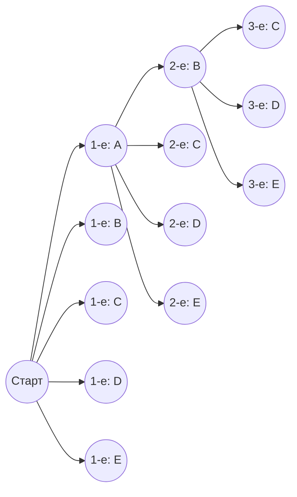
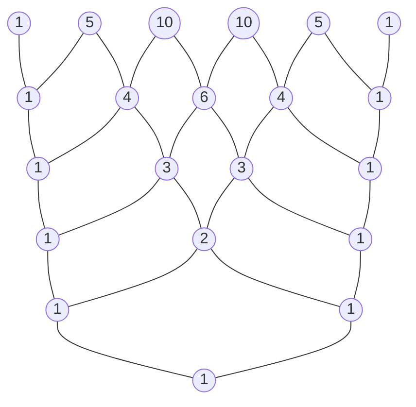

# Введение

В мире математики «перестановки» (или размещения) и «сочетания» — методы логического подсчета числа возможных исходов — являются важнейшими базовыми концепциями в широком спектре областей, от теории вероятностей и статистики до алгоритмов в информатике. Распространение этих фундаментальных концепций на область алгебры приводит нас к «биному Ньютона» (теореме о биноме), а визуальное и геометрическое представление последовательности его коэффициентов создает «треугольник Паскаля». На первый взгляд это может показаться независимыми математическими темами, но при глубоком изучении вы понимаете, что они удивительным образом переплетаются, образуя единую, массивную и прекрасную математическую структуру.

В этой статье мы начнем с интуитивного понимания и базовых методов расчета перестановок и сочетаний, а затем подробно объясним более сложные концепции, такие как размещения с повторениями, круговые перестановки и сочетания с повторениями. Опираясь на это, мы выведем формулу бинома Ньютона и его прекрасную симметрию, и, наконец, глубоко погрузимся в такие серьезные темы, как загадочные свойства, скрытые в треугольнике Паскаля, его связь с последовательностью Фибоначчи, описывающей законы природы, и фрактальные структуры. Давайте отправимся в путешествие, чтобы в полной мере оценить «красоту» и «закономерность» математики.

# Что такое перестановки (размещения)?

Перестановка (в данном контексте речь идет о размещениях) относится к методу выбора $r$ элементов из $n$ различных элементов и расположения их **в определенном порядке**. Самый важный момент в перестановках заключается в том, что «если порядок отличается, это рассматривается как совершенно другой вариант расположения». Например, при выборе и расположении двух карт из «A», «B» и «C», варианты «A-B» и «B-A» считаются разными перестановками.

## Формула числа размещений

Общее число размещений при выборе $r$ элементов из $n$ различных элементов обозначается символом $_n\text{P}_r$ (или $A_n^r$) и вычисляется с помощью следующей математической формулы:

$$
_n\text{P}_r = \frac{n!}{(n-r)!}
$$

Здесь $n!$ обозначает факториал числа $n$, где $n! = n \times (n-1) \times \dots \times 2 \times 1$. Факториал указывает на общее количество способов переставить все элементы заданного множества.

## Конкретный пример: места в забеге и рассадка

Для примера, давайте логически подумаем, сколько существует возможных результатов для 1-го, 2-го и 3-го мест, если в забеге участвуют 5 учеников (A, B, C, D, E).

- Потенциальным претендентом на 1-е место является любой из 5 учеников (5 вариантов)
- Потенциальным претендентом на 2-е место является любой из оставшихся 4 учеников, исключая победителя (4 варианта)
- Потенциальным претендентом на 3-е место является любой из оставшихся 3 учеников, исключая занявших 1-е и 2-е места (3 варианта)

Поскольку каждый из этих случаев происходит независимо и последовательно, мы вычисляем это следующим образом, используя правило умножения:

$$
_5\text{P}_3 = 5 \times 4 \times 3 = 60 \text{ способов}
$$

Если мы применим это к упомянутой ранее формуле с факториалами, мы получим $_5\text{P}_3 = \frac{5!}{(5-3)!} = \frac{120}{2} = 60$, что подтверждает, что наш интуитивный расчет полностью совпадает со строгой формулой.

# Размещения с повторениями и круговые перестановки

Немного расширив концепцию перестановок, мы можем решать различные задачи, часто встречающиеся в повседневной жизни. Здесь мы объясним «размещения с повторениями» и «круговые перестановки», которые являются типичными примерами применения.

## Размещения с повторениями

При выборе элементов выборка, в которой вам разрешено выбирать один и тот же элемент повторно любое количество раз, называется **размещением с повторениями**.
Общее число размещений при взятии $r$ элементов из $n$ различных типов с допущением повторений выражается очень простой формулой:

$$
n^r
$$

Например, рассмотрим установку 4-значного PIN-кода (используя 10 типов цифр от 0 до 9). Для каждой позиции есть 10 вариантов от 0 до 9, и вы можете использовать одно и то же число сколько угодно раз. Таким образом, общее количество возможных PIN-кодов для установки следующее:

$$
10^4 = 10 \times 10 \times 10 \times 10 = 10000 \text{ способов}
$$

Цифровые пароли и подсчет результатов многократного подбрасывания монеты на орла или решку (2 типа) основаны на этой концепции размещений с повторениями.

## Круговые перестановки

Перестановка, при которой предметы располагаются не по прямой линии, а по кругу, называется **круговой перестановкой**. Характерной чертой круговой перестановки является то, что «расположения, которые становятся одинаковыми при вращении, считаются как 1 способ».

Общее количество перестановок при расположении $n$ различных предметов по кругу вычисляется по следующей формуле:

$$
(n - 1)!
$$

Почему именно $(n-1)!$? Это потому, что когда $n$ элементов расположены по кругу, есть $n$ способов посмотреть на это в зависимости от того, с какого элемента вы начнете просмотр. Поэтому, разделив обычную перестановку в ряд $n!$ на $n$, мы выводим $(n-1)!$.

Например, сколькими способами 5 человек могут сесть за круглый стол?
$$
(5 - 1)! = 4! = 4 \times 3 \times 2 \times 1 = 24 \text{ способа}
$$
При учете вращательной симметрии количество вариантов резко сокращается. Эта концепция также применяется в таких областях, как химия, для рассмотрения трехмерной структуры молекул, и при анализе кольцевых топологий сетей.

# Что такое сочетания?

В то время как перестановки (размещения) подчеркивают «порядок» расположения, сочетания фокусируются только на составе множества, то есть «какие именно элементы были выбраны». Другими словами, в сочетаниях **порядок не учитывается**. Если состав выбранных элементов одинаков, они рассматриваются как одно и то же сочетание, независимо от того, как они расположены.

## Формула сочетаний

Общее число сочетаний при выборе $r$ элементов из $n$ различных элементов обозначается символом $_n\text{C}_r$ (или $C_n^r$) или через биномиальный коэффициент $\binom{n}{r}$, и вычисляется с помощью следующей математической формулы:

$$
_n\text{C}_r = \binom{n}{r} = \frac{_n\text{P}_r}{r!} = \frac{n!}{r!(n-r)!}
$$

Логика этой формулы очень изящна. Сначала мы вычисляем количество способов выбрать $r$ элементов с учетом порядка (размещение $_n\text{P}_r$). Однако выбранные $r$ элементов можно расположить между собой $r!$ способами. Поскольку сочетания идентифицируют все эти расположения как одинаковые, мы делим общее число на $r!$, чтобы устранить дубликаты.

## Конкретный пример: формирование проектной команды

Сколькими способами можно выбрать 3 членов для запуска нового проекта из 8 сотрудников определенного отдела?
Если среди участников нет четкого разделения ролей, порядок, в котором они выбраны, не имеет значения, что делает это задачей на сочетания.

$$
_8\text{C}_3 = \frac{8!}{3!(8-3)!} = \frac{8 \times 7 \times 6}{3 \times 2 \times 1} = 56 \text{ способов}
$$

Даже если 3 выбранных человека — это $\{A, B, C\}$ или $\{B, C, A\}$, они абсолютно идентичны как проектная команда, поэтому считаются за 1 способ. Концепция сочетаний является незаменимым инструментом при анализе событий, связанных с неопределенностью, таких как расчет вероятности выигрыша в лотерею или вероятности покерных комбинаций в картах.

# Сочетания с повторениями

Точно так же, как существуют размещения с повторениями, существуют и **сочетания с повторениями**. Это относится к количеству способов выбрать $r$ предметов из $n$ различных типов, допуская повторения, и обычно обозначается символом $_n\text{H}_r$ (или $\bar{C}_n^r$).

## Расчет сочетаний с повторениями и модель "Шары и перегородки"

Поскольку сочетания с повторениями трудно вычислить напрямую, их обычно преобразуют в стандартные задачи на сочетания для решения. Общее количество после преобразования дается следующей формулой:

$$
_n\text{H}_r = _{n+r-1}\text{C}_r = \frac{(n+r-1)!}{r!(n-1)!}
$$

Отличной интуитивной моделью для понимания этой формулы является модель "шары и перегородки" (кружки и разделители).

Например, сколькими способами можно купить 5 фруктов из 3 видов фруктов: яблок, апельсинов и бананов, допуская повторения? (Предполагая, что это нормально, если некоторые фрукты не будут выбраны).
Здесь мы выбираем $r=5$ предметов из $n=3$ типов фруктов.

Мы заменяем это задачей расположения 5 «кружков» и $3-1 = 2$ «разделителей», используемых для разделения 3 типов фруктов в ряд.

Пример: `o o | o | o o`
Это означает выбор «2 яблока, 1 апельсин и 2 банана» слева направо.
Пример: `| o o o | o o`
Это означает «0 яблок, 3 апельсина и 2 банана».

Другими словами, это равно сочетанию выбора 5 мест для размещения кружков (или 2 мест для размещения разделителей) из общего числа $5 + 2 = 7$ мест.

$$
_3\text{H}_5 = _{3+5-1}\text{C}_5 = _7\text{C}_5 = _7\text{C}_2 = \frac{7 \times 6}{2 \times 1} = 21 \text{ способ}
$$

Этот подход с "шарами и перегородками" демонстрирует мощную способность математики к абстракции для сведения на первый взгляд сложных проблем к визуальным и простым структурам.

# Бином Ньютона и его разложение

Знания о перестановках и сочетаниях, которые мы получили до сих пор, служат идеальной подготовкой для понимания «бинома Ньютона», одной из фундаментальных теорем алгебры. Бином Ньютона — это формула для идеального разложения степени суммы двух слагаемых, таких как $(x + y)^n$, в многочлен.

## Формула бинома Ньютона

Для любого положительного целого числа $n$ всегда верно следующее равенство:

$$
(x + y)^n = \sum_{k=0}^{n} \binom{n}{k} x^{n-k} y^k
$$

Или, если записать это в развернутом виде:

$$
(x + y)^n = \binom{n}{0}x^n y^0 + \binom{n}{1}x^{n-1} y^1 + \binom{n}{2}x^{n-2} y^2 + \dots + \binom{n}{n}x^0 y^n
$$

Коэффициент перед каждым членом при разложении точно совпадает с числом сочетаний $\binom{n}{k}$ (то есть $_n\text{C}_k$). Поэтому эти коэффициенты специально называют **биномиальными коэффициентами**.

## Интуитивное доказательство бинома Ньютона и связь с сочетаниями

Почему сочетания, которые являются подсчетом количества вариантов, появляются в разложении биномов? Давайте исследуем интуитивную причину на примере разложения $(x + y)^3$.

$$
(x + y)^3 = (x + y)(x + y)(x + y)
$$

Процесс раскрытия этого выражения означает выбор либо $x$, либо $y$ из каждой из 3 скобок $(x+y)$ в соответствии с распределительным законом, их перемножение и сложение всех полученных комбинаций.

- **Чтобы получить член $x^3$** : Вы должны выбрать $x$ из всех 3 скобок. Количество таких способов выбора равно $\binom{3}{0} = 1$ способу.
- **Чтобы получить член $x^2y$** : Вам нужно выбрать $x$ из 2 из 3 скобок, а $y$ — из оставшейся 1. Количество способов решить, из какой 1 скобки выбрать $y$, равно $\binom{3}{1} = 3$ способам.
- **Чтобы получить член $xy^2$** : Вы выбираете $x$ из 1 из 3 скобок, а $y$ — из оставшихся 2. Количество способов определить 2 скобки, из которых будет выбран $y$, равно $\binom{3}{2} = 3$ способам.
- **Чтобы получить член $y^3$** : Вы выбираете $y$ из всех 3 скобок. Количество способов равно $\binom{3}{3} = 1$ способу.

Следовательно, сложение всего этого дает следующее:

$$
(x + y)^3 = 1x^3 + 3x^2y + 3xy^2 + 1y^3
$$

Обобщая это, ответом на вопрос «При перемножении $n$ скобок каково общее количество способов выбрать $y$ ровно $k$ раз (и одновременно $x$ ровно $n-k$ раз)?» будет в точности $\binom{n}{k}$. Алгебраические формулы разложения и комбинаторика здесь прекрасно пересекаются.

# Треугольник Паскаля: Прекрасная геометрия чисел

Расположение биномиальных коэффициентов, появляющихся в формуле разложения бинома Ньютона, в форме пирамиды сверху вниз для $n=0, 1, 2, \dots$ называется «треугольником Паскаля». Этот просто устроенный треугольник выходит далеко за рамки простого вспомогательного средства для вычислений, тая в себе бесчисленное множество прекрасных и глубоких математических свойств.

## Правила построения треугольника Паскаля

Треугольник Паскаля начинается с размещения $1$ на самой вершине (строка 0). В последующих строках на обоих концах всегда ставятся единицы, а все внутренние числа строятся по чрезвычайно простому правилу: «сумма числа слева сверху и числа справа сверху».

Число, расположенное в $n$-й строке сверху (при этом вершина является 0-й строкой) и на $k$-й позиции слева (при этом левый край является 0-й позицией), точно соответствует биномиальному коэффициенту $\binom{n}{k}$. Структура, при которой сложение числа слева сверху $\binom{n-1}{k-1}$ и числа справа сверху $\binom{n-1}{k}$ равно числу под ними $\binom{n}{k}$, геометрически представляет следующее важное уравнение, называемое правилом Паскаля:

$$
\binom{n}{k} = \binom{n-1}{k-1} + \binom{n-1}{k}
$$

## Удивительные свойства, скрытые в треугольнике Паскаля

Если вы внимательно посмотрите на треугольник Паскаля, вы заметите, что в нем скрыты бесчисленные закономерности. Давайте представим некоторые из них.

### 1. Идеальная симметрия

Числа в каждой строке идеально симметричны по горизонтали относительно центральной оси. Это напрямую отражает фундаментальное свойство сочетаний, $\binom{n}{k} = \binom{n}{n-k}$. Логически рассуждая, решение о том, какие $k$ элементов выбрать из $n$, полностью эквивалентно одновременному решению о «невыбранных $n-k$ элементах», поэтому это естественный результат.

### 2. Сумма строк и степени двойки

Если вы сложите по горизонтали все числа в любой заданной $n$-й строке, их сумма всегда будет равна $2^n$.

- Строка 0: $1 = 2^0$
- Строка 1: $1 + 1 = 2 = 2^1$
- Строка 2: $1 + 2 + 1 = 4 = 2^2$
- Строка 3: $1 + 3 + 3 + 1 = 8 = 2^3$
- Строка 4: $1 + 4 + 6 + 4 + 1 = 16 = 2^4$

Это легко доказать алгебраически из уравнения $(1+1)^n = \sum \binom{n}{k}$, полученного путем подстановки $x=1, y=1$ в бином Ньютона $(x+y)^n = \sum \binom{n}{k} x^{n-k} y^k$. С точки зрения теории множеств, это указывает на то, что «количество всех подмножеств» множества из $n$ элементов равно $2^n$.

### 3. Скрытая связь с последовательностью Фибоначчи

Попробуйте сложить числа треугольника Паскаля вдоль «пологих диагональных линий». Удивительным образом появляется последовательность $1, 1, 2, 3, 5, 8, 13, 21, \dots$.
Это не что иное, как **последовательность Фибоначчи**, в которой вы складываете два предыдущих числа, чтобы составить следующее. Мистическая последовательность, которая появляется повсюду в природе, например, в расположении семян подсолнечника и спирали раковины наутилуса, глубоко внедрена в треугольник, который просто упорядочивает сочетания. Это очень красивый и трогательный пример того, как математика, продукт человеческого логического мышления, связана с законами природы.

### 4. Фрактальная геометрия: треугольник Серпинского

Попробуйте колоссально расширить треугольник Паскаля до десятков или сотен строк, закрасив «нечетные числа» внутри черным цветом, а «четные числа» оставив пустыми. Тогда отчетливо проступит самоподобная фрактальная фигура, называемая «треугольником Серпинского» (или салфеткой Серпинского).
Эта структура, в которой один и тот же треугольный узор бесконечно повторяется независимо от того, приближаете вы или отдаляете все изображение целиком, служит мостом, соединяющим теорию чисел, геометрию и теорию хаоса.

# Обобщение до полиномиальной теоремы (мультиномиальной теоремы)

Бином Ньютона был разложением $(x+y)^n$, но обобщение этого на разложение суммы трех или более слагаемых, таких как $(x+y+z)^n$ или $(x_1 + x_2 + \dots + x_m)^n$, называется **полиномиальной теоремой**.

Коэффициенты перед каждым членом в формуле разложения полиномиальной теоремы называются мультиномиальными коэффициентами и вычисляются по следующей формуле:

$$
\frac{n!}{k_1! k_2! \dots k_m!} \quad (\text{где } k_1 + k_2 + \dots + k_m = n)
$$

Эти мультиномиальные коэффициенты являются не просто алгебраическими коэффициентами разложения, они означают «общее количество способов разбить $n$ различных элементов на группы по $k_1, k_2, \dots, k_m$ элементов соответственно».
Процесс, при котором бином Ньютона служит фундаментом и естественным образом распространяется на многомерные комбинаторные структуры, прекрасно воплощает расширяемость и согласованность, присущие системе математики.

# Биномиальное распределение: Применение в теории вероятностей

До сих пор мы рассматривали перестановки и бином Ньютона как чистую математику, но эти концепции демонстрируют чрезвычайно практическую мощь в «теории вероятностей» и «статистике» для моделирования проблем реального мира. Репрезентативным примером является **биномиальное распределение**.

Биномиальное распределение — это распределение вероятностей, описывающее вероятность того, что произойдет ровно $k$ «успехов», когда независимое испытание (испытание Бернулли), дающее только «успех» или «неудачу», повторяется $n$ раз.
Если вероятность успеха в одном испытании равна $p$, а вероятность неудачи равна $q = 1 - p$, то вероятность ровно $k$ успехов, $P(X=k)$, выражается следующим образом:

$$
P(X=k) = \binom{n}{k} p^k q^{n-k}
$$

Внутри этой формулы массы вероятности биномиальный коэффициент $\binom{n}{k}$ появляется точно в таком же виде. Это связано с тем, что существует $\binom{n}{k}$ способов выбрать, какие $k$ испытаний будут успешными из $n$ испытаний.
От расчета вероятностей подбрасывания монеты до прогнозирования вероятности появления бракованных изделий на заводе и даже измерения эффективности новых лекарств в медицине — биномиальное распределение поддерживает основы всего анализа данных в современном обществе.

# Заключение

В этой статье мы совершили путешествие по обширному математическому ландшафту, начиная от перестановок и сочетаний, которые являются простыми правилами «подсчета», до их применения в размещениях с повторениями и круговых перестановках, расширяясь далее до бинома Ньютона в алгебре и достигая визуального исследования треугольника Паскаля.

Абстрагируя и углубляясь в чрезвычайно простое и примитивное действие «выбора нескольких элементов из других различных» с использованием строгого языка математики, стало ясно, что наружу простирается невообразимо богатый и прекрасный математический мир — включающий идеальную симметрию, правило степеней двойки, последовательность Фибоначчи, описывающую природный мир, и бесконечные фрактальные структуры.

Математические формулы и теоремы — это не просто неживые инструменты для решения экзаменационных задач. Это величайшие произведения искусства человечества, выражающие невидимый порядок, стоящий за окружающим нас миром, и ошеломляюще красивые отношения, сотканные числами. Мы надеемся, что соприкоснувшись с этой прекрасной закономерностью чисел, продемонстрированной перестановками, сочетаниями и треугольником Паскаля, вы почувствовали истинное очарование и глубину, которыми обладает дисциплина математики.
