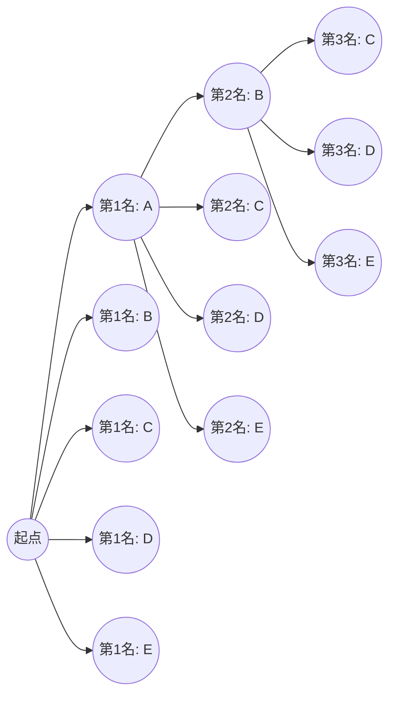
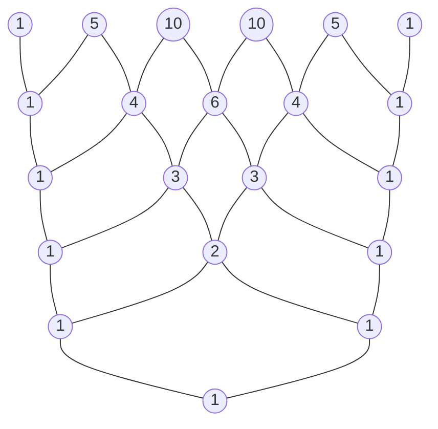

# 引言

在数学的世界里，逻辑性地列举可能情况数量的“排列”与“组合”，是概率论、统计学，甚至计算机科学算法等广泛领域的基础，是非常重要的概念。而将这些基础概念扩展到代数领域后出现的，便是“二项式定理”，将其系数的排列进行可视化和几何化表示的，则是“帕斯卡三角形”。乍一看，这些似乎是各自独立的数学主题，但当你深入学习后，会发现它们惊人地紧密交织在一起，构成了一个庞大而优美的数学结构。

在本文中，我们将从排列和组合的直观理解及基本计算方法出发，详细讲解更为复杂的重复排列、圆排列以及重复组合。随后，我们将推导出二项式定理的公式及其优美的对称性，最后将毫无保留地深入探讨帕斯卡三角形中隐藏的神秘性质、描述自然界法则的斐波那契数列之间的联系，以及分形结构等深奥的主题。让我们踏上一场尽情领略数学“美”与“规律”的旅程吧。

# 什么是排列 (Permutations)

排列是指从 $n$ 个不同的元素中选取 $r$ 个，并 **按顺序** 进行排列的方法。排列中最重要的一点是，“如果排列的顺序不同，就会被视为完全不同的事物”。例如，从“A”、“B”、“C”三张卡片中选取两张进行排列时，“A-B”和“B-A”会被算作不同的排列。

## 排列的公式

从 $n$ 个不同的元素中选取 $r$ 个的排列总数，用符号 $_n\text{P}_r$ 表示，并通过以下数学公式进行计算：

$$
_n\text{P}_r = \frac{n!}{(n-r)!}
$$

这里，$n!$ 表示 $n$ 的阶乘，$n! = n \times (n-1) \times \dots \times 2 \times 1$。阶乘表示对一个数的所有元素进行重新排列的方法总数。

## 具体示例：赛跑的名次与座位安排

例如，让 5 名学生（A、B、C、D、E）进行赛跑，让我们从逻辑上思考 1 到 3 名的结果共有多少种情况。

- 获得第一名的可能是 5 人中的任何一个（5 种情况）
- 获得第二名的可能是除了第一名之外的其余 4 人中的任何一个（4 种情况）
- 获得第三名的可能是除了第一名和第二名之外的其余 3 人中的任何一个（3 种情况）

此时，由于每种情况都是独立且连续发生的，我们利用乘法原理进行如下计算：

$$
_5\text{P}_3 = 5 \times 4 \times 3 = 60 \text{ 种}
$$

将此代入前面使用阶乘的公式，得到 $_5\text{P}_3 = \frac{5!}{(5-3)!} = \frac{120}{2} = 60$，可以确认直观的计算与严密的公式完全一致。

# 重复排列与圆排列

稍微扩展一下排列的概念，就能解决我们在日常生活中经常遇到的各种问题。这里我们将讲解具代表性的应用例子：“重复排列”和“圆排列”。

## 重复排列 (Permutations with Repetition)

在选取元素时，允许不限次数地重复选取同一个元素的排列称为 **重复排列**。
从 $n$ 个不同的事物中，允许重复地取出 $r$ 个进行排列的总数，可以用一个非常简单的公式表示：

$$
n^r
$$

例如，考虑设置一个 4 位数的密码（使用从 0 到 9 的 10 种数字）。每一位都有从 0 到 9 的 10 种选择，并且可以使用相同的数字任意次。因此，可以设置的密码总数如下：

$$
10^4 = 10 \times 10 \times 10 \times 10 = 10000 \text{ 种}
$$

数字密码、或者多次抛硬币（正反 2 种）的结果计数等，全都基于这个重复排列的思路。

## 圆排列 (Circular Permutations)

不排成一排，而是排成圆形的排列称为 **圆排列**。圆排列的特征是，“旋转后变得相同的排列方式只算作 1 种”。

将 $n$ 个不同的事物排成圆形的排列总数，可以通过以下公式计算：

$$
(n - 1)!
$$

为什么会是 $(n-1)!$ 呢？这是因为当把 $n$ 个元素排成圆形时，根据你从哪个元素开始看，会有 $n$ 种视角。因此，将排成一排的普通排列 $n!$ 除以 $n$，就能推导出 $(n-1)!$。

例如，5 个人坐在圆桌旁的方法有多少种？
$$
(5 - 1)! = 4! = 4 \times 3 \times 2 \times 1 = 24 \text{ 种}
$$
通过考虑旋转对称性，情况的数量会急剧减少。这个概念也应用于考虑分子立体结构的化学领域，以及网络环状拓扑的分析等。

# 什么是组合 (Combinations)

排列重视排列的“顺序”，而组合则仅关注集合的构成，即“选中了哪些元素”。也就是说，在组合中 **不考虑顺序**。只要被选中的元素成员相同，无论它们怎么排列，都被视为同一个组合。

## 组合的公式

从 $n$ 个不同的元素中选取 $r$ 个的组合总数，用符号 $_n\text{C}_r$ 或二项式系数的记法 $\binom{n}{r}$ 表示，并通过以下数学公式计算：

$$
_n\text{C}_r = \binom{n}{r} = \frac{_n\text{P}_r}{r!} = \frac{n!}{r!(n-r)!}
$$

这个公式背后的逻辑非常精彩。首先，计算考虑顺序选取 $r$ 个元素的方法（排列 $_n\text{P}_r$）。然而，被选中的 $r$ 个元素在其中有 $r!$ 种排列方式。因为组合将这些全部视为相同，所以将总数除以 $r!$ 来消除重复。

## 具体示例：项目团队的组建

从隶属于某个部门的 8 名员工中，选出 3 名成员来启动一个新项目，共有多少种选法？
如果成员内的角色没有明确的区分，那么选出的顺序就无关紧要，因此这就是一个组合问题。

$$
_8\text{C}_3 = \frac{8!}{3!(8-3)!} = \frac{8 \times 7 \times 6}{3 \times 2 \times 1} = 56 \text{ 种}
$$

即使被选中的 3 人是 $\{A, B, C\}$ 或 $\{B, C, A\}$，作为一个项目团队来说是完全相同的，所以被算作 1 种。组合的思路在计算彩票的中奖概率、或扑克牌牌型的概率计算等伴随不确定性的事件分析中，是不可或缺的工具。

# 重复组合 (Combinations with Repetition)

正如排列中有重复排列一样，组合中也存在 **重复组合**。这指的是从 $n$ 种不同的事物中，允许重复地选取 $r$ 个的方法数，通常用符号 $_n\text{H}_r$ 表示。

## 重复组合的计算与“圆圈与挡板”模型

重复组合很难直接计算，因此通常会将其转换为普通的组合问题来求解。转换后的总数由以下公式给出：

$$
_n\text{H}_r = _{n+r-1}\text{C}_r = \frac{(n+r-1)!}{r!(n-1)!}
$$

为了直观理解这个公式，有一个非常优秀的模型，即“圆圈 (o) 与挡板 (|)”模型。

例如，从苹果、橘子、香蕉 3 种水果中，允许重复地购买 5 个水果，有多少种买法？（假设可以有不被选中的水果）。
这里，我们从 $n=3$ 种水果中选取 $r=5$ 个。

我们将这替换成一个问题：把 5 个“圆圈”和用于分隔 3 种水果的 $3-1 = 2$ 个“挡板”排成一排。

示例： `o o | o | o o` 
这表示从左边开始选择了“2个苹果、1个橘子、2个香蕉”。
示例： `| o o o | o o`
这表示“0个苹果、3个橘子、2个香蕉”。

也就是说，这等于从总共 $5 + 2 = 7$ 个位置中，选取 5 个位置放置圆圈（或者选取 2 个位置放置挡板）的组合。

$$
_3\text{H}_5 = _{3+5-1}\text{C}_5 = _7\text{C}_5 = _7\text{C}_2 = \frac{7 \times 6}{2 \times 1} = 21 \text{ 种}
$$

这种“圆圈与挡板”的方法，展示了数学强大的抽象能力，将看似复杂的问题还原为了直观且简单的结构。

# 二项式定理 (Binomial Theorem) 及其展开

我们目前学到的排列与组合的知识，为理解代数根基定理之一的“二项式定理”作了完美的准备。二项式定理是一个将两项之和的乘方（例如 $(x + y)^n$）作为多项式进行完全展开的公式。

## 二项式定理的公式

对于任意正整数 $n$，以下等式必然成立：

$$
(x + y)^n = \sum_{k=0}^{n} \binom{n}{k} x^{n-k} y^k
$$

或者，写成展开的形式如下：

$$
(x + y)^n = \binom{n}{0}x^n y^0 + \binom{n}{1}x^{n-1} y^1 + \binom{n}{2}x^{n-2} y^2 + \dots + \binom{n}{n}x^0 y^n
$$

展开时各项的系数，与组合 $\binom{n}{k}$（即 $_n\text{C}_k$）完全一致。因此，这些系数被特别地称为 **二项式系数**。

## 二项式定理的直观证明与组合的关联

为什么二项式的展开中会出现表示情况数的组合呢？让我们以 $(x + y)^3$ 的展开为例，探寻其直观的原因。

$$
(x + y)^3 = (x + y)(x + y)(x + y)
$$

展开这个式子的行为，意味着根据分配律，从 3 个括号 $(x+y)$ 的每一个中选取 $x$ 或 $y$ 之一，将它们相乘，然后把所有的模式相加。

- **要生成 $x^3$ 项** ：必须从所有 3 个括号中选取 $x$。这样的选法有 $\binom{3}{0} = 1$ 种。
- **要生成 $x^2y$ 项** ：需要从 3 个括号中的 2 个选取 $x$，剩余 1 个选取 $y$。决定从哪 1 个括号选取 $y$ 的方法有 $\binom{3}{1} = 3$ 种。
- **要生成 $xy^2$ 项** ：从 3 个括号中的 1 个选取 $x$，剩余 2 个选取 $y$。决定选取 $y$ 的 2 个括号的方法有 $\binom{3}{2} = 3$ 种。
- **要生成 $y^3$ 项** ：从所有 3 个括号中选取 $y$。选法有 $\binom{3}{3} = 1$ 种。

因此，将这些全部相加，结果如下：

$$
(x + y)^3 = 1x^3 + 3x^2y + 3xy^2 + 1y^3
$$

将其推广，对于“在 $n$ 个括号的乘法中，选取 $k$ 个 $y$（同时选取 $n-k$ 个 $x$）的方法总数是多少”这个问题的答案，正是 $\binom{n}{k}$。代数展开式和组合数学在这里完美地交汇了。

# 帕斯卡三角形：优美的数字几何学

将出现在二项式定理展开式中的二项式系数，从上往下按 $n=0, 1, 2, \dots$ 的顺序排列成金字塔状，这就叫做“帕斯卡三角形 ([Pascal](https://kenji.blog/zh-cn/p/pascal/)'s Triangle)”。这个结构简单的三角形，远远超越了作为单纯计算辅助工具的范畴，其内部隐藏着数不尽的优美而深奥的数学性质。

## 帕斯卡三角形的构建规则

帕斯卡三角形从在最顶部的顶点（第 0 行）放置 $1$ 开始。此后的行，两端总是放置 $1$，而内部的所有数字都遵循“左上方的数和右上方的数相加”这样一个极其简单的规则来构建。

从上往下数第 $n$ 行（顶点作为第 0 行）、从左往右数第 $k$ 个（左端作为第 0 个）配置的数字，正对应于二项式系数 $\binom{n}{k}$。左上的数字 $\binom{n-1}{k-1}$ 和右上的数字 $\binom{n-1}{k}$ 相加等于下方的数字 $\binom{n}{k}$ 的结构，在几何上表达了以下被称为帕斯卡法则 ([Pascal](https://kenji.blog/zh-cn/p/pascal/)'s Rule) 的重要等式：

$$
\binom{n}{k} = \binom{n-1}{k-1} + \binom{n-1}{k}
$$

## 帕斯卡三角形中隐藏的惊人性质

如果你仔细观察帕斯卡三角形，会发现其中隐藏着无数的规律性。这里介绍其中的几个。

### 1. 完美的对称性 (Symmetry)

每行的数字，以中心为轴是完全左右对称的。这直接反映了组合的基本性质 $\binom{n}{k} = \binom{n}{n-k}$。从逻辑上思考，决定从 $n$ 个中选取 $k$ 个，同时也等同于决定“不被选取的 $n-k$ 个”，因此这是一个理所当然的结果。

### 2. 各行之和与 2 的乘方 (Sum of Rows and Powers of 2)

将任意第 $n$ 行的数字全部横向相加，其总和必定为 $2^n$。

- 第 0 行: $1 = 2^0$
- 第 1 行: $1 + 1 = 2 = 2^1$
- 第 2 行: $1 + 2 + 1 = 4 = 2^2$
- 第 3 行: $1 + 3 + 3 + 1 = 8 = 2^3$
- 第 4 行: $1 + 4 + 6 + 4 + 1 = 16 = 2^4$

这可以通过在二项式定理 $(x+y)^n = \sum \binom{n}{k} x^{n-k} y^k$ 中代入 $x=1, y=1$ 得到的方程式 $(1+1)^n = \sum \binom{n}{k}$ 在代数上轻松证明。从集合论的角度来说，这表明拥有 $n$ 个元素的集合的“所有子集的数量”为 $2^n$。

### 3. 与斐波那契数列隐藏的联系 (The [Fibonacci](https://kenji.blog/zh-cn/p/fibonacci/) Connection)

试着沿着帕斯卡三角形的“浅斜对角线”将数字相加。令人惊讶的是，数列 $1, 1, 2, 3, 5, 8, 13, 21, \dots$ 出现了。
这正是将前两个数相加生成下一个数的 **斐波那契数列**。向日葵种子的排列、鹦鹉螺壳的螺旋等，在自然界各个角落出现的神秘数列，竟然深藏于一个仅仅排列了组合数的三角形之中。这非常优美且令人感动地展现了作为人类逻辑思维产物的数学，是如何与大自然的法则联系在一起的。

### 4. 分形结构：谢尔宾斯基三角形 (Fractal Geometry)

将帕斯卡三角形巨大地扩展到几十行、几百行，并将其中的“奇数”涂黑，“偶数”留白。随后，一个被称为“谢尔宾斯基三角形”的自相似的分形图形就会清晰地浮现出来。
无论你对整体进行放大还是缩小，无限重复相同三角形模式的这种结构，成为了连接数论、几何学以及混沌理论的桥梁。

# 扩展至多项式定理 (Multinomial Theorem)

二项式定理是 $(x+y)^n$ 的展开，而将其一般化为 3 个或更多项之和的展开，例如 $(x+y+z)^n$ 或 $(x_1 + x_2 + \dots + x_m)^n$ 的展开，这就是 **多项式定理**。

多项式定理展开式中各项的系数被称为多项式系数，通过以下公式计算：

$$
\frac{n!}{k_1! k_2! \dots k_m!} \quad (\text{其中 } k_1 + k_2 + \dots + k_m = n)
$$

这个多项式系数不仅是一个代数的展开系数，还意味着“将 $n$ 个不同的项目，分别划分到数量为 $k_1$、$k_2$、…、$k_m$ 的组中的方法总数”。
以二项式定理为基础，并自然地扩展到更高维度的组合数学结构的这个过程，完美地体现了数学这一体系所拥有的扩展性和一致性。

# 二项分布 (Binomial Distribution)：在概率论中的应用

到目前为止，我们一直将排列和二项式定理作为纯粹的数学来处理，但这些概念在对现实世界问题进行建模的“概率论”和“统计学”中，发挥着极其强大的实用力量。其代表例就是 **二项分布**。

二项分布是一种概率分布，它描述了当独立进行只有“成功”或“失败”两种结果的试验（伯努利试验） $n$ 次时，恰好发生 $k$ 次“成功”的概率。
假设 1 次试验中成功的概率为 $p$，失败的概率为 $q = 1 - p$，那么恰好成功 $k$ 次的概率 $P(X=k)$ 可以表示如下：

$$
P(X=k) = \binom{n}{k} p^k q^{n-k}
$$

在这个概率质量公式中，二项式系数 $\binom{n}{k}$ 原封不动地出现了。这是因为在 $n$ 次试验中，选择哪 $k$ 次会成功的组合数有 $\binom{n}{k}$ 种。
从抛硬币的概率计算，到工厂中不良品发生概率的预测，甚至到医疗中新药效果的测定，二项分布支撑着现代社会所有数据分析的基础。

# 总结

在本文中，我们从简单的“计数”规则——排列和组合开始，了解了它们在重复排列和圆排列中的应用，进而扩展到代数中的二项式定理，直到对帕斯卡三角形进行视觉化探索，在这个广阔的数学风景中进行了一场旅行。

将“从不同的事物中选取几个”这种极其简单和原始的行为，使用数学这种严密的语言进行抽象和深究，我们发现展现出的是一个无法预料的丰富而优美的数学世界——包括完美的对称性、2的乘方法则、描述自然界的斐波那契数列，以及无限的分形结构。

数学公式和定理绝不仅仅是用于解答考试题目的冰冷工具。它们是人类至高的艺术品，表现了围绕着我们的世界背后那看不见的秩序，以及数字所编织出的压倒性优美的关系。希望通过接触排列、组合以及帕斯卡三角形所展现出的这种奇妙的数字规律，您能感受到数学这门学问所具有的真正魅力与深奥之处。
