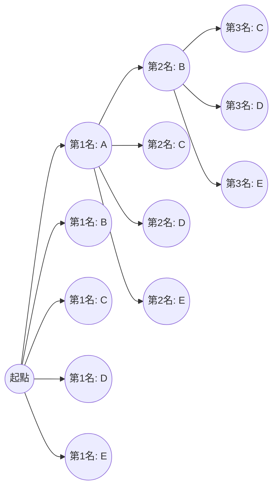
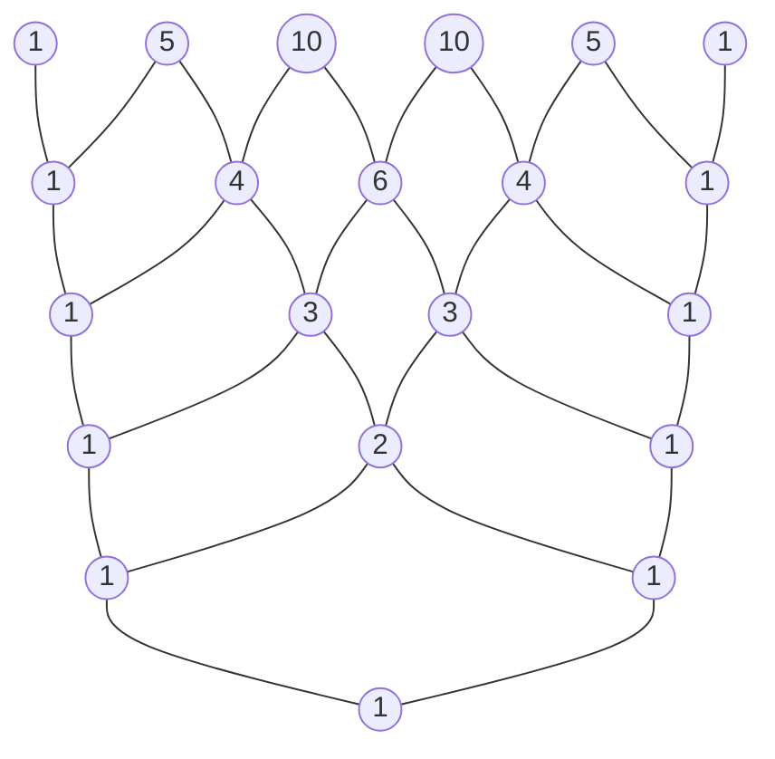

# 引言

在數學的世界裡，邏輯性地列舉可能情況數量的「排列」與「組合」，是機率論、統計學，甚至電腦科學演算法等廣泛領域的基礎，是非常重要的概念。而將這些基礎概念擴展到代數領域後出現的，便是「二項式定理」，將其係數的排列進行視覺化和幾何化表示的，則是「帕斯卡三角形」。乍看之下，這些似乎是各自獨立的數學主題，但當你深入學習後，會發現它們驚人地緊密交織在一起，構成了一個龐大而優美的數學結構。

在本文中，我們將從排列和組合的直觀理解及基本計算方法出發，詳細講解更為複雜的重複排列、環狀排列以及重複組合。隨後，我們將推導出二項式定理的公式及其優美的對稱性，最後將毫無保留地深入探討帕斯卡三角形中隱藏的神秘性質、描述自然界法則的費氏數列之間的聯繫，以及碎形結構等深奧的主題。讓我們踏上一場盡情領略數學「美」與「規律」的旅程吧。

# 什麼是排列 (Permutations)

排列是指從 $n$ 個不同的元素中選取 $r$ 個，並 **按順序** 進行排列的方法。排列中最重要的一點是，「如果排列的順序不同，就會被視為完全不同的事物」。例如，從「A」、「B」、「C」三張卡片中選取兩張進行排列時，「A-B」和「B-A」會被算作不同的排列。

## 排列的公式

從 $n$ 個不同的元素中選取 $r$ 個的排列總數，用符號 $_n\text{P}_r$ 表示，並透過以下數學公式進行計算：

$$
_n\text{P}_r = \frac{n!}{(n-r)!}
$$

這裡，$n!$ 表示 $n$ 的階乘，$n! = n \times (n-1) \times \dots \times 2 \times 1$。階乘表示對一個數的所有元素進行重新排列的方法總數。

## 具體範例：賽跑的名次與座位安排

例如，讓 5 名學生（A、B、C、D、E）進行賽跑，讓我們從邏輯上思考 1 到 3 名的結果共有多少種情況。

- 獲得第一名的可能是 5 人中的任何一個（5 種情況）
- 獲得第二名的可能是除了第一名之外的其餘 4 人中的任何一個（4 種情況）
- 獲得第三名的可能是除了第一名和第二名之外的其餘 3 人中的任何一個（3 種情況）

此時，由於每種情況都是獨立且連續發生的，我們利用乘法原理進行如下計算：

$$
_5\text{P}_3 = 5 \times 4 \times 3 = 60 \text{ 種}
$$

將此代入前面使用階乘的公式，得到 $_5\text{P}_3 = \frac{5!}{(5-3)!} = \frac{120}{2} = 60$，可以確認直觀的計算與嚴密的公式完全一致。

# 重複排列與環狀排列

稍微擴展一下排列的概念，就能解決我們在日常生活中經常遇到的各種問題。這裡我們將講解具代表性的應用例子：「重複排列」和「環狀排列」。

## 重複排列 (Permutations with Repetition)

在選取元素時，允許不限次數地重複選取同一個元素的排列稱為 **重複排列**。
從 $n$ 個不同的事物中，允許重複地取出 $r$ 個進行排列的總數，可以用一個非常簡單的公式表示：

$$
n^r
$$

例如，考慮設定一個 4 位數的密碼（使用從 0 到 9 的 10 種數字）。每一位都有從 0 到 9 的 10 種選擇，並且可以使用相同的數字任意次。因此，可以設定的密碼總數如下：

$$
10^4 = 10 \times 10 \times 10 \times 10 = 10000 \text{ 種}
$$

數位密碼、或者多次拋硬幣（正反 2 種）的結果計數等，全都基於這個重複排列的思路。

## 環狀排列 (Circular Permutations)

不排成一排，而是排成圓形的排列稱為 **環狀排列**。環狀排列的特徵是，「旋轉後變得相同的排列方式只算作 1 種」。

將 $n$ 個不同的事物排成圓形的排列總數，可以透過以下公式計算：

$$
(n - 1)!
$$

為什麼會是 $(n-1)!$ 呢？這是因為當把 $n$ 個元素排成圓形時，根據你從哪個元素開始看，會有 $n$ 種視角。因此，將排成一排的普通排列 $n!$ 除以 $n$，就能推導出 $(n-1)!$。

例如，5 個人坐在圓桌旁的方法有多少種？
$$
(5 - 1)! = 4! = 4 \times 3 \times 2 \times 1 = 24 \text{ 種}
$$
透過考慮旋轉對稱性，情況的數量會急劇減少。這個概念也應用於考慮分子立體結構的化學領域，以及網路環狀拓撲的分析等。

# 什麼是組合 (Combinations)

排列重視排列的「順序」，而組合則僅關注集合的構成，即「選中了哪些元素」。也就是說，在組合中 **不考慮順序**。只要被選中的元素成員相同，無論它們怎麼排列，都被視為同一個組合。

## 組合的公式

從 $n$ 個不同的元素中選取 $r$ 個的組合總數，用符號 $_n\text{C}_r$ 或二項式係數的記法 $\binom{n}{r}$ 表示，並透過以下數學公式計算：

$$
_n\text{C}_r = \binom{n}{r} = \frac{_n\text{P}_r}{r!} = \frac{n!}{r!(n-r)!}
$$

這個公式背後的邏輯非常精彩。首先，計算考慮順序選取 $r$ 個元素的方法（排列 $_n\text{P}_r$）。然而，被選中的 $r$ 個元素在其中有 $r!$ 種排列方式。因為組合將這些全部視為相同，所以將總數除以 $r!$ 來消除重複。

## 具體範例：專案團隊的組建

從隸屬於某個部門的 8 名員工中，選出 3 名成員來啟動一個新專案，共有多少種選法？
如果成員內的角色沒有明確的區分，那麼選出的順序就無關緊要，因此這就是一個組合問題。

$$
_8\text{C}_3 = \frac{8!}{3!(8-3)!} = \frac{8 \times 7 \times 6}{3 \times 2 \times 1} = 56 \text{ 種}
$$

即使被選中的 3 人是 $\{A, B, C\}$ 或 $\{B, C, A\}$，作為一個專案團隊來說是完全相同的，所以被算作 1 種。組合的思路在計算樂透的中獎機率、或撲克牌牌型的機率計算等伴隨不確定性的事件分析中，是不可或缺的工具。

# 重複組合 (Combinations with Repetition)

正如排列中有重複排列一樣，組合中也存在 **重複組合**。這指的是從 $n$ 種不同的事物中，允許重複地選取 $r$ 個的方法數，通常用符號 $_n\text{H}_r$ 表示。

## 重複組合的計算與「圈圈與分隔線」模型

重複組合很難直接計算，因此通常會將其轉換為普通的組合問題來求解。轉換後的總數由以下公式給出：

$$
_n\text{H}_r = _{n+r-1}\text{C}_r = \frac{(n+r-1)!}{r!(n-1)!}
$$

為了直觀理解這個公式，有一個非常優秀的模型，即「圈圈 (o) 與分隔線 (|)」模型。

例如，從蘋果、橘子、香蕉 3 種水果中，允許重複地購買 5 個水果，有多少種買法？（假設可以有不被選中的水果）。
這裡，我們從 $n=3$ 種水果中選取 $r=5$ 個。

我們將這替換成一個問題：把 5 個「圈圈」和用於分隔 3 種水果的 $3-1 = 2$ 個「分隔線」排成一排。

範例： `o o | o | o o` 
這表示從左邊開始選擇了「2個蘋果、1個橘子、2個香蕉」。
範例： `| o o o | o o`
這表示「0個蘋果、3個橘子、2個香蕉」。

也就是說，這等於從總共 $5 + 2 = 7$ 個位置中，選取 5 個位置放置圈圈（或者選取 2 個位置放置分隔線）的組合。

$$
_3\text{H}_5 = _{3+5-1}\text{C}_5 = _7\text{C}_5 = _7\text{C}_2 = \frac{7 \times 6}{2 \times 1} = 21 \text{ 種}
$$

這種「圈圈與分隔線」的方法，展示了數學強大的抽象能力，將看似複雜的問題還原為了直觀且簡單的結構。

# 二項式定理 (Binomial Theorem) 及其展開

我們目前學到的排列與組合的知識，為理解代數根基定理之一的「二項式定理」作了完美的準備。二項式定理是一個將兩項之和的乘方（例如 $(x + y)^n$）作為多項式進行完全展開的公式。

## 二項式定理的公式

對於任意正整數 $n$，以下等式必然成立：

$$
(x + y)^n = \sum_{k=0}^{n} \binom{n}{k} x^{n-k} y^k
$$

或者，寫成展開的形式如下：

$$
(x + y)^n = \binom{n}{0}x^n y^0 + \binom{n}{1}x^{n-1} y^1 + \binom{n}{2}x^{n-2} y^2 + \dots + \binom{n}{n}x^0 y^n
$$

展開時各項的係數，與組合 $\binom{n}{k}$（即 $_n\text{C}_k$）完全一致。因此，這些係數被特別地稱為 **二項式係數**。

## 二項式定理的直觀證明與組合的關聯

為什麼二項式的展開中會出現表示情況數的組合呢？讓我們以 $(x + y)^3$ 的展開為例，探尋其直觀的原因。

$$
(x + y)^3 = (x + y)(x + y)(x + y)
$$

展開這個式子的行為，意味著根據分配律，從 3 個括號 $(x+y)$ 的每一個中選取 $x$ 或 $y$ 之一，將它們相乘，然後把所有的模式相加。

- **要生成 $x^3$ 項** ：必須從所有 3 個括號中選取 $x$。這樣的選法有 $\binom{3}{0} = 1$ 種。
- **要生成 $x^2y$ 項** ：需要從 3 個括號中的 2 個選取 $x$，剩餘 1 個選取 $y$。決定從哪 1 個括號選取 $y$ 的方法有 $\binom{3}{1} = 3$ 種。
- **要生成 $xy^2$ 項** ：從 3 個括號中的 1 個選取 $x$，剩餘 2 個選取 $y$。決定選取 $y$ 的 2 個括號的方法有 $\binom{3}{2} = 3$ 種。
- **要生成 $y^3$ 項** ：從所有 3 個括號中選取 $y$。選法有 $\binom{3}{3} = 1$ 種。

因此，將這些全部相加，結果如下：

$$
(x + y)^3 = 1x^3 + 3x^2y + 3xy^2 + 1y^3
$$

將其推廣，對於「在 $n$ 個括號的乘法中，選取 $k$ 個 $y$（同時選取 $n-k$ 個 $x$）的方法總數是多少」這個問題的答案，正是 $\binom{n}{k}$。代數展開式和組合數學在這裡完美地交匯了。

# 帕斯卡三角形：優美的數字幾何學

將出現在二項式定理展開式中的二項式係數，從上往下按 $n=0, 1, 2, \dots$ 的順序排列成金字塔狀，這就叫做「帕斯卡三角形 (Pascal's Triangle)」。這個結構簡單的三角形，遠遠超越了作為單純計算輔助工具的範疇，其內部隱藏著數不盡的優美而深奧的數學性質。

## 帕斯卡三角形的建構規則

帕斯卡三角形從在最頂部的頂點（第 0 行）放置 $1$ 開始。此後的行，兩端總是放置 $1$，而內部的所有數字都遵循「左上方的數和右上方的數相加」這樣一個極其簡單的規則來建構。

從上往下數第 $n$ 行（頂點作為第 0 行）、從左往右數第 $k$ 個（左端作為第 0 個）配置的數字，正對應於二項式係數 $\binom{n}{k}$。左上的數字 $\binom{n-1}{k-1}$ 和右上的數字 $\binom{n-1}{k}$ 相加等於下方的數字 $\binom{n}{k}$ 的結構，在幾何上表達了以下被稱為帕斯卡法則 (Pascal's Rule) 的重要等式：

$$
\binom{n}{k} = \binom{n-1}{k-1} + \binom{n-1}{k}
$$

## 帕斯卡三角形中隱藏的驚人性質

如果你仔細觀察帕斯卡三角形，會發現其中隱藏著無數的規律性。這裡介紹其中的幾個。

### 1. 完美的對稱性 (Symmetry)

每行的數字，以中心為軸是完全左右對稱的。這直接反映了組合的基本性質 $\binom{n}{k} = \binom{n}{n-k}$。從邏輯上思考，決定從 $n$ 個中選取 $k$ 個，同時也等同於決定「不被選取的 $n-k$ 個」，因此這是一個理所當然的結果。

### 2. 各行之和與 2 的乘方 (Sum of Rows and Powers of 2)

將任意第 $n$ 行的數字全部橫向相加，其總和必定為 $2^n$。

- 第 0 行: $1 = 2^0$
- 第 1 行: $1 + 1 = 2 = 2^1$
- 第 2 行: $1 + 2 + 1 = 4 = 2^2$
- 第 3 行: $1 + 3 + 3 + 1 = 8 = 2^3$
- 第 4 行: $1 + 4 + 6 + 4 + 1 = 16 = 2^4$

這可以透過在二項式定理 $(x+y)^n = \sum \binom{n}{k} x^{n-k} y^k$ 中代入 $x=1, y=1$ 得到的方程式 $(1+1)^n = \sum \binom{n}{k}$ 在代數上輕鬆證明。從集合論的角度來說，這表明擁有 $n$ 個元素的集合的「所有子集的數量」為 $2^n$。

### 3. 與費氏數列隱藏的聯繫 (The Fibonacci Connection)

試著沿著帕斯卡三角形的「淺斜對角線」將數字相加。令人驚訝的是，數列 $1, 1, 2, 3, 5, 8, 13, 21, \dots$ 出現了。
這正是將前兩個數相加生成下一個數的 **費氏數列**。向日葵種子的排列、鸚鵡螺殼的螺旋等，在自然界各個角落出現的神秘數列，竟然深藏於一個僅僅排列了組合數的三角形之中。這非常優美且令人感動地展現了作為人類邏輯思維產物的數學，是如何與大自然的法則聯繫在一起的。

### 4. 碎形結構：謝爾賓斯基三角形 (Fractal Geometry)

將帕斯卡三角形巨大地擴展到幾十行、幾百行，並將其中的「奇數」塗黑，「偶數」留白。隨後，一個被稱為「謝爾賓斯基三角形」的自我相似的碎形圖形就會清晰地浮現出來。
無論你對整體進行放大還是縮小，無限重複相同三角形模式的這種結構，成為了連接數論、幾何學以及混沌理論的橋樑。

# 擴展至多項式定理 (Multinomial Theorem)

二項式定理是 $(x+y)^n$ 的展開，而將其一般化為 3 個或更多項之和的展開，例如 $(x+y+z)^n$ 或 $(x_1 + x_2 + \dots + x_m)^n$ 的展開，這就是 **多項式定理**。

多項式定理展開式中各項的係數被稱為多項式係數，透過以下公式計算：

$$
\frac{n!}{k_1! k_2! \dots k_m!} \quad (\text{其中 } k_1 + k_2 + \dots + k_m = n)
$$

這個多項式係數不僅是一個代數的展開係數，還意味著「將 $n$ 個不同的項目，分別劃分到數量為 $k_1$、$k_2$、…、$k_m$ 的組中的方法總數」。
以二項式定理為基礎，並自然地擴展到更高維度的組合數學結構的這個過程，完美地體現了數學這一體系所擁有的擴展性和一致性。

# 二項分佈 (Binomial Distribution)：在機率論中的應用

到目前為止，我們一直將排列和二項式定理作為純粹的數學來處理，但這些概念在對現實世界問題進行建模的「機率論」和「統計學」中，發揮著極其強大的實用力量。其代表例就是 **二項分佈**。

二項分佈是一種機率分佈，它描述了當獨立進行只有「成功」或「失敗」兩種結果的試驗（伯努利試驗） $n$ 次時，恰好發生 $k$ 次「成功」的機率。
假設 1 次試驗中成功的機率為 $p$，失敗的機率為 $q = 1 - p$，那麼恰好成功 $k$ 次的機率 $P(X=k)$ 可以表示如下：

$$
P(X=k) = \binom{n}{k} p^k q^{n-k}
$$

在這個機率質量公式中，二項式係數 $\binom{n}{k}$ 原封不動地出現了。這是因為在 $n$ 次試驗中，選擇哪 $k$ 次會成功的組合數有 $\binom{n}{k}$ 種。
從拋硬幣的機率計算，到工廠中不良品發生機率的預測，甚至到醫療中新藥效果的測定，二項分佈支撐著現代社會所有數據分析的基礎。

# 總結

在本文中，我們從簡單的「計數」規則——排列和組合開始，了解了它們在重複排列和環狀排列中的應用，進而擴展到代數中的二項式定理，直到對帕斯卡三角形進行視覺化探索，在這個廣闊的數學風景中進行了一場旅行。

將「從不同的事物中選取幾個」這種極其簡單和原始的行為，使用數學這種嚴密的語言進行抽象和深究，我們發現展現出的是一個無法預料的豐富而優美的數學世界——包括完美的對稱性、2的乘方法則、描述自然界的費氏數列，以及無限的碎形結構。

數學公式和定理絕不僅僅是用於解答考試題目的冰冷工具。它們是人類至高的藝術品，表現了圍繞著我們的世界背後那看不見的秩序，以及數字所編織出的壓倒性優美的關係。希望透過接觸排列、組合以及帕斯卡三角形所展現出的這種奇妙的數字規律，您能感受到數學這門學問所具有的真正魅力與深奧之處。
