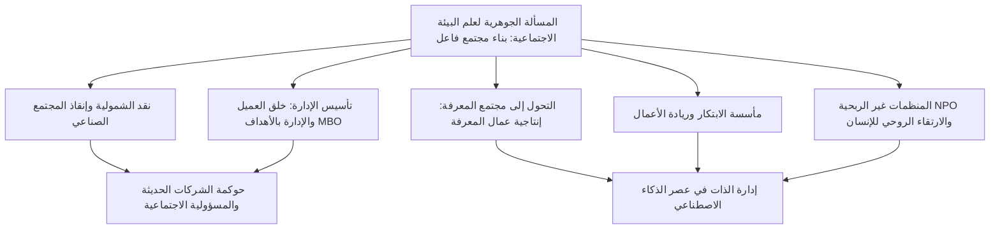
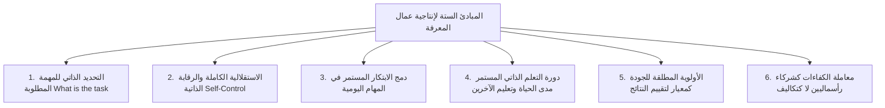
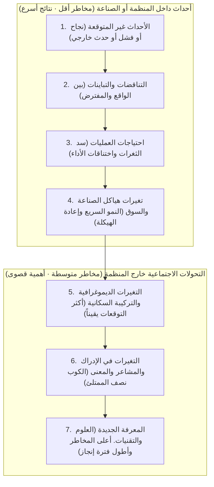

## 1. مقدمة: أبعاد فكر بيتر دراكر، أعظم عقول القرن العشرين

### 1.1 اختزال لقب "أب الإدارة" وجوهره كـ "عالم بيئة اجتماعية"

يُعرف اسم بيتر إف. دراكر (Peter Ferdinand Drucker, 1909–2005) في جميع أنحاء العالم بلقب "أب الإدارة الحديثة" (Father of Modern Management). ومع ذلك، لم يكن هو نفسه يميل إلى هذا اللقب طوال حياته. بل كان اللقب الفريد الذي اختاره لنفسه وظل يردده دائماً هو **"عالم البيئة الاجتماعية" (Social Ecologist)**.

وكما تدرس البيئة (Ecology) في علم الأحياء التفاعلات والتوازن الديناميكي بين الكائنات الحية والبيئة المحيطة بها، فإن علم البيئة الاجتماعية هو العلم الذي يدرس كيفية عيش البشر وعملهم وبناء علاقاتهم وتشكيل النظام الاجتماعي داخل البيئات الاجتماعية التي صنعوها بأنفسهم — كالشركات، والحكومات، والجامعات، والمستشفيات، والكنائس، والأسرة، وغيرها من مختلف المنظمات والمؤسسات.

لم يكن محور اهتمام دراكر مقتصراً على "حيل وأساليب تعظيم أرباح الشركات" أو "أدوات تحسين كفاءة الإدارة". بل كان السؤال الجوهري الذي واصل طرحه على الدوام سؤالاً أخلاقياً وفلسفياً وإنسانياً عميقاً: **"كيف نبني مجتمعاً فاعلاً يؤدي وظائفه (a functioning society) يستطيع فيه الإنسان أن يعيش متمتعاً بالحرية والكرامة؟"** وإذا كان قد صب شغفه في تحليل الأعمال والمنظمات المؤسسية، فذلك لأن المؤسسة والشركة أصبحت في القرن العشرين المؤسسة التمثيلية المركزية في المجتمع (Representative Institution)، والساحة الكبرى التي تحدد معالم حياة الناس وهوياتهم.

إن الكثير من رواد الأعمال والباحثين المعاصرين الذين يقرؤون أعمال دراكر يغفلون حقيقة أنه انطلق من تجربة مريرة عاين فيها صعود النازية في أوروبا قبل الحرب العالمية الثانية، ومن يأس سياسي وفلسفي عميق حول كيفية التصدي لشمولية هتلر. في هذا المقال الشامل، سنتتبع الجداول الخفية للأفكار التي شكلت مسيرة دراكر الفكرية ومؤلفاته الكاملة، لنقدم تفكيكاً دقيقاً وشاملاً لمنظومته الفكرية الرحبة.

---

### 1.2 شفق فيينا، صعود النازية، ونظرية التنظيم المنبثقة من نقد الشمولية

لفهم الجذور الفكرية لدراكر، لا بد من استيعاب البيئة الفكرية لفيينا في أواخر عهد إمبراطورية هابسبورغ حيث وُلد وترعرع. وُلد دراكر عام 1909 في فيينا، عاصمة الإمبراطورية النمساوية المجرية، لعائلة مثقفة وثرية كانت صالوناتها تستقبل بانتظام كبار مفكري أوروبا في ذلك العصر، مثل فرويد، وشومبيتر، وميزس، وهايك.

ولكن مع اندلاع الحرب العالمية الأولى، انهارت إمبراطورية هابسبورغ، وشهد المجتمع الأوروبي خلال عشرينيات وثلاثينيات القرن العشرين انهياراً روحياً واجتماعياً غير مسبوق. تفكك النظام الطبقي التقليدي والسلطة الدينية، وفقد الأفراد مجتمعاتهم الحاضنة وسقطوا في عزلة الجماهير المهمشة. ثم جاء الكساد الكبير عام 1929 ليعصف بما تبقى، ناشراً اليأس من اقتصاد السوق الرأسمالي الحر والديمقراطية البورجوازية.

ومن رحم هذا الفراغ الروحي واليأس الهائل، برزت قوتان شموليتان عظيمتان: الاشتراكية القومية بزعامة هتلر (النازية) والشيوعية الستالينية. وكان الشاب دراكر، الحاصل على دكتوراه في القانون من فرانكفورت والعامل في الصحافة، شاهداً عيانياً في ألمانيا على انحدار البلاد السريع نحو ظلمات النازية. وفور تولي هتلر مقاليد السلطة عام 1933، غادر دراكر ألمانيا على الفور إلى بريطانيا، ثم هاجر في عام 1937 إلى الولايات المتحدة.

بالنسبة لدراكر، لم تكن الفاشية والشمولية مجرد جنون عسكري أو سياسي، بل كانت **"تمرداً يائساً ومَرَضياً نتج عن عجز المجتمع الغربي الحديث عن منح الإنسان مكانة اجتماعية مشروعة (Status) ووظيفة ذات مغزى (Function)"**. ومن ثم، فإن التغلب على الشمولية من جذورها لا يتحقق بمجرد الهزيمة العسكرية، بل يقتضي تصميم "مجتمع حر غير شمولي" جديد يضمن لكل مواطن موطئ قدم راسخاً ودوراً بنّاءً في المجتمع، مما يتيح له تحقيق ذاته وصون كرامته. لقد كان هذا الشعور العميق بالرسالة هو القوة الدافعة الحقيقية التي وجّهت دراكر نحو استكشاف "التنظيم والإدارة".

---

## 2. منطلقات فكر دراكر: يأس الشمولية وإنقاذ المجتمع الصناعي

### 2.1 『نهاية الإنسان الاقتصادي』 (1939) — حدود الماركسية والرأسمالية، وأمراض الفاشية

في عام 1939، وأثناء وجوده في المنفى، نشر دراكر كتابه التأسيسي الأول بعنوان *The End of Economic Man: The Origins of Totalitarianism* (نهاية الإنسان الاقتصادي: أصول الشمولية). لاقى هذا الكتاب، الذي وضعه شاب غير معروف لم يبلغ الثلاثين من عمره، إشادة فورية من ونستون تشرشل، الذي أدرجه ضمن قائمة الكتب الإلزامية لضباط الجيش البريطاني.

في هذا العمل، قام دراكر بتشريح جوهر النازية ليس بوصفها "شراً عقلانياً"، بل باعتبارها "إيماناً سحرياً خرافياً أتى في أعقاب تحول الآمال العقلانية إلى يأس مطبق". لقد استند المجتمع الغربي الحديث منذ القرن الثامن عشر إلى مفهوم "الإنسان الاقتصادي" (Economic Man). فوعدت الرأسمالية بأن "سعي الأفراد وراء مصالحهم الاقتصادية في السوق سيجلب، عبر اليد الخفية، الثروة والانسجام للمجتمع بأسره"، بينما وعدت الماركسية بأن "إلغاء الفوارق الطبقية عبر الثورة البروليتارية سيقيم مجتمع الأحرار المتساوين الحقيقيين".

إلا أن الرأسمالية تمخضت عن بطالة مزمنة وتفاوت صارخ ومأساة الكساد الكبير، في حين أسفرت الشيوعية عن دكتاتورية دموية ومعسكرات اعتقال قمعية. وعندما انهار كلا الميثولوجيين في وقت واحد، وجد المجتمع الغربي نفسه وجهاً لوجه أمام هاوية العدمية (Nihilism): الإدراك المؤلم بأن "لا الحرية الاقتصادية ولا المساواة الاقتصادية قادرتان على ضمان السعادة والكرامة الإنسانية".

وهنا استغلت الفاشية هذا الفراغ العدمي. فرفضت الفاشية العقلانية والحرية الاقتصادية علانية، واستنفرت السحر اللامعقول من خلال التراتبية العسكرية، وأساطير النقاء العرقي، وتقديس الدولة، لتمنح الجماهير اليائسة "معنى" زائفاً و"شعوراً بالانتماء". وهنا أعلن دراكر بصوت جهير: لا يكفي مجرد رفض الفاشية لإحياء المجتمع، بل لا بد من إرساء "نظام اجتماعي جديد" يدمج العقلانية الاقتصادية ويتجاوز في الوقت نفسه مجرد المكاسب المالية ليمنح الإنسان وجوداً مدنياً كريماً.

---

### 2.2 『مستقبل الإنسان الصناعي』 (1942) — المجتمع الذي يمنح الإنسان المكانة (Status) والوظيفة (Function)

في عام 1942، وبالتزامن مع دخول الولايات المتحدة معترك الحرب، أصدر دراكر كتابه *The Future of Industrial Man* (مستقبل الإنسان الصناعي)، حيث وضع فيه مخططاً أولياً لمجتمع ما بعد الحرب.

المفهومان المحوريان في هذا الكتاب هما: **"السلطة المشروعة" (Legitimate Power)**، و**"المكانة الاجتماعية" (Status)** و**"الوظيفة" (Function)** للفرد. فلكي يستمر أي مجتمع سليم وحر، لا بد من استيفاء شرطين أساسيين:

1. **السلطة المشروعة**: أن تكون السلطة الحاكمة للمجتمع معترفاً بشرعيتها وسلطتها الأخلاقية من قبل أفراد المجتمع.
2. **المكانة والوظيفة**: أن يمتلك كل فرد مكاناً واضحاً في المجتمع (مكانة)، ويُمنح دوراً يسهم من خلاله بشكل فريد في الصالح العام للمجتمع (وظيفة).

حتى القرن التاسع عشر، كانت الأسرة والمجتمع القروي والنقابات الحرفية هي التي تضمن مكانة الفرد ووظيفته في المجتمعات الزراعية والتجارية الأولى. ولكن مع قيام الثورة الصناعية الثانية وصعود المصانع العملاقة والشركات الكبرى إلى صدارة المشهد، تفككت المجتمعات التقليدية. وأصبح عمال المصانع مجرد تروس قابلة للاستبدال في آلة إنتاج ضخمة، يعانون من العجز والعزلة الاجتماعية.

وتوقع دراكر قائلاً: **"إذا ظلت الشركات الصناعية الحديثة مجرد آليات اقتصادية لتوليد الثروة، وعجزت عن التحول إلى 'مجتمعات إنسانية' توفر للعاملين فيها المكانة الاجتماعية والوظيفة الهادفة، فإن شبح الشمولية سيبتلع العالم الحر من جديد"**. وهنا أعلن دراكر صراحة أن الشركة، قبل أن تكون ملكية خاصة لأصحاب رأس المال، هي هيئة حكم مستقلة (Government) تقع على عاتقها مسؤوليات اجتماعية عامة.

---

### 2.3 『مفهوم المؤسسة』 (1946) — دراسة داخلية لشركة جنرال موتورز (GM) وتشريح المنظمة العملاقة الحديثة

في عام 1943، تلقى دراكر طلباً غير مسبوق. فقد وجهت إليه القيادة العليا لشركة جنرال موتورز (General Motors - GM)، التي كانت آنذاك أكبر شركة تصنيع في العالم وقمة الرأسمالية، دعوة لإجراء "فحص وتحليل خارجي شامل لهيكلها الإداري وعملياتها التنظيمية".

أمضى دراكر 18 شهراً داخل المقر الرئيسي لشركة جنرال موتورز، أجرى خلالها مقابلات مكثفة شملت الرئيس التنفيذي ألفريد سلون (Alfred P. Sloan)، وكبار المديرين، ومديري المصانع، والمهندسين، وصولاً إلى عمال خطوط التجميع، فضلاً عن حضور اجتماعات الإدارة العليا. وتُوّج هذا البحث في عام 1946 بكتابه الكلاسيكي الخالد في علم الإدارة: *Concept of the Corporation* (مفهوم المؤسسة).

كان هذا الكتاب أول مؤلف في تاريخ البشرية لا ينظر إلى الشركات الكبرى كمجرد "منظمات اقتصادية"، بل بوصفها **"مؤسسات سياسية واجتماعية تمثل اللبنات الأساسية للمجتمع"**. واستطاع دراكر أن يكتشف سر القوة المذهلة لشركة جنرال موتورز، المتمثل في **"نظام الأقسام الإدارية واللامركزية" (Decentralization)** الذي ابتكره سلون. فبدلاً من السيطرة المركزية ذات النمط العسكري، قام النظام على تفويض السلطة للأقسام المستقلة وتحميلها مسؤولية المنافسة في السوق والأداء الإداري، مما مكّن تلك المؤسسة العملاقة من الحفاظ على المرونة واستقلالية الميدان.

---

### 2.4 الخلاف الفكري مع سلون: عقلانية الإدارة من أعلى لأسفل مقابل التنظيم الإنساني المستقل

ومع ذلك، أثار كتاب *Concept of the Corporation* عاصفة من المعارضة داخل شركة جنرال موتورز. فقد رفض ألفريد سلون وكبار نوابه بشدة مقترحات دراكر الإنسانية، مثل "تفويض السلطات للعمال"، و"فرق العمل ذاتية الإدارة"، و"استقلالية مجتمع المصنع"، و"احترام كرامة العمال والسعي نحو التوظيف مدى الحياة".

فبالنسبة لسلون، كانت الشركة عبارة عن "آلة دقيقة تجمع بين رأس المال والتكنولوجيا والعمل" بأقصى درجات الترشيد، ولم يكن العمال سوى وحدات اقتصادية تقدم جهدها العضلي مقابل أجر بموجب عقد. واعتبر سلون مقترحات دراكر "أوهاماً اشتراكية عاطفية"، وحُظر تداول الكتاب داخل الشركة (ومن المفارقات أن هنري فورد الثاني، رئيس شركة فورد المنافسة، التهم الكتاب بشغف وطبّق مبادئه لإحداث نهضة إدارية تاريخية في فورد).

حدد هذا الصدام مع سلون المسار الفكري المستقبلي لدراكر. فقد نبذ دراكر الرقابة البيروقراطية الصارمة من أعلى إلى أسفل والإفراط في الإدارة الرقمية البحتة، وكرس بقية حياته للبحث في **"الإدارة اللامركزية القائمة على الثقة في الإمكانات البشرية والرقابة الذاتية"**.

---

## 3. ولادة "الإدارة" ومنظومتها الجوهرية

### 3.1 الانضباط الذي أسسه كتاب 『ممارسة الإدارة』 (1954)

في عام 1954، أصدر دراكر كتابه التاريخي *The Practice of Management* (ممارسة الإدارة). ومن خلال هذا العمل، تحولت "الإدارة" لأول مرة في العالم إلى علم مستقل ونظام معرفي منضبط (Discipline). وحتى ذلك الحين، كان يُنظر إلى إدارة الأعمال على أنها مجرد حدس شخصي لرواد أعمال موهوبين، أو كاريزما قيادية، أو مهارات حسابية في الدفاتر المالية؛ لكن دراكر ارتقى بالإدارة لتصبح "منظومة معرفية منهجية يمكن تعلمها، وإتقانها، وممارستها".

وحدد دراكر الأدوار الثلاثة الجوهرية للإدارة على النحو التالي:

1. **تحقيق الغرض والرسالة المحددة للمنظمة**: تحقيق النتائج الاقتصادية للشركات، وشفاء المرضى للمستشفيات، والبحث والتعليم للجامعات.
2. **جعل العمل إنتاجياً، وتمكين العاملين من تحقيق الإنجاز**: استثمار الطاقات البشرية بأقصى قدر ممكن، ومنح الأفراد الكرامة والنمو من خلال العمل.
3. **إدارة التأثيرات الاجتماعية للمنظمة والمساهمة في معالجة مشكلات المجتمع**: منع أنشطة المنظمة من إلحاق الضرر بالمجتمع أو تلويثه، والتصرف بوصفها مواطناً صالحاً.

وهذه الأدوار الثلاثة مترابطة ترابطاً وثيقاً لا يقبل التجزئة، ويجب على الإدارة دائماً إيجاد توازن ديناميكي ومستمر بينها جميعاً.

---

### 3.2 هدف المنشأة هو "خلق العميل": ثنائية التسويق والابتكار

من أشهر مبادئ فلسفة دراكر الإدارية، وأكثرها تعرضاً لسوء الفهم في الوقت نفسه، هو تعريفه لـ "هدف المنشأة". يؤكد دراكر بحسم:

> **"لا يوجد سوى تعريف واحد صالح لهدف المنشأة: وهو خلق العميل (There is only one valid definition of business purpose: to create a customer)."**

يعتقد العديد من رجال الأعمال والاقتصاديين أن "هدف الشركة هو تعظيم الأرباح". لكن في منظور دراكر، ليس الربح هو "هدف" المنشأة، بل هو مجرد "شرط" (Condition) أو "قيد" (Limitation) لا غنى عنه لبقاء الشركة وتجاوز مخاطر المستقبل وشكوكه. وهذا يشبه تماماً أن نبض القلب واستهلاك الأكسجين هما شرطان أساسيان لحياة الإنسان، لكن التنفس بحد ذاته ليس هو الهدف الأسمى لحياة البشر.

وبدون وجود العميل، تتلاشى أي منشأة بين عشية وضحاها. والعميل لا يوجد تلقائياً في الطبيعة، بل تكتشفه المنشأة وتخلقه من خلال نشاطها. ولكي تخلق الشركة عميلاً، فإنها لا تمتلك في جوهرها سوى **وظيفتين أساسيتين فقط (Basic Functions)**:

1. **التسويق (Marketing)**: الفهم العميق لاحتياجات العميل الحقيقية وواقعه ومنظومة قيمه، وتطويع المنتجات والخدمات لتتلاءم تماماً مع متطلباته. "إن غاية التسويق الممتاز هي جعل البيع مجهوداً فائضاً عن الحاجة".
2. **الابتكار (Innovation)**: تزويد الموارد الحالية بقدرة جديدة على توليد الثروة، والاستمرار في تقديم قيمة اقتصادية واجتماعية جديدة.

وجميع الأنشطة الأخرى في المؤسسة (الموارد البشرية، والتمويل، والمحاسبة، والمشتريات، والخدمات اللوجستية، وغيرها) ليست سوى تكاليف لدعم هاتين الوظيفتين الرئيسيتين. إن المصدر الوحيد الذي يولد الربح الحقيقي يقع خارج أسوار المنظمة: وهو "رضا العميل".

---

### 3.3 حقيقة نظام الإدارة بالأهداف والرقابة الذاتية (MBO: Management by Objectives and Self-Control)

من أكثر المفاهيم ثورية التي طرحها دراكر في كتابه *The Practice of Management* هو مفهوم **"الإدارة بالأهداف والرقابة الذاتية" (Management by Objectives and Self-Control - MBO)**.

واليوم، تطبق الشركات الكبرى حول العالم أنظمة تقييم تطلق عليها "MBO". ولكن، كما عبر دراكر نفسه بمرارة في أواخر حياته، فإن **99% من أنظمة MBO المطبقة في الشركات المعاصرة انحدرت إلى أدوات لمراقبة الحصص الإلزامية (Quotas)، على نقيض ما أراده دراكر تماماً**.

إن جوهر MBO الحقيقي الذي دعا إليه دراكر يكمن في الشطر الثاني من التسمية: **"الرقابة الذاتية" (Self-Control)**. لقد كانت أساليب الإدارة التقليدية تعتمد على "الرقابة الخارجية" (External Control)، حيث يفرض الرؤساء حصصاً على المرؤوسين، ويراقبون تقدمهم، ويتحكمون بهم عبر نظام الثواب والعقاب. ولم يكن هذا سوى بقايا من التايلورية التي تعامل الإنسان كآلة سلبية مسيرة.

في المقابل، تتطلب الإدارة بالأهداف والرقابة الذاتية عند دراكر العملية التالية:

1. أن يستوعب الجميع الأهداف المشتركة للمنظمة ورسالتها استيعاباً عميقاً.
2. أن يفكر كل عامل بنفسه في "ما يمكنه المساهمة به شخصياً" لتحقيق ذلك الهدف العام، وأن يحدد أهدافه بإرادته الحرة.
3. تهيئة بيئة تتيح للعامل **الحصول المباشر على المعلومات الموضوعية والتغذية الراجعة** اللازمة لقياس نتائج عمله بنفسه، دون وساطة مديره.
4. أن يتحكم العامل ذاتياً في مسار تقدمه، ويجري التعديلات التصحيحية باستقلالية تامة.

إن MBO ليست أداة لتعزيز هيمنة الرؤساء على المرؤوسين، بل هي **"فلسفة لتحرير كل فرد ليصبح محترفاً مستقلاً، عبر الاستغناء عن الأوامر والرقابة الخارجية"**. فقد كان دراكر على قناعة تامة بأن التحفيز الداخلي (Intrinsic Motivation) والاستقلالية القائمة على تحمل المسؤولية الذاتية هما اللذان يعليان من شأن الكرامة الإنسانية ويحققان للمنظمة أعلى درجات الأداء.

---

### 3.4 تعريف النتائج (Results) وتخصيص الموارد: مجالات الأداء الثمانية الحاسمة

حذر دراكر بشدة من تقييم أداء المؤسسة بالاعتماد على مؤشر منفرد (مثل المبيعات أو الأرباح الربع سنوية). ولكي تحافظ المنشأة على استمراريتها وصحتها وخدمتها للمجتمع، يجب عليها تحديد أهداف متوازنة وتتبعها في **المجالات الثمانية الحاسمة للأداء (Key Result Areas)**:

| المجال | المحتوى والأهمية |
| :--- | :--- |
| **1. التسويق (Marketing)** | لا يقتصر على الحصة السوقية الحالية، بل يشمل غزو أسواق جديدة ومدى خلق عملاء جدد. |
| **2. الابتكار (Innovation)** | لا يقتصر على المنتجات والخدمات، بل يشمل تجديد الهياكل التنظيمية، وإجراءات العمل، ونماذج الأعمال. |
| **3. الموارد البشرية والقدرات التنظيمية** | تنمية مهارات العاملين، وتحفيزهم، وبناء قادة المستقبل، واستقلالية فرق العمل. |
| **4. الموارد المالية** | القدرة على جذب رؤوس الأموال الاستثمارية اللازمة، وسلامة التدفقات النقدية، والتوزيع الأمثل لرأس المال. |
| **5. الموارد المادية** | كفاءة وحداثة الأصول الإنتاجية مثل المصانع والمعدات والمكاتب والبنية التحتية لتكنولوجيا المعلومات. |
| **6. الإنتاجية (Productivity)** | نسبة القيمة المضافة المحققة مقارنة بالموارد المستثمرة (العمل، ورأس المال، والوقت، والمواد الخام). |
| **7. المسؤولية الاجتماعية** | النزاهة والمساهمة الفاعلة تجاه المجتمع المحلي، والبيئة، والتشريعات القانونية، والمعايير الأخلاقية. |
| **8. متطلبات الربحية** | مستوى الأرباح الضروري الذي لا غنى عنه لتحقيق الأهداف السبعة السابقة وتغطية مخاطر المستقبل. |

يتلخص جوهر الفكر الإداري عند دراكر في المبدأ القائل: **"الربح ليس هدفاً، بل هو شرط لا بد منه"**. فالربح هو بطاقة تقرير عن الأداء السابق، وهو في الوقت نفسه "تأمين على استمرارية الأعمال" لدفع تكاليف المخاطر المستقبلية وحالة عدم اليقين.

---

## 4. استشراف مجتمع المعرفة وظهور "عمال المعرفة (Knowledge Workers)"

### 4.1 من 『عصر الانقطاع』 (1969) إلى 『مجتمع ما بعد الرأسمالية』 (1993)

من بين نبوءات دراكر العديدة، كان التنبؤ بمجيء "مجتمع المعرفة" (Knowledge Society) هو الأكثر تأثيراً في التاريخ الحديث. ففي كتابه *Landmarks of Tomorrow* (معالم الغد) الصادر عام 1959، استخدم دراكر مصطلح **"عامل المعرفة" (Knowledge Worker)** لأول مرة في التاريخ.

وفي عمله البارز *The Age of Discontinuity* (عصر الانقطاع) الصادر عام 1969، استشرف دراكر حدوث زلزال هيكلي عميق في البنية الاقتصادية التي سادت منذ الثورة الصناعية. فقد درج علم الاقتصاد التقليدي على اعتبار "الأرض (الموارد الطبيعية)"، و"العمل (الجهد البدني)"، و"رأس المال (المصانع والآلات)" هي عناصر الإنتاج الثلاثة لتوليد الثروة. إلا أن دراكر بين أن هذه العناصر التقليدية تراجعت إلى مرتبة ثانوية منذ النصف الثاني من القرن العشرين، معلناً بزوغ فجر عصر جديد أصبحت فيه **"المعرفة" (Knowledge) هي عنصر الإنتاج الوحيد ذو المعنى الحقيقي**.

وفي عام 1993، عمّق دراكر هذه الرؤية في كتابه *Post-Capitalist Society* (مجتمع ما بعد الرأسمالية). ففي المجتمع الرأسمالي، كانت السلطة حكراً على ملاك رأس المال (المستثمرين والبورجوازية)، أما في مجتمع المعرفة، فإن رأس المال الحقيقي هو "المعرفة القابعة في عقول العاملين". وبما أن عمال المعرفة يمتلكون وسائل إنتاجهم (ذكاؤهم وخبراتهم التخصصية) في رؤوسهم ويتنقلون بها، فقد انقلبت موازين القوى بين المنظمة والعامل رأساً على عقب لأول مرة في التاريخ.

---

### 4.2 التحول التاريخي من العمل اليدوي (التايلورية) إلى العمل المعرفي

كانت المعجزة الاقتصادية الكبرى للقرن العشرين هي **زيادة إنتاجية العمال اليدويين بما يقرب من 50 ضعفاً** بفضل "الإدارة العلمية" التي أسسها فريدريك تايلور (Frederick Winslow Taylor). فقد أخضع تايلور المهارات الحرفية القائمة على الخبرة والحدس لدراسات دقيقة للوقت والحركة، مفككاً العمليات إلى حركات أولية أعاد تركيبها بنسق كفء. وكانت ثورة الإنتاجية تلك هي التي خلقت مجتمع الطبقة الوسطى الثري القائم على الإنتاج والاستهلاك الضخمين، مما أبعد شبح الثورات الماركسية عن الدول المتقدمة.

بيد أن دراكر حذر بوضوح: "إذا كان أعظم إنجاز لإدارة القرن العشرين هو رفع إنتاجية العمل اليدوي، **فإن التحدي الأكبر الذي يواجه إدارة القرن الحادي والعشرين هو رفع إنتاجية العمل المعرفي**".

وثمة فروق جوهرية وحاسمة بين العمل اليدوي والعمل المعرفي:

| الخاصية | العمل اليدوي (Manual Work) | العمل المعرفي (Knowledge Work) |
| :--- | :--- | :--- |
| **تعريف العمل** | محتوى العمل محدد مسبقاً ولا مجال للشك فيه (مثل: نقل قضبان الحديد، ربط البراغي). | يتعين على العامل أن يسأل نفسه: **"ما هو العمل المطلوب؟ ولماذا نقوم به؟"** ليحدد مهمته ذاتياً. |
| **الاستقلالية** | يُعتبر الامتثال التام لخطوات العمل فضيلة، والرقابة الخارجية فيه صارمة. | **الاستقلالية (Autonomy)** شرط لا غنى عنه، وبدون إدارة ذاتية لا يمكن تحقيق أي نتائج. |
| **الابتكار المستمر** | يتولى الابتكار مهندسون متخصصون أو مصممو عمليات الإنتاج. | يدمج عامل المعرفة **الابتكار المستمر** في صميم عمله اليومي بمبادرته الخاصة. |
| **التعلم والتعليم** | بمجرد اكتساب المهارة، تزداد الكفاءة عبر التكرار والمران. | تتقادم المعرفة بسرعة فائقة، مما يجعل **التعلم المستمر مدى الحياة وتعليم الآخرين** أمراً حتمياً. |
| **معايير التقييم** | تركز بصورة أساسية على **"الكمية" (Quantity)** (كم وحدة أُنتجت في الساعة). | تركز بصورة أساسية على **"النوعية والجودة" (Quality)** (مدى عمق الرؤية وقوة الحلول المبتكرة). |
| **ملكية وسائل الإنتاج** | المصانع والآلات والأدوات **يمتلكها الرأسمالي**. | وسائل الإنتاج (المعرفة، والقدرة على الحكم واتخاذ القرار) **تقع في عقل العامل**. |

في العمل المعرفي، لا يضمن "العمل الشاق لساعات طويلة" تحقيق أي نتائج. فتقديم إجابة صحيحة لسؤال خاطئ بمنتهى الكفاءة هو مضيعة كاملة للموارد. ولا يمكن رفع إنتاجية العمل المعرفي أبداً بأدوات المراقبة التايلورية، بل يتطلب ذلك تحولاً جذرياً في النموذج الإداري.

---

### 4.3 المبادئ الستة الحاكمة لإنتاجية عمال المعرفة

صاغ دراكر في كتابه *Management Challenges for the 21st Century* (تحديات الإدارة في القرن الحادي والعشرين، 1999) ستة شروط أساسية لرفع إنتاجية عمال المعرفة:

1. **طرح السؤال المستمر: "ما هي المهمة المطلوبة؟"**: الخطوة الأكثر أهمية في العمل المعرفي هي تحديد "ما الذي يجب إنجازه حقاً". فليس هناك ما هو أكثر ضرراً من أداء عمل غير ضروري بكفاءة عالية.
2. **منح الاستقلالية التامة**: يجب على عمال المعرفة أن يديروا أنفسهم بأنفسهم، فالاستقلالية هي منبع الشعور بالمسؤولية والاحترافية.
3. **دمج الابتكار المستمر في صلب العمل**: البحث الذاتي الدائم عن أساليب وقيم جديدة في مجال التخصص.
4. **تشغيل دورة مستمرة من التعلم الذاتي وتعليم الآخرين**: يجب أن يكون عامل المعرفة متعلماً ومعلماً (موجهاً ومدرّباً) في آن واحد؛ فليس هناك وسيلة لتعميق المعرفة وتنظيمها أفضل من تعليمها للآخرين.
5. **تقديم الجودة على الكمية**: تحليل واحد مركز ومصيب للهدف قد يغير مصير الشركة بأكملها، متفوقاً على مئة تقرير تقليدي لا طائل منه.
6. **معاملة عامل المعرفة كـ "أصل استثماري" وليس كـ "تكلفة"**: لا يجوز التعامل مع عمال المعرفة كتروس في آلة، بل يجب النظر إليهم كـ "شركاء" يستثمرون معارفهم طواعية في المنظمة.

---

### 4.4 "يجب على عامل المعرفة أن يكون رئيساً تنفيذياً لنفسه": نظرية إدارة الذات

يفرض مجتمع المعرفة تحولاً جذرياً في أسلوب حياة الأفراد أيضاً. ففي مقاله الشهير عام 1999 بعنوان *Managing Oneself* (إدارة المرء لنفسه)، دق دراكر ناقوس الخطر لجميع المهنيين المعاصرين.

فقبل العصر الحديث، كانت مهنة الإنسان تتحدد بمكان ولادته أو طبقته الاجتماعية أو حرفة أسرته. وحتى في المجتمع الصناعي، كان الانضمام إلى شركة كبرى يعني أن تتولى الشركة رسم المسار المهني للفرد حتى سن التقاعد. أما في مجتمع المعرفة، **"فعلى المرء أن يصمم مساره المهني بنفسه، ويدير أداءه الشخصي بذاته"**. وفي عصرنا الذي تجاوز فيه متوسط العمر المتوقع 80 عاماً، بات متوسط عمر الشركات (نحو 30 عاماً) أقصر بكثير من سنوات عطاء الفرد في سوق العمل. ولذا، يتوجب على كل عامل معرفة أن يعيد تصنيف نفسه بوصفه رئيساً تنفيذياً (CEO) لمشروع ريادي مستقل يمثله شخصياً.

وتتمثل تقنيات إدارة الذات العملية التي دعا إليها دراكر فيما يلي:

#### ① معرفة مكامن القوة (Strengths)
إن الجوهر الأعمق لنظرة دراكر للإنسان يكمن في بصيرته القائلة: **"لا يستطيع الإنسان تحقيق النتائج إلا بالاعتماد على نقاط قوته، ولا يمكن لأحد أن يبني أداءً حقيقياً على معالجة نقاط الضعف"**.

تهدر الأنظمة التعليمية التقليدية وبرامج التدريب المؤسسية طاقات هائلة في البحث عن عيوب الأفراد ونقاط ضعفهم لمحاولة رفعها إلى المستوى المتوسط. إلا أن الارتقاء بالعجز إلى مستوى المتوسط يتطلب مجهوداً مضنياً، في حين يتطلب صقل مهارة قوية ومتميزة لتحويلها إلى إتقان استثنائي وعالمي مجهوداً أقل بكثير.

وللكشف عن مكامن القوة الحقيقية، اقترح دراكر المنهج الموثوق الوحيد: **"تحليل التغذية الراجعة" (Feedback Analysis)**.
- عندما تتخذ قراراً مهماً أو تقدم على خطوة مصيرية، **دوّن على ورقة النتائج التي تتوقع حدوثها بدقة**.
- بعد 9 أشهر أو عام كامل، **قارن النتائج الفعلية المتحققة بالتوقعات التي دونتها مسبقاً بمنتهى الصرامة والموضوعية**.
- من خلال تكرار هذه الممارسة لعدة سنوات، ستتضح لك بجلاء قاطع المجالات التي تبرع فيها، ومكامن القوة التي تفرز نتائج ملموسة عند توظيفها، وما هي الأمور التي لا تجيدها على الإطلاق.

#### ② معرفة أسلوبك في العمل (How I Perform)
لا يقل فهم أسلوبك السلوكي ونمطك الإدراكي أهمية عن معرفة نقاط قوتك:
- **هل أنت "قارئ" (Reader) أم "مستمع" (Listener)؟** (كان دوايت أيزنهاور قارئاً، ولذا تعثر في الإجابة الشفوية أثناء مؤتمراته الصحفية، ولكن حين طُلب تقديم الأسئلة مكتوبة مسبقاً، برع بشكل استثنائي. في المقابل، كان فرانكلين روزفلت وهاري ترومان مستمعين بطبيعتهما).
- **كيف تتعلم؟** (هل تتعلم بالكتابة، أم بالمناقشة الشفوية، أم بالممارسة التطبيقية؟).
- **هل تحقق النتائج كـ "صانع قرار" (Decision Maker) أم كـ "مستشار" (Adviser)؟** (هناك أمثلة لا حصر لها لمساعدين استثنائيين انهاروا في تردد قاتل بمجرد ترقيتهم إلى منصب القائد الأعلى).

#### ③ الاستعداد للنصف الثاني من الحياة (المسار المهني الثاني)
يتقاعد العمال اليدويون مع وهن أجسادهم، أما عمال المعرفة، فإنهم يواجهون في منتصف الأربعينيات إلى الخمسينيات من عمرهم خطر الوقوع في الملل وفقدان الشغف والاحتراق الوظيفي (Burnout). فبعد ممارسة العمل نفسه لمدة عشرين عاماً، لا يعود هناك شيء جديد لتعلمه، ويتوقف النمو الشخصي.

لذا أوصى دراكر بشدة بالبدء في تطوير **"مجال نشاط ثانٍ (مسار مهني موازٍ أو نشاط في منظمة غير ربحية)"** قبل بلوغ سن الأربعين. إن امتلاك عالم آخر خارج إطار الوظيفة الرئيسية—كالمساهمة بنقاط قوتك في المجتمع المحلي، أو في منظمات النفع العام، أو في مجالات البحث العلمي والتطوع—هو الحصن المنيع الوحيد الذي يصون الكرامة الروحية للإنسان عند مواجهة أزمات العمل أو التقاعد، ويضمن له عيش نصف ثانٍ من الحياة يتسم بالثراء الحقيقي والمعنى.

---

## 5. الأساليب المنهجية للابتكار وريادة الأعمال

### 5.1 『الابتكار وريادة الأعمال』 (1985)

يعتقد الكثيرون أن الابتكار ومضة إلهام خاطفة تشبه صاعقة برق تهبط ليلاً على عقول قلة من العباقرة أو المهووسين. أو يظنون أنه يقتضي إنفاق مليارات الدولارات على الأبحاث والتطوير (R&D) بانتظار اكتشاف علمي تاريخي.

وفي عام 1985، أصدر دراكر كتابه *Innovation and Entrepreneurship* (الابتكار وريادة الأعمال)، حيث حطم فيه هذا الوهم الرومانسي حول الابتكار بلا هوادة. فبالنسبة لدراكر، ليس الابتكار ومضة عبقرية، بل هو **"نظام منضبط ومنهجي يمكن تعلمه وممارسته تنظيمياً" (Discipline)**.

ويعرّف دراكر الابتكار على النحو التالي:
> **"الابتكار هو منح الموارد قدرة جديدة على خلق الثروة. بل في الواقع، لا يوجد شيء اسمه 'مورد' قبل حدوث الابتكار؛ فحتى يجد الإنسان استخداماً اقتصادياً ويمنحه قيمة، يظل كل نبات مجرد عشبة ضارة، وكل معدن مجرد حجر لا فائدة منه."**

فالنفط، قبل اختراع تقنيات التكرير ومحركات الاحتراق الداخلي في منتصف القرن التاسع عشر، لم يكن سوى سائل لزج كريه الرائحة يفسد الأراضي الزراعية. وما حوّله إلى "مورد" يدر ثروات طائلة لم يكن العلم المجرد في حد ذاته، بل كان الابتكار الذي ربط تلك المادة باحتياجات المجتمع.

---

### 5.2 دحض خرافة "الإلهام المفاجئ": المصادر السبعة للفرص الابتكارية

قام دراكر بتنظيم **"المصادر السبعة للفرص الابتكارية" (The Seven Sources for Innovative Opportunity)** التي ينبغي للمؤسسات والشركات البحث فيها واستكشافها بانتظام. وقد رُتبت هذه المصادر تصاعدياً من حيث درجة المخاطرة وتنازلياً من حيث الموثوقية:

#### ① الأحداث غير المتوقعة (The Unexpected)
المصدر الأقل مخاطرة والأوفر عطاءً، ولكنه في الوقت نفسه الأكثر إهمالاً وتجاهلاً من قبل الشركات القائمة: **"النجاح غير المتوقع" (Unexpected Success)** و**"الفشل غير المتوقع" (Unexpected Failure)**.
- **النجاح غير المتوقع**: عندما صممت شركة IBM حواسيبها المركزية الأولى، كانت مخصصة للحسابات العلمية. ولكن لدهشة الجميع، أقبلت البنوك وشركات التأمين على شرائها بكثافة لمعالجة معاملاتها المكتبية. وبينما ارتبكت الإدارة آنذاك ظناً منها أن هذا ليس الاستخدام المخصص للجهاز، استجمعت IBM كل قواها لتلبية هذا الطلب غير المتوقع، لترسي بذلك أسس إمبراطوريتها الحاسوبية العالمية.
- غالباً ما تقضي الشركات ساعات طوالاً في اجتماعاتها الشهرية لمناقشة "بنود الميزانية التي فشلت في تحقيق أهدافها"، في حين تمر مرور الكرام على المنتجات التي فاقت المبيعات المتوقعة معتبرة إياها مجرد مصادفة. ونصح دراكر بأن تُخصص الصفحة الأولى من كل تقرير شهري فقط لعرض "النجاحات غير المتوقعة"، وأن يُفرز لها أفضل الكفاءات.

#### ② التناقضات والتباينات (Incongruities)
التناقض بين الواقع الفعلي القائم وبين ما يُعتقد نظرياً أنه "يجب أن يكون".
- في خمسينيات القرن العشرين، كان قطاع الشحن البحري يستثمر أموالاً طائلة لزيادة سرعة السفن وتحسين كفاءة استهلاك الوقود، ومع ذلك كانت أرباحه تتدهور باستمرار. والسبب الحقيقي وراء التكلفة الباهظة لم يكن في "فترة الإبحار"، بل في "زمن الرسو" في الموانئ لانتظار شحن البضائع وتفريغها. وعندما أدرك مالكوم ماكلين هذا التناقض، ابتكر نظام **"سفن الحاويات" (Containerization)**. فمن خلال ربط النقل البري والبحري عبر حاويات قياسية موحدة دون تغيير سرعة السفينة نفسها، تقلص وقت الشحن والتفريغ من أسابيع إلى بضع ساعات، مما فجر ثورة عارمة في التجارة الدولية.

#### ③ احتياجات العمليات (Process Need)
الحاجة الملحة للتغلب على "حلقة مفقودة" أو اختناق (Bottleneck) يعرقل سير عملية قائمة.
- ومن أمثلتها كاميرا بولارويد الفورية التي وُلدت من الحاجة لإلغاء إجراءات تحميض الأفلام التقليدية، والمقاسم الإلكترونية التي حلت مشكلة التحويل اليدوي للاتصالات الهاتفية بعيدة المدى.

#### ④ تغيرات هياكل الصناعة والسوق (Industry and Market Structures)
عندما ينمو قطاع ما بسرعة تتجاوز 10% سنوياً، تتداعى الهياكل التقليدية وتحدث حركة إحلال كبرى بين القديم والجديد.
- مثل تركيز شركة فولفو على تقنيات السلامة بالتزامن مع صعود صناعة السيارات، أو ظهور شركات الوساطة المالية عبر الإنترنت مع الانفتاح المالي الكبير.

#### ⑤ التغيرات الديموغرافية (Demographics)
يمثل هذا المصدر **"المستقبل الذي حدث بالفعل" (The Future that has already happened)**، وهو العنصر الأكثر موثوقية والأسهل في التنبؤ (معدلات المواليد والوفيات، والتوزيع العمري، ومستويات التعليم).
- إن عدد الشباب الذين سيبلغون سن العشرين بعد عقدين من الزمن يمكن التنبؤ به بدقة 100% بمجرد إحصاء عدد المواليد اليوم. إن انخفاض معدلات الإنجاب، وشيخوخة المجتمعات، وتقلص القوى العاملة، وارتفاع نسب الالتحاق بالتعليم الجامعي تمثل جميعها عشرات الفرص الابتكارية الهائلة.

#### ⑥ التغيرات في الإدراك والمشاعر والمعنى (Changes in Perception)
اللحظة التي يتغير فيها "الإطار الإدراكي" للناس دون أن تتغير الحقائق الموضوعية على الإطلاق.
- مثل تحول رؤية الناس فجأة من "الكوب نصف ممتلئ" إلى الشعور بأن "الكوب نصف فارغ". فعلى الرغم من أن التقدم الطبي زاد من متوسط الأعمار وجعل الإنسان المعاصر الأوفر صحة في تاريخ البشرية، إلا أن هاجس القلق الصحي والإقبال الشديد على الأغذية العضوية والنوادي الرياضية بات ظاهرة عالمية. وهذا السوق الابتكاري الضخم لم ينشأ عن تراجع الصحة العامة، بل عن "تغير إدراك الناس لمفهوم الصحة".

#### ⑦ المعرفة الجديدة (New Knowledge)
الابتكارات القائمة على الاكتشافات العلمية والنظريات والاختراعات التقنية.
- هذا هو المصدر الذي يظنه عامة الناس "الابتكار بأكمله". لكن دراكر يحذر: **إن الابتكارات القائمة على المعرفة الجديدة هي الأقل نسبة في النجاح بين المصادر السبعة، والأعلى تكلفة من حيث التمويل، والأطول زمناً في الوصول إلى السوق** (تتطلب عادة من 25 إلى 30 عاماً من الاكتشاف العلمي النظري حتى التطبيق العملي). فضلاً عن ذلك، فإنها لا تنجح إلا إذا تقاربت وتكاملت معارف متعددة مختلفة (Convergence)، مما يجعل المخاطر الاستثمارية فيها بالغة الخطورة.

---

### 5.3 التخلي المنهجي (Systematic Abandonment): الشجاعة لوأد نجاحات الأمس عمداً

إن الخطوة الأولى والأهم لإشعال شرارة الابتكار ليست "ابتكار أفكار جديدة"، بل يؤكد دراكر بحزم: **"الخطوة الأولى للابتكار هي التخلي المنهجي (Abandonment) عن كل ما هو قديم، وكل ما لم يعد يحقق نتائج، وعن نجاحات الأمس"**.

تميل كل المنظمات إلى حصر ألمع كفاءاتها وأموالها لحماية المنتجات والخدمات وقطاعات الأعمال القائمة والحفاظ عليها. وما حقق نجاحاً باهراً في الماضي يتحول إلى تابو ومحمية سياسية داخل المنظمة لا يجرؤ أحد على التشكيك في جدواها. والنتيجة هي نضوب الموارد المخصصة لبناء المستقبل.

ولذا، فرض دراكر على كل مدير أن يطرح على نفسه بانتظام هذا السؤال الحاسم بلا هوادة:
> **"لو لم نكن نمارس هذا النشاط بالفعل اليوم، فهل كنا سنبدأ فيه الآن على ضوء ما نمتلكه من معلومات ومعارف حالية؟"**

فإذا كانت الإجابة "لا"، فيتعين عليه أن يسأل فوراً: "إذن، ماذا علينا أن نفعل بشأنه اليوم؟" ولا يمكن أن يكون الحل ترقيعاً أو مدّاً في أجل النشاط المتداعي، بل يجب أن يكون انسحاباً وتخلياً مدروساً ومنهجياً. وكما يعجز الجسد عن الحياة دون التخلص من الخلايا الميتة، فإن المنشأة التي تعجز عن التخلي المنهجي عن ماضيها ستموت حتماً اختناقاً وتتلاشى قدرتها على الابتكار.

---

## 6. حوكمة المنظمات والمسؤولية الاجتماعية، وأهمية المنظمات غير الربحية (NPO)

### 6.1 الأدوار الثلاثة الكبرى في كتاب 『الإدارة』 (1973) وجوهر المسؤولية الاجتماعية

في عام 1973، قدم دراكر خلاصة فلسفته الإدارية في مرجعه الموسوعي الضخم المكون من مجلدين وأكثر من ألف صفحة: *Management: Tasks, Responsibilities, Practices* (الإدارة: المهام، المسؤوليات، الممارسات).

وفي هذا الكتاب، يتناول دراكر مفهوم "المسؤولية الاجتماعية للشركات" (CSR) بعمق يفوق بمراحل المفهوم المعاصر السطحي للأعمال الخيرية البيئية أو التبرعات الرمزية. ويقسم دراكر المسؤولية الاجتماعية بدقة إلى فئتين رئيسيتين:

1. **معالجة الآثار السلبية (Impacts) التي تفرضها أنشطة المنظمة على المجتمع**:
   - مثل الانبعاثات الغازية، والضوضاء، والنفايات الصناعية، والأضرار الصحية للعمال، وكل ما تلحقه أنشطة المنظمة من أضرار غير مقصودة بالبيئة والمجتمع.
   - موقف دراكر هنا حاسم لا يقبل المساومة: **"يجب على المنظمة، وعلى مسؤوليتها ونفقتها الخاصة، أن تخفض آثارها السلبية على المجتمع إلى الصفر تماماً أياً كانت التكلفة"**. فإهمال هذه الآثار خيانة للمجتمع وتدمير ذاتي لشرعية المنظمة.
2. **المساهمة في معالجة مشكلات المجتمع المزمنة (Social Problems)**:
   - مثل الفقر، والتفاوت التعليمي، وشيخوخة السكان، وتدهور البيئة العامة، وهي مشكلات تعم المجتمع ولا ترتبط مباشرة بأعمال الشركة.
   - وهنا وضع دراكر قاعدة واقعية صارمة: "يجب ألا تتصدى المنظمة لمعالجة المشكلات الاجتماعية العامة **إلا إذا استطاعت تحويلها إلى فرص أعمال تجارية حقيقية** مستفيدة من كفاءاتها ومكامن قوتها الذاتية". أما الاندفاع العاطفي خلف قضايا تفوق قدرات الشركة والتضحية بتنافسيتها الأساسية حتى الإفلاس، فهو قمة انعدام المسؤولية.

---

### 6.2 لماذا كرس دراكر سنواته الأخيرة للمنظمات غير الربحية (NPO/NGO)؟

منذ ثمانينيات القرن العشرين، وبعد أن بلغ ذروة المجد الفكري العالمي، وجه دراكر جل طاقته لدراسة وتقديم الاستشارات الإدارية لمنظمات القطاع غير الربحي (NPO/NGO)، مثل الجامعات، والمستشفيات، ومرشدات الكشافة، وجيش الخلاص، ودور العبادة. وفي عام 1990، نشر كتابه *Managing the Non-Profit Organization* (إدارة المنظمات غير الربحية).

فلماذا حوّل دراكر دفة اهتمامه من صدارة قلاع الرأسمالية إلى القطاع غير الربحي؟ يكمن الجواب في ارتباط ذلك الوثيق بقضية حياته الكبرى: بناء "المجتمع الفاعل".

فالشركات تقدم "المنتجات والخدمات" وتخلق العملاء، والحكومات تطبق "القوانين والتشريعات" وتحفظ النظام. ولكن **لا الشركات ولا الحكومات قادرة على "تغيير قلوب البشر وإعادة إحياء المجتمعات"**.
- فرسالة المستشفى ليست جني الأرباح، بل شفاء المرضى.
- ورسالة دور العبادة هي الارتقاء بأرواح المؤمنين.
- ورسالة جيش الخلاص هي إعادة تأهيل المدمنين وتحويلهم إلى مواطنين معتزين بأنفسهم ومنتجين.

وهنا أعلن دراكر بصيرة خالدة: **"إن المنتج الحقيقي الذي ينبغي للمنظمة غير الربحية تحقيقه هو: إنسان متغير نحو الأفضل (A Changed Human Being)"**.

علاوة على ذلك، طرح دراكر مفارقة مدهشة: كان معظم الناس يرون أن "على المنظمات غير الربحية أن تتعلم أصول الإدارة من شركات الأعمال". لكن دراكر جادل بالعكس تماماً، مؤكداً: **"بل إن على شركات الأعمال هي التي ينبغي لها أن تتعلم الإدارة الحقيقية من المنظمات غير الربحية المتميزة"**.

والسبب في ذلك هو أن المنظمات غير الربحية لا تملك سلطة ربط العاملين بالأجور والمال، إذ أن معظم كوادرها من المتطوعين. وهؤلاء لا يعملون إلا بدافع "الرسالة السامية" (Mission) و"الاعتزاز بمساهمتهم الذاتية". وحيث لا يمكن التغطية على القصور الإداري بالرواتب والمكافآت المالية، يتعين على قائد المنظمة غير الربحية تحديد الرسالة بوضوح فائق، وترسيخ القيم المشتركة، وتطبيق الرقابة الذاتية الصارمة للحفاظ على المنظمة. وهذا النمط القيادي في إدارة المتطوعين هو المعلم والنموذج الأسمى لشركات القرن الحادي والعشرين التي يتعين عليها قيادة عمال المعرفة كشركاء لا كأجراء.

---

## 7. إعادة تقييم فكر دراكر في العصر الحديث وعصر الذكاء الاصطناعي

### 7.1 الذكاء الاصطناعي التوليدي والتحول الجديد في نموذج مجتمع المعرفة

في عشرينيات القرن الحادي والعشرين، ومع التطور الهائل للنماذج اللغوية الكبيرة (LLMs) والذكاء الاصطناعي التوليدي بقيادة ChatGPT، دخل مجتمع المعرفة مرحلة قصوى لم تكن تخطر ببال حتى دراكر نفسه.

فالكثير من الأعمال الذهنية التي كانت تعتبر جوهر "العمل المعرفي"—كالبرمجة، وصياغة الوثائق، وتحليل البيانات، والبحث القانوني، ودعم التشخيص الطبي—باتت اليوم تُنجز آلياً بدقة تفوق البشر وفي غمضة عين بواسطة الذكاء الاصطناعي. وإن ما فعلته التايلورية سابقاً من ميكنة للعمل اليدوي يتكرر اليوم بحذافيره في أروقة العمل المكتبي والفكري.

وفي هذا العصر الجديد، لم يفقد فكر دراكر بريقه، بل تضاعفت أهميته بصورة فلكية. فالبصيرة التي ما فتئ دراكر يؤكد عليها هي: **"إن تقديم الإجابات والتنفيذ (Execution) هو مهمة الحواسيب، أما العمل الإنساني الحقيقي فيكمن في 'طرح الأسئلة الصحيحة' (Asking the Right Questions)"**.

إن الذكاء الاصطناعي بارع للغاية في إعادة تدوير المعارف القائمة وتقديم الإجابات بناءً على التوجيهات والأوامر (Prompts) المدخلة إليه. ولكن:
- "ما الذي ينبغي أن تكون عليه الرسالة الحقيقية لمنظمتنا؟"
- "ما هي القيمة الحقيقية بالنسبة لعملائنا؟"
- "ما هو نجاح الأمس الذي يتعين علينا التخلي عنه اليوم؟"
- "ما هي مسؤولياتنا الإنسانية تجاه المجتمع؟"

إن طرح مثل هذه الأسئلة الجوهرية مستحيل من حيث المبدأ على الذكاء الاصطناعي. وكلما زاد تفويض المعالجات الفكرية الروتينية للآلات، انحصر العمل البشري الأسمى في ذلك المجال الفلسفي الأصيل للإدارة الذي نادى به دراكر: "الأحكام القيمية"، و"المسؤولية الأخلاقية"، و"تحديد الرسالة والأهداف"، و"بناء الروابط الإنسانية".

---

### 7.2 التوافق الجوهري مع منهجيات أجايل (Agile)، وOKR، والمنظمات الفيروزية (Teal)

إن أولئك الذين يدرسون أحدث نظريات التنظيم المعاصرة مثل "التطوير المرن (Agile)"، أو "الأهداف والنتائج الرئيسية (OKR)"، أو "المنظمات الفيروزية ذاتية الإدارة (Teal Organizations)" التي نظّر لها فريدريك لالوكس، يصابون بالدهشة عندما يكتشفون أن الأفكار المؤسسة لهذه المناهج تتطابق تطابقاً تاماً مع ما بشر به دراكر قبل أكثر من نصف قرن.

- **التركيز على العميل والتحسين المستمر المتكرر في أجايل (Agile)**: يمثل جوهر مبدأ دراكر بأن "هدف الشركة هو خلق العميل، ودمج التسويق والابتكار في المهام اليومية".
- **منظومة OKR التي ابتكرها آندي غروف في إنتل ونشرتها غوغل**: تعود في أصولها المباشرة إلى مفهوم دراكر حول "الإدارة بالأهداف والرقابة الذاتية" (MBO).
- **الإدارة الذاتية (Self-Management) ومفهوم الشمول الإنساني (Wholeness) في المنظمات الفيروزية**: ليست سوى التجسيد المعاصر للمجتمع الإنساني القائم على الرقابة الذاتية الذي دعا إليه دراكر منذ كتابه *The Future of Industrial Man*، لمنح العاملين المكانة الاجتماعية والوظيفة الهادفة.

لم تكن أفكار دراكر يوماً ما نصوصاً كلاسيكية عفا عليها الزمن؛ بل إن جميع النظريات الإدارية المبتكرة اليوم تقف على أكتاف هذا العملاق، وما هي إلا ثمار يانعة نبتت في الحقول الفكرية الخصبة التي حرثها بيتر دراكر.

---

### 7.3 خاتمة: نحو بناء "المجتمع الفاعل" الذي لم يكتمل بعد

واصل بيتر دراكر التدريس والتأليف بغزارة حتى وافته المنية عن عمر يناهز 95 عاماً بعد حياة حافلة بالبصيرة والعطاء. وإن الرسالة الختامية التي يتلقاها كل من يقرأ مؤلفاته الشاملة ليست مجرد وصفات أو مهارات لتحقيق النجاح التجاري، بل هي **"ثقة عميقة في الكينونة الإنسانية، وشعور لا متناهٍ بالمسؤولية الأخلاقية تجاه المجتمع"**.

وفي القرن الحادي والعشرين، حيث تحول السعي وراء الثروة إلى غاية في حد ذاته، واستنزفت رأسمالية المساهمين قصيرة النظر كلاً من الإنسان والبيئة، وباتت التطورات التكنولوجية المتسارعة تهدد الكرامة الإنسانية، تشتد حاجتنا للعودة إلى ينابيع فكر دراكر أكثر من أي وقت مضى.

إن المنظمة ما هي إلا أداة لربط نقاط قوة الإنسان بالنتائج المجتمعية وتحييد نقاط ضعفه. والإدارة ليست ممارسة للسلطة أو الاستبداد، بل هي ممارسة أخلاقية تهدف إلى تمكين الإنسان بالمسؤولية، وتحقيق نموه، ونيل حريته.

إن حلم دراكر في إقامة "مجتمع حر وفاعل يعمل فيه كل إنسان باعتزاز وكرامة، ويسهم فيه كمواطن مستقل في بناء مجتمعه" لا يزال حلماً لم يكتمل بعد. وإن حمل هذه الشعلة وتطبيق مبادئها في مواقع عملنا اليومية هو الأمانة والواجب الملقى على عاتقنا جميعاً في عالم اليوم.
