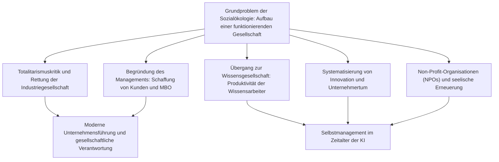
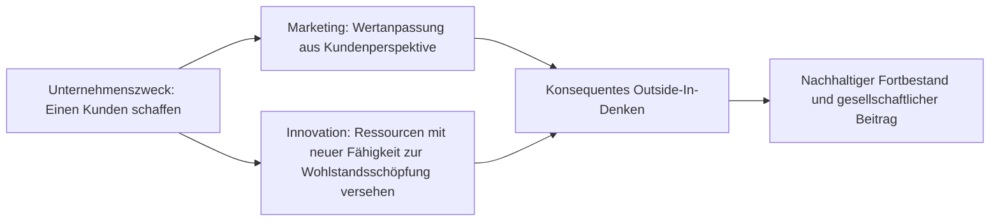
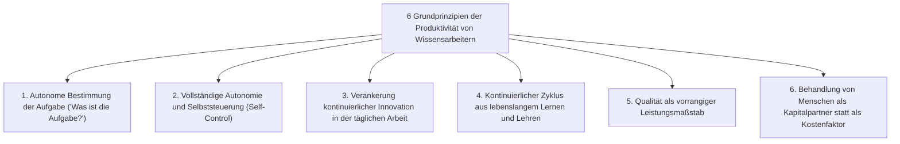
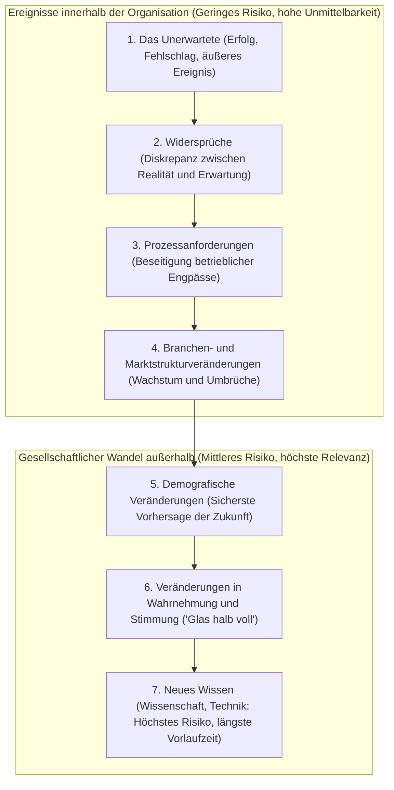

## 1. Einleitung: Die Denkwelt Peter Druckers, des herausragenden Intellektuellen des 20. Jahrhunderts

### 1.1 Die Verengung des Begriffs „Vater des Managements“ und das Wesen des „Sozialökologen“

Peter Ferdinand Drucker (1909–2005) ist weltweit als der „Vater des modernen Managements“ (Father of Modern Management) bekannt. Er selbst lehnte diese Bezeichnung jedoch zeitlebens ab. Die einzigartige Selbstbezeichnung, die Drucker über sein gesamtes Schaffen hinweg wählte und mit Überzeugung vertrat, lautete „Sozialökologe“ (Social Ecologist).

So wie die biologische Ökologie die Wechselwirkungen und das dynamische Gleichgewicht zwischen lebenden Organismen und ihrer Umwelt beobachtet und erforscht, so ist die Sozialökologie die Disziplin, die untersucht, wie Menschen in den von ihnen selbst geschaffenen gesellschaftlichen Umwelten – Unternehmen, Regierungen, Universitäten, Krankenhäusern, Kirchen und Familien – leben, arbeiten, Beziehungen knüpfen und gesellschaftliche Ordnungen bilden.

Druckers zentrales Anliegen galt keineswegs bloßen operativen Techniken zur kurzfristigen Gewinnmaximierung oder administrativen Werkzeugen zur Effizienzsteigerung. Die fundamentale Frage, die er unermüdlich stellte, war eine zutiefst ethische, philosophische und humanistische: **„Wie lässt sich eine funktionierende Gesellschaft (a functioning society) errichten, in der der Mensch in Freiheit und Würde leben kann?“** Seine leidenschaftliche Zuwendung zur Analyse von Wirtschaftsunternehmen entsprang der Erkenntnis, dass das Unternehmen im 20. Jahrhundert zur repräsentativen gesellschaftlichen Institution (Representative Institution) geworden war – zum primären Raum, der den Lebensunterhalt, den sozialen Status und die Identität der Menschen maßgeblich bestimmt.

Viele Führungskräfte und Wissenschaftler der Gegenwart, die Druckers Werke studieren, vergessen leicht, dass er im Europa der Vorkriegszeit den Aufstieg des Nationalsozialismus unmittelbar miterlebte und von einer tief empfundenen politisch-philosophischen Verzweiflung darüber ausging, wie Hitlers Totalitarismus wirksam begegnet werden könne. Dieser Beitrag zeichnet die ideengeschichtlichen Unterströmungen nach, die Druckers gesamtes Leben und Werk durchziehen, und entfaltet sein monumentales geistiges Erbe in einer umfassenden Gesamtdarstellung.

---

### 1.2 Der Wiener Spätherbst, der Aufstieg des Nationalsozialismus und eine aus der Totalitarismuskritik geborene Organisationstheorie

Um den geistigen Ursprung von Druckers Denken zu verstehen, muss man sich das intellektuelle Milieu des ausgehenden Habsburgerreiches in Wien vor Augen führen, in dem er aufwuchs. 1909 in eine wohlhabende, hochgebildete Familie in der k. u. k. Reichshauptstadt Wien geboren, verkehrten im Hause seiner Eltern Geistesgrößen wie Sigmund Freud, Joseph Schumpeter, Ludwig von Mises und Friedrich Hayek.

Mit dem Ausbruch des Ersten Weltkriegs zerbrach jedoch das Habsburgerreich, und in den 1920er und 1930er Jahren geriet die europäische Gesellschaft in einen beispiellosen geistigen und gesellschaftlichen Zusammenbruch. Traditionelle Standesordnungen und religiöse Autoritäten lösten sich auf; das Individuum verlor seine Verwurzelung in der Gemeinschaft und wurde zur isolierten, atomisierten Masse degradiert. Die Weltwirtschaftskrise von 1929 vertiefte diese Verheerung und ließ weite Teile der Bevölkerung am kapitalistischen Markt und an der bürgerlichen Demokratie verzweifeln.

Aus dieser gewaltigen geistigen Leere und Verzweiflung erwuchsen die beiden totalitären Systeme des 20. Jahrhunderts: Hitlers Nationalsozialismus und Stalins Kommunismus. Der junge Drucker, der in Frankfurt am Main im Völker- und Staatsrecht promoviert hatte und als Journalist tätig war, erlebte den rasanten Abstieg Deutschlands in die totalitäre Finsternis vor Ort. Unmittelbar nach Hitlers Machtergreifung im Jahr 1933 floh Drucker nach Großbritannien und emigrierte 1937 in die Vereinigten Staaten.

Für Drucker war der Faschismus keineswegs ein bloßer militärischer oder politischer Wahnsinn, sondern **„die verzweifelte und pathologische Rebellion, die daraus erwuchs, dass die moderne westliche Gesellschaft dem einzelnen Menschen keinen legitimen gesellschaftlichen Status (Status) und keine sinnstiftende Funktion (Function) mehr bieten konnte.“** Um den Totalitarismus an der Wurzel zu überwinden, genügte eine rein militärische Niederwerfung daher nicht. Es galt vielmehr, eine neue, nicht-totalitäre freie Gesellschaftsordnung zu entwerfen, in der jeder Bürger einen festen Platz, eine klare Rolle sowie echte Selbstverwirklichung und Würde erfährt. Dieses tiefe Verantwortungsbewusstsein bildete den wahren Motor, der Drucker zeitlebens zur Erforschung von Organisation und Management antrieb.

---

## 2. Der Ursprung von Druckers Denken: Die Verzweiflung über den Totalitarismus und die Rettung der Industriegesellschaft

### 2.1 *Das Ende des wirtschaftlichen Menschen* (1939) – Grenzen des Marxismus und Kapitalismus, Pathologie des Faschismus

1939 veröffentlichte Drucker im Exil sein erstes epochemachendes Werk: *Das Ende des wirtschaftlichen Menschen: Die Ursprünge des Totalitarismus* (The End of Economic Man: The Origins of Totalitarianism). Das Werk eines damals noch keine dreißig Jahre alten, weitgehend unbekannten Autors wurde von Winston Churchill begeistert aufgenommen und zur Pflichtlektüre für britische Offiziere erklärt.

In diesem Werk sezierte Drucker das Wesen des Nationalsozialismus nicht als „rationales Übel“, sondern als „magischen Scheinwahn, der einbrach, nachdem die rationale Hoffnung in Verzweiflung umgeschlagen war“. Seit dem 18. Jahrhundert ruhte die moderne westliche Zivilisation auf dem Leitbild des „wirtschaftlichen Menschen“ (Economic Man bzw. *Homo oeconomicus*). Der Kapitalismus versprach, dass das freie Streben des Einzelnen nach wirtschaftlichem Eigeninteresse auf dem Markt durch die unsichtbare Hand allgemeinen Wohlstand und Harmonie stiften werde; der Marxismus versprach, dass die Abschaffung von Klassen und Privateigentum durch die proletarische Revolution die wahre Gesellschaft freier und gleicher Menschen verwirklichen werde.

Der Kapitalismus jedoch mündete in chronische Massenarbeitslosigkeit, Ungleichheit und die Schrecken der Weltwirtschaftskrise; der Kommunismus gebar blutige Tyrannei und das System der Zwangsarbeitslager (Gulag). Als beide Mythen gleichzeitig zerbrachen, stürzte die westliche Welt in einen existentiellen Nihilismus: Weder wirtschaftliche Freiheit noch wirtschaftliche Gleichheit vermochten dem Menschen Glück oder sittliche Würde zu garantieren.

Der Faschismus nutzte dieses geistige Vakuum skrupellos aus. Indem er wirtschaftliche Rationalität und individuelle Freiheit offen verwarf und stattdessen eine irrationale Magie aus militaristischer Hierarchie, Rassenmythen und Staatsvergötterung mobilisierte, verlieh er den verzweifelten Massen ein künstliches Gefühl von „Sinn“ und „Zugehörigkeit“. Drucker erkannte messerscharf: Eine bloße Verurteilung des Faschismus reicht zur Heilung der Gesellschaft nicht aus. Es muss eine neue Ordnung geschaffen werden, die wirtschaftliche Vernunft bewahrt, zugleich aber über rein monetäre Gewinne hinausreicht und dem Menschen eine würdevolle bürgerliche Existenz ermöglicht.

---

### 2.2 *Die Zukunft der Industriegesellschaft* (1942) – Die Gemeinschaft, die dem Menschen Status und Funktion verleiht

1942, zeitgleich mit dem Kriegseintritt der USA, veröffentlichte Drucker *Die Zukunft der Industriegesellschaft* (The Future of Industrial Man), worin er den institutionellen Bauplan für die Nachkriegswelt skizzierte.

Die Kernbegriffe dieses Buches sind die „legitime Macht“ (Legitimate Power) sowie der individuelle „Status“ (Status) und die „Funktion“ (Function). Damit eine gesunde und freie Gesellschaft dauerhaft bestehen kann, müssen zwei Grundvoraussetzungen erfüllt sein:

1. **Legitime Macht**: Die Herrschaftsgewalt, die die Gesellschaft ordnet, muss von den Mitgliedern der Gemeinschaft als rechtmäßig und moralisch autorisiert anerkannt werden.
2. **Status und Funktion**: Die einzelnen Mitglieder müssen innerhalb der Gesellschaft einen festen, anerkannten Ort (Status) besitzen und eine Rolle ausfüllen, die einen eigenständigen Beitrag zum Gemeinwohl leistet (Funktion).

Bis ins 19. Jahrhundert hinein sicherten Agrargemeinschaften, Zünfte und familiäre Verbände den individuellen Status und die Funktion des Einzelnen. Mit der zweiten industriellen Revolution und dem Aufkommen riesiger Fabriken und Konzerne wurden diese traditionellen Bindungen jedoch zertrümmert. Der Industriearbeiter geriet zum austauschbaren Rädchen in einem gigantischen Produktionsapparat und litt unter existentieller Ohnmacht und Entfremdung.

Drucker warnte prophetisch: **„Wenn das moderne Industrieunternehmen ein bloßer Wirtschaftsmechanismus zur Erzeugung von Reichtum bleibt und sich nicht zu einer menschlichen Gemeinschaft wandelt, die den arbeitenden Menschen sozialen Status und gesellschaftliche Funktion verleiht, wird die freie Gesellschaft erneut von den Dämonen des Totalitarismus verschlungen werden.“** Hier postulierte Drucker erstmals mit aller Deutlichkeit, dass das Unternehmen weit mehr ist als das Privateigentum von Anteilseignern: Es ist eine autonome governing institution – ein Gemeinwesen, das eine öffentlich-gesellschaftliche Verantwortung trägt.

---

### 2.3 *Das Großunternehmen* (1946) – Die GM-Studie und die Anatomie der modernen Großorganisation

1943 erreichte Drucker eine beispiellose Anfrage. Die Führungsspitze von General Motors (GM) – damals das weltweit größte Industrieunternehmen und das Flaggschiff des globalen Kapitalismus – lud ihn ein, die Managementstrukturen und die Organisationsweise des Konzerns von Grund auf als unabhängiger Beobachter zu untersuchen.

Drucker verbrachte 18 Monate im GM-Konzern. Er führte unzählige Interviews auf allen Hierarchieebenen – von Vorstandschef Alfred P. Sloan und den Vorstandsmitgliedern über Werkleiter und Ingenieure bis hin zu den Arbeitern am Fließband – und nahm an Vorstandssitzungen teil. Das Ergebnis dieser Untersuchung erschien 1946 unter dem Titel *Das Großunternehmen* (Concept of the Corporation) – ein Meilenstein der Organisationslehre.

Dieses Werk ist die erste Schrift der Wirtschaftsgeschichte, die das moderne Großunternehmen nicht als bloßes „Wirtschaftsgebilde“, sondern als **„politische und soziale Institution und konstitutiven Bestandteil der Gesellschaft“** begreift. Drucker deckte auf, dass das Geheimnis der außergewöhnlichen Leistungsfähigkeit von GM in dem von Sloan entwickelten System der „Dezentralisation“ (Decentralization: Spartenorganisation) lag. Anstelle eines zentralistischen, militärischen Befehlsapparats delegierte GM Befugnisse an autonome Geschäftsbereiche, die sich dem Marktwettbewerb und eigener Ergebnisverantwortung stellen mussten. So gelang es dem Koloss, unternehmerische Flexibilität und Eigeninitiative an der Basis mit übergeordneter strategischer Koordination zu verbinden.

---

### 2.4 Der ideologische Konflikt mit Alfred Sloan: Top-down-Rationalismus versus humanistische Organisationsautonomie

Trotz seiner bahnbrechenden Einsichten rief *Das Großunternehmen* innerhalb von General Motors heftigen Widerstand hervor. Alfred P. Sloan und die führenden GM-Direktoren lehnten Druckers humanistische Vorschläge entschieden ab – insbesondere seine Forderungen nach Dezentralisierung von Führungsverantwortung bis auf die Werkstattebene, selbstverwalteten Fabrikgemeinschaften, Achtung der Menschenwürde der Arbeiter und Ansätzen für eine Beschäftigungssicherheit.

Für Sloan war das Unternehmen eine bis ins Letzte rationalisierte „Präzisionsmaschine zur Kombination von Kapital, Technik und Arbeit“, und die Arbeiter waren Wirtschaftseinheiten, die vertraglich geregelt Arbeitskraft gegen Lohn tauschten. Sloan tat Druckers Reformideen als sentimentale, quasi-sozialistische Träumereien ab und ließ das Buch intern faktisch totschweigen. (Ironischerweise verschlang Henry Ford II bei der Konkurrenz Ford Motor Company das Werk mit Begeisterung und nutzte Druckers Erkenntnisse zur Rettung und Sanierung des angeschlagenen Familienunternehmens.)

Dieser fundamentale Konflikt mit Sloan prägte Druckers weiteren Denkweg entscheidend. Er wandte sich endgültig gegen bürokratische Top-down-Kontrollen und die bloße Fixierung auf Finanzkennzahlen und widmete sein weiteres Leben der Ausarbeitung eines **„autonomen, dezentralen Managements, das auf Vertrauen in das menschliche Potenzial und auf Selbststeuerung beruht.“**

---

## 3. Die Geburt des „Managements“ und sein fundamentales System

### 3.1 Die Disziplin, die durch *Die Praxis des Managements* (1954) begründet wurde

1954 veröffentlichte Drucker *Die Praxis des Managements* (The Practice of Management). Mit diesem epochalen Werk begründete er Management erstmals weltweit als eigenständige, systematische akademische Disziplin (Discipline). Zuvor galt Unternehmensführung wahlweise als intuitives Geschick charismatischer Unternehmerpersönlichkeiten oder als rein buchhalterisch-finanztechnische Verwaltung. Drucker erhob das Management zu einem strukturierten Wissensgebiet, das gelernt, gelehrt und planvoll praktiziert werden kann.

Drucker formulierte drei universelle Aufgaben des Managements:

1. **Den spezifischen Zweck und die Mission der Organisation erfüllen**: Für ein Wirtschaftsunternehmen bedeutet dies wirtschaftliche Leistung; für ein Krankenhaus die Heilung von Kranken; für eine Universität Forschung und akademische Lehre.
2. **Die Arbeit produktiv machen und die Mitarbeiter zu Leistungen befähigen**: Das volle Potenzial des Menschen entfalten und ihm ermöglichen, durch seine Arbeit Würde, persönliche Reifung und Erfüllung zu erlangen.
3. **Die gesellschaftlichen Auswirkungen (Impacts) bewältigen und soziale Verantwortung wahrnehmen**: Verhindern, dass die Aktivitäten der Organisation Umwelt oder Gesellschaft schädigen, und als vorbildlicher Bürger (Corporate Citizen) wirken.

Diese drei Aufgaben sind untrennbar miteinander verknüpft. Das Management muss sie in einem permanenten dynamischen Gleichgewicht halten; die Vernachlässigung einer einzigen Dimension gefährdet langfristig die Existenz der gesamten Organisation.

---

### 3.2 Der Unternehmenszweck lautet „Einen Kunden schaffen“: Die Dualität von Marketing und Innovation

Druckers Definition des Unternehmenszwecks gehört zu seinen berühmtesten, zugleich aber auch zu seinen am häufigsten missverstandenen Thesen. Drucker stellt unmissverständlich fest:

> **„Es gibt nur eine gültige Definition für den Zweck eines Unternehmens: einen Kunden zu schaffen (There is only one valid definition of business purpose: to create a customer).“**

Zahllose Manager und Volkswirte beharren darauf, der eigentliche Zweck eines Unternehmens bestehe in der Gewinnmaximierung. Für Drucker ist Gewinn jedoch keineswegs der Zweck des Wirtschaftens, sondern eine unverzichtbare **Bedingung** (Condition) und **Grenze** (Limitation) für das Überleben der Unternehmung – der ökonomische Maßstab für den Erfolg und die notwendige Risikoprämie für künftige Unwägbarkeiten. Genauso wie Herzschlag und Sauerstoffaufnahme notwendige Lebensbedingungen des Menschen sind, so ist das Atmen an sich dennoch nicht der Sinn des menschlichen Lebens.

Ohne Kunden löst sich jedes Unternehmen über Nacht in Luft auf. Ein Kunde ist kein Gebilde, das in der Natur fertig vorgefunden wird; er wird erst durch die zielgerichtete Aktivität des Unternehmens entdeckt und geschaffen. Um Kunden zu schaffen, besitzt jedes Unternehmen im Grunde **lediglich zwei Grundfunktionen** (Basic Functions):

1. **Marketing**: Das tiefgreifende Verstehen der wahren Bedürfnisse, Lebenswirklichkeiten und Wertvorstellungen des Kunden, um Produkte und Dienstleistungen passgenau darauf abzustimmen. „Das Ziel des Marketings ist es, das Verkaufen überflüssig zu machen.“
2. **Innovation**: Bestehenden Ressourcen neue Fähigkeiten zur Schaffung von Wohlstand zu verleihen. Kontinuierlich neuartigen wirtschaftlichen und gesellschaftlichen Wert hervorzubringen.

Alle übrigen Unternehmensaktivitäten (Personalwesen, Finanzwesen, Rechnungswesen, Beschaffung, Logistik) sind lediglich Betriebskosten, die anfallen, um diese beiden Kernfunktionen zu ermöglichen. Die einzige echte Ertragsquelle liegt außerhalb der Unternehmensgrenzen: in der Zufriedenheit des Kunden.

---

### 3.3 Die Wahrheit über das Führen durch Zielvereinbarung (MBO: Management by Objectives and Self-Control)

Eines der revolutionärsten Konzepte, die Drucker in *Die Praxis des Managements* vorstellte, ist das „Führen durch Zielvereinbarung und Selbststeuerung“ (Management by Objectives and Self-Control: MBO).

Heute wird in Konzernen weltweit unter dem Kürzel „MBO“ gearbeitet. Doch wie Drucker in späteren Jahren mit großem Bedauern feststellte, **ist das, was heute in 99 Prozent der Unternehmen als MBO praktiziert wird, zu einem repressiven Kontroll- und Quotensystem verkommen – dem exakten Gegenteil seiner ursprünglichen Konzeption.**

Das eigentliche Herzstück von Druckers MBO liegt im zweiten Teil des Begriffs: in der **„Selbststeuerung“ (Self-Control)**. Traditionelle Führungsmethoden basierten auf Fremdsteuerung (External Control): Vorgesetzte gaben Zielvorgaben von oben herab vor, überwachten die Ausführung und steuerten Mitarbeiter über Belohnung und Bestrafung. Dies war nichts anderes als ein Relikt des Taylorismus, das den Menschen als willenloses Werkzeug behandelte.

Druckers MBO fordert dagegen einen grundlegend emanzipatorischen Prozess:

1. Der gemeinsame Auftrag, die Mission und die übergeordneten Ziele der Gesamtorganisation werden von allen Mitgliedern tief verinnerlicht.
2. Der einzelne Mitarbeiter überlegt eigenverantwortlich, welchen konkreten Beitrag er zu diesen Gesamtzielen leisten kann, und formuliert seine Ziele aus eigenem Antrieb.
3. Informationen und Leistungsdaten zur Überprüfung des Fortschritts stehen **dem Mitarbeiter selbst unmittelbar zur Verfügung**, anstatt als Überwachungsinstrument über den Schreibtisch des Chefs geleitet zu werden.
4. Der Mitarbeiter steuert seinen Fortschritt selbst und nimmt eigenverantwortlich Kurskorrekturen vor.

MBO war niemals als Instrument zur Verschärfung hierarchischer Kontrolle gedacht. Es ist eine **„Philosophie der Befreiung des Menschen, die Bevormundung von außen überflüssig macht und jeden Mitarbeiter zu einem autonomen, verantwortungsbewussten Profi heranreifen lässt.“** Drucker war felsenfest davon überzeugt, dass intrinsische Motivation und eigenverantwortliche Selbststeuerung die Menschenwürde stärken und zugleich Spitzenleistungen ermöglichen.

---

### 3.4 Definition von Leistung (Results) und Ressourcenallokation: Die acht Schlüsselbereiche der Unternehmung

Drucker warnte eindringlich davor, den Zustand eines Unternehmens an einer einzigen Kennzahl (wie Quartalsgewinn oder Umsatz) zu messen. Damit ein Unternehmen zukunftsfähig bleibt und seine gesellschaftliche Aufgabe erfüllt, muss das Management ausgewogene Ziele in **acht Schlüsselbereichen (Key Result Areas)** definieren und verfolgen:

| Bereich | Inhalt und strategische Relevanz |
| :--- | :--- |
| **1. Marketing** | Marktanteile in bestehenden Segmenten, Erschließung ungedeckter Bedürfnisse und Schaffung völlig neuer Kundenkreise. |
| **2. Innovation** | Fortschritte bei Produkten, Dienstleistungen, Verwaltungsprozessen, Organisationsstrukturen und Geschäftsmodellen. |
| **3. Personal und Organisationsfähigkeit** | Mitarbeiterentwicklung, Leistungsmotivation, Ausbildung von Führungskräften und Förderung autonomer Teams. |
| **4. Finanzielle Ressourcen** | Kapitalbeschaffungskompetenz, Liquiditätssicherung, gesunder Cashflow und optimale Kapitalallokation. |
| **5. Materielle Ressourcen** | Leistungsfähigkeit, Modernität und Substanzsicherung von Produktionsanlagen, Gebäuden und IT-Infrastruktur. |
| **6. Produktivität** | Verhältnis der eingesetzten Ressourcen (Arbeit, Kapital, Zeit, Rohstoffe) zur geschaffenen Wertschöpfung. |
| **7. Soziale Verantwortung** | Gemeinwohlorientierung, Umweltschutz, ethische Integrität und konstruktive Einhaltung von Rechtsnormen. |
| **8. Gewinnbedarf** | Das erforderliche Mindestgewinnniveau, um die vorangegangenen sieben Ziele zu finanzieren und künftige Risiken abzusichern. |

Der Kern von Druckers Lehre gipfelt in dem Satz: **„Gewinn ist nicht der Zweck, sondern die Existenzbedingung des Unternehmens.“** Er ist Zeugnis vergangener Entscheidungen und zugleich die Versicherungsprämie, die gezahlt werden muss, um die Risiken einer ungewissen Zukunft abzusichern.

---

## 4. Die Vorwegnahme der Wissensgesellschaft und das Aufkommen des „Wissensarbeiters“

### 4.1 Von *Die Zukunft bewältigen* (1969) zu *Die postkapitalistische Gesellschaft* (1993)

Unter Druckers zahlreichen zukunftsweisenden Einsichten hinterließ keine eine tiefere historische Wirkung als seine Vorhersage der „Wissensgesellschaft“ (Knowledge Society). Bereits 1959 prägte Drucker in seinem Werk *Das Fundament für morgen* (Landmarks of Tomorrow) erstmals in der Geschichte den Begriff des **„Wissensarbeiters“ (Knowledge Worker)**.

1969 wies er in seinem Meilenstein *Die Zukunft bewältigen* (The Age of Discontinuity) nach, dass das wirtschaftliche Fundament der industriellen Welt tiefgreifende tektonische Verschiebungen erfuhr. Die klassische Nationalökonomie hatte stets drei Produktionsfaktoren definiert: Boden (Rohstoffe), Arbeit (Handarbeit) und Kapital (Fabriken, Maschinen). Drucker verkündete, dass diese traditionellen Faktoren in der zweiten Hälfte des 20. Jahrhunderts in den Hintergrund traten: **„Wissen“ (Knowledge) stieg zum einzig entscheidenden Produktionsfaktor auf.**

In seinem 1993 erschienenen Buch *Die postkapitalistische Gesellschaft* (Post-Capitalist Society) trieb Drucker diese Analyse auf die Spitze. Im Kapitalismus lag die Macht bei den Eigentümern des Kapitals (Bourgeoisie, Kapitalgeber). In der Wissensgesellschaft hingegen liegt das entscheidende Kapital in den Köpfen der arbeitenden Menschen. Da Wissensarbeiter die Produktionsmittel (ihren Intellekt, ihr Fachwissen und ihr Urteilsvermögen) buchstäblich in ihrem Kopf tragen und die Organisation jederzeit verlassen können, kehrte sich das Machtverhältnis zwischen Organisation und Arbeitskraft erstmals in der Geschichte um.

---

### 4.2 Der historische Wandel von der Handarbeit (Taylorismus) zur Wissensarbeit

Das herausragende Wirtschaftswunder des 20. Jahrhunderts bestand darin, dass Frederick Winslow Taylors „Wissenschaftliche Betriebsführung“ (Taylorismus) **die Produktivität des Handarbeiters um das Fünfzigfache steigerte**. Durch akribische Zeit- und Bewegungsstudien zerlegte Taylor komplexe Handgriffe in standardisierte Einzelabläufe. Diese Produktivitätsrevolution ermöglichte Massenproduktion, breiten Wohlstand und eine stabile Mittelschicht und bewahrte die westlichen Industriestaaten vor marxistischen Erschütterungen.

Doch Drucker mahnte mit Nachdruck: „War die Steigerung der Produktivität der manuellen Arbeit der größte Beitrag des Managements im 20. Jahrhundert, **so ist die Steigerung der Produktivität der Wissensarbeit die größte Herausforderung des 21. Jahrhunderts.**“

Zwischen Handarbeit und Wissensarbeit bestehen unüberbrückbare Wesensunterschiede:

| Merkmal | Handarbeit (Manual Work) | Wissensarbeit (Knowledge Work) |
| :--- | :--- | :--- |
| **Definition der Aufgabe** | Die Aufgabe ist starr vorgegeben und zweifelsfrei (z. B. Lasten heben, Schrauben anziehen). | Man muss stets selbst bestimmen: **„Was ist die Aufgabe? Wozu tun wir das?“** |
| **Autonomie** | Striktes Befolgen von Arbeitsanweisungen gilt als Tugend; ständige Fremdkontrolle. | **Autonomie ist unverzichtbar**; ohne Selbststeuerung ist Höchstleistung unmöglich. |
| **Kontinuierliche Innovation** | Innovation wird von externen Ingenieuren oder Prozessplanern vorgegeben. | Der Wissensarbeiter muss **kontinuierliche Innovation** fest in seinen Arbeitsalltag verankern. |
| **Lernen und Lehren** | Fertigkeiten werden einmal erlernt und durch Routine verfeinert. | Wissen veraltet extrem schnell; **lebenslanges kontinuierliches Lernen und Lehren** sind Pflicht. |
| **Leistungsmaßstab** | Vorwiegend **Quantität** (Stückzahl pro Zeiteinheit). | Vorwiegend **Qualität** (Tiefe der Analyse, Wirksamkeit der Problemlösung). |
| **Eigentum an Produktionsmitteln** | Fabrik, Maschinen und Werkzeuge gehören dem **Kapitaleigner**. | Die Produktionsmittel (Wissen, Urteilskraft) gehören dem **Wissensarbeiter selbst**. |

In der Wissensarbeit garantiert langes, anstrengendes Arbeiten keinerlei Erfolg. Die vollkommen fehlerfreie Beantwortung einer falschen Fragestellung ist reine Ressourcenverschwendung. Produktivitätssteigerung bei Wissensarbeitern lässt sich niemals mit tayloristischen Stechuhr-Methoden erzwingen; sie erfordert einen radikalen Paradigmenwechsel im Führungsverständnis.

---

### 4.3 Die sechs Grundprinzipien für die Produktivität von Wissensarbeitern

In *Management im 21. Jahrhundert* (Management Challenges for the 21st Century, 1999) formulierte Drucker die sechs entscheidenden Voraussetzungen zur Steigerung der Produktivität des Wissensarbeiters:

1. **Stetig fragen: „Was ist die Aufgabe?“**: Der folgenschwerste Schritt in der Wissensarbeit ist die präzise Definition dessen, was getan werden muss. Nichts ist schädlicher, als Dinge mit höchster Effizienz zu erledigen, die man gar nicht tun sollte.
2. **Umfassende Autonomie gewähren**: Wissensarbeiter müssen sich selbst steuern. Nur Autonomie erzeugt echte Verantwortung und professionelles Handeln.
3. **Kontinuierliche Innovation in die tägliche Arbeit integrieren**: In seinem Fachgebiet muss der Wissensarbeiter unaufhörlich nach neuen Wegen und Wertschöpfungspotenzialen suchen.
4. **Einen dauerhaften Zyklus aus Lernen und Lehren etablieren**: Der Wissensarbeiter muss stets Lernender sein, zugleich aber auch Kollege und Mentor für andere. Nichts schärft und systematisiert das eigene Wissen so sehr wie das Unterrichten anderer.
5. **Qualität vor Quantität stellen**: Eine einzige tiefgreifende, treffende Analyse entscheidet oft über das Schicksal eines Unternehmens, während hundert nichtssagende Berichte wertlos sind.
6. **Wissensarbeiter als Kapitalwerte behandeln, nicht als Kostenfaktor**: Wissensarbeiter sind keine austauschbaren Rädchen im Getriebe, sondern Partner, die ihr intellektuelles Kapital freiwillig in die Organisation investieren.

---

### 4.4 „Wissensarbeiter müssen ihr eigener CEO sein“: Das Management seiner selbst

Die Etablierung der Wissensgesellschaft revolutioniert auch die persönliche Lebensführung des Einzelnen. In seinem bahnbrechenden HBR-Aufsatz „Management seiner selbst“ (Managing Oneself, 1999) formulierte Drucker einen eindringlichen Appell an jede moderne Fach- und Führungskraft.

In vormodernen Zeiten bestimmten Herkunft und Familientradition den Beruf. In der Industrieära bot der Eintritt in einen Großkonzern vorgezeichnete Karrierepfade bis zur Pensionierung. In der Wissensgesellschaft gilt jedoch: **„Jeder muss seine eigene Laufbahn gestalten und seine persönliche Leistungsfähigkeit selbst managen.“** Bei einer heutigen durchschnittlichen Lebenserwartung von über 80 Jahren ist die Lebensdauer von Unternehmen (durchschnittlich rund 30 Jahre) oft wesentlich kürzer als das Erwerbsleben eines Menschen. Jeder Wissensarbeiter muss sich deshalb als Geschäftsführer seines eigenen Lebensunternehmens („Ich-AG / Me, Inc.“) begreifen.

Drucker benannte folgende fundamentale Disziplinen des Selbstmanagements:

#### ① Die eigenen Stärken kennen (Strengths)
Der Kern von Druckers Menschenbild lautet: **„Man kann nur auf Stärken aufbauen. Niemand erzielt Leistungen durch das Überwinden von Schwächen, geschweige denn auf Gebieten, die man überhaupt nicht beherrscht.“**

Schulen und innerbetriebliche Weiterbildungen vergeuden oft enorme Energie darauf, Schwächen aufzuspüren und mühsam auf ein Mittelmaß anzuheben. Doch der Aufwand, Inkompetenz in Mittelmaß zu verwandeln, ist ungleich höher als der Einsatz, der nötig ist, um eine ausgeprägte Stärke zur echten Meisterschaft zu veredeln.

Um die eigenen Stärken zweifelsfrei herauszufinden, empfahl Drucker als einzig verlässliche Methode die **Feedback-Analyse (Feedback Analysis)**:
- Wenn Sie eine wichtige Entscheidung treffen oder ein größeres Vorhaben starten, **schreiben Sie präzise auf, welche Ergebnisse Sie erwarten**.
- Vergleichen Sie neun oder zwölf Monate später **die tatsächlichen Resultate Punkt für Punkt mit Ihren schriftlichen Erwartungen**.
- Wer dies über mehrere Jahre hinweg praktiziert, erkennt mit schonungsloser Klarheit, worin die wahren Stärken liegen, welche schlechten Gewohnheiten Erfolge vereiteln und in welchen Bereichen man schlichtweg talentfrei ist.

#### ② Die eigene Arbeitsweise verstehen (How I Perform)
Genauso wichtig wie die Stärken ist das Bewusstsein für das eigene Arbeits- und Aufnahmeverhalten:
- **Sind Sie ein „Leser“ (Reader) oder ein „Zuhörer“ (Listener)?** (Dwight D. Eisenhower war ein Leser; in freien mündlichen Pressekonferenzen wirkte er oft ungelenk, brillierte jedoch, sobald ihm vorab schriftliche Memos vorgelegt wurden. Franklin D. Roosevelt und Harry Truman hingegen waren klassische Zuhörer.)
- **Wie lernen Sie?** (Lernen Sie durch Schreiben, durch das mündliche Diskutieren mit anderen oder durch praktisches Tun?)
- **Sind Sie ein geborener Entscheider (Decision Maker) oder ein Berater (Adviser)?** (Zahllose herausragende Berater scheiterten tragisch, als sie auf den Chefsessel rückten und plötzlich alleinige Entscheidungen treffen mussten.)

#### ③ Vorbereitung auf die zweite Lebenshälfte (Die zweite Karriere)
Während Handwerker sich durch körperlichen Verschleiß zur Ruhe setzen, geraten Wissensarbeiter zwischen Mitte vierzig und fünfzig häufig in Lähmung und Burnout. Nach zwanzig Jahren im selben Spezialgebiet versiegt der Lernzuwachs, und Routine erstickt die Begeisterung.

Drucker riet dringend dazu, bereits vor dem vierzigsten Lebensjahr ein **„zweites Standbein (eine Parallelkarriere oder ein starkes Engagement im Non-Profit-Bereich)“** aufzubauen. Wer außerhalb des Hauptberufs in Vereinen, Stiftungen, Wissenschaft oder Ehrenamt eine Wirkungsstätte pflegt, in der er mit seinen Stärken echte Beiträge leisten kann, besitzt ein seelisches Auffangbecken. Ein solches Fundament schützt bei betrieblichen Krisen oder Brüchen die persönliche Würde und schenkt der zweiten Lebenshälfte tiefe Erfüllung.

---

## 5. Systematische Methodik von Innovation und Unternehmertum

### 5.1 *Innovation und Unternehmertum* (1985)

Viele Menschen betrachten Innovationen noch immer als Geistesblitze weltfremder Genies oder als Frucht astronomischer Budgets in Konzernforschungslaboren.

In seinem 1985 erschienenen Werk *Innovation und Unternehmertum* (Innovation and Entrepreneurship) räumte Drucker mit diesem romantischen Innovationsmythos auf. Für ihn ist Innovation keine Laune genialer Eingebungen, sondern **„eine systematische, disziplinierte Praxis, die erlernt, organisiert und planvoll ausgeübt werden kann.“**

Drucker definierte Innovation folgendermaßen:
> **„Innovation ist das spezifische Instrument des Unternehmers; das Mittel, mit dem er den Wandel als Chance für ein anderes Geschäft oder eine andere Dienstleistung nutzt... Bevor der Mensch Verwendungszwecke entdeckt und ihnen wirtschaftlichen Wert verleiht, ist keine Pflanze eine Nutzpflanze, kein Mineral ein Erz und Erdöl lediglich ein lästiger, den Boden verunreinigender Schlamm.“**

Bis zur Mitte des 19. Jahrhunderts galt Rohöl als stinkende Plage, die landwirtschaftliche Böden entwertete. Was es in eine Quelle gewaltigen Wohlstands verwandelte, war nicht allein die chemische Raffinationstechnik, sondern die unternehmerische Innovation, die Technologie mit den aufkommenden Bedürfnissen einer industrialisierten Welt verknüpfte.

---

### 5.2 Den Mythos des „Geistesblitzes“ überwinden: Die sieben Quellen für Innovationschancen

Drucker systematisierte **„Die sieben Quellen für Innovationschancen“ (The Seven Sources for Innovative Opportunity)**, die jede Organisation kontinuierlich beobachten muss. Sie sind nach abnehmender Zuverlässigkeit und steigendem Risiko geordnet:

#### ① Das Unerwartete (Unerwarteter Erfolg, unerwarteter Fehlschlag, unerwartetes äußeres Ereignis)
Die risikoärmste und fruchtbarste, von etablierten Unternehmen jedoch am häufigsten übersehene Quelle:
- **Der unerwartete Erfolg**: Als IBM seine ersten Großrechner baute, waren diese für wissenschaftliche Berechnungen konzipiert. Zur Überraschung des Managements bestellten Banken und Versicherungen die Maschinen scharenweise für banale Abrechnungszwecke. Während Ingenieure diese unakademische Nutzung rümpften, konzentrierte die IBM-Führung all ihre Ressourcen auf diese unerwartete Nachfrage und legte damit das Fundament für ihr Computerimperium.
- Führungskräfte neigen dazu, in monatlichen Berichten stundenlang über Soll-Ist-Abweichungen und Fehlschläge zu debattieren, während Produkte, die alle Prognosen übertreffen, als Zufall abgetan werden. Drucker forderte, die erste Seite jedes Monatsberichts ausschließlich für unerwartete Erfolge zu reservieren und die fähigsten Mitarbeiter auf diese Chancen anzusetzen.

#### ② Widersprüche (Inkongruenzen)
Krasse Unstimmigkeiten zwischen den Annahmen des Managements über die Wirklichkeit und den tatsächlichen Gegebenheiten:
- In den 1950er Jahren investierten Reedereien enorme Summen in schnellere Schiffe und sparsamere Motoren, gerieten aber dennoch in die Verlustzone. Der eigentliche Kostentreiber war nicht die Fahrzeit auf See, sondern die tagelangen Liegezeiten in den Häfen beim manuellen Be- und Entladen. Malcom McLean erkannte diese Inkongruenz und entwickelte die **Containerisierung**. Ohne die Schiffe schneller zu machen, revolutionierte er den Güterumschlag durch genormte Stahlboxen, verkürzte Hafenliegezeiten von Wochen auf Stunden und entfachte eine Explosion des Welthandels.

#### ③ Prozessanforderungen (Process Need)
Die Beseitigung eines störenden Engpasses oder eines „fehlenden Glieds“ (Missing Link) in einem bestehenden Arbeitsprozess:
- Die Polaroid-Kamera entstand aus dem Wunsch, das mühsame, tagelange Entwickeln von Fotofilmen im Labor zu umgehen. Automatische Telefonvermittlungen wurden entwickelt, weil schlichtweg nicht genügend menschliche Telefonistinnen rekrutiert werden konnten, um den explodierenden Fernsprechverkehr manuell zu schalten.

#### ④ Branchen- und Marktstrukturveränderungen
Wenn eine Branche über Jahre hinweg um mehr als zehn Prozent jährlich wächst, brechen alte Strukturen auf und bieten agilen Neulingen Raum:
- Volvo nutzte das stürmische Wachstum des Automobilmarkts durch die konsequente Fokussierung auf Fahrzeugsicherheit; Online-Broker nutzten den Boom der Finanzmärkte zur Disruption traditioneller Wertpapierhäuser.

#### ⑤ Demografische Veränderungen
Unter allen Elementen der **„Zukunft, die bereits stattgefunden hat“**, sind demografische Kennzahlen (Geburtenraten, Sterberaten, Altersstruktur, Bildungsniveau) die verlässlichsten und exaktesten Vorhersagefaktoren:
- Wie viele Zwanzigjährige in zwanzig Jahren dem Arbeitsmarkt zur Verfügung stehen, lässt sich heute durch einfaches Zählen der Neugeborenen mit hundertprozentiger Genauigkeit bestimmen. Überalterung, Fachkräftemangel und steigende Frauen-Erwerbsquoten eröffnen gewaltige Innovationspotenziale.

#### ⑥ Veränderungen in Wahrnehmung, Bedeutung und Stimmung
Phänomene, bei denen sich die objektiven Fakten nicht ändern, wohl aber der subjektive Deutungsrahmen der Menschen:
- Die klassische Verschiebung der Betrachtung vom „halb vollen“ zum „halb leeren Glas“. Obwohl die moderne Medizin die Menschen gesünder und langlebiger gemacht hat als jemals zuvor in der Geschichte, war die Angst vor Krankheiten und Umweltgiften nie größer – ein Nährboden für florierende Milliardenmärkte bei Bioprodukten, Wellness und Fitness.

#### ⑦ Neues Wissen
Innovationen, die auf neuen wissenschaftlichen Erkenntnissen, technischen Erfindungen oder Theorien beruhen:
- Dies ist das, was die breite Öffentlichkeit meist für „die einzige wahre Innovation“ hält. Drucker mahnte jedoch: **Wissensbasierte Innovationen weisen die niedrigste Erfolgsquote auf, verschlingen das meiste Kapital und haben die längsten Vorlaufzeiten** (in der Regel vergehen zwischen wissenschaftlicher Entdeckung und marktreifem Produkt 25 bis 30 Jahre). Zudem gelingen sie fast nie isoliert, sondern erfordern die Konvergenz mehrerer disparater Wissensgebiete.

---

### 5.3 Systematische Aufgabe (Systematic Abandonment): Der Mut, den gestrigen Erfolg zu beenden

Der entscheidende erste Schritt für Innovationen besteht nicht darin, neue Ideen auszubrüten. Drucker stellte unmissverständlich klar: **„Der erste Schritt zu einer erfolgreichen Innovation ist die systematische Aufgabe – das gezielte, organisierte Loslassen von Dingen, die überholt sind, keine Ergebnisse mehr bringen, und von den Erfolgen von gestern.“**

Jede Organisation neigt von Natur aus dazu, ihre besten Köpfe und wertvollsten Mittel an die Pflege überholter Produkte und schrumpfender Geschäftsbereiche zu binden. Was einst ein grandioser Erfolg war, wird zum unantastbaren Denkmal; niemand wagt es, dessen Ende auszusprechen. Dadurch fehlen die Ressourcen für die Gestaltung der Zukunft.

Drucker verpflichtete jede Unternehmensleitung dazu, sich regelmäßig einer schonungslosen Frage zu stellen:
> **„Wenn wir diese Aktivität heute nicht schon betreiben würden – würden wir sie mit unserem heutigen Wissen und unter den heutigen Bedingungen nochmals beginnen?“**

Lautet die ehrliche Antwort „Nein“, darf man nicht zögern, sondern muss fragen: „Was tun wir also heute dagegen?“ Die Antwort darf kein kosmetisches Reformieren oder Hinauszögern sein, sondern muss in einem planvollen Rückzug bzw. einer geordneten Liquidation bestehen. Genauso wie ein lebender Organismus abstirbt, wenn er abgestorbene Zellen nicht ausscheidet, erstickt ein Unternehmen unweigerlich, wenn es das Vergangene nicht systematisch aufgibt.

---

## 6. Unternehmensführung, gesellschaftliche Verantwortung und die Bedeutung von Non-Profit-Organisationen (NPOs)

### 6.1 Die drei Kernaufgaben und das Wesen der gesellschaftlichen Verantwortung in *Management* (1973)

1973 legte Drucker mit seinem zweibändigen, über tausend Seiten starken Monumentalwerk *Management: Aufgaben, Verantwortlichkeiten, Praktiken* (Management: Tasks, Responsibilities, Practices) die Summe seines Denkens vor.

Darin erörterte er das Konzept der Corporate Social Responsibility (CSR) in einer Tiefe, die weit über das heute übliche Sponsoring oder wohlklingende PR-Philanthropie hinausgeht. Drucker unterschied strikt zwischen zwei Dimensionen der gesellschaftlichen Verantwortung:

1. **Die Bewältigung negativer Auswirkungen (Impacts) des eigenen Handelns**:
   - Schadstoffemissionen, Lärmbelastung, Industrieabfälle, Gesundheitsschäden oder soziale Entfremdung, die als unbeabsichtigte Nebenfolgen der betrieblichen Tätigkeit auftreten.
   - Druckers Urteil ist kategorisch: **„Das Management hat die unbedingte Pflicht, schädliche Nebenwirkungen des eigenen Tuns ohne Wenn und Aber auf null zu reduzieren – ungeachtet der Kosten.“** Solche Schäden zu ignorieren, bedeutet Vertrauensbruch gegenüber der Gesellschaft und zerstört die moralische Legitimation der Organisation.
2. **Die Bewältigung allgemeiner gesellschaftlicher Probleme (Social Problems)**:
   - Armut, Bildungsdefizite, Diskriminierung, Verfall von Innenstädten oder Umweltkrisen, die unabhängig vom Betrieb der Organisation im Gemeinwesen existieren.
   - Hierbei stellte Drucker ein streng realistisches Prinzip auf: „Ein Wirtschaftsunternehmen sollte gesellschaftliche Probleme **nur dann anpacken, wenn es diese dank seiner spezifischen Kernkompetenzen und Stärken in tragfähige Geschäftsmodelle verwandeln kann**.“ Wer sich aus sentimentaler Begeisterung auf Felder begibt, für die ihm die Kompetenz fehlt, und dadurch das eigene Kerngeschäft ruiniert, handelt in höchstem Maße unverantwortlich.

---

### 6.2 Warum Drucker sich in seinen späten Jahren mit Leidenschaft den Non-Profit-Organisationen widmete

Ab den 1980er Jahren widmete Drucker, der damals auf dem Zenit seines weltweiten Ansehens stand, den Großteil seiner Schaffenskraft der Beratung und Erforschung von gemeinnützigen Organisationen (Non-Profit-Organisationen: NPOs) – darunter Universitäten, Krankenhäuser, die Pfadfinderinnen (Girl Scouts), die Heilsarmee und Kirchengemeinden. 1990 erschien sein programmatisches Werk *Management in Non-Profit-Organisationen* (Managing the Non-Profit Organization).

Warum wandte sich Drucker von den globalen Industriegiganten ab und den NPOs zu? Dies war die logische Konsequenz seines lebenslangen Strebens nach einer funktionierenden Gesellschaft.

Unternehmen stellen Produkte und Dienstleistungen bereit, um Kunden zu schaffen. Regierungen erlassen Gesetze und setzen Verordnungen durch. **Doch weder Wirtschaft noch Staat vermögen die menschliche Seele zu heilen oder die soziale Gemeinschaft zu erneuern.**
- Die Mission des Krankenhauses ist nicht der finanzielle Überschuss, sondern die Genesung des Kranken.
- Die Mission der Kirche ist die Seelsorge.
- Die Mission der Heilsarmee besteht darin, Verzweifelte und Suchtkranke wieder zu aufrechten, selbstständigen Bürgern aufzurichten.

Drucker brachte es auf den Punkt: **„Das wahre Produkt einer Non-Profit-Organisation ist ein veränderter Mensch (A Changed Human Being).“**

Zudem formulierte Drucker ein verblüffendes Paradoxon: Während die landläufige Meinung forderte, NPOs müssten betriebswirtschaftliches Management von Konzernen lernen, postulierte Drucker genau das Umgekehrte: **„Wirtschaftsunternehmen müssen von vorbildlich geführten Non-Profit-Organisationen lernen, was wahres Management bedeutet.“**

Denn gemeinnützige Institutionen verfügen über keine finanziellen Druckmittel; sie können Loyalität nicht mit Boni oder Gehaltserhöhungen erzwingen, da ein Großteil der Mitarbeiter ehrenamtlich arbeitet. Diese Menschen engagieren sich einzig aus Hingabe an eine „edle Mission“ und aus Stolz auf ihren persönlichen Beitrag. Da Führungsschwächen nicht mit Geld kaschiert werden können, müssen NPO-Leiter meisterhaft darin sein, klare Ziele zu formulieren, gemeinsame Werte vorzuleben und echte Selbststeuerung zu ermöglichen. Diese Kunst, Freiwillige zu führen, ist das ultimative Vorbild für die Wirtschaftsunternehmen des 21. Jahrhunderts, die Wissensarbeiter nicht als abhängige Befehlsempfänger, sondern als freiwillige Partner führen müssen.

---

## 7. Neubewertung von Druckers Denken in der Gegenwart und im Zeitalter der Künstlichen Intelligenz

### 7.1 Generative KI und der neue Paradigmenwechsel der Wissensgesellschaft

In den 2020er Jahren hat die Wissensgesellschaft durch den Siegeszug von Large Language Models (LLMs) wie ChatGPT und generativer künstlicher Intelligenz eine radikale Entwicklungsstufe erreicht, die selbst Drucker in dieser Form kaum vorhersehen konnte.

Zahllose intellektuelle Tätigkeiten, die lange Zeit als sakrosanktes Kerngebiet des Bildungsbürgertums galten – Programmieren, Verfassen juristischer Schriftsätze, Bilanzanalysen, redaktionelles Schreiben und medizinische Vorab-Diagnosen –, werden heute von KI in Sekundenschnelle und mit übermenschlicher Präzision automatisiert. Was der Taylorismus vor hundert Jahren an den Werkbänken der Handarbeit vollbrachte, vollzieht die generative KI nun bei den Schreibtischen der geistigen Arbeit.

Im Zeitalter der KI verliert Druckers Lehre jedoch keineswegs an Gültigkeit – sie wird vielmehr unverzichtbarer denn je. Drucker betonte stets: **„Das Generieren von Antworten (die Ausführung) ist die Aufgabe von Maschinen; die wahrhaft menschliche Arbeit besteht darin, die richtigen Fragen zu stellen (Asking the Right Questions).“**

Künstliche Intelligenz ist herausragend darin, aus riesigen vorhandenen Datenbeständen Antworten auf vorgegebene Eingabeaufforderungen (Prompts) zu synthetisieren. Es ist ihr jedoch wesensgemäß unmöglich, die existentiellen, richtungsweisenden Grundsatzfragen zu stellen:
- „Was soll die eigentliche Mission und der Zweck unserer Organisation sein?“
- „Was bedeutet für unsere Kunden wirklicher Wert?“
- „Welchen gestrigen Erfolg müssen wir heute mutig aufgeben?“
- „Welche ethische und menschliche Verantwortung tragen wir gegenüber der Gesellschaft?“

Je mehr Routine-Denkarbeit von KI übernommen wird, desto reiner kristallisiert sich die verbleibende Führungsaufgabe des Menschen auf jene philosophischen Dimensionen heraus, die Drucker stets in den Mittelpunkt stellte: Werteentscheidungen, ethische Verantwortung, Sinnstiftung und mitmenschliche Verbundenheit.

---

### 7.2 Anknüpfungspunkte und Übereinstimmung mit Agile, OKR und Teal-Organisationen

Wer sich heute mit modernen Organisationsmodellen wie agiler Entwicklung (Agile), OKRs (Objectives and Key Results) oder den von Frédéric Laloux beschriebenen Teal-Organisationen (evolutionäre, selbstorganisierte Systeme) beschäftigt, stellt mit Staunen fest, dass deren geistige Wurzeln eins zu eins auf Druckers Grundsätze zurückgehen:

- **Die Kundenorientierung und iterative Anpassung agiler Methoden** spiegeln Druckers Credo wider, dass der Zweck des Unternehmens in der Schaffung von Kunden liegt und Innovation fest im Alltag verankert sein muss.
- **Die von Andy Grove bei Intel entwickelten und von Google popularisierten OKRs** sind die direkte Fortentwicklung von Druckers MBO (Führen durch Zielvereinbarung und Selbststeuerung).
- **Die Selbstführung (Self-Management) und Ganzheitlichkeit in Teal-Organisationen** sind die moderne Verkörperung dessen, was Drucker seit *Die Zukunft der Industriegesellschaft* forderte: menschliche Gemeinschaften, die dem Mitarbeiter Status und Funktion geben und durch Selbstkontrolle getragen werden.

Druckers Werk ist kein verstaubter Klassiker der Vergangenheit. Die modernsten Managementkonzepte unserer Zeit sind die gereiften Früchte jener intellektuellen Felder, die dieser Ausnahmegeist einst bestellt hat.

---

### 7.3 Fazit: Auf dem Weg zu einer noch immer unvollendeten „funktionierenden Gesellschaft“

Bis kurz vor seinem Tod im Alter von 95 Jahren blieb Peter Drucker unermüdlich als Denker, Autor und Berater aktiv. Wer sein gewaltiges Lebenswerk studiert, nimmt als bleibende Botschaft keine Sammlung von Managementtricks mit, sondern **„ein unerschütterliches Vertrauen in das Wesen des Menschen und ein grenzenloses Verantwortungsgefühl gegenüber der Gesellschaft.“**

Im 21. Jahrhundert – in dem das bloße Streben nach Geldvermehrung oft zum Selbstzweck verkommt, ein kurzatmiger Shareholder-Kapitalismus Mensch und Natur ausbeutet und der rasante technologische Wandel die Menschenwürde herausfordert – müssen wir mehr denn je zu Druckers Fundamenten zurückkehren.

Eine Organisation ist keine Maschine zur Profitmaximierung; sie ist ein menschliches Werkzeug, um menschliche Stärken wirksam und menschliche Schwächen bedeutungslos zu machen. Management ist keine Ausübung von Herrschaft, sondern eine sittliche Praxis zur Befähigung, Reifung und Befreiung des Menschen.

Druckers Vision einer funktionierenden, freien Gesellschaft, in der jeder Einzelne in Würde arbeitet und als selbstbestimmter Bürger einen wertvollen Beitrag zum Gemeinwohl leistet, ist noch längst nicht vollendet. Diesen unvollendeten Staffelstab aufzunehmen und in der eigenen beruflichen wie gesellschaftlichen Praxis mit Leben zu füllen, ist der bleibende Auftrag an uns alle.
