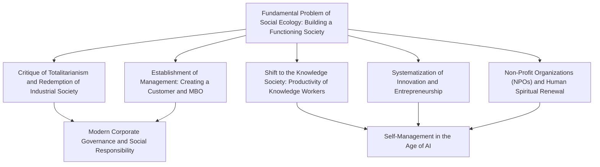
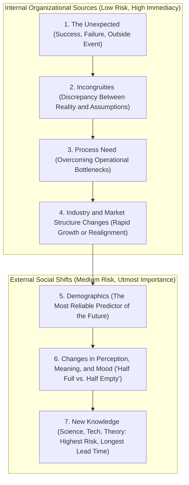

## 1. Introduction: The Scope of Peter Drucker, the 20th Century’s Greatest Intellect

### 1.1 The Diminishing Moniker of "Father of Modern Management" and the Essence of the "Social Ecologist"

Peter Ferdinand Drucker (1909–2005) is celebrated worldwide as the "Father of Modern Management." Yet throughout his long life, he consistently rejected such labels. The distinctive title Drucker chose for himself, and maintained until his death, was "Social Ecologist."

Just as biological ecology observes and studies the interactions and dynamic equilibrium between living organisms and their surrounding environments, social ecology is the discipline that examines how human beings live, work, relate to one another, and build social order within the man-made environments of society—the diverse institutions and organizations encompassing businesses, governments, universities, hospitals, churches, and families.

Drucker’s central concern was never mere tactical gimmicks to maximize corporate profits or administrative tools to enhance operational efficiency. The fundamental question he posed unceasingly throughout his career was an intensely ethical, philosophical, and humanistic one: **"How can we build a functioning society in which human beings can live with freedom and dignity?"** His passionate dedication to analyzing business enterprises stemmed directly from the reality that, in the twentieth century, the business corporation had become society’s "Representative Institution"—the primary arena defining people’s daily livelihoods, social status, and personal identities.

Many contemporary business leaders and scholars who read Drucker’s work tend to forget that he began his intellectual journey in pre-World War II Europe, having witnessed firsthand the terrifying rise of Nazism, driven by an acute political-philosophical despair over how to combat Hitler’s totalitarianism. This essay traces the subterranean currents of thought that run through Drucker’s entire life and bibliography, offering an exhaustive exploration of the boundless intellectual edifice he bequeathed to humanity.

---

### 1.2 The Twilight of Vienna, the Rise of Nazism, and Organizational Theory Born from the Critique of Totalitarianism

To grasp the bedrock of Drucker’s thought, one must understand the intellectual milieu of late Habsburg Vienna where he was raised. Born in 1909 into a cultured, affluent intellectual family in the Austro-Hungarian imperial capital, Drucker grew up in a home where luminaries such as Sigmund Freud, Joseph Schumpeter, Ludwig von Mises, and Friedrich Hayek were frequent guests.

The outbreak of World War I, however, shattered the Habsburg Empire. Throughout the 1920s and 1930s, European society was engulfed in an unprecedented spiritual and structural collapse. Traditional class hierarchies and religious authorities dissolved, leaving individuals stripped of community and degraded into an atomized, isolated mass. The onset of the Great Depression in 1929 further devastated the continent, breeding widespread despair over capitalist free markets and bourgeois democracy.

Out of this vast spiritual void and socioeconomic ruin emerged the twin totalitarian horrors of the twentieth century: Adolf Hitler’s National Socialism (Nazism) and Joseph Stalin’s Communism. Having earned a doctorate in public and international law at Frankfurt while working as a financial journalist, the young Drucker directly observed Germany’s rapid descent into the abyss of totalitarian barbarism. In 1933, immediately following Hitler’s seizure of power, Drucker fled Germany for the United Kingdom, eventually emigrating to the United States in 1937.

For Drucker, fascism and totalitarianism were not merely outbursts of military or political madness; they were **"a desperate and pathological rebellion resulting from modern Western society’s failure to provide individuals with legitimate social status and function."** Defeating totalitarianism on the battlefield, therefore, would never be enough. Society had to design a new, non-totalitarian free order in which every citizen possessed an authentic place and role, accompanied by self-realization and dignity. This profound sense of mission was the true engine that propelled Drucker into the lifelong exploration of organization and management.

---

## 2. The Genesis of Drucker’s Thought: Despair over Totalitarianism and the Salvation of Industrial Society

### 2.1 *The End of Economic Man* (1939): The Limits of Marxism and Capitalism, and the Pathology of Fascism

In 1939, while in exile, Drucker published his first landmark work, *The End of Economic Man: The Origins of Totalitarianism*. Authored by an unknown writer not yet thirty years of age, the book was immediately hailed by Winston Churchill, who ordered it placed on the required reading list for British military officers.

In this work, Drucker dissected Nazism not as a "rational evil," but as a "magical, irrational faith that rushed in after rational hope had collapsed into despair." Since the eighteenth century, modern Western civilization had rested upon the concept of "Economic Man." Capitalism promised that the individual’s free pursuit of economic self-interest in the market would, guided by an invisible hand, generate harmony and wealth for all. Marxism countered with the promise that the abolition of private property and class divisions via proletarian revolution would yield a truly free and equal society.

Yet capitalism produced chronic mass unemployment, entrenched inequality, and the catastrophe of the Great Depression, while Communism culminated in bloody tyranny, purges, and the Gulag. When both mythologies collapsed simultaneously, Western society plunged into the abyss of nihilism: neither economic freedom nor economic equality was capable of guaranteeing human happiness or moral dignity.

Fascism seized upon this nihilistic vacuum. By openly repudiating economic rationality and economic freedom, and mobilizing irrational enchantments—militaristic hierarchies, racial mythologies, and state worship—it supplied the despairing masses with synthetic "meaning" and a collective sense of belonging. Drucker warned that merely denouncing fascism would never rehabilitate society. Civilization required a new social order that incorporated economic rationality while transcending mere monetary gain to furnish human beings with dignified civic existence.

---

### 2.2 *The Future of Industrial Man* (1942): A Community Granting Social Status and Function to the Individual

In 1942, as the United States entered the Second World War, Drucker published *The Future of Industrial Man*, presenting an institutional blueprint for the post-war world.

The central concepts of this work are "Legitimate Power" and the individual’s "Status" and "Function." For a free and healthy society to endure, two foundational conditions must be fulfilled:

1. **Legitimate Power**: The authority that governs society must be recognized by its members as rooted in lawful, moral, and widely accepted principles.
2. **Status and Function**: Individual members must occupy a defined, respected place in society (status) and perform a role that contributes meaningfully to the common good (function).

Until the nineteenth century, agrarian life, craft guilds, and tight-knit village and family communities conferred status and function upon the individual. But the Second Industrial Revolution concentrated productive life inside gigantic factories and business corporations, dissolving those traditional communal frameworks. Factory workers became fungible cogs within an immense mechanical apparatus, afflicted by acute social disenfranchisement and alienation.

Drucker issued a prescient warning: **"Unless the modern industrial enterprise ceases to be a mere economic mechanism for generating wealth and transforms itself into a genuine human community providing workers with social status and function, free society will inevitably be swallowed once again by the specter of totalitarianism."** Here, Drucker boldly proclaimed that the business corporation is not merely the private playground of shareholders, but an autonomous governing institution—a representative organ of society bearing public social responsibility.

---

### 2.3 *Concept of the Corporation* (1946): The Internal GM Study and the Anatomy of the Modern Mega-Organization

In 1943, Drucker received an extraordinary invitation. The leadership of General Motors (GM)—then the world’s largest manufacturing enterprise and the pinnacle of industrial capitalism—invited him to conduct an exhaustive, independent examination of its organizational architecture and executive management.

Drucker spent eighteen months embedded within GM. He conducted extensive interviews across every echelon of the enterprise, from Chief Executive Officer Alfred P. Sloan and top executive vice presidents down to plant managers, research engineers, and assembly-line laborers, while sitting in on high-level executive committee meetings. The fruit of this intensive investigation was published in 1946 as *Concept of the Corporation*, a foundational classic of modern management thought.

The book stands as the first work in history to analyze a large modern business enterprise not merely as an "economic entity," but as a **"social and political institution that serves as a constituent organ of society."** Drucker revealed that the secret behind GM’s phenomenal resilience lay in the principle of "Decentralization" crafted by Sloan. Instead of centralized, military-style command-and-control, GM decentralized authority into autonomous operating divisions, holding each division accountable for performance while exposing it to market discipline. This theoretical breakthrough demonstrated how a colossal enterprise could preserve operational agility and frontline initiative without descending into chaotic fragmentation.

---

### 2.4 Ideological Clash with Sloan: GM-Style Top-Down Rationalism vs. Humanistic Autonomous Organization Theory

Despite its brilliant insights, *Concept of the Corporation* provoked intense hostility within General Motors. Alfred P. Sloan and his fellow executives vehemently rejected Drucker’s humanistic recommendations, which advocated for delegating substantial decision-making authority to factory workers, cultivating self-governing plant communities, according workers genuine dignity, and exploring guaranteed annual employment.

To Sloan, the corporation was a precision machine optimized to combine capital, technology, and labor with cold, mathematical rationality. Workers were economic units contracted to supply physical labor in return for financial compensation. Sloan viewed Drucker’s proposals as sentimental, utopian, and dangerously socialistic, and effectively banned the volume within GM. (Ironically, across town, Henry Ford II devoured Drucker’s book, using its blueprint to orchestrate the legendary turnaround of the near-bankrupt Ford Motor Company.)

This clash with Sloan solidified the trajectory of Drucker’s subsequent intellectual life. Repudiating top-down bureaucratic control and the fetishization of financial metrics, Drucker committed himself to developing **"an autonomous, decentralized management philosophy grounded in profound trust in human potential and self-control."**

---

## 3. The Genesis and Essential System of "Management"

### 3.1 The Discipline Established by *The Practice of Management* (1954)

In 1954, Drucker published *The Practice of Management*. With this masterwork, the practice of managing was established for the first time as a coherent, systematic academic and professional discipline. Prior to its publication, management was widely regarded as either the intuitive knack of charismatic entrepreneurs or a technical matter of financial accounting and administrative supervision. Drucker elevated management into a systematic body of knowledge that could be taught, learned, and practiced across all human endeavors.

Drucker formulated the three universal tasks of management as follows:

1. **Fulfilling the specific purpose and mission of the organization**: For a commercial business, this means generating economic performance; for a hospital, healing the sick; for a university, advancing scholarship and educating students.
2. **Making work productive and the worker achieving**: Unleashing human capacities to their fullest, enabling workers to attain dignity, personal growth, and accomplishment through their labor.
3. **Managing social impacts and contributing to social responsibilities**: Preventing the organization’s operations from polluting or disrupting society, while actively serving as a responsible civic institution.

These three tasks are fundamentally inseparable. Management must constantly maintain a dynamic balance among them; neglecting any single dimension will eventually compromise the viability of the entire organization.

---

### 3.2 The Purpose of a Business is "To Create a Customer": The Duality of Marketing and Innovation

Among all of Drucker’s concepts, his definition of the purpose of a business is both the most celebrated and the most frequently misunderstood. Drucker stated unequivocally:

> **"There is only one valid definition of business purpose: to create a customer."**

Most executives and traditional economists assume that the ultimate purpose of an enterprise is to maximize profits. To Drucker, however, profit is not the purpose of business activity; it is an indispensable **condition** and **limitation** for survival—the economic test of a firm’s performance and the essential premium required to cover the risks and uncertainties of the future. Just as the circulation of blood and consumption of oxygen are vital biological conditions for human existence, breathing is hardly the purpose of human life.

Without customers, any business enterprise vanishes overnight. A customer is not an entity that exists ready-made in nature; a customer is identified, awakened, and created solely through the purposeful efforts of the business. To create a customer, every enterprise possesses essentially **only two basic functions**:

1. **Marketing**: Thoroughly understanding the customer’s true needs, reality, and values, and aligning products and services perfectly with them. "The aim of marketing is to make selling superfluous."
2. **Innovation**: Endowing existing resources with new capacity to create wealth. Continually delivering novel economic and social value to society.

All other corporate activities—human resources, finance, accounting, purchasing, manufacturing, and logistics—are merely operating costs incurred to sustain these two primary functions. The sole authentic profit center of any enterprise resides outside its walls: in the satisfaction of the customer.

---

### 3.3 The Truth About MBO (Management by Objectives and Self-Control)

One of the most revolutionary doctrines Drucker introduced in *The Practice of Management* was "Management by Objectives and Self-Control" (MBO).

Today, performance evaluation systems labeled "MBO" are ubiquitous across global corporations. Yet, as Drucker lamented bitterly in his later years, **ninety-nine percent of what is practiced under the name of MBO today has degenerated into an oppressive quota-management system—the exact antithesis of his original conception.**

The true heart of Drucker’s MBO lies in the second half of the phrase: **"Self-Control."** Traditional management relied on "External Control"—supervisors imposing top-down quotas on subordinates, monitoring compliance, and manipulating behavior through carrots and sticks. This was merely an extension of Taylorist dogma, treating human beings as passive, recalcitrant machinery.

In stark contrast, Drucker’s MBO demands a fundamentally humanistic cycle:

1. The shared purpose, mission, and overarching goals of the entire organization are deeply understood and embraced by all members.
2. Individual contributors determine for themselves what their specific contribution to those overarching goals should be, formulating their own objectives with autonomy and conviction.
3. Information and feedback regarding performance are made **directly accessible to the workers themselves**, rather than routed exclusively through superiors as a supervisory weapon.
4. Individuals steer their own performance, self-correcting their course autonomously as circumstances evolve.

MBO was never conceived as an instrument to tighten managerial surveillance. It is a **"philosophy of human liberation designed to make external supervision obsolete, transforming every worker into an autonomous, self-governing professional."** Drucker remained convinced that intrinsic motivation and self-directed responsibility unlock human dignity while yielding unparalleled organizational performance.

---

### 3.4 Defining Results and Allocating Resources: The Eight Key Result Areas of an Enterprise

Drucker warned forcefully against judging organizational health through a solitary financial metric, such as short-term quarterly earnings or gross sales. For an enterprise to thrive sustainably and fulfill its social role, management must set clear objectives and measure results across **eight key result areas**:

| Key Result Area | Focus and Strategic Significance |
| :--- | :--- |
| **1. Marketing** | Market share in existing sectors, the identification of unmet needs, and the creation of entirely new customer segments. |
| **2. Innovation** | Breakthroughs in products, services, administrative processes, organizational structures, and business models. |
| **3. Human Resources & Organizational Capabilities** | Talent development, employee engagement, leadership pipelines, and the cultivation of autonomous teams. |
| **4. Financial Resources** | Capital acquisition capability, cash-flow vitality, financial liquidity, and optimal capital allocation. |
| **5. Physical Resources** | Operational efficiency, technological modernity, and resilience of physical assets, facilities, and IT infrastructure. |
| **6. Productivity** | The ratio of value added to resources consumed across labor, capital, time, and materials. |
| **7. Social Responsibility** | Civic impact, environmental stewardship, adherence to ethical codes, and constructive engagement with community and legal standards. |
| **8. Profit Requirements** | The threshold of profitability indispensable for covering the costs of staying in business and insuring against future risks. |

The crux of Drucker’s philosophy is captured in his insight: **"Profit is not a purpose, but a condition."** Profit serves simultaneously as the report card evaluating past decisions and the insurance premium required to underwrite the inescapable costs of future uncertainty.

---

## 4. Anticipating the Knowledge Society and the Emergence of the "Knowledge Worker"

### 4.1 From *The Age of Discontinuity* (1969) to *Post-Capitalist Society* (1993)

Of all Drucker’s prophetic insights, none exerted a more profound historical impact than his anticipation of the "Knowledge Society." In his 1959 book *Landmarks of Tomorrow*, Drucker coined the term **"Knowledge Worker"** for the first time in human history.

A decade later, in his 1969 landmark *The Age of Discontinuity*, he identified a monumental tectonic shift destabilizing the foundations of the industrial economy. Classical economics had long posited three primary factors of production: land (natural resources), labor (manual work), and capital (factories and machinery). Drucker proclaimed that in the second half of the twentieth century, these traditional factors were being relegated to secondary status: **"Knowledge" was becoming the sole truly decisive factor of production.**

In his 1993 volume *Post-Capitalist Society*, Drucker carried this thesis to its logical conclusion. In traditional capitalist society, social and political power rested with the owners of capital (the bourgeoisie and institutional investors). In the knowledge society, however, the real capital resides within the human mind—in the specialized expertise, judgment, and intellect of the individual. Because knowledge workers own their means of production within their own heads and can freely walk out the door, the balance of power between the organization and the worker was reversed for the first time in human history.

---

### 4.2 The Historical Shift from Manual Work (Taylorism) to Knowledge Work

The extraordinary economic miracle of the twentieth century was that Frederick Winslow Taylor’s "Scientific Management" **increased the productivity of manual workers by nearly fifty-fold**. By subjecting craft labor to rigorous time-and-motion studies, breaking complex manual tasks into standardized micro-motions, Taylor triggered a productivity revolution that made mass production, mass consumption, and affluent middle-class democracies possible, ultimately insulating advanced Western nations from Marxist revolution.

Yet Drucker sounded an urgent warning: "If the greatest contribution of twentieth-century management was the fifty-fold increase in manual worker productivity, **the supreme challenge facing management in the twenty-first century is to achieve a comparable breakthrough in the productivity of knowledge work.**"

There exist fundamental, structural divergences between manual labor and knowledge work:

| Dimension | Manual Work | Knowledge Work |
| :--- | :--- | :--- |
| **Definition of the Task** | The task is predetermined and self-evident (e.g., hauling iron, tightening bolts). | One must perpetually ask: **"What is the task? What are we trying to accomplish?"** |
| **Autonomy** | Obedience to standardized procedures is paramount; workers are strictly supervised from the outside. | **Autonomy is non-negotiable**; without self-management, high-level results are impossible. |
| **Continuous Innovation** | Innovation is assigned to specialized industrial engineers or process designers. | Knowledge workers must integrate **continuous innovation** directly into their daily routines. |
| **Learning and Teaching** | Skills are acquired once and perfected through repetitive mechanical practice. | Knowledge becomes obsolete rapidly; **lifelong continuous learning and teaching** are mandatory. |
| **Performance Criteria** | Measured primarily by **Quantity** (units produced per hour). | Measured primarily by **Quality** (depth of insight, effectiveness of solutions). |
| **Ownership of Means of Production** | Plant, machinery, and tools are **owned by the capitalist**. | The means of production (intellect, judgment) reside in the **worker’s mind**. |

In knowledge work, working long, grueling hours provides no guarantee of performance. Arriving at the correct answer to the wrong question is an exercise in absolute waste. Improving knowledge worker productivity can never be achieved through Taylorist surveillance or efficiency tracking; it requires a radical paradigm shift in the philosophy of management.

---

### 4.3 The Six Major Principles Determining Knowledge Worker Productivity

In *Management Challenges for the 21st Century* (1999), Drucker codified the six foundational requirements for elevating knowledge worker productivity:

1. **Continually asking "What is the task?"**: The decisive step in knowledge work is defining the work that must be done. Nothing is more wasteful than doing with great efficiency that which should not be done at all.
2. **Granting full autonomy**: Knowledge workers must manage themselves. Autonomy is the sole breeding ground for genuine responsibility and professional craftsmanship.
3. **Embedding continuous innovation into daily work**: Workers must systematically seek out novel methods, improvements, and value within their domains of expertise.
4. **Institutionalizing continuous learning and teaching**: Knowledge workers must be perpetual students, but they must also serve as teachers and mentors to others. There is no better way to clarify and deepen one’s own expertise than by teaching colleagues.
5. **Prioritizing quality over sheer quantity**: A single piercing analytical insight can determine a corporation’s survival, while a hundred voluminous, trivial reports are worthless.
6. **Treating knowledge workers as capital assets, not operating costs**: Knowledge workers are not replaceable cogs; they are capital partners who voluntarily invest their intellectual assets in the enterprise.

---

### 4.4 "Knowledge Workers Must Be Their Own CEOs": The Theory of Managing Oneself

The emergence of the knowledge society imposes sweeping transformations on individual career trajectories. In his classic 1999 Harvard Business Review essay, "Managing Oneself," Drucker issued an urgent call to action for every professional.

In pre-industrial societies, ancestry and station dictated a person’s occupation. In the industrial era, entering a major corporation guaranteed a structured career path leading to retirement. In the knowledge society, however, **"individuals must carve out their own careers and manage their own performance."** Today, with average human life expectancies exceeding eighty years, the average lifespan of a corporation (roughly thirty years) is substantially shorter than an individual’s productive working life. Consequently, every knowledge worker must act as the Chief Executive Officer of their own life and career ("Me, Inc.").

Drucker outlined the practical disciplines of self-management as follows:

#### ① Knowing One’s Strengths
The core tenet of Drucker’s philosophy of human performance is that **"a person can perform only from strength. One cannot build performance on weaknesses, let alone on something one cannot do at all."**

Conventional schooling and corporate training squander immense energy cataloging people’s deficiencies and struggling to drag them up to mediocre competence. Yet elevating a skill from incompetence to mediocrity demands vastly more effort than refining a first-rate strength into world-class excellence.

To discover one’s true strengths, Drucker advocated the sole proven discipline: **Feedback Analysis**.
- Whenever you make a key decision or embark on a major action, **write down what you expect will happen**.
- Nine or twelve months later, **compare the actual results directly against your written expectations**.
- Practicing this discipline consistently over several years will expose, with unvarnished objectivity, where your strengths lie, what habits prevent you from achieving full results, and where you lack real competence.

#### ② Knowing How One Performs
Equal in importance to knowing one’s strengths is understanding one’s personal work style and cognitive habits:
- **Are you a "Reader" or a "Listener"?** (Dwight Eisenhower was a reader; when forced into freewheeling verbal press conferences, he stumbled awkwardly, but excelled when provided with written briefing memos beforehand. Franklin D. Roosevelt and Harry Truman, by contrast, were consummate listeners.)
- **How do you learn?** (Do you learn by writing, by talking through ideas with others, or by hands-on execution?)
- **Do you perform best as a "Decision Maker" or as an "Adviser"?** (History is replete with brilliant number-two advisers who collapsed into indecision and ruin the moment they were elevated to the top decision-making post.)

#### ③ Preparing for the Second Half of Life (The Second Career)
While manual laborers step down due to physical wear, knowledge workers frequently confront severe mid-career boredom and burnout between their mid-forties and fifties. After performing the same specialty for two decades, intellectual growth flattens and excitement evaporates.

Drucker urged professionals to develop a **"second major area of engagement (a parallel career or non-profit commitment)"** before reaching the age of forty. Cultivating an alternative sphere of activity—in civic organizations, academia, social entrepreneurship, or volunteering—provides a platform where one can deploy strengths to make a fresh contribution. Having this secondary anchor preserves one’s dignity and vitality when facing corporate restructuring, personal setbacks, or career stagnation, providing the foundation for a deeply meaningful second half of life.

---

## 5. Systematic Methodology of Innovation and Entrepreneurship

### 5.1 *Innovation and Entrepreneurship* (1985)

Popular culture often romanticizes innovation as a flash of genius—a lightning bolt striking an eccentric inventor in the middle of the night. Alternatively, it is viewed as the exclusive province of massive corporate R&D laboratories pouring billions into scientific discoveries.

In his 1985 masterwork, *Innovation and Entrepreneurship*, Drucker shattered these romantic illusions. For Drucker, innovation is not an erratic stroke of genius, but **"a purposeful, systematic discipline that can be learned, practiced, and mastered."**

Drucker defined innovation with characteristic elegance:
> **"Innovation is the specific tool of entrepreneurs, the means by which they exploit change as an opportunity for a different business or a different service... Indeed, until human beings find a use for it and endow it with economic value, no plant is an agricultural crop, no mineral is an ore, and petroleum is merely an unpleasant, soil-fouling sludge."**

Prior to the mid-nineteenth century, crude oil was viewed as a nuisance that ruined farmland. What transformed it into an invaluable "resource" yielding immense global wealth was not just scientific chemistry, but entrepreneurial innovation that linked refining technology to the emerging needs of an industrializing world.

---

### 5.2 Shattering the Myth of the "Flash of Genius": The Seven Sources for Innovative Opportunity

Drucker classified **"The Seven Sources for Innovative Opportunity"** that every organization must systematically monitor. These sources are arranged in descending order of reliability and predictability, from lowest operational risk to highest.

#### ① The Unexpected (The Unexpected Success, Failure, or Outside Event)
Offering the lowest risk and greatest fertility, unexpected events are paradoxically the most routinely neglected by established corporations:
- **The Unexpected Success**: When IBM developed its early mainframe computers, the machines were designed exclusively for advanced scientific and academic calculations. To executive astonishment, commercial banks and insurance companies began ordering them en masse for clerical record-keeping. While conservative engineers viewed this non-scientific use with distaste, IBM’s leadership pivoted all available resources to satisfy this unexpected commercial demand, laying the cornerstone of its corporate empire.
- Corporate executives routinely spend entire monthly board meetings agonizing over "budget deficits and operational failures," while dismissing products that dramatically outperform projections as bizarre flukes. Drucker insisted that the first page of every monthly management report should feature only unexpected successes, and that an organization’s most talented personnel must be reassigned to exploit them.

#### ② Incongruities
Discrepancies between underlying economic realities and management’s prevailing assumptions about those realities:
- In the 1950s, the global shipping industry invested astronomical sums into faster freighters and fuel-efficient engines, yet shipping lines plunged into deep financial distress. The real cost bottleneck was never transit time at sea, but cargo idle time spent waiting in congested ports to be unloaded. Recognizing this glaring incongruity, Malcom McLean pioneered **Containerization**. Leaving ship speeds unchanged, standardizing cargo into steel boxes that moved seamlessly between trucks, trains, and ships slashed port turnaround times from weeks to hours, triggering an unprecedented explosion in global commerce.

#### ③ Process Need
Addressing a "missing link" or operational bottleneck within an existing business process:
- The invention of the Polaroid camera stemmed from the desire to eliminate the cumbersome, multi-day chemical film developing process. Similarly, automated electronic telephone exchanges were developed to overcome the physical impossibility of hiring enough human operators to handle mushrooming long-distance call volumes.

#### ④ Industry and Market Structures
When an industry grows by more than ten percent annually over several years, its existing institutional structures collapse, creating openings for agile newcomers:
- Volvo capitalised on the rapid expansion of the automotive market by positioning itself around vehicle safety, while online discount brokerages reshaped Wall Street during the deregulation and digital boom of the late twentieth century.

#### ⑤ Demographics
Among **"The Future That Has Already Happened,"** demographic shifts—birth rates, mortality rates, age distributions, educational attainment—are the most certain and mathematically predictable phenomena:
- The number of twenty-year-olds entering the labor force two decades from now can be calculated with near-absolute accuracy today simply by counting newborn infants. Trends such as population aging, shrinking working-age cohorts, and surging female workforce participation open up massive opportunities for entrepreneurial innovation.

#### ⑥ Changes in Perception, Meaning, and Mood
Moments when the underlying objective facts remain unaltered, but society’s collective emotional framing abruptly inverts:
- The classic shift between seeing a glass as "half full" versus "half empty." While medical advances have made modern citizens historically the healthiest and longest-lived population in human history, contemporary populations have never been more anxious about health risks, spawning booming multi-billion-dollar markets for organic food, preventive wellness, and fitness regimens.

#### ⑦ New Knowledge
Innovations sparked by scientific breakthroughs, technological inventions, or philosophical theories:
- While commonly glamorized as the epitome of innovation, Drucker cautioned that **knowledge-based innovations carry the lowest success rate, demand the highest capital investments, and suffer from the longest gestation periods** (typically requiring twenty-five to thirty years between laboratory discovery and commercial viability). Furthermore, they rarely succeed until several disparate streams of specialized knowledge converge into an integrated whole, making them exceptionally speculative and vulnerable to market timing.

---

### 5.3 Systematic Abandonment: The Courage to Deliberately Slay Yesterday’s Success

The crucial starting point for organizational innovation is never brainstorming novel ideas. Drucker insisted: **"The first step in innovation is systematic abandonment—the deliberate, organized sloughing off of yesterday’s successes, obsolete activities, and non-performing ventures."**

Every organization naturally tends to trap its most capable talent and financial capital within the maintenance of legacy products and declining operations. Ventures that achieved glorious success in the past become sacred institutional cows; no internal faction dares suggest their termination. Consequently, vital resources are drained away from the creation of tomorrow’s opportunities.

Drucker demanded that executives periodically pose this ruthless diagnostic question to every product, service, and activity:
> **"If we did not already do this today, knowing what we now know, would we go into it again?"**

If the honest answer is "No," the organization must immediately ask: "What do we do about it today?" The appropriate response is rarely to pour in more capital or embark on another cosmetic restructuring; it is to execute a planned, orderly liquidation or abandonment. Just as a biological organism dies of auto-intoxication if it fails to eliminate dead cellular waste, an organization that cannot systematically abandon the past will inevitably suffocate its own future.

---

## 6. Organizational Governance, Social Responsibility, and the Significance of Non-Profit Organizations

### 6.1 The Three Essential Tasks and the Essence of Social Responsibility in *Management* (1973)

In 1973, Drucker presented the culmination of his management philosophy in the monumental two-volume, thousand-page treatise *Management: Tasks, Responsibilities, Practices*.

In this work, Drucker addressed Corporate Social Responsibility (CSR) with a depth that transcended superficial public-relations philanthropy and decorative charity. For Drucker, social responsibilities fall into two fundamentally distinct categories:

1. **Managing Social Impacts (The Negative Byproducts of One’s Own Operations)**:
   - Toxic emissions, noise pollution, industrial waste, worker injuries, and workplace alienation generated as unintended side effects of the organization’s pursuit of its primary mission.
   - Drucker’s stance was uncompromising: **"Management has an absolute, non-negotiable duty to eliminate its negative social impacts, regardless of the financial cost."** Turning a blind eye to harmful impacts is an act of civic treason that erodes the institution’s moral legitimacy.
2. **Tackling Social Problems (Systemic Ills of Society at Large)**:
   - Widespread social dysfunctions such as poverty, educational inequities, systemic discrimination, urban decay, and environmental degradation that exist independently of the firm’s daily operations.
   - Here, Drucker established a rigorously realistic doctrine: "An enterprise should tackle broader social problems **only if it can convert those social ills into viable business opportunities through its own core competencies and strengths**." Sentimentally diverting organizational resources into social crusades that the firm lacks the competence to manage successfully undermines core operations, risking catastrophic failure—the ultimate expression of managerial irresponsibility.

---

### 6.2 Why Drucker Devoted His Later Years with Passion to Non-Profit Organizations

From the 1980s onward, having reached the pinnacle of global intellectual influence, Drucker devoted the lion’s share of his creative energy, research, and pro-bono consulting to Non-Profit Organizations (NPOs)—including universities, hospitals, the Girl Scouts, the Salvation Army, and community churches. In 1990, he published *Managing the Non-Profit Organization*.

Why did Drucker redirect his focus from industrial titans to non-profit entities? The move was the organic culmination of his lifelong quest for a functioning society.

Commercial businesses provide products and services to create customers. Governments enforce laws and maintain public order. **Yet neither business nor government can regenerate human character or mend the torn social fabric of community.**
- The mission of a hospital is not to generate financial surplus, but to restore health to the afflicted.
- The mission of a church is to minister to the human soul.
- The mission of the Salvation Army is to rehabilitate the broken and destitute into proud, self-reliant, contributing citizens.

Drucker proclaimed: **"The ultimate product of a non-profit organization is a changed human being."**

Furthermore, Drucker presented a striking paradox. While prevailing wisdom assumed that non-profits desperately needed to learn professional management from corporate executives, Drucker asserted the exact opposite: **"Business corporations must look to well-managed non-profits to learn the true art of management."**

Non-profit organizations wield no coercive financial power; they cannot compel loyalty through executive bonuses or salary increases, as many of their workers are unpaid volunteers. People contribute their time and talent solely out of devotion to a "transcendent mission" and "pride in their personal contribution." Because they cannot mask managerial incompetence with monetary rewards, non-profit leaders must excel at defining clear missions, articulating shared values, and fostering rigorous self-control. This management of passionate, self-directed volunteers offers the ultimate masterclass for twenty-first-century business corporations, which must learn to lead knowledge workers as volunteer partners rather than dependent subordinates.

---

## 7. Reassessing Drucker’s Thought in the Modern and AI Era

### 7.1 Generative AI and the Knowledge Society’s New Paradigm Shift

In the 2020s, the explosive advent of Large Language Models (LLMs) like ChatGPT and generative artificial intelligence has thrust the knowledge society into a radical new phase that even Drucker could scarcely have foreseen in full.

Many intellectual tasks long celebrated as the sacred preserve of white-collar professionals—computer programming, technical writing, quantitative financial analysis, legal discovery, and preliminary medical diagnostics—are being automated instantaneously and with superhuman speed. Just as Taylorist scientific management automated and mechanized manual assembly lines a century ago, generative AI is now reshaping the landscape of cognitive labor.

In this AI-dominated landscape, Drucker’s philosophy, far from being eclipsed, has become exponentially more critical. Drucker consistently underscored a fundamental insight: **"Computing machines excel at producing answers (execution); the uniquely human responsibility is to formulate the right questions."**

Artificial intelligence is extraordinarily proficient at synthesizing vast corpuses of existing data to generate plausible answers to explicit prompts. Yet AI remains fundamentally incapable of formulating existential questions:
- "What should be our organization’s authentic purpose and mission?"
- "What constitutes genuine value from the customer’s perspective?"
- "Which of yesterday’s triumphs must we courageously abandon today?"
- "What moral and civic duties do we owe to the human beings in our society?"

As automated systems assume routine analytical and cognitive workloads, the work reserved for human leaders is distilled down to the philosophical core of Drucker’s management: value judgments, ethical accountability, mission clarification, and empathetic human connection.

---

### 7.2 Alignment and Essential Concordance with Agile, OKRs, and Teal Organizations

Those who explore contemporary management paradigms—such as Agile development, OKRs (Objectives and Key Results), or Frédéric Laloux’s Teal Organizations—are frequently astonished to discover that their conceptual foundations were articulated by Drucker more than half a century ago.

- **Agile’s customer obsession and iterative feedback loops** reflect Drucker’s doctrine that "the purpose of a business is to create a customer" and that innovation and marketing must be embedded into daily operational cycles.
- **OKRs**, pioneered by Andy Grove at Intel and scaled globally by Google, represent the direct lineal descendant of Drucker’s "Management by Objectives and Self-Control."
- **Teal Organizations’ principles of self-management and wholeness** embody the vision Drucker championed since *The Future of Industrial Man*: crafting human communities where individuals govern themselves through self-control and enjoy authentic social status and function.

Drucker’s corpus is not a collection of antiquated museum pieces. The most celebrated contemporary management methodologies are the rich harvest flourishing in the intellectual soil that this intellectual giant cleared and cultivated.

---

### 7.3 Conclusion: Striving Toward the Yet Unrealized "Functioning Society"

Until his passing at the age of ninety-five, Peter Drucker never ceased writing, teaching, and counseling leaders across the globe. For those who study his vast body of work, the ultimate takeaway is not an assortment of clever corporate survival tactics, but **"an unshakable faith in the potential of human beings and an infinite sense of responsibility toward society."**

In our twenty-first century—where the pursuit of financial wealth too often becomes an idolatrous end in itself, where hyper-financialized shareholder primacy exhausts workers and the natural environment, and where technological acceleration risks diminishing human dignity—returning to Drucker’s foundational teachings is more urgent than ever.

An organization is not a machine for extracting profit; it is a human institution designed to make human strengths productive and human weaknesses irrelevant. Management is not the exercise of bureaucratic domination; it is a moral practice committed to fostering personal growth, autonomous responsibility, and human freedom.

Drucker’s grand vision—the construction of a functioning, free society where every individual works with dignity as an autonomous citizen contributing to the common good—remains an unfinished journey. To receive that unfulfilled baton and breathe life into it within our own organizations and communities is the supreme responsibility entrusted to each of us today.
