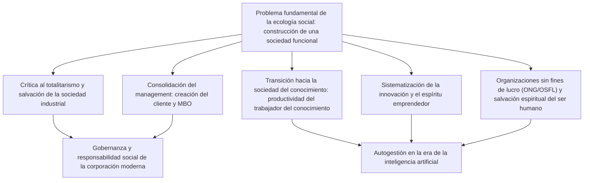
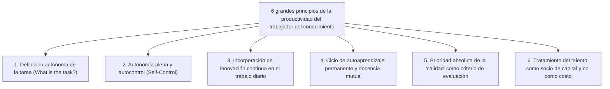
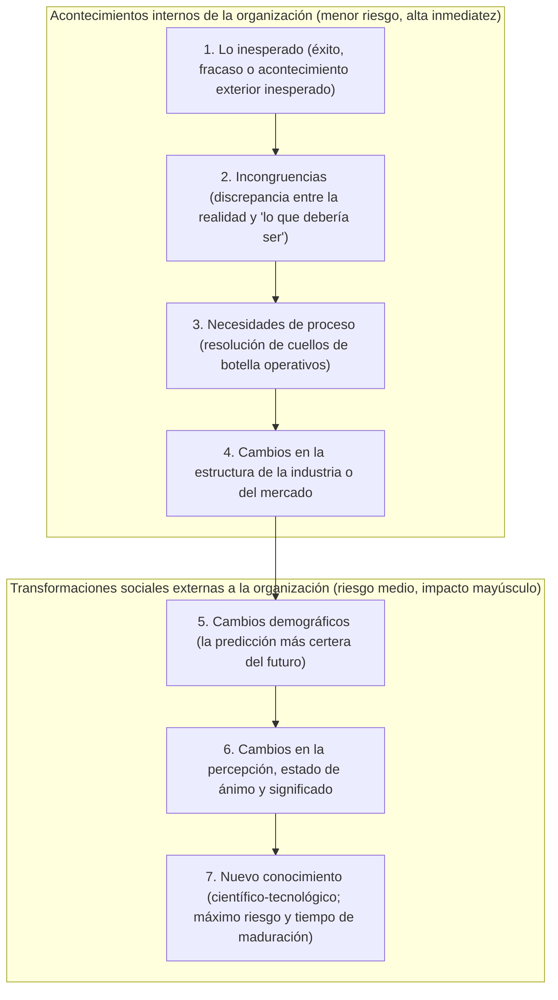

## 1. Introducción: El alcance del mayor intelecto del siglo XX, Peter Drucker

### 1.1 La reducción del apelativo «padre del management» y su esencia como «ecólogo social»

El nombre de Peter F. Drucker (Peter Ferdinand Drucker, 1909–2005) es reconocido mundialmente como el «padre del management moderno» (*Father of Modern Management*). Sin embargo, él mismo rechazó tal título a lo largo de toda su vida. El apelativo singular que Drucker reivindicó con insistencia hasta el final de sus días fue el de **«ecólogo social» (*Social Ecologist*)**.

Así como la ecología en biología observa e investiga las interacciones y el equilibrio dinámico entre los seres vivos y el entorno que los rodea, la ecología social es la disciplina que estudia cómo los seres humanos viven, trabajan, se relacionan y configuran el orden social dentro del entorno artificial que ellos mismos han creado: diversas organizaciones e instituciones como empresas, gobiernos, universidades, hospitales, iglesias y familias.

El núcleo del interés de Drucker nunca residió en «técnicas superficiales para maximizar el beneficio empresarial» ni en «herramientas pragmáticas para optimizar la eficiencia administrativa». La pregunta fundamental que planteó de manera inquebrantable a lo largo de su trayectoria fue una interrogante de carácter profundamente ético, filosófico y humanista: **«¿Cómo construir una sociedad funcional (*a functioning society*) en la que los seres humanos puedan vivir preservando su libertad y dignidad?»**. Si dedicó su pasión analítica al mundo de los negocios y a las organizaciones empresariales fue, única y exclusivamente, porque en el siglo XX la corporación se erigió en la institución representativa (*Representative Institution*) de la sociedad, convirtiéndose en el espacio primordial que define la existencia y la identidad de las personas.

Muchos de los ejecutivos e investigadores contemporáneos que leen las obras de Drucker suelen olvidar que su punto de partida fue una desgarradora desesperación política y filosófica: presenciar el ascenso vertiginoso del nazismo en la Europa previa a la Segunda Guerra Mundial y enfrentarse al dilema vital de cómo contener y derrotar el totalitarismo hitleriano. En este ensayo se reconstruye el caudal subterráneo que atraviesa toda la vida y obra de Drucker, desentrañando con exhaustividad enciclopédica el vasto sistema intelectual que legó a la humanidad.

---

### 1.2 El crepúsculo de Viena, el ascenso del nazismo y la teoría organizacional nacida de la crítica al totalitarismo

Para comprender la raíz intelectual de Drucker es imprescindible adentrarse en el fértil sustrato cultural de la Viena finisecular del Imperio austrohúngaro. Nacido en 1909 en el seno de una próspera familia de intelectuales vieneses, el hogar de su infancia era un punto de encuentro habitual para figuras cumbre de la cultura europea de la época, tales como Sigmund Freud, Joseph Schumpeter, Ludwig von Mises y Friedrich Hayek.

Sin embargo, el estallido de la Primera Guerra Mundial acarreó la caída fulminante del Imperio de los Habsburgo y, a lo largo de las décadas de 1920 y 1930, la sociedad europea se precipitó hacia una crisis espiritual y social sin precedentes. El orden tradicional de clases y la autoridad religiosa secular se disolvieron, empujando a los individuos a la condición de masas atomizadas y desprovistas de comunidades de pertenencia. Sobre este terreno asolado impactó la Gran Depresión de 1929, sembrando una desesperanza generalizada frente al libre mercado capitalista y la democracia burguesa.

En medio de este colosal vacío espiritual y existencial emergieron los dos grandes totalitarismos de la época: el nacionalsocialismo de Hitler y el comunismo estalinista. Tras doctorarse en Derecho Internacional en la Universidad de Fráncfort y ejercer activamente como periodista, el joven Drucker presenció in situ cómo Alemania era devorada vertiginosamente por las tinieblas totalitarias. En 1933, inmediatamente después de la toma del poder por Adolf Hitler, Drucker abandonó Alemania rumbo a Gran Bretaña, y en 1937 emigró definitivamente a los Estados Unidos.

Para Drucker, el fascismo y el totalitarismo no eran meros brotes de locura política o militar, sino **«una rebelión desesperada y patológica originada por el fracaso de la sociedad occidental moderna para otorgar al individuo un estatus (*Status*) y una función (*Function*) legítimos»**. Por consiguiente, para extirpar el totalitarismo no bastaba con vencerlo en los campos de batalla; resultaba imperativo diseñar una nueva «sociedad libre y no totalitaria» donde cada ciudadano poseyera un lugar incuestionable, un papel propio al servicio del bien común, y pudiera gozar de autorrealización y dignidad. Esta imperiosa misión histórica fue el motor primordial que condujo a Drucker a explorar el universo de las organizaciones y el management.

---

## 2. El punto de partida del pensamiento de Drucker: la desesperación del totalitarismo y la salvación de la sociedad industrial

### 2.1 *El fin del hombre económico* (1939) ― Los límites del marxismo y el capitalismo, y la patología del fascismo

Durante su estancia en el exilio, Drucker publicó en 1939 su primera obra canónica: *El fin del hombre económico* (*The End of Economic Man: The Origins of Totalitarianism*). Escrito por un autor que aún no cumplía los treinta años, el volumen mereció el encendido elogio de Winston Churchill, quien ordenó distribuirlo como lectura de referencia para los oficiales del ejército británico.

En este texto fundamental, Drucker analizó la naturaleza del nazismo no como un «mal racional», sino como una «fe ciega y demoníaca surgida tras el colapso de las esperanzas racionales». Desde el siglo XVIII, la sociedad occidental moderna se había erigido sobre el arquetipo antropológico del «Hombre Económico» (*Economic Man*). El capitalismo prometía que la libre búsqueda del beneficio individual en el mercado traería consigo, por mediación de la mano invisible, armonía y prosperidad colectivas; por su parte, el marxismo proclamaba que la abolición revolucionaria de las clases sociales conduciría a una comunidad de hombres auténticamente libres e iguales.

No obstante, lo que el capitalismo engendró en la realidad fue desempleo crónico, desigualdades lacerantes y la catástrofe de la Gran Depresión, mientras que el comunismo culminó en purgas sangrientas, dictadura y campos de concentración. Al desmoronarse simultáneamente ambos mitos fundacionales, Occidente cayó en el abismo del nihilismo: la constatación amarga de que ni la libertad económica ni la igualdad económica podían garantizar la felicidad o la dignidad del ser humano.

El fascismo capitalizó ese vacío. Al repudiar abiertamente la racionalidad y las libertades económicas, y mediante la invocación de mitos irracionales basados en jerarquías militaristas, supremacismo racial y estatolatría, ofreció a las masas desorientadas un sucedáneo perverso de «sentido» y «pertenencia». Drucker proclamó con lucidez que la simple condena moral del fascismo jamás regeneraría a la civilización. Lo que urgía era edificar un **nuevo orden social** que, integrando la racionalidad productiva, trascendiera la estrecha lógica del enriquecimiento material y garantizara al individuo una existencia cívica dotada de genuina dignidad.

---

### 2.2 *El futuro del hombre industrial* (1942) ― La comunidad que otorga estatus (*Status*) y función (*Function*) al ser humano

En 1942, en sincronía con la entrada de Estados Unidos en la Segunda Guerra Mundial, Drucker publicó *El futuro del hombre industrial* (*The Future of Industrial Man*), donde trazó las coordenadas fundamentales para la reconstrucción del orden social de posguerra.

Los conceptos nodales de esta obra son el **«poder legítimo» (*Legitimate Power*)** y el **«estatus social» (*Status*)** acoplado a la **«función» (*Function*)** del individuo. Para que una sociedad libre y saludable perdure en el tiempo, deben satisfacerse rigurosamente dos condiciones:

1. **Poder legítimo**: La autoridad que ejerce el gobierno de la sociedad debe ser reconocida por sus miembros como portadora de legitimidad ética y moral.
2. **Estatus y función**: Cada uno de los integrantes de la comunidad debe disfrutar de una posición social reconocida (estatus) y desempeñar un papel específico y valorado que contribuya al bienestar colectivo (función).

Hasta el siglo XIX, en las sociedades agrarias y mercantiles tradicionales, la familia, la aldea comunal y los gremios garantizaban de forma natural el estatus y la función de las personas. Sin embargo, la Segunda Revolución Industrial catapultó a las factorías mecanizadas y a las macrocorporaciones al centro neurálgico de la vida social, desmantelando los lazos comunitarios heredados. El obrero industrial quedó reducido a un engranaje prescindible en gigantescos complejos productivos, presa de una agobiante desposesión social.

Drucker advirtió con tono profético: **«Si la corporación industrial moderna continúa siendo concebida únicamente como un artefacto económico generador de ganancias y no logra mutar en una verdadera "comunidad humana" capaz de conferir estatus y función a sus trabajadores, la sociedad libre sucumbirá de nuevo ante las garras del totalitarismo»**. Así quedó formulado el postulado de que la empresa no es una mera propiedad privada al servicio de los dueños del capital, sino un órgano de gobierno social autónomo (*Government*) investido de ineludibles responsabilidades públicas.

---

### 2.3 *El concepto de la corporación* (1946) ― La investigación interna de General Motors (GM) y la disección de la gran corporación moderna

En 1943, Drucker recibió una propuesta sin precedentes. La cúpula ejecutiva de General Motors (GM), en aquel momento la mayor corporación manufacturera del planeta y el pináculo del capitalismo moderno, le extendió una invitación formal para realizar un examen exhaustivo e independiente de su estructura organizativa y sus dinámicas de gestión.

Durante 18 meses ininterrumpidos, Drucker se instaló en el corazón de GM. Sostuvo innumerables entrevistas con el director ejecutivo Alfred P. Sloan y su equipo de alta dirección, directores de planta, ingenieros y operarios de línea, participando asimismo en comités directivos de máximo nivel. El fruto de esta colosal inmersión investigativa vio la luz en 1946 bajo el título de *El concepto de la corporación* (*Concept of the Corporation*), texto fundacional del pensamiento de gestión contemporáneo.

Esta obra constituye el primer análisis en la historia de las ideas que examina a la gran corporación industrial no como un mero mecanismo financiero, sino como **«una institución política y social que opera como unidad constitutiva básica de la sociedad»**. Drucker identificó que el asombroso dinamismo de GM radicaba en el modelo de «gestión descentralizada» (*Decentralization*) perfeccionado por Sloan. Al sustituir la rígida cadena de mando de corte militar por divisiones de negocio operativamente autónomas y con responsabilidad directa sobre sus mercados y cuentas de resultados, GM lograba aunar la solidez de una macroorganización con la flexibilidad, agilidad e iniciativa local.

---

### 2.4 El conflicto ideológico con Sloan: racionalismo tecnocrático de arriba hacia abajo vs organización humana y autónoma

Pese a su trascendencia, *El concepto de la corporación* provocó un rechazo frontal en los estamentos directivos de GM. Alfred P. Sloan y los principales directores de la compañía reaccionaron con indignación ante las propuestas humanistas planteadas por Drucker: delegación de autoridad en los operarios, creación de equipos autodirigidos, fomento del autogobierno en las comunidades fabriles y búsqueda de esquemas de estabilidad y dignidad laboral a largo plazo.

Para Sloan, la empresa era un mecanismo de precisión minuciosamente optimizado para orquestar capital, tecnología y mano de obra. Desde su perspectiva mecanicista, el trabajador constituía una unidad económica contractual que vendía su fuerza laboral a cambio de una remuneración monetaria. Sloan catalogó las sugerencias de Drucker como «ensoñaciones socialistas sentimentales» y vetó la distribución interna de la obra (en un giro irónico del destino, Henry Ford II, al frente de la maltrecha Ford Motor Company, estudió con avidez las páginas de Drucker para consumar uno de los rescates corporativos más espectaculares de la historia).

Esta discrepancia insalvable con Sloan definió la trayectoria intelectual ulterior de Drucker. El pensador austríaco abandonó cualquier simpatía por el control burocrático tecnocrático y el culto a las métricas abstractas de la alta dirección, consagrando su vida a fundamentar una **«gestión descentralizada y participativa, cimentada en la confianza radical en el potencial y la autorregulación del ser humano»**.

---

## 3. El nacimiento del «management» y su arquitectura conceptual fundamental

### 3.1 La disciplina establecida por *La práctica de la gestión empresarial* (1954)

En 1954, Drucker publicó *La práctica de la gestión empresarial* (*The Practice of Management*), hito que consagró al management como una disciplina sistemática y universal (*Discipline*). Hasta entonces, el acto de dirigir empresas era percibido como un don empírico reservado a emprendedores visionarios o carismáticos, o bien como un conjunto de destrezas contables y financieras. Drucker demostró que la gestión constituía un cuerpo articulado de conocimientos susceptibles de ser aprendidos, transmitidos y ejercidos profesionalmente.

En esta obra seminal, Drucker postuló las **tres responsabilidades cardinales del management**:

1. **Cumplir el propósito y la misión específicos de la organización**: En una empresa, la consecución de resultados económicos; en un hospital, el cuidado y curación de los enfermos; en una universidad, la generación de saber y la enseñanza.
2. **Hacer que el trabajo sea productivo y lograr que las personas alcancen logros efectivos**: Potenciar al máximo las capacidades de los colaboradores, facilitando que mediante el trabajo alcancen dignidad, desarrollo y crecimiento personal.
3. **Gestionar los impactos de la organización en la comunidad y responder a los problemas sociales**: Controlar y suprimir cualquier externalidad nociva que la actividad cause a la sociedad o al entorno natural, operando como un ciudadano institucional ejemplar.

Estas tres funciones no son independientes ni jerárquicas; coexisten de manera indisociable, obligando al directivo a mantener un balance dinámico permanente entre todas ellas.

---

### 3.2 El propósito de la empresa es «crear un cliente»: la dualidad de marketing e innovación

Una de las formulaciones más célebres y peor comprendidas de Drucker atañe al fin supremo de la empresa comercial. El autor lo formula con rotundidad meridiana:

> **«Solo existe una definición válida del propósito de una empresa: crear un cliente (*There is only one valid definition of business purpose: to create a customer*).»**

La mayoría de los ejecutivos y economistas clásicos asumen como axioma incuestionable que el objetivo corporativo es la «maximización del beneficio». No obstante, para Drucker, el beneficio no representa el propósito de la corporación, sino su **condición de subsistencia (*Condition*)** y su **restricción ineludible (*Limitation*)**. Así como el bombeo cardíaco y el consumo de oxígeno son condiciones fisiológicas para que un ser humano permanezca vivo, respirar jamás podrá ser considerado el sentido o propósito de la existencia humana.

Sin clientes reales en el mercado, cualquier negocio desaparece de la noche a la mañana. El cliente no es un elemento preexistente en la naturaleza; es descubierto, atraído y creado mediante la iniciativa empresarial. Y para crear y conservar clientes, toda organización cuenta únicamente con **dos funciones empresariales primarias (*Basic Functions*)**:

1. **Marketing**: La actividad dirigida a descifrar exhaustivamente los anhelos, realidades y valores del cliente, adecuando el producto o servicio a su universo perceptual. Como subrayó Drucker: *«El objetivo cardinal del marketing es hacer innecesario el esfuerzo de venta directa (*selling*)»*.
2. **Innovación**: La capacidad deliberada de dotar a los recursos existentes con una nueva aptitud creadora de riqueza, suministrando continuamente satisfacciones inéditas en el plano económico y social.

Todas las demás actividades corporativas (recursos humanos, finanzas, control contable, logística, compras) no son más que centros de soporte y estructuras de costos destinadas a respaldar estas dos funciones maestras. El auténtico beneficio solo se engendra fuera de la organización: en la satisfacción del cliente.

---

### 3.3 La verdad sobre la Dirección por Objetivos y Autocontrol (MBO: Management by Objectives and Self-Control)

Uno de los conceptos más trascendentales expuestos en *La práctica de la gestión empresarial* es el principio de **«Dirección por Objetivos y Autocontrol» (*Management by Objectives and Self-Control: MBO*)**.

En la actualidad, incontables corporaciones de los cinco continentes aplican sistemas de evaluación que denominan «MBO». Sin embargo, como el propio Drucker lamentó con profunda amargura en sus últimos años de vida, **el 99% de los esquemas corporativos de MBO se han degradado en mecanismos punitivos de imposición jerárquica de metas (gestión por cuotas), contradiciendo abiertamente el espíritu original de su propuesta**.

El núcleo irrenunciable del MBO druckeriano reside en su segunda premisa: **el «autocontrol» (*Self-Control*)**. Los modelos administrativos convencionales operan bajo esquemas de «control externo» (*External Control*), donde la cúspide fija cuotas coercitivas a los mandos subordinados, supervisa milimétricamente su rendimiento e impone un régimen de castigos y recompensas. Esta concepción no es más que una prolongación degradada del taylorismo, que trata al trabajador como un autómata pasivo.

En radical contraste, el verdadero MBO propuesto por Drucker demanda la articulación rigurosa del siguiente ciclo:

1. La visión, los desafíos y los objetivos estratégicos globales de la organización son compartidos de forma transparente y profunda con todos los integrantes.
2. Cada profesional reflexiona autónomamente y formula de manera deliberada: *«¿Cuál debe ser mi contribución específica al logro de los objetivos comunes?»*, fijando sus propias metas de rendimiento.
3. Se garantiza que la información objetiva y las métricas sobre el avance de los resultados lleguen **directamente al propio trabajador**, sin filtros jerárquicos de supervisión externa.
4. El individuo monitoriza su propia trayectoria y ejecuta de manera soberana las correcciones de rumbo oportunas.

El MBO no es un instrumental para consolidar la tutela autoritaria de los cuadros ejecutivos; es **«una filosofía liberadora concebida para prescindir del control coercitivo externo, transformando a cada persona en un profesional autónomo y plenamente responsable»**. Drucker mantenía la convicción inquebrantable de que la motivación intrínseca (*Intrinsic Motivation*) y el sentido del deber profesional fundado en el autocontrol constituyen las únicas fuentes genuinas de excelencia organizativa y dignidad humana.

---

### 3.4 Definición de resultados (*Results*) y asignación de recursos: las ocho áreas clave de la empresa

Drucker desaconsejó con vehemencia medir el éxito y la salud de una corporación a través de un único indicador unilateral, como el volumen de facturación o el beneficio trimestral por acción. Para garantizar su sostenibilidad a largo plazo y honrar su compromiso social, toda empresa debe establecer metas claras y evaluar su desempeño en **ocho áreas clave de resultados (*Key Result Areas*)**:

| Área Clave | Alcance e Importancia Estratégica |
| :--- | :--- |
| **1. Marketing** | Medición no solo de la cuota en mercados consolidados, sino de la penetración en nuevos segmentos y el grado de creación efectiva de clientes. |
| **2. Innovación** | Desarrollo continuado no solo en productos y servicios, sino en estructuras organizacionales, procesos de trabajo y modelos de negocio. |
| **3. Recursos humanos y capacidad organizativa** | Maduración de habilidades, motivación, desarrollo de liderazgos de relevo y fomento de la autonomía de los equipos de trabajo. |
| **4. Recursos financieros** | Capacidad de captación de capitales, solidez y resiliencia de los flujos de caja (*cash flow*) y asignación óptima de activos. |
| **5. Recursos físicos** | Modernidad, disponibilidad y eficiencia de las infraestructuras productivas, fábricas, centros de trabajo y tecnologías de información. |
| **6. Productividad** | Eficiencia con la que los insumos y recursos empleados (trabajo humano, capital, tiempo, materiales) se transforman en valor añadido. |
| **7. Responsabilidad social** | Integridad y aportación proactiva frente a las comunidades locales, la protección ambiental, la observancia normativa y la ética cívica. |
| **8. Requisitos de beneficio** | Determinación del nivel imprescindible de rentabilidad necesario para financiar el cumplimiento de las siete áreas anteriores y absorber los riesgos inherentes al porvenir. |

La piedra angular de la perspectiva druckeriana se resume en una máxima: **«El beneficio no es el fin, sino la condición indispensable de existencia»**. El beneficio es, al mismo tiempo, el veredicto contable sobre las decisiones tomadas en el ayer y la «prima de seguro de continuidad empresarial» necesaria para cubrir los costos ineludibles que depara la incertidumbre del futuro.

---

## 4. La anticipación de la sociedad del conocimiento y el surgimiento del «trabajador del conocimiento» (*Knowledge Worker*)

### 4.1 De *La era de la discontinuidad* (1969) a *La sociedad poscapitalista* (1993)

Entre las múltiples visiones de futuro formuladas por Peter Drucker, la que produjo una sacudida histórica de mayor alcance fue la formulación de la «sociedad del conocimiento» (*Knowledge Society*). Ya en su obra de 1959, *Los hitos del mañana* (*Landmarks of Tomorrow*), Drucker acuñó por vez primera el concepto revolucionario de **«trabajador del conocimiento» (*Knowledge Worker*)**.

Posteriormente, en su célebre libro de 1969, *La era de la discontinuidad* (*The Age of Discontinuity*), identificó que el andamiaje económico forjado durante la Revolución Industrial estaba experimentando una falla tectónica irreversible. La teoría económica tradicional concebía la generación de riqueza como el producto de tres factores productivos fundamentales: la tierra (recursos naturales), el trabajo (mano de obra física) y el capital (maquinaria y fábricas). Drucker postuló que dichos factores clásicos habían pasado a desempeñar un rol subordinado, cediendo su primacía a un factor hegemónico: **el conocimiento (*Knowledge*), transformado en el único recurso de producción verdaderamente estratégico**.

Esta concepción fue coronada en 1993 en *La sociedad poscapitalista* (*Post-Capitalist Society*). En el orden capitalista del siglo XIX y principios del XX, el poder fáctico residía en los propietarios de los medios tangibles de producción (los inversores y la burguesía industrial). En contraste, en la sociedad del conocimiento, el capital crítico reside exclusivamente en el cerebro de los propios trabajadores: su saber técnico, su experiencia y su capacidad de discernimiento. Al ser dueños inalienables de sus medios productivos y poder trasladarlos consigo al abandonar la empresa, **la relación histórica de poder entre la organización empleadora y el trabajador se invirtió por primera vez en los anales de la civilización humana**.

---

### 4.2 La transición histórica del trabajo manual (taylorismo) al trabajo del conocimiento

El mayor milagro socioeconómico del siglo XX fue obra de la «organización científica del trabajo» fundada por Frederick Winslow Taylor, la cual logró **multiplicar la productividad del obrero manual por casi cincuenta veces**. Mediante el estudio minucioso de tiempos y movimientos, Taylor descompuso las rutinas empíricas de los antiguos artesanos en secuencias estandarizadas y optimizadas. Esta revolución de la productividad hizo viable el consumo y la producción masivos, consolidó a una próspera clase media en Occidente y neutralizó el riesgo de insurrecciones marxistas en los países industrializados.

Sin embargo, Drucker lanzó una severa advertencia: «Así como la mayor aportación del management en el siglo XX fue la multiplicación geométrica de la productividad en el trabajo manual, **el colosal desafío que definirá el destino del management en el siglo XXI radica en lograr elevar la productividad del trabajo del conocimiento**».

Entre el trabajo manual y el trabajo del conocimiento media un abismo estructural insalvable:

| Dimensión Analítica | Trabajo Manual (*Manual Work*) | Trabajo del Conocimiento (*Knowledge Work*) |
| :--- | :--- | :--- |
| **Definición de la tarea** | La labor está prefijada de antemano y no admite dudas (ej.: mover vigas de acero o ajustar tornillos en la línea de montaje). | **«¿Cuál es la tarea? ¿Para qué debe llevarse a cabo?»** debe ser definido activamente por el propio profesional. |
| **Nivel de autonomía** | La disciplina ciega a los protocolos de ejecución es la mayor virtud; el control externo es continuo y férreo. | **La autonomía (*Autonomy*)** es ineludible; sin autogestión es imposible alcanzar un desempeño sobresaliente. |
| **Innovación continua** | La innovación corre a cargo exclusivo de los ingenieros de métodos o diseñadores industriales ajenos al operario. | El propio trabajador debe **incorporar la innovación de forma ininterrumpida** en el quehacer cotidiano. |
| **Aprendizaje y docencia** | Tras un aprendizaje inicial, el dominio se perfecciona mediante la reiteración y la destreza física. | La obsolescencia del saber es vertiginosa; requiere **formación continua y docencia permanente a lo largo de la vida**. |
| **Criterio de evaluación** | Evaluado primordialmente por la **«cantidad» (*Quantity*)** (unidades producidas por hora de trabajo). | Evaluado indiscutiblemente por la **«calidad» (*Quality*)** (profundidad del análisis y efectividad de las soluciones). |
| **Propiedad productiva** | Las naves industriales, herramientas e infraestructuras son **propiedad del capitalista**. | Los medios de producción (inteligencia, talento y juicio crítico) pertenecen **al cerebro del trabajador**. |

En el trabajo del conocimiento, sacrificarse trabajando largas jornadas no garantiza en modo alguno la consecución de un resultado valioso. Responder con impecable rapidez y precisión a una pregunta equivocada constituye un despilfarro absoluto. Elevar la productividad intelectual es inviable mediante supervisión punitiva o cronómetros tayloristas; exige una transformación paradigmática completa de la práctica directiva.

---

### 4.3 Los seis grandes principios determinantes de la productividad del trabajador del conocimiento

En su obra *Los desafíos de la gerencia para el siglo XXI* (*Management Challenges for the 21st Century*, 1999), Drucker sintetizó de forma magistral las seis condiciones imperativas para catalizar la productividad del trabajador del conocimiento:

1. **Interrogarse constantemente: «¿Cuál es la tarea?» (*What is the task?*)**: En el trabajo intelectual, el paso más decisivo consiste en delimitar con absoluta nitidez qué se debe lograr y qué actividades accesorias deben suprimirse. Nada resulta más perjudicial que optimizar tareas innecesarias.
2. **Conceder plena autonomía al profesional**: Los trabajadores del conocimiento deben gobernarse a sí mismos. La autonomía es la única fuente real de responsabilidad ética y compromiso profesional.
3. **Integrar la innovación constante dentro de la propia función**: Todo especialista tiene el deber de investigar de manera proactiva nuevas metodologías, enfoques y horizontes de valor en su propia disciplina.
4. **Alimentar un ciclo continuo de autoaprendizaje y docencia mutua**: El profesional debe mantener una actitud de aprendizaje continuo y, al mismo tiempo, actuar como tutor y maestro de otros. Enseñar a los demás es el método más refinado para estructurar y enriquecer el propio conocimiento.
5. **Priorizar incondicionalmente la calidad sobre la cantidad**: Un análisis estratégico que acierte en el epicentro de un problema empresarial es infinitamente más valioso que un centenar de memorandos rutinarios e inocuos.
6. **Considerar y tratar al profesional como un «activo capital» y jamás como un «costo»**: Los trabajadores del conocimiento no son piezas reemplazables; son socios del proyecto que invierten voluntariamente su talento e ingenio en la misión institucional.

---

### 4.4 «El trabajador del conocimiento debe ser su propio director ejecutivo (CEO)»: teoría de la autogestión

La instauración de la sociedad del conocimiento altera de forma radical el destino existencial del individuo. En su célebre ensayo de 1999, *Cómo gestionarse a uno mismo* (*Managing Oneself*), Drucker formuló una advertencia de carácter perentorio a los profesionales de la era contemporánea.

En las épocas pretéritas, la profesión venía impuesta por el origen estamental o la tradición familiar. En la era industrial temprana, ingresar en una gran corporación garantizaba un itinerario profesional tutelado hasta la jubilación. Sin embargo, en el orden actual, **«cada cual debe ser el arquitecto de su propia carrera y el gestor de su propio rendimiento»**. En un mundo donde la esperanza de vida sobrepasa con creces los ochenta años, la longevidad media de las corporaciones (en torno a tres décadas) es notoriamente más breve que la trayectoria productiva potencial del individuo. Cada trabajador del conocimiento debe concebirse a sí mismo como el CEO de una empresa unipersonal («Yo S.A.»).

La metodología de autogestión postulada por Drucker descansa sobre tres pilares inquebrantables:

#### ① Descubrir y capitalizar las propias fortalezas (*Strengths*)
El axioma vertebral de la antropología druckeriana afirma con crudeza: **«El ser humano solo alcanza logros excepcionales a partir de sus fortalezas consolidadas. Jamás se construyen resultados sobresalientes apoyándose en la corrección de debilidades»**.

Tanto la educación escolar como los planes corporativos tradicionales derrochan una energía desmedida en diagnosticar las carencias del individuo para intentar nivelarlo a un estándar mediocre. Sin embargo, el esfuerzo necesario para elevar un desempeño incompetente a un nivel vulgar es colosal, mientras que la dedicación requerida para transformar una competencia sobresaliente en excelencia deslumbrante es infinitamente más fecunda.

Para identificar con rigor científico las verdaderas fortalezas propias, Drucker prescribió una técnica invariable: **el «análisis de feedback» (*Feedback Analysis*)**.
- Al tomar una decisión estratégica o emprender una acción trascendente, **debe consignarse por escrito en un papel qué resultados concretos se espera obtener**.
- Nueve o doce meses después, **se confrontan de manera implacable los resultados acontecidos con las expectativas anotadas**.
- Tras sostener este hábito metódico durante dos o tres años, saldrán a la superficie, con objetividad meridiana, cuáles son los ámbitos donde se posee una intuición genuina, qué capacidades producen verdaderas victorias y en qué terrenos se carece de talento intrínseco.

#### ② Descifrar el propio modo de desempeño (*How I Perform*)
Junto a las fortalezas, resulta vital reconocer la modalidad cognitiva y ejecutiva que le es propia al individuo:
- **¿Es uno «lector» (*Reader*) u «oyente» (*Listener*)?**: Dwight Eisenhower fracasó en ruedas de prensa improvisadas al ser un lector nato que precisaba textos previos; cuando empezó a exigir preguntas por escrito deslumbró por su precisión. Franklin D. Roosevelt y Harry Truman, en cambio, eran oyentes natos que se alimentaban del debate oral directo.
- **¿Cómo aprende uno?**: Hay quienes aprenden redactando extensamente; otros, debatiendo oralmente; otros tantos, mediante la inmersión en la acción fáctica.
- **¿Actúa uno mejor como «decididor» (*Decision Maker*) o como «consejero» (*Adviser*)?**: Abundan los colaboradores brillantes que al ser promovidos al vértice directivo quedan paralizados ante la soledad de la decisión ejecutiva última.

#### ③ Diseñar con anticipación la segunda mitad de la vida (*Second Career*)
A diferencia del operario que agota su vigor osteomuscular, el trabajador del conocimiento suele verse asediado, al alcanzar la década de los cuarenta o cincuenta años, por el tedio y la crisis de vitalidad profesional. Tras dos décadas consagrado a una misma especialidad, la curva de aprendizaje se aplana por completo y el entusiasmo desaparece.

Drucker recomendaba vivamente desarrollar, antes de cruzar la frontera de los cuarenta años, un **«segundo ámbito de desarrollo profesional» (una carrera paralela o una entrega cívica estructurada en organizaciones sin fines de lucro)**. Disponer de un espacio vital alternativo al entorno corporativo —en fundaciones, investigación académica o servicio comunitario— constituye el único escudo capaz de proteger la dignidad personal frente a despidos o fracasos organizacionales, garantizando una segunda mitad de la vida fecunda y enriquecedora.

---

## 5. Técnicas sistemáticas de innovación y espíritu emprendedor

### 5.1 *La innovación y el empresariado innovador* (1985)

El imaginario popular tiende a mistificar la innovación, asumiéndola como una suerte de revelación mística, un chispazo de iluminación nocturna reservado a genios excéntricos, o bien como el desenlace exclusivo de presupuestos multimillonarios de investigación y desarrollo (I+D).

En 1985, Drucker desmontó categóricamente este mito romántico en su obra maestra *La innovación y el empresariado innovador* (*Innovation and Entrepreneurship*). Para él, la innovación no es una cuestión de genialidad innata, sino **«una disciplina sistemática (*Discipline*) susceptible de ser aprendida, estructurada y ejercitada metódicamente por cualquier organización»**.

Drucker formuló su célebre definición ontológica de la innovación:
> **«La innovación es el acto que dota a los recursos de una nueva capacidad para producir riqueza. Es más, antes de que se produzca una innovación, ningún "recurso" existe como tal en el universo. Hasta que el ingenio humano no descubre su utilidad y le confiere valor económico, cualquier planta es una simple maleza y cualquier mineral no es más que una roca inservible.»**

El petróleo constituyó durante milenios una sustancia viscosa y execrable que arruinaba las tierras fértiles de cultivo, hasta que a mediados del siglo XIX el desarrollo de las técnicas de refinado y el advenimiento de los motores de combustión lo transmutaron en el combustible de la civilización moderna. Lo que engendró esa inmensa riqueza no fue la materia mineral en sí, sino el acto innovador de conectar sus propiedades con las necesidades latentes de la sociedad.

---

### 5.2 Derribando el mito del «chispazo de genialidad»: las siete fuentes de oportunidades innovadoras

Drucker estructuró **«las siete fuentes de oportunidades innovadoras» (*The Seven Sources for Innovative Opportunity*)**, clasificándolas de menor a mayor grado de incertidumbre y en orden decreciente de accesibilidad y predictibilidad operativa:

#### ① Lo inesperado (*The Unexpected*)
Representa la fuente más fértil y de menor riesgo empresarial, y paradójicamente la más desatendida por la dirección tradicional:
- **El éxito inesperado**: Cuando IBM comercializó sus primeros computadores centrales con el propósito exclusivo de efectuar cálculos astronómicos y científicos, descubrió anonadada que las entidades bancarias y aseguradoras los demandaban en tropel para agilizar tareas burocráticas de nómina y contabilidad. La dirección inicial contempló este fenómeno como una desviación no deseada de su catálogo, pero al volcar de inmediato todos sus recursos hacia ese mercado no previsto, fundó las bases de su histórico monopolio tecnológico.
- Las empresas consumen sus reuniones directivas debatiendo durante horas las partidas presupuestarias no alcanzadas (fracasos), despachando las líneas que crecen por encima de lo planificado (éxitos inesperados) como anomalías transitorias. Drucker recomendaba dedicar la portada misma del informe mensual de gestión a los éxitos inesperados, destinando a ellos a los profesionales más brillantes.
- **El fracaso inesperado**: Cuando un producto diseñado con extremo rigor fracasa de forma estrepitosa y sistemática en el mercado, ello denota una mutación subterránea en las premisas de los consumidores que demanda una reformulación innovadora radical.

#### ② Incongruencias (*Incongruities*)
La colisión o desajuste entre la realidad fáctica tal como acontece y las teorías o suposiciones sobre «cómo deberían ser las cosas»:
- En la década de 1950, la industria naviera global invertía ingentes sumas de dinero en diseñar buques más veloces y con motores de consumo ultraeficiente; sin embargo, la rentabilidad colapsaba inexorablemente. La incongruencia radicaba en que el costo principal del flete marítimo no residía en los días de navegación en alta mar, sino en las interminables semanas de inmovilización de los barcos anclados en los puertos aguardando la estiba manual de mercancías. Al percibir esta distorsión, Malcom McLean ideó el «buque portacontenedores» (*Containerization*). Sin alterar las máquinas de propulsión, el uso de cajas estandarizadas transferibles del camión a la bodega redujo las estancias en muelle de meses a horas, detonando la globalización del comercio moderno.

#### ③ Necesidades de proceso (*Process Need*)
La necesidad imperiosa de subsanar un «eslabón perdido» o cuello de botella dentro de una cadena de valor preexistente:
- El surgimiento de la fotografía instantánea Polaroid respondió al clamor de suprimir las semanas de espera en el revelado químico de carretes; de igual modo, el perfeccionamiento de las centralitas telefónicas automatizadas emergió para evitar la asfixia del tráfico telegráfico manual.

#### ④ Cambios en la estructura de la industria o del mercado (*Industry and Market Structures*)
Cuando un sector económico experimenta un crecimiento superior al 10% anual sostenido, las fronteras tradicionales se quiebran, dejando fuera de combate a las estructuras consolidadas:
- El posicionamiento singular de Volvo al adueñarse del concepto de «seguridad automotriz» en una fase de masificación, o la disrupción provocada por las casas de corretaje bursátil en línea tras las desregulaciones financieras de finales del siglo XX.

#### ⑤ Cambios demográficos (*Demographics*)
Constituye la manifestación más nítida de **«el futuro que ya ha ocurrido» (*The Future that has already happened*)**, siendo la variable empírica más predecible del entorno social:
- La cantidad de jóvenes que cumplirán veinte años dentro de dos décadas es un dato científicamente cerrado hoy contando los nacimientos del año en curso. Fenómenos como el colapso de la natalidad, el envejecimiento de la pirámide poblacional, la disminución de la fuerza laboral o el salto en la escolarización superior brindan oportunidades incontestables de innovación que aguardan a quienes sepan interpretarlas.

#### ⑥ Cambios en la percepción, estado de ánimo y significado (*Changes in Perception*)
Acontecimientos donde la realidad fáctica objetiva permanece inmutable, pero el marco hermenéutico con el que la sociedad la juzga se transforma de repente:
- La mutación perceptiva entre ver el vaso «medio lleno» a sentirlo angustiosamente «medio vacío». En los países occidentales de finales del siglo XX, a pesar de alcanzarse los mayores índices históricos de longevidad y salubridad física gracias a la medicina moderna, se desató un pavor colectivo a la enfermedad y el envejecimiento. Esta reconfiguración perceptual generó mercados de dimensiones colosales en alimentación orgánica, medicina preventiva y la industria del bienestar y el fitness.

#### ⑦ Nuevo conocimiento (*New Knowledge*)
Innovaciones cimentadas sobre descubrimientos científicos, avances tecnológicos y rupturas teóricas:
- Representa el arquetipo que la sociedad ensalza como «la verdadera innovación». No obstante, Drucker advirtió con firmeza: **las innovaciones basadas en nuevo conocimiento constituyen la categoría de mayor riesgo financiero, menor tasa de éxito estadístico y con plazos de maduración más dilatados** (habitualmente demandan entre 25 y 30 años desde el descubrimiento de la ley científica hasta su cristalización en el mercado). Además, exigen la convergencia simultánea de múltiples campos de conocimiento no relacionados para ser viables, acarreando un altísimo peligro de obsolescencia o frustración comercial.

---

### 5.3 Abandono sistemático (*Systematic Abandonment*): el coraje de eliminar deliberadamente los éxitos de ayer

La piedra de toque primordial para catalizar la innovación en una organización no reside en fomentar la generación de ideas brillantes. Drucker fue categórico: **«El paso inaugural de cualquier estrategia de innovación consiste en el abandono sistemático (*Systematic Abandonment*) de lo obsoleto, de aquello que ha dejado de rendir y de las glorias pasadas del ayer»**.

Toda organización tiende de forma inercial a secuestrar a sus directivos y especialistas más brillantes para mantener artificialmente con respiración asistida productos, divisiones y servicios agotados. Aquellas líneas de negocio que forjaron la grandeza histórica de la empresa se convierten en intocables templos políticos que nadie se atreve a cuestionar. Como consecuencia letal, las iniciativas embrionarias destinadas a conquistar el mañana mueren de inanición por falta de capital humano y recursos económicos.

Por ello, Drucker impuso a todo cuadro de mando la obligación ética de plantearse periódicamente la siguiente interrogante implacable:

> **«Si no estuviéramos ya involucrados en este negocio, producto o servicio, ¿entraríamos conscientemente en él hoy mismo, disponiendo de toda la información y conocimiento que ahora poseemos?»**

Si la respuesta sincera es una negativa rotunda, la dirección no debe perderse en planes cosméticos de mejora o prórrogas agónicas. La única pregunta admisible es: *«¿Qué medidas concretas tomamos hoy para liquidarlo o transferirlo?»*. Se exige ejecutar una retirada ordenada, programada y sistemática. Así como el cuerpo humano enferma de muerte si pierde la capacidad biológica de excretar sus células muertas, la empresa que se resiste a ejecutar un abandono sistemático de su pasado está condenada a morir por asfixia innovadora.

---

## 6. Gobernanza organizacional, responsabilidad social y la trascendencia del sector no lucrativo (ONG/NPO)

### 6.1 Los tres grandes roles en *La gerencia: tareas, responsabilidades y prácticas* (1973) y la esencia de la responsabilidad social

En 1973, como decantación y compendio de su madurez reflexiva, Drucker brindó al mundo un tratado monumental en dos tomos y más de mil páginas: *La gerencia: tareas, responsabilidades y prácticas* (*Management: Tasks, Responsibilities, Practices*).

En este texto cumbre, el concepto de «responsabilidad social corporativa» (RSC/CSR) es abordado con una profundidad y rigor conceptual que pulveriza las aproximaciones cosméticas de la filantropía publicitaria o las campañas ambientales de relaciones públicas. Para Drucker, las responsabilidades sociales de una institución se escinden rigurosamente en dos vertientes:

1. **La neutralización incondicional de los impactos negativos (*Impacts*) derivados de la propia actividad**:
   - Emisiones contaminantes, ruidos molestos, residuos industriales, accidentes laborales o trastornos sobre la salud de los empleados; es decir, todo perjuicio colateral que la operación corporativa inflige involuntariamente a los seres humanos o a la biosfera.
   - El juicio de Drucker no admite concesiones: **«Los efectos perniciosos que una organización descarga sobre la sociedad deben ser erradicados por completo hasta reducirlos a cero, asumiendo íntegramente su costo económico»**. Desentenderse de estas externalidades negativas constituye una traición a la comunidad y una demolición directa de la legitimidad moral que justifica la existencia de la corporación.
2. **La contribución a la solución de las patologías intrínsecas de la sociedad (*Social Problems*)**:
   - Lacras como la pobreza estructural, las brechas formativas, la exclusión o la degradación de los tejidos comunitarios, las cuales existen al margen de la operativa directa de la firma.
   - Frente a esta dimensión, Drucker formuló un criterio extraordinariamente realista: **la corporación solo debe involucrarse en la resolución de problemas sociales si puede transformarlos en una oportunidad empresarial rentable, aprovechando sus fortalezas y competencias medulares**. Aventurarse de forma sentimental en dilemas que sobrepasan la propia solvencia operativa, minando la salud financiera y la competitividad del negocio esencial, constituye el colmo de la irresponsabilidad social.

---

### 6.2 Por qué Drucker dedicó sus últimos años a las instituciones sin fines de lucro (ONG/NPO)

A partir de la década de 1980, hallándose en la cumbre indiscutible de su prestigio intelectual global, Drucker canalizó una parte sustancial de su energía analítica hacia la consultoría y conceptualización de las «organizaciones sin fines de lucro» (*Non-Profit Organizations: NPO/NGO*), tales como universidades, centros hospitalarios, las Girl Scouts, el Ejército de Salvación y congregaciones religiosas. En 1990 compiló estas vivencias en su obra de referencia *Dirección de instituciones sin fines de lucro* (*Managing the Non-Profit Organization*).

¿Cuál fue el motivo que impulsó a Drucker a volcarse hacia el tercer sector en la etapa final de su periplo vital? La respuesta enlaza directamente con su desvelo fundacional: la edificación de una **«sociedad funcional»**.

La empresa crea clientes y dinamiza la economía mediante productos y servicios. El Estado impone normativas y asegura el orden legal. No obstante, **ni el mercado capitalista ni la burocracia estatal poseen la capacidad intrínseca de redimir el corazón del hombre y revitalizar los lazos comunitarios desintegrados**:
- La razón de ser de un hospital no reside en acumular beneficios de explotación, sino en sanar la dolencia de un enfermo.
- La vocación de una iglesia estriba en otorgar consuelo y salvación al alma del creyente.
- El propósito de una institución como el Ejército de Salvación reside en transformar a una persona destruida por el alcoholismo en un ciudadano libre, productivo y revestido de dignidad.

Drucker lo proclamó con agudeza insuperable:
> **«El auténtico resultado que debe alumbrar una organización sin fines de lucro no es otro que un ser humano transformado (*A Changed Human Being*).»**

A partir de esta certeza formuló una paradoja asombrosa. Mientras la opinión pública sostenía que las ONG debían aprender criterios de eficiencia del mundo empresarial, Drucker afirmó categóricamente lo opuesto: **«Son las corporaciones comerciales las que están urgidas a estudiar con humildad cómo se lidera en las organizaciones sin fines de lucro más ejemplares»**.

En las entidades sin ánimo de lucro, los directivos carecen de la palanca del incentivo salarial para subordinar a sus equipos, pues la inmensa mayoría de ellos son voluntarios. Esas personas se entregan exclusivamente motivadas por **la nobleza de la misión institucional (*Mission*)** y **el orgullo de sentirse artífices de un cambio positivo**. Al no poder recurrir a la coacción económica, los líderes de estas instituciones se ven forzados a pulir una visión cristalina de la misión, forjar consensos de valores compartidos y apelar a un autocontrol intachable. Este virtuosismo directivo para coordinar a voluntarios libres constituye el modelo pedagógico supremo para las corporaciones del siglo XXI, obligadas a tratar y retener a sus trabajadores del conocimiento como socios estratégicos de capital.

---

## 7. Reevaluación del pensamiento de Drucker en la era contemporánea y de la inteligencia artificial

### 7.1 La IA generativa y el nuevo cambio de paradigma de la sociedad del conocimiento

En la década de 2020, la eclosión deslumbrante de los modelos masivos de lenguaje (*LLM*) y la inteligencia artificial generativa ha propulsado a la sociedad del conocimiento hacia estadios de disrupción tecnológica que el propio Drucker difícilmente habría podido anticipar en detalle.

Infinidad de disciplinas intelectuales que otrora encarnaban el santuario exclusivo del trabajo del conocimiento —la codificación informática, la redacción de informes analíticos, el procesamiento estadístico de macrodatos, la investigación jurídica y el apoyo al diagnóstico clínico— están siendo absorbidas de forma instantánea y con precisión sobrehumana por sistemas algorítmicos. La misma racionalización que el taylorismo consumó hace un siglo sobre el operario manual está aconteciendo hoy sobre el cerebro del profesional cualificado.

En este nuevo contexto tecnológico, las tesis de Drucker no solo no han caducado, sino que han adquirido una vigencia y una luminosidad colosales. Drucker remarcó sin cesar que **«brindar respuestas ejecutivas (*Execution*) es la tarea propia de los computadores; la encomienda indelegablemente humana estriba en saber plantear las preguntas correctas (*Asking the Right Questions*)»**.

Un sistema de IA generativa es extraordinariamente solvente sintetizando ingentes volúmenes de conocimiento previo cuando se le proporciona un requerimiento o indicación precisa (*prompt*). Sin embargo, una máquina es estructuralmente incapaz de concebir interrogantes existenciales como:
- *«¿Hacia dónde debe encaminarse la misión de nuestra institución para ser fiel a su sentido fundacional?»*
- *«¿Qué significa verdaderamente valor para el cliente en este momento histórico?»*
- *«¿Cuál es el éxito consolidado de ayer que debemos tener la audacia de liquidar hoy?»*
- *«¿Cuál es la responsabilidad ética innegociable que tenemos contraída con el porvenir de la comunidad?»*

La formulación de estas cuestiones primordiales es inaccesible para la inteligencia artificial. A medida que los algoritmos automaticen la intermediación del procesamiento de información ordinario, el núcleo del quehacer humano se purificará hacia la cúspide filosófica del management: **el discernimiento moral, el juicio de valor, la delimitación de la misión y la construcción empática de vínculos humanos interpersonales**.

---

### 7.2 Conexión e identidad fundamental con el movimiento Agile, OKR y las organizaciones Teal

Los practicantes contemporáneos que estudian y aplican los paradigmas organizacionales de vanguardia —las metodologías ágiles (*Agile*), los sistemas de objetivos y resultados clave (*OKR*) o las organizaciones autogestionadas teorizadas por Frederic Laloux como «organizaciones Teal»— experimentan un profundo asombro al percatarse de que el código genético de dichos marcos conceptuales fue desentrañado y proclamado por Drucker hace más de cincuenta años:

- **La obsesión ágil (*Agile*) por la centralidad del cliente y los ciclos iterativos de aprendizaje**: Es la consumación práctica del principio druckeriano de que la razón de ser de la empresa radica en la creación del cliente, integrando el marketing y la innovación como hábitos cotidianos de los equipos de primera línea.
- **La metodología OKR impulsada por Andy Grove en Intel y canonizada por Google**: Es el descendiente directo del concepto fundacional de Drucker: la Dirección por Objetivos y Autocontrol (*Management by Objectives and Self-Control*).
- **La autogestión (*Self-Management*) y la plenitud del individuo en las organizaciones Teal**: Representa la materialización moderna de la comunidad industrial postulada en *El futuro del hombre industrial*, orientada a restituir al trabajador su estatus y función mediante la soberanía del autocontrol.

El pensamiento de Drucker dista años luz de ser una reliquia histórica superada. Toda arquitectura contemporánea de gestión innovadora se erige sobre los hombros de este titán del intelecto, alimentándose de los conceptos seminales que sembró en su fecundo recorrido.

---

### 7.3 Conclusión: Hacia una «sociedad funcional» que aún aguarda su realización

Hasta los compases postreros de su dilatada existencia, clausurada a los 95 años de edad, Peter Drucker perseveró con lucidez infatigable en la escritura y la docencia. La revelación definitiva que despiden sus páginas no es una colección pragmática de recetas para acrecentar la rentabilidad económica, sino **una fe incondicional en el potencial humano y un sentido sublime de responsabilidad hacia la salud ética del orden social**.

En los albores de un siglo XXI donde el enriquecimiento financiero a corto plazo amenaza con degradar el medio ambiente y erosionar la dignidad laboral, y donde la aceleración de las tecnologías de inteligencia de datos puede instrumentalizar al individuo, resulta imprescindible volver a las fuentes del humanismo druckeriano.

La organización es, por antonomasia, el instrumento ético diseñado para conectar las fortalezas del individuo con la consecución de logros sociales, neutralizando sus flaquezas inherentes. El management no consiste en el despliegue del poder burocrático o el control jerárquico; es una práctica humanista de primer orden destinada a emancipar a las personas en la responsabilidad, la maduración profesional y la libertad.

El sueño cardinal de Drucker —la culminación de una sociedad libre, justa y funcional donde cada individuo actúe como un ciudadano autorrealizado y respetado— continúa siendo una obra inacabada. Asumir el compromiso de recoger este testigo ético y trasladarlo a la realidad cotidiana de nuestras organizaciones es el desafío ineludible que Peter Drucker lega a nuestra generación.
