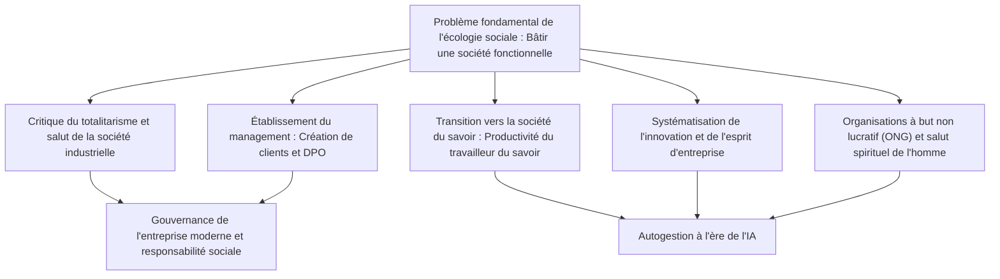
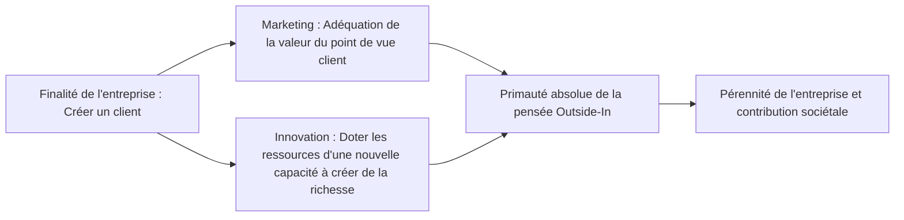
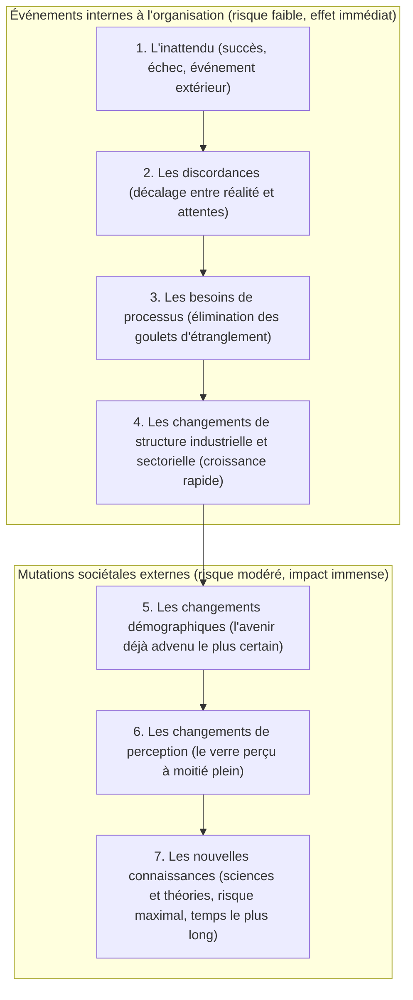

## 1. Introduction : La portée intellectuelle de Peter Drucker, géant de la pensée du XXe siècle

### 1.1 Le rétrécissement trompeur du titre de « père du management » et son essence d'« écologiste social »

Le nom de Peter F. Drucker (Peter Ferdinand Drucker, 1909–2005) est universellement célébré sous le titre de « père du management moderne » (Father of Modern Management). Pourtant, lui-même a toujours rejeté cette étiquette réductrice tout au long de son existence. Le titre singulier qu'il n'a cessé de revendiquer sa vie durant était celui d'« écologiste social » (Social Ecologist).

Tout comme l'écologie biologique observe et étudie les interactions dynamiques ainsi que les équilibres vivants entre les organismes et leur milieu naturel, l'écologie sociale est une discipline qui observe la manière dont les êtres humains vivent, travaillent, nouent des relations et édifient un ordre social au sein des environnements qu'ils ont eux-mêmes créés : entreprises, gouvernements, universités, hôpitaux, églises ou cellules familiales.

L'intérêt fondamental de Drucker n'a jamais résidé dans de simples « techniques d'optimisation du profit » ou des « outils d'efficacité gestionnaire ». La question existentielle qu'il a inlassablement posée tout au long de son œuvre était profondément éthique, philosophique et humaniste : **« Comment bâtir une société fonctionnelle (a functioning society) au sein de laquelle l'être humain peut vivre en préservant sa liberté et sa dignité ? »** S'il a consacré tant d'énergie à analyser les entreprises et le monde des affaires, c'est parce qu'au XXe siècle, la grande entreprise s'est imposée comme l'institution représentative (Representative Institution) de la société, devenant le lieu prépondérant qui façonne l'existence et l'identité des individus.

Nombreux sont aujourd'hui les professionnels et les chercheurs qui oublient que la pensée de Drucker a pris racine dans le désespoir politique et philosophique d'un jeune homme témoin de la montée du nazisme dans l'Europe d'avant-guerre, cherchant désespérément comment faire barrage au totalitarisme hitlérien. Cet article se propose d'explorer les courants profonds qui traversent l'ensemble de la vie et des écrits de Peter Drucker, afin d'élucider de manière exhaustive cet immense édifice intellectuel.

---

### 1.2 Le crépuscule de Vienne, la montée du nazisme et une théorie des organisations née de la critique du totalitarisme

Pour saisir la genèse de la pensée druckérienne, il faut comprendre le creuset intellectuel de la Vienne fin-de-siècle au crépuscule de l'Empire des Habsbourg. Né en 1909 dans une famille de la bourgeoisie cultivée de Vienne, capitale de l'Empire austro-hongrois, le jeune Drucker a grandi dans un foyer où se côtoyaient régulièrement des esprits éminents tels que Sigmund Freud, Joseph Schumpeter, Ludwig von Mises et Friedrich Hayek.

Cependant, l'éclatement de la Première Guerre mondiale provoqua l'effondrement de l'Empire des Habsbourg. Dans les années 1920 et 1930, la société européenne s'enfonça dans un délitement spirituel et social sans précédent. Les ordres de classe traditionnels et les autorités religieuses s'étant dissous, l'individu se retrouva arraché à ses communautés protectrices, ravalé au rang de masse isolée. La Grande Dépression de 1929 vint porter le coup de grâce, semant un désespoir généralisé à l'égard de l'économie de marché capitaliste et de la démocratie bourgeoise.

C'est de ce vide spirituel béant et de ce désespoir collectif que surgirent les deux grands totalitarismes du siècle : le national-socialisme hitlérien et le communisme stalinien. Jeune docteur en droit de Francfort et journaliste financier, Drucker fut le témoin direct et lucide de la submersion rapide de l'Allemagne dans les ténèbres hitlériennes. Dès l'accession de Hitler au pouvoir en 1933, Drucker quitta sans attendre l'Allemagne pour l'Angleterre, avant de s'exiler aux États-Unis en 1937.

Pour Drucker, le fascisme et le totalitarisme n'étaient pas de simples aberrations militaires ou politiques passagères, mais **« la révolte désespérée et pathologique d'une société occidentale moderne devenue incapable d'offrir à l'homme un statut social légitime (Status) et une fonction significative (Function) »**. Terrasser militairement le totalitarisme était donc nécessaire, mais insuffisant : pour le vaincre à sa racine, il fallait concevoir une nouvelle « société libre et non totalitaire » où chaque citoyen disposerait d'une place tangible, d'un rôle valorisé, de possibilités d'accomplissement personnel et d'une dignité inaliénable. Cette mission impérieuse fut le véritable moteur qui poussa Drucker vers l'exploration des organisations et du management.

---

## 2. Les origines de la pensée de Drucker : Le désespoir du totalitarisme et le salut de la société industrielle

### 2.1 *La fin de l'homme économique* (1939) ― Les limites du marxisme et du capitalisme, la pathologie du fascisme

En 1939, alors en exil, Drucker publia son premier ouvrage magistral, *La fin de l'homme économique* (*The End of Economic Man: The Origins of Totalitarianism*). Écrit par un jeune homme d'à peine trente ans encore inconnu, ce livre suscita l'éloge enthousiaste de Winston Churchill, qui le fit inscrire sur la liste des lectures indispensables pour les officiers britanniques.

Dans cet ouvrage pionnier, Drucker disséqua la nature du nazisme, le qualifiant non de « mal rationnel », mais de « foi magique délirante née de l'effondrement des espoirs rationnels ». Depuis le XVIIIe siècle, la société occidentale reposait sur la conception de l'« Homme économique » (Economic Man). Le capitalisme promettait que la poursuite égoïste et libre de l'intérêt matériel au sein du marché conduirait, grâce à la main invisible, à l'harmonie sociale et à la prospérité pour tous. Le marxisme, quant à lui, promettait que l'abolition des classes par la révolution prolétarienne instaurerait une société d'hommes libres et rigoureusement égaux.

Or, le capitalisme n'engendra que le chômage chronique, de criantes inégalités et le cataclysme de la Grande Dépression, tandis que le communisme s'abîmait dans la tyrannie sanglante et l'univers concentrationnaire du goulag. Face à la faillite simultanée de ces deux mythes fondateurs, la civilisation occidentale sombra dans un nihilisme vertigineux : ni la liberté économique ni l'égalité économique ne pouvaient garantir le bonheur, le sens ni la dignité de l'être humain.

Le fascisme s'engouffra opportunément dans cette béance. Rejetant ouvertement la rationalité économique et la liberté individuelle, il mobilisa une magie irrationnelle faite de hiérarchie militariste, de mythologie raciste et de culte idolâtre de l'État pour offrir aux masses désespérées un semblant de « sens » et un sentiment d'« appartenance ». Drucker comprit alors une vérité cardinale : la simple condamnation morale du fascisme ne suffirait jamais à guérir la société. Il fallait impérativement bâtir un « nouvel ordre social » qui, tout en intégrant la rationalité économique indispensable, transcende le simple gain financier pour procurer à l'homme une existence citoyenne digne et porteuse de sens.

---

### 2.2 *L'avenir de l'homme industriel* (1942) ― Donner à l'homme un statut social (Status) et une fonction (Function) dans la communauté

En 1942, coïncidant avec l'entrée en guerre des États-Unis, Drucker publia *L'avenir de l'homme industriel* (*The Future of Industrial Man*), dans lequel il esquissa les fondations de la société d'après-guerre.

Les concepts axiaux de cet ouvrage sont le « pouvoir légitime » (Legitimate Power) ainsi que le « statut social » (Status) et la « fonction » (Function) de l'individu. Pour qu'une société saine et libre puisse subsister dans la durée, deux conditions primordiales doivent être remplies :

1. **Un pouvoir légitime** : L'autorité qui gouverne la collectivité doit être reconnue par ses membres comme reposant sur une légitimité morale et juste.
2. **Un statut et une fonction** : Chaque individu doit posséder une place claire au sein de la société (un statut) et se voir confier un rôle par lequel il contribue de façon distincte au bien commun (une fonction).

Jusqu'au XIXe siècle, au sein des sociétés agraires et du premier capitalisme marchand, la famille, le village et la corporation garantissaient à l'individu ce statut et cette fonction. Mais avec la seconde révolution industrielle et l'avènement des usines géantes et des grandes firmes, ces communautés traditionnelles se disloquèrent. L'ouvrier d'usine devint un rouage anonyme et interchangeable d'un gigantesque appareil productif, broyé par un sentiment d'impuissance et d'aliénation sociale.

Drucker formula alors un avertissement prémonitoire : **« Si la grande entreprise industrielle moderne reste un pur mécanisme économique destiné à fabriquer de la richesse, sans parvenir à se muer en une communauté humaine offrant aux travailleurs un statut social et une fonction, la société libre sera de nouveau engloutie par les démons du totalitarisme. »** L'entreprise moderne, bien avant d'être la propriété privée de ses actionnaires, doit être comprise comme une institution de gouvernement autonome investie d'une responsabilité sociale éminente.

---

### 2.3 *Le concept de l'entreprise* (1946) ― L'enquête au cœur de General Motors (GM) et l'anatomie de la grande organisation moderne

En 1943, Drucker reçut une proposition inédite. L'état-major de General Motors (GM), alors la plus grande entreprise manufacturière du monde et le navire amiral du capitalisme mondial, l'invita à réaliser une étude externe approfondie et exhaustive de sa structure managériale et de son fonctionnement organisationnel.

Drucker vécut pendant 18 mois au cœur de GM, conduisant d'innombrables entretiens avec le président-directeur général Alfred Sloan, les directeurs de division, les ingénieurs, les contremaîtres et les ouvriers à la chaîne, assistant aux réunions stratégiques du comité de direction. Ce travail pionnier donna naissance en 1946 à un classique fondateur de la théorie des organisations : *Le concept de l'entreprise* (*Concept of the Corporation*).

Ce livre fut le premier dans l'histoire de la pensée à analyser la grande entreprise non comme une pure entité économique, mais comme **« une institution politique et sociale constitutive de la société »**. Drucker y mit en lumière le secret de la puissance prodigieuse de GM : le modèle de la « décentralisation fédérale » conçu par Alfred Sloan. En substituant à la centralisation militaire rigide une autonomie poussée des divisions opérationnelles dotées de leurs propres responsabilités de marché et de gestion, GM parvenait à conjuguer l'envergure d'un mastodonte et l'agilité d'une PME.

---

### 2.4 Le choc doctrinal avec Sloan : Rationalisme hiérarchique de GM contre organisation humaine autonome

Toutefois, *Le concept de l'entreprise* suscita un rejet violent au sein même de General Motors. Alfred Sloan et les hauts dirigeants de GM accueillirent avec indignation les recommandations humanistes de Drucker, telles que la délégation accrue des responsabilités aux ouvriers, la mise en place d'équipes auto-organisées, l'autonomie des communautés d'usine, ainsi que la recherche de la dignité et de la sécurité de l'emploi pour les salariés.

Pour Sloan, l'entreprise était une mécanique de précision rationnellement agencée combinant capital, technologie et main-d'œuvre, au sein de laquelle l'ouvrier n'était qu'une unité économique contractuelle rétribuée par un salaire. Considérant les préconisations de Drucker comme des « rêveries socialisantes et sentimentales », Sloan fit bannir l'ouvrage des bureaux de GM (ironiquement, Henry Ford II, à la tête du concurrent Ford Motor en pleine déroute, dévora le livre et s'en servit pour orchestrer le redressement spectaculaire de son groupe).

Ce choc philosophique avec Sloan scella l'orientation définitive de la pensée de Drucker. Rejetant définitivement le contrôle bureaucratique descendant et l'obsession de la gestion purement chiffrée, Drucker décida de vouer son existence à l'exploration d'un **« management décentralisé et autonome fondé sur la confiance dans le potentiel humain et l'autocontrôle »**.

---

## 3. La naissance du « Management » et son architecture fondamentale

### 3.1 Ce qu'a fondé *La pratique de la direction des entreprises* (1954)

En 1954, Drucker publia *La pratique de la direction des entreprises* (*The Practice of Management*). Grâce à cet ouvrage fondamental, le « management » devint pour la toute première fois au monde une discipline académique et professionnelle autonome, rigoureuse et systématisée. Jusqu'alors, la conduite des affaires était perçue comme relevant soit de l'intuition innée d'entrepreneurs charismatiques, soit d'une simple technique comptable de tenue des bilans financiers. Drucker éleva le management au rang d'un corpus de savoirs transmissible, enseignable et praticable.

Drucker y définit les trois fonctions vitales et universelles de tout management :

1. **Accomplir la mission et la finalité spécifiques de l'institution** : Pour une entreprise, générer un résultat économique ; pour un hôpital, soigner les malades ; pour une université, faire progresser la connaissance et former les esprits.
2. **Rendre le travail productif et les travailleurs performants** : Mobiliser au plus haut point les aptitudes humaines afin que le travailleur trouve dans son activité dignité, accomplissement et opportunité d'élévation.
3. **Gérer les impacts sociaux de l'institution et assumer ses responsabilités sociétales** : Veiller à ce que les activités de l'organisation ne polluent ni ne lèsent la communauté humaine, et agir en citoyen exemplaire au service du bien commun.

Ces trois dimensions sont indissociables : le management a le devoir permanent d'en maintenir l'équilibre dynamique.

---

### 3.2 La finalité de l'entreprise est de « créer un client » : La dualité du marketing et de l'innovation

L'axiome le plus célèbre et pourtant le plus fréquemment déformé de la philosophie managériale de Drucker touche à la finalité de l'entreprise. Drucker l'affirme sans détour :

> **« Il n'y a qu'une seule définition valable de la finalité de l'entreprise : créer un client (There is only one valid definition of business purpose: to create a customer). »**

La majorité des dirigeants et des économistes croient dur comme fer que la finalité de l'entreprise est la maximisation du profit. Mais pour Drucker, le profit n'est en rien la finalité de l'entreprise ; il n'est qu'une « condition d'existence » ou une « limitation » indispensable pour assurer sa survie et couvrir les risques de l'incertitude future. De même que respirer et consommer de l'oxygène sont des conditions biologiques de la survie humaine sans être pour autant le but de la vie, le profit n'est que l'oxygène de l'organisation.

Sans client, toute entreprise disparaît instantanément. Or, le client n'existe pas spontanément dans la nature : il est révélé et créé par l'activité même de l'entreprise. Dès lors, pour accomplir cette mission de création d'un client, toute organisation d'affaires ne possède fondamentalement que **deux fonctions de base (Basic Functions)** :

1. **Le marketing (Marketing)** : Comprendre si intimement les besoins réels, les aspirations, la réalité et les valeurs du client que le produit ou le service s'adapte parfaitement à lui. « Le but d'un grand marketing est de rendre la vente (sales) superflue. »
2. **L'innovation (Innovation)** : Conférer à des ressources existantes une capacité nouvelle à créer de la richesse. C'est l'activité continue consistant à apporter une valeur économique et sociale inédite.

Toutes les autres activités de l'entreprise (ressources humaines, comptabilité, finance, achats, logistique) ne sont que des centres de coûts destinés à soutenir ces deux fonctions fondamentales. La seule source authentique de profit se situe toujours hors des murs de l'organisation : dans la satisfaction du client.

---

### 3.3 La vérité sur la Direction par objectifs et autocontrôle (DPO / MBO)

L'un des concepts les plus révolutionnaires formulés par Drucker dans *La pratique de la direction des entreprises* est la « Direction par objectifs et autocontrôle » (Management by Objectives and Self-Control : MBO / DPO).

Aujourd'hui, sous l'appellation d'« évaluation par objectifs » ou « MBO », ce dispositif a été adopté par la quasi-totalité des grandes entreprises à travers le monde. Pourtant, comme Drucker le déplorait avec amertume à la fin de sa vie, **99 % des démarches de MBO appliquées dans les entreprises modernes ont dégénéré en instruments d'assignation de quotas et de flicage hiérarchique, soit l'exact opposé de sa vision originelle**.

Le cœur battant de la pensée druckérienne réside dans la seconde partie de l'expression : **« l'autocontrôle (Self-Control) »**. Le modèle managérial traditionnel fonctionnait sur le « contrôle externe » (External Control) : la hiérarchie imposait des quotas d'en haut, surveillait les moindres gestes et manipulait les salariés par le bâton et la carotte. Cela n'est rien d'autre qu'un avatar désuet du taylorisme réduisant l'homme à une machine passive.

À l'inverse, la véritable démarche de DPO selon Drucker repose sur le processus suivant :

1. Les objectifs généraux et la mission de l'organisation sont partagés et assimilés en profondeur par tous.
2. Chaque collaborateur détermine lui-même sa contribution propre à cette mission globale et fixe ses objectifs personnels de manière volontaire et responsable.
3. L'organisation met en place les conditions permettant à chaque travailleur d'accéder directement, sans filtre hiérarchique, aux informations et au feedback nécessaires pour mesurer la performance de ses actions.
4. Le collaborateur contrôle lui-même ses progrès et procède de façon autonome aux ajustements requis.

La DPO n'a jamais été un outil destiné à renforcer l'assujettissement hiérarchique, mais **« une philosophie d'émancipation qui rend le contrôle externe superflu et transforme chaque travailleur en un professionnel responsable et autonome »**. Drucker avait l'intime conviction que la motivation intrinsèque (Intrinsic Motivation) et l'autonomie fondée sur la responsabilité individuelle libèrent la dignité humaine tout en hissant la performance collective à son zénith.

---

### 3.4 Définition des résultats et allocation des ressources : Les huit domaines clés de l'entreprise

Drucker a sévèrement mis en garde contre le danger mortel d'évaluer la santé d'une entreprise à l'aune d'un indicateur financier unique (comme le chiffre d'affaires ou le bénéfice trimestriel). Pour prospérer durablement et assumer son rôle social, l'entreprise doit équilibrer ses objectifs et piloter ses progrès dans **huit domaines clés de résultats (Key Result Areas)** :

| Domaine | Contenu et importance stratégique |
| :--- | :--- |
| **1. Marketing** | Non seulement la part de marché sur les segments existants, mais l'ouverture de nouveaux marchés et le rythme de création de clients. |
| **2. Innovation** | Non seulement les produits et services, mais la modernisation des structures organisationnelles, des processus opérationnels et des modèles d'affaires. |
| **3. Ressources humaines et capacités organisationnelles** | Le développement des compétences, la motivation des collaborateurs, la formation des futurs dirigeants et l'autonomie des équipes. |
| **4. Ressources financières** | La capacité à mobiliser les capitaux nécessaires aux investissements, la santé des flux de trésorerie (cash-flow) et l'allocation optimale du capital. |
| **5. Ressources matérielles** | L'efficacité, la productivité et la modernité des infrastructures de production : usines, équipements, espaces de travail et systèmes d'information. |
| **6. Productivité** | Le ratio de valeur ajoutée généré par rapport aux ressources engagées (travail, capital, temps, matières premières). |
| **7. Responsabilité sociale** | L'intégrité éthique, le respect des réglementations, la préservation de l'environnement et l'engagement actif auprès de la collectivité. |
| **8. Exigence de rentabilité (Profit nécessaire)** | Le niveau de profit indispensable pour financer les sept objectifs précédents et couvrir les risques inhérents à l'incertitude de l'avenir. |

La quintessence de la pensée gestionnaire de Drucker se résume à cette sentence : **« Le profit n'est pas le but, mais la condition préalable de l'entreprise. »** Le profit représente à la fois le bulletin de notes des actions passées et la prime d'assurance nécessaire pour affronter les coûts et les aléas de l'avenir.

---

## 4. La prescience de la société du savoir et l'émergence du « Travailleur du savoir »

### 4.1 De *La grande mutation* (1969) à *Au-delà du capitalisme* (1993)

Parmi toutes les fulgurances visionnaires de Peter Drucker, celle qui a eu le retentissement historique le plus profond est l'annonce de l'avènement de la « société du savoir » (Knowledge Society). C'est dès 1959, dans son livre *Landmarks of Tomorrow* (*Les repères de l'avenir*), que Drucker forgea pour la toute première fois de l'histoire l'expression de **« travailleur du savoir » (Knowledge Worker)**.

Puis, en 1969, dans son ouvrage magistral *La grande mutation* (*The Age of Discontinuity*), il mit en évidence la faille tectonique qui ébranlait les fondations économiques issues de la révolution industrielle. L'économie classique considérait depuis toujours que les facteurs de production primordiaux étaient la terre (ressources naturelles), le travail (force physique) et le capital (usines et machines). Or, Drucker démontra qu'à partir de la seconde moitié du XXe siècle, ces facteurs traditionnels étaient relégués au second plan : **le « savoir » (Knowledge) devenait le seul et unique facteur de production déterminant**.

En 1993, dans *Au-delà du capitalisme* (*Post-Capitalist Society*), Drucker approfondit encore cette intuition. Dans la société capitaliste classique, le pouvoir appartenait aux détenteurs du capital matériel (les bourgeois et les investisseurs financiers). Mais dans la société du savoir, le véritable capital réside dans l'esprit même des travailleurs. Puisque les travailleurs du savoir sont propriétaires de leurs propres moyens de production (leur intelligence, leurs compétences et leur jugement critique) et qu'ils peuvent les emporter avec eux d'une organisation à l'autre, le rapport de force historique entre le capital et le travail s'est inversé pour la première fois de l'histoire.

---

### 4.2 Du travail manuel (taylorisme) au travail du savoir : Une rupture historique

Le plus grand miracle économique du XXe siècle résida dans la prodigieuse multiplication de la productivité du travail manuel — **multipliée par près de 50** — sous l'impulsion de l'« organisation scientifique du travail » initiée par Frederick Winslow Taylor. Taylor avait minutieusement décomposé, chronométré et reconstruit les gestes d'artisans qui reposaient autrefois sur l'intuition et l'apprentissage empirique. Cette révolution de la productivité donna naissance à la prospère société de consommation de masse et à la classe moyenne démocratique, conjurant le spectre des insurrections marxistes dans les pays occidentaux.

Néanmoins, Drucker tira la sonnette d'alarme : « Si la plus grande contribution du management au XXe siècle fut d'accroître la productivité du travail manuel, **le défi suprême auquel le management sera confronté au XXIe siècle est d'accroître la productivité du travail du savoir** ».

Il existe en effet une divergence d'essence absolue entre le travail manuel et le travail intellectuel :

| Caractéristique | Travail manuel (Manual Work) | Travail du savoir (Knowledge Work) |
| :--- | :--- | :--- |
| **Définition de la tâche** | Le contenu du travail est prédéterminé et ne fait l'objet d'aucun doute (ex. : porter une poutre en acier, visser un boulon). | **« Quelle est la tâche ? Pour quelle finalité est-elle menée ? »** sont des questions que le travailleur doit définir lui-même. |
| **Autonomie** | L'obéissance rigoureuse aux protocoles opératoires est la vertu cardinale ; le contrôle est externe et strict. | L'**autonomie (Autonomy)** est vitale ; sans capacité d'autocontrôle, aucune performance durable n'est envisageable. |
| **Innovation continue** | L'innovation est l'apanage exclusif des ingénieurs et des concepteurs de méthodes. | L'innovation doit être **intégrée de manière continue** par le travailleur du savoir dans son activité quotidienne. |
| **Apprentissage et transmission** | Une fois la technique assimilée, l'efficacité grandit par la répétition machinale. | Le savoir devient obsolète à une vitesse fulgurante : **l'apprentissage et la formation continus tout au long de la vie** sont obligatoires. |
| **Critère d'évaluation** | Essentiellement la **« Quantité »** (nombre de pièces fabriquées par unité de temps). | Essentiellement la **« Qualité »** (pertinence des analyses, finesse des intuitions, impact des solutions). |
| **Propriété des moyens de production** | Les usines, machines et outillages sont la **propriété exclusive des capitalistes**. | Les moyens de production (connaissances, discernement, créativité) sont la **propriété intellectuelle du travailleur**. |

Dans le travail du savoir, trimer avec acharnement pendant de longues heures ne garantit en rien un résultat valable. Résoudre avec une efficacité chirurgicale un mauvais problème représente un gaspillage intégral. Accroître la productivité du travailleur du savoir est un exploit que les chronomètres et les grilles tayloriennes ne pourront jamais accomplir : cela requiert une mutation paradigmatique totale du management.

---

### 4.3 Les six grands principes déterminant la productivité du travailleur du savoir

Dans *Les défis du management pour le XXIe siècle* (*Management Challenges for the 21st Century*, 1999), Drucker énonça avec netteté les six exigences impératives pour développer la productivité du travailleur du savoir :

1. **Poser sans relâche la question : « Quelle est la tâche ? »** : L'étape cruciale dans le travail intellectuel consiste à délimiter ce qui mérite véritablement d'être accompli. Rien n'est plus toxique que d'exécuter avec brio des tâches inutiles.
2. **Accorder une autonomie pleine et entière** : Les travailleurs du savoir doivent s'autogérer. L'autonomie est la matrice de la responsabilité et du professionnalisme.
3. **Inscrire l'innovation continue au cœur du travail** : Dans son champ d'expertise, le professionnel doit spontanément chercher de nouvelles approches et de nouvelles valeurs.
4. **Alimenter un cycle continu d'auto-apprentissage et d'enseignement aux autres** : Le travailleur du savoir doit être à la fois un apprenant permanent et un mentor pour ses pairs. Rien ne structure et n'approfondit la connaissance autant que le fait de devoir l'enseigner.
5. **Privilégier la qualité sur la quantité** : Une seule analyse visionnaire touchant au cœur d'un enjeu stratégique a mille fois plus de valeur que cent volumineux rapports administratifs creux.
6. **Traiter le travailleur du savoir comme un « capital » et non comme un « coût »** : Le travailleur intellectuel n'est pas un coût à minimiser, mais un investisseur apportant librement son capital cognitif, un « partenaire » de l'organisation.

---

### 4.4 « Le travailleur du savoir doit être son propre directeur général » : L'art de l'autogestion

L'entrée dans la société du savoir bouleverse également l'existence individuelle. En 1999, dans son essai percutant « Gérer sa propre vie » (*Managing Oneself*), Drucker sonna l'alarme pour l'ensemble des professionnels modernes.

Dans les époques prémodernes, le métier d'un individu était prédéterminé par sa naissance ou la lignée familiale. Dans la société industrielle classique, entrer dans une grande entreprise garantissait un plan de carrière tout tracé jusqu'à l'âge de la retraite. Or, dans la société du savoir, **« chacun doit concevoir sa propre trajectoire et gérer lui-même sa performance »**. Alors que l'espérance de vie humaine dépasse désormais 80 ans, la durée de vie moyenne d'une grande entreprise (environ 30 ans) est devenue bien inférieure à la durée d'activité professionnelle d'un individu. Chaque travailleur intellectuel doit donc se concevoir comme le directeur général (CEO) d'une petite entreprise autonome : « Moi, S.A. ».

Drucker a articulé les méthodes concrètes de l'autogestion autour des principes suivants :

#### ① Connaître ses forces (Strengths)
Le pivot de l'anthropologie druckérienne tient en une maxime fondamentale : **« On ne peut bâtir sa performance que sur ses forces ; on ne réussit jamais en s'appuyant sur ses faiblesses. »**

Le système éducatif conventionnel et la formation d'entreprise gaspillent une énergie inouïe à traquer les lacunes des individus pour tenter de les hisser à la moyenne. Or, faire passer une incompétence à la médiocrité exige des efforts colossaux, tandis qu'affûter une force remarquable pour en faire une excellence sans égale demande infiniment moins de peine pour un rendement incomparable.

Pour mettre au jour ses forces authentiques, Drucker préconise un outil d'une remarquable simplicité : **« l'analyse de feedback (Feedback Analysis) »**.
- Chaque fois que l'on prend une décision cruciale ou que l'on lance une action majeure, **on consigne par écrit sur une feuille les résultats que l'on s'attend à obtenir**.
- Neuf mois ou un an plus tard, **on compare méthodiquement les résultats réels avec les prévisions écrites initiales**.
- En répétant cette discipline pendant quelques années, on découvre avec une lucidité implacable ses véritables domaines de talent, les conditions dans lesquelles ses forces produisent des fruits, et, en miroir, les zones où l'on s'avère totalement improductif.

#### ② Comprendre sa manière de travailler (How I Perform)
Tout aussi vitale que la connaissance de ses forces est celle de son style opératoire et cognitif :
- **Suis-je un « lecteur » (Reader) ou un « auditeur » (Listener) ?** (Dwight Eisenhower était un lecteur : incapable d'improviser en conférence de presse orale où il multipliait les impairs, il excellait dès lors qu'on lui remettait les dossiers par écrit au préalable. Franklin D. Roosevelt et Harry Truman étaient à l'inverse de purs auditeurs).
- **Comment est-ce que j'apprends ?** (En écrivant, en dialoguant, ou en agissant sur le terrain ?).
- **Suis-je fait pour décider (Decision Maker) ou pour conseiller (Adviser) ?** (Nombreux sont les brillants numéros deux qui, promus au poste de commandant en chef, deviennent soudain indécis et conduisent leur organisation au désastre).

#### ③ Préparer la seconde moitié de sa vie professionnelle (Second Career)
Tandis que l'ouvrier manuel s'arrête lorsque son corps faiblit, le travailleur du savoir entre quarante-cinq et cinquante ans est guetté par la lassitude et le burn-out intellectuel. Après vingt ans passés à accomplir les mêmes missions, l'apprentissage stagne et l'ennui s'installe.

Drucker recommandait vivement de commencer à développer, bien avant d'avoir atteint l'âge de quarante ans, **« un second champ d'activité (carrière parallèle, engagement civique ou associatif) »**. Disposer d'un autre univers d'engagement — au sein d'une ONG, d'une institution locale, de l'enseignement ou du bénévolat — où ses compétences sont mises au service d'une cause utile constitue l'unique rempart moral permettant de préserver sa dignité en cas de revers professionnel ou de restructuration, et de vivre une seconde moitié d'existence féconde et passionnante.

---

## 5. Les techniques systématiques de l'innovation et de l'esprit d'entreprise

### 5.1 *Les entrepreneurs* (1985)

Pour l'opinion commune, l'innovation relève du coup d'éclat romantique : un trait de génie tombé du ciel au milieu de la nuit dans l'esprit d'un visionnaire isolé, ou le fruit de gigantesques budgets de recherche et développement (R&D) dans l'attente d'une découverte scientifique miraculeuse.

En 1985, Drucker publia *Les entrepreneurs* (*Innovation and Entrepreneurship*), pulvérisant cette mythologie naïve de l'innovation. Pour Drucker, l'innovation ne résulte pas d'une inspiration mystique, mais constitue **« une discipline systématique et organisée qui peut être apprise et pratiquée méthodiquement »**.

Drucker la définit en ces termes :
> **« L'innovation consiste à doter les ressources existantes d'une capacité nouvelle à créer de la richesse. Bien plus : avant l'innovation, il n'existe rien qui puisse être appelé "ressource". Jusqu'à ce que l'homme y découvre un usage et lui confère une valeur économique, toute plante n'est qu'une mauvaise herbe et tout minerai n'est qu'un rocher inutile. »**

Le pétrole n'était, jusqu'au milieu du XIXe siècle, qu'une mélasse gluante et indésirable qui polluait les terres arables. Ce ne fut pas la découverte chimique en tant que telle qui le transforma en ressource de valeur inouïe, mais l'innovation qui relia le raffinage et le moteur à combustion interne aux besoins croissants de transport de la société.

---

### 5.2 Briser le mythe de l'illumination : Les sept sources d'opportunités innovantes

Drucker a hiérarchisé **« les sept sources d'opportunités innovantes » (The Seven Sources for Innovative Opportunity)** que les dirigeants doivent sonder avec rigueur. Elles sont classées de la plus fiable et la moins risquée à la plus aléatoire :

#### ① L'inattendu (The Unexpected)
Offrant le risque le plus faible et le potentiel le plus immédiat, le succès inattendu (Unexpected Success) et l'échec inattendu (Unexpected Failure) sont paradoxalement les signaux les plus négligés par les entreprises établies.
- **Le succès inattendu** : Quand IBM conçut ses premiers calculateurs électroniques, ses machines étaient pensées pour la recherche scientifique. Or, ce furent les compagnies d'assurance et les banques qui se ruèrent dessus pour leur comptabilité. Les ingénieurs s'en alarmèrent au départ, y voyant un « dévoiement », mais la direction eut la clairvoyance de réorienter toutes ses forces sur cette demande inattendue, forgeant ainsi l'empire informatique d'IBM.
- Trop d'entreprises passent des heures en comité de direction à disséquer les lignes déficitaires (les échecs prévus) tout en balayant d'un revers de main les ventes imprévues qui explosent, les taxant de « simples anomalies passagères ». Drucker recommandait de consacrer la toute première page du rapport de gestion mensuel exclusivement aux succès inattendus et d'y affecter les meilleurs talents.

#### ② Les discordances (Incongruities)
Il s'agit d'un hiatus flagrant entre ce que l'on croit devoir être la réalité et ce qui s'y passe effectivement.
- Dans les années 1950, l'armement maritime mondial dépensait des fortunes pour accroître la vitesse des navires et réduire la consommation de carburant, alors même que ses marges s'effondraient. Le véritable foyer de coûts n'était pas la navigation en mer, mais le temps d'attente au port durant les fastidieuses opérations de chargement et de déchargement. Malcom McLean identifia cette discordance et mit au point le « conteneur maritime » (Containerization). Sans toucher à la vitesse intrinsèque des bateaux, l'unification standardisée du transport terrestre et maritime réduisit les temps d'escale de plusieurs semaines à quelques heures, déclenchant l'explosion du commerce mondial.

#### ③ Les besoins de processus (Process Need)
C'est le maillon manquant ou le goulot d'étranglement manifeste au sein d'un processus opérationnel existant qui exige une solution évidente.
- L'invention de l'appareil photographique Polaroid répondait au besoin pressant d'éliminer la phase lente du développement en laboratoire ; les centraux téléphoniques automatiques répondaient à l'impossibilité d'embaucher suffisamment d'opératrices manuelles pour absorber la croissance du réseau.

#### ④ Les mutations de structures sectorielles et de marché (Industry and Market Structures)
Dès lors qu'un secteur d'activité connaît une croissance annuelle supérieure à 10 %, ses structures traditionnelles vacillent, ouvrant une brèche entre les anciens acteurs dépassés et les nouveaux entrants agiles.
- L'ascension de Volvo axée sur la sécurité lors de l'expansion du marché automobile, ou l'avènement des courtiers en ligne lors de la libéralisation des marchés financiers.

#### ⑤ Les changements démographiques (Demographics)
Au sein de ce que Drucker appelle **« l'avenir déjà advenu » (The Future that has already happened)**, la démographie (taux de natalité, mortalité, pyramide des âges, niveau d'instruction) est l'élément le plus prévisible et le plus incontestable.
- Le nombre d'adultes de vingt ans dans deux décennies est d'ores et déjà déterminé à 100 % par le nombre de naissances enregistrées aujourd'hui. Le vieillissement de la population, la contraction de la population active ou la massification de l'enseignement supérieur ouvrent des dizaines d'opportunités d'innovations majeures.

#### ⑥ Les changements de perception (Changes in Perception)
Les faits matériels restent inchangés, mais le regard que la société porte sur eux bascule.
- L'analogie du verre « à moitié plein » qui est subitement perçu comme « à moitié vide ». Alors que la médecine moderne n'a cessé d'allonger l'espérance de vie et que l'humanité jouit d'une santé matérielle sans précédent, les citoyens contemporains sont devenus obsédés par la fragilité corporelle, se ruant sur l'alimentation biologique et le culte du fitness. Ce marché florissant ne découle pas d'une dégradation de la santé réelle, mais d'une transformation profonde de la perception de la santé.

#### ⑦ Les nouvelles connaissances (New Knowledge)
Les innovations fondées sur une avancée scientifique, technologique ou conceptuelle nouvelle.
- C'est l'archétype auquel le grand public assimile l'innovation. Pourtant, Drucker met en garde : **les innovations fondées sur de nouvelles connaissances sont les plus risquées, les plus capitalistiques et celles dont le temps de maturation est le plus long** (en moyenne 25 à 30 ans entre la découverte fondamentale et son application industrielle réussie). De surcroît, elles exigent la convergence simultanée de savoirs hétérogènes, ce qui en fait des paris spéculatifs extrêmes.

---

### 5.3 L'abandon systématique (Systematic Abandonment) : Le courage d'euthanasier le succès d'hier

La première condition pour innover ne réside pas dans la génération de nouvelles idées. Drucker tranche : **« Le tout premier acte d'une politique d'innovation consiste à se débarrasser systématiquement de ce qui est ancien, de ce qui est devenu stérile et des succès d'hier (Systematic Abandonment). »**

Toute organisation a une propension fatale à immobiliser ses ressources les plus précieuses — ses meilleurs talents et ses capitaux — pour défendre des produits, des services ou des filiales sur le déclin. Plus un projet a été couronné de succès par le passé, plus il se transforme en forteresse sacrée intouchable que personne n'ose contester, privant ainsi l'avenir de toute ressource vive.

Drucker imposait à tout dirigeant de s'adresser périodiquement cette question sans complaisance :
> **« Si nous ne faisions pas déjà ceci, sachant ce que nous savons aujourd'hui, nous y engagerions-nous maintenant ? »**

Si la réponse est « non », la question subsidiaire n'est pas « comment l'améliorer ? », mais : « que devons-nous faire pour y mettre un terme immédiatement ? ». Il ne s'agit pas de rafistoler ou de prolonger artificiellement l'agonie, mais de planifier une retraite et un désengagement systématique. De même qu'un organisme biologique meurt s'il ne parvient plus à éliminer ses cellules mortes, une entreprise qui n'organise pas son abandon systématique court droit vers l'asphyxie créative.

---

## 6. Gouvernance de l'organisation, responsabilité sociale et portée des organisations à but non lucratif (NPO)

### 6.1 Les trois dimensions de *Le management : tâches, responsabilités, pratiques* (1973) et l'essence de la responsabilité sociétale

En 1973, synthèse monumentale de sa pensée, Drucker publia son opus magnum en deux tomes de plus de mille pages : *Le management : tâches, responsabilités, pratiques* (*Management: Tasks, Responsibilities, Practices*).

Dans cet ouvrage majeur, la notion de « responsabilité sociale de l'entreprise » (RSE / CSR) est abordée avec une profondeur qui dépasse de loin les exercices cosmétiques modernes de relations publiques ou de mécénat de complaisance. Pour Drucker, la responsabilité sociétale se scinde impérativement en deux catégories distinctes :

1. **Le traitement des impacts négatifs causés par les activités de l'organisation** :
   - Émissions polluantes, nuisances sonores, déchets toxiques, pénibilité ou atteintes à la santé des salariés.
   - La doctrine de Drucker est intransigeante : **« Les impacts négatifs qu'une institution inflige à la société doivent être ramenés à zéro sous sa propre responsabilité, quel qu'en soit le coût financier. »** Fermer les yeux sur ses nuisances constitue une forfaiture morale qui détruit la légitimité sociale de l'entreprise.
2. **La résolution des problèmes propres à la société globale** :
   - La pauvreté endémique, les inégalités scolaires, le vieillissement démographique ou la crise climatique générale.
   - À cet égard, Drucker pose une règle éminemment pragmatique : « L'entreprise ne doit s'attaquer aux maux de la société que si elle est capable de transformer cette mission, grâce à ses compétences et ses forces distinctives, en une **véritable opportunité économique pérenne** ». S'égarer par compassion sentimentale dans des combats dépassant ses aptitudes, au détriment de sa viabilité opérationnelle, relève de l'irresponsabilité la plus coupable.

---

### 6.2 Pourquoi Drucker s'est-il passionné pour les organisations à but non lucratif (NPO/NGO) à la fin de sa vie ?

À partir des années 1980, alors qu'il occupait déjà le sommet de la notoriété intellectuelle mondiale, Drucker investit une part prépondérante de son énergie à conseiller et étudier les organisations à but non lucratif (NPO / ONG) : universités, hôpitaux, éclaireuses (Girl Scouts), Armée du Salut, églises. En 1990, il leur consacra l'ouvrage *Le management des organisations à but non lucratif* (*Managing the Non-Profit Organization*).

Quelle raison profonde poussa le théoricien de la grande firme à opérer cette bascule vers le secteur non lucratif ? C'était l'aboutissement inéluctable de sa quête d'une « société fonctionnelle ».

L'entreprise produit des biens et des services et crée des clients. L'État édicte des lois, prélève des impôts et maintient l'ordre public. Mais **ni le marché ni l'État ne sont en mesure de transformer l'âme humaine ou de restaurer le tissu communautaire**.
- La vocation de l'hôpital n'est pas d'accumuler du profit, mais de guérir les souffrants.
- La vocation de l'église est d'offrir le salut aux âmes des fidèles.
- La vocation de l'Armée du Salut est de réhabiliter des personnes brisées par l'alcool ou la déchéance pour en refaire des citoyens autonomes et fiers.

Drucker formula alors cette sentence éclatante : **« Le véritable produit d'une organisation à but non lucratif, c'est un être humain transformé (A Changed Human Being). »**

Bien plus, Drucker énonça un paradoxe saisissant : alors que beaucoup pensaient que les associations caritatives devaient copier la gestion des entreprises commerciales, Drucker proclamait que **« ce sont au contraire les entreprises commerciales qui ont tout à apprendre du management des grandes organisations à but non lucratif »**.

En effet, les organisations à but non lucratif ne peuvent enchaîner leurs membres par l'argent : la plupart de leurs acteurs sont des bénévoles engagés. Ceux-ci ne se mobilisent que par fidélité à une **« noble mission »** et par la fierté de leur contribution. Ne pouvant compter sur la carotte financière, les dirigeants du secteur non lucratif sont obligés de définir avec une netteté chirurgicale leur mission, de forger une communauté de valeurs partagées et d'exiger une rigoureuse autodiscipline. Ce management de la mobilisation volontaire représente précisément le modèle absolu dont doivent s'inspirer les entreprises du XXIe siècle pour diriger les travailleurs du savoir en tant que partenaires.

---

## 7. Réévaluation de la pensée de Drucker à l'ère contemporaine et au siècle de l'IA

### 7.1 L'IA générative et le nouveau changement de paradigme de la société du savoir

Dans les années 2020, avec le bond prodigieux des grands modèles de langage (LLM) comme ChatGPT et des intelligences artificielles génératives, la société du savoir s'est engagée dans une phase vertigineuse que Drucker n'aurait pu anticiper dans ses détails techniques.

La plupart des tâches cognitives jusqu'ici considérées comme l'apanage des professionnels du savoir — écriture de code, rédaction de mémos, traitement statistique, recherche juridique préparatoire ou aide au diagnostic clinique — sont aujourd'hui automatisées avec une vélocité foudroyante et une efficacité surhumaine. Ce que le taylorisme fit jadis pour mécaniser le geste de l'ouvrier à l'usine s'accomplit désormais au cœur des citadelles de la matière grise des cols blancs.

Dans cette ère saturée d'algorithmes, la philosophie de Drucker ne vieillit pas d'un iota ; elle devient au contraire astronomiquement plus précieuse. Drucker n'a cessé de répéter que **« produire des réponses et exécuter des calculs est la tâche des machines ; la seule œuvre authentiquement humaine consiste à poser les bonnes questions (Asking the Right Questions) »**.

L'intelligence artificielle est hors pair pour recombiner des téraoctets de données accumulées en réponse à un prompt donné. En revanche, poser des questions existentielles telles que :
- « Quelle doit être la mission fondamentale de notre organisation ? »
- « Quelle est la valeur véritable du point de vue de nos clients ? »
- « Quel succès passé devons-nous avoir le courage d'abandonner aujourd'hui ? »
- « Quelle responsabilité morale assumons-nous face à la communauté des hommes ? »

demeure rigoureusement impossible pour une machine. Plus l'IA se charge des opérations de calcul et de synthèse documentaire, plus l'activité humaine se recentre sur le territoire éthique et philosophique que Drucker a inlassablement défriché : le discernement critique, l'engagement moral, la vision du destin collectif et la relation humaine vivante.

---

### 7.2 Convergences fondamentales : Méthodes agiles, OKR et organisations opales (Teal)

Ceux qui découvrent aujourd'hui les doctrines les plus innovantes du management contemporain — le développement Agile, les OKR (Objectives and Key Results), ou le modèle des « organisations opales » (Teal Organizations) popularisé par Frédéric Laloux — restent pantois de constater que leurs principes directeurs étaient déjà formulés, avec un demi-siècle d'avance, par Peter Drucker.

- **L'obsession du client et les boucles itératives d'Agile** matérialisent parfaitement le précepte druckérien selon lequel « la finalité de l'entreprise est de créer un client, en intégrant le marketing et l'innovation dans chaque geste quotidien ».
- **Les OKR forgés par Andy Grove chez Intel et diffusés par Google** descendent en droite ligne de la Direction par objectifs et autocontrôle (MBO/DPO) de Drucker.
- **L'autogestion (Self-Management) et la plénitude de la personne humaine dans les organisations Teal** constituent l'incarnation vivante de ce que Drucker appelait dès *L'avenir de l'homme industriel* : une communauté humaine offrant un statut social et une fonction à chaque individu sous l'empire de l'autonomie et de la responsabilité.

Drucker n'est en rien un penseur poussiéreux du passé. Les théoriciens les plus avant-gardistes du management contemporain ne font que se tenir sur les épaules de ce titan, récoltant les fruits d'une terre qu'il avait lui-même magistralement labourée.

---

### 7.3 Conclusion : Vers l'avènement inachevé d'une « société fonctionnelle »

Jusqu'au seuil de ses 95 ans, avant de s'éteindre au terme d'une vie d'une prodigieuse fécondité, Peter Drucker n'a jamais cessé d'écrire, de conseiller et de transmettre. Le message ultime que livre la traversée de cette œuvre titanesque n'est pas un bréviaire d'astuces pour faire fortune, mais **« une foi inébranlable dans la valeur de la personne humaine, doublée d'un sens aigu de notre responsabilité envers la société »**.

À l'aube du XXIe siècle, alors que la cupidité financière s'érige trop souvent en finalité absolue, qu'un capitalisme court-termiste épuise la biosphère et l'âme des travailleurs, et que les prodiges technologiques menacent d'aliéner l'humain, il est impératif de retourner aux sources de la pensée de Drucker.

L'organisation n'est pas un monstre froid : elle est l'outil inventé par l'homme pour convertir ses forces en réalisations sociales tout en rendant ses faiblesses inoffensives. Le management n'est pas l'exercice tyrannique d'un pouvoir, mais une pratique morale dont le devoir est de responsabiliser l'être humain, de le faire grandir et de fortifier sa liberté.

L'édification de cette « société libre et fonctionnelle », dans laquelle chaque citoyen peut travailler avec fierté, dignité et autonomie au service du bien commun, demeure un chantier inachevé. Reprendre ce témoin pour l'incarner concrètement sur le terrain de nos organisations : voilà la noble tâche qui incombe à chacun d'entre nous.
