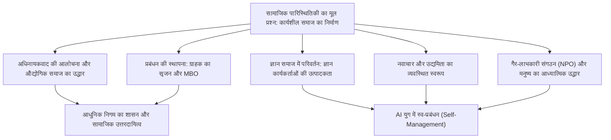
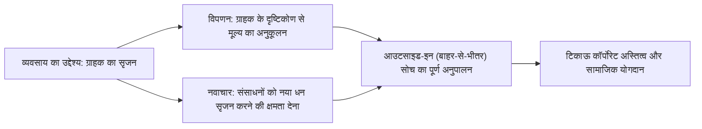
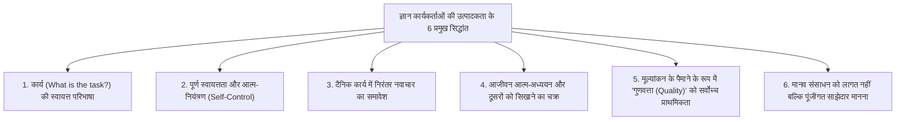
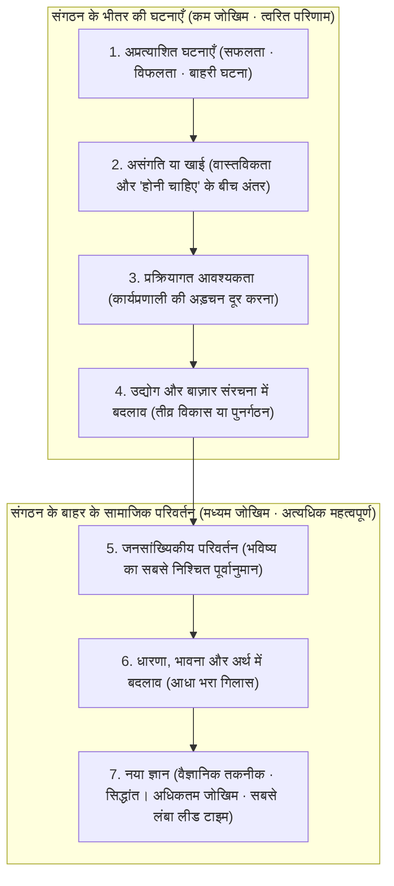

## 1. प्रस्तावना: 20वीं सदी की महानतम बौद्धिक विभूति पीटर ड्रकर का दायरा

### 1.1 "प्रबंधन के जनक" की उपाधि का संकुचित दायरा और "सामाजिक पारिस्थितिकी विज्ञानी" के रूप में उनका मूल स्वरूप

पीटर एफ. ड्रकर (Peter Ferdinand Drucker, 1909–2005) का नाम दुनिया भर में "आधुनिक प्रबंधन के जनक (Father of Modern Management)" के रूप में विख्यात है। फिर भी, उन्होंने आजीवन इस प्रकार की उपाधियों को कभी पसंद नहीं किया। जीवन भर ड्रकर ने स्वयं को जिस अनूठी संज्ञा से परिभाषित किया, वह थी: **"सामाजिक पारिस्थितिकी विज्ञानी (Social Ecologist)"**।

जिस प्रकार जीवविज्ञान में पारिस्थितिकी (Ecology) वनस्पतियों और जीवों तथा उनके आस-पास के वातावरण के बीच होने वाली अंतःक्रियाओं और गतिशील संतुलन का अध्ययन व अवलोकन करती है, ठीक उसी प्रकार सामाजिक पारिस्थितिकी वह विज्ञान है जो यह अध्ययन करता है कि मनुष्य द्वारा स्वयं निर्मित सामाजिक परिवेश—जैसे व्यवसाय, सरकार, विश्वविद्यालय, अस्पताल, चर्च और परिवार जैसे विभिन्न संगठनों और संस्थाओं—के भीतर मनुष्य किस प्रकार जीता है, काम करता है, संबंध स्थापित करता है और सामाजिक व्यवस्था का निर्माण करता है।

ड्रकर के चिंतन का केंद्रबिंदु कभी भी केवल "कंपनियों के मुनाफे को अधिकतम करने की छोटी-मोटी तकनीकें" या "व्यावसायिक प्रशासन की दक्षता के साधन" नहीं रहे। उन्होंने लगातार जिस बुनियादी सवाल की पड़ताल की, वह अत्यंत नैतिक, दार्शनिक और मानवतावादी था: **"एक ऐसे कार्यशील समाज (a functioning society) का निर्माण कैसे किया जाए, जहाँ मनुष्य स्वतंत्रता और गरिमा बनाए रखते हुए जी सके?"** उन्होंने व्यापार और कॉर्पोरेट संगठनों के विश्लेषण में अपनी ऊर्जा इसलिए लगाई, क्योंकि 20वीं सदी में निगम (Corporation) ही समाज की प्रतिनिधि संस्था (Representative Institution) बन चुका था और लोगों के जीवन तथा पहचान को निर्धारित करने वाला सबसे बड़ा मंच बन गया था।

ड्रकर के लेखन को पढ़ने वाले आज के कई व्यावसायिक पेशेवर और शोधकर्ता अक्सर यह भूल जाते हैं कि उनका बौद्धिक सफर द्वितीय विश्व युद्ध से पहले के यूरोप में नाज़ीवाद के उभार को अपनी आँखों से देखने और हिटलर के अधिनायकवाद (Totalitarianism) का मुकाबला कैसे किया जाए—इस तीव्र राजनीतिक-दार्शनिक निराशा से शुरू हुआ था। इस लेख में, हम ड्रकर के पूरे जीवन और उनकी समग्र कृतियों में प्रवाहित होने वाले विचार-प्रवाहों का अनुगमन करेंगे और उनके द्वारा छोड़ी गई असीम बौद्धिक विरासत का गहन व विस्तृत विश्लेषण प्रस्तुत करेंगे।

---

### 1.2 वियना की संध्या, नाज़ीवाद का उभार, और अधिनायकवाद की आलोचना से उपजा संगठन सिद्धांत

ड्रकर के विचारों की पृष्ठभूमि को समझने के लिए, उस बौद्धिक माहौल को समझना आवश्यक है जिसमें वे पले-बढ़े—हैब्सबर्ग साम्राज्य के अंतिम दिनों का वियना। 1909 में ऑस्ट्रो-हंगेरियन साम्राज्य की राजधानी वियना के एक संपन्न बौद्धिक परिवार में जन्मे ड्रकर के घर में उस दौर के यूरोप के शीर्ष विचारक—जैसे फ्रायड, शुम्पीटर, मिज़ेस और हायेक—नियमित रूप से एकत्रित होते थे।

किंतु, प्रथम विश्व युद्ध के छिड़ने के साथ ही हैब्सबर्ग साम्राज्य ढह गया, और 1920 तथा 1930 के दशकों में यूरोपीय समाज अभूतपूर्व आध्यात्मिक व सामाजिक पतन के दौर से गुज़रा। पारंपरिक वर्ग व्यवस्था और धार्मिक सत्ता बिखर गई, और व्यक्ति अपने पारंपरिक समुदायों से कटकर अलग-थलग असहाय जनसमूह में तब्दील हो गए। इसके ऊपर 1929 की महामंदी (Great Depression) ने हमला बोला, जिससे पूंजीवाद के मुक्त बाज़ार और बुर्जुआ लोकतंत्र के प्रति गहरी निराशा फैल गई।

इस विराट आध्यात्मिक शून्य और हताशा से दो महा-अधिनायकवादी शक्तियों का उदय हुआ: हिटलर का राष्ट्रीय समाजवाद (नाज़ीवाद) और स्टालिन का साम्यवाद। फ्रैंकफर्ट से कानून में डॉक्टरेट की उपाधि प्राप्त करने के बाद एक पत्रकार के रूप में कार्यरत युवा ड्रकर ने जर्मनी को तेज़ी से नाज़ीवाद के अंधेरे में समाते हुए साक्षात देखा। 1933 में हिटलर के सत्ता में आने के तुरंत बाद, ड्रकर जर्मनी छोड़कर इंग्लैंड और फिर 1937 में संयुक्त राज्य अमेरिका में शरणार्थी के रूप में चले गए।

ड्रकर की दृष्टि में, फासीवाद और अधिनायकवाद महज़ कोई सैन्य या राजनीतिक पागलपन नहीं थे, बल्कि वे **"आधुनिक पश्चिमी समाज द्वारा मनुष्य को वैध सामाजिक स्थिति (Status) और कार्य/भूमिका (Function) प्रदान करने में विफलता के परिणामस्वरूप पैदा हुआ एक हताश और विकृत विद्रोह"** थे। अतः, अधिनायकवाद को जड़ से समाप्त करने के लिए केवल सैन्य रूप से परास्त करना पर्याप्त नहीं था; एक नए "गैर-अधिनायकवादी मुक्त समाज" की रचना करना आवश्यक था जहाँ प्रत्येक नागरिक को समाज में एक सुदृढ़ स्थान और भूमिका मिले, और जहाँ वह आत्म-सम्मान तथा गरिमा का अनुभव कर सके। यही मार्मिक उद्देश्यबोध वह वास्तविक प्रेरक शक्ति था जिसने ड्रकर को "संगठन और प्रबंधन" के गहन अन्वेषण की ओर अग्रसर किया।

---

## 2. ड्रकर के चिंतन का मूल आधार: अधिनायकवाद की निराशा और औद्योगिक समाज का उद्धार

### 2.1 『द एंड ऑफ इकोनॉमिक मैन』 (The End of Economic Man, 1939) ― मार्क्सवाद और पूंजीवाद की सीमाएँ, फासीवाद की विकृति

1939 में अपने निर्वासन के दौरान ड्रकर ने अपनी पहली ऐतिहासिक पुस्तक *The End of Economic Man: The Origins of Totalitarianism* (द एंड ऑफ इकोनॉमिक मैन: अधिनायकवाद की उत्पत्ति) प्रकाशित की। तीस वर्ष से भी कम उम्र के एक अज्ञात युवक द्वारा लिखी गई इस कृति की विंस्टन चर्चिल ने भूरि-भूरि प्रशंसा की और इसे ब्रिटिश सैन्य अधिकारियों के लिए अनिवार्य पठन सामग्री घोषित किया गया।

इस पुस्तक में, ड्रकर ने नाज़ीवाद के सारतत्व को किसी "तर्कसंगत बुराई" के रूप में नहीं, बल्कि "तर्कसंगत आशाओं के निराशा में बदलने के बाद आने वाले एक जादुई और अंध विश्वास" के रूप में विश्लेषित किया। 18वीं शताब्दी से आधुनिक पश्चिमी समाज "आर्थिक मनुष्य (Economic Man)" की मानवीय अवधारणा पर आधारित था। पूंजीवाद ने वादा किया था कि "बाज़ार में व्यक्तियों द्वारा आर्थिक लाभ की स्वतंत्र खोज अदृश्य हाथ (Invisible Hand) के ज़रिए पूरे समाज में सद्भाव और समृद्धि लाएगी", जबकि मार्क्सवाद ने वादा किया था कि "सर्वहारा क्रांति द्वारा वर्ग भेद की समाप्ति वास्तव में स्वतंत्र और समान मनुष्यों के समाज का निर्माण करेगी"।

किंतु, पूंजीवाद का वास्तविक परिणाम पुरानी बेरोज़गारी, असमानता और महामंदी की त्रासदी था, जबकि साम्यवाद का परिणाम रक्तरंजित तानाशाही और गुलाग (यातना शिविर) थे। जब दोनों मिथक एक साथ ध्वस्त हो गए, तो पश्चिमी समाज एक गहरे शून्य (Nihilism) के रसातल में गिर गया—यह अहसास कि "न तो आर्थिक स्वतंत्रता और न ही आर्थिक समानता मनुष्य की खुशी या मानवीय गरिमा की गारंटी दे सकती है"।

फासीवाद ने इसी शून्यता का फायदा उठाया। फासीवाद ने आर्थिक तर्कसंगतता और आर्थिक स्वतंत्रता को खुले तौर पर नकार दिया, और सैन्य पदानुक्रम, नस्लीय श्रेष्ठता के मिथक तथा राज्य-सर्वोपरिता के अतार्किक जादू का सहारा लेकर हताश जनसमूह को "अर्थ" और "अपनेपन की भावना" प्रदान की। ड्रकर ने दो टूक शब्दों में कहा: केवल फासीवाद को नकारने से समाज का पुनरुत्थान नहीं हो सकता। हमें एक ऐसी "नई सामाजिक व्यवस्था" का निर्माण करना होगा जो आर्थिक तार्किकता को समाहित करते हुए भी, मात्र वित्तीय लाभ से परे जाकर मनुष्य को गरिमापूर्ण नागरिक अस्तित्व प्रदान कर सके।

---

### 2.2 『द फ्यूचर ऑफ इंडस्ट्रियल मैन』 (The Future of Industrial Man, 1942) ― मनुष्य को सामाजिक स्थिति (Status) और कार्य (Function) देने वाला समुदाय

इसके बाद 1942 में, अमेरिका के द्वितीय विश्व युद्ध में प्रवेश के समय प्रकाशित अपनी पुस्तक *The Future of Industrial Man* (द फ्यूचर ऑफ इंडस्ट्रियल मैन) में ड्रकर ने युद्धोपरांत समाज का एक खाका प्रस्तुत किया।

इस पुस्तक के दो केंद्रीय स्तंभ थे: **"वैध सत्ता (Legitimate Power)"** और व्यक्ति की **"सामाजिक स्थिति (Status)"** तथा **"कार्य/भूमिका (Function)"**। एक स्वस्थ और स्वतंत्र समाज के बने रहने के लिए निम्नलिखित दो शर्तें पूरी होनी अनिवार्य हैं:

1. **वैध सत्ता**: समाज पर शासन करने वाली सत्ता को समुदाय के सदस्यों द्वारा नैतिक अधिकार और औचित्य से युक्त स्वीकार किया जाना चाहिए।
2. **स्थिति और कार्य**: प्रत्येक सदस्य का समाज में एक स्पष्ट स्थान (स्थिति) होना चाहिए और समाज के साझा कल्याण (Common Good) में अपना अनूठा योगदान देने की एक सार्थक भूमिका (कार्य) होनी चाहिए।

19वीं शताब्दी तक के कृषि प्रधान और प्रारंभिक वाणिज्यिक समाज में, परिवार, ग्रामीण समुदाय और गिल्ड (व्यावसायिक संघ) व्यक्ति की स्थिति और कार्य की गारंटी देते थे। किंतु दूसरी औद्योगिक क्रांति के साथ जब विशाल कारखानों और बड़े निगमों का समाज में वर्चस्व स्थापित हुआ, तो पारंपरिक समुदाय छिन्न-भिन्न हो गए। कारखाने के श्रमिक विशाल उत्पादन तंत्र के प्रतिस्थापनीय पुर्ज़े बनकर रह गए और सामाजिक लाचारी व अलगाव से ग्रस्त हो गए।

ड्रकर ने दूरदर्शिता से चेतावनी दी: **"यदि आधुनिक औद्योगिक उद्यम केवल धन पैदा करने वाले आर्थिक तंत्र बने रहे और काम करने वाले लोगों को सामाजिक स्थिति और कार्य प्रदान करने वाले 'मानवीय समुदाय' में रूपांतरित नहीं हुए, तो स्वतंत्र समाज एक बार फिर अधिनायकवाद के पिशाच के मुंह में चला जाएगा।"** यहाँ उन्होंने यह क्रांतिकारी विचार रखा कि कंपनी कारखाने के मालिक की निजी संपत्ति होने से पहले, एक स्वायत्त शासी संस्था (Government) है जिस पर सार्वजनिक सामाजिक उत्तरदायित्व का भार है।

---

### 2.3 『कॉन्सेप्ट ऑफ द कॉर्पोरेशन』 (Concept of the Corporation, 1946) ― जनरल मोटर्स (GM) का आंतरिक अध्ययन और आधुनिक विशाल संगठन का विश्लेषण

1943 में ड्रकर के पास एक अभूतपूर्व निमंत्रण आया। उस समय दुनिया की सबसे बड़ी विनिर्माण कंपनी और पूंजीवाद के शिखर पर स्थित जनरल मोटर्स (General Motors - GM) के शीर्ष प्रबंधन ने उनसे अनुरोध किया कि वे बाहर से आकर "कंपनी की प्रबंधन संरचना और संगठनात्मक संचालन की समग्र कार्यप्रणाली का गहन अध्ययन और विश्लेषण करें"।

ड्रकर ने 18 महीनों तक जीएम के मुख्यालय में समय बिताया। उन्होंने मुख्य कार्यकारी अधिकारी अल्फ्रेड स्लोअन (Alfred P. Sloan) सहित शीर्ष अधिकारियों, संयंत्र प्रबंधकों, इंजीनियरों और असेंबली लाइन के आम श्रमिकों के अनगिनत साक्षात्कार लिए और प्रबंधन बैठकों में भाग लिया। इस अध्ययन के परिणाम स्वरूप 1946 में प्रबंधन साहित्य की युगांतरकारी कृति *Concept of the Corporation* (कॉन्सेप्ट ऑफ द कॉर्पोरेशन) सामने आई।

यह पुस्तक मानव इतिहास की पहली ऐसी कृति थी जिसने आधुनिक बड़े निगम को मात्र एक "आर्थिक इकाई" के रूप में नहीं, बल्कि **"समाज की मूल घटक के रूप में एक राजनीतिक और सामाजिक संस्था"** के रूप में देखा। ड्रकर ने भाँप लिया कि जीएम की अद्भुत सफलता का रहस्य स्लोअन द्वारा विकसित **"प्रभागीय प्रणाली (Decentralization: विकेंद्रीकृत प्रबंधन)"** में निहित था। केंद्रीय सैन्यवादी नियंत्रण के बजाय, स्वायत्त डिवीजनों को अधिकार सौंपकर और उन्हें बाज़ार की प्रतिस्पर्धा तथा प्रबंधकीय उत्तरदायित्व सौंपकर, जीएम एक विशाल संगठन होते हुए भी लचीलापन और स्वायत्तता बनाए रखने में सफल रहा था।

---

### 2.4 स्लोअन के साथ वैचारिक मतभेद: जीएम की शीर्ष-से-नीचे तर्कसंगतता बनाम मानवीय स्वायत्त संगठन सिद्धांत

हालाँकि, *Concept of the Corporation* के प्रकाशन के बाद जीएम के भीतर भारी विरोध खड़ा हो गया। अल्फ्रेड स्लोअन और जीएम के अन्य शीर्ष अधिकारियों ने ड्रकर द्वारा सुझाए गए मानवतावादी प्रस्तावों—जैसे "श्रमिकों को अधिकार सौंपना", "स्व-प्रबंधित टीमें", "संयंत्र समुदाय की स्वायत्तता", "श्रमिकों की गरिमा और आजीवन रोज़गार के अवसरों की खोज"—को सिरे से खारिज कर दिया।

स्लोअन की नज़र में कॉर्पोरेशन अत्यधिक तर्कसंगत "पूंजी, तकनीक और श्रम को संयोजित करने वाली एक सटीक मशीन" मात्र था, और श्रमिक अनुबंध के आधार पर वेतन के बदले श्रम बेचने वाली महज़ एक आर्थिक इकाई थे। स्लोअन ने ड्रकर की सिफारिशों को "भावुक समाजवादी कल्पना" मानकर खारिज कर दिया और कंपनी के भीतर ड्रकर की किताब पर व्यावहारिक रूप से प्रतिबंध लगा दिया (विडंबना यह रही कि जीएम की प्रतिस्पर्धी कंपनी फोर्ड मोटर के हेनरी फोर्ड द्वितीय ने इस किताब को चाव से पढ़ा और फोर्ड के चमत्कारी पुनरुद्धार में इसके सिद्धांतों को लागू किया)।

स्लोअन के साथ इस टकराव ने ड्रकर के भावी चिंतन की दिशा तय कर दी। ड्रकर ने कॉर्पोरेट जगत के शीर्ष-से-नीचे (Top-down) नौकरशाही नियंत्रण और केवल संख्या-आधारित प्रबंधन की संकीर्णता को अस्वीकार कर दिया, और अपना पूरा जीवन **"मानवीय संभावनाओं और आत्म-नियंत्रण पर भरोसा करने वाले स्वायत्त, विकेंद्रीकृत प्रबंधन"** की खोज में समर्पित कर दिया।

---

## 3. "प्रबंधन" का जन्म और उसका मूल सैद्धांतिक ढांचा

### 3.1 『द प्रैक्टिस ऑफ मैनेजमेंट』 (The Practice of Management, 1954) द्वारा स्थापित अनुशासन

1954 में ड्रकर ने अपनी युगांतरकारी पुस्तक *The Practice of Management* (द प्रैक्टिस ऑफ मैनेजमेंट) प्रकाशित की। इस कृति के माध्यम से विश्व में पहली बार "प्रबंधन (Management)" को एक व्यवस्थित शैक्षणिक विषय और अनुशासन (Discipline) के रूप में प्रतिष्ठा मिली। उससे पहले तक व्यवसाय प्रबंधन को जन्मजात प्रतिभा संपन्न उद्यमियों की व्यक्तिगत अंतःप्रेरणा, करिश्माई नेतृत्व या वित्तीय बही-खातों की गणना का कौशल मात्र माना जाता था। ड्रकर ने प्रबंधन को "सीखे जा सकने वाले, महारत हासिल किए जा सकने वाले और अभ्यास में लाए जा सकने वाले व्यवस्थित ज्ञान" के रूप में रूपांतरित कर दिया।

ड्रकर ने प्रबंधन की तीन सार्वभौमिक भूमिकाओं को इस प्रकार सूत्रबद्ध किया:

1. **अपने संगठन के विशिष्ट उद्देश्य और मिशन को पूरा करना**: एक व्यावसायिक उद्यम के लिए आर्थिक परिणाम प्राप्त करना, अस्पताल के लिए रोगियों को स्वस्थ करना, विश्वविद्यालय के लिए ज्ञान की खोज और शिक्षण प्रदान करना।
2. **कार्य को उत्पादक बनाना और काम करने वाले लोगों को उपलब्धि हासिल करने योग्य बनाना**: मानव क्षमताओं का अधिकतम उपयोग करना और कार्य के माध्यम से गरिमा तथा व्यक्तिगत विकास प्रदान करना।
3. **समाज पर संगठन के प्रभावों (Impacts) का प्रबंधन करना और सामाजिक समस्याओं में योगदान देना**: संगठन की गतिविधियों द्वारा समाज को प्रदूषित या क्षतिग्रस्त होने से रोकना और एक अच्छे कॉर्पोरेट नागरिक के रूप में कार्य करना।

ये तीनों भूमिकाएं एक-दूसरे से अविभाज्य हैं, और प्रबंधन को हमेशा इन तीनों के बीच निरंतर गतिशील संतुलन बनाए रखना होता है।

---

### 3.2 व्यवसाय का उद्देश्य "ग्राहक का सृजन" करना है: विपणन (मार्केटिंग) और नवाचार का द्वैत

ड्रकर के प्रबंधन दर्शन में सबसे प्रसिद्ध और साथ ही सबसे अधिक गलत समझा जाने वाला विचार "व्यवसाय के उद्देश्य" की उनकी परिभाषा है। ड्रकर स्पष्ट रूप से घोषित करते हैं:

> **"व्यवसाय के उद्देश्य की केवल एक ही वैध परिभाषा है: ग्राहक का सृजन करना (There is only one valid definition of business purpose: to create a customer)।"**

अधिकांश व्यवसायी और अर्थशास्त्री यह मानते हैं कि "व्यवसाय का उद्देश्य लाभ को अधिकतम करना है"। परंतु ड्रकर के अनुसार, लाभ व्यवसाय का "उद्देश्य" नहीं है, बल्कि यह व्यवसाय के जीवित रहने और भविष्य की अनिश्चितताओं तथा जोखिमों से निपटने की एक अनिवार्य "शर्त (Condition)" या "सीमा (Limitation)" मात्र है। यह बिल्कुल वैसा ही है जैसे हृदय का धड़कना और ऑक्सीजन ग्रहण करना मानव जीवन के बने रहने की शर्त है, परंतु सांस लेना ही मानव जीवन का परम उद्देश्य नहीं हो सकता।

यदि ग्राहक न हो, तो कोई भी व्यवसाय रातों-रात लुप्त हो जाएगा। ग्राहक प्रकृति में स्वतः विद्यमान नहीं होते; उन्हें व्यवसाय की गतिविधियों द्वारा ही पहचाना और सृजित किया जाता है। और ग्राहक का सृजन करने के लिए किसी भी व्यावसायिक संगठन के पास मूल रूप से **केवल दो बुनियादी कार्य (Basic Functions)** होते हैं:

1. **विपणन (Marketing)**: ग्राहक की वास्तविक आवश्यकताओं, उसकी वास्तविकताओं और उसके मूल्यों को गहराई से समझना, और उत्पादों या सेवाओं को पूरी तरह से ग्राहक के अनुकूल बनाना। "उत्कृष्ट विपणन वह है जो बिक्री (Selling) के प्रयास को अनावश्यक बना दे।"
2. **नवाचार (Innovation)**: मौजूदा संसाधनों को धन पैदा करने की नई क्षमता प्रदान करना। निरंतर नए आर्थिक और सामाजिक मूल्य की पेशकश करते रहना।

मार्केटिंग और इनोवेशन के अलावा किसी भी कंपनी की अन्य सभी गतिविधियाँ (मानव संसाधन, वित्त, लेखा, खरीद, रसद आदि) इन दो प्रमुख कार्यों को सहारा देने वाली लागत (Cost) मात्र हैं। वास्तविक लाभ का स्रोत केवल संगठन के बाहर—"ग्राहक की संतुष्टि" में निहित है।

---

### 3.3 उद्देश्यों और आत्म-नियंत्रण द्वारा प्रबंधन (MBO: Management by Objectives and Self-Control) की वास्तविकता

ड्रकर द्वारा *The Practice of Management* में प्रतिपादित सबसे क्रांतिकारी अवधारणाओं में से एक थी: **"उद्देश्यों और आत्म-नियंत्रण द्वारा प्रबंधन (Management by Objectives and Self-Control: MBO)"**।

आज विश्व भर के बड़े निगमों में "MBO" नामक मूल्यांकन प्रणाली लागू है। परंतु जैसा कि ड्रकर ने अपने जीवन के अंतिम वर्षों में अत्यंत दुःख के साथ व्यक्त किया, **आधुनिक कंपनियों में प्रचलित 99% MBO प्रणालियाँ ड्रकर की मूल भावना के सर्वथा विपरीत "टारगेट/कोटा प्रबंधन के उत्पीड़नकारी औज़ार" में तब्दील हो चुकी हैं**।

ड्रकर द्वारा प्रतिपादित MBO का वास्तविक सार इसके दूसरे भाग में निहित है—**"आत्म-नियंत्रण (Self-Control)"**। पारंपरिक प्रबंधन पद्धति "बाह्य नियंत्रण (External Control)" पर आधारित थी, जहाँ वरिष्ठ अधिकारी subordinates पर लक्ष्य थोपते थे, उनकी निगरानी करते थे और दंड व पुरस्कार के ज़रिए उन्हें नियंत्रित करते थे। यह मनुष्य को एक निष्क्रिय मशीन मानने वाले टेलरवाद (Taylorism) का ही अवशेष था।

इसके विपरीत, ड्रकर का MBO निम्नलिखित प्रक्रिया की मांग करता है:

1. संपूर्ण संगठन के साझा लक्ष्यों और मिशन को प्रत्येक सदस्य गहराई से समझे और आत्मसात करे।
2. प्रत्येक कार्यकर्ता यह स्वयं सोचे कि उस समग्र लक्ष्य की प्राप्ति में "वह व्यक्तिगत रूप से क्या योगदान दे सकता है", और अपने स्वयं के विवेक से अपने लक्ष्य निर्धारित करे।
3. अपने काम के परिणामों को मापने के लिए आवश्यक वस्तुनिष्ठ जानकारी और फीडबैक वरिष्ठ अधिकारी के बजाय **स्वयं कार्यकर्ता को सीधे प्राप्त होने वाला परिवेश** तैयार किया जाए।
4. कार्यकर्ता अपनी प्रगति का स्वयं नियंत्रण करे और स्वायत्त रूप से अपनी दिशा में सुधार करे।

MBO वरिष्ठों के नियंत्रण को कड़ा करने का साधन नहीं है, बल्कि **"बाहरी नियंत्रण और आदेशों को अनावश्यक बनाकर प्रत्येक व्यक्ति को एक स्वायत्त पेशेवर के रूप में मुक्त करने का दर्शन"** है। ड्रकर का दृढ़ विश्वास था कि आंतरिक प्रेरणा (Intrinsic Motivation) और आत्म-उत्तरदायित्व पर आधारित स्वायत्तता ही मानवीय गरिमा को बढ़ाती है और संगठन को सर्वश्रेष्ठ परिणाम प्रदान करती है।

---

### 3.4 परिणामों (Results) की परिभाषा और संसाधन आवंटन: उद्यम के 8 प्रमुख क्षेत्र

ड्रकर ने उद्यम की गतिविधियों का मूल्यांकन केवल एक ही पैमाने (जैसे बिक्री या त्रैमासिक लाभ) के आधार पर करने के विरुद्ध कड़ी चेतावनी दी थी। किसी व्यवसाय के स्वस्थ रहने और समाज में निरंतर योगदान देने के लिए निम्नलिखित **8 प्रमुख परिणाम क्षेत्रों (Key Result Areas)** में संतुलित लक्ष्य निर्धारित और ट्रैक किए जाने चाहिए:

| क्षेत्र | विवरण और महत्व |
| :--- | :--- |
| **1. विपणन (Marketing)** | मौजूदा बाज़ार में हिस्सेदारी ही नहीं, बल्कि नए बाज़ारों का निर्माण और ग्राहक सृजन का पैमाना। |
| **2. नवाचार (Innovation)** | केवल उत्पादों और सेवाओं में ही नहीं, बल्कि संगठनात्मक संरचना, व्यावसायिक प्रक्रियाओं और बिज़नेस मॉडल में नवाचार। |
| **3. मानव संसाधन और संगठनात्मक क्षमता** | कर्मचारियों का कौशल विकास, उनका मनोबल, भावी नेतृत्व का निर्माण और टीमों की स्वायत्तता। |
| **4. वित्तीय संसाधन** | आवश्यक निवेश पूंजी जुटाने की क्षमता, नकदी प्रवाह (Cash Flow) की सुदृढ़ता और पूंजी का इष्टतम आवंटन। |
| **5. भौतिक संसाधन** | कारखानों, उपकरणों, कार्यालयों और आईटी बुनियादी ढांचे जैसे उत्पादन साधनों की दक्षता और आधुनिकता। |
| **6. उत्पादकता (Productivity)** | लगाए गए संसाधनों (श्रम, पूंजी, समय, कच्चा माल) से उत्पन्न होने वाले मूल्य-संवर्धन (Value Added) का अनुपात। |
| **7. सामाजिक उत्तरदायित्व** | स्थानीय समुदाय, पर्यावरण, कानूनी नियमों और नैतिक मानकों के प्रति ईमानदारी और सक्रिय योगदान। |
| **8. आवश्यक लाभ (Profitability)** | उपरोक्त 7 लक्ष्यों को प्राप्त करने और भविष्य के जोखिमों को कवर करने के लिए अपरिहार्य लाभ का स्तर। |

ड्रकर के प्रबंधन दर्शन का निचोड़ इस सूत्र में समाहित है: **"लाभ कोई उद्देश्य नहीं, बल्कि एक अनिवार्य शर्त है"**। लाभ पिछली कार्रवाइयों का रिपोर्ट कार्ड होने के साथ-साथ भविष्य की अनिश्चितता के जोखिम की लागत चुकाने वाला "व्यावसायिक निरंतरता बीमा" है।

---

## 4. ज्ञान समाज का पूर्वाभास और "ज्ञान कार्यकर्ता (Knowledge Worker)" का प्रादुर्भाव

### 4.1 『द एज ऑफ डिस्कंटिन्यूटी』 (1969) से 『पोस्ट-कैपिटलिस्ट सोसाइटी』 (1993) तक

ड्रकर की अनेक भविष्यवाणियों में से जिस विचार ने इतिहास पर सबसे गहरा प्रभाव डाला, वह था "ज्ञान समाज (Knowledge Society)" के आगमन का पूर्वाभास। 1959 की अपनी पुस्तक *Landmarks of Tomorrow* (कल के मील के पत्थर) में ड्रकर ने मानव इतिहास में पहली बार **"ज्ञान कार्यकर्ता (Knowledge Worker)"** शब्द का प्रयोग किया था।

तत्पश्चात 1969 की अपनी ऐतिहासिक कृति *The Age of Discontinuity* (द एज ऑफ डिस्कंटिन्यूटी) में उन्होंने स्पष्ट देखा कि औद्योगिक क्रांति के बाद से चली आ रही आर्थिक संरचना में एक बुनियादी भूगर्भीय बदलाव आ रहा है। पारंपरिक अर्थशास्त्र धन के तीन उत्पादन कारक मानता आया था: "भूमि (प्राकृतिक संसाधन)", "श्रम (शारीरिक श्रम)", और "पूंजी (कारखाने व मशीनें)"। किंतु ड्रकर ने प्रतिपादित किया कि 20वीं सदी के उत्तरार्ध से ये पारंपरिक कारक गौण होते जा रहे हैं और एक ऐसा नया युग आ चुका है जहाँ **"ज्ञान (Knowledge) ही एकमात्र सार्थक उत्पादन कारक"** बन गया है।

1993 की अपनी कृति *Post-Capitalist Society* (पोस्ट-कैपिटलिस्ट सोसाइटी) में ड्रकर ने इस अंतर्दृष्टि को और गहराई दी। पूंजीवादी समाज में सत्ता पूंजी के स्वामियों (बुर्जुआ/पूंजीपतियों) के हाथों में थी, किंतु ज्ञान समाज में वास्तविक पूंजी "काम करने वाले मनुष्यों के मस्तिष्क में मौजूद ज्ञान" है। चूंकि ज्ञान कार्यकर्ता उत्पादन के साधनों (अपनी बुद्धि और विशेषज्ञता) को अपने सिर में लेकर कार्यस्थल बदलते हैं, इसलिए इतिहास में पहली बार संगठन और कार्यकर्ता के बीच शक्ति संतुलन पूरी तरह उलट गया।

---

### 4.2 शारीरिक श्रम (टेलरवाद) से ज्ञान श्रम की ओर ऐतिहासिक परिवर्तन

20वीं सदी का सबसे बड़ा आर्थिक चमत्कार फ्रेडरिक विंसलो टेलर (Frederick Winslow Taylor) द्वारा शुरू किए गए "वैज्ञानिक प्रबंधन" के ज़रिए **शारीरिक श्रमिकों की उत्पादकता में लगभग 50 गुना वृद्धि** होना था। टेलर ने कारीगरों के अनुभव और अंतर्ज्ञान पर आधारित शारीरिक कार्यों का विस्तृत समय और गति अध्ययन (Time and Motion Study) किया, और कार्यों को बुनियादी घटकों में विभाजित कर पुनर्गठित किया। इस उत्पादकता क्रांति ने बड़े पैमाने पर उत्पादन और बड़े पैमाने पर उपभोग वाले समृद्ध मध्यम वर्ग के समाज को जन्म दिया और विकसित देशों को मार्क्सवादी क्रांति के खतरे से बचाया।

किंतु ड्रकर ने आगाह किया: "यदि 20वीं सदी के प्रबंधन का सबसे बड़ा योगदान शारीरिक श्रम की उत्पादकता बढ़ाना था, तो **21वीं सदी के प्रबंधन के सामने सबसे बड़ी चुनौती ज्ञान श्रम की उत्पादकता को बढ़ाना है**।"

शारीरिक श्रम और ज्ञान श्रम के बीच निर्णायक और मौलिक अंतर मौजूद हैं:

| विशेषता | शारीरिक श्रम (Manual Work) | ज्ञान श्रम (Knowledge Work) |
| :--- | :--- | :--- |
| **कार्य की परिभाषा** | कार्य पूर्व-निर्धारित होता है और उस पर कोई संदेह नहीं होता (उदा. लोहे के गर्डर ढोना, पेंच कसना)। | **"कार्य क्या है? इसे किस उद्देश्य से किया जाना चाहिए?"** यह स्वयं परिभाषित करना पड़ता है। |
| **स्वायत्तता** | कार्यप्रणाली का निष्ठापूर्वक पालन करना गुण माना जाता है; बाहरी सख्त नियंत्रण होता है। | **स्वायत्तता (Autonomy)** अनिवार्य है; बिना आत्म-नियंत्रण के परिणाम असंभव हैं। |
| **निरंतर नवाचार** | नवाचार विशेषज्ञ इंजीनियरों या प्रक्रिया डिजाइनरों द्वारा किया जाता है। | ज्ञान कार्यकर्ता को अपने दैनिक कार्य के भीतर स्वयं **निरंतर नवाचार** को शामिल करना होता है। |
| **सीखना और सिखाना** | एक बार कौशल सीखने के बाद बार-बार अभ्यास से दक्षता बढ़ती है। | ज्ञान बहुत तेज़ी से अप्रचलित होता है; **आजीवन निरंतर सीखने और सिखाने** की आवश्यकता होती है। |
| **मूल्यांकन का पैमाना** | मुख्य रूप से **"मात्रा (Quantity)"** (प्रति घंटा कितनी इकाइयों का उत्पादन हुआ)। | मुख्य रूप से **"गुणवत्ता (Quality)"** (कितनी गहरी अंतर्दृष्टि या प्रभावी समाधान प्राप्त हुआ)। |
| **उत्पादन साधनों का स्वामित्व** | कारखाने, मशीनें और उपकरण **पूंजीपति के स्वामित्व** में होते हैं। | उत्पादन के साधन (ज्ञान, निर्णय क्षमता) **कार्यकर्ता के मस्तिष्क** में होते हैं। |

ज्ञान कार्य में "कड़ी मेहनत और लंबे समय तक काम करना" किसी भी परिणाम की गारंटी नहीं देता। यदि प्रश्न ही गलत हो, तो चाहे कितनी भी कुशलता से सही उत्तर खोजा जाए, वह पूरी तरह व्यर्थ है। ज्ञान कार्य में उत्पादकता वृद्धि टेलरवादी निगरानी या दक्षता उपकरणों से कभी हासिल नहीं हो सकती; इसके लिए प्रबंधन के मूलभूत प्रतिमान में बदलाव (Paradigm Shift) की आवश्यकता है।

---

### 4.3 ज्ञान कार्यकर्ताओं की उत्पादकता निर्धारित करने वाले 6 प्रमुख सिद्धांत

ड्रकर ने *Management Challenges for the 21st Century* (मैनेजमेंट चैलेंजेस फॉर द 21स्ट सेंचुरी, 1999) में ज्ञान कार्यकर्ताओं की उत्पादकता बढ़ाने के लिए छह अनिवार्य शर्तों को सूत्रबद्ध किया:

1. **"कार्य क्या है?" यह लगातार पूछते रहना**: ज्ञान कार्य में सबसे महत्वपूर्ण कदम यह परिभाषित करना है कि "वास्तव में क्या काम किया जाना चाहिए"। अनावश्यक काम को कुशलतापूर्वक करने से अधिक हानिकारक कुछ नहीं है।
2. **पूर्ण स्वायत्तता प्रदान करना**: ज्ञान कार्यकर्ताओं को स्वयं का प्रबंधन स्वयं करना चाहिए। स्वायत्तता ही जिम्मेदारी और व्यावसायिकता को जन्म देती है।
3. **कार्य में निरंतर नवाचार को समाहित करना**: अपने विशेषज्ञता के क्षेत्र में हमेशा नए तरीकों और मूल्यों की स्वतः खोज करते रहना।
4. **निरंतर सीखने और सिखाने का चक्र चलाना**: ज्ञान कार्यकर्ता को एक शिक्षार्थी होने के साथ-साथ दूसरों का शिक्षक (मेंटर) भी होना चाहिए। दूसरों को सिखाने से बेहतर अपने ज्ञान को व्यवस्थित और गहरा करने का कोई अन्य उपाय नहीं है।
5. **मात्रा के बजाय गुणवत्ता को सर्वोच्च प्राथमिकता देना**: सौ निरर्थक रिपोर्टों की तुलना में एक सटीक और मूलगामी विश्लेषण कंपनी के भाग्य का फैसला कर सकता है।
6. **ज्ञान कार्यकर्ता को "लागत" नहीं बल्कि "परिसंपत्ति (Asset)" मानना**: ज्ञान कार्यकर्ता को संगठन का पुर्ज़ा नहीं, बल्कि स्वेच्छा से अपनी बौद्धिक पूंजी का निवेश करने वाला "साझेदार (Partner)" माना जाना चाहिए।

---

### 4.4 "ज्ञान कार्यकर्ता को स्वयं अपना सीईओ होना चाहिए": स्व-प्रबंधन (Self-Management) का सिद्धांत

ज्ञान समाज का आगमन व्यक्ति के जीवन जीने के तौर-तरीकों में भी क्रांतिकारी बदलाव की मांग करता है। ड्रकर ने 1999 के अपने ऐतिहासिक निबंध *Managing Oneself* (स्वयं का प्रबंधन) में आधुनिक युग के सभी कामकाजी लोगों को एक गंभीर चेतावनी दी।

आधुनिक काल से पूर्व, मनुष्य का पेशा उसके जन्म के स्थान, सामाजिक वर्ग या पारिवारिक व्यवसाय से तय होता था। औद्योगिक समाज में भी, किसी बड़े निगम में प्रवेश करने पर कंपनी सेवानिवृत्ति तक करियर का मार्ग प्रशस्त कर देती थी। किंतु ज्ञान समाज में, **"अपने करियर की रूपरेखा स्वयं बनानी होगी, और अपने प्रदर्शन का प्रबंधन स्वयं करना होगा"**। आज जब औसत जीवन प्रत्याशा 80 वर्ष से अधिक हो चुकी है, वहीं कंपनियों की औसत आयु (लगभग 30 वर्ष) किसी व्यक्ति के कार्यशील जीवन की अवधि से बहुत कम हो गई है। प्रत्येक ज्ञान कार्यकर्ता को स्वयं को एक स्वतंत्र उद्यम (कंपनी ऑफ वन) के मुख्य कार्यकारी अधिकारी (CEO) के रूप में देखना होगा।

ड्रकर द्वारा प्रतिपादित स्व-प्रबंधन की व्यावहारिक तकनीकें इस प्रकार हैं:

#### ① अपनी ताकतों (Strengths) को पहचानना
ड्रकर के मानव दर्शन का सबसे महत्वपूर्ण मर्म यह अंतर्दृष्टि है: **"मनुष्य केवल अपनी ताकतों (शक्तियों) के बल पर ही परिणाम दे सकता है। कमज़ोरियों को दूर करने की कोशिश करके कोई परिणाम हासिल नहीं किया जा सकता।"**

पारंपरिक स्कूली शिक्षा और कॉर्पोरेट प्रशिक्षण किसी व्यक्ति की कमियों और कमज़ोरियों को ढूंढने और उन्हें औसत स्तर तक लाने में भारी ऊर्जा बर्बाद करते हैं। किंतु किसी अक्षमता को औसत दर्जे तक लाने में अत्यधिक श्रम लगता है, जबकि अपनी किसी प्रथम श्रेणी की ताकत को विश्वस्तरीय उत्कृष्टता में निखारने में कहीं कम प्रयास की आवश्यकता होती है।

अपनी वास्तविक ताकतों को खोजने के लिए ड्रकर ने एकमात्र विश्वसनीय विधि की वकालत की: **"फीडबैक विश्लेषण (Feedback Analysis)"**।
- जब भी आप कोई महत्वपूर्ण निर्णय लें या कोई महत्वपूर्ण कदम उठाएँ, **"उससे क्या परिणाम मिलने की उम्मीद है, उसे कागज़ पर लिख लें"**।
- 9 महीने या एक साल बाद, **वास्तविक परिणामों की तुलना अपने द्वारा लिखे गए अपेक्षित परिणामों से पूरी कठोरता से करें**।
- कुछ वर्षों तक इस प्रक्रिया को दोहराने से यह बात शीशे की तरह साफ हो जाएगी कि आप किस काम में माहिर हैं, आपकी कौन सी खूबियाँ परिणाम देती हैं, और आप किन चीज़ों में कमज़ोर हैं।

#### ② अपने काम करने के तौर-तरीके (How I Perform) को समझना
शक्तियों जितनी ही महत्वपूर्ण आपकी कार्यशैली और सीखने की संज्ञानात्मक पद्धति है:
- **क्या आप "पाठक (Reader)" हैं या "श्रोता (Listener)"?** (राष्ट्रपति आइजनहावर एक पाठक थे, इसलिए वे प्रेस कॉन्फ्रेंस में मौखिक सवालों के जवाब देते समय गलतियाँ कर बैठते थे, किंतु जब सवाल पहले से लिखित रूप में दिए जाने लगे, तो उन्होंने असाधारण प्रतिभा दिखाई। रूज़वेल्ट और ट्रूमैन इसके विपरीत ठेठ श्रोता थे)।
- **आप कैसे सीखते हैं?** (लिखकर सीखते हैं, बोलकर सीखते हैं, या व्यावहारिक कार्य करके सीखते हैं?)।
- **क्या आप निर्णयकर्ता (Decision Maker) के रूप में परिणाम देते हैं या सलाहकार (Adviser) के रूप में?** (ऐसे अनगिनत उदाहरण हैं जहाँ एक उत्कृष्ट नंबर-2 सलाहकार शीर्ष पद पर पहुँचते ही अनिर्णय का शिकार होकर बर्बाद हो गया)।

#### ③ जीवन के उत्तरार्ध (सेकंड करियर) की तैयारी
शारीरिक श्रमिक शरीर की थकान के साथ सेवानिवृत्त हो जाते हैं, किंतु ज्ञान कार्यकर्ता 40 के दशक के मध्य से 50 के दशक में अपने काम से ऊबने और "बर्नआउट (Burnout)" का शिकार होने लगते हैं। एक ही काम 20 साल तक करने के बाद नया सीखने को कुछ नहीं बचता और विकास रुक जाता है।

ड्रकर ने 40 वर्ष की आयु तक पहुँचने से पहले ही **"गतिविधि का दूसरा क्षेत्र (समानांतर करियर या गैर-लाभकारी गतिविधियाँ)"** विकसित करने की पुरज़ोर सिफारिश की। अपने मुख्य व्यवसाय से परे एक अलग दुनिया रखना—स्थानीय समुदाय, एनजीओ, अकादमिक जगत या स्वयंसेवी गतिविधियों में अपनी ताकतों का योगदान देने का मंच तैयार करना। यही वह एकमात्र सुरक्षा कवच है जो कंपनी में छंटनी या असफलता का सामना होने पर भी मनुष्य की आध्यात्मिक गरिमा की रक्षा करता है और जीवन के उत्तरार्ध को वास्तव में समृद्ध बनाता है।

---

## 5. नवाचार और उद्यमशीलता की व्यवस्थित प्रविधियाँ

### 5.1 『इनोवेशन एंड एंटरप्रेन्योरशिप』 (Innovation and Entrepreneurship, 1985)

अधिकांश लोग मानते हैं कि नवाचार "कुछ जीनियस या जुनूनी लोगों के दिमाग में आधी रात को अचानक कौंधने वाली बिजली" जैसा होता है। या फिर वे सोचते हैं कि भारी-भरकम शोध एवं विकास (R&D) बजट खर्च करके किसी क्रांतिकारी वैज्ञानिक खोज का इंतज़ार करना ही नवाचार है।

1985 में ड्रकर ने अपनी पुस्तक *Innovation and Entrepreneurship* (इनोवेशन एंड एंटरप्रेन्योरशिप) लिखी और नवाचार से जुड़े इस रूमानी भ्रम को पूरी तरह ध्वस्त कर दिया। ड्रकर के लिए नवाचार कोई प्रतिभा का चमत्कार नहीं, बल्कि **"एक व्यवस्थित और संगठनात्मक रूप से सीखा और अभ्यास किया जा सकने वाला अनुशासन (Discipline)"** है।

ड्रकर नवाचार को इस प्रकार परिभाषित करते हैं:
> **"नवाचार का अर्थ है संसाधनों को धन सृजन की नई क्षमता प्रदान करना। वस्तुतः, नवाचार से पहले कोई भी चीज़ 'संसाधन' होती ही नहीं है। जब तक मनुष्य उसका कोई उपयोग नहीं ढूंढ लेता और उसे आर्थिक मूल्य प्रदान नहीं करता, तब तक कोई भी पौधा महज़ एक खरपतवार है और कोई भी खनिज महज़ एक बेकार पत्थर।"**

19वीं सदी के मध्य में शोधन तकनीक और आंतरिक दहन इंजन (Internal Combustion Engine) के आविष्कार से पहले, पेट्रोलियम खेती की ज़मीन को दूषित करने वाला एक दुर्गंधयुक्त चिपचिपा तरल मात्र था। उसे अथाह संपदा पैदा करने वाले "संसाधन" में तब्दील करने वाली चीज़ स्वयं विज्ञान नहीं, बल्कि उसे सामाजिक ज़रूरतों से जोड़ने वाला नवाचार था।

---

### 5.2 "अचानक अंतःप्रेरणा" के मिथक का खंडन: नवाचार के 7 व्यवस्थित स्रोत

ड्रकर ने उन **"नवाचार के 7 स्रोतों (The Seven Sources for Innovative Opportunity)"** को व्यवस्थित किया जिनकी किसी भी उद्यम या संगठन को नियमित रूप से पड़ताल करनी चाहिए। इन्हें विश्वसनीयता के घटते क्रम और जोखिम के बढ़ते क्रम में व्यवस्थित किया गया है:

#### ① अप्रत्याशित घटनाएँ (The Unexpected)
सबसे कम जोखिम वाला, सबसे अधिक फलदायी, और फिर भी स्थापित कंपनियों द्वारा सबसे अधिक नज़रअंदाज़ किया जाने वाला स्रोत है: **"अप्रत्याशित सफलता (Unexpected Success)"** और **"अप्रत्याशित असफलता (Unexpected Failure)"**।
- **अप्रत्याशित सफलता**: जब आईबीएम (IBM) ने अपने शुरुआती मेनफ्रेम कंप्यूटर विकसित किए, तो वे वैज्ञानिक गणनाओं के लिए बनाए गए थे। किंतु आश्चर्यजनक रूप से, बैंकों और बीमा कंपनियों ने अपने क्लर्किकल कार्यों के लिए उन्हें हाथों-हाथ खरीदा। उस समय के प्रबंधन को लगा कि "यह तो मशीन का सही उपयोग नहीं है", किंतु आईबीएम ने इस अप्रत्याशित मांग पर अपनी पूरी ताकत झोंक दी और आधुनिक कंप्यूटर साम्राज्य की नींव रखी।
- कंपनियाँ अपनी मासिक बैठकों में घंटों तक "बजट से कम रहे लक्ष्यों (विफलताओं)" पर बहस करती हैं, और जो उत्पाद उम्मीद से कहीं अधिक बिक रहे होते हैं, उन्हें महज़ इत्तेफ़ाक मानकर टाल देती हैं। ड्रकर ने सलाह दी कि मासिक रिपोर्ट के पहले पन्ने पर केवल "अप्रत्याशित सफलताओं" का ब्यौरा होना चाहिए, और वहीं सबसे प्रतिभाशाली लोगों को तैनात किया जाना चाहिए।

#### ② असंगति या खाई (Incongruities)
"चीजें जैसी होनी चाहिए" की मान्यता या सिद्धांत और "ज़मीनी वास्तविकता" के बीच का अंतर।
- 1950 के दशक में, शिपिंग उद्योग जहाजों की गति बढ़ाने और ईंधन दक्षता सुधारने के लिए भारी निवेश कर रहा था, फिर भी उनका मुनाफा लगातार गिर रहा था। असली लागत का कारण "समुद्र में यात्रा" नहीं था, बल्कि बंदरगाह पर रुककर माल लादने और उतारने में लगने वाला "ठहराव का समय (Port Time)" था। इस असंगति को पहचानकर मैल्कम मैकलीन ने **"कंटेनर शिप (Containerization)"** की अवधारणा पेश की। जहाज़ की गति बदले बिना, ज़मीनी परिवहन और समुद्री परिवहन को मानकीकृत बक्शों (कंटेनरों) से जोड़कर लोडिंग का समय हफ्तों से घटाकर कुछ घंटों में ला दिया गया, जिसने वैश्विक व्यापार में क्रांति ला दी।

#### ③ प्रक्रियागत आवश्यकता (Process Need)
मौजूदा व्यावसायिक प्रक्रिया में किसी "लापता कड़ी (Missing Link)" या बाधा (Bottleneck) को दूर करने की तीव्र मांग।
- फोटो फिल्म की धुलाई की प्रक्रिया को समाप्त करने की आवश्यकता से जन्मा पोलरॉइड कैमरा, या लंबी दूरी की टेलीफोन कॉलों के कनेक्शन को स्वचालित करने के लिए इलेक्ट्रॉनिक एक्सचेंज का आविष्कार।

#### ④ उद्योग और बाज़ार संरचना में बदलाव (Industry and Market Structures)
जब कोई उद्योग प्रति वर्ष 10% से अधिक की दर से बढ़ता है, तो पारंपरिक संरचनाएं ध्वस्त हो जाती हैं और नए व पुराने खिलाड़ियों की अदला-बदली होती है।
- ऑटोमोबाइल उद्योग के उदय में वोल्वो का सुरक्षा तकनीकों पर ध्यान केंद्रित करना, या वित्तीय सुधारों (Financial Big Bang) के दौरान ऑनलाइन ब्रोकरेज कंपनियों का विस्फोट।

#### ⑤ जनसांख्यिकीय परिवर्तन (Demographics)
**"वह भविष्य जो पहले ही घटित हो चुका है (The Future that has already happened)"**—इसमें सबसे निश्चित और सबसे आसानी से पूर्वानुमान योग्य तत्व जनसांख्यिकी (जन्म दर, मृत्यु दर, आयु संरचना, शिक्षा का स्तर) है।
- आज पैदा हुए बच्चों की संख्या गिनकर 20 साल बाद 20 वर्ष के होने वाले युवाओं की संख्या का 100% सटीक अनुमान लगाया जा सकता है। गिरती जन्म दर, वृद्ध होती आबादी, कार्यबल में कमी, या उच्च शिक्षा में वृद्धि नवाचार के दर्जनों विशाल अवसर प्रस्तुत करते हैं।

#### ⑥ धारणा, भावना और अर्थ में बदलाव (Changes in Perception)
वस्तुनिष्ठ तथ्य रत्ती भर भी न बदले हों, किंतु लोगों का "दृष्टिकोण" पूरी तरह बदल जाए।
- "गिलास आधा भरा है" देखने वाले लोग अचानक यह महसूस करने लगें कि "गिलास आधा खाली है"। चिकित्सा की प्रगति से औसत आयु बढ़ी है और इतिहास में मनुष्य आज सबसे स्वस्थ है, फिर भी आधुनिक लोग स्वास्थ्य की चिंता, जैविक खाद्य पदार्थों और फिटनेस के प्रति जुनूनी हो गए हैं। यह स्वास्थ्य के स्तर में गिरावट के कारण नहीं, बल्कि "स्वास्थ्य के प्रति दृष्टिकोण में बदलाव" से पैदा हुआ नवाचार का विशाल बाज़ार है।

#### ⑦ नया ज्ञान (New Knowledge)
वैज्ञानिक तकनीकों, सिद्धांतों या आविष्कारों पर आधारित नवाचार।
- आम जनता जिसे "नवाचार का एकमात्र रूप" मानती है, वह यही है। किंतु ड्रकर चेतावनी देते हैं: **नए ज्ञान पर आधारित नवाचार सातों अवसरों में सबसे कम सफलता दर वाला, सबसे अधिक पूंजी की मांग करने वाला, और बाज़ार में आने के लिए सबसे लंबा समय लेने वाला होता है** (आमतौर पर बुनियादी वैज्ञानिक खोज से व्यावहारिक उपयोग तक 25 से 30 वर्ष का समय लगता है)। इसके अलावा, जब तक कई अलग-अलग क्षेत्रों का ज्ञान आपस में नहीं जुड़ता (Convergence), तब तक इसका व्यावसायीकरण नहीं हो पाता, जिससे इसमें सट्टा जैसा अत्यधिक जोखिम होता है।

---

### 5.3 व्यवस्थित परित्याग (Systematic Abandonment): कल की सफलता को जानबूझकर समाप्त करने का साहस

नवाचार करने के लिए सबसे पहला और महत्वपूर्ण कदम "नए विचार सोचना" नहीं है। ड्रकर दो टूक कहते हैं: **"नवाचार का पहला कदम पुरानी चीज़ों, अब अप्रभावी हो चुकी चीज़ों और कल की सफलताओं का व्यवस्थित परित्याग (Systematic Abandonment) करना है।"**

प्रत्येक संगठन अपने पुराने उत्पादों, सेवाओं और विभागों को बनाए रखने में अपनी सर्वश्रेष्ठ प्रतिभाओं और सबसे मूल्यवान पूंजी को फंसा कर रखता है। जो व्यवसाय कभी बेहद सफल रहा था, वह संगठन के भीतर एक पवित्र गाय (राजनैतिक वर्जना) बन जाता है, और कोई भी उसके अंत की बात करने का साहस नहीं जुटा पाता। नतीजतन, नए भविष्य के लिए संसाधन सूख जाते हैं।

ड्रकर ने हर प्रबंधक के लिए यह अनिवार्य किया कि वह समय-समय पर खुद से यह निर्मम प्रश्न पूछे:
> **"यदि हम आज यह काम पहले से न कर रहे होते, तो क्या हमारे पास आज मौजूद पूरी जानकारी और ज्ञान के आधार पर, हम दोबारा इसमें कदम रखते?"**

यदि उत्तर "ना" है, तो अगला सवाल यह होना चाहिए: "तो फिर, हम आज इसके बारे में क्या करने जा रहे हैं?" इसका जवाब कोई लीपापोती या जीवनदान देना नहीं हो सकता; यह एक सुनियोजित और व्यवस्थित वापसी या परित्याग होना चाहिए। जिस प्रकार मृत कोशिकाओं को बाहर निकाले बिना शरीर जीवित नहीं रह सकता, उसी प्रकार जो कंपनी अपने अतीत का व्यवस्थित परित्याग नहीं कर सकती, वह निश्चित रूप से नवाचार के अभाव में घुट-घुट कर मर जाएगी।

---

## 6. संगठन का शासन, सामाजिक उत्तरदायित्व, और गैर-लाभकारी संगठन (NPO) का महत्व

### 6.1 『मैनेजमेंट』 (Management, 1973) में 3 प्रमुख भूमिकाएँ और सामाजिक उत्तरदायित्व का सार

1973 में ड्रकर ने अपने प्रबंधन दर्शन के महा-संकलन के रूप में दो खंडों और 1000 से अधिक पृष्ठों वाली अपनी वृहद कृति *Management: Tasks, Responsibilities, Practices* (मैनेजमेंट: टास्क्स, रिस्पॉन्सिबिलिटीज़, प्रैक्टिसेज़) प्रस्तुत की।

इस पुस्तक में ड्रकर ने "कॉर्पोरेट सामाजिक उत्तरदायित्व (CSR)" की अवधारणा का विश्लेषण आज के सतही पर्यावरण दान या परोपकार (Philanthropy) से कहीं अधिक गहरे धरातल पर किया है। ड्रकर के अनुसार, सामाजिक उत्तरदायित्व को दो श्रेणियों में स्पष्ट रूप से विभाजित किया जाना चाहिए:

1. **समाज पर अपनी गतिविधियों के नकारात्मक प्रभावों (Impacts) का समाधान**:
   - कारखानों का धुआं, शोर, औद्योगिक कचरा, या श्रमिकों के स्वास्थ्य को नुकसान—संगठन की गतिविधियों से अनपेक्षित रूप से समाज या पर्यावरण को पहुंचने वाली हानियाँ।
   - ड्रकर का रुख अडिग है: **"समाज पर पड़ने वाले अपने दुष्प्रभावों को, चाहे उसमें कितनी भी लागत क्यों न आए, संगठन को अपनी ज़िम्मेदारी पर पूरी तरह शून्य करना ही होगा।"** इन प्रभावों की उपेक्षा करना समाज के साथ विश्वासघात है और संगठन की स्वयं की वैधता को नष्ट करने वाला कृत्य है।
2. **स्वयं समाज की समस्याओं (Social Problems) का समाधान**:
   - गरीबी, शैक्षिक असमानता, वृद्ध होती आबादी, पर्यावरण क्षरण जैसी समाज की समग्र बुराइयाँ, जिनका कंपनी के व्यवसाय से सीधा संबंध नहीं है।
   - इसके लिए ड्रकर ने एक अत्यंत व्यावहारिक सिद्धांत प्रतिपादित किया: "सामाजिक समस्याओं का समाधान केवल तभी किया जाना चाहिए जब संगठन अपनी क्षमताओं और ताकतों का लाभ उठाकर उन्हें **व्यावसायिक अवसर (Business Opportunity)** में बदल सके।" अपनी क्षमता से परे जाकर भावनात्मक रूप से समस्याओं में उलझना और अपने मूल व्यवसाय की प्रतिस्पर्धी क्षमता को खोकर बर्बाद हो जाना घोर गैर-जिम्मेदारी है।

---

### 6.2 ड्रकर ने अपने जीवन के उत्तरार्ध में गैर-लाभकारी संगठनों (NPO/NGO) को समर्पित क्यों किया?

1980 के दशक के बाद, वैश्विक बौद्धिक शिखर पर पहुँचने के बावजूद, ड्रकर ने अपनी अधिकांश बौद्धिक ऊर्जा विश्वविद्यालयों, अस्पतालों, गर्ल स्काउट्स, साल्वेशन आर्मी और चर्च जैसे "गैर-लाभकारी संगठनों (NPO/NGO)" के प्रबंधन अध्ययन और परामर्श में झोंक दी। 1990 में उन्होंने *Managing the Non-Profit Organization* (मैनेजिंग द नॉन-प्रॉफिट ऑर्गनाइजेशन) प्रकाशित की।

ड्रकर ने पूंजीवाद के अग्रिम मोर्चे से एनपीओ की ओर रुख क्यों किया? इसके पीछे उनके जीवन के केंद्रीय उद्देश्य—"कार्यशील समाज" के निर्माण—की एक गहरी अनिवार्यता थी।

व्यवसाय "उत्पाद और सेवाएं" प्रदान करते हैं और ग्राहकों का सृजन करते हैं। सरकारें "कानून और नियम" लागू करती हैं और व्यवस्था बनाए रखती हैं। किंतु, **न तो व्यवसाय और न ही सरकार "मनुष्य के हृदय को बदल सकती है और समुदाय को पुनर्जीवित कर सकती है"**।
- अस्पताल का मिशन मुनाफा कमाना नहीं, बल्कि बीमार को चंगा करना है।
- चर्च का मिशन भक्तों की आत्मा का उद्धार करना है।
- साल्वेशन आर्मी का मिशन शराब के आदी लोगों को आत्मनिर्भर और स्वाभिमानी नागरिक के रूप में पुनर्स्थापित करना है।

ड्रकर ने स्पष्ट घोषणा की: **"गैर-लाभकारी संगठन का वास्तविक उत्पाद एक रूपांतरित मनुष्य (A Changed Human Being) है।"**

इसके अलावा, ड्रकर ने एक चौंकाने वाला विरोधाभास प्रस्तुत किया। अधिकांश लोग सोचते थे कि "गैर-लाभकारी संगठनों को व्यावसायिक कंपनियों से प्रबंधन सीखना चाहिए"। किंतु ड्रकर ने तर्क दिया: **"इसके विपरीत, व्यावसायिक कंपनियों को उत्कृष्ट गैर-लाभकारी संगठनों से वास्तविक प्रबंधन सीखना चाहिए।"**

क्योंकि गैर-लाभकारी संगठनों के पास अपने कार्यकर्ताओं को धन (वेतन) के लालच से बांधने की शक्ति नहीं होती; वहाँ अधिकांश लोग स्वयंसेवक (Volunteers) होते हैं। वे केवल एक "उदात्त मिशन (Mission)" और "अपने योगदान पर गर्व" के दम पर काम करते हैं। चूँकि वहाँ वित्तीय प्रलोभन से कमियों को छुपाया नहीं जा सकता, इसलिए एक एनपीओ नेता को स्पष्ट मिशन की परिभाषा, साझा मूल्यों और सख्त आत्म-नियंत्रण को लागू करना ही पड़ता है, अन्यथा संगठन बिखर जाएगा। स्वयंसेवकों को एकजुट कर संचालित करने की यही प्रबंधकीय कला 21वीं सदी की व्यावसायिक कंपनियों के लिए सबसे बड़ा मार्गदर्शक है, जिन्हें अब ज्ञान कार्यकर्ताओं को पुर्ज़ों की तरह नहीं बल्कि साझेदारों की तरह प्रेरित करना है।

---

## 7. आधुनिक एवं AI युग में ड्रकर के विचारों का पुनर्मूल्यांकन

### 7.1 जनरेटिव AI और ज्ञान समाज का नया वैचारिक बदलाव (Paradigm Shift)

2020 के दशक में, चैटजीपीटी (ChatGPT) के नेतृत्व में लार्ज लैंग्वेज मॉडल्स (LLM) और जनरेटिव AI के विस्फोटक विकास के साथ, ज्ञान समाज एक ऐसे चरम चरण में प्रवेश कर चुका है जिसकी कल्पना शायद स्वयं ड्रकर ने भी नहीं की थी।

प्रोग्रामिंग, दस्तावेज़ लेखन, डेटा विश्लेषण, कानूनी अनुसंधान, और चिकित्सा निदान सहायता जैसे कार्य—जिन्हें अब तक "ज्ञान कार्य" का मूल माना जाता था—अब AI द्वारा पलक झपकते ही और अमानवीय सटीकता के साथ स्वचालित किए जा रहे हैं। जिस प्रकार कभी टेलरवाद ने शारीरिक श्रम को मशीनीकृत और स्वचालित किया था, ठीक वही प्रक्रिया अब व्हाइट-कॉलर बौद्धिक श्रम में घटित हो रही है।

इस AI युग में ड्रकर के विचार अप्रासंगिक होने के बजाय खगोलीय रूप से अधिक महत्वपूर्ण हो गए हैं। ड्रकर ने सदैव इस बात पर बल दिया था: **"उत्तर देना (Execution) कंप्यूटर का काम है, जबकि वास्तविक मानवीय कार्य 'सही प्रश्न पूछना (Asking the Right Questions)' है।"**

AI दिए गए प्रॉम्प्ट (प्रश्नों या निर्देशों) के आधार पर विशाल मौजूदा ज्ञान को पुनर्गठित कर उत्तर प्रस्तुत करने में अत्यंत कुशल है। किंतु:
- "हमारे संगठन का वास्तविक मिशन क्या होना चाहिए?"
- "ग्राहक के लिए वास्तविक मूल्य क्या है?"
- "कल की वह कौन सी सफलता है जिसका हमें अब परित्याग करना चाहिए?"
- "समाज के प्रति हमारी क्या मानवीय ज़िम्मेदारियाँ हैं?"

जैसे मौलिक प्रश्न पूछना AI के लिए सैद्धांतिक रूप से भी असंभव है। जैसे-जैसे AI नियमित बौद्धिक प्रक्रियाओं को अपने हाथ में लेता जाएगा, मनुष्य के लिए बचा हुआ एकमात्र और सबसे बड़ा कार्य प्रबंधन का वह दार्शनिक क्षेत्र होगा जिसकी ड्रकर आजीवन वकालत करते रहे: "मूल्य निर्णय", "नैतिक उत्तरदायित्व", "मिशन की परिभाषा", और "मानवीय संबंधों का निर्माण"।

---

### 7.2 एजाइल (Agile), OKR और टील संगठनों (Teal Organizations) से जुड़ाव और तात्विक समानता

आधुनिक प्रबंधन के सबसे उन्नत सिद्धांतों—जैसे "एजाइल विकास (Agile)", "ओ-के-आर (OKR: Objectives and Key Results)", या फ्रेडरिक लालौक्स द्वारा प्रतिपादित "टील संगठन (Teal Organizations: स्व-प्रबंधित संगठन)"—का अध्ययन करने वाले लोग यह देखकर चकित रह जाते हैं कि इन सिद्धांतों की मूल आत्मा आधी सदी से भी पहले ड्रकर द्वारा सिखाए गए सिद्धांतों से पूरी तरह मेल खाती है।

- **एजाइल का ग्राहक-केंद्रित दृष्टिकोण और निरंतर सुधार**: यह ड्रकर के उस सिद्धांत का हूबहू रूप है कि "कंपनी का उद्देश्य ग्राहक का सृजन करना है, और विपणन व नवाचार को दैनिक कार्य में समाहित करना है"।
- **इंटेल के एंडी ग्रोव द्वारा विकसित और गूगल द्वारा लोकप्रिय बनाया गया OKR**: यह सीधे तौर पर ड्रकर के MBO (उद्देश्यों और आत्म-नियंत्रण द्वारा प्रबंधन) की अवधारणा से निकला है।
- **टील संगठनों का स्व-प्रबंधन (Self-Management) और संपूर्ण व्यक्तित्व (Wholeness) का सम्मान**: यह ड्रकर द्वारा *The Future of Industrial Man* के बाद से लगातार खोजे गए उस "मानवतावादी समुदाय" का आधुनिक प्रकटीकरण है जो काम करने वाले लोगों को सामाजिक स्थिति और कार्य देता है तथा आत्म-नियंत्रण पर संचालित होता है।

ड्रकर के विचार कोई पुराने पड़ चुके क्लासिक नहीं हैं। आधुनिक युग के तमाम क्रांतिकारी प्रबंधन सिद्धांत वास्तव में ड्रकर रूपी महामानव के कंधों पर खड़े हैं और उनकी बौद्धिक उर्वरा भूमि से फूटे हुए फल मात्र हैं।

---

### 7.3 निष्कर्ष: अभी तक अप्राप्त "कार्यशील समाज" के निर्माण की ओर

पीटर ड्रकर ने 95 वर्ष की आयु में अपनी जीवन यात्रा समाप्त करने से ठीक पहले तक विपुल लेखन और शिक्षण जारी रखा। उनकी विशाल कृतियों को पढ़ने वाले के मन में अंततः जो संदेश गूंजता है, वह व्यवसाय में सफलता के टोटके नहीं, बल्कि **"मनुष्य के अस्तित्व में अगाध विश्वास और समाज के प्रति असीम उत्तरदायित्व का बोध"** है।

21वीं सदी के इस दौर में—जहाँ धन की अंधी दौड़ स्वयं साध्य बन चुकी है, जहाँ अल्पकालिक शेयरधारक पूंजीवाद पर्यावरण और मनुष्य दोनों को निचोड़ रहा है, और जहाँ अनियंत्रित तकनीकी प्रगति मानवीय गरिमा को खतरे में डाल रही है—हमें ड्रकर के मूल सिद्धांतों की ओर लौटना ही होगा।

संगठन मनुष्य की ताकतों को सामाजिक परिणामों में बदलने और उसकी कमज़ोरियों को निष्प्रभावी करने का एक साधन है। प्रबंधन सत्ता का प्रदर्शन नहीं, बल्कि मनुष्य को उत्तरदायित्व सौंपने, उसे विकसित करने और उसे वास्तविक स्वतंत्रता दिलाने का एक नैतिक अभ्यास है।

ड्रकर का वह सपना—"एक ऐसा कार्यशील स्वतंत्र समाज जहाँ प्रत्येक व्यक्ति गर्व और गरिमा के साथ काम कर सके, और एक स्वायत्त नागरिक के रूप में समाज में सार्थक योगदान दे सके"—आज भी अधूरा है। उस अधूरी मशाल को थामना और अपने-अपने कार्यक्षेत्रों में उसका अभ्यास करना ही आज की पीढ़ी के हम सभी लोगों का सबसे बड़ा दायित्व है।
