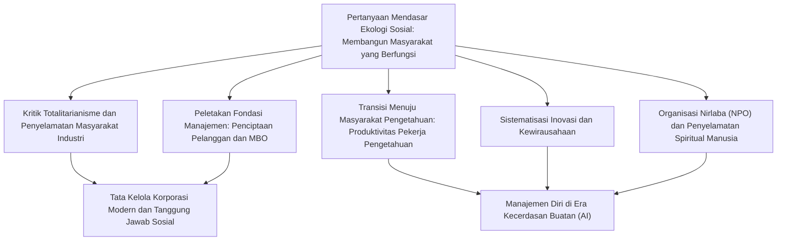
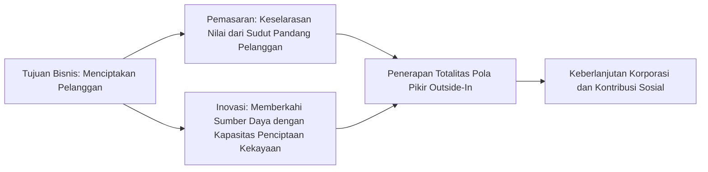
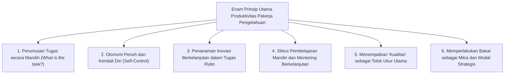
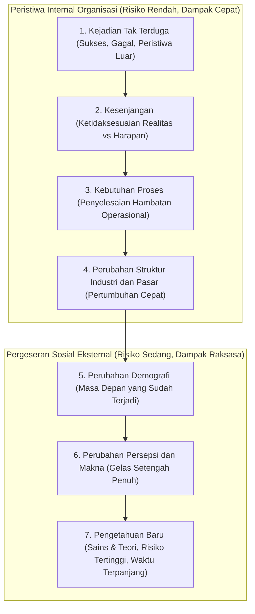

## 1. Pendahuluan: Cakrawala Intelektual Peter Drucker, Pemikir Terbesar Abad ke-20

### 1.1 Reduksi Gelar "Bapak Manajemen" dan Esensi Sejatinya sebagai "Ekolog Sosial"

Nama Peter F. Drucker (Peter Ferdinand Drucker, 1909–2005) dikenal di seluruh penjuru dunia sebagai "Bapak Manajemen Modern" (Father of Modern Management). Kendati demikian, ia sendiri sepanjang hayatnya tidak pernah menyukai label tersebut. Gelar khas yang selalu ia sematkan pada dirinya sendiri hingga akhir hayat adalah "Ekolog Sosial" (Social Ecologist).

Sebagaimana ekologi dalam ilmu biologi mengamati dan meneliti interaksi timbal balik serta keseimbangan dinamis antara flora-fauna dengan lingkungan sekitarnya, ekologi sosial adalah disiplin yang mengamati bagaimana manusia hidup, bekerja, menjalin relasi, dan membentuk tatanan sosial di dalam lingkungan sosial yang diciptakannya sendiri—mulai dari perusahaan, pemerintah, universitas, rumah sakit, gereja, hingga keluarga.

Pusat perhatian Drucker bukanlah sekadar "trik teknis memaksimalkan laba perusahaan" atau "perangkat efisiensi administrasi bisnis". Pertanyaan fundamental yang terus ia ajukan secara konsisten adalah pertanyaan yang sangat etis, filosofis, dan humanistik: **"Bagaimana membangun sebuah masyarakat yang berfungsi (a functioning society) di mana manusia dapat hidup dengan tetap mempertahankan kebebasan dan martabatnya?"** Jika ia mencurahkan segenap energinya untuk menganalisis organisasi bisnis dan korporasi, itu semata-mata karena pada abad ke-20, korporasilah yang menjelma menjadi lembaga representatif utama (Representative Institution) dalam masyarakat, sekaligus panggung terbesar yang menentukan mata pencaharian dan identitas manusia modern.

Banyak praktisi bisnis dan akademisi masa kini yang membaca karya-karya Drucker kerap melupakan bahwa ia berangkat dari kepedihan dan keputusasaan politik-filosofis yang mendalam: menyaksikan langsung kebangkitan nazisme di Eropa menjelang Perang Dunia II dan memikirkan bagaimana cara membendung totalitarianisme Hitler. Artikel ini akan menelusuri arus pemikiran mendalam yang melandasi seluruh kehidupan dan karya Peter Drucker, serta membedah tuntas bangunan intelektual mahakarya ini secara menyeluruh dan komprehensif.

---

### 1.2 Senja di Wina, Kebangkitan Nazisme, dan Teori Organisasi yang Lahir dari Kritik Totalitarianisme

Untuk memahami titik tolak pemikiran Drucker, kita harus memahami atmosfer intelektual kota Wina pada masa senja Kekaisaran Habsburg tempat ia dilahirkan dan dibesarkan. Lahir pada tahun 1909 di Wina, ibu kota Kekaisaran Austria-Hongaria, dalam keluarga intelektual terpandang, kediaman keluarga Drucker menjadi tempat berkumpulnya tokoh-tokoh pemikir terkemuka Eropa kala itu, seperti Sigmund Freud, Joseph Schumpeter, Ludwig von Mises, dan Friedrich Hayek.

Namun, meletusnya Perang Dunia I menghancurkan Kekaisaran Habsburg. Sepanjang dekade 1920-an hingga 1930-an, masyarakat Eropa dilanda keruntuhan sosial dan spiritual yang belum pernah terjadi sebelumnya. Tatanan kelas tradisional dan otoritas keagamaan runtuh, mencabut individu dari akar komunitas pelindungnya dan melemparkan mereka menjadi massa yang terisolasi dan gamang. Pukulan kian telak ketika Depresi Besar 1929 melanda, menyulut keputusasaan mendalam terhadap mekanisme pasar bebas kapitalisme dan demokrasi borjuis.

Dari kehampaan spiritual dan keputusasaan masal inilah dua monster totalitarianisme abad ke-20 bangkit: Sosialisme Nasional (Nazisme) pimpinan Hitler dan Komunisme pimpinan Stalin. Drucker muda, yang meraih gelar doktor hukum di Frankfurt dan bekerja sebagai jurnalis ekonomi, menyaksikan secara langsung proses mengerikan bagaimana Jerman terhisap ke dalam kegelapan nazisme. Segera setelah Hitler merebut kekuasaan pada tahun 1933, Drucker langsung melarikan diri meninggalkan Jerman menuju Inggris, dan pada tahun 1937 ia beremigrasi ke Amerika Serikat.

Bagi Drucker, fasisme dan totalitarianisme bukan sekadar kegilaan militer atau penyimpangan politik belaka, melainkan **"pemberontakan patologis yang lahir dari keputusasaan ketika masyarakat Barat modern gagal memberikan status sosial (Status) yang sah dan fungsi (Function) yang bermakna bagi manusia"**. Oleh sebab itu, menumpas totalitarianisme di medan perang saja tidaklah cukup; untuk mencabutnya hingga ke akar-akarnya, kita harus merancang sebuah "masyarakat bebas non-totaliter" baru, di mana setiap warga negara memiliki tempat berpijak yang kokoh, peran yang bermakna, serta kesempatan untuk meraih martabat dan aktualisasi diri. Rasa tanggung jawab eksistensial inilah yang menjadi kekuatan pendorong sejati yang mengarahkan Drucker untuk menekuni ranah organisasi dan manajemen.

---

## 2. Titik Tolak Pemikiran Drucker: Keputusasaan Totalitarianisme dan Penyelamatan Masyarakat Industri

### 2.1 *The End of Economic Man* (1939) ― Batas Marxisme dan Kapitalisme, serta Patologi Fasisme

Pada tahun 1939 di masa pengasingannya, Drucker menerbitkan karya monumen pertamanya, *The End of Economic Man: The Origins of Totalitarianism*. Buku yang ditulis oleh seorang pemuda belum genap 30 tahun yang kala itu belum dikenal luas ini langsung menuai pujian luar biasa dari Winston Churchill, bahkan dijadikan bacaan wajib bagi para perwira militer Inggris.

Dalam buku ini, Drucker membedah hakikat nazisme bukan sebagai "kejahatan rasional", melainkan sebagai "keyakinan magis delusif yang muncul setelah runtuhnya harapan-harapan rasional". Sejak abad ke-18, masyarakat Barat modern dibangun di atas konsep manusia sebagai "Manusia Ekonomi" (Economic Man). Kapitalisme menjanjikan bahwa pengejaran keuntungan materi secara bebas di pasar akan mendatangkan kemakmuran dan harmoni bagi seluruh masyarakat melalui tangan tak terlihat (*invisible hand*). Di sisi lain, Marxisme berjanji bahwa penghapusan kelas melalui revolusi kaum proletar akan mewujudkan masyarakat manusia bebas yang setara sejati.

Namun, realitas kapitalisme hanyalah pengangguran kronis, ketimpangan yang menganga, dan bencana Depresi Besar. Sementara itu, komunisme melahirkan kediktatoran berdarah dan kamp konsentrasi gulag. Ketika mitos kedua ideologi tersebut runtuh secara bersamaan, masyarakat Barat terjerembap ke dalam jurang nihilisme: kebebasan ekonomi maupun kesetaraan ekonomi terbukti tidak mampu menjamin kebahagiaan, makna hidup, atau martabat manusia.

Fasisme mengeksploitasi jurang kehampaan ini. Dengan secara terang-terangan menolak rasionalitas ekonomi dan kebebasan individual, fasisme memobilisasi sihir irasional berupa hierarki militeristik, mitos supremasi ras, dan pengagungan negara secara membabi buta guna menyuntikkan "makna semu" dan "rasa memiliki" kepada massa yang putus asa. Drucker menegaskan: mengecam fasisme saja tidak akan pernah memulihkan masyarakat. Kita harus mendirikan sebuah "tatanan sosial baru" yang, sembari merangkul rasionalitas ekonomi, mampu melampaui sekadar perolehan materi untuk memberikan eksistensi kewargaan yang bermartabat bagi manusia.

---

### 2.2 *The Future of Industrial Man* (1942) ― Komunitas yang Memberikan Status Sosial (Status) dan Fungsi (Function) kepada Manusia

Pada tahun 1942, bertepatan dengan keterlibatan Amerika Serikat dalam Perang Dunia II, Drucker merilis *The Future of Industrial Man*, yang memaparkan cetak biru tatanan masyarakat pascaperang.

Konsep poros dalam buku ini adalah "Kekuasaan yang Sah" (Legitimate Power), serta "Status Sosial" (Status) dan "Fungsi" (Function) bagi setiap individu. Agar masyarakat yang sehat dan bebas dapat bertahan hidup, dua prasyarat mutlak berikut harus terpenuhi:

1. **Kekuasaan yang Sah**: Otoritas yang memerintah masyarakat harus diakui oleh para anggotanya sebagai sesuatu yang memiliki keabsahan dan wibawa moral.
2. **Status dan Fungsi**: Setiap individu anggota masyarakat harus memiliki kedudukan yang jelas (status) dan peran yang bermakna dalam memberikan kontribusi nyata bagi kebaikan bersama (fungsi).

Hingga abad ke-19 dalam masyarakat agraris dan masyarakat niaga awal, keluarga, komunitas pedesaan, dan gilda serikat perajin menjamin status dan fungsi bagi individu. Namun, ketika Revolusi Industri kedua menempatkan pabrik-pabrik raksasa dan korporasi besar sebagai penggerak utama peradaban, komunitas tradisional tercerai-berai. Para pekerja pabrik tereduksi menjadi sekadar sekrup pengganti dalam mesin raksasa industri, dirundung rasa keterasingan dan ketidakberdayaan sosial.

Drucker memperingatkan dengan tajam: **"Jika korporasi industri modern hanya berhenti sebagai mesin ekonomi pencetak laba belaka dan gagal bermetamorfosis menjadi sebuah 'komunitas manusia' yang memberikan status sosial dan fungsi bagi para pekerjanya, masyarakat bebas akan sekali lagi ditelan oleh hantu totalitarianisme."** Korporasi, jauh sebelum dipandang sebagai kepemilikan privat para pemodal, harus dipahami sebagai lembaga tata kelola otonom yang memikul tanggung jawab sosial publik yang besar.

---

### 2.3 *Concept of the Corporation* (1946) ― Investigasi Internal General Motors (GM) dan Bedah Anatomi Organisasi Raksasa Modern

Pada tahun 1943, Drucker menerima tawaran yang belum pernah terjadi sebelumnya. Jajaran eksekutif puncak General Motors (GM), korporasi manufaktur terbesar di dunia dan lambang supremasi kapitalisme masa itu, mengundangnya untuk melakukan penyelidikan dan analisis komprehensif dari luar terhadap struktur tata kelola dan operasional organisasi GM.

Selama 18 bulan, Drucker berkantor di markas besar GM, melakukan wawancara mendalam yang tak terhitung jumlahnya dengan sang CEO legendaris Alfred Sloan, para eksekutif divisi, insinyur, manajer pabrik, hingga buruh lini perakitan, serta menghadiri rapat-rapat strategis dewan direksi. Laporan investigasi monumental tersebut diterbitkan pada tahun 1946 dengan judul *Concept of the Corporation*.

Karya ini merupakan buku pertama dalam sejarah peradaban yang membedah korporasi modern bukan semata sebagai "entitas ekonomi", melainkan sebagai **"lembaga politik dan sosial yang menjadi pilar pembentuk masyarakat"**. Drucker membongkar rahasia di balik kekuatan dahsyat GM, yaitu sistem "desentralisasi federal" (Decentralization) yang dirancang Sloan. Alih-alih menerapkan komando militer yang kaku dan sentralistik, pelimpahan wewenang otonom kepada setiap divisi bisnis—yang memikul tanggung jawab pasar dan operasionalnya sendiri—memungkinkan GM mempertahankan kelincahan dan inisiatif unit lokal di tengah ukuran organisasinya yang raksasa.

---

### 2.4 Konflik Doktrinal dengan Sloan: Rasionalisme *Top-Down* GM vs Organisasi Otonom yang Humanistik

Kendati demikian, *Concept of the Corporation* memicu penolakan keras di tubuh internal General Motors. Alfred Sloan dan para petinggi GM menolak mentah-mentah rekomendasi humanis Drucker, seperti pelimpahan wewenang nyata kepada buruh, pembentukan tim mandiri yang mengelola dirinya sendiri (*self-managed teams*), otonomi komunitas pabrik, serta jaminan martabat pekerja melalui kepastian kerja jangka panjang.

Bagi Sloan, korporasi adalah mesin presisi yang dirancang secara ultra-rasional untuk memadukan modal, teknologi, dan tenaga kerja; buruh tak lebih dari unit ekonomi kontraktual yang menukarkan tenaganya dengan upah. Sloan mencap pemikiran Drucker sebagai "khayalan sosialis yang sentimental" dan melarang buku tersebut beredar di lingkungan kantor GM (ironisnya, Henry Ford II di Ford Motor Company yang kala itu di ambang kebangkrutan, melahap buku tersebut dan menggunakannya untuk memimpin kebangkitan kembali Ford secara spektakuler).

Pertentangan filosofis dengan Sloan ini mengukuhkan arah perjalanan intelektual Drucker selanjutnya. Menolak kontrol birokrasi hierarkis *top-down* dan pemujaan terhadap angka-angka belaka, Drucker mendedikasikan sisa hidupnya untuk mengeksplorasi **"manajemen terdesentralisasi yang menaruh kepercayaan penuh pada potensi manusia dan kendali diri (*self-control*)"**.

---

## 3. Lahirnya "Manajemen" dan Arsitektur Esensialnya

### 3.1 Fondasi Disiplin yang Ditegakkan *The Practice of Management* (1954)

Pada tahun 1954, Drucker menerbitkan *The Practice of Management*. Melalui adikarya ini, untuk pertama kalinya dalam sejarah dunia, praktik "manajemen" dikukuhkan sebagai disiplin ilmu yang sistematis dan terstruktur. Sebelum buku ini lahir, memimpin bisnis hanya dianggap sebagai bakat bawaan lahir para wirausahawan karismatik, firasat intuisi personal, atau sekadar kemahiran teknis pencatatan neraca keuangan. Drucker mengangkat manajemen menjadi sebuah cabang keilmuan yang dapat dipelajari, dilatih, dan dipraktikkan secara sistematis.

Drucker merumuskan tiga fungsi universal manajemen yang mutlak harus dipenuhi oleh setiap lembaga:

1. **Memenuhi tujuan dan misi spesifik dari lembaga tersebut**: Bagi korporasi adalah menghasilkan kinerja ekonomi; bagi rumah sakit adalah menyembuhkan orang sakit; bagi universitas adalah memajukan ilmu dan mendidik tunas bangsa.
2. **Menjadikan pekerjaan produktif dan memungkinkan para pekerja berkinerja unggul**: Mengoptimalkan segenap potensi manusia, sehingga melalui pekerjaannya mereka memperoleh martabat, pertumbuhan, dan pemenuhan diri.
3. **Mengelola dampak sosial dari lembaga serta berkontribusi pada penyelesaian masalah sosial**: Mencegah agar aktivitas organisasi tidak mencemari atau merusak tatanan masyarakat, serta menjalankan peran sebagai warga negara yang beretika.

Ketiga fungsi ini saling berkelindan erat dan tidak dapat dipisahkan; manajemen dituntut untuk terus-menerus menyeimbangkan ketiganya secara dinamis.

---

### 3.2 Tujuan Bisnis adalah "Menciptakan Pelanggan": Dualitas Pemasaran dan Inovasi

Prinsip paling terkenal sekaligus paling sering disalahpahami dalam filosofi manajemen Drucker adalah definisinya tentang tujuan bisnis. Drucker menegaskan tanpa keraguan:

> **"Hanya ada satu definisi yang sah tentang tujuan bisnis: menciptakan pelanggan (There is only one valid definition of business purpose: to create a customer)."**

Mayoritas eksekutif dan ekonom berkeyakinan teguh bahwa "tujuan bisnis adalah memaksimalkan laba". Namun, menurut Drucker, laba bukanlah tujuan bisnis; laba hanyalah "prasyarat mutlak" (Condition) atau "pembatas" (Limitation) agar bisnis dapat bertahan hidup dan menanggung risiko serta ketidakpastian masa depan. Sama halnya seperti jantung berdetak dan paru-paru menghirup oksigen merupakan syarat bertahan hidup manusia, namun bernapas bukanlah tujuan hidup manusia itu sendiri.

Tanpa pelanggan, bisnis apa pun akan lenyap dalam semalam. Pelanggan tidak tercipta dengan sendirinya di alam bebas, melainkan ditemukan dan diciptakan melalui aktivitas nyata korporasi. Oleh sebab itu, untuk mewujudkan misi menciptakan pelanggan, setiap organisasi bisnis pada hakikatnya hanya memiliki **dua fungsi dasar (Basic Functions)**:

1. **Pemasaran (Marketing)**: Memahami secara mendalam kebutuhan sejati, realitas, dan nilai-nilai pelanggan, sehingga produk atau layanan yang dihasilkan pas sempurna dengan pelanggan. "Tujuan pemasaran yang hebat adalah membuat aktivitas menjual (sales) menjadi mubazir."
2. **Inovasi (Innovation)**: Memberkahi sumber daya yang ada dengan kapasitas baru untuk menciptakan kekayaan. Ini adalah ikhtiar tanpa henti untuk menyajikan nilai ekonomi dan sosial yang baru.

Seluruh aktivitas bisnis lainnya (keuangan, SDM, akuntansi, pengadaan, logistik) tidak lebih dari pusat biaya (*cost center*) yang menopang berjalannya dua fungsi pokok tersebut. Sumber laba yang sejati senantiasa berada di luar organisasi: dalam kepuasan pelanggan.

---

### 3.3 Hakikat Manajemen Berdasarkan Sasaran dan Kendali Diri (MBO: Management by Objectives and Self-Control)

Salah satu konsep paling revolusioner yang digagas Drucker dalam *The Practice of Management* adalah "Manajemen berdasarkan Sasaran dan Kendali Diri" (Management by Objectives and Self-Control: MBO).

Kini, sistem evaluasi bernama "MBO" telah diadopsi oleh korporasi di seluruh dunia. Namun, seperti yang disesali Drucker secara getir di pengujung hayatnya, **99% praktik MBO di korporasi modern telah terdegradasi menjadi alat pemaksaan kuota dan instrumen pengawasan birokrasi, yang bertolak belakang secara diametral dari visi aslinya**.

Roh sejati pemikiran Drucker terletak pada frasa keduanya: **"Kendali Diri (Self-Control)"**. Manajemen konvensional beroperasi berdasarkan "kendali eksternal" (External Control), di mana atasan menetapkan target dari atas, memantau gerak-gerik bawahan, dan mengendalikannya dengan sistem hukuman dan hadiah (*reward and punishment*). Ini tak ubahnya sisa-sisa taylorisme usang yang memperlakukan manusia sebagai mesin pasif.

Sebaliknya, MBO sejati yang diajarkan Drucker menuntut proses sebagai berikut:

1. Tujuan bersama dan misi menyeluruh organisasi dipahami dan dihayati secara mendalam oleh setiap orang.
2. Setiap pekerja memikirkan sendiri apa kontribusi terbaik yang dapat ia berikan bagi tujuan besar tersebut, lalu menetapkan sasarannya secara sukarela dan mandiri.
3. Organisasi menyediakan lingkungan di mana data dan umpan balik objektif untuk mengukur kinerjanya dapat diakses secara langsung oleh **pekerja itu sendiri**, bukan semata dilaporkan kepada atasan.
4. Pekerja mengendalikan sendiri perkembangannya dan secara otonom melakukan penyesuaian jika terjadi deviasi.

MBO bukanlah alat untuk memperkuat cengkeraman kekuasaan manajerial, melainkan **"sebuah filosofi emansipasi yang meniadakan kebutuhan akan instruksi dan pengawasan eksternal, sekaligus membebaskan manusia menjadi profesional yang mandiri dan berdaulat"**. Drucker percaya bahwa motivasi intrinsik (Intrinsic Motivation) dan otonomi yang berlandaskan tanggung jawab pribadi adalah kunci memuliakan martabat manusia sekaligus memicu kinerja tertinggi organisasi.

---

### 3.4 Definisi Kinerja (Results) dan Alokasi Sumber Daya: Delapan Area Kunci Korporasi

Drucker memperingatkan keras bahaya fatal menilai kesehatan korporasi hanya melalui satu metrik tunggal (seperti omzet penjualan atau laba triwulanan). Agar perusahaan dapat tumbuh sehat secara berkelanjutan dan terus berkontribusi bagi masyarakat, manajemen harus menetapkan sasaran berimbang dan memantau kemajuannya dalam **delapan area hasil kunci (Key Result Areas)**:

| Area | Cakupan dan Signifikansi Strategis |
| :--- | :--- |
| **1. Pemasaran (Marketing)** | Tidak hanya pangsa pasar pada segmen yang ada, tetapi juga perluasan ke pasar baru dan tingkat penciptaan pelanggan. |
| **2. Inovasi (Innovation)** | Tidak hanya produk dan layanan, tetapi juga inovasi pada struktur organisasi, proses operasional, dan model bisnis. |
| **3. Sumber Daya Manusia dan Kapabilitas Organisasi** | Pengembangan kompetensi, motivasi kerja karyawan, kaderisasi pemimpin masa depan, dan otonomi tim. |
| **4. Sumber Daya Finansial** | Kemampuan menghimpun modal investasi yang dibutuhkan, kesehatan arus kas (*cash flow*), dan alokasi modal optimal. |
| **5. Sumber Daya Fisik** | Efisiensi, modernitas, dan produktivitas infrastruktur: pabrik, peralatan, ruang kerja, dan sistem TI. |
| **6. Produktivitas** | Rasio nilai tambah yang dihasilkan berbanding dengan sumber daya yang dikorbankan (tenaga kerja, modal, waktu, bahan baku). |
| **7. Tanggung Jawab Sosial** | Integritas etika, kepatuhan hukum, kelestarian lingkungan, dan kontribusi nyata yang proaktif kepada masyarakat luas. |
| **8. Kebutuhan Laba (Required Profit)** | Tingkat keuntungan minimal yang wajib dicapai guna mendanai ketujuh sasaran di atas dan menutup risiko ketidakpastian masa depan. |

Kunci inti dari pemikiran manajemen Drucker terangkum dalam ungkapan: **"Laba bukanlah tujuan, melainkan prasyarat."** Laba adalah rapor pertanggungjawaban atas tindakan masa lalu, sekaligus "premi asuransi kelangsungan bisnis" untuk membayar biaya dan ketidakpastian di masa depan.

---

## 4. Antisipasi Masyarakat Pengetahuan dan Kemunculan "Pekerja Pengetahuan (Knowledge Worker)"

### 4.1 Dari *The Age of Discontinuity* (1969) Menuju *Post-Capitalist Society* (1993)

Di antara sekian banyak ramalan visioner Peter Drucker, ramalan yang melahirkan dampak historis paling masif adalah ramalannya tentang lahirnya "Masyarakat Pengetahuan" (Knowledge Society). Pada tahun 1959 lewat bukunya *Landmarks of Tomorrow*, Drucker untuk pertama kalinya dalam sejarah peradaban mencetuskan istilah **"Pekerja Pengetahuan" (Knowledge Worker)**.

Kemudian pada tahun 1969 melalui adikarya *The Age of Discontinuity*, ia melihat adanya pergeseran tektonik yang mengguncang sendi-sendi perekonomian sejak era Revolusi Industri. Ekonomi klasik senantiasa mendudukkan tanah (sumber daya alam), tenaga kerja (otot fisik), dan modal (pabrik dan mesin) sebagai tiga faktor produksi utama. Namun, Drucker menegaskan bahwa sejak paruh kedua abad ke-20, faktor-faktor tradisional tersebut tergeser ke posisi sekunder: **"Pengetahuan" (Knowledge) telah bertransformasi menjadi satu-satunya faktor produksi yang paling menentukan**.

Dalam *Post-Capitalist Society* (1993), pemikirannya kian matang. Dalam masyarakat kapitalis klasik, pemegang kekuasaan tertinggi adalah pemilik modal finansial dan alat produksi fisik (kaum borjuis/investor). Namun dalam masyarakat pengetahuan, modal yang hakiki bersemayam di dalam benak para pekerja itu sendiri. Karena pekerja pengetahuan memiliki alat produksinya sendiri (kecerdasan, keahlian, dan daya analisisnya) dan membawanya ke mana pun mereka pergi, hubungan kekuasaan historis antara pemilik modal dan pekerja berbalik untuk pertama kalinya dalam sejarah manusia.

---

### 4.2 Pergeseran Historis dari Kerja Otot (Taylorisme) ke Kerja Pengetahuan

Keajaiban ekonomi terbesar abad ke-20 adalah **melonjaknya produktivitas pekerja manual hingga hampir 50 kali lipat** berkat konsep "Manajemen Ilmiah" yang dipelopori Frederick Winslow Taylor. Taylor membedah pekerjaan tangan perajin yang semula bertumpu pada kebiasaan dan firasat menjadi studi gerak dan waktu yang presisi, lalu merangkainya kembali secara efisien. Revolusi produktivitas inilah yang melahirkan masyarakat kelas menengah yang makmur dengan konsumsi massal, sekaligus membentengi negara-negara maju dari ancaman revolusi berdarah Marxisme.

Namun, Drucker memberikan peringatan keras: "Jika kontribusi terbesar manajemen pada abad ke-20 adalah melipatgandakan produktivitas kerja manual, **maka tantangan terbesar yang dihadapi manajemen pada abad ke-21 adalah melipatgandakan produktivitas kerja pengetahuan**."

Terdapat perbedaan esensial yang mendasar antara kerja otot dan kerja pengetahuan:

| Karakteristik | Kerja Manual (Manual Work) | Kerja Pengetahuan (Knowledge Work) |
| :--- | :--- | :--- |
| **Definisi Pekerjaan** | Konten pekerjaan sudah terdefinisi secara pasti tanpa perlu dipertanyakan lagi (contoh: mengangkut balok baja, mengencangkan baut). | **"Apa sebenarnya tugasnya? Apa hasil akhir yang ingin dicapai?"** harus didefinisikan sendiri oleh pekerjanya. |
| **Otonomi** | Kepatuhan mutlak pada prosedur baku dianggap kebajikan utama; kontrol dilakukan secara ketat dari luar. | **Otonomi (Autonomy)** merupakan prasyarat mutlak; tanpa kemampuan kendali diri, kinerja unggul mustahil terwujud. |
| **Inovasi Berkelanjutan** | Inovasi diserahkan sepenuhnya kepada insinyur dan perancang proses. | Inovasi harus **diintegrasikan secara berkelanjutan** oleh pekerja pengetahuan ke dalam tugas hariannya. |
| **Pembelajaran dan Pengajaran** | Begitu keterampilan dikuasai, efisiensi meningkat lewat pengulangan yang rutin. | Keusangan pengetahuan terjadi sangat cepat; **pembelajaran dan pengajaran seumur hidup** wajib dilakukan. |
| **Standar Evaluasi** | Utamanya adalah **"Kuantitas"** (berapa banyak produk yang dihasilkan per jam kerja). | Utamanya adalah **"Kualitas"** (seberapa mendalam wawasan, ketepatan analisis, dan solusi yang dihasilkan). |
| **Kepemilikan Alat Produksi** | Pabrik, mesin, dan peralatan kerja **dimiliki oleh pemodal**. | Alat produksi (pengetahuan, daya pikir, kebijaksanaan) **berada di kepala pekerja**. |

Dalam kerja pengetahuan, bekerja membanting tulang berjam-jam sama sekali tidak menjamin hasil yang bermutu. Menjawab pertanyaan yang keliru dengan kecepatan dan efisiensi sempurna hanyalah pemborosan total. Peningkatan produktivitas pekerja pengetahuan tidak akan pernah bisa dicapai dengan alat pengawasan ala Taylor, melainkan menuntut pergeseran paradigma manajemen secara radikal.

---

### 4.3 Enam Prinsip Penentu Produktivitas Pekerja Pengetahuan

Dalam bukunya *Management Challenges for the 21st Century* (1999), Drucker memformulasikan enam syarat mutlak untuk mendongkrak produktivitas pekerja pengetahuan:

1. **Terus-menerus mempertanyakan: "Apa tugasnya?" (What is the task?)**: Langkah terpenting dalam kerja pengetahuan adalah merumuskan pekerjaan apa yang sungguh-sungguh harus diselesaikan. Tidak ada yang lebih merusak daripada mengefisienkan pekerjaan yang sebenarnya tidak perlu dilakukan.
2. **Memberikan otonomi penuh**: Pekerja pengetahuan harus mengelola dirinya sendiri secara mandiri. Otonomi adalah rahim yang melahirkan tanggung jawab dan profesionalisme sejati.
3. **Menanamkan inovasi berkelanjutan ke dalam rutinitas kerja**: Dalam bidang spesialisasinya, pekerja harus secara proaktif mencari terobosan dan nilai baru.
4. **Menjalankan siklus belajar dan mengajar tanpa henti**: Pekerja pengetahuan harus menjadi pembelajar sekaligus pengajar (mentor) bagi orang lain. Tidak ada cara yang lebih ampuh untuk memperdalam dan mensistematisasikan ilmu selain dengan mengajarkannya kepada sesama.
5. **Memprioritaskan kualitas di atas kuantitas**: Satu laporan analitis tajam yang mengubah arah strategi perusahaan jauh lebih berharga daripada ratusan tumpukan laporan rutin yang dangkal.
6. **Memperlakukan pekerja pengetahuan sebagai "aset berharga", bukan "biaya"**: Pekerja pengetahuan bukanlah sekrup organisasi, melainkan "mitra sejajar" yang menanamkan modal pengetahuannya secara sukarela.

---

### 4.4 "Pekerja Pengetahuan Harus Menjadi CEO bagi Dirinya Sendiri": Seni Manajemen Diri

Lahirnya masyarakat pengetahuan juga menuntut transformasi radikal dalam cara hidup setiap individu. Dalam esai terkenalnya pada tahun 1999, "Managing Oneself" (Mengelola Diri Sendiri), Drucker membunyikan lonceng peringatan bagi setiap profesional modern.

Di era pramodern, profesi seseorang ditentukan oleh garis keturunan atau kasta keluarga. Pada era masyarakat industri, masuk ke korporasi besar menjamin jalur karier yang aman hingga masa pensiun. Namun di era masyarakat pengetahuan, **"setiap individu harus merancang sendiri jalur kariernya dan mengelola sendiri kinerjanya"**. Mengingat harapan hidup rata-rata manusia kini melampaui 80 tahun, sedangkan usia hidup rata-rata sebuah korporasi (sekitar 30 tahun) jauh lebih singkat dibanding masa produktif seseorang, setiap pekerja pengetahuan harus memposisikan dirinya sebagai Chief Executive Officer (CEO) dari perusahaan rintisan bernama "PT Diri Saya Sendiri".

Drucker menguraikan pilar-pilar konkret manajemen diri sebagai berikut:

#### ① Menemukan Kekuatan Diri (Strengths)
Inti terdalam dari pemikiran Drucker tentang manusia terangkum dalam prinsip: **"Seseorang hanya dapat berkinerja melalui kekuatannya. Seseorang tidak akan pernah bisa meraih keunggulan hanya dengan memperbaiki kelemahannya."**

Dunia pendidikan konvensional dan pelatihan korporat menghabiskan energi luar biasa untuk mencari cacat dan kelemahan seseorang demi mendongkraknya ke standar rata-rata. Namun, mengubah ketidakmampuan menjadi mediokritas membutuhkan pengorbanan raksasa, sedangkan mengasah kekuatan yang hebat menjadi keunggulan kelas dunia menuntut usaha yang jauh lebih terukur dengan hasil yang berlipat ganda.

Sebagai satu-satunya metode paling terpercaya untuk menemukan kekuatan sejati, Drucker mencetuskan **"Analisis Umpan Balik" (Feedback Analysis)**.
- Setiap kali Anda mengambil keputusan penting atau meluncurkan aksi strategis, **tuliskan di atas kertas hasil apa yang Anda harapkan akan terjadi**.
- Sembilan bulan atau setahun kemudian, **bandingkan secara cermat dan jujur hasil nyata yang tercapai dengan ekspektasi tertulis Anda di awal**.
- Dengan mengulangi metode ini selama beberapa tahun, Anda akan melihat secara objektif apa kekuatan alami Anda, dalam kondisi apa bakat Anda berbuah lebat, dan sebaliknya, di area mana Anda benar-benar tidak kompeten.

#### ② Memahami Gaya Kerja Diri (How I Perform)
Sama pentingnya dengan kekuatan, seseorang harus memahami gaya kerja dan preferensi kognitif pribadinya:
- **Apakah saya seorang "Pembaca" (Reader) atau seorang "Pendengar" (Listener)?** (Dwight Eisenhower adalah seorang pembaca: saat menghadapi konferensi pers lisan, ia kerap salah bicara; namun ketika pertanyaan diserahkan dalam bentuk memo tertulis sebelumnya, ia menjawab dengan cemerlang. Sebaliknya, Franklin D. Roosevelt dan Harry Truman adalah pendengar sejati).
- **Bagaimana cara saya belajar?** (Apakah lewat menulis, berdiskusi, atau langsung mempraktikkannya di lapangan?).
- **Apakah saya berkinerja unggul sebagai "Pengambil Keputusan" (Decision Maker) atau sebagai "Penasihat" (Adviser)?** (Banyak figur nomor dua yang brilian hancur lebur saat diangkat menjadi pucuk pimpinan tertinggi karena tidak memiliki kapasitas mengambil keputusan akhir di bawah tekanan).

#### ③ Mempersiapkan Paruh Kedua Kehidupan (Second Career)
Jika pekerja otot pensiun karena kelelahan fisik, pekerja pengetahuan di usia pertengahan 40 hingga 50 tahun kerap dihantam rasa bosan luar biasa dan sindrom *burnout*. Menekuni bidang pekerjaan yang sama selama 20 tahun membuat kurva pembelajaran mendatar dan pertumbuhan diri terhenti.

Drucker sangat menganjurkan agar sebelum menginjak usia 40 tahun, seseorang sudah mulai membangun **"bidang aktivitas kedua (karier paralel atau aktivitas nirlaba)"**. Memiliki panggung lain di luar pekerjaan utama—baik di lembaga swadaya masyarakat (LSM), komunitas lokal, dunia akademis, maupun yayasan sosial—di mana kekuatan kita dapat disumbangkan, menjadi benteng spiritual kokoh yang menjaga harga diri ketika kita mengalami pemutusan hubungan kerja (PHK) atau kegagalan karier, sekaligus jalan menuju paruh kedua kehidupan yang kaya makna.

---

## 5. Teknik Sistematis Inovasi dan Kewirausahaan

### 5.1 *Innovation and Entrepreneurship* (1985)

Banyak orang keliru mengira bahwa inovasi adalah "kilatan petir inspirasi yang mendadak menyambar benak seorang jenius nyentrik di tengah malam". Sebagian lain meyakini inovasi lahir semata-mata dari anggaran riset dan pengembangan (R&D) raksasa yang menanti keajaiban penemuan laboratorium.

Pada tahun 1985, Drucker menerbitkan *Innovation and Entrepreneurship*, menghancurkan mitos romantis tersebut hingga berkeping-keping. Bagi Drucker, inovasi bukanlah ilham gaib para jenius, melainkan **"sebuah disiplin terstruktur dan sistematis yang dapat dipelajari serta dipraktikkan secara metodis oleh setiap organisasi"**.

Drucker mendefinisikan inovasi sebagai berikut:
> **"Inovasi adalah tindakan memberkahi sumber daya dengan kapasitas baru untuk menciptakan kekayaan. Bahkan, sebelum terjadinya inovasi, tidak ada sesuatu pun di alam semesta ini yang dapat disebut sebagai 'sumber daya'. Sebelum manusia menemukan kegunaannya dan menyuntikkan nilai ekonomi ke dalamnya, setiap tanaman hanyalah gulma tak berguna, dan setiap bebatuan mineral hanyalah batu cadas yang membisu."**

Minyak bumi, hingga pertengahan abad ke-19 sebelum teknologi penyulingan dan mesin pembakaran dalam ditemukan, tak lebih dari cairan hitam lengket menjijikkan yang mencemari kesuburan tanah pertanian. Inovasilah yang mempertemukan sains dengan kebutuhan transportasi masyarakat, mengubah cairan terkutuk itu menjadi "sumber daya" paling berharga di muka bumi.

---

### 5.2 Menepis Mitos Ilham Mendadak: Tujuh Sumber Peluang Inovasi

Drucker menyusun secara sistematis **"Tujuh Sumber Peluang Inovasi" (The Seven Sources for Innovative Opportunity)** yang wajib dipantau secara rutin oleh para pengambil keputusan. Sumber-sumber ini diurutkan dari yang paling dapat diandalkan dan berisiko paling rendah hingga yang paling berisiko:

#### ① Kejadian Tak Terduga (The Unexpected)
Merupakan sumber dengan risiko terendah dan peluang terbesar, namun ironisnya paling sering diabaikan oleh manajemen: Keberhasilan Tak Terduga (Unexpected Success) dan Kegagalan Tak Terduga (Unexpected Failure).
- **Keberhasilan Tak Terduga**: Ketika IBM pertama kali merancang komputer elektronik awalnya untuk riset ilmiah, mesin-mesin tersebut justru ludes diborong oleh bank dan perusahaan asuransi untuk keperluan pembukuan rutin. Para teknisi sempat cemas menganggapnya sebagai "penyimpangan", namun jajaran direksi IBM dengan cerdas mencurahkan seluruh tenaga untuk melayani permintaan tak terduga ini, hingga akhirnya melahirkan imperium komputasi dunia.
- Kebanyakan korporasi menghabiskan rapat bulanan mereka berjam-jam meratapi target yang meleset (kegagalan yang terprediksi), sembari mengabaikan produk yang penjualannya melonjak di luar rencana dan menganggapnya sebagai kebetulan belaka. Drucker menegaskan: halaman pertama dari laporan manajerial bulanan harus dikhususkan untuk keberhasilan tak terduga, dan talenta terbaik perusahaan wajib ditempatkan di sana.

#### ② Kesenjangan (Incongruities)
Adanya ketidaksesuaian antara asumsi "apa yang seharusnya terjadi" dengan "realitas apa yang sebenarnya sedang terjadi".
- Pada era 1950-an, industri perkapalan dunia menginvestasikan dana raksasa untuk meningkatkan kecepatan kapal dan efisiensi bahan bakar di tengah profitabilitas yang terus merosot. Biaya terbesar perkapalan ternyata bukan saat kapal berlayar di samudra, melainkan "waktu sandar" di pelabuhan menunggu proses bongkar muat kargo yang lamban. Malcom McLean menyadari kesenjangan ini dan merancang "Kelistrikan Kontainer" (Containerization). Tanpa mengubah performa kapal itu sendiri, penyatuan standar antara angkutan darat dan laut lewat boks kontainer memangkas waktu sandar dari berminggu-minggu menjadi hitungan jam, meledakkan perdagangan global secara revolusioner.

#### ③ Kebutuhan Proses (Process Need)
Kebutuhan mendesak untuk menyempurnakan mata rantai yang hilang atau memecahkan sumbatan (*bottleneck*) dalam proses bisnis yang sudah berjalan.
- Kamera instan Polaroid yang lahir dari keinginan memotong proses pencucian klise foto yang memakan waktu, atau sentral telepon otomatis yang dirancang untuk mengatasi kebuntuan akibat keterbatasan jumlah operator manusia saat lalu lintas telepon meledak.

#### ④ Perubahan Struktur Industri dan Pasar (Industry and Market Structures)
Ketika sebuah industri tumbuh pesat dengan laju di atas 10% per tahun, struktur lama akan ambruk, memicu pergantian peta kekuatan antara pemain lama dan pendatang baru.
- Naiknya pamor Volvo yang berfokus pada teknologi keselamatan di tengah ledakan industri otomotif, atau menjamurnya pialang saham daring saat deregulasi pasar finansial terjadi.

#### ⑤ Perubahan Demografi (Demographics)
Di antara fenomena **"Masa Depan yang Sudah Terjadi" (The Future that has already happened)**, dinamika demografi (angka kelahiran, angka kematian, piramida usia, tingkat pendidikan) adalah faktor yang paling pasti dan paling terukur secara ilmiah.
- Jumlah pemuda berusia 20 tahun dua dekade mendatang dapat diketahui dengan akurasi 100% cukup dengan menghitung jumlah bayi yang lahir hari ini. Penuaan populasi, penurunan angkatan kerja produktif, atau lonjakan lulusan perguruan tinggi menyuguhkan puluhan peluang inovasi bernilai miliaran dolar.

#### ⑥ Perubahan Persepsi dan Makna (Changes in Perception)
Fakta objektif tidak berubah sama sekali, namun cara pandang atau "kerangka persepsi" masyarakat bergeser drastis.
- Pergeseran dari melihat gelas "setengah penuh" menjadi "setengah kosong". Berkat kemajuan ilmu kedokteran, usia harapan hidup manusia melonjak dan masyarakat modern berada dalam kondisi fisik paling sehat dalam sejarah. Namun, masyarakat masa kini justru dicekam oleh kecemasan kesehatan yang ekstrem, memicu ledakan industri makanan organik, suplemen, dan pusat kebugaran. Pasar raksasa ini lahir bukan karena kesehatan fisik yang memburuk, melainkan karena pergeseran persepsi masyarakat terhadap makna kesehatan.

#### ⑦ Pengetahuan Baru (New Knowledge)
Inovasi yang bertumpu pada penemuan ilmiah, teknologi mutakhir, atau teori baru.
- Inilah yang kerap dianggap oleh masyarakat awam sebagai satu-satunya bentuk inovasi. Namun Drucker memperingatkan: **inovasi berbasis pengetahuan baru adalah yang paling rendah tingkat keberhasilannya, membutuhkan modal paling masif, dan memakan waktu tunggu terpanjang sebelum dapat dikomersialkan** (biasanya membutuhkan 25 hingga 30 tahun dari penemuan dasar hingga komersialisasi). Terlebih lagi, ia menuntut konvergensi berbagai disiplin ilmu yang berbeda agar dapat berfungsi, menjadikannya spekulasi berisiko sangat tinggi.

---

### 5.3 Pengabaian Sistematis (Systematic Abandonment): Keberanian Mengubur Kejayaan Masa Lalu

Langkah pertama dan terpenting untuk memicu inovasi bukanlah memeras otak mencari ide-ide baru. Drucker menegaskan: **"Langkah awal inovasi adalah secara terencana dan sistematis melepaskan (Systematic Abandonment) hal-hal lama yang sudah usang, program yang tidak lagi menghasilkan, serta kejayaan masa lalu."**

Setiap organisasi memiliki kecenderungan alami untuk membelenggu talenta terbaik dan sumber daya finansial terbesarnya demi mempertahankan produk, layanan, atau divisi bisnis yang sekarat. Semakin sukses sebuah lini bisnis di masa lampau, semakin ia dikeramatkan menjadi tempat suci dalam politik internal perusahaan, sehingga tidak ada yang berani menyentuhnya. Akibatnya, sumber daya untuk membangun masa depan baru menjadi kering kerontang.

Drucker mewajibkan setiap pemimpin bisnis untuk secara berkala melontarkan pertanyaan dingin dan tanpa ampun ini kepada diri mereka sendiri:
> **"Seandainya kita belum menjalankan bisnis ini hari ini, dengan berbekal seluruh pengetahuan dan informasi yang kita miliki saat ini, apakah kita akan tetap memutuskan untuk memasukinya?"**

Jika jawabannya adalah "Tidak", maka pertanyaan lanjutannya bukanlah "Bagaimana cara memperbaikinya?", melainkan "Apa langkah konkret yang harus kita ambil hari ini untuk segera menghentikannya?". Ini bukan soal menambal sulam atau memperpanjang napas proyek yang sekarat, melainkan tindakan divestasi dan penutupan yang terencana secara sistematis. Sebagaimana tubuh biologis akan mati keracunan jika tidak mampu membuang sel-sel yang mati, perusahaan yang tidak berani melakukan pengabaian sistematis pasti akan mati lemas kehabisan oksigen inovasi.

---

## 6. Tata Kelola Organisasi, Tanggung Jawab Sosial, dan Signifikansi Organisasi Nirlaba (NPO)

### 6.1 Tiga Tugas Pokok dalam *Management: Tasks, Responsibilities, Practices* (1973) dan Esensi Tanggung Jawab Sosial

Pada tahun 1973, sebagai rangkuman akbar atas seluruh filosofi manajemennya, Drucker mempersembahkan mahakarya setebal lebih dari 1.000 halaman dalam dua jilid: *Management: Tasks, Responsibilities, Practices*.

Dalam karya agung ini, Drucker membedah konsep "Tanggung Jawab Sosial Perusahaan" (CSR: Corporate Social Responsibility) dengan kedalaman yang jauh melampaui retorika humas atau aksi filantropi kosmetik masa kini. Bagi Drucker, tanggung jawab sosial terbagi tegas ke dalam dua kategori pokok:

1. **Mengatasi dampak negatif (Impacts) yang ditimbulkan oleh aktivitas organisasi sendiri**:
   - Polusi udara, kebisingan, limbah industri, hingga gangguan kesehatan pekerja yang ditimbulkan oleh operasi bisnis.
   - Posisi Drucker tegas dan tanpa kompromi: **"Segala dampak buruk yang ditimbulkan organisasi terhadap masyarakat harus ditekan hingga titik nol di bawah tanggung jawab penuh organisasi tersebut, berapa pun biaya yang harus dikeluarkan."** Membiarkan dampak buruk terjadi adalah bentuk pengkhianatan terhadap publik yang meruntuhkan legitimasi keberadaan organisasi itu sendiri.
2. **Menyelesaikan masalah yang dihadapi masyarakat luas (Social Problems)**:
   - Kemiskinan sistemik, kesenjangan pendidikan, penuaan populasi, atau krisis lingkungan global yang berada di luar operasi harian bisnis.
   - Terhadap tantangan ini, Drucker meletakkan prinsip yang sangat realistis: "Korporasi hanya boleh terlibat dalam penyelesaian masalah sosial jika ia mampu mengubah masalah tersebut menjadi **peluang bisnis nyata yang berkelanjutan** dengan memanfaatkan kekuatan dan kompetensi intinya." Terjun secara sentimental ke dalam kancah sosial yang melampaui kapasitasnya hingga mengorbankan daya saing bisnis utamanya adalah puncak dari tindakan yang tidak bertanggung jawab.

---

### 6.2 Mengapa di Masa Senjanya Drucker Mencurahkan Hatinya untuk Organisasi Nirlaba (NPO/NGO)?

Sejak dekade 1980-an, ketika ia telah berada di puncak kejayaan reputasi intelektual global, Drucker justru mencurahkan sebagian besar energi intelektualnya untuk meneliti dan menjadi konsultan bagi organisasi-organisasi nirlaba (NPO/LSM): universitas, rumah sakit, Girl Scouts, Bala Keselamatan (Salvation Army), dan gereja. Pada tahun 1990, ia menerbitkan buku *Managing the Non-Profit Organization*.

Mengapa seorang begawan manajemen korporasi kapitalis banting setir mendedikasikan energinya untuk sektor nirlaba? Jawabannya berakar pada komitmen seumur hidupnya: mewujudkan "masyarakat yang berfungsi".

Korporasi menghasilkan produk dan layanan serta menciptakan pelanggan. Pemerintah menegakkan hukum dan peraturan serta menjaga ketertiban umum. Namun, **baik korporasi maupun pemerintah tidak mampu mengubah jiwa manusia atau memulihkan ikatan komunitas yang koyak**.
- Misi rumah sakit bukan mencetak dividen, melainkan menyembuhkan pasien yang menderita.
- Misi gereja adalah menyelamatkan jiwa umat beriman.
- Misi Bala Keselamatan adalah membangkitkan para pecandu alkohol yang terpuruk agar kembali menjadi warga negara yang mandiri dan memiliki harga diri.

Drucker menyatakan dengan benderang: **"Hasil nyata (Results) yang harus dilahirkan oleh organisasi nirlaba adalah manusia yang mengalami perubahan (A Changed Human Being)."**

Bahkan, Drucker melontarkan sebuah paradoks yang mencengangkan: di saat banyak pihak menganggap lembaga amal harus belajar manajemen dari korporasi bisnis, Drucker justru menegaskan bahwa **"justru korporasi bisnislah yang harus berguru manajemen sejati dari organisasi nirlaba yang unggul"**.

Pasalnya, organisasi nirlaba tidak memiliki kekuatan mengikat relawannya dengan gaji atau bonus materi; mayoritas pekerjanya adalah sukarelawan. Mereka digerakkan semata-mata oleh **"kemuliaan misi"** dan "rasa bangga atas kontribusi nyata mereka". Tanpa bisa berlindung di balik iming-iming materi, para pemimpin organisasi nirlaba dituntut untuk mendefinisikan misi secara kristal jernih, menanamkan nilai-nilai luhur bersama, dan menegakkan kendali diri yang ketat. Seni memimpin sukarelawan inilah yang menjadi rujukan tertinggi bagi para pemimpin bisnis abad ke-21 yang harus menggerakkan para pekerja pengetahuan sebagai mitra sejajar.

---

## 7. Reevaluasi Pemikiran Drucker di Era Kontemporer dan Abad Kecerdasan Buatan (AI)

### 7.1 AI Generatif dan Pergeseran Paradigma Baru Masyarakat Pengetahuan

Pada dekade 2020-an, dengan lompatan eksponensial Model Bahasa Besar (LLM) seperti ChatGPT dan kecerdasan buatan generatif, masyarakat pengetahuan memasuki fase ekstrem yang bahkan belum pernah terbayangkan secara detail oleh Drucker sendiri.

Sebagian besar aktivitas kognitif yang selama ini dianggap sebagai inti dari "kerja pengetahuan"—seperti penulisan kode pemrograman, penyusunan draf dokumen, analisis statistik, riset hukum awal, hingga bantuan diagnosis medis—kini dapat diotomatisasi oleh AI dalam hitungan detik dengan akurasi yang luar biasa. Apa yang dulu dilakukan taylorisme terhadap kerja manual di pabrik, kini sedang berlangsung secara masif terhadap kerja otak para pekerja kerah putih.

Di tengah era disrupsi AI ini, pemikiran Drucker tidak menjadi usang, melainkan relevansinya melesat secara astronomis. Drucker selalu menegaskan prinsip fundamental: **"Menemukan jawaban dan melakukan kalkulasi eksekusi adalah tugas komputer; pekerjaan yang sungguh-sungguh manusiawi adalah mengajukan pertanyaan yang tepat (Asking the Right Questions)."**

AI sangat mahir mengolah dan merekonstruksi miliaran parameter data masa lalu untuk merespons instruksi (*prompt*) yang diberikan. Namun, mengajukan pertanyaan-pertanyaan mendasar seperti:
- "Apa seharusnya misi sejati dari organisasi kita?"
- "Apa nilai yang paling hakiki bagi pelanggan kita?"
- "Kejayaan masa lalu mana yang harus berani kita lepaskan hari ini?"
- "Tanggung jawab etis apa yang wajib kita emban terhadap masyarakat manusia?"

adalah hal yang secara ontologis mustahil dilakukan oleh AI. Semakin banyak tugas kalkulasi dan pemrosesan informasi rutin yang diambil alih oleh mesin, semakin murni pula pekerjaan manusia diarahkan ke ranah filosofis manajemen yang selalu diwejangkan oleh Drucker: penilaian etika, pertimbangan nilai, pendefinisian misi, dan pembinaan relasi antarmanusia.

---

### 7.2 Titik Temu Esensial: Agile, OKR, dan Teal Organization

Bagi siapa pun yang mendalami teori organisasi mutakhir saat ini—mulai dari metodologi Agile, OKR (Objectives and Key Results), hingga konsep "Teal Organization" (organisasi swakelola) yang dipopulerkan Frédéric Laloux—mereka akan tercengang mendapati bahwa fondasi terdalam dari konsep-konsep tersebut telah dirumuskan secara utuh oleh Peter Drucker lebih dari setengah abad yang silam.

- **Prinsip *customer-centric* dan iterasi perbaikan berkelanjutan dalam Agile** merupakan pengejawantahan langsung dari doktrin Drucker bahwa "tujuan bisnis adalah menciptakan pelanggan melalui integrasi pemasaran dan inovasi dalam keseharian kerja".
- **Sistem OKR yang dirintis Andy Grove di Intel dan dipopulerkan oleh Google** berakar langsung pada konsep Manajemen berdasarkan Sasaran dan Kendali Diri (MBO) milik Drucker.
- **Prinsip swakelola (Self-Management) dan keutuhan manusiawi dalam Teal Organization** adalah manifestasi modern dari apa yang didambakan Drucker sejak *The Future of Industrial Man*: komunitas manusiawi yang memberikan status sosial dan fungsi bagi para pekerjanya melalui mekanisme kendali diri yang bertanggung jawab.

Pemikiran Drucker bukanlah monumen masa lalu yang berdebu. Teori-teori manajemen paling revolusioner hari ini hanyalah buah manis yang tumbuh subur di atas ladang kebijaksanaan yang telah digarap dan disemai dengan cemerlang oleh sang raksasa intelektual tersebut.

---

### 7.3 Kesimpulan: Menatap "Masyarakat yang Berfungsi" yang Belum Terwujud Penuh

Hingga menghembuskan napas terakhirnya di usia 95 tahun, Peter Drucker tidak pernah berhenti menulis, mengajar, dan menasihati para pemimpin dunia. Pesan pamungkas yang dipetik oleh siapa pun yang menyelami samudra karyanya bukanlah rumus instan mendulang kekayaan bisnis, melainkan **"kepercayaan mendalam terhadap kemuliaan martabat manusia, dipadukan dengan rasa tanggung jawab tanpa batas terhadap tatanan masyarakat"**.

Di abad ke-21 ini, di saat akumulasi kekayaan kerap didewakan sebagai tujuan akhir, ketika kapitalisme berorientasi jangka pendek mengikis kelestarian lingkungan dan jiwa manusia, serta di tengah kemajuan teknologi yang berpotensi mereduksi martabat insan, kita wajib kembali ke titik tolak pemikiran Drucker.

Organisasi adalah instrumen ciptaan manusia untuk menyalurkan kekuatan manusia menjadi kinerja sosial yang bermanfaat, sekaligus menetralisir kelemahan alamiah manusia. Manajemen bukanlah seni menindas dengan kekuasaan, melainkan ikhtiar etis untuk memberdayakan manusia, menumbuhkan tanggung jawab, dan memerdekakan potensi mereka.

Membangun "masyarakat bebas yang berfungsi"—di mana setiap insan dapat berkarya dengan rasa bangga dan bermartabat sebagai warga negara yang mandiri—masih merupakan perjalanan panjang yang belum tuntas. Meneruskan tongkat estafet ini dan mewujudkannya dalam realitas organisasi kita sehari-hari adalah amanah luhur yang dipikul oleh kita semua yang hidup di era modern ini.
