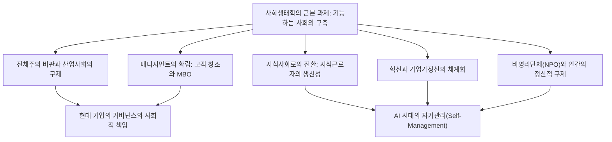
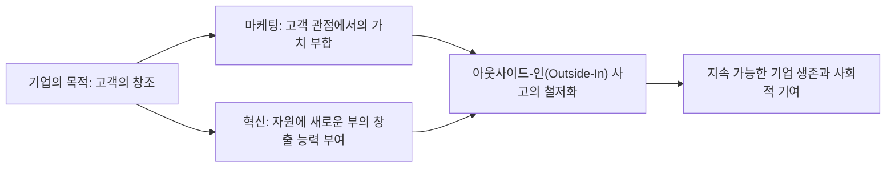
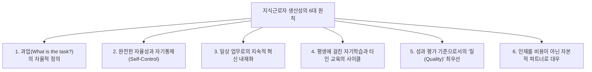
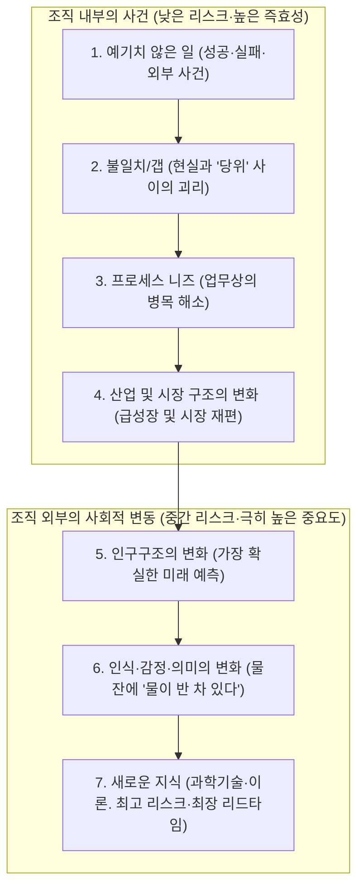

## 1. 서론: 20세기 최고의 지성 피터 드러커의 지평

### 1.1 '경영학의 아버지'라는 호칭의 왜소화와 '사회생태학자'로서의 본질

피터 F. 드러커(Peter Ferdinand Drucker, 1909–2005)의 이름은 전 세계에서 '현대 경영학의 아버지(Father of Modern Management)'로 널리 알려져 있다. 그러나 그 자신은 평생토록 그러한 호칭을 달가워하지 않았다. 드러커가 일생 동안 스스로를 규정하며 고수했던 고유한 직함은 바로 **'사회생태학자(Social Ecologist)'**였다.

생물학에서의 생태학(Ecology)이 동식물과 이를 둘러싼 환경 간의 상호작용 및 동적 평형을 관찰하고 연구하듯, 사회생태학이란 인간이 스스로 구축한 사회적 환경—기업, 정부, 대학, 병원, 교회, 그리고 가족에 이르는 다양한 조직과 제도 속에서 인간이 어떻게 살아가고, 일하며, 관계를 맺고, 사회 질서를 형성하는가를 관찰하는 학문이다.

드러커 관심사의 핵심은 결코 단순한 '기업의 이익을 극대화하는 기교적 테크닉'이나 '경영 관리의 효율화 도구' 따위가 아니었다. 그가 평생에 걸쳐 일관되게 던졌던 근본적인 질문은, **"인간이 자유와 존엄을 유지하며 살아갈 수 있는, 기능하는 사회(a functioning society)를 어떻게 구축할 것인가"**라는 지극히 윤리적·철학적·인간주의적인 물음이었다. 그가 비즈니스와 기업 조직의 분석에 열정을 바친 까닭은, 20세기에 이르러 기업이야말로 사회의 대표적 기관(Representative Institution)이 되었으며 인간의 삶과 정체성을 규정하는 가장 결정적인 무대가 되었기 때문이다.

오늘날 드러커의 저작을 읽는 수많은 비즈니스 실무자와 연구자들은, 그가 제2차 세계대전 이전 유럽에서 나치즘의 발흥을 목격하고 히틀러의 전체주의에 어떻게 맞서야 하는가라는 절박한 정치철학적 절망에서 출발한 인물이라는 사실을 망각하곤 한다. 본 글에서는 드러커의 전 생애와 저작 전반을 관통하는 사상의 복류(伏流)를 추적하며, 그가 인류에게 남긴 광활한 지적 체계를 낱낱이 해명하고자 한다.

---

### 1.2 빈의 황혼, 나치즘의 대두, 그리고 전체주의 비판에서 탄생한 조직론

드러커 사상의 원점을 파악하기 위해서는 그가 나고 자란 합스부르크 제국 말기 빈(Wien)의 지적 토양을 이해해야 한다. 1909년 오스트리아-헝가리 제국의 수도 빈의 유복한 지식인 가정에서 태어난 드러커의 생가에는 지그문트 프로이트, 요제프 슘페터, 루트비히 폰 미제스, 프리드리히 하이에크 등 당시 유럽을 대표하던 최고 지성들이 수시로 드나들었다.

그러나 제1차 세계대전의 발발과 함께 합스부르크 제국은 해체되었고, 이어진 1920년대와 1930년대 유럽 사회는 유례없는 정신적·사회적 붕괴에 직면했다. 전통적인 계급 질서와 종교적 권위는 와해되었으며, 개인은 자신이 발 딛고 서 있던 공동체를 잃어버린 채 고립된 대중으로 전락했다. 엎친 데 덮친 격으로 1929년 세계 대공황이 엄습하면서, 자본주의의 자유시장과 부르주아 민주주의에 대한 절망이 온 유럽을 뒤덮었다.

이 거대한 정신적 공백과 절망의 틈바구니에서 고개를 든 괴물이 바로 히틀러의 국가사회주의(나치즘)와 스탈린의 공산주의라는 양대 전체주의였다. 프랑크푸르트 대학교에서 법학 박사 학위를 취득하고 신문기자로 활동하던 청년 드러커는 독일이 급속도로 나치즘의 암흑 속으로 침잠해 들어가는 과정을 현장에서 생생히 목격했다. 1933년 히틀러가 정권을 장악하자 드러커는 즉시 독일을 탈출하여 영국으로 건너갔고, 이어 1937년 미국으로 망명했다.

드러커에게 있어 파시즘과 전체주의는 단순한 군사적·정치적 광기가 아니었다. 그것은 **"근대 서구 사회가 개인에게 정당한 사회적 지위(Status)와 기능(Function)을 제공하지 못하게 된 결과로 폭발한, 절망적이고 병리적인 반역"**이었다. 따라서 전체주의를 뿌리 뽑기 위해서는 군사적 타도만으로는 턱없이 부족하며, 시민 각자가 사회 안에서 확고한 거점과 역할을 부여받고 자기실현과 존엄을 누릴 수 있는 새로운 '비전체주의적 자유 사회'를 설계해야만 했다. 이 절박한 소명 의식이야말로 드러커를 조직과 매니지먼트의 탐구로 이끈 진정한 원동력이었다.

---

## 2. 드러커 사상의 원점: 전체주의의 절망과 산업사회의 구제

### 2.1 『경제인의 종말』(1939년) ― 마르크스주의와 자본주의의 한계, 파시즘의 병리

망명 중이던 1939년, 드러커는 자신의 첫 번째 기념비적 저작인 『경제인의 종말(The End of Economic Man: The Origins of Totalitarianism)』을 세상에 내놓았다. 당시 30세도 되지 않은 무명의 청년이 쓴 이 책은 윈스턴 처칠의 즉각적인 격찬을 받았으며, 영국군 장교들의 필독서로 지정되었다.

이 책에서 드러커는 나치즘의 본질을 '합리적 악'이 아니라 '합리적인 희망이 절망으로 뒤바뀐 자리에 도래한 주술적 맹신'으로 해부했다. 18세기 이래의 서구 근대 사회는 '경제인(Economic Man)'이라는 인간관 위에 건설되어 있었다. 자본주의는 '시장에서 개인이 자유롭게 사익을 추구하면 보이지 않는 손에 의해 사회 전체의 조화와 번영이 이루어진다'고 약속했고, 마르크스주의는 '프롤레타리아 혁명을 통한 계급 철폐가 진정으로 평등하고 자유로운 사회를 낳을 것'이라고 약속했다.

하지만 자본주의가 초래한 것은 만성적 실업과 극심한 불평등, 그리고 대공황이라는 비극이었으며, 공산주의가 가져온 것은 피로 물든 독재와 강제수용소였다. 두 체제의 신화가 동시에 파탄에 이르렀을 때 서구 사회는 "경제적 자유도, 경제적 평등도 인간의 행복이나 존엄을 결코 보장해 주지 못한다"는 심연의 허무주의(Nihilism)에 빠져들었다.

파시즘은 이 허무의 틈을 파고들었다. 파시즘은 경제적 합리성과 경제적 자유를 공공연히 부정하고, 군국주의적 위계, 인종주의적 신화, 국가 지상주의라는 비합리적 주술을 동원하여 절망에 빠진 대중에게 인위적인 '삶의 의미'와 '소속감'을 주입했다. 드러커는 갈파했다. 파시즘을 거부하고 타도하는 것만으로는 사회가 재생될 수 없다. 경제적 합리성을 포용하면서도 단순한 금전적 보상을 넘어 인간에게 존엄한 시민적 실존을 부여하는 '새로운 사회 질서'를 건설해야만 한다고 말이다.

---

### 2.2 『산업인의 미래』(1942년) ― 인간에게 사회적 지위(Status)와 기능(Function)을 부여하는 공동체

이어서 미국의 참전에 발맞추어 1942년에 출간된 『산업인의 미래(The Future of Industrial Man)』에서, 드러커는 전후 사회의 청사진을 제시했다.

본서의 핵심 개념은 '정통한 권력(Legitimate Power)'과 개인의 '사회적 지위(Status)' 및 '기능(Function)'이다. 건강하고 자유로운 사회가 지속되기 위해서는 반드시 다음의 두 가지 조건이 충족되어야 한다.

1. **정통한 권력**: 사회를 통솔하는 권력이 공동체 구성원들로부터 정당하며 도덕적인 권위를 지닌 것으로 승인받을 것.
2. **지위와 기능**: 개별 구성원이 사회 내에서 뚜렷한 자리(지위)를 확보하고, 사회의 공동선에 대해 고유한 기여를 감당하는 역할(기능)을 누릴 것.

19세기까지의 농경 사회나 초기 상업 사회에서는 가족, 농촌 공동체, 길드가 개인의 지위와 기능을 보장해 주었다. 그러나 제2차 산업혁명으로 거대한 공장과 대기업이 사회의 중심 무대로 떠오르면서 전통적 공동체는 순식간에 해체되었다. 공장 노동자들은 거대한 생산 기계의 대체 가능한 부품으로 전락하여 극심한 사회적 무력감에 짓눌리게 되었다.

드러커는 예견했다. **"만약 근대 산업 기업이 단순한 부를 창출하는 경제적 도구에 머무르고, 일하는 사람들에게 사회적 지위와 기능을 제공하는 '인간적 공동체'로 거듭나지 못한다면, 자유 사회는 머지않아 또다시 전체주의의 망령에 집어삼켜질 것이다."** 기업은 자본가의 사적 소유물이기 이전에, 공적인 사회적 책임을 짊어지는 자율적인 통치 기구(Government)여야 한다는 사상이 여기에 선언된 것이다.

---

### 2.3 『기업의 개념』(1946년) ― 제너럴 모터스(GM) 내부 조사와 근대 거대 조직의 해부

1943년, 드러커에게 일생일대의 의뢰가 찾아왔다. 당시 세계 최대의 제조업체이자 미국 자본주의의 정점에 군림하던 제너럴 모터스(GM) 경영진으로부터 "우리 회사의 경영 구조와 조직 운영 전반을 외부인의 시각에서 철저하게 조사·분석해 달라"는 초빙을 받은 것이다.

드러커는 18개월 동안 GM 본사에 상주하며 최고경영자 앨프리드 슬론(Alfred P. Sloan)을 비롯한 최고위 임원진부터 공장장, 엔지니어, 일선 생산직 근로자에 이르기까지 방대한 인터뷰를 진행하고 경영 회의에 직접 배석했다. 그 조사 결과를 집대성하여 1946년에 발표한 저작이 바로 경영학의 고전 『기업의 개념(Concept of the Corporation)』이다.

이 책은 근대 대기업을 단순한 '경제 조직'이 아니라 **'사회의 구성 단위이자 정치적·사회적 기관'**으로 포착한 인류 최초의 저작이었다. 드러커는 GM의 막강한 경쟁력이 슬론이 구축한 **'사업부제(Decentralization: 분권 관리)'**에 있음을 간파했다. 중앙집권적인 군대식 통제가 아니라 자율적인 사업부 단위로 권한을 위임하고, 시장에서의 경쟁과 경영 책임을 부여함으로써 거대한 덩치를 유지하면서도 현장의 민첩성과 자율성을 살려내는 메커니즘을 이론화한 것이다.

---

### 2.4 슬론과의 사상적 대립: GM식 탑다운 합리주의 vs 인간적 자율 조직론

그러나 『기업의 개념』은 GM 내부에서 거센 반발을 불러일으켰다. 앨프리드 슬론을 비롯한 GM의 중역들은 드러커가 책에서 제안한 '노동자로의 권한 위임', '자기관리형 팀', '공장 공동체의 자치', '근로자의 존엄성과 고용 안정성 모색'과 같은 인간주의적 제언을 단호하게 거부했다.

슬론에게 있어 기업이란 철저히 합리화된 '자본과 기술과 노동을 조합하는 정밀 기계'에 불과했으며, 노동자는 계약에 따라 임금을 대가로 노동력을 공급하는 경제적 단위일 뿐이었다. 슬론은 드러커의 제언을 '감상적인 사회주의적 몽상'이라 일축하며 GM 사내에서 이 책을 금서로 지정했다(역설적이게도 경쟁사였던 포드 모터스의 헨리 포드 2세는 이 책을 탐독하여 빈사 상태에 빠져 있던 포드를 기적적으로 회생시키는 지침서로 삼았다).

슬론과의 이러한 사상적 결별은 드러커의 향후 사유의 궤적을 결정지었다. 드러커는 하향식 관료 통제와 단기 계량 지표 지상주의를 단호히 배격하고, **"인간의 무한한 잠재력과 자기통제에 대한 신뢰에 기반한 자율분산형 매니지먼트"**를 구명하는 데 여생을 바치게 된다.

---

## 3. '매니지먼트'의 탄생과 본질적 체계

### 3.1 『경영의 실제』(1954년)가 정립한 규율

1954년, 드러커는 『경영의 실제(The Practice of Management)』를 세상에 내놓았다. 이 책을 통해 인류 역사상 최초로 '매니지먼트(Management)'라는 행위가 하나의 독립되고 체계적인 학문이자 규율(Discipline)로 확립되었다. 그 이전까지 경영이란 천부적인 재능을 타고난 사업가의 직관이나 카리스마적 지도력, 혹은 재무제표를 주무르는 계산 기술 정도로 치부되었으나, 드러커는 매니지먼트를 '체계적으로 학습하고 습득하여 실천할 수 있는 지식 체계'로 끌어올렸다.

드러커는 매니지먼트가 짊어져야 할 보편적인 3가지 역할을 다음과 같이 정식화했다.

1. **자신이 속한 조직 특유의 사명과 목적을 완수하는 것**: 기업이라면 경제적 성과의 달성, 병원이라면 환자의 치료, 대학이라면 학문 탐구와 인재 교육.
2. **일(Work)을 생산적인 것으로 만들고, 일하는 사람들을 성취하게 하는 것**: 인간의 능력을 최대로 발휘하게 하고, 노동을 통해 존엄성과 자아 성장을 실현하도록 돕는 것.
3. **자신이 사회에 미치는 영향(Impact)을 관리하고, 사회적 문제 해결에 기여하는 것**: 조직의 활동이 사회를 오염시키거나 파괴하는 폐해를 방지하고, 건전한 시민으로서 책무를 다하는 것.

이 3가지 역할은 어느 하나도 소홀히 할 수 없으며, 경영자는 이들 사이에서 항상 역동적인 균형을 유지해야만 한다.

---

### 3.2 기업의 목적은 '고객의 창조'에 있다: 마케팅과 혁신의 쌍대성

드러커의 경영 철학 가운데 가장 널리 회자되면서도 가장 빈번하게 왜곡되는 대목이 바로 '기업의 목적'에 관한 정의다. 드러커는 단호하게 선언한다.

> **"기업의 목적에 대한 타당한 정의는 단 하나뿐이다. 그것은 바로 고객을 창조하는 것이다(There is only one valid definition of business purpose: to create a customer)."**

수많은 경영자와 전통 경제학자들은 "기업의 목적은 이윤의 극대화"라고 철석같이 믿는다. 그러나 드러커의 관점에서 이윤은 결코 기업의 '목적'이 될 수 없으며, 기업이 존속하고 미래의 불확실성과 리스크를 감당하기 위해 충족해야 하는 '조건(Condition)' 또는 '제약(Limitation)'에 불과하다. 심장이 뛰고 산소를 들이마시는 것이 인간 생존의 필수 조건일지언정 숨 쉬는 행위 자체가 인생의 목적이 될 수 없는 것과 완벽히 같은 이치다.

고객이 존재하지 않는다면 그 어떤 거대 기업도 하루아침에 소멸한다. 고객이란 자연발생적으로 주어지는 것이 아니라, 기업의 끊임없는 활동을 통해 비로소 발굴되고 창조되는 것이다. 그리고 고객을 창조하기 위해 모든 기업 조직이 수행해야 할 **본질적인 기본 기능(Basic Functions)은 오직 두 가지**뿐이다.

1. **마케팅(Marketing)**: 고객의 진정한 욕구, 현실, 가치관을 철저히 파악하여 제품과 서비스를 고객에게 완벽하게 일치시키는 활동. "탁월한 마케팅은 판매(Sales, 강요된 세일즈)를 불필요하게 만든다."
2. **혁신(Innovation)**: 기존의 자원에 새로운 부를 창출하는 역량을 불어넣는 활동. 경제적·사회적으로 새로운 가치를 끊임없이 제공해 나가는 것.

마케팅과 혁신을 제외한 모든 기업 활동(인사, 재무, 회계, 구매, 물류 등)은 이 두 가지 핵심 기능을 뒷받침하기 위해 수반되는 '비용(Cost)'에 불과하다. 진정한 이익을 만들어내는 유일한 원천은 오직 조직 바깥에 존재하는 '고객의 만족'뿐이다.

---

### 3.3 목표관리 제도(MBO: Management by Objectives and Self-Control)의 진실

드러커가 『경영의 실제』에서 제안한 가장 혁명적인 개념 중 하나가 바로 '목표와 자기통제에 의한 관리(Management by Objectives and Self-Control: MBO)'이다.

오늘날 전 세계 거의 모든 기업이 'MBO'라는 이름의 인사평가 제도를 운용하고 있다. 그러나 드러커 자신이 말년에 뼈아프게 한탄했듯이, **현대 기업에서 실행되는 MBO의 99%는 드러커의 본래 의도와는 정반대인 하향식 '할당량(노르마) 관리 도구'로 전락해 버렸다.**

드러커가 제창한 MBO의 진정한 정수는 뒷부분에 붙은 단어, 즉 **'자기통제(Self-Control)'**에 있다. 전통적인 관리 방식은 상사가 부하에게 일방적으로 목표를 하달하고, 진척을 감시하며, 상벌로 조종하는 '외발적 통제(External Control)'였다. 이는 인간을 수동적인 기계 부품으로 다루던 테일러주의의 잔재에 불과하다.

이에 반해 드러커의 참된 MBO는 다음과 같은 자율적 프로세스를 요구한다.

1. 조직 전체의 공통 사명과 궁극적 목표를 전 구성원이 깊이 공유한다.
2. 개별 근로자가 전체 목표에 비추어 "내가 조직에 무엇을 기여해야 하는가"를 스스로 고민하고, 자신의 주도하에 목표를 세운다.
3. 자신의 성과와 진행 상황을 스스로 측정할 수 있는 객관적인 정보와 피드백을, 상사를 거치지 않고 **자기 자신이 직접 실시간으로 확인할 수 있는 환경**을 구축한다.
4. 스스로의 진척을 스스로 통제하며, 문제가 생기면 자율적으로 궤도를 수정한다.

MBO는 결코 상사의 감시와 지배를 강화하기 위한 수단이 아니라, **"외부의 간섭과 지시를 불필요하게 만들고, 일하는 사람 한 명 한 명을 자율적인 프로페셔널로 해방시키기 위한 인간주의적 철학"**이다. 드러커는 내재적 동기부여(Intrinsic Motivation)와 자기책임에 기초한 자율성만이 인간의 존엄을 지켜주고 조직에 궁극의 성과를 가져다준다고 확신했다.

---

### 3.4 성과(Results)의 정의와 자원 배분: 기업의 8대 중요 영역

드러커는 기업의 활동을 단 하나의 단기 지표(매출액이나 당기순이익)로만 재단하는 근시안적 태도를 엄중히 경고했다. 기업이 건강하게 살아남아 사회적 책임을 완수하기 위해서는, 다음의 **8대 중요 영역(Key Result Areas)** 전반에 걸쳐 균형 잡힌 목표를 수립하고 추적해야 한다.

| 영역 | 내용과 중요성 |
| :--- | :--- |
| **1. 마케팅** | 기존 시장에서의 점유율뿐 아니라 신규 시장 개척 및 고객 창조의 수준. |
| **2. 혁신** | 제품·서비스뿐만 아니라 조직 구조, 업무 프로세스, 비즈니스 모델 전반의 혁신. |
| **3. 인적 자원과 조직 역량** | 직원의 역량 개발, 직무 몰입도, 차세대 리더십 육성, 팀의 자율성. |
| **4. 재무 자원** | 성장에 필요한 투자 자금의 조달력, 현금흐름의 건전성, 자본의 최적 배분. |
| **5. 물적 자원** | 공장, 기계 설비, 사무 환경, 디지털 인프라 등 생산 기반의 효율성과 현대화. |
| **6. 생산성** | 투입된 자원(노동, 자본, 시간, 원자재) 대비 창출된 부가가치의 비율. |
| **7. 사회적 책임** | 지역사회, 자연환경, 법규 준수, 윤리적 기준에 대한 성실성과 적극적 기여. |
| **8. 필요 이익** | 위의 7가지 목표를 완수하고 미래의 불확실성과 리스크를 감당하기 위해 필수적인 이익 수준. |

드러커 경영 사상의 진수는 **"이익은 목적이 아니라 조건이다"**라는 명제로 수렴된다. 이익이란 과거의 경영 성과를 나타내는 성적표인 동시에, 미래의 리스크라는 불확실성의 비용을 치르기 위해 반드시 적립해 두어야 하는 '사업 존속을 위한 보험료'인 것이다.

---

## 4. 지식사회의 예견과 '지식근로자(Knowledge Worker)'의 출현

### 4.1 『단절의 시대』(1969년)에서 『자본주의 이후의 사회』(1993년)로

드러커가 남긴 무수한 예언 가운데 인류 역사에 가장 지대한 충격을 던진 것은 바로 '지식사회(Knowledge Society)'의 도래에 대한 통찰이었다. 1959년 출간된 『내일의 이정표(Landmarks of Tomorrow)』에서 드러커는 인류 역사상 최초로 **'지식근로자(Knowledge Worker)'**라는 단어를 세상에 소개했다.

이어 1969년의 기념비적 저작 『단절의 시대(The Age of Discontinuity)』에서 그는 산업혁명 이래 지속되어 온 경제 구조의 거대한 지각변동을 선언했다. 고전 경제학은 부를 창출하는 3대 생산 요소로 '토지(자연자원)', '노동(육체노동)', '자본(공장과 기계)'을 꼽아왔다. 그러나 드러커는 20세기 후반을 기점으로 이러한 전통적 생산 요소들이 부차적인 위치로 물러앉았으며, **'지식(Knowledge)'이야말로 유일하게 결정적인 생산 요소**가 되는 전대미문의 신세계가 열렸다고 설파했다.

1993년의 『자본주의 이후의 사회(Post-Capitalist Society)』에서 드러커는 이 통찰을 한층 심화시켰다. 자본주의 사회에서 권력을 쥐고 있던 자는 자본의 소유자(부르주아, 금융투자자)였다. 하지만 지식사회에서 진정한 자본은 '일하는 인간의 두뇌 속에 축적된 지식'이다. 지식근로자는 생산수단(지성과 고도의 전문성)을 자신의 머릿속에 소유한 채 자유롭게 이동하기 때문에, 역사상 최초로 조직과 개인 사이의 힘의 역학 관계가 역전되었다.

---

### 4.2 육체노동(테일러주의)에서 지식노동으로의 역사적 대전환

20세기가 이룩한 가장 눈부신 경제적 기적은 프레더릭 테일러(Frederick Winslow Taylor)가 창시한 '과학적 관리법' 덕분에 **육체노동자의 생산성이 50배 가까이 폭발적으로 향상된 사건**이었다. 테일러는 주먹구구식 경험에 의존하던 장인들의 작업을 시간·동작 연구를 통해 미세한 단위 동작으로 분해하고 재구성했다. 이 생산성 혁명이 대량생산과 대량소비를 가능하게 하여 거대한 중산층을 탄생시켰고, 서구 선진국을 마르크스주의 혁명의 위협으로부터 구해냈다.

그러나 드러커는 엄중하게 경고했다. "20세기 매니지먼트가 달성한 최대 공헌이 육체노동의 생산성 향상이었다면, **21세기 매니지먼트가 직면한 최대 과제는 바로 지식노동의 생산성을 향상시키는 것이다.**"

육체노동과 지식노동 사이에는 근본적이고 본질적인 차이가 가로놓여 있다.

| 특징 | 육체노동(Manual Work) | 지식노동(Knowledge Work) |
| :--- | :--- | :--- |
| **업무의 정의** | 업무 내용은 사전에 규정되어 있으며 의문의 여지가 없다(예: 철골 운반, 나사 조이기). | **"과업은 무엇인가? 무엇을 위해 일하는가?"**를 작업자 스스로 정의해야 한다. |
| **자율성** | 작업 절차와 매뉴얼에 순종하는 것이 미덕이며, 외부에서 엄격히 통제된다. | **자율성(Autonomy)**이 절대적이며, 스스로를 관리하지 못하면 성과를 낼 수 없다. |
| **지속적인 혁신** | 혁신은 외부의 전문 엔지니어나 공정 설계자가 주도한다. | 지식근로자 스스로가 일상 업무 속에 **지속적인 혁신**을 체화해야 한다. |
| **학습과 교육** | 기술을 한 번 숙달하면 반복적 숙련을 통해 효율이 증대된다. | 지식의 진부화가 극도로 빨라, **평생에 걸친 지속적인 학습과 교육**이 필수적이다. |
| **평가의 기준** | 주로 **'양(Quantity)'**(단위 시간당 생산량). | 주로 **'질(Quality)'**(얼마나 탁월한 통찰과 해결책을 창출했는가). |
| **생산수단의 소유** | 공장, 기계, 설비는 **자본가가 소유**한다. | 핵심 생산수단(지식, 전문성, 판단력)은 **근로자의 두뇌**에 귀속된다. |

지식노동에서는 '무작정 성실하게 오랜 시간 일하는 것'이 결코 성과를 보장하지 않는다. 잘못된 질문을 붙들고 아무리 효율적으로 정답을 도출해 보아야 그것은 완벽한 낭비에 불과하다. 지식노동의 생산성 향상은 테일러 식의 감시와 통제로는 절대로 이룰 수 없으며, 경영의 근본적인 패러다임 전환을 요구한다.

---

### 4.3 지식근로자의 생산성을 결정짓는 6대 원칙

드러커는 『21세기 지식경영(Management Challenges for the 21st Century, 1999)』에서 지식근로자의 생산성을 끌어올리기 위한 **'6대 조건'**을 명료하게 규정했다.

1. **"과업은 무엇인가(What is the task?)"를 끊임없이 물어야 한다**: 지식노동에서 가장 결정적인 단계는 해야 할 과업이 무엇인지를 명확히 규정하는 것이다. 불필요한 일을 효율적으로 처리하는 것만큼 유해한 일은 없다.
2. **완전한 자율성을 부여해야 한다**: 지식근로자는 스스로를 관리해야 한다. 자율성만이 진정한 책임감과 프로페셔널리즘을 낳는다.
3. **지속적인 혁신을 업무 프로세스 안에 내재화해야 한다**: 자신의 전문 영역에서 언제나 새로운 방법과 가치를 자발적으로 탐구해야 한다.
4. **지속적인 학습과 가르침의 선순환을 구축해야 한다**: 지식근로자는 지식을 배우는 학생인 동시에 동료와 후배를 가르치는 멘토여야 한다. 남을 가르치는 것만큼 자신의 지식을 체계화하고 심화시키는 방법은 없다.
5. **양적인 양산보다 질적인 우수성을 최우선해야 한다**: 무의미한 100장의 보고서보다 본질을 꿰뚫는 한 장의 분석이 기업의 운명을 결정짓는다.
6. **지식근로자를 '비용'이 아니라 '자산'이자 '파트너'로 대우해야 한다**: 지식근로자는 조직의 부속품이 아니라 자신의 소중한 지적 자본을 스스로 투자하는 동반자다.

---

### 4.4 "지식근로자는 스스로 자신의 CEO여야 한다": 자기관리론

지식사회의 도래는 개인의 삶의 방식에도 근본적인 혁명을 요구한다. 드러커는 1999년의 기념비적 논문 「프로페셔널의 조건 / 자기관리(Managing Oneself)」를 통해 현대의 모든 지식근로자를 향해 강력한 경종을 울렸다.

전근대 사회의 인간은 태어난 신분과 가업에 의해 평생의 직업이 결정되었다. 산업사회에서도 대기업에 입사하면 정년퇴직 때까지 회사가 경력의 사다리를 깔아주었다. 그러나 지식사회에서는 **"자신의 경력은 자신이 직접 설계해야 하며, 자신의 성과는 자신이 직접 경영해야 한다."** 평균 수명이 80세를 훌쩍 넘는 현대 사회에서, 기업의 평균 수명(약 30년)은 개인이 일할 수 있는 기간보다 훨씬 짧아졌다. 이제 모든 지식근로자는 자기 자신을 독립된 1인 기업(자신 주식회사)의 최고경영자(CEO)로 재정의해야 한다.

드러커가 제시한 구체적인 자기관리 실천 기법은 다음과 같다.

#### ① 자신의 강점(Strengths)을 파악하라
드러커 인간학의 절대적인 핵심은 **"인간은 오직 강점을 통해서만 성과를 낼 수 있다. 결코 약점을 보완함으로써 성과를 올릴 수는 없다"**는 통찰이다.

전통적인 학교 교육과 기업 연수는 개인의 약점과 단점을 찾아내어 그것을 평범한 수준으로 끌어올리는 데 막대한 에너지를 낭비한다. 그러나 무능을 평범함으로 끌어올리는 데는 엄청난 노력이 드는 반면, 이미 일류인 강점을 독보적인 초일류로 연마하는 데 드는 에너지는 훨씬 적다.

자신의 진정한 강점을 발견할 수 있는 유일하게 신뢰할 수 있는 방법으로 드러커는 **'피드백 분석(Feedback Analysis)'**을 제시했다.
- 중요한 의사결정을 내리거나 행동에 착수할 때마다, **"앞으로 일어날 것으로 기대하는 결과"를 미리 기록해 둔다**.
- 9개월 혹은 1년 뒤, **실제로 나타난 결과와 자신이 기록해 두었던 기대치를 엄밀하게 대조·비교한다**.
- 이를 수년간 반복하면, 자신이 무엇에 탁월한 재능이 있고, 어떠한 강점을 발휘할 때 최고의 결과가 나오며, 반대로 무엇에 무능한지가 냉혹할 만큼 객관적으로 드러난다.

#### ② 자신의 일하는 방식(How I Perform)을 알라
강점 못지않게 중요한 것이 자신의 행동 양식과 인지적 스타일을 파악하는 일이다.
- **나는 '읽는 자(Reader)'인가, 아니면 '듣는 자(Listener)'인가?** (아이젠하워 대통령은 전형적인 읽는 자였기에 기자회견의 구두 질문에 실언을 연발했으나, 서면 보고서를 먼저 읽고 브리핑을 받자 탁월한 역량을 발휘했다. 반면 루스벨트와 트루먼은 전형적인 듣는 자였다).
- **나는 어떻게 학습하는가?** (직접 글을 쓰며 배우는가, 타인과 대화하며 배우는가, 현장에서 실천하며 배우는가).
- **나는 의사결정자(Decision Maker)로서 성과를 내는가, 아니면 조언자(Adviser)로서 역량을 발휘하는가?** (탁월한 2인자 참모가 최고경영자 자리에 오르자마자 우유부단함에 빠져 조직을 파멸로 몰고 간 사례는 역사에 부지기수다).

#### ③ 인생의 후반부(Second Career)를 준비하라
육체노동자는 육체의 노쇠와 함께 은퇴하지만, 지식근로자는 40대 중반에서 50대에 이르러 자신의 일에 권태를 느끼고 '번아웃(Burnout)'에 빠지기 쉽다. 한 가지 일을 20년 넘게 반복하면 더 이상 배울 것이 없고 성장은 멈춘다.

드러커는 마흔 살이 되기 전에 **'제2의 활동 영역(패러렐 커리어, 비영리 자원봉사, 학문적 탐구 등)'**을 개척하기 시작하라고 강력히 권고했다. 본업 이외의 또 다른 세상을 갖고, 지역사회나 NPO에서 자신의 강점을 발휘해 타인에게 기여할 수 있는 무대를 마련해 두는 것. 그것이야말로 조직에서의 좌천이나 실직에 직면했을 때 인간의 정신적 존엄을 지켜내고, 풍요롭고 의미 있는 인생의 후반부를 완주할 수 있는 유일한 방파제가 된다.

---

## 5. 혁신과 기업가정신의 체계적 기법

### 5.1 『혁신과 기업가정신』(1985년)

많은 이들은 혁신을 가리켜 "소수의 천재나 괴짜가 야밤에 번개처럼 번뜩이는 영감"이라고 믿는다. 혹은 천문학적인 연구개발비(R&D)를 쏟아부어 세상을 뒤흔들 과학적 대발견을 기다리는 것이라 여긴다.

1985년, 드러커는 『혁신과 기업가정신(Innovation and Entrepreneurship)』을 저술하여 이러한 낭만주의적 혁신 환상을 산산조각 냈다. 드러커에게 혁신이란 천재의 번뜩임이 아니라, **"의도적이고 체계적으로 학습하고 훈련하여 실천할 수 있는 하나의 규율(Discipline)"**이다.

드러커는 혁신을 다음과 같이 정의한다.
> **"혁신이란 자원에 새로운 부의 창출 역량을 부여하는 것이다. 아니, 혁신이 일어나기 전에는 애초에 '자원'이라는 것 자체가 존재하지 않는다. 인간이 유용한 용도를 찾아내어 경제적 가치를 부여하기 전까지는, 그 어떤 식물도 한낱 잡초에 불과하며, 그 어떤 광석도 쓸모없는 돌덩이에 지나지 않는다."**

석유는 19세기 중반 정제 기술과 내연기관이 발명되기 전까지는 농토를 오염시키는 불쾌한 기름 찌꺼기에 불과했다. 그것을 막대한 부를 창출하는 '자원'으로 탈바꿈시킨 것은 과학기술 그 자체라기보다는, 기술을 사회적 필요와 결합해 낸 혁신이었다.

---

### 5.2 '번뜩임'의 신화를 깨부수다: 혁신의 체계적인 7가지 기회

드러커는 기업과 조직이 일상적으로 탐색해야 할 **'혁신의 7가지 기회(The Seven Sources for Innovative Opportunity)'**를 체계화했다. 이들은 성공 확률이 높고 위험이 낮은 순서대로 정밀하게 배열되어 있다.

#### ① 예기치 않은 일(The Unexpected)
가장 위험이 적고 가장 풍요로운 결실을 안겨주지만, 기존 기업들이 가장 무신경하게 지나치는 것이 바로 '예기치 않은 성공(Unexpected Success)'과 '예기치 않은 실패(Unexpected Failure)'다.
- **예기치 않은 성공**: IBM이 초기 대형 메인프레임 컴퓨터를 개발했을 때, 순수 과학 계산용으로 설계된 기계가 웬일인지 은행과 보험회사의 사무 처리용으로 불티나게 팔려나갔다. 당시 경영진은 "원래 용도가 아니다"라며 당황했으나, IBM은 이 뜻밖의 수요에 전력을 집중함으로써 훗날 세계를 지배한 컴퓨터 제국을 건설했다.
- 대다수 기업은 월례 경영회의에서 '예산 미달 항목(실패)'만을 붙들고 몇 시간씩 문책과 논쟁을 벌이며, 계획을 훌쩍 뛰어넘어 폭발적으로 팔리는 '예기치 않은 성공'은 한낱 요행으로 치부해 버린다. 드러커는 월간 보고서의 맨 첫 페이지에는 오직 '예기치 않은 성공'만을 기록하고, 그곳에 가장 유능한 인재를 전진 배치하라고 역설했다.

#### ② 불일치(Incongruities)
"당연히 이래야 한다"는 업계의 고정관념이나 이론과, "실제로 벌어지고 있는 현실" 사이의 틈새.
- 1950년대 해운업계는 선박의 운항 속도를 높이고 연료 효율을 개선하기 위해 막대한 자금을 쏟아부었으나 수익성은 날로 악화되었다. 진정한 비용 유발 요인은 '바다 위를 항해하는 시간'이 아니라 '항구에 닻을 내리고 화물을 싣고 내리기 위해 대기하는 정박 시간'에 있었기 때문이다. 이 불일치를 꿰뚫어 본 말콤 맥린(Malcolm McLean)이 고안한 것이 바로 '컨테이너선(Containerization)'이다. 배 자체의 성능은 그대로 둔 채, 육상 운송과 해상 운송을 규격화된 상자(컨테이너)로 직결시킴으로써 하역 시간을 수주일에서 수시간으로 단축시켰고, 글로벌 무역의 폭발적 팽창을 촉발했다.

#### ③ 프로세스 니즈(Process Need)
기존의 업무 프로세스 내에 존재하는 '빠져 있는 고리(Missing Link)'나 병목 현상을 해결하고자 하는 절박한 요구.
- 필름 인화 현상 과정을 생략하고자 했던 열망에서 탄생한 폴라로이드 카메라, 장거리 전화의 수동 교환 업무를 자동화하기 위해 개발된 전자식 전화 교환기 등.

#### ④ 산업 및 시장 구조의 변화(Industry and Market Structures)
특정 산업이 연간 10% 이상의 고속 성장을 구가할 때, 기존의 시장 구조는 붕괴하고 구세력과 신세력의 교체가 일어난다.
- 자동차 산업의 급성장기에 볼보가 '안전'이라는 차별화된 가치에 집중한 사례나, 금융 규제 완화(빅뱅) 속에서 태동한 온라인 증권사의 약진.

#### ⑤ 인구구조의 변화(Demographics)
**"이미 일어난 미래(The Future that has already happened)"** 가운데 가장 확실하고 정확하게 예측할 수 있는 요인이 바로 인구통계학적 변화(출산율, 사망률, 연령대별 구성, 교육 수준 등)다.
- 20년 뒤에 스무 살이 될 청년의 숫자는 오늘 태어난 신생아의 숫자를 세어보면 100% 정확하게 알 수 있다. 저출산 고령화, 생산가능인구의 감소, 고학력화 등은 수십 가지 이상의 거대한 혁신 기회를 열어젖힌다.

#### ⑥ 인식·감정·의미의 변화(Changes in Perception)
객관적인 사실 자체는 조금도 변하지 않았음에도, 사람들의 '인식의 틀'이 바뀌는 순간.
- "물잔에 물이 반이나 차 있다"고 보던 사람들이 갑자기 "물잔에 물이 반밖에 남지 않았다"고 느끼기 시작하는 심리적 반전. 의학의 눈부신 발전으로 인류 역사상 가장 긴 수명과 건강을 누리게 된 현대인들이, 오히려 건강 불안증에 휩싸여 유기농 식품, 피트니스, 웰빙에 열광하게 된 것은 객관적 건강의 악화가 아니라 '건강을 바라보는 인식의 변화'가 창출해 낸 천문학적인 혁신 시장이다.

#### ⑦ 새로운 지식(New Knowledge)
과학기술, 학문적 이론, 새로운 발명에 기반한 혁신.
- 흔히 대중이 "이것이야말로 혁신의 전부"라고 맹신하는 분야다. 그러나 드러커는 경고한다. **새로운 지식에 기초한 혁신은 7가지 기회 가운데 성공 확률이 가장 낮고, 가장 막대한 자본이 소요되며, 시장에 안착하기까지의 리드타임이 가장 길다** (기초 지식의 발견에서 실용화까지 대개 25~30년이 걸린다). 게다가 여러 분야의 이질적인 지식들이 하나로 융합(Convergence)되지 않으면 상용화되지 못하므로, 투기적 위험이 극도로 높다.

---

### 5.3 체계적 폐기(Systematic Abandonment): 어제의 성공을 의도적으로 버리는 결단

혁신을 일구어내기 위해 경영자가 밟아야 할 가장 결정적인 첫 번째 단계는 "새로운 아이디어를 짜내는 것"이 아니다. 드러커는 단호하게 못 박는다. **"혁신의 제1보는 낡은 것, 더 이상 생산적이지 못한 것, 어제의 성공을 체계적으로 폐기(Abandonment)하는 용기다."**

모든 조직은 과거의 영광을 누렸던 기존 제품, 기존 서비스, 기존 사업부를 연명시키기 위해 가장 유능한 핵심 인재와 귀중한 자금을 묶어두는 치명적 오류를 범한다. 한때 큰 성공을 가져다준 사업일수록 사내의 정치적 성역이 되어 그 누구도 사업 철수를 입 밖에 내지 못한다. 그 결과 미래를 창조할 자원은 고갈된다.

드러커는 모든 경영자에게 주기적으로 스스로를 향해 다음과 같은 냉혹한 질문을 던질 것을 요구했다.

> **"만약 우리가 오늘 이 사업을 하고 있지 않다고 가정했을 때, 지금 우리가 알고 있는 모든 지식과 정보를 가진 상태에서, 과연 우리는 지금 이 사업에 다시 뛰어들겠는가?"**

만약 이 질문에 대한 대답이 단호한 "아니오(No)"라면, 경영자는 즉시 다음 질문을 던져야 한다. "그렇다면 우리는 오늘 이 사업에 대해 무엇을 조치해야 하는가?" 그것은 결코 미온적인 개선이나 현상 유지가 아니어야 하며, 계획적이고 단호한 사업 철수와 폐기여야 한다. 죽은 세포를 배출하지 못하는 유기체가 생명을 유지할 수 없듯이, 어제의 성공을 체계적으로 폐기하지 못하는 기업은 반드시 질식사하고 만다.

---

## 6. 조직의 거버넌스와 사회적 책임, 그리고 비영리조직(NPO)의 의의

### 6.1 『매니지먼트』(1973년)의 3대 과업과 사회적 책임의 본질

1973년, 드러커는 자신의 경영 철학을 집대성하여 전 2권 1,000페이지가 넘는 기념비적 대작 『매니지먼트: 과업, 책임, 실천(Management: Tasks, Responsibilities, Practices)』을 발표했다.

이 책에서 드러커는 '기업의 사회적 책임(CSR: Corporate Social Responsibility)'이라는 개념을 현대의 피상적인 환경 보호 캠페인이나 자선적 기부(Philanthropy)와는 차원이 다른 심오한 시각으로 규명했다. 드러커의 사유 체계에서 사회적 책임은 엄격하게 두 가지 영역으로 나뉜다.

1. **자신의 활동이 사회에 미치는 부정적 영향(Impacts)의 처리**:
   - 매연, 소음, 산업폐기물, 근로자의 직업병 등 조직이 본연의 활동을 수행하는 과정에서 의도치 않게 사회나 자연환경에 끼치는 유해한 영향.
   - 드러커의 원칙은 단호하다. **"자신이 사회에 미치는 악영향은 아무리 많은 비용이 들더라도 자신의 책임하에 완전히 제로(0)로 억제해야 한다."** 이를 방치하는 것은 사회에 대한 배신이며 조직 스스로 자신의 존립 기반을 무너뜨리는 자해 행위다.
2. **사회 자체가 안고 있는 문제(Social Problems)의 해결**:
   - 빈곤, 교육 격차, 고령화, 환경 파괴 등 자신의 사업 활동과 직접적 인과관계가 없는 사회 전반의 구조적 병리 현상.
   - 이에 대해 드러커는 극히 현실주의적인 원칙을 세웠다. "사회 문제의 해결은 조직 자신의 고유한 역량과 강점을 활용하여 **수익을 창출하는 사업 기회(비즈니스)로 전환할 수 있을 때에 한하여** 뛰어들어야 한다." 자신의 역량을 벗어난 사회 문제에 감상적으로 손을 대어 본업의 경쟁력을 갉아먹고 파산하는 것은 무책임의 극치다.

---

### 6.2 왜 드러커는 말년에 비영리단체(NPO/NGO)에 모든 열정을 쏟았는가

1980년대 이후 이미 세계 최고 지성의 반열에 올라 있던 드러커는 자신의 지적 에너지를 대학, 병원, 걸스카우트, 구세군, 교회와 같은 '비영리조직(NPO/NGO: Non-Profit Organizations)'의 경영 연구와 컨설팅에 쏟아부었다. 1990년에는 역작 『비영리단체의 경영(Managing the Non-Profit Organization)』을 출간했다.

왜 드러커는 자본주의의 최첨단에서 비영리 영역으로 뱃머리를 돌렸을까? 거기에는 그의 평생 화두였던 '기능하는 사회'를 완성하기 위한 필연적인 이유가 자리 잡고 있었다.

기업은 '제품과 서비스'를 공급하여 경제적 고객을 창조한다. 정부는 '법률과 행정 규제'를 집행하여 사회 질서를 유지한다. 하지만 **기업도 정부도 결코 "인간의 영혼을 변화시키고 공동체를 회복시키는 일"은 해낼 수 없다.**
- 병원의 사명은 흑자를 내는 것이 아니라 병든 인간을 치유하는 것이다.
- 교회의 사명은 신도들의 영혼을 구원하는 것이다.
- 구세군의 사명은 알코올 중독자를 자립적이고 자긍심 넘치는 시민으로 재탄생시키는 것이다.

드러커는 갈파했다. **"비영리조직이 만들어내야 할 궁극적인 결과물은 바로 '변화된 인간(A Changed Human Being)' 그 자체다."**

나아가 드러커는 세상을 깜짝 놀라게 한 역설을 제시했다. 수많은 사람들은 비영리단체가 비즈니스 기업으로부터 효율적 경영 기법을 배워야 한다고 생각했다. 그러나 드러커는 정반대로 **"오히려 영리 기업이야말로 탁월한 비영리단체로부터 참된 매니지먼트의 본질을 배워야 한다"**고 역설했다.

왜냐하면 비영리조직은 일하는 사람들을 돈(월급)으로 옭아맬 수 없으며, 구성원의 대다수가 자원봉사자이기 때문이다. 그들은 오직 '숭고한 사명(Mission)'과 '자신의 기여에 대한 긍지' 하나만으로 헌신한다. 금전적 보상이라는 미봉책이 통하지 않기에, 비영리조직의 리더는 명확한 사명의 공유, 핵심 가치관의 일치, 엄격한 자기통제를 이끌어내지 못하면 조직을 단 하루도 유지할 수 없다. 이처럼 자원봉사자를 하나로 묶어 성과를 내는 고도의 매니지먼트 기법이야말로, 지식근로자를 파트너로 대우해야 하는 21세기 비즈니스 기업이 배워야 할 최고의 교과서인 것이다.

---

## 7. 현대 및 AI 시대 피터 드러커 사상의 재평가

### 7.1 생성형 AI와 지식사회의 새로운 패러다임 시프트

2020년대, ChatGPT로 대표되는 대규모 언어 모델(LLM)과 생성형 AI의 폭발적 진화로 인해, 지식사회는 드러커 자신조차 미처 상상하지 못했던 극적인 전환점에 도달했다.

지금껏 '지식노동'의 정수로 여겨졌던 코딩, 전문 보고서 작성, 방대한 데이터 분석, 법률 판례 조사, 의료 진단 보조와 같은 고도의 지적 작업들이 이제 AI에 의해 순식간에, 그것도 인간을 압도하는 정확도로 자동화되고 있다. 과거 테일러주의가 육체노동을 기계화하고 자동화했던 것과 정확히 동일한 현상이 이제 화이트칼라 지식노동의 심장부에서 벌어지고 있는 것이다.

이 AI의 대격변 속에서 드러커의 사상은 낡은 유물이 되기는커녕 그 어느 때보다 경이로운 빛을 발하고 있다. 드러커가 언제나 역설했던 핵심은, **"정답을 찾아 실행하는 것(Execution)은 컴퓨터가 할 일이며, 진정으로 인간다운 고유한 영역은 '올바른 질문을 던지는 것(Asking the Right Questions)'에 있다"**는 사실이었다.

AI는 주어진 프롬프트(질문과 지시)에 맞추어 인류의 방대한 지식을 조합하고 완벽한 답을 생성해 내는 데는 비할 데 없이 탁월하다. 그러나,
- "우리 조직이 추구해야 할 참된 사명은 무엇인가?"
- "고객에게 진정한 가치란 무엇인가?"
- "우리가 당장 내일 폐기해야 할 어제의 성공은 무엇인가?"
- "우리는 우리 사회와 인간에 대해 어떤 도덕적 책임을 져야 하는가?"

와 같은 근본적인 질문을 스스로 던지는 것은 AI로서는 원천적으로 불가능하다. AI가 일상적인 지적 연산과 데이터 처리를 떠맡으면 떠맡을수록, 인간에게 남겨지는 유일무이한 최고봉의 과업은 드러커가 평생을 바쳐 설파했던 '가치 판단', '윤리적 결단', '사명의 정의', '인간적 연대'라는 매니지먼트의 철학적 차원으로 고도화되는 것이다.

---

### 7.2 애자일, OKR, 틸(Teal) 조직과의 연결과 본질적 일치

현대 비즈니스를 선도하는 최첨단 조직론인 '애자일(Agile)', 'OKR(Objectives and Key Results)', 혹은 프레데릭 라루(Frederic Laloux)가 제창한 '틸 조직(Teal Organization: 자율경영 조직)'을 깊이 연구해 본 사람이라면, 그 모든 현대적 기법의 뿌리가 이미 반세기 전에 드러커가 정립한 사상과 완벽하게 맞닿아 있다는 사실에 경탄을 금치 못한다.

- **애자일의 고객 중심주의와 기민한 반복 개선**은, "기업의 목적은 고객의 창조에 있으며 일상 업무 속에 마케팅과 혁신을 체화해야 한다"는 드러커의 명제 그 자체다.
- **인텔의 앤디 그로브가 고안하고 구글이 대중화한 OKR**은, 드러커의 MBO(목표와 자기통제에 의한 관리)를 현대적으로 계승한 직계 후손이다.
- **틸 조직의 자율경영(Self-Management)과 온전성(Wholeness)의 추구**는, 드러커가 『산업인의 미래』 이래 평생토록 갈망했던 "일하는 사람들에게 사회적 지위와 기능을 부여하고, 자기통제를 통해 움직이는 인간주의적 공동체"의 현대적 구현에 다름 아니다.

드러커의 경영 사상은 결코 철 지난 클래식이 아니다. 오늘날 찬사를 받는 모든 혁신적 경영 프레임워크는 드러커라는 거인의 어깨 위에 올라타, 그가 일구어 놓은 지식의 비옥한 대지에서 피워 올린 과실에 불과하다.

---

### 7.3 결론: 아직 실현되지 않은 '기능하는 사회'를 향하여

피터 드러커는 95세를 일기로 파란만장한 생을 마감하기 직전까지 왕성한 집필과 강연을 멈추지 않았다. 그의 방대한 저작 전체를 관통하여 독자의 가슴속에 마지막으로 울려 퍼지는 메시지는, 한낱 경영 성공의 처세술이 아니라 **"인간이라는 존재에 대한 깊은 신뢰와, 사회에 대한 무한한 책임감"**이다.

이윤 추구 그 자체가 목적이 되어버리고, 단기적 주주자본주의가 인간과 환경을 소모품으로 전락시키며, 눈부신 기술 발전이 외려 인간의 존엄을 위협하는 21세기의 오늘날이야말로, 우리는 드러커의 원점으로 되돌아가야 한다.

조직이란 인간의 강점을 결집하여 사회적 성과를 일구어내고 인간의 약점을 무력화하기 위한 도구다. 매니지먼트란 타인 위에 군림하여 권력을 휘두르는 기술이 아니라, 사람에게 책임을 부여하고, 사람을 성장시키며, 자유와 존엄을 누리게 하는 숭고한 윤리적 실천이다.

드러커가 그토록 염원했던 "모든 개인이 긍지와 존엄을 품고 일하며, 자율적인 시민으로서 사회에 기여할 수 있는, 기능하는 자유 사회"의 완성은 여전히 미완의 과제로 남아 있다. 그 위대한 바통을 이어받아 자신이 발 딛고 선 일터와 삶의 현장에서 실천해 내는 것, 그것이야말로 오늘을 살아가는 우리 모두에게 주어진 피할 수 없는 소명이다.
