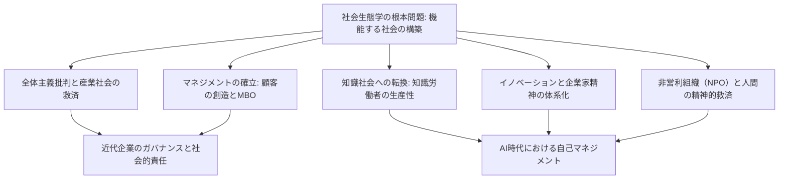
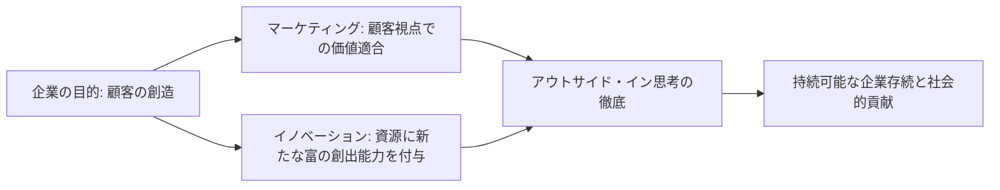
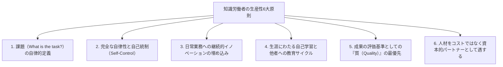

## 1. 序論：20世紀最大の知性ピーター・ドラッカーの射程

### 1.1 「マネジメントの父」という呼称の矮小化と「社会生態学者」としての本質

ピーター・F・ドラッカー（Peter Ferdinand Drucker, 1909–2005）の名は、世界中で「マネジメントの父（Father of Modern Management）」として知られている。しかし、彼自身はそのような肩書を終生好まなかった。ドラッカーが生涯を通じて自称し続けた独自の肩書は「社会生態学者（Social Ecologist）」である。

生物学における生態学（エコロジー）が、動植物とそれらを取り巻く環境との相互作用や動的平衡を観察・研究するように、社会生態学とは、人間が自ら作り出した社会環境――企業、政府、大学、病院、教会、そして家族といった様々な組織や制度――の中で、人間がどのように生き、働き、関係性を結び、社会秩序を形成しているかを観察する学問である。

ドラッカーの関心の中心は、単なる「企業の利益を最大化する小手先のテクニック」や「経営管理の効率化ツール」では決してなかった。彼が一貫して問い続けた根本問題は、**「人間が自由と尊厳を保ちながら生きられる、機能する社会（a functioning society）をいかに構築するか」** という、極めて倫理的・哲学的・人間主義的な問いであった。彼がビジネスや企業組織の分析に情熱を傾けたのは、20世紀において企業こそが社会の中心的機関（Representative Institution）となり、人々の生活とアイデンティティを規定する最大の場となったからにほかならない。

ドラッカーの著作を読む現代のビジネスパーソンや研究者の多くは、彼が第二次世界大戦前のヨーロッパでナチズムの台頭を目の当たりにし、ヒトラーの全体主義にいかにして対抗すべきかという痛切な政治哲学的絶望から出発した人物であることを忘れがちである。本稿では、ドラッカーの全生涯と全著作を貫く思想の伏流を辿り、彼が遺した広大無辺な知的体系を2万字を超える超大作として徹底的に解き明かす。



---

### 1.2 ウィーンの黄昏、ナチズムの台頭、そして全体主義批判から生まれた組織論

ドラッカーの思想的原点を知るためには、彼が生まれ育ったハプスブルク帝国末期のウィーンの知的土壌を理解しなければならない。1909年、オーストリア＝ハンガリー帝国の首都ウィーンの裕福な知識人家庭に生まれたドラッカーの生家には、フロイト、シュンペーター、ミーゼス、ハイエクといった当時のヨーロッパを代表する知識人が頻繁に集っていた。

しかし、第一次世界大戦の勃発とともにハプスブルク帝国は崩壊し、続く1920年代から1930年代にかけて、ヨーロッパ社会は未曾有の精神的・社会的崩壊に直面する。伝統的な階級秩序や宗教的権威が解体し、個人は拠って立つべきコミュニティを失って孤立した大衆へと転落した。さらに1929年の世界恐慌が襲いかかり、資本主義の自由市場とブルジョワ民主主義に対する絶望が蔓延した。

この巨大な精神的空白と絶望の中から台頭したのが、ヒトラーの国家社会主義（ナチズム）とスターリンの共産主義という二大全体主義であった。フランクフルトで法学博士号を取得し、ジャーナリストとして活動していた若きドラッカーは、ドイツが急速にナチズムの暗黒へと呑み込まれていく過程を現地で直接目撃した。1933年、ヒトラーが政権を掌握した直後、ドラッカーは即座にドイツを脱出してイギリスへ、そして1937年にはアメリカ合衆国へと亡命した。

ドラッカーにとって、ファシズムや全体主義は単なる軍事的・政治的狂気ではなく、**「近代西欧社会が人間に正当な社会的地位（Status）と機能（Function）を提供できなくなった結果として生じた、絶望的かつ病理学的な反逆」** であった。したがって、全体主義を根底から克服するためには、軍事的に打倒するだけでは不十分であり、市民一人ひとりが社会の中で確固たる居場所と役割を持ち、自己実現と尊厳を享受できる新しい「非全体主義的な自由社会」を設計しなければならない。この痛切な使命感こそが、ドラッカーを「組織とマネジメント」の探求へと駆り立てた真の原動力であった。

---

## 2. ドラッカー思想の原点：全体主義の絶望と産業社会の救済

### 2.1 『経済人の終わり』（1939年）― マルクス主義と資本主義の限界、ファシズムの病理

亡命中の1939年、ドラッカーは最初の記念碑的著作『経済人の終わり（The End of Economic Man: The Origins of Totalitarianism）』を上梓した。当時30歳に満たない無名の青年が著したこの書は、直ちにウィンストン・チャーチルによって絶賛され、イギリス軍将校の必読書に指定された。

本書においてドラッカーは、ナチズムの本質を「合理的な悪」ではなく「合理的な希望が絶望に変わった後に訪れた魔術的妄信」として解剖した。18世紀以来の西欧近代社会は、「経済人（Economic Man）」という人間観に立脚していた。資本主義は「市場における個人の自由な経済活動の追求が、神の見えざる手によって社会全体の調和と富をもたらす」と約束し、マルクス主義は「プロレタリア革命による階級差別の撤廃が、真の平等な自由人の社会を実現する」と約束した。

しかし、資本主義がもたらしたのは慢性的な失業と不平等、そして大恐慌の悲劇であり、共産主義がもたらしたのは血塗られた独裁と強制収容所であった。両者の神話が同時に破綻したとき、西欧社会は「経済的自由も経済的平等も、人間の幸福や尊厳を保障し得ない」という深淵の虚無（ニヒリズム）に直面した。

ファシズムは、この虚無に付け込んだ。ファシズムは経済的合理性や経済的自由を公然と否定し、軍国主義的ヒエラルキー、人種差別神話、国家至上主義という非合理な魔術を動員することで、絶望した大衆に「意味」と「帰属感」を与えたのである。ドラッカーは喝破した。ファシズムを否定するだけでは社会は再生しない。経済的合理性を包摂しつつも、単なる金銭的利得を超えて人間に尊厳ある市民的実存を提供する「新しい社会秩序」を打ち立てなければならない、と。

---

### 2.2 『産業人の未来』（1942年）― 人間に社会的地位（Status）と機能（Function）を与える共同体

続く1942年、アメリカの参戦と歩調を合わせるように出版された『産業人の未来（The Future of Industrial Man）』において、ドラッカーは戦後社会の青写真を提示した。

本書の中心概念は「正統な権力（Legitimate Power）」と、個人の「社会的地位（Status）」および「機能（Function）」である。健全で自由な社会が存続するためには、以下の2つの条件が満たされていなければならない。

1. **正統な権力**: 社会を統治する権力が、共同体成員によって正当かつ道徳的権威を持つものとして承認されていること。
2. **地位と機能**: 個々の構成員が、社会の中で明確な居場所（地位）を持ち、社会の共通善に対して独自の貢献を果たす役割（機能）を与えられていること。

19世紀までの農業社会や初期商業社会では、家族、農村共同体、ギルドが個人の地位と機能を保障していた。しかし、第二次産業革命によって巨大な工場と大企業が社会の主役に躍り出ると、伝統的共同体は解体された。工場労働者は、巨大な生産機構の代替可能な歯車となり、社会的な無力感に苛まれるようになった。

ドラッカーは予見した。**「もし近代の産業企業が、単なる富を生み出す経済機構にとどまり、働く人々に社会的地位と機能を提供する『人間的共同体』へと脱皮できないならば、自由社会は再び全体主義の亡霊に飲み込まれるだろう」**。企業は、工場主の私的所有物である以前に、公的な社会的責任を負う自律的な統治組織（Government）でなければならないという思想が、ここに明確に宣言されたのである。

---

### 2.3 『企業とは何か』（1946年）― ゼネラルモーターズ（GM）の内部調査と近代巨大組織の解剖

1943年、ドラッカーのもとに前代未聞の依頼が舞い込んだ。当時、世界最大の製造企業であり資本主義の最高峰であったゼネラルモーターズ（GM）の首脳陣から、「我が社の経営構造と組織運営の全貌を外部から徹底的に調査・分析してほしい」という招聘を受けたのである。

ドラッカーは18ヶ月間にわたりGM本部に駐在し、最高経営責任者アルフレッド・スローンをはじめとする経営陣、工場長、技術者、現場のライン工に至るまで膨大なインタビューを重ね、経営会議に同席した。その調査報告として1946年に結実したのが、経営学の記念碑的古典『企業とは何か（Concept of the Corporation）』である。

本書は、近代の大企業を「経済的組織」としてではなく、**「社会の構成単位としての政治的・社会的機関」** として捉えた人類史上最初の著作である。ドラッカーはGMの驚異的な強さの秘密が、スローンが構築した「事業部制（Decentralization: 分権管理）」にあることを見抜いた。中央集権的な軍隊的統制ではなく、自律的な事業部ごとに権限を委譲し、市場での競争と経営責任を担わせることで、巨大組織でありながら現場の自律性と柔軟性を維持する仕組みを理論化したのである。

---

### 2.4 スローンとの思想的対立：GM流トップダウン合理主義 vs 人間的自律組織論

しかし、『企業とは何か』はGM社内で猛烈な反発を引き起こした。アルフレッド・スローンをはじめとするGMの重役たちは、ドラッカーが提案した「労働者への権限委譲」「自己管理型チーム」「工場コミュニティの自治」「労働者の尊厳と終身雇用の模索」といった人間主義的な提言を激しく拒絶したのである。

スローンにとって企業とは、極限まで合理化された「資本と技術と労働を組み合わせる精密機械」であり、労働者は契約に基づいて賃金と引き換えに労働力を提供する経済的単位に過ぎなかった。スローンはドラッカーの提言を「感傷的な社会主義的空想」と見なし、ドラッカーの本を社内で禁書扱いとした（皮肉なことに、ライバル企業であったフォード・モーターのヘンリー・フォード2世はこの本を貪り読み、フォードの奇跡的な経営再建に適用した）。

このスローンとの対立は、ドラッカーのその後の思索の方向性を決定づけた。ドラッカーは、企業のトップダウンの官僚統制や数値管理至上主義を退け、**「人間の可能性と自己統制に信頼を置く自律分散型マネジメント」** の探求へと生涯を捧げることとなったのである。

---

## 3. 「マネジメント」の誕生と本質的体系

### 3.1 『現代の経営』（1954年）が打ち立てた規律

1954年、ドラッカーは『現代の経営（The Practice of Management）』を出版した。この著作によって、世界で初めて「マネジメント」という営みが体系的な学問・規律（Discipline）として確立された。それまで経営とは、天賦の才を持つ起業家の個人的な勘やカリスマ的指導力、あるいは財務諸表の計算技術に過ぎないと見なされていたが、ドラッカーはマネジメントを「学び、習得し、実践できる体系的な知の体系」へと昇華させたのである。

ドラッカーは、マネジメントの普遍的な3つの役割を次のように定式化した。

1. **自らの組織に特有の目的と使命を果たすこと**: 企業であれば経済的成果の達成、病院であれば病者の治癒、大学であれば学問の探求と教育。
2. **仕事を生産的なものにし、働く人たちに成果をあげさせること**: 人間の能力を最大限に引き出し、労働を通じて尊厳と成長を獲得させること。
3. **自らが社会に与える影響（インパクト）を処理し、社会的問題に貢献すること**: 組織の活動が社会を汚染したり破壊したりすることを防ぎ、良き市民として機能すること。

この3つの役割は互いに切り離すことができず、マネジメントは常にこれらすべてのバランスを動的に取り続けなければならない。

---

### 3.2 企業の目的は「顧客の創造」にある：マーケティングとイノベーションの双対

ドラッカーの経営哲学の中で最も有名であり、かつ最も誤解されているのが「企業の目的」についての定義である。ドラッカーは断言する。

> **「企業の目的についての妥当な定義は一つしかない。それは、顧客を創造することである（There is only one valid definition of business purpose: to create a customer）。」**

多くの経営者や経済学者は「企業の目的は利益の最大化である」と信じている。しかし、ドラッカーに言わせれば、利益は企業の「目的」ではなく、企業が存続し、将来の不確実性とリスクを克服するための「条件（Condition）」または「制約（Limitation）」に過ぎない。心臓が拍動し酸素を消費することが人間の生存の条件であっても、呼吸すること自体が人間の人生の目的ではないのと全く同様である。

顧客が存在しなければ、いかなる企業も一夜にして消滅する。顧客とは自然に存在するものではなく、企業の活動によって初めて見出され、創造されるものである。そして、顧客を創造するために、あらゆる企業組織は本質的に**たった2つの基本的な機能（Basic Functions）** しか持たない。

1. **マーケティング（Marketing）**: 顧客の真の欲求、現実、価値観を徹底的に理解し、製品やサービスを顧客に完全に適合させる活動。「優れたマーケティングは、セールス（売り込み）を不要にする」。
2. **イノベーション（Innovation）**: 既存の資源に新たな富を生み出す能力を付与すること。経済的・社会的な新しい価値を提供し続ける活動。

マーケティングとイノベーション以外のすべての企業活動（人事、財務、経理、購買、物流など）は、この2大機能を支えるためのコストに過ぎない。真に利益を生み出す源泉は、組織の外にある「顧客の満足」だけである。



---

### 3.3 目標管理制度（MBO: Management by Objectives and Self-Control）の真実

ドラッカーが『現代の経営』で提唱した最も革命的な概念の一つが、「目標管理と自己統制（Management by Objectives and Self-Control: MBO）」である。

今日、世界中の大企業で「MBO」と呼ばれる評価制度が導入されている。しかし、ドラッカー自身が晩年激しく嘆いたように、**現代企業で行われているMBOの99%は、ドラッカーの意図とは正反対の「ノルマ管理ツール」へと堕落している**。

ドラッカーが提唱したMBOの本質は、後半の言葉――**「自己統制（Self-Control）」** にこそある。従来の管理手法は、上司が部下にノルマを課し、進捗を監視し、信賞必罰で操る「外発的統制（External Control）」であった。これは人間を受動的な機械として扱うテイラー主義の遺物に過ぎない。

これに対し、ドラッカーのMBOは次のようなプロセスを要求する。

1. 組織全体の共通の目標と使命を全員が深く共有する。
2. 個々の働く者が、その全体目標に対して「自らが何を貢献すべきか」を自ら考え、自らの意志で目標を設定する。
3. 自らの活動の成果を測定するための客観的な情報やフィードバックを、上司ではなく**自分自身が直接入手できる環境**を整える。
4. 自らの進捗を自らコントロールし、自律的に軌道修正を行う。

MBOとは、上司による支配を強化するための道具ではなく、**「外部からの支配や指示を不要にし、一人ひとりの人間を自律したプロフェッショナルへと解放するための哲学」** なのである。ドラッカーは、内発的動機づけ（Intrinsic Motivation）と自己責任に基づく自律こそが、人間の尊厳を高め、組織に最高のパフォーマンスをもたらすと確信していた。

---

### 3.4 成果（Results）の定義と資源配分：企業の8つの重要領域

ドラッカーは、企業の活動を単一の指標（売上や四半期利益など）だけで評価することを厳しく戒めた。企業が健康に存続し、社会に貢献し続けるためには、以下の**8つの重要領域（Key Result Areas）** においてバランスの取れた目標を設定し、追跡しなければならない。

| 領域 | 内容と重要性 |
| :--- | :--- |
| **1. マーケティング** | 既存市場におけるシェアだけでなく、新規市場の開拓と顧客創造の度合い。 |
| **2. イノベーション** | 製品・サービスのみならず、組織構造、業務プロセス、ビジネスモデルの革新。 |
| **3. 人材と組織能力** | 従業員の能力開発、意欲、次世代リーダーの育成、チームの自律性。 |
| **4. 財務資源** | 必要な投資資金の調達力、キャッシュフローの健全性、資本の最適配分。 |
| **5. 物的資源** | 工場、設備、オフィス、ITインフラなどの生産基盤の効率性と近代性。 |
| **6. 生産性** | 投入された資源（労働、資本、時間、原材料）から生み出される付加価値の比率。 |
| **7. 社会的責任** | 地域社会、環境、法規制、倫理基準に対する誠実さと積極的貢献。 |
| **8. 必要利益** | 以上の7つの目標を達成し、将来のリスクをカバーするために不可欠な利益水準。 |

ドラッカーの経営思想の神髄は、**「利益は目的ではなく、条件である」** という点に尽きる。利益とは、過去の行動の通信簿であると同時に、未来の不確実性というコストを支払うための「事業継続保険」なのである。

---

## 4. 知識社会の予見と「知識労働者（Knowledge Worker）」の出現

### 4.1 『断絶の時代』（1969年）から『ポスト資本主義社会』（1993年）へ

ドラッカーの数多くの予言の中で、最も歴史的インパクトをもたらしたのは「知識社会（Knowledge Society）」の到来の予見である。1959年の『明日のランドマーク（Landmarks of Tomorrow）』において、ドラッカーは人類史上初めて**「知識労働者（Knowledge Worker）」** という言葉を使用した。

そして1969年の記念碑的著作『断絶の時代（The Age of Discontinuity）』において、彼は産業革命以来の経済構造が根本的な地殻変動を起こしていることを看破した。伝統的な経済学は、富の生産要素として「土地（天然資源）」「労働（肉体労働）」「資本（工場・機械）」の3つを挙げてきた。しかし、20世紀後半以降、これらの伝統的生産要素は二次的なものへと後退し、**「知識（Knowledge）」こそが唯一の意味ある生産要素** となる新しい時代が到来したと論じたのである。

1993年の『ポスト資本主義社会（Post-Capitalist Society）』において、ドラッカーはその洞察をさらに深化させた。資本主義社会において権力を握っていたのは資本の所有者（ブルジョワジー・投資家）であったが、知識社会における真の資本は「働く人間の頭脳の中に存在する知識」である。知識労働者は生産手段（自らの知性と専門性）を自らの頭の中に所有して職場を移動するため、組織と労働者の力関係は歴史上初めて逆転したのである。

---

### 4.2 肉体労働（テイラー主義）から知識労働への歴史的転換

20世紀の最大の経済的奇跡は、フレデリック・テイラー（Frederick Winslow Taylor）が創始した「科学的管理法」によって、**肉体労働者の生産性が50倍近く向上したこと** であった。テイラーは、経験と勘に頼っていた職人の手作業を徹底的に時間・動作研究し、作業を要素動作へと分解・再構成した。この生産性革命が、大量生産・大量消費の豊かな中間層社会を生み出し、先進国からマルクス主義革命の危機を遠ざけたのである。

しかし、ドラッカーは警告した。「20世紀のマネジメントが達成した最大の貢献が肉体労働の生産性向上であったとすれば、**21世紀のマネジメントが直面する最大の挑戦は、知識労働の生産性を向上させることである**」。

肉体労働と知識労働の間には、決定的な本質的差異が存在する。

| 特徴 | 肉体労働（Manual Work） | 知識労働（Knowledge Work） |
| :--- | :--- | :--- |
| **仕事の定義** | 仕事の内容はあらかじめ規定されており、疑問の余地がない（例：鉄骨を運ぶ、ネジを締める）。 | **「仕事は何であるか？何のために行うのか？」** を自ら定義しなければならない。 |
| **自律性** | 作業手順に従順に従うことが美徳とされ、外部から厳格に管理される。 | **自律性（Autonomy）** が不可欠であり、自己管理できなければ成果は出ない。 |
| **継続的イノベーション** | イノベーションは専門の技術者や工程設計者が行う。 | 知識労働者自身が日々の業務の中で**継続的にイノベーション**を組み込む。 |
| **学習と教育** | 一度技術を習得すれば、反復熟練によって効率化する。 | 知識の陳腐化が極めて速く、**生涯にわたる継続学習と教育**が必須。 |
| **評価の基準** | 主として**「量（Quantity）」**（時間あたり何個作ったか）。 | 主として**「質（Quality）」**（いかに優れた洞察や解決策を生んだか）。 |
| **生産手段の所有** | 工場、機械、道具は**資本家が所有**している。 | 生産手段（知識、判断力）は**労働者の頭脳**に属している。 |

知識労働においては、「一生懸命に長時間働くこと」は成果を何ら保証しない。間違った問いに対してどれほど効率的に正解を出しても、それは完全な無駄である。知識労働における生産性向上は、テイラー流の監視や効率化ツールでは絶対に達成できず、マネジメントの根本的なパラダイムシフトを要求する。

---

### 4.3 知識労働者の生産性を決定づける6大原則

ドラッカーは『明日を支配するもの（Management Challenges for the 21st Century, 1999）』において、知識労働者の生産性を向上させるための「6大条件」を明文化した。

1. **「課題は何であるか」を問い続けること**: 知識労働において最も重要なステップは、「なされるべき仕事は何か」を定義することである。不要な作業を効率化することほど有害なことはない。
2. **自律性を付与すること**: 知識労働者は自らを自ら管理しなければならない。自律性こそが責任感とプロフェッショナリズムを生む。
3. **継続的なイノベーションを仕事の中に組み込むこと**: 自らの専門分野において、常に新しい手法や価値を自発的に探求すること。
4. **継続的な学習と教育のサイクルを回すこと**: 知識労働者は教わる側であると同時に、他者に教える側（メンター）でなければならない。人を教えることほど自らの知識を体系化し深める手段はない。
5. **量の多さではなく質の高さを重視すること**: 100本の無意味なレポートよりも、1本の核心を突いた分析こそが企業の命運を決する。
6. **知識労働者を「コスト」ではなく「資産」として処遇すること**: 知識労働者は組織の歯車ではなく、自発的に自らの知恵を投資する「パートナー」として遇されなければならない。



---

### 4.4 「知識労働者は自らが自己のCEOでなければならない」：自己マネジメント論

知識社会の到来は、個人の生き方にも劇的な変革を迫る。ドラッカーは1999年の歴史的論文「明日を支配するもの（Managing Oneself）」において、現代のビジネスパーソン全員に向けた警鐘を鳴らした。

近代以前の人間は、生まれた身分や家業によって職業が決まっていた。産業社会においても、大企業に入社すれば定年まで会社がキャリアの道筋を敷いてくれた。しかし、知識社会においては**「自らのキャリアは自らが設計し、自らのパフォーマンスは自らがマネジメントしなければならない」**。平均寿命が80年を超える現代において、企業の平均寿命（約30年）は個人の労働可能年数よりも遥かに短くなった。すべての知識労働者は、自分自身をひとつの独立したベンチャー企業（自分株式会社）の最高経営責任者（CEO）として捉え直さなければならないのである。

ドラッカーが提唱した自己マネジメントの具体的技術は以下の通りである。

#### ① 自らの強み（Strengths）を知る
ドラッカーの人間論の最大の核心は、**「人は強みによってのみ成果をあげることができる。弱みを克服することによって成果をあげることはできない」** という洞察である。

伝統的な学校教育や企業研修は、個人の欠点や弱点を見つけ出し、それを平均レベルに引き上げようとすることに膨大なエネルギーを浪費する。しかし、無能を平凡に引き上げるには途方もない労力を要するのに対し、一流の強みを卓越した超一流へと磨き上げる労力は遥かに少なくて済む。

自らの真の強みを発見するための唯一の信頼できる手法として、ドラッカーは**「フィードバック分析（Feedback Analysis）」** を提唱した。
- 何か重要な決定や行動を起こす際、**「これから起きると期待される結果」を紙に書き留めておく**。
- 9ヶ月後、または1年後に、**実際の結果と書き留めておいた期待を厳密に比較照合する**。
- これを数年間繰り返すことで、自らが何を得意とし、どのような強みを発揮したときに成果が生まれ、逆に何が不得手であるかが残酷なまでに客観的に浮き彫りになる。

#### ② 自らの仕事の流儀（How I Perform）を知る
強みと同様に重要なのが、自らの行動様式と認知のスタイルである。
- **自分は「読解者（Reader）」か、それとも「聴講者（Listener）」か？**（アイゼンハワーは読解者であったため記者会見の口頭試問で失言を繰り返したが、事前に質問メモを読ませることで卓越した手腕を発揮した。ルーズベルトやトルーマンは典型的な聴講者であった）。
- **自分はどのように学ぶのか？**（書いて学ぶのか、話して学ぶのか、実践して学ぶのか）。
- **自分は意思決定者（Decision Maker）として成果を出すのか、助言者（Adviser）として力を発揮するのか？**（ナンバー2として卓越した能力を持つ補佐官が、トップに就任した途端に優柔不断となり破滅する例は枚挙にいとまがない）。

#### ③ 人生の後半（セカンドキャリア）への備え
肉体労働者は肉体の疲弊とともにリタイアするが、知識労働者は40代半ばから50代にかけて、自らの仕事に退屈し、「燃え尽き症候群」に陥りやすい。同じ仕事を20年も続ければ、もはや学ぶべきものはなく、成長は止まる。

ドラッカーは、40歳を迎える前に**「第2の活動領域（パラレルキャリアや非営利活動）」** を育て始めることを強く推奨した。本業以外の世界を持ち、地域社会やNPO、学問、ボランティア活動などで自らの強みを活かして貢献できる場を持つこと。それこそが、会社でのリストラや挫折に直面した際にも人間の精神的尊厳を守り、真に豊かな後半生を生き抜くための唯一の防波堤となる。

---

## 5. イノベーションと企業家精神の体系的技法

### 5.1 『イノベーションと企業家精神』（1985年）

多くの人々は、イノベーションを「一部の天才や狂人が夜中に突然ひらめく雷のようなもの」と信じている。あるいは、巨大な研究開発費（R&D）を投じて画期的な科学的発見を待つことだと考えている。

1985年、ドラッカーは『イノベーションと企業家精神（Innovation and Entrepreneurship）』を著し、このロマン主義的なイノベーション幻想を完膚なきまでに打ち砕いた。ドラッカーにとって、イノベーションとは天才のひらめきではなく、**「体系的かつ組織的に学習し、実践できる規律（Discipline）」** である。

ドラッカーはイノベーションを次のように定義する。
> **「イノベーションとは、資源に新しい富の創出能力を与えることである。それどころか、イノベーションが起こる以前には、そもそも『資源』なるものは存在しない。人間が用途を見出し、経済的価値を付与するまでは、いかなる植物も単なる雑草であり、いかなる鉱石も単なる無用な岩石に過ぎない。」**

石油は、19世紀中頃に精製技術と内燃機関が発明されるまでは、農地を汚染する忌まわしい粘液に過ぎなかった。それを莫大な富を生む「資源」へと変えたのは、科学技術そのものというよりも、それを社会のニーズと結びつけたイノベーションであった。

---

### 5.2 「ひらめき」の神話を打破する：イノベーションの体系的7つの機会

ドラッカーは、企業や組織が日常的に探索すべき**「イノベーションの7つの機会（The Seven Sources for Innovative Opportunity）」** を体系化した。これらは信頼性が高く、リスクが低い順に並べられている。

```mermaid
flowchart TD
    subgraph 組織内部の事象（リスク小・即効性高）
        S1["1. 予期せぬこと（成功・失敗・外部の出来事）"]
        S2["2. ギャップ（現実と『あるべき姿』の不一致）"]
        S3["3. プロセス・ニーズ（業務上のボトルネック解消）"]
        S4["4. 産業・市場構造の変化（急成長や市場再編）"]
    end
    subgraph 組織外部の社会変動（リスク中・重要度極大）
        S5["5. 人口動態の変化（最も確実な未来の予測）"]
        S6["6. 認識・感情・意味の変化（コップに『半分入っている』）"]
        S7["7. 新しい知識（科学技術・理論。リスク最大・リードタイム最長）"]
    end
    S1 --> S2 --> S3 --> S4 --> S5 --> S6 --> S7
```

#### ① 予期せぬこと（The Unexpected）
最もリスクが低く、最も実り豊かでありながら、既存企業によって最も無視されがちなのが「予期せぬ成功（Unexpected Success）」と「予期せぬ失敗（Unexpected Failure）」である。
- **予期せぬ成功**: IBMが初期の大型計算機を開発した際、科学計算用として設計されたマシンが、なぜか銀行や保険会社の事務処理用として飛ぶように売れた。当時の経営陣は「本来の用途ではない」と困惑したが、IBMはこの予期せぬ需要に全力を集中したことで、後のコンピュータ帝国を築き上げた。
- 企業は月次の経営会議で「予算未達の項目（失敗）」ばかりを何時間も議論し、予定を大幅に上回って売れている「予期せぬ成功」を単なる偶然として片付けてしまう。ドラッカーは、月次報告書の最初の1ページには「予期せぬ成功」だけを記載し、そこに最も優秀な人材を配置せよと説いた。

#### ② ギャップ（Incongruities）
「こうあるべきだ」という思い込みや理論と、「実際に起きている現実」との間にある不一致。
- 1950年代、海運業界は船のスピードを上げ、燃料効率を改善するために莫大な投資を行っていたが、業績は悪化の一途をたどっていた。真のコスト要因は「航海中」ではなく、港に停泊して貨物の積み降ろしを待つ「停泊時間」にあった。このギャップに気づいたマルコム・マクリーンが考案したのが「コンテナ船（Containerization）」である。船自体の性能は変えず、陸上輸送と海上輸送を標準化された箱（コンテナ）で直結することで、荷役時間を数週間から数時間へと短縮し、世界貿易を革命的に爆発させた。

#### ③ プロセス・ニーズ（Process Need）
既存の業務プロセスの中に存在する「欠落した環（ミッシング・リンク）」やボトルネックを解消したいという強い要求。
- 写真フィルムの現像プロセスを不要にしたいというニーズから生まれたポラロイドカメラや、長距離電話の交換作業を自動化するための電子交換機など。

#### ④ 産業・市場構造の変化（Industry and Market Structures）
業界が年率10%以上のスピードで急成長するとき、従来の産業構造は崩壊し、新旧の交代が起きる。
- 自動車産業の台頭におけるボルボの安全技術への特化や、金融ビッグバンにおけるオンライン証券の勃興。

#### ⑤ 人口動態の変化（Demographics）
**「すでに起きてしまった未来（The Future that has already happened）」** の中で、最も確実であり、かつ最も予測可能な要素が人口動態（出生率、死亡率、年齢構成、教育水準）である。
- 20年後に20歳になる若者の数は、今日生まれた赤ん坊の数を数えれば100%正確に予測できる。少子高齢化、労働力人口の減少、大学進学率の上昇などは、何十にも及ぶイノベーションの巨大な機会を提供する。

#### ⑥ 認識・感情・意味の変化（Changes in Perception）
客観的な事実は全く変わっていなくても、人々の「認識の枠組み」が変わる瞬間。
- 「コップに水が半分入っている」と見ていた人々が、突然「コップに水が半分しか入っていない」と感じ始める現象。医学の進歩によって平均寿命が伸び、人類史上最も健康になった現代人が、健康不安やオーガニック食品、フィットネスに熱狂するようになったのは、客観的健康度の向上ではなく「健康に対する認識の変化」がもたらした巨大なイノベーション市場である。

#### ⑦ 新しい知識（New Knowledge）
科学技術、理論、発明に基づくイノベーション。
- 一般に世間が「イノベーションのすべて」と信じているものがこれである。しかし、ドラッカーは警告する。**新しい知識に基づくイノベーションは、7つの機会の中で最も成功率が低く、最も莫大な資金を要し、市場化までのリードタイムが最も長い**（通常、基礎的知識の発見から実用化まで25〜30年の歳月を要する）。さらに、複数の異なる知識が融合（Convergence）しなければ実用化しないため、投機的リスクが極めて高い。

---

### 5.3 組織的廃棄（Systematic Abandonment）：昨日の成功を意図的に殺す勇気

イノベーションを起こすために最も重要な最初のステップは、「新しいアイデアを考えること」ではない。ドラッカーは断言する。**「イノベーションの第1歩は、古いもの、もはや成果をあげていないもの、昨日の成功を組織的に廃棄（Abandonment）することである」**。

あらゆる組織は、既存の製品、サービス、事業部門を維持するために、最も優秀な人材と資金を固定化してしまう。かつて大成功を収めた事業ほど、組織内の政治的聖域となり、誰もその終焉を言い出せなくなる。その結果、新しい未来のための資源が枯渇する。

ドラッカーは、すべての経営者に対し、定期的に自らに次の冷徹な問いを投げかけることを義務づけた。
> **「もし、われわれが今日これを行っていなかったとして、いま持っている知識やすべての情報を手にした上で、なおかつこれに足を踏み入れるだろうか？」**

もし答えが「ノー」であるならば、「では、われわれはこれについて今日、何をなすべきか？」と問わなければならない。それは改善や延命ではなく、計画的かつ組織的な撤退・廃棄でなければならない。死んだ細胞を排出しない肉体が生命を維持できないのと同様に、過去を組織的に廃棄できない企業は、確実にイノベーションの窒息死を迎える。

---

## 6. 組織のガバナンスと社会的責任、そして非営利組織（NPO）の意義

### 6.1 『マネジメント』（1973年）における3大役割と社会的責任の本質

1973年、ドラッカーは自らの経営哲学の総決算として、全2巻・1000ページを超える大著『マネジメント：課題・責任・実践（Management: Tasks, Responsibilities, Practices）』を世に問うた。

本書において、ドラッカーは「企業の社会的責任（CSR: Corporate Social Responsibility）」という概念を、現代の通り一遍の環境慈善活動や寄付行為（フィランソロピー）とは次元の異なる深みで論じている。ドラッカーにとって、社会的責任は大きく2つのカテゴリに厳密に分類される。

1. **自らの活動が社会に与える負の影響（Impacts）の処理**:
   - 排気ガス、騒音、産業廃棄物、労働者の健康被害など、組織の活動が意図せずして社会や自然環境に及ぼす害悪。
   - ドラッカーの立場は明確である。**「自らが社会に与える悪影響は、いかにコストがかかろうとも、自らの責任において完全にゼロへと抑制しなければならない」**。影響を放置することは、社会に対する裏切りであり、組織の正統性を自ら破壊する行為である。
2. **社会そのものが抱える問題（Social Problems）の解決**:
   - 貧困、教育格差、高齢化、環境破壊など、自らの事業とは直接関係のない社会全体の病理。
   - これに対し、ドラッカーは極めて現実的な原則を打ち立てた。「社会問題の解決は、自らの能力と強みを活かして**事業機会（ビジネス）へと転換できる場合にのみ**取り組むべきである」。自らの能力を超えた課題に情緒的に首を突っ込み、本業の競争力を損なって破綻することは、無責任の極みである。

---

### 6.2 なぜドラッカーは晩年、非営利組織（NPO/NGO）に情熱を傾けたのか

1980年代以降、すでに世界的な知性の頂点にあったドラッカーは、その知的エネルギーの多くを大学、病院、ガールスカウト、救世軍、教会といった「非営利組織（NPO/NGO: Non-Profit Organizations）」のマネジメント研究とコンサルティングへと注ぎ込んだ。1990年には『非営利組織の経営（Managing the Non-Profit Organization）』を出版している。

なぜドラッカーは、資本主義の最前線からNPOへと舵を切ったのか？ そこには、彼の生涯のテーマである「機能する社会」の実現に向けた深い必然性があった。

企業は「製品やサービス」を提供し、顧客を創造する。政府は「法律や規制」を執行し、秩序を維持する。しかし、**企業も政府も「人間の心を変革し、コミュニティを再生する」ことはできない**。
- 病院の使命は利益を出すことではなく、病人を治癒することである。
- 教会の使命は信徒の魂を救済することである。
- 救世軍の使命は、アルコール中毒者を自立した誇りある市民へと再生させることである。

ドラッカーは喝破した。**「非営利組織が生み出すべき真の成果は、変革された人間（A Changed Human Being）そのものである」**。

さらに、ドラッカーは驚くべき逆説を提示した。多くの人々は「非営利組織はビジネス企業からマネジメントを学ぶべきだ」と考えていた。しかし、ドラッカーは**「むしろビジネス企業こそが、優れた非営利組織から真のマネジメントを学ばなければならない」** と主張したのである。

なぜなら、非営利組織には従業員を金銭（給与）で縛る力がなく、働く者の多くはボランティアである。彼らは「崇高な使命（Mission）」と「自らの貢献に対する誇り」だけで動いている。金銭的報酬で誤魔化しがきかない分、非営利組織のリーダーは、明確なミッションの定義、価値観の共有、厳格な自己統制を徹底しなければ組織を維持できない。このボランティアを束ねるマネジメントの手法こそが、知識労働者をパートナーとして動かさなければならない21世紀のビジネス企業にとって、最高峰の教科書となるのである。

---

## 7. 現代およびAI時代におけるドラッカー思想の再評価

### 7.1 生成AIと知識社会の新たなパラダイムシフト

2020年代、ChatGPTを代表とする大規模言語モデル（LLM）と生成AIの爆発的進化により、知識社会はドラッカー自身も想像し得なかった極限の段階へと突入した。

これまで「知識労働」の中核と見なされてきたプログラミング、文書作成、データ分析、法的リサーチ、医学的診断補助といった知的作業の多くが、AIによって瞬時に、かつ超人的な精度で自動化されつつある。かつてテイラー主義が肉体労働を機械化・自動化したのと全く同じことが、今やホワイトカラーの頭脳労働において起きている。

このAIの時代において、ドラッカーの思想は古びるどころか、その重要性を天文学的に増している。ドラッカーが常に強調したのは、**「答えを出すこと（Execution）はコンピュータの仕事であり、真に人間的な仕事は『問いを立てること（Asking the Right Questions）』にある」** という洞察であった。

AIは、与えられたプロンプト（問いや指示）に対して膨大な既存知識を再構成して回答を出力することは極めて得意である。しかし、
- 「われわれの組織の真の使命は何であるべきか？」
- 「顧客にとっての真の価値とは何か？」
- 「次に廃棄すべき昨日の成功は何か？」
- 「われわれはどのような人間的責任を社会に対して負うべきか？」

といった根本的な問いを立てることは、AIには原理的に不可能である。AIが日常的な知的処理を肩代わりすればするほど、人間に残される唯一にして最大の仕事は、ドラッカーが論じ続けた「価値判断」「倫理的責任」「ミッションの定義」「人間関係の構築」という、マネジメントの哲学的領域へと純化されるのである。

---

### 7.2 アジャイル、OKR、ティール組織との接続と本質的一致

現代の最先端の組織論である「アジャイル開発（Agile）」、「OKR（Objectives and Key Results）」、あるいはフレデリック・ラルーが提唱した「ティール組織（Teal Organization: 自主経営組織）」を学ぶ人々は、それらの根底にある思想が、すでに半世紀以上前にドラッカーが説いていたことと完全に一致していることに驚かされる。

- **アジャイルの顧客中心主義と反復的改善** は、ドラッカーの「企業の目的は顧客の創造にあり、マーケティングとイノベーションを日々の仕事に組み込むこと」そのものである。
- **インテルのアンディ・グローブが開発しGoogleが普及させたOKR** は、ドラッカーのMBO（目標と自己統制による管理）を直接の起源としている。
- **ティール組織の自主経営（Self-Management）と全人性の尊重** は、ドラッカーが『産業人の未来』以来希求し続けた「働く人々に社会的地位と機能を与え、自己統制によって動く人間主義的共同体」の現代的具現化にほかならない。

ドラッカーの思想は、時代遅れのクラシックなどでは毛頭ない。現代のあらゆる革新的マネジメント理論は、ドラッカーという巨人の肩の上に立ち、彼が耕した知の沃野から芽吹いた果実に過ぎない。

---

### 7.3 結論：未だ実現されていない「機能する社会」を目指して

ピーター・ドラッカーは、95歳でその波乱に満ちた生涯を閉じる直前まで、旺盛に執筆と教育を続けた。彼の膨大な著作群を通読した者が最後に受け取るメッセージは、経営の成功ノウハウではなく、**「人間という存在に対する深い信頼と、社会に対する無限の責任感」** である。

富の追求それ自体が目的化し、短期的な株主資本主義が環境と人間を疲弊させ、テクノロジーの進化が人間の尊厳を脅かしかねない21世紀の今こそ、われわれはドラッカーの原点に立ち返らなければならない。

組織とは、人間の強みを社会の成果へと結びつけ、人間の弱みを無力化するための道具である。マネジメントとは、権力を行使することではなく、人間に責任を持たせ、成長させ、自由を獲得させるための倫理的実践である。

ドラッカーが夢見た「一人ひとりの人間が誇りと尊厳を持って働き、自律した市民として社会に貢献できる、機能する自由社会」の建設は、未だ道半ばである。その未完のバトンを受け取り、自らの現場において実践することこそが、現代に生きるわれわれ全員に課せられた使命なのである。
