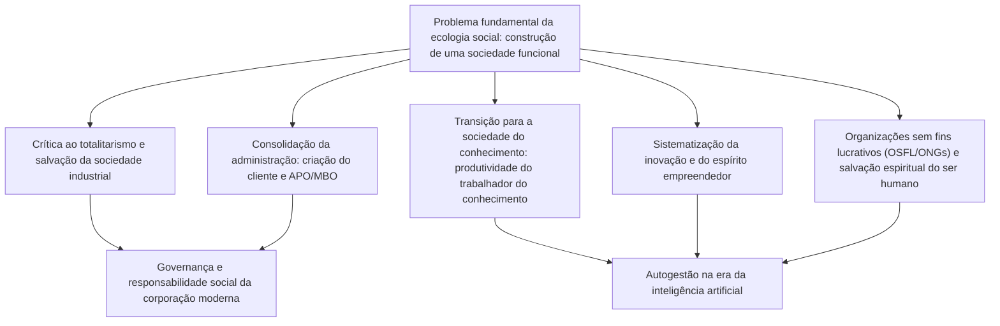
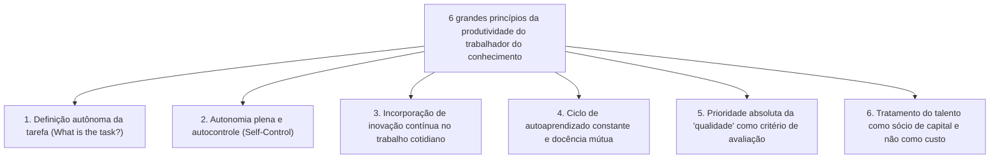
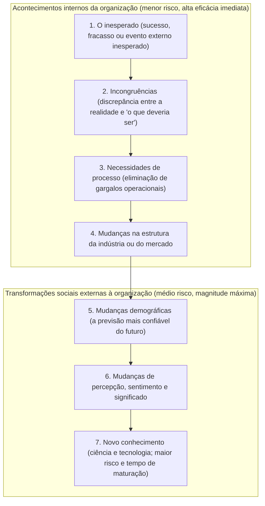

## 1. Introdução: O alcance do maior intelecto do século XX, Peter Drucker

### 1.1 A redução do título de «pai da administração» e sua essência como «ecologista social»

O nome de Peter F. Drucker (Peter Ferdinand Drucker, 1909–2005) é reverenciado em todo o planeta como o «pai da administração moderna» (*Father of Modern Management*). No entanto, ele próprio rejeitou terminantemente tal rótulo durante toda a sua existência. A designação singular que Drucker sempre reivindicou com orgulho e insistência foi a de **«ecologista social» (*Social Ecologist*)**.

Da mesma forma que a ecologia biológica investiga as interações e o equilíbrio dinâmico entre os seres vivos e seus ecossistemas naturais, a ecologia social é a disciplina dedicada a observar e compreender como os seres humanos vivem, trabalham, constroem relacionamentos e articulam a ordem cívica dentro do meio ambiente artificial que eles próprios edificaram: as variadas organizações e instituições humanas, tais como corporações, governos, universidades, hospitais, igrejas e famílias.

O foco primordial de Drucker nunca esteve nas «técnicas superficiais para inflar lucros trimestrais» ou nas «ferramentas pragmáticas de otimização da eficiência burocrática». A questão motriz que guiou incansavelmente todas as suas investigações foi uma interrogação de magnitude eminentemente ética, filosófica e humanista: **«Como edificar uma sociedade funcional (*a functioning society*) na qual os indivíduos possam viver preservando plenamente sua liberdade e dignidade?»**. Se dedicou sua refinada acuidade analítica às empresas e organizações industriais foi exclusivamente pelo fato de que, no século XX, a corporação converteu-se na instituição representativa (*Representative Institution*) da sociedade ocidental, passando a ditar o ritmo de vida, as relações produtivas e a identidade pessoal dos cidadãos.

A imensa maioria dos executivos e acadêmicos contemporâneos que consomem as obras de Drucker costuma negligenciar um fato biográfico crucial: o pensamento druckeriano nasceu do desespero político e moral diante da ascensão avassaladora do nazismo na Europa pré-Segunda Guerra Mundial e da urgência pungente de combater o totalitarismo hitleriano. Neste ensaio exaustivo, descemos às correntes profundas que unificam toda a trajetória e bibliografia de Drucker, desvendando seu imenso legado intelectual em toda a sua amplitude e profundidade.

---

### 1.2 O crepúsculo de Viena, a ascensão do nazismo e a teoria organizacional nascida da crítica ao totalitarismo

Para apreender as raízes do pensamento de Drucker, é indispensável revisitar o efervescente caldo cultural da Viena nos estertores do Império Austro-Húngaro. Nascido em 1909 em uma refinada família da elite intelectual vienense, o jovem Peter cresceu em um ambiente doméstico onde figuras da estatura de Sigmund Freud, Joseph Schumpeter, Ludwig von Mises e Friedrich Hayek eram convidados frequentes de saraus e debates.

Todavia, a deflagração da Primeira Guerra Mundial consumou o colapso irreversível dos Habsburgos e, ao longo das décadas de 1920 e 1930, a Europa mergulhou em uma crise existencial sem precedentes. As antigas hierarquias estamentais e a autoridade moral das religiões tradicionais esboroaram-se, lançando o indivíduo comum na condição de massa isolada e desprovida de pertencimento comunitário. Com a chegada da Grande Depressão de 1929, uma desilusão paralisante com o livre mercado capitalista e a democracia liberal burguesa alastrou-se pelo continente.

Deste vazio existencial lancinante emergiram as duas expressões máximas do totalitarismo do século XX: o nacional-socialismo de Hitler e o comunismo de Stalin. Após concluir seu doutorado em Direito Internacional na Universidade de Frankfurt e atuar ativamente no jornalismo econômico, o jovem Drucker acompanhou em primeira mão o avanço implacável das trevas nazistas sobre a sociedade alemã. Em 1933, tão logo Hitler assumiu o poder absoluto, Drucker partiu para a Grã-Bretanha e, em 1937, estabeleceu-se definitivamente nos Estados Unidos da América.

Para a lúcida visão de Drucker, o fascismo e o totalitarismo não consistiam em meros espasmos de loucura bélica, mas sim em **«uma rebelião desesperada e patológica decorrente do fracasso absoluto da sociedade ocidental moderna em proporcionar ao homem um status (*Status*) e uma função (*Function*) socialmente legítimos»**. Logo, derrotar militarmente o totalitarismo no campo de batalha era uma condição necessária, mas não suficiente; fazia-se imperativo construir uma nova «sociedade livre e não totalitária», capaz de outorgar a cada indivíduo um lugar seguro, um papel digno a serviço da coletividade e as bases para a autorrealização cidadã. Essa missão histórica foi o combustível vital que compeliu Drucker a dissecar o universo das organizações e da administração.

---

## 2. O ponto de partida do pensamento de Drucker: o desespero do totalitarismo e a salvação da sociedade industrial

### 2.1 *O Fim do Homem Econômico* (1939) ― Os limites do marxismo e do capitalismo, e a patologia do fascismo

Ainda nos primeiros anos de seu exílio, em 1939, Drucker lançou sua primeira obra-prima de repercussão internacional: *O Fim do Homem Econômico* (*The End of Economic Man: The Origins of Totalitarianism*). Redigido por um autor que sequer completara trinta anos, o livro foi calorosamente louvado por Winston Churchill, que determinou sua inclusão na lista de leituras essenciais dos oficiais das Forças Armadas britânicas.

Nesta análise demolidora, Drucker interpretou o nazismo não como uma conspiração racional, mas como uma «fé cega e demoníaca engendrada pela morte de todas as esperanças racionais». A civilização ocidental desde o Iluminismo sustentava-se no arquétipo do «Homem Econômico» (*Economic Man*). O capitalismo asseverava que a livre busca do enriquecimento individual no mercado geraria, pela magia da mão invisível, a prosperidade e a harmonia social de todos; paralelamente, o marxismo prometia que a erradicação violenta das classes por meio da revolução proletária pariria a sociedade definitiva de cidadãos livres e iguais.

Contudo, a realidade concreta desnudou ambas as promessas: o capitalismo gerou desemprego estrutural crônico, abismos de desigualdade e o choque da Grande Depressão; o comunismo soviético desaguou em tirania sanguinária, expurgos e gulags. Ao ruírem simultaneamente os dois grandes mitos modernos, a Europa sucumbiu ao niilismo: a percepção desoladora de que nem a liberdade econômica nem a igualdade econômica eram capazes de afiançar a dignidade e a felicidade humana.

O fascismo alimentou-se covardemente dessa desesperança. Ao renegar frontalmente a racionalidade liberal e o cálculo econômico, recorreu a mitos tribais irracionais — militarismo fanático, pureza racial e culto histérico ao Estado —, provendo as massas desenraizadas de um senso espúrio de «propósito» e «integração». Drucker sentenciou: condenar retoricamente o fascismo é inútil. Faz-se mister instaurar uma **nova ordem social** que, assimilando a eficiência econômica, transcenda a mera acumulação financeira e assegure a cada ser humano uma existência cívica plena de dignidade e significado.

---

### 2.2 *O Futuro do Homem Industrial* (1942) ― A comunidade que confere status (*Status*) e função (*Function*) ao homem

Em 1942, em plena mobilização industrial norte-americana para o conflito mundial, Drucker deu à estampa *O Futuro do Homem Industrial* (*The Future of Industrial Man*), apresentando os alicerces sociológicos para a reconstrução democrática do pós-guerra.

A espinha dorsal teórica da obra assenta-se sobre as noções de **«poder legítimo» (*Legitimate Power*)**, **«status social» (*Status*)** e **«função social» (*Function*)**. Para que uma comunidade civilizada permaneça livre e coesa ao longo do tempo, duas exigências basilares precisam ser compulsoriamente atendidas:

1. **Poder Legítimo**: O poder que comanda a sociedade precisa ter sua autoridade moral e jurídica reconhecida de maneira consensual e espontânea por todos os membros governados.
2. **Status e Função**: Cada indivíduo deve possuir uma posição social reconhecida (status) e desempenhar um papel ativo com impacto positivo e valorizado na promoção do bem comum (função).

Nas sociedades agrícolas e pré-industriais anteriores ao século XIX, os laços da família patriarcal, das aldeias comunitárias e das guildas de artesãos supriam essas necessidades elementares. Todavia, com a deflagração da Segunda Revolução Industrial e a hegemonia das gigantescas fábricas, o tecido social ancestral desintegrou-se. O operário fabril foi transformado em uma engrenagem descartável na linha de montagem, esvaziado de relevância e impotente perante a magnitude da maquinaria capitalista.

Drucker profetizou com solenidade: **«Se a moderna corporação industrial limitar-se a atuar como uma mera máquina de geração de riqueza monetária e falhar em se metamorfosear em uma autêntica 'comunidade humana' que outorgue status e função aos trabalhadores, a sociedade livre cairá novamente presa dos demônios totalitários»**. Nascia ali a compreensão da corporação não como propriedade privada isolada dos detentores do capital, mas como um corpo político de governança autônoma (*Government*), investido de profundos encargos públicos.

---

### 2.3 *O Conceito da Corporação* (1946) ― A imersão investigativa na General Motors (GM) e a anatomia da grande empresa

Em 1943, Drucker recebeu um convite sem precedentes nos anais dos negócios: a cúpula executiva da General Motors (GM), na época a maior organização industrial do planeta e o ápice do modelo capitalista, solicitou-lhe um estudo independente, minucioso e sem restrições sobre sua arquitetura administrativa e sua governança operacional.

Durante dezoito meses ininterruptos, Drucker transferiu seu cotidiano para os escritórios e plantas fabris da GM. Manteve sessões intensivas com o lendário presidente executivo Alfred P. Sloan, diretores executivos, supervisores de fábrica, projetistas e operadores de chão de fábrica, testemunhando de perto as decisões estratégicas de seus comitês. Desta jornada empírica brotou, em 1946, um marco monumental da literatura dos negócios: *O Conceito da Corporação* (*Concept of the Corporation*).

A obra foi pioneira mundial ao retratar a grande corporação moderna não apenas como uma entidade com fins lucrativos, mas como **«uma instituição política e social atuante como célula estrutural primária da sociedade moderna»**. Drucker elucidou que a força descomunal da GM residia na engenharia da «gestão descentralizada» (*Decentralization*) forjada por Sloan. Ao romper com a centralização militar autocrática e conceder ampla autonomia executiva a divisões de negócios descentralizadas — que respondiam diretamente por seus mercados e margens operacionais —, a GM conciliava a musculatura da macroescala corporativa com o espírito empreendedor, a flexibilidade e a rapidez da gestão local.

---

### 2.4 O embate doutrinário com Sloan: tecnocracia autoritária de cima para baixo vs humanismo autônomo

Contudo, *O Conceito da Corporação* provocou um terremoto hostil dentro da própria General Motors. Alfred P. Sloan e os executivos seniores da companhia repudiaram com veemência as propostas de tom abertamente humanista delineadas por Drucker: ampla delegação de autonomia aos trabalhadores, formação de equipes autodirigidas, autonomia comunitária nas fábricas e garantias de estabilidade e dignidade na carreira do operariado.

Para a visão mecanicista de Sloan, a corporação era um maquinismo de extrema precisão destinado a orquestrar capital, tecnologia e mão de obra. Sob essa ótica contratual gélida, o operário era uma variável econômica que fornecia energia física em troca de um salário acordado. Sloan taxou as ideias de Drucker de «devaneios socialistas sentimentais» e proibiu a circulação do livro nos recintos da GM (ironicamente, Henry Ford II valeu-se avidamente dos ensinamentos da obra de Drucker para refundar a combalida Ford Motor Company, operando uma das mais notáveis reviravoltas da história automobilística).

Esse cisma irreconciliável com Sloan lapidou o norte filosófico de Drucker para sempre. Ele rechaçou definitivamente a tecnocracia burocrática e a tirania dos indicadores contábeis abstratos da alta direção, abraçando a missão perpétua de defender **«uma administração descentralizada e participativa, alicerçada na fé inabalável nas potencialidades e no autocontrole do ser humano»**.

---

## 3. O nascimento da «administração» e sua arquitetura conceitual fundamental

### 3.1 A disciplina estabelecida por *A Prática da Administração* (1954)

No ano de 1954, Drucker publicou *A Prática da Administração* (*The Practice of Management*), obra que inaugurou perante o mundo a gestão como um campo estruturado de saber científico e uma disciplina sistemática (*Discipline*). Até aquele instante, governar uma empresa era encarado ora como uma dádiva inata de líderes dotados de carisma, ora como mero exercício empírico de escrituração mercantil e engenharia industrial. Drucker demonstrou que administrar é uma prática fundamentada em princípios consistentes, passíveis de transmissão, aprendizado e aprimoramento profissional contínuo.

Em suas páginas inaugurais, Drucker enunciou os **três papéis fundamentais e universais da administração**:

1. **Cumprir a missão e o propósito específicos da organização**: Em uma empresa privada, produzir resultados econômicos de valor; em um hospital, cuidar e curar o doente; em uma universidade, cultivar a pesquisa e expandir o ensino.
2. **Tornar o trabalho produtivo e fazer com que as pessoas alcancem realizações com dignidade**: Alavancar plenamente os talentos e forças humanas, propiciando que o indivíduo cresça moralmente e se sinta realizado no exercício do trabalho.
3. **Gerenciar os impactos operacionais sobre a sociedade e responder ativamente aos problemas comunitários**: Sanar e neutralizar qualquer efeito prejudicial que a instituição possa infligir à sociedade e à natureza, agindo como um cidadão cívico exemplar.

Essas três dimensões são inseparáveis e de igual hierarquia moral; o administrador precisa sustentar um equilíbrio dinâmico e ininterrupto entre todas elas.

---

### 3.2 O objetivo da empresa é «criar um cliente»: a dualidade entre marketing e inovação

A mais reverenciada — e com frequência mais deturpada — constatação de Peter Drucker refere-se à finalidade última do empreendimento empresarial. O pensador assevera categoricamente:

> **«Existe apenas uma definição válida para o objetivo de uma empresa: criar um cliente (*There is only one valid definition of business purpose: to create a customer*).»**

A maioria esmagadora de executivos e teóricos da economia clássica professa o dogma de que o propósito supremo da firma é a «maximização do lucro». Na ontologia de Drucker, entretanto, o lucro não é o fim da empresa, mas sim sua **condição vital de sobrevivência (*Condition*)** e sua **restrição indeclinável (*Limitation*)**. Da mesma forma que bombear sangue e absorver oxigênio são imperativos biológicos para manter um corpo humano operante, respirar jamais poderá ser apontado como o propósito sublime da existência de um indivíduo.

Se não houver clientes dispostos a comprar no mercado, qualquer corporação evapora em questão de dias. O cliente não é uma entidade que brota espontaneamente na paisagem natural; ele é descoberto, conquistado e mantido graças ao arrojo da empresa. E para conceber e sustentar clientes, qualquer organização conta com apenas **duas funções empresariais primárias (*Basic Functions*)**:

1. **Marketing**: O esforço holístico de desvendar a realidade vivencial, os dilemas, anseios e valores do cliente, adaptando os serviços e produtos à sua exata percepção de valor. Como sentenciou Drucker: *«O objetivo precípuo do verdadeiro marketing é tornar desnecessário o esforço forçado de vendas (*selling*)»*.
2. **Inovação**: A faculdade sistemática de dotar os recursos materiais e humanos de uma nova capacidade de produzir riqueza econômica e bem-estar social continuado.

Todas as demais especialidades organizacionais (departamento pessoal, controladoria financeira, logística, compras, contabilidade) não passam de centros de custos que sustentam essas duas engrenagens vitais. O lucro só se materializa além dos muros da organização: no consentimento e na satisfação do cliente.

---

### 3.3 A verdade sobre a Administração por Objetivos e Autocontrole (APO / MBO: Management by Objectives and Self-Control)

Entre as contribuições imortais de *A Prática da Administração*, sobressai o célebre postulado da **«Administração por Objetivos e Autocontrole» (*Management by Objectives and Self-Control: APO / MBO*)**.

No presente, inúmeras organizações ao redor do globo alardeiam a utilização de sistemas avaliativos denominados «MBO». No entanto, como o próprio Drucker bradou em desabafo histórico nos seus anos derradeiros, **99% dos programas corporativos contemporâneos de MBO degradaram-se em lamentáveis mecanismos coercitivos de imposição autoritária de metas e controle burocrático (gestão por cotas), subvertendo totalmente suas intenções originais**.

O verdadeiro coração pulsante do postulado druckeriano jaz em seu termo complementar: **o «autocontrole» (*Self-Control*)**. A cartilha gerencial do século passado operava sob o primado do «controle externo» (*External Control*), no qual a cúpula empurra metas unilaterais goela abaixo de seus subordinados, vigia cada movimento de suas rotinas e manipula os indivíduos mediante ameaças e benesses. Isso é mero decalque da visão mecanicista taylorista, que enxerga o homem como uma peça dócil de engrenagem fabril.

Em oposição frontal a esse modelo arcaico, a APO delineada por Drucker postula o seguinte circuito:

1. Os horizontes estratégicos, a missão corporativa e os objetivos macros da instituição são compartilhados de forma transparente e irrestrita com toda a equipe.
2. Cada trabalhador reflete com rigor e determina por convicção própria: *«De que forma meu trabalho específico deve contribuir para o triunfo dos propósitos comuns?»*, estabelecendo soberanamente suas próprias metas operacionais.
3. Garante-se uma infraestrutura onde os indicadores de desempenho e o retorno informativo cheguem **diretamente às mãos do próprio trabalhador**, eliminando a intermediação fiscalizatória da hierarquia.
4. O próprio indivíduo gerencia sua caminhada e introduz, de maneira autônoma e tempestiva, os ajustes de rota necessários.

A verdadeira APO não é uma técnica para inflar o poder punitivo das chefias executivas; é **«uma filosofia de emancipação concebida para extinguir a necessidade da tutela externa, convertendo cada pessoa em um profissional autônomo, munido de autodisciplina e responsabilidade integral»**. Drucker estava convicto de que a motivação intrínseca (*Intrinsic Motivation*) e o brio profissional fundado no autocontrole são os únicos catalisadores legítimos da excelência empresarial e do florescimento da dignidade humana.

---

### 3.4 Definição de resultados (*Results*) e alocação de recursos: as oito áreas-chave da empresa

Drucker desestimulou energicamente o vício executivo de quantificar a vitalidade de uma empresa com base em métricas isoladas e estreitas, como receitas brutas ou o lucro líquido do trimestre. Para que o negócio prospere com robustez e preserve seu equilíbrio com a sociedade, é mister delimitar objetivos e acompanhar indicadores de progresso em **oito áreas-chave de resultados (*Key Result Areas*)**:

| Área Estratégica | Escopo e Relevância Organizacional |
| :--- | :--- |
| **1. Marketing** | Avaliação não apenas da fatia em mercados existentes (*market share*), mas do dinamismo em descortinar novos nichos e efetivamente gerar novos clientes. |
| **2. Inovação** | Aprimoramento deliberado e contínuo não só de produtos e serviços, mas de processos operacionais, fluxos gerenciais e modelos de negócios. |
| **3. Recursos humanos e capacidade organizacional** | Maturação contínua de competências, motivação, formação sólida de novas lideranças e incentivo à autodireção dos times. |
| **4. Recursos financeiros** | Dinamismo na captação de recursos, saúde e blindagem dos fluxos de caixa (*cash flow*) e precisão na alocação orçamentária do capital. |
| **5. Recursos físicos** | Modernização, operacionalidade e segurança de fábricas, maquinários, edifícios corporativos e ecossistemas de tecnologia da informação. |
| **6. Produtividade** | Proporção virtuosa com que a alocação dos insumos (mão de obra qualificada, capital, matéria-prima, tempo) é convertida em valor agregado tangível. |
| **7. Responsabilidade social** | Rigor ético, integridade e contribuições proativas junto à preservação socioambiental, legalidade jurídica e desenvolvimento da cidadania. |
| **8. Necessidade de lucro** | Determinação do montante financeiro mínimo e indispensável para lastrear as sete metas anteriores e amortecer a volatilidade e os riscos do amanhã. |

A essência do pensamento de Drucker sintetiza-se no princípio: **«O lucro não é a causa ou objetivo da corporação, mas sua condição prévia de sustentabilidade»**. O lucro constitui simultaneamente o boletim de avaliação das apostas pretéritas e o «prêmio da apólice de seguro empresarial» indispensável para honrar os custos inevitáveis da incerteza que o futuro reserva.

---

## 4. A antecipação da sociedade do conhecimento e o surgimento do «trabalhador do conhecimento» (*Knowledge Worker*)

### 4.1 De *Uma Era de Descontinuidade* (1969) à *Sociedade Pós-Capitalista* (1993)

Entre todas as predições visionárias legadas por Peter Drucker, aquela dotada do impacto mais sísmico sobre os rumos da modernidade foi o anúncio da «sociedade do conhecimento» (*Knowledge Society*). Já em sua obra de 1959, *Marcos do Amanhã* (*Landmarks of Tomorrow*), Drucker surpreendeu a todos ao criar e conceituar o termo revolucionário **«trabalhador do conhecimento» (*Knowledge Worker*)**.

Posteriormente, em seu tratado seminal de 1969, *Uma Era de Descontinuidade* (*The Age of Discontinuity*), ele constatou que o chão sociológico forjado pela Revolução Industrial sofria uma fratura irremediável. O pensamento econômico tradicional sempre enxergou a gênese da riqueza como resultado de três fatores clássicos: terra (recursos naturais), trabalho (energia física humana) e capital (máquinas e fundos). Drucker assinalou que esses três recursos foram desprovidos de sua soberania anterior, sendo rebaixados à condição de insumos secundários; doravante, **o «conhecimento» (*Knowledge*) despontava como o único fator de produção decisivo e insubstituível**.

Essa tese amadureceu magistralmente em 1993 em *Sociedade Pós-Capitalista* (*Post-Capitalist Society*). No modelo capitalista clássico dos séculos XIX e XX, o poder supremo repousava nas mãos dos proprietários do capital financeiro e dos meios físicos de fabricação (a burguesia industrial). Na sociedade do conhecimento, pelo contrário, o ativo primário do capital reside encapsulado no intelecto, na expertise e no julgamento ético dos profissionais. Como o trabalhador do conhecimento detém em sua mente os próprios meios de produção e pode levá-los consigo no exato instante em que decide se demitir, **a milenar relação de forças entre o detentor do capital e o empregado inverteu-se estruturalmente pela primeira vez na história da humanidade**.

---

### 4.2 A transição histórica do trabalho braçal (taylorismo) para o trabalho do conhecimento

O mais formidável salto econômico do século XX decorreu da aplicação da «administração científica» arquitetada por Frederick Winslow Taylor, a qual conseguiu **elevar a produtividade do operário manual em quase cinquenta vezes**. Taylor dissecou o ofício intuitivo dos artesãos tradicionais por meio do estudo sistemático de tempos e movimentos, padronizando tarefas em frações elementares e hiperotimizadas. Esse salto produtivo exponencial permitiu o desabrochar da sociedade de consumo em massa, forjou a classe média ocidental e afastou dos países industrializados o espectro das insurreições revolucionárias marxistas.

Não obstante, Drucker lançou um brado de alerta: «Se a maior vitória do management no século XX foi multiplicar a produtividade do trabalho físico, **o desafio monumental e decisivo da administração no século XXI será aprender a multiplicar a produtividade do trabalho do conhecimento**».

Existe uma divergência qualitativa intransponível entre essas duas modalidades de atuação:

| Parâmetro Comparativo | Trabalho Manual (*Manual Work*) | Trabalho do Conhecimento (*Knowledge Work*) |
| :--- | :--- | :--- |
| **Definição da tarefa** | O teor da tarefa é padronizado e inquestionável (ex.: carregar vigas de ferro ou parafusar peças idênticas). | **«Qual é a tarefa? Qual é o seu verdadeiro propósito?»** precisa ser ativamente delineado pelo próprio profissional. |
| **Grau de autonomia** | A obediência estrita às instruções prescritas é um mérito; o controle é imposto externamente. | **A autonomia (*Autonomy*)** é vital e indispensável; sem ela, o talento criativo é esterilizado. |
| **Inovação contínua** | A inovação incumbe estritamente a desenhistas industriais e engenheiros externos à operação. | O próprio trabalhador tem o dever de **incorporar inovação contínua** no desenrolar de suas tarefas rotineiras. |
| **Aprendizado e ensino** | Domina-se a técnica no início; o aprimoramento decorre da mera repetição mecânica. | A validade do saber expira rapidamente; exige **autoaprendizado ininterrupto e docência perene**. |
| **Critério de julgamento** | Mensurado centralmente pela **«quantidade» (*Quantity*)** (volume de peças usinadas por hora). | Mensurado centralmente pela **«qualidade» (*Quality*)** (profundidade da solução e impacto do discernimento). |
| **Posse dos meios produtivos** | Maquinários, instalações e instrumentos são **propriedade exclusiva do capitalista**. | Os meios basilares de produção pertencem **à mente e ao intelecto do próprio trabalhador**. |

No universo do trabalho intelectual, sacrificar-se cumprindo expedientes exaustivos não é salvo-conduto para o sucesso. Executar com maestria técnica e velocidade relâmpago uma tarefa absolutamente equivocada é um desperdício imperdoável. Multiplicar a produtividade do conhecimento é algo inalcançável por intermédio de planilhas de vigília tayloristas; impõe uma virada copernicana nos cânones da liderança.

---

### 4.3 Os seis grandes princípios determinantes da produtividade do trabalhador do conhecimento

Em sua obra *Desafios Gerenciais para o Século XXI* (*Management Challenges for the 21st Century*, 1999), Drucker estabeleceu as seis regras constitutivas para destrancar a produtividade do profissional do conhecimento:

1. **Questionar reiteradamente: «Qual é a tarefa?» (*What is the task?*)**: O passo primordial do trabalho do intelecto reside em explicitar a essência da tarefa a ser cumprida e erradicar o acessório. Nada destrói tanto valor quanto aperfeiçoar tarefas inúteis.
2. **Conceder plena autonomia de gestão**: Trabalhadores do saber necessitam de espaço para autogoverno. A autonomia é a fonte nutridora do profissionalismo e do engajamento ético.
3. **Injetar inovação continuada no seio da rotina de trabalho**: Cabe ao profissional perseguir de forma obstinada novos padrões de entrega, conceitos e métodos no seu nicho de atuação.
4. **Articular um ciclo vivo de autoeducação e docência aos pares**: O especialista precisa conservar a humildade do aprendiz e, ao mesmo tempo, agir como mentor de seus colegas. Não existe método mais eficaz para consolidar a própria maestria do que o ato de ensinar.
5. **Eleger a qualidade como prioridade incontornável sobre a quantidade**: Uma tomada de decisão estratégica que acerte no âmago de uma encruzilhada de negócios tem um valor desmedido frente a centenas de memorandos corporativos banais.
6. **Reconhecer o talento como «ativo de capital» e jamais como «custo»**: Profissionais do conhecimento não são itens de folha de pagamento a serem enxugados mecanicamente; são parceiros de capital que investem livremente seu ativo mental na consecução do propósito corporativo.

---

### 4.4 «O trabalhador do conhecimento deve ser o CEO de si mesmo»: teoria da autogestão

O advento irrefreável da sociedade do conhecimento reverbera com intensidade sobre a existência de cada ser humano. Em seu histórico ensaio de 1999, *Gerenciando a Si Mesmo* (*Managing Oneself*), Drucker convocou os profissionais de sua época a uma conscientização radical.

Nas civilizações ancestrais, a ocupação derivava do nascimento ou do ofício paterno. Na era industrial inicial, ingressar nos quadros de uma grande corporação fornecia um trilho de carreira predeterminado até a aposentadoria. Na sociedade do conhecimento, contudo, **«cada indivíduo tem o dever inarredável de planejar sua própria trajetória e comandar soberanamente seu rendimento»**. Em um contexto onde a longevidade média do ser humano ultrapassa com facilidade oito décadas, a vida útil de uma corporação (~30 anos) tornou-se consideravelmente menor que o tempo de produtividade ativa do profissional. Cada indivíduo precisa, por conseguinte, enxergar a si mesmo como o CEO de uma empresa independente («Eu S.A.»).

A engenharia da autogestão recomendada por Drucker ancora-se em três eixos mestres:

#### ① Conhecer e potencializar os próprios pontos fortes (*Strengths*)
O postulado basilar da antropologia druckeriana assenta-se na constatação incontornável: **«O indivíduo só consegue atingir resultados extraordinários alavancando suas forças reais. Jamais se atinge a excelência apoiando-se na correção de fraquezas»**.

Os modelos escolares convencionais e os programas corporativos despendem uma energia descomunal na tentativa de aparar deficiências pessoais, empurrando o indivíduo para a mediocridade cinzenta. Ora, o dispêndio de energia requerido para converter uma incompetência crônica em um nível medíocre é abissal; pelo contrário, o esforço para lapidar um ponto forte consolidado rumo ao ápice do virtuosismo rende frutos incomparavelmente superiores.

Como instrumento empírico para elucidar com precisão cirúrgica os pontos fortes, Drucker instituiu o método da **«análise de feedback» (*Feedback Analysis*)**:
- Toda vez que uma deliberação estratégica de peso ou uma ação de fôlego for tomada, **deve-se registrar formalmente no papel os resultados concretos que se espera alcançar**.
- Decorridos nove meses ou um ano, **comparam-se meticulosamente os fatos consumados com as expectativas consignadas**.
- Praticando este exercício com rigor durante dois ou três anos, saltará aos olhos, com clareza cristalina, onde repousa o real diferencial competitivo da pessoa, de onde emanam suas vitórias e quais são os campos em que ela não possui a menor aptidão natural.

#### ② Desvendar o próprio modo de atuação (*How I Perform*)
Tão vital quanto os pontos fortes é a elucidação do perfil de cognição e execução da pessoa:
- **Você é «leitor» (*Reader*) ou «ouvinte» (*Listener*)?**: Dwight Eisenhower colecionava embaraços em entrevistas coletivas espontâneas por ser um leitor nato; quando passou a exigir que as questões fossem submetidas por escrito antes da coletiva, respondeu com brilho magistral. Franklin D. Roosevelt e Harry Truman, diametralmente opostos, eram ouvintes puros que brilhavam no confronto verbal ao vivo.
- **Como você assimila o aprendizado?**: Escrevendo minuciosamente, debatendo em voz alta com interlocutores ou operando na experimentação prática?
- **Seu talento reside na tomada soberana de decisão (*Decision Maker*) ou na assessoria de apoio (*Adviser*)?**: O histórico corporativo está repleto de brilhantes conselheiros de bastidores que, ao serem içados à presidência executiva, foram destruídos pela solidão paralisante do poder decisório final.

#### ③ Arquitetar a segunda metade da vida (*Second Career*)
Se o operário fabril é esgotado pela fadiga muscular, o trabalhador do conhecimento encontra-se sujeito, a partir dos quarenta ou cinquenta anos, ao fantasma da estagnação, do tédio e da perda de sentido existencial. Ao passar mais de vinte anos confinado na mesma disciplina, o ciclo de aprendizados esgota-se e o entusiasmo fenece.

Drucker advertiu que, antes de transpor a marca dos quarenta anos, todo profissional deve iniciar o cultivo de um **«segundo campo de realização (uma carreira paralela ou o engajamento formal em organizações do terceiro setor)»**. Construir um território de contribuição fora da própria empresa — atuando em conselhos de caridade, universidades ou projetos comunitários onde possa usar seus talentos — representa o único antídoto eficaz para salvaguardar a autoestima diante de demissões ou decepções corporativas, assegurando um outono existencial repleto de vitalidade, propósito e relevância.

---

## 5. Técnicas sistemáticas de inovação e espírito empreendedor

### 5.1 *Inovação e Espírito Empreendedor* (1985)

O imaginário popular idolatra a inovação como uma espécie de epifania mística, um relâmpago de intuição que acomete inventores geniais ou excêntricos nas madrugadas, ou como uma prerrogativa exclusiva de colossais orçamentos corporativos de Pesquisa e Desenvolvimento (P&D).

Em 1985, Drucker pulverizou esse mito romântico ao brindar a comunidade internacional com *Inovação e Espírito Empreendedor* (*Innovation and Entrepreneurship*). Para ele, a inovação não constitui um privilégio de mentes iluminadas, mas sim **«uma disciplina sistemática (*Discipline*) apta a ser absorvida, organizada e implementada metodicamente por qualquer instituição»**.

Drucker cravou sua lendária definição ontológica sobre o ato inovador:
> **«A inovação é o ato que dota os recursos de uma nova capacidade de produzir riqueza. Aliás, antes da inovação, não existe sequer algo chamado 'recurso'. Até que o homem descubra sua utilidade e lhe confira valor econômico, qualquer planta é apenas mato e qualquer minério não passa de uma rocha inútil.»**

O petróleo bruto permaneceu durante milênios como um lodo infecto que arruinava a fertilidade agrícola, até que na metade do século XIX a síntese do refino e a invenção dos motores a explosão transmutaram-no no esteio da civilização global. O que deu origem a essa colossal riqueza não foi a substância química em si, mas a coragem empreendedora de conectá-la a uma premente carência social.

---

### 5.2 Derrubando o mito da «inspiração mágica»: as sete fontes de oportunidades inovadoras

Drucker tabulou minuciosamente **«as sete fontes de oportunidades inovadoras» (*The Seven Sources for Innovative Opportunity*)**, organizando-as do menor para o maior grau de risco e em ordem decrescente de estabilidade e previsibilidade prática:

#### ① O inesperado (*The Unexpected*)
Compreende o terreno mais promissor e menos arriscado para a inovação comercial, embora seja sistematicamente ignorado pela miopia corporativa tradicional:
- **O sucesso inesperado**: Nos primórdios da computação, ao desenhar seus primeiros grandes computadores para fins estritamente balísticos e acadêmicos, a IBM descobriu com espanto que os bancos e companhias de seguros compravam os equipamentos para processar folhas de pagamento e contabilidade. Enquanto muitos engenheiros relutaram em desvirtuar o maquinário de seu desígnio científico inicial, a cúpula canalizou vigorosamente toda a infraestrutura para atender àquela demanda imprevista, estabelecendo os pilares de seu gigantesco império global.
- As diretorias tradicionais consomem suas reuniões executivas obcecadas com o desvio negativo de metas (fracassos orçamentários), desdenhando as linhas que vendem acima das expectativas (sucessos inesperados) como anomalias fortuitas. Drucker prescreveu que a página de rosto do relatório mensal de gestão deve registrar apenas os sucessos imprevistos, designando para lá os profissionais de maior talento da corporação.
- **O fracasso inesperado**: Quando um projeto estruturado e executado com máxima excelência técnica fracassa retumbantemente no mercado, o revés aponta a quebra oculta de uma premissa fundamental dos clientes, exigindo um redirecionamento inovador imediato.

#### ② Incongruências (*Incongruities*)
O atrito entre a realidade fática concreta e as teorias ou conjecturas mentais sobre «como as coisas deveriam funcionar»:
- Ao longo da década de 1950, os armadores marítimos despenderam quantias exorbitantes para fabricar navios mais velozes e econômicos; contudo, a lucratividade da frota despencava vertiginosamente. A incongruência residia no fato de que o grande gerador de custos do transporte marítimo não se situava na travessia oceânica, mas nos meses em que os navios ficavam amarrados ao porto aguardando a estiva manual de cargas. Ao identificar essa assimetria, Malcom McLean idealizou a revolução do «navio porta-contêineres» (*Containerization*). Sem tocar na engenharia propulsora dos navios, a simples estandardização de caixas modulares que transitavam do caminhão ao convés reduziu o tempo de atracação de semanas para poucas horas, pavimentando a globalização moderna.

#### ③ Necessidades de processo (*Process Need*)
A imposição prática de desenhar o «elo perdido» (*missing link*) ou desatar um estrangulamento operativo crônico em um fluxo existente:
- O advento das câmeras instantâneas Polaroid floresceu para satisfazer a urgência de suprimir os prazos de revelação química laboratorial; analogamente, a invenção das centrais de comutação telefônica eletrônica eliminou o gargalo paralisante da operação manual das antigas telefonistas.

#### ④ Mudanças na estrutura da indústria ou do mercado (*Industry and Market Structures*)
Quando uma indústria ou segmento comercial vivencia um crescimento sustentado acima de 10% ao ano, os alicerces convencionais ruem e os líderes tradicionais perdem a hegemonia:
- A ascensão histórica da Volvo ao empunhar o conceito de «segurança automotiva» em uma era de saturação dos fabricantes norte-americanos, ou a onda disruptiva deflagrada pelas corretoras de valores digitais com o despontar da desregulamentação financeira.

#### ⑤ Mudanças demográficas (*Demographics*)
Consiste no arquétipo primordial de **«o futuro que já aconteceu» (*The Future that has already happened*)**, representando a força causal mais previsível e matematicamente incontestável do ambiente socioeconômico:
- A exata quantidade de cidadãos que ingressarão na vida adulta aos vinte anos de idade daqui a duas décadas pode ser aferida com 100% de precisão hoje, simplesmente auditando os registros de nascimento nos cartórios. O colapso da natalidade, a inversão da pirâmide etária, a diminuição da força trabalhadora e a explosão de matrículas no ensino superior descortinam avenidas inesgotáveis de oportunidades que apenas aguardam a iniciativa inovadora.

#### ⑥ Mudanças de percepção, sentimento e significado (*Changes in Perception*)
Fenômenos onde a realidade empírica exterior permanece estritamente idêntica, mas o prisma psicológico e valorativo da população altera-se repentinamente:
- A clássica transição visual entre constatar que o copo d'água está «meio cheio» ou sentir com angústia que ele está «meio vazio». Nos países ocidentais do fim do século XX, embora a medicina e o saneamento tivessem alcançado os patamares históricos mais elevados de saúde e expectativa de vida, deflagrou-se uma neurose coletiva em torno da vulnerabilidade biológica. Essa sutil metamorfose na percepção originou mercados trilionários em alimentação biológica, medicina preventiva e serviços de bem-estar corporal e academias de ginástica.

#### ⑦ Novo conhecimento (*New Knowledge*)
Inovações erigidas a partir de descobertas científicas, pioneirismos tecnológicos e revoluções conceituais:
- É a vertente canonizada no senso comum como a «verdadeira inovação». Todavia, Drucker advertiu energicamente: **as inovações fundamentadas em novo conhecimento são as mais arriscadas, apresentam a pior taxa histórica de sobrevivência financeira e demandam os maiores prazos de gestação de todo o ciclo inovador** (ordinariamente exigem de 25 a 30 anos entre a descoberta acadêmica e sua viabilidade comercial). Adicionalmente, exigem a convergência simbiótica de múltiplos campos disciplinares até então isolados para poderem frutificar, elevando as apostas especulativas a patamares estratosféricos.

---

### 5.3 Abandono sistemático (*Systematic Abandonment*): a coragem de exterminar deliberadamente os sucessos do passado

A premissa indispensável para incutir a cultura da inovação viva em uma instituição não se inicia pelo estímulo à produção frenética de ideias novas. A advertência de Drucker é fulminante: **«O primeiro passo inegociável da estratégia de inovação consiste no abandono sistemático (*Systematic Abandonment*) daquilo que se tornou arcaico, do que já não produz impacto e das velhas glórias do passado»**.

Qualquer organização é tragada pela inércia perversa de sequestrar suas inteligências mais fulgurantes e seus capitais mais expressivos para manter respirando por aparelhos produtos e divisões em declínio terminal. Os empreendimentos que ergueram os louros da empresa transformam-se em feudos políticos invioláveis, imunes a qualquer avaliação sóbria. Em consequência, a exploração dos territórios promissores do amanhã é asfixiada pela escassez crônica de braços e recursos.

Diante disso, Drucker impôs a todos os líderes e executivos a responsabilidade moral de se formularem periodicamente uma indagação impiedosa:

> **«Se hoje não estivéssemos engajados nesta linha de ação, produto ou serviço, entraríamos nela conscientemente neste exato instante, de posse de todo o conhecimento e das informações que agora dominamos?»**

Caso a constatação autêntica seja um categórico «não», a organização tem a obrigação de vetar maquiagens paliativas ou prorrogações indulgentes. A única consideração cabível passa a ser: *«O que devemos fazer hoje para nos desvencilharmos disso de maneira programada?»*. É mister implementar uma desmobilização metódica, fria e organizada. Assim como o corpo biológico sucumbe se for impedido de purgar suas células mortas, a empresa que se esquiva do abandono sistemático de seu passado caminha inexoravelmente para a morte por sufocamento criativo.

---

## 6. Governança organizacional, responsabilidade social e o papel transformador das organizações sem fins lucrativos (OSFL/ONGs)

### 6.1 Os três papéis em *Administração: Tarefas, Responsabilidades, Práticas* (1973) e a alma da responsabilidade social

Em 1973, consolidando décadas de reflexões lapidadas na consultoria e na docência, Drucker publicou seu tratado enciclopédico de mais de mil páginas em dois volumes: *Administração: Tarefas, Responsabilidades, Práticas* (*Management: Tasks, Responsibilities, Practices*).

No bojo dessa monumental contribuição, o conceito de «Responsabilidade Social Corporativa» (RSC/CSR) é descortinado com uma seriedade conceitual que destrói o verniz de fachada do marketing social e das filantropias publicitárias corporativas. Na doutrina de Drucker, o dever social de uma instituição polariza-se de forma clara em duas esferas obrigatórias:

1. **A neutralização resoluta dos impactos negativos diretos (*Impacts*) decorrentes da própria operação**:
   - Resíduos químicos industriais, poluição sonora, gases estufa, riscos ocupacionais e sinistros que afetem a saúde física e mental dos trabalhadores; ou seja, toda externalidade lesiva que a instituição causa involuntariamente à comunidade e ao planeta.
   - O veredicto druckeriano é categórico: **«Os impactos lesivos infligidos pela instituição à sociedade precisam ser suprimidos e levados a zero absoluto, sem que o custo financeiro sirva de pretexto para omissões»**. Tolerar essas mazelas configura ato de deslealdade cívica e corrói a própria legitimidade moral que autoriza a existência social da corporação.
2. **O engajamento na superação das mazelas estruturais da sociedade (*Social Problems*)**:
   - Pobreza, evasão escolar, desestruturação comunitária e desigualdades de oportunidades, as quais independem da atuação produtiva direta da empresa.
   - A esse respeito, Drucker desenhou uma diretriz marcadamente lúcida: **a organização empresarial só deve aceitar enfrentar um problema social quando puder transmudar tal desafio em uma oportunidade de negócio autossustentável e economicamente viável, lançando mão de suas reais forças institucionais**. Atirar-se de forma quixotesca a dilemas que extrapolam o domínio de suas competências centrais, debilitando a saúde financeira do negócio essencial, é a apoteose da irresponsabilidade corporativa.

---

### 6.2 Por que Drucker dedicou sua maturidade às organizações sem fins lucrativos (OSFL/ONGs)

A partir da virada dos anos 1980, no zênite de sua reputação como conselheiro dos maiores titãs empresariais da Terra, Drucker passou a concentrar grande parte de suas energias analíticas na assessoria e na conceituação das «organizações sem fins lucrativos» (*Non-Profit Organizations: OSFL/ONGs*), dedicando-se com afinco a hospitais beneficentes, universidades, às Girl Scouts, ao Exército de Salvação e a congregações religiosas. Em 1990, condensou essas experiências no celebrado compêndio *Administração de Organizações Sem Fins Lucrativos* (*Managing the Non-Profit Organization*).

Qual o motivo pelo qual o pensador máximo da gestão corporativa migrou seu coração intelectual para o terceiro setor? A resposta remonta diretamente ao seu anseio primordial de toda a vida: a busca por uma **«sociedade funcional»**.

A empresa manufatura mercadorias e atrai clientes; o Estado dita leis e vigia a conformidade cívica. Todavia, **nem o livre comércio capitalista nem os códigos jurídicos governamentais detêm a capacidade de redenção moral do indivíduo e de restauração do espírito comunitário**:
- A meta de um hospital filantrópico não reside em obter excedentes contábeis, mas em acolher e restabelecer o enfermo.
- A função de uma igreja reside em salvar a alma aflita do fiel.
- O propósito do Exército de Salvação reside em resgatar um dependente químico abandonado nas sarjetas e reintegrá-lo como um cidadão sóbrio, honrado e livre.

Drucker formulou sua assombrosa constatação ontológica:
> **«O verdadeiro resultado que uma organização sem fins lucrativos deve gerar é um ser humano transformado (*A Changed Human Being*).»**

A partir dessa epifania, descortinou um paradoxo estarrecedor. Enquanto o senso comum sustentava que o terceiro setor precisava urgentemente aprender as técnicas corporativas do meio empresarial, Drucker bradou exatamente o inverso: **«São as corporações capitalistas que têm a obrigação premente de aprender as mais elevadas lições de liderança com as organizações sem fins lucrativos de excelência»**.

Nas organizações do terceiro setor, os líderes não possuem a alavanca do contracheque para subjugar e impor ordens cegas aos funcionários, já que a imensa massa de colaboradores é formada por voluntários. Tais pessoas doam suas horas impelidas exclusivamente pela **santidade da missão (*Mission*)** e pelo **orgulho genuíno de servir ao próximo**. Não dispondo da chantagem pecuniária, os comandantes dessas instituições são desafiados a lapidar com cristalina pureza a missão institucional, a articular consensos de valores profundos e a exercer um autocontrole de conduta intocável. Esse primor gerencial de reger homens livres e voluntários constitui o modelo supremo de gestão que as corporações do século XXI são obrigadas a assimilar para mobilizar seus trabalhadores do conhecimento como autênticos parceiros estratégicos de capital.

---

## 7. Reavaliação do pensamento de Drucker na contemporaneidade e na era da inteligência artificial

### 7.1 A IA generativa e a nova mudança de paradigma da sociedade do conhecimento

Nos anos 2020, a consolidação arrebatadora dos grandes modelos de linguagem (*LLMs*) e da inteligência artificial generativa catapultou a sociedade do conhecimento a um patamar de complexidade e disrupção que nem mesmo o próprio Drucker poderia ter antecipado em minúcias.

Inúmeras atribuições cognitivas que há pouco eram tratadas como o pináculo insubstituível do trabalho intelectual — o desenvolvimento de código computacional, a redação analítica de documentos corporativos, a mineração de dados, o parecer jurisprudencial preliminar e a triagem diagnóstica na medicina — vêm sendo automatizadas em fração de segundos e com destreza sobre-humana por arquiteturas algorítmicas. O mesmo processo de dissecação e automação que o taylorismo aplicou outrora aos músculos do operário industrial opera agora sobre o córtex do profissional qualificado.

Nesse novo cenário dominado pela inteligência artificial, o patrimônio teórico de Drucker não foi obscurecido; pelo contrário, suas premissas ganharam uma premência existencial astronômica. Ele sempre reiterou com veemência que **«o papel executivo de processar dados e formular respostas (*Execution*) cabe aos computadores; o encargo autenticamente humano e indelegável consiste na coragem de saber formular as perguntas corretas (*Asking the Right Questions*)»**.

Uma IA generativa exibe um desempenho estonteante para sintetizar e recombinar o conhecimento pretérito acumulado quando recebe uma instrução ou comando contextualizado (*prompt*). No entanto, um algoritmo é intrinsecamente incapaz de conceber interrogações como:
- *«Qual é a genuína missão existencial que nossa instituição deve abraçar para justificar sua continuidade no mundo?»*
- *«O que representa valor real e autêntico para o cliente no presente momento histórico?»*
- *«Qual é a glória do passado que temos a coragem imperativa de liquidar hoje?»*
- *«Qual é o compromisso ético inegociável que temos a responsabilidade de honrar perante as futuras gerações?»*

A gênese dessas interrogações ontológicas é vedada aos sistemas artificiais. À medida que as ferramentas computacionais assumem a rotina mecânica da manipulação informacional, a atuação humana é purificada rumo aos cumes nobres do management: **o discernimento ético, o juízo de valor, a concepção da missão e a construção de vínculos de empatia e confiança interpessoal**.

---

### 7.2 Conexão e identidade fundamental com os movimentos Agile, OKR e as Organizações Teal

Aqueles que se aprofundam na aplicação das vanguardas mais celebradas do design organizacional contemporâneo — as metodologias ágeis (*Agile*), as sistemáticas de alinhamento por OKR (*Objectives and Key Results*) ou a teoria das «organizações autogeridas» (organizações Teal descritas por Frederic Laloux) — surpreendem-se ao descobrir que a gênese conceitual desses pilares já fora desvendada e sistematizada por Peter Drucker com meio século de antecedência:

- **O mandamento ágil (*Agile*) de centralidade do cliente e ciclos iterativos de retroalimentação**: É a aplicação prática estrita da teoria de que o objetivo da empresa é criar um cliente, fundindo o marketing empático e a inovação na respiração diária das equipes de ponta.
- **A sistemática de OKR popularizada por Andy Grove na Intel e celebrada no Google**: Descende em linha direta, sem desvios conceituais, do princípio formulado por Drucker da Administração por Objetivos e Autocontrole (*Management by Objectives and Self-Control*).
- **A plenitude pessoal e a autogestão (*Self-Management*) nas Organizações Teal**: Constitui a versão do século XXI da comunidade corporativa esboçada em *O Futuro do Homem Industrial*, concebida para restaurar o status e a função do indivíduo através da emancipação do autocontrole.

O compêndio de Drucker está a anos-luz de configurar um monumento anacrônico em uma biblioteca empoeirada. Todo o ecossistema de gestão disruptiva e inovadora do presente ergue-se apoiado nos ombros deste gigante do pensamento moderno, colhendo os frutos que floresceram a partir do solo que ele desbravou.

---

### 7.3 Conclusão: Em busca de uma «sociedade funcional» que ainda aguarda sua realização

Até os últimos instantes de sua fecunda existência, concluída serenamente aos 95 anos de idade, Peter Drucker perseverou com paixão inabalável na reflexão, na escrita e no ensino. A mensagem primordial que ressoa de todo o seu corpus literário não é uma cartilha técnica de rentabilidade corporativa, mas sim **uma fé grandiosa no potencial humano e um senso inextinguível de dever cívico para com o destino ético da sociedade**.

Neste século XXI onde a idolatria pelo ganho financeiro de curto prazo ameaça esgotar os ecossistemas naturais e achatar a alma humana, e no qual a velocidade dos avanços algorítmicos corre o risco de desumanizar o ambiente de trabalho, o retorno aos mananciais de Peter Drucker tornou-se um imperativo urgente de sanidade moral.

A organização é a ferramenta civilizatória criada para transformar as fortalezas do indivíduo em realizações construtivas e neutralizar suas inevitáveis fragilidades pessoais. A administração não consiste no exercício prepotente da burocracia ou da autoridade; é uma práxis humanista orientada a conferir responsabilidade, propiciar o crescimento maduro e consagrar a liberdade do ser humano.

O grande ideal acalentado por Drucker — a construção de uma sociedade livre, funcional e justa, na qual cada pessoa trabalhe com orgulho e dignidade, participando como um cidadão ativo e autorrealizado — permanece como uma obra inacabada. Receber com determinação este bastão cívico e encarnar seus princípios na realidade cotidiana de nossas próprias organizações é a nobre responsabilidade que Peter Drucker confiou a cada um de nós.
