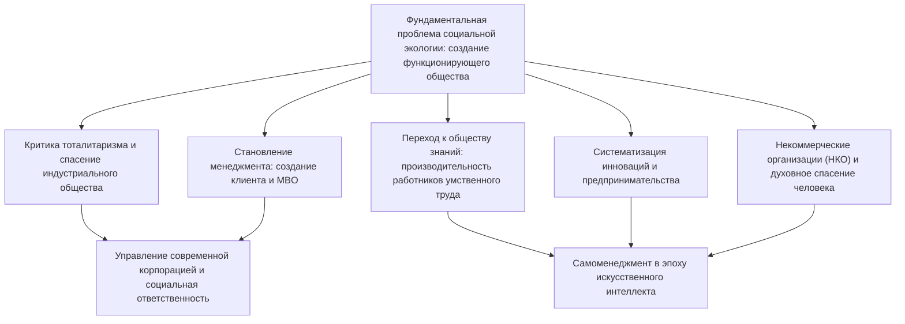
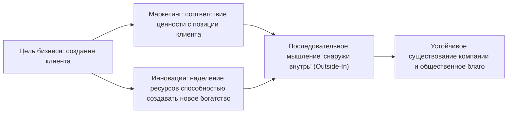
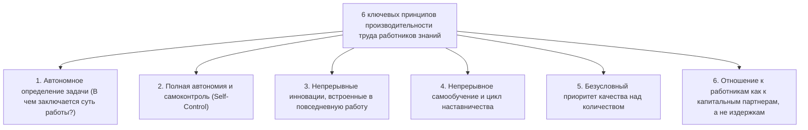
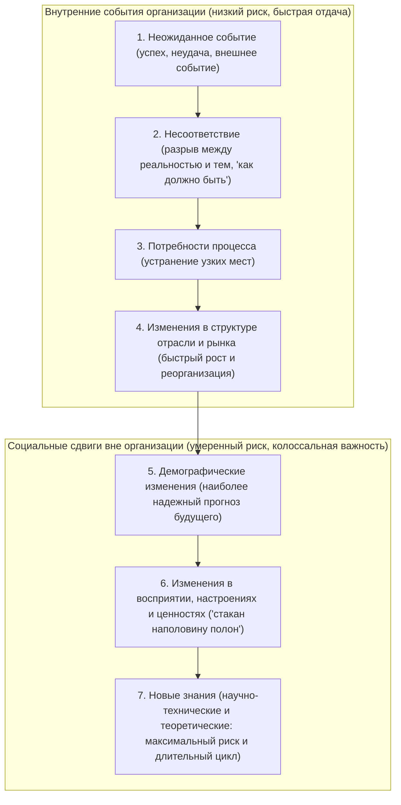

## 1. Введение: Масштаб интеллекта Питера Друкера — мыслителя номер один XX века

### 1.1 Умаление статусом «отца менеджмента» и истинная сущность «социального эколога»

Имя Питера Фердинанда Друкера (Peter Ferdinand Drucker, 1909–2005) известно всему миру под почетным титулом «отца современного менеджмента» (Father of Modern Management). Однако сам он на протяжении всей своей долгой жизни категорически противился подобному ярлыку. Друкер неизменно предпочитал определять свое призвание собственным уникальным термином — **«социальный эколог» (Social Ecologist)**.

Подобно тому как биологическая экология исследует взаимодействия живых организмов с окружающей средой и механизмы поддержания динамического равновесия, социальная экология изучает рукотворную среду обитания человека — предприятия, государственные институты, университеты, больницы, церкви и семьи. Она наблюдает за тем, как люди живут, трудятся, взаимодействуют и выстраивают социальный порядок внутри этих разнообразных институтов и структур.

В центре внимания Друкера никогда не находились сугубо прикладные управленческие уловки, инструменты максимизации сиюминутной корпоративной прибыли или алгоритмы узко понятой операционной эффективности. Вопрос, который он неустанно задавал на протяжении всей своей жизни, носил глубоко этический, философский и гуманистический характер: **«Как построить функционирующее общество (a functioning society), в котором человек может жить, сохраняя подлинную свободу и достоинство?»** Он посвятил себя исследованию бизнеса и корпораций именно потому, что в XX веке корпорация превратилась в центральный репрезентативный институт общества (Representative Institution), определяющий саму ткань жизни, статус и идентичность сотен миллионов людей.

Многие современные практики и исследователи, читающие труды Друкера, часто забывают о том, что отправной точкой его интеллектуального пути стала трагедия европейского континента накануне Второй мировой войны: подъем нацизма и мучительное политико-философское отчаяние перед лицом тоталитарной угрозы Гитлера. В настоящем фундаментальном исследовании мы проследим скрытые идейные течения, пронизывающие всю жизнь и творчество Питера Друкера, и подробно разберем оставленное им грандиозное интеллектуальное наследие.

---

### 1.2 Закат Вены, подъем нацизма и генезис теории организаций из критики тоталитаризма

Чтобы постичь истоки философии Друкера, необходимо обратиться к интеллектуальной атмосфере Вены эпохи заката Габсбургской монархии. Родившись в 1909 году в состоятельной семье венских интеллектуалов Австро-Венгерской империи, юный Питер рос в доме, где постоянными гостями были такие титаны европейской мысли, как Зигмунд Фрейд, Йозеф Шумпетер, Людвиг фон Мизес и Фридрих Хайек.

Однако крушение Габсбургской империи в горниле Первой мировой войны повергло европейское общество 1920–1930-х годов в пучину беспрецедентного духовного и социального распада. Вековые сословные устои и религиозные авторитеты рухнули; индивид лишился привычных общинных опор и превратился в изолированную единицу атомизированной массы. Великая депрессия 1929 года окончательно подорвала веру в свободный капиталистический рынок и буржуазную демократию.

В этом зияющем духовном вакууме и социальном отчаянии зародились две чудовищные формы тоталитаризма: национал-социализм Гитлера и коммунизм Сталина. Молодой Друкер, защитивший докторскую диссертацию по международному праву во Франкфурте и работавший журналистом, воочию наблюдал стремительное погружение Германии во тьму нацизма. Сразу после прихода Гитлера к власти в 1933 году Друкер покинул Германию, уехав сначала в Великобританию, а затем в 1937 году эмигрировав в Соединенные Штаты Америки.

Для Друкера фашизм и тоталитаризм были не просто военным безумием или политической тиранией. Они представляли собой **«отчаянный и патологический бунт, ставший прямым следствием неспособности современного западного общества предоставить человеку легитимный социальный статус (Status) и осмысленную функцию (Function)»**. Следовательно, победить тоталитаризм лишь силой оружия было недостаточно. Необходимо было спроектировать новое нетоталитарное свободное общество, где каждый гражданин обрел бы устойчивое место, значимую созидательную роль, пространство для самореализации и человеческое достоинство. Именно это острое чувство миссии побудило Друкера посвятить свою жизнь исследованию феномена организаций и менеджмента.

---

## 2. Идейные истоки философии Друкера: трагедия тоталитаризма и спасение индустриального общества

### 2.1 «Конец экономического человека» (1939) — пределы марксизма и капитализма, патология фашизма

В 1939 году, находясь в эмиграции, Друкер опубликовал свою первую знаковую книгу — «Конец экономического человека: истоки тоталитаризма» (The End of Economic Man: The Origins of Totalitarianism). Труд никому не известного тридцатилетнего автора был мгновенно замечен и удостоен высочайшей похвалы Уинстона Черчилля, включившего его в обязательный список литературы для офицеров британской армии.

В этой работе Друкер препарировал природу нацизма, показав, что за ним стояло не «рациональное зло», а «иррациональное магическое суеверие, захватившее умы после того, как рациональные надежды сменились полным крахом». Европейское общество со времен Просвещения XVIII века базировалось на концепции «экономического человека» (Economic Man). Капитализм сулил, что свободное преследование эгоистических экономических интересов индивидов на свободном рынке благодаря «невидимой руке» гармонизирует общество и принесет всеобщее изобилие. Марксизм же обещал, что пролетарская революция и уничтожение классов приведут к царству подлинного равенства и свободы.

Однако капитализм породил хроническую безработицу, вопиющее неравенство и катастрофу Великой депрессии, а коммунистический эксперимент обернулся кровавой диктатурой и лагерями ГУЛАГа. Крушение обеих версий светской веры повергло западный мир в черную бездну нигилизма: стало очевидно, что ни экономическая свобода, ни экономическое равенство сами по себе не способны обеспечить человеку счастье и защитить его достоинство.

Фашизм мастерски паразитировал на этом духовном пепелище. Он открыто отринул экономическую рациональность и буржуазную свободу, мобилизовав милитаристскую иерархию, расовые мифы и культ всепоглощающего государства, чтобы дать разочарованным массам суррогат смысла жизни и чувство принадлежности. Друкер пророчески провозгласил: простого отрицания фашизма мало для возрождения цивилизации. Человечеству жизненно необходимо построить «новый социальный порядок», который, сохраняя экономическую целесообразность, выйдет за рамки денежной выгоды и дарует человеку полноценное гражданское существование.

---

### 2.2 «Будущее индустриального человека» (1942) — сообщество, наделяющее человека статусом (Status) и функцией (Function)

В 1942 году, когда США вступили во Вторую мировую войну, Друкер выпустил книгу «Будущее индустриального человека» (The Future of Industrial Man), в которой набросал концептуальный чертеж послевоенного жизнеустройства.

Краеугольными камнями этой работы стали понятия «легитимной власти» (Legitimate Power), а также индивидуального «социального статуса» (Status) и «социальной функции» (Function). Жизнеспособное свободное общество может существовать лишь тогда, когда в нем неукоснительно выполняются два базовых условия:

1. **Легитимность власти**: власть, управляющая обществом, признается самими членами сообщества справедливой, оправданной и обладающей моральным авторитетом.
2. **Статус и функция**: каждый конкретный человек имеет понятное и признаваемое место в социуме (статус) и выполняет роль, вносящую реальный вклад в общее благо (функцию).

В традиционных аграрных и ремесленных обществах до XIX века семья, деревенская община и гильдии гарантировали человеку его статус и функцию. Однако Вторая промышленная революция вывела на историческую сцену исполинские заводы и корпорации, разрушив традиционную общину. Фабричный рабочий превратился в безымянный, легко заменяемый винтик колоссального конвейера, испытывая глубочайшее отчуждение и социальную беспомощность.

Друкер предостерегал: **«Если современное индустриальное предприятие останется исключительно экономическим механизмом по производству материальных благ и не сумеет перерасти в подлинно человеческое сообщество, обеспечивающее работникам социальный статус и осмысленную функцию, свободный мир неминуемо вновь падет жертвой тоталитарного морока»**. Именно здесь было четко сформулировано кредо: корпорация — это не просто частная собственность фабриканта, но автономный институт самоуправления (Government), несущий колоссальную публичную ответственность перед обществом.

---

### 2.3 «Концепция корпорации» (1946) — исследование General Motors изнутри и анатомия гигантской организации

В 1943 году Друкер получил беспрецедентное предложение. Руководство General Motors (GM) — крупнейшей производственной корпорации мира и безусловного флагмана мирового капитализма — пригласило его провести всесторонний независимый аудит управленческой структуры и организационных механизмов компании.

Друкер провел 18 месяцев в штаб-квартире и на заводах GM. Он взял сотни интервью — от легендарного генерального директора Альфреда Слоуна (Alfred P. Sloan) и вице-президентов до директоров заводов, инженеров и простых рабочих на сборочных линиях, — а также регулярно присутствовал на заседаниях высшего руководства. Итогом этой грандиозной исследовательской работы стала классическая книга «Концепция корпорации» (Concept of the Corporation, 1946).

Этот труд впервые в истории рассмотрел крупную корпорацию не просто как экономическую единицу, но как **«политический и социальный институт, выступающий базовой ячейкой современного общества»**. Друкер вскрыл секрет феноменального успеха GM, заключавшийся в разработанной Слоуном системе **«дивизиональной децентрализации» (Decentralization)**. Отказавшись от жестко централизованного военного командования, GM делегировала операционную автономию самостоятельным подразделениям, возложив на них прямую рыночную ответственность за результаты. Это позволило совместить мощь масштаба корпорации с гибкостью и инициативой на местах.

---

### 2.4 Идейный раскол со Слоуном: технократический рационализм GM против человекоцентричной автономии

Однако появление «Концепции корпорации» вызвало бурю негодования в высших эшелонах General Motors. Альфред Слоун и совет директоров категорически отвергли рекомендации Друкера, касавшиеся «делегирования полномочий рабочим», «создания самоуправляемых бригад», «развития самоуправления фабричных сообществ» и «обеспечения гарантий занятости как фундамента человеческого достоинства».

Для Слоуна корпорация представляла собой прецизионно настроенный инженерный механизм, призванный с максимальной эффективностью комбинировать капитал, технологии и трудовые ресурсы. Рабочий же в его глазах оставался строго экономической единицей, продающей свою рабочую силу по трудовому договору. Слоун заклеймил выводы Друкера как «сентиментальный социалистический утопизм» и фактически запретил книгу внутри GM (по иронии судьбы, Генри Форд II — глава главного конкурента, Ford Motor Company — буквально зачитывался этой книгой и применил принципы Друкера для легендарного спасения своей терпящей крах компании).

Конфликт со Слоуном предопределил всю последующую интеллектуальную траекторию Друкера. Он окончательно отверг бюрократическое администрирование сверху вниз и диктат сухих финансовых показателей, посвятив оставшуюся жизнь разработке **«модели децентрализованного самоуправления, основанной на вере в человеческий потенциал и самоконтроль»**.

---

## 3. Рождение «менеджмента» и его сущностная система

### 3.1 Дисциплина, заложенная книгой «Практика менеджмента» (1954)

В 1954 году увидела свет фундаментальная работа Друкера «Практика менеджмента» (The Practice of Management). Именно эта книга превратила управление из разрозненного набора эмпирических приемов в самостоятельную системную дисциплину (Discipline). До Друкера руководство бизнесом воспринималось либо как врожденный дар харизматичных лидеров-одиночек, либо как бухгалтерская техника сведения балансов. Друкер же доказал, что менеджмент — это целостная система знаний, которой можно и нужно систематически обучаться и которую можно применять на практике.

Друкер вывел **три универсальные задачи менеджмента**:

1. **Реализация специфического предназначения и миссии организации**: для коммерческого предприятия — достижение экономических результатов; для больницы — исцеление больных; для университета — приумножение знаний и обучение студентов.
2. **Обеспечение высокой производительности труда и достижений работающих людей**: раскрытие максимального потенциала человека, наделение его достоинством и возможностью личностного роста через созидательный труд.
3. **Управление социальными воздействиями (Impacts) организации и вклад в решение общественных проблем**: нейтрализация любого вреда, который деятельность организации наносит окружающей среде и социуму, и выполнение роли ответственного гражданина.

Эти три задачи неразрывно связаны между собой; искусство менеджмента заключается в непрерывном поддержании их динамического баланса.

---

### 3.2 Цель бизнеса — «создание клиента»: дуализм маркетинга и инноваций

Одной из самых цитируемых и одновременно наиболее превратно понимаемых идей Друкера является его определение предназначения компании. Друкер утверждает со всей категоричностью:

> **«Существует лишь одно правомерное определение цели коммерческого предприятия — создание клиента (There is only one valid definition of business purpose: to create a customer).»**

Подавляющее большинство бизнесменов и экономистов свято убеждены, что целью любого бизнеса является максимизация прибыли. Однако, по Друкеру, прибыль никогда не является целью; она представляет собой лишь **необходимое условие (Condition)** и **ограничение (Limitation)** выживания предприятия. Подобно тому как биение сердца и потребление кислорода критически необходимы для поддержания жизни человека, само дыхание вовсе не составляет смысл человеческого бытия.

Если нет клиента, любой бизнес обратится в прах за одно мгновение. Клиент не дается природой сам по себе — он возникает и оформляется исключительно благодаря целенаправленной деятельности компании. Чтобы создавать клиентов, любая коммерческая организация должна обладать **всего двумя базовыми функциями (Basic Functions)**:

1. **Маркетинг (Marketing)**: глубочайшее осмысление истинных потребностей, ценностей и жизненного контекста клиента с целью абсолютной адаптации товаров и услуг к его ожиданиям. «Идеальный маркетинг делает ненужными активные продажи и навязывание».
2. **Инновации (Innovation)**: наделение существующих ресурсов способностью генерировать новое богатство; непрерывное создание новой экономической и социальной ценности.

Все остальные направления деятельности предприятия (бухгалтерия, кадры, финансы, закупки, логистика) являются лишь обеспечивающими центрами затрат. Подлинным и единственным источником прибыли выступает то, что находится вне организации — «удовлетворенность клиента».

---

### 3.3 Правда об управлении по целям и самоконтролю (MBO: Management by Objectives and Self-Control)

Одной из самых революционных концепций, предложенных Друкером в «Практике менеджмента», стала концепция «управления по целям и самоконтролю» (Management by Objectives and Self-Control, MBO).

Сегодня аббревиатуру MBO можно встретить в системах аттестации и оценки персонала большинства корпораций мира. Однако, как с горечью констатировал Друкер на склоне лет, **в 99% случаев современное MBO выродилось в прямо противоположное явление — бюрократический инструмент навязывания планов и квот сверху вниз**.

Истинный нерв друкеровского MBO заключен во второй части формулы — **«самоконтроль» (Self-Control)**. Традиционное администрирование строилось на «внешнем контроле» (External Control): начальник спускал подчиненному план, надзирал за каждым шагом и манипулировал им посредством кнута и пряника. Это не что иное, как атавизм тейлоризма, низводящий человека до уровня пассивной машины.

Напротив, подлинное MBO требует принципиально иной логики:

1. Высшие цели и стратегическая миссия организации кристально ясны и глубоко разделяются всеми сотрудниками.
2. Каждый работник, соотнося себя с общей миссией, самостоятельно формулирует свой вклад и берет на себя личные обязательства по достижению поставленных целей.
3. Организация обеспечивает сотруднику прямой доступ к объективной обратной связи и данным о результатах его труда — **минуя начальственный фильтр**.
4. Работник сам отслеживает динамику своего движения и автономно вносит необходимые коррективы.

Управление по целям — это инструмент освобождения, а не закабаления. Оно призвано **«сделать излишней внешнюю опеку и диктат, превратив каждого работника в самостоятельного и ответственного профессионала»**. Друкер твердо верил, что только внутренняя мотивация (Intrinsic Motivation) и автономия рождают высочайшую результативность и оберегают достоинство человека.

---

### 3.4 Определение результатов и аллокация ресурсов: восемь ключевых областей

Друкер категорически предостерегал от оценки жизнедеятельности компании по единственному критерию — будь то объем продаж или квартальная чистая прибыль. Для устойчивого процветания бизнес обязан ставить цели и отслеживать прогресс в **восьми ключевых областях (Key Result Areas)**:

| Область | Содержание и значение |
| :--- | :--- |
| **1. Маркетинг** | Не только доля на существующих рынках, но и освоение новых рынков, а также степень создания новых клиентов. |
| **2. Инновации** | Инновации не только в товарах и услугах, но и в структуре организации, рабочих процессах и бизнес-моделях. |
| **3. Человеческие ресурсы и организационный потенциал** | Развитие компетенций сотрудников, мотивация, подготовка лидеров следующего поколения и автономия команд. |
| **4. Финансовые ресурсы** | Способность привлекать инвестиции, устойчивость денежных потоков и оптимальное распределение капитала. |
| **5. Материальные ресурсы** | Эффективность и технологическая современность заводов, оборудования, офисов и IT-инфраструктуры. |
| **6. Производительность** | Соотношение созданной добавленной стоимости к затраченным ресурсам (труд, капитал, время, сырье). |
| **7. Социальная ответственность** | Добросовестность и вклад в местное сообщество, защиту окружающей среды, соблюдение законов и этических норм. |
| **8. Необходимая прибыль** | Минимально необходимый уровень прибыли для достижения семи вышеуказанных целей и покрытия рисков будущего. |

Суть друкеровского учения лаконична: **«Прибыль — это не цель, а непременное условие существования бизнеса»**. Прибыль — это одновременно оценка прошлых решений и «страховая премия», позволяющая компании оплачивать риски будущей неопределенности.

---

## 4. Предвидение общества знаний и явление «работника умственного труда» (Knowledge Worker)

### 4.1 От «Эпохи разрыва» (1969) к «Посткапиталистическому обществу» (1993)

Среди бесчисленных пророчеств Друкера наиболее колоссальный цивилизационный эффект имело его предвидение наступления «общества знаний» (Knowledge Society). В 1959 году в книге «Ориентиры завтрашнего дня» (Landmarks of Tomorrow) Друкер впервые в истории употребил термин **«работник умственного труда» / «работник знаний» (Knowledge Worker)**.

А в классическом труде 1969 года «Эпоха разрыва» (The Age of Discontinuity) он возвестил о тектоническом сдвиге в основах мировой экономики. Если классическая политэкономия считала базовыми факторами производства землю (природные ресурсы), труд (физический труд) и капитал (машины и заводы), то во второй половине XX века эти традиционные ресурсы отошли на второй план. Наступила новая эпоха, в которой **«знание» (Knowledge) стало единственным по-настоящему решающим фактором производства**.

В книге 1993 года «Посткапиталистическое общество» (Post-Capitalist Society) Друкер развил эту мысль до логического завершения. В эпоху классического капитализма власть принадлежала владельцам материального капитала (буржуазии и инвесторам). В обществе знаний подлинный капитал сосредоточен между ушами работающих людей. Поскольку работники знаний владеют средствами производства (своим интеллектом и экспертными навыками) и могут свободно унести их с собой в любой момент, баланс сил между организацией и работником впервые в истории перевернулся.

---

### 4.2 Исторический переход от физического труда (тейлоризма) к труду интеллектуальному

Величайшим экономическим чудом XX века стал колоссальный — **почти в 50 раз — взлет производительности физического труда**, достигнутый благодаря принципам «научного менеджмента» Фредерика Уинслоу Тейлора (Frederick Winslow Taylor). Тейлор разложил ручной труд на элементарные микродвижения посредством хронометража и оптимизации. Эта революция сделала возможным массовое производство, сформировала мощный средний класс и сняла остроту марксистской классовой борьбы в развитых странах.

Однако Друкер предостерегал: «Если главным достижением менеджмента в XX веке стало повышение производительности физического труда, то **главным вызовом XXI века становится повышение производительности труда работников знания**».

Между физическим и интеллектуальным трудом пролегает фундаментальная пропасть:

| Характеристика | Физический труд (Manual Work) | Умственный труд / Труд знаний (Knowledge Work) |
| :--- | :--- | :--- |
| **Определение задачи** | Содержание работы задано заранее и не подлежит сомнению (например, переносить балки, закручивать болты). | Работник должен самостоятельно ответить на вопрос: **«В чем состоит моя задача? Ради чего я работаю?»** |
| **Автономия** | Добродетелью считается строгое следование инструкциям; процесс жестко контролируется извне. | Необходима **полная автономия (Autonomy)**; неспособность к самоуправлению исключает результативность. |
| **Непрерывные инновации** | Инновации разрабатываются инженерами, технологами и проектировщиками процессов. | Сам работник знаний обязан **непрерывно интегрировать инновации** в свою ежедневную практику. |
| **Обучение и развитие** | Навык осваивается один раз и совершенствуется путем многократного повторения. | Знания устаревают стремительно, поэтому **непрерывное обучение и преподавание на протяжении всей жизни** обязательны. |
| **Критерий оценки** | Главным образом **«количество» (Quantity)** (сколько единиц продукции изготовлено за единицу времени). | Главным образом **«качество» (Quality)** (насколько глубокие инсайты и эффективные решения были предложены). |
| **Собственность на средства производства** | Заводы, станки и оборудование принадлежат **капиталисту**. | Средства производства (знания, интеллект, способность суждения) принадлежат **самому работнику**. |

В сфере интеллектуального труда работа от рассвета до заката ни в коей мере не гарантирует результата. Если вы виртуозно и эффективно решаете не ту задачу, вы просто умножаете бессмысленный мусор. Методы Тейлора здесь бесполезны и даже губительны: требуется принципиальная смена управленческой парадигмы.

---

### 4.3 Шесть фундаментальных принципов продуктивности работника знаний

В своей фундаментальной работе «Задачи менеджмента в XXI веке» (Management Challenges for the 21st Century, 1999) Друкер сформулировал **шесть условий продуктивности работника умственного труда**:

1. **Непрерывный поиск ответа на вопрос: «В чем состоит задача?»**: первый и важнейший шаг в интеллектуальном труде — определить, что именно необходимо сделать. Нет ничего более разрушительного, чем высокоэффективно делать то, чего делать не следует вообще.
2. **Предоставление полной автономии**: работник знаний обязан управлять собой самостоятельно. Только автономия рождает персональную ответственность и профессионализм.
3. **Обязательная интеграция инноваций в работу**: непрерывное обновление подходов и создание новой ценности должны стать неотъемлемой частью должностных обязанностей.
4. **Непрерывное самообучение и обучение других**: работник умственного труда должен непрерывно учиться сам и выступать наставником для коллег. Преподавание — непревзойденный способ структурировать и углубить собственные знания.
5. **Безусловный приоритет качества над количеством**: одна глубокая, меняющая правила игры аналитическая записка неизмеримо ценнее сотни поверхностных отчетов.
6. **Отношение к работнику не как к статье затрат, а как к капитальному активу**: в работниках знаний необходимо видеть партнеров, инвестирующих свой интеллектуальный капитал в общее дело организации.

---

### 4.4 «Работник знаний должен быть генеральным директором самого себя»: искусство самоменеджмента

Общество знаний предъявляет беспрецедентные требования к личности. В эпохальном эссе 1999 года «Управление собой» (Managing Oneself) Друкер обратился с прямым предостережением ко всем профессионалам новой эпохи.

В традиционном обществе судьба и ремесло человека определялись его рождением и сословием. В индустриальную эру корпорация вела сотрудника по карьерной лестнице вплоть до пенсии. В обществе знаний ситуация радикально иная: **«Каждый человек обязан сам проектировать собственную карьеру и лично управлять своей результативностью»**. Сегодня, когда продолжительность жизни превышает 80 лет, средняя продолжительность жизни коммерческих компаний (около 30 лет) оказывается значительно короче трудовой биографии человека. Каждый специалист превращается в генерального директора компании имени себя («ЗАО Я»).

Друкер предложил практическую методику эффективного самоменеджмента:

#### ① Опирайтесь исключительно на свои сильные стороны (Strengths)
Главная антропологическая аксиома Друкера гласит: **«Человек может достичь выдающихся результатов только благодаря своим сильным сторонам. Невозможно добиться успеха, исправляя слабости»**.

Традиционная школьная система и корпоративные тренинги тратят колоссальные ресурсы на выявление недостатков и попытки подтянуть их до «среднего уровня». Однако превращение полной бездарности в посредственность требует титанических усилий, тогда как развитие подлинного таланта в первоклассное мастерство требует куда меньших затрат и приносит колоссальные плоды.

Единственным надежным инструментом выявления своих истинных достоинств Друкер считал **«анализ обратной связи» (Feedback Analysis)**:
- Принимая ключевое решение или начиная важный проект, **четко зафиксируйте на бумаге ожидаемые результаты**.
- Спустя 9 месяцев или год **скрупулезно сопоставьте реальные итоги с первоначальными ожиданиями**.
- Повторяя эту процедуру в течение нескольких лет, вы с беспощадной объективностью увидите, в чем кроется ваша подлинная сила, при каких условиях вы демонстрируете максимальную отдачу, а за какие задачи вам не стоит браться вовсе.

#### ② Поймите, как именно вы работаете (How I Perform)
Не менее важно осознать свой уникальный когнитивный стиль:
- **Кто вы — «читатель» (Reader) или «слушатель» (Listener)?** (Генерал Дуайт Эйзенхауэр был ярко выраженным читателем: на устных пресс-конференциях он запинался и допускал ошибки, но блистал, когда заранее прочитывал письменные материалы; Франклин Рузвельт и Гарри Трумэн, напротив, были эталонными слушателями).
- **Как вы усваиваете информацию?** (Через написание текстов, диалог с другими или практическое действие).
- **Кто вы по своей природе — человек, принимающий решения (Decision Maker), или первоклассный советник (Adviser)?** (История знает множество блестящих аналитиков и вторых лиц, которые, став первыми руководителями, немедленно разрушали организацию своей нерешительностью).

#### ③ Готовьтесь ко второй половине жизни (Вторая карьера)
Физический рабочий уходит на покой из-за износа тела. Работник умственного труда к 45–50 годам нередко сталкивается с выгоранием, скукой и застоем. Проработав 20 лет на одном месте, он перестает расти.

Друкер настоятельно рекомендовал задолго до наступления 40–45 лет **начать развивать параллельную сферу деятельности (Parallel Career)** — будь то преподавание, общественная деятельность или работа в некоммерческом секторе. Наличие независимого пространства, где вы можете применить свои таланты и принести реальную пользу обществу, служит надежным якорем. Это единственный способ сохранить духовную автономию и достоинство в случае внезапного краха или увольнения в корпорации и прожить осмысленную, насыщенную вторую половину жизни.

---

## 5. Систематические техники инноваций и дух предпринимательства

### 5.1 «Бизнес и инновации» (1985)

Большинство людей романтически воображают инновации как «внезапную вспышку озарения безумного гения среди ночи» либо связывают их с гигантскими бюджетами на НИОКР в ожидании прорывных фундаментальных научных открытий.

В 1985 году Друкер выпустил книгу «Бизнес и инновации» (Innovation and Entrepreneurship), в которой разбил этот романтический миф в пух и прах. Инновации для Друкера — это не дар свыше, а **«строгая дисциплина (Discipline), которой можно и нужно систематически обучаться и которую необходимо планомерно практиковать»**.

Друкер дает инновациям следующее определение:
> **«Инновация — это действие, наделяющее ресурсы новой способностью создавать богатство. Более того, до появления инновации никаких "ресурсов" в природе не существует вовсе. Пока человек не найдет полезного применения и не наделит экономической ценностью тот или иной природный элемент, любое растение остается сорняком, а любая руда — просто бесполезным куском скалы.»**

До середины XIX века, пока не появились процессы нефтепереработки и двигатель внутреннего сгорания, сырая нефть считалась мерзкой жидкостью, отравлявшей пахотные земли. В драгоценный «ресурс» ее превратила не сама по себе химия, а предпринимательская инновация, связавшая свойства вещества с насущными социальными потребностями.

---

### 5.2 Ниспровержение культа «озарения»: семь источников инноваций

Друкер систематизировал **«семь источников инновационных возможностей» (The Seven Sources for Innovative Opportunity)**, расположив их в порядке убывания надежности и возрастания степени риска.

#### ① Неожиданное событие (The Unexpected)
Самый доступный, надежный и в то же время наиболее игнорируемый корпорациями источник — это «неожиданный успех» (Unexpected Success) и «неожиданная неудача» (Unexpected Failure).
- **Неожиданный успех**: когда IBM выпустила свои первые ЭВМ, рассчитанные исключительно на научные расчеты, машины внезапно стали массово скупать банки и страховые компании для бухгалтерии. Руководство было в недоумении, ведь компьютеры предназначались для другого. Однако IBM вовремя сориентировалась и бросила все силы на этот неожиданный рынок, построив глобальную IT-империю.
- Большинство компаний на заседаниях правления часами мусолят провалы и отставания от бюджета, с раздражением отмахиваясь от неожиданных побед как от случайных аномалий. Друкер учил: первую страницу управленческого отчета нужно посвящать исключительно неожиданным успехам и направлять на их развитие лучших лидеров.

#### ② Несоответствие (Incongruities)
Разрыв между тем, «как должно быть» в умах экспертов, и тем, «что происходит в реальности».
- В 1950-е годы судоходные компании тратили колоссальные деньги на увеличение скорости судов и экономию топлива, но их рентабельность неуклонно падала. Подлинная статья расходов скрывалась не в море, а в портах — в бесконечных простоях судов под погрузкой и разгрузкой. Осознав этот разрыв, Малкольм Маклин (Malcolm McLean) изобрел **контейнерные перевозки (Containerization)**. Оставив сами корабли прежними, он соединил железнодорожный и морской транспорт стандартными ящиками-контейнерами, сократив время разгрузки с недель до считанных часов и вызвав взрыв мировой торговли.

#### ③ Потребности процесса (Process Need)
Острая необходимость заменить «слабое звено» (Missing Link) или устранить узкое место в существующем производственном или сервисном процессе.
- Появление фотоаппаратов Polaroid, устранивших необходимость долгой проявки пленки в лаборатории, или автоматических телефонных станций, заменивших ручной труд телефонных операторов при междугородней связи.

#### ④ Изменения в структуре отрасли и рынка (Industry and Market Structures)
Когда отрасль растет со скоростью 10% в год и выше, традиционная структура рынка неминуемо рушится, открывая путь новым игрокам.
- Фокус компании Volvo на безопасности пассажиров в эпоху взрывной автомобилизации или триумф платформ онлайн-трейдинга в эпоху дерегулирования финансовых рынков.

#### ⑤ Демографические изменения (Demographics)
Среди факторов **«будущего, которое уже наступило» (The Future that has already happened)**, демография (рождаемость, смертность, возрастная пирамида, уровень образования) является наиболее точной и предсказуемой переменной.
- Число 20-летних людей через 20 лет известно со стопроцентной гарантией уже сегодня по числу родившихся младенцев. Старение населения, падение рождаемости или урбанизация открывают гигантские возможности для инноваций.

#### ⑥ Изменения в восприятии, настроениях и ценностях (Changes in Perception)
Факты остаются неизменными, но угол зрения общества радикально переворачивается.
- Эффект «стакана, который наполовину пуст, а не наполовину полон». Развитие современной медицины сделало людей здоровее и долговечнее, чем когда-либо в истории, но вызвало параноидальную тревогу о здоровье. Взрывной рынок органических продуктов, фитнеса и биологических добавок был вызван не ухудшением физического здоровья, а тектоническим сдвигом в общественном восприятии.

#### ⑦ Новые знания (New Knowledge)
Инновации, основанные на научно-технических изобретениях, теориях и открытиях.
- Именно их обыватели ошибочно считают сутью инноваций. Однако Друкер предостерегал: **инновации на основе новых знаний — самые рискованные, требуют колоссальных капиталовложений и обладают самым долгим циклом вывода на рынок** (от открытия до коммерциализации обычно проходит 25–30 лет). Кроме того, они требуют конвергенции (Convergence) множества разнородных технологий, что делает ставку на них крайне венчурной.

---

### 5.3 Систематический отказ (Systematic Abandonment): мужество убить вчерашний успех

Главный первый шаг к инновациям вовсе не в том, чтобы «придумывать свежие идеи». Друкер отрезает: **«Первый шаг к инновациям — это запланированное, систематическое уничтожение и отказ (Abandonment) от старого, неэффективного и вчерашнего успеха»**.

Любая организация склонна концентрировать лучших специалистов и львиную долю бюджетов на поддержании устаревших продуктов, услуг и угасающих подразделений. Чем грандиознее был вчерашний триумф, тем священнее становится эта корова, и никто не решается заявить о ее кончине. В итоге ресурсы для создания будущего попросту иссякают.

Друкер обязал каждого руководителя регулярно задавать себе беспощадный вопрос:

> **«Если бы мы уже не занимались этим сегодня, стали бы мы начинать это дело сейчас, обладая всеми теми знаниями и информацией, которыми располагаем сегодня?»**

Если ответ звучит как твердое «Нет!», необходимо немедленно спросить себя: «Что же мы должны предпринять в отношении этого сегодня?» Речь не должна идти о косметических улучшениях или попытках реанимации трупа — необходим решительный, организованный выход из бизнеса. Подобно тому как живой организм умирает, если перестает выводить отмершие клетки, организация, не умеющая систематически отказываться от вчерашнего дня, обречена задохнуться.

---

## 6. Корпоративное управление, социальная ответственность и высокая миссия некоммерческих организаций (НКО)

### 6.1 «Менеджмент» (1973): три фундаментальные задачи и подлинная социальная ответственность

В 1973 году Друкер подвел монументальный итог своим философским изысканиям, опубликовав двухтомный шедевр объемом более 1000 страниц — «Менеджмент: задачи, обязанности, практика» (Management: Tasks, Responsibilities, Practices).

В этой книге концепция «корпоративной социальной ответственности» (CSR) рассматривается с недосягаемой для современных поверхностных PR-акций и корпоративной благотворительности (Philanthropy) глубиной. Друкер жестко разделяет социальную ответственность на две принципиальные категории:

1. **Нейтрализация негативных воздействий (Impacts) собственной деятельности**:
   - Выбросы, шум, токсичные отходы, профессиональные травмы и психологическое выгорание персонала — любые побочные эффекты, причиняемые обществу и природе функционированием организации.
   - Позиция Друкера бескомпромиссна: **«Организация обязана за свой счет полностью свести к нулю любое негативное воздействие на социум и природу, чего бы это ни стоило»**. Попытки закрывать на это глаза являются предательством общества и подрывом собственной институциональной легитимности.
2. **Решение общесоциальных проблем (Social Problems)**:
   - Бедность, доступность образования, деградация городской среды или системные болезни общества, не связанные напрямую с деятельностью предприятия.
   - Здесь Друкер формулирует предельно прагматичный закон: «Браться за решение социальных язв допустимо **исключительно тогда, когда организация способна обратить их в прибыльную возможность для бизнеса (Business Opportunity)**, опираясь на свои профильные компетенции». Пытаться из сентиментальных соображений взваливать на компанию непосильные социальные бремена, разрушая ее базовую конкурентоспособность, — вершина безответственности.

---

### 6.2 Почему на закате жизни Друкер отдал свое сердце некоммерческому сектору (НКО)

Начиная с 1980-х годов Друкер, признанный интеллектуальный лидер мирового масштаба, посвятил львиную долю своей энергии некоммерческим организациям (NPO/NGO) — университетам, клиникам, фондам, движению герлскаутов, Армии спасения и церковным общинам. В 1990 году он опубликовал основополагающую книгу «Управление в некоммерческих организациях» (Managing the Non-Profit Organization).

Почему великий апологет бизнеса на закате дней развернулся лицом к НКО? В этом решении крылась глубокая логика всей его жизни, направленной на созидание «функционирующего общества».

Бизнес создает товары и услуги, формируя клиентов. Государство издает законы и применяет принуждение, поддерживая правопорядок. Но **ни бизнес, ни государство не способны преобразовать человеческую душу и возродить живое сообщество**:
- Миссия больницы — не сведение баланса, а исцеление страждущих.
- Миссия церкви — спасение душ прихожан.
- Миссия Армии спасения — вернуть спившегося бездомного к трезвой жизни, сделав его полноправным и гордым гражданином.

Друкер провозгласил: **«Главный продукт, который обязана производить некоммерческая организация, — это преображенный человек (A Changed Human Being)»**.

Более того, Друкер сформулировал ошеломляющий парадокс. Принято считать, будто НКО должны учиться у бизнеса технологиям управления. Друкер утверждал обратное: **«Это коммерческим корпорациям жизненно необходимо учиться подлинному менеджменту у образцовых некоммерческих организаций!»**

Ведь в НКО лидеров лишают права удерживать людей зарплатой — там трудятся волонтеры. Ими движет исключительно «высокая миссия» (Mission) и гордость за личный вклад. Не имея возможности откупиться деньгами, руководство некоммерческой организации обязано виртуозно формулировать цели, вдохновлять едиными ценностями и выстраивать идеальный самоконтроль. Именно такое искусство руководства волонтерами служит величайшим учебником для бизнеса XXI века, которому предстоит взаимодействовать с работниками знаний как с равноправными партнерами.

---

## 7. Переосмысление наследия Питера Друкера в XXI веке и эпоху искусственного интеллекта

### 7.1 Генеративный ИИ и новый тектонический сдвиг в обществе знаний

В 2020-е годы, с триумфальным явлением больших языковых моделей (LLM) и генеративного ИИ вроде ChatGPT, общество знаний вступило в фазу, превосходящую любые фантазии эпохи самого Друкера.

Рутинные интеллектуальные операции, которые десятилетиями считались цитаделью «труда знаний» — написание программного кода, подготовка отчетов, первичный анализ данных, юридический поиск прецедентов, рутинная медицинская диагностика — сегодня выполняются нейросетями за секунды с феноменальной точностью. То, что век назад Тейлор проделал с мускульным трудом, сегодня происходит с белыми воротничками.

Устарела ли в этих реалиях философия Друкера? Напротив, ее актуальность возросла в астрономических масштабах. Друкер неустанно повторял: **«Выдавать ответы (Execution) — это механическая работа вычислительной машины; подлинно человеческая миссия заключается в том, чтобы задавать правильные вопросы (Asking the Right Questions)»**.

ИИ феноменально справляется с обработкой контекста и синтезом готовых знаний по запросу. Но он органически не способен задать фундаментальные смысловые вопросы:
- «В чем состоит подлинная миссия нашей организации?»
- «Что является высшей ценностью для нашего клиента?»
- «От какого вчерашнего успеха мы обязаны отказаться прямо сейчас?»
- «Какую моральную ответственность мы несем перед обществом и будущими поколениями?»

По мере того как искусственный интеллект берет на себя вычислительную и компилятивную рутину, единственной неповторимой территорией человека остается то, о чем непрерывно писал Друкер: «этическое суждение», «ценностный выбор», «формулирование миссии» и «построение живых человеческих отношений». Менеджмент окончательно очищается от шелухи и предстает в своем истинном величии — как прикладная философия.

---

### 7.2 Перекличка с Agile, OKR и бирюзовыми организациями: глубинное тождество

Те, кто сегодня изучает передовые управленческие концепции — будь то гибкие методологии разработки (Agile), целеполагание через OKR (Objectives and Key Results) или самоуправляемые «бирюзовые организации» Фредерика Лалу (Teal Organizations), — неизменно поражаются: все эти революционные подходы были детально сформулированы Друкером более полувека назад.

- **Фокус Agile на клиенте и итеративных инкрементах** — это прямое воплощение максимы Друкера о создании клиента и непрерывной интеграции инноваций в ежедневную рутину.
- **Система OKR, рожденная Энди Гроувом в Intel и масштабированная Google**, представляет собой прямую адаптацию друкеровского MBO (управления по целям и самоконтролю).
- **Самоуправление (Self-Management) и целостность личности в «бирюзовых организациях»** — точнейшее эхо друкеровской концепции «Будущего индустриального человека»: создание институтов, дарующих личности статус, функцию и автономию в сообществе.

Идеи Друкера не являются покрытой пылью классикой. Все современные прорывные управленческие концепции стоят на плечах этого гиганта, пожиная плоды с возделанной им интеллектуальной целины.

---

### 7.3 Заключение: на пути к пока еще не построенному «функционирующему обществу»

Питер Друкер не выпускал пера из рук и не покидал преподавательской кафедры вплоть до своей кончины в возрасте 95 лет. Главный завет, который выносит каждый, кто вдумчиво прочитал его колоссальное собрание сочинений, — это вовсе не свод рецептов для легкого обогащения. Это **«глубочайшая вера в человека и безграничное чувство ответственности перед обществом»**.

В XXI веке, когда погоня за сиюминутной прибылью затмевает разум, когда близорукий акционерный капитализм выжимает соки из людей и природы, а технологическая сингулярность ставит под вопрос само человеческое достоинство, нам как никогда необходимо вернуться к истокам мысли Питера Друкера.

Организация создается для того, чтобы превратить человеческие сильные стороны в созидательный результат, а человеческие слабости сделать несущественными. Менеджмент — это не осуществление диктаторской власти, а нравственная практика, призванная наделять людей ответственностью, способствовать их росту и утверждать свободу.

Великая мечта Друкера о «функционирующем свободном обществе, где каждый человек трудится с достоинством и гордостью, принося сознательную пользу миру в качестве ответственного гражданина», все еще остается непокоренной вершиной. Принять эту эстафету и воплотить идеалы в жизнь на своем рабочем месте — долг и священная миссия каждого из нас.
