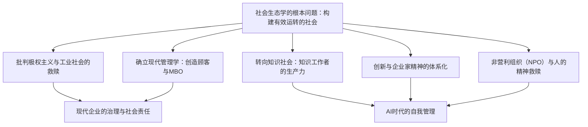
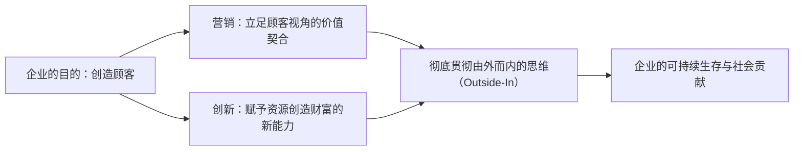
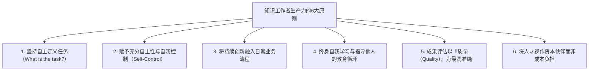

## 1. 导论：20世纪最伟大的智者彼得·德鲁克的思想格局

### 1.1 “现代管理学之父”称号的矮化与作为“社会生态学家”的本质

彼得·F·德鲁克（Peter Ferdinand Drucker, 1909–2005）的名字享誉全球，被世人尊称为“现代管理学之父（Father of Modern Management）”。然而，他终其一生都对这一头衔敬谢不敏。德鲁克终生自封并坚持使用的唯一头衔是——“社会生态学家（Social Ecologist）”。

正如生物学中的生态学（Ecology）观察并研究动植物与其生存环境之间的相互作用与动态平衡一样，社会生态学是一门观察人类在自身所创造的社会环境——企业、政府、大学、医院、教会以及家庭等各种组织与制度之中，如何生活、工作、建立人际关联并构建社会秩序的学问。

德鲁克关注的核心，从来不是“如何实现企业利润最大化的雕虫小技”，也不是“提高经营管理效率的实用工具”。他毕生不断追问的根本问题是：**“如何构建一个让身处其中的人既能保持自由与尊严，又能使社会有效运转的‘机能健全的社会’（a functioning society）？”** 这是一个极具伦理高度、哲学意蕴与人道主义情怀的终极命题。他之所以将毕生心血倾注于商业与企业组织的剖析，是因为在20世纪，工商企业成为了现代社会的代表性机构（Representative Institution），成了决定普通人生活方式与身份认同的最主要场所。

当代许多阅读德鲁克著作的商业人士与学者，往往忽略了一个至关重要的事实：德鲁克在二战前的欧洲亲历了纳粹主义的崛起，他是从“面对希特勒的极权主义究竟该如何反抗与拯救文明”这一痛切的政治哲学绝望中启程的。本文将沿着贯穿德鲁克整个人生与全部著作的思想伏流，以万字长文彻底解构他留给人类的那座宏大深邃的智慧殿堂。



---

### 1.2 维也纳的黄昏、纳粹主义的崛起，以及源于批判极权主义的组织论

要探寻德鲁克的思想源头，就必须回到他出生并成长的哈布斯堡帝国末期的维也纳。1909年，德鲁克出生于奥匈帝国首都维也纳一个富裕的知识分子家庭。他的家中群星闪耀，弗洛伊德、熊彼特、米塞斯、哈耶克等当时代表欧洲顶尖智慧的学者都是他父母客厅的座上宾。

然而，随着第一次世界大战的爆发，哈布斯堡帝国土崩瓦解。在随后的1920至1930年代，欧洲社会遭遇了前所未有的精神与社会双重崩溃。传统的阶级秩序与宗教权威分崩离析，个人失去了原本立足的共同体，沦为孤立无援的原子化大众。1929年席卷全球的大萧条更是雪上加霜，彻底摧毁了人们对资本主义自由市场与资产阶级民主制度的信任。

在这巨大的精神虚无与绝望之中，希特勒的国家社会主义（纳粹主义）与斯大林的共产主义这两大极权主义毒瘤应运而生。在法兰克福取得法学博士学位、作为记者活跃于一线的青年德鲁克，在现场亲眼见证了德国迅速被纳粹黑暗吞噬的惨剧。1933年希特勒夺权后，德鲁克毫不犹豫地逃离德国前往英国，并于1937年流亡美国。

对德鲁克而言，法西斯主义与极权主义绝非单纯的军事狂热或政治疯癫，而是**“近代西方社会因无法再为个人提供合法的社会地位（Status）与社会功能（Function），从而引发的一场绝望且病态的毁灭性叛乱”**。因此，要从根本上战胜极权主义，仅仅依靠军事上的摧毁是远远不够的；人类必须构建一个全新的、非极权主义的自由社会，让每一个普通公民都能在社会中拥有明确的位置与角色，享有自我实现的机会与不可侵犯的尊严。这种强烈的历史使命感，正是驱使德鲁克走向“组织与管理”探索之路的真正内驱力。

---

## 2. 德鲁克思想的原点：极权主义的绝望与工业社会的救赎

### 2.1 《经济人的末日》（1939年）—— 马克思主义与资本主义的局限，法西斯主义的病理

流亡期间的1939年，德鲁克出版了他的第一部划时代著作《经济人的末日》（The End of Economic Man: The Origins of Totalitarianism）。这部出自当时未满30岁的无名青年之手的著作，随即获得了温斯顿·丘吉尔的高度赞誉，并被指定为英国陆军军官的必读参考书。

在这本书中，德鲁克深刻指出，纳粹主义的本质并不是“理性的邪恶”，而是“理性的希望化为绝望之后降临的魔性盲信”。18世纪以来的西方近代社会，一直建立在“经济人（Economic Man）”这一人性假设之上：资本主义承诺“个人在市场中追求自由经济利益的活动，将通过看不见的手为整个社会带来和谐与财富”；而马克思主义则承诺“通过无产阶级革命消灭阶级压迫，将实现真正平等的自由人社会”。

然而，资本主义带来的却是长期的失业、悬殊的不平等以及大萧条的苦难；共产主义带来的则是血腥的暴政与劳改营。当这两种神话同时破灭时，西方社会坠入了“经济自由与经济平等皆无法保障人类幸福与尊严”的虚无主义深渊。

法西斯主义正是趁虚而入。它公然否定经济理性与经济自由，利用军国主义等级秩序、种族主义神话与国家至上主义这些非理性的魔性力量，为绝望的大众重新赋予了虚幻的“生命意义”与“归属感”。德鲁克一针见血地指出：仅仅否定法西斯主义无法让社会重生。人类必须建立一种超越单纯金钱利益、能够包容经济理性同时又赋予人以尊严与公民身份的“全新社会秩序”。

---

### 2.2 《工业人的未来》（1942年）—— 赋予人社会地位（Status）与功能（Function）的共同体

1942年，伴随着美国正式卷入二战，德鲁克出版了《工业人的未来》（The Future of Industrial Man），为战后社会的重构勾勒了宏伟蓝图。

该书的核心概念是“合法权力（Legitimate Power）”以及个人的“社会地位（Status）”与“社会功能（Function）”。德鲁克认为，一个健康且自由的社会要得以维系，必须满足以下两个先决条件：

1. **合法权力**：统治社会的权力必须得到共同体成员的认可，具备正当性与道德权威。
2. **地位与功能**：每一位社会成员在社会中都拥有明确的位置（地位），并能为社会的共同福祉做出独特的贡献（功能）。

在19世纪之前的农业社会或早期商业社会中，家庭、乡村共同体与手工业行会保障了个人的地位与功能。然而，随着第二次工业革命将巨型工厂与现代大企业推上历史舞台，传统的共同体瓦解了。工厂工人沦为庞大生产机器中随时可被替换的螺丝钉，陷入了深深的社会无力感之中。

德鲁克敏锐地预言：**“如果现代工业企业仅仅停留在创造财富的经济机构层面，而不能蜕变为向劳动者提供社会地位与功能的‘人性共同体’，那么自由社会终将再次被极权主义的幽灵吞噬。”** 在此，德鲁克明确宣告：企业在作为工厂主的私有财产之前，首先必须是承担公共社会责任的自主治理组织（Government）。

---

### 2.3 《公司的概念》（1946年）—— 通用汽车（GM）的内部调查与现代庞大组织的解剖

1943年，德鲁克收到了一个前所未有的邀请。当时全球最大的制造企业、资本主义工业皇冠上的明珠——通用汽车（General Motors, GM）的高管团队向他发出邀请，希望他从外部以客观视角对通用汽车的经营结构与组织运作进行全方位的深入调研与剖析。

德鲁克在通用汽车总部进驻了整整18个月。他与首席执行官阿尔弗雷德·斯隆（Alfred P. Sloan）等高管层、工厂厂长、一线工程师乃至流水线装配工进行了无数次深度访谈，并列席各项核心经营会议。这一调研成果最终在1946年汇聚成了现代管理学的奠基之作——《公司的概念》（Concept of the Corporation）。

该书是人类历史上第一部不将现代大企业仅仅视为“经济组织”，而是视其为**“作为社会基本构成单元的政治与社会机构”**来剖析的划时代著作。德鲁克洞察到，通用汽车之所以具备惊人的竞争力，秘诀在于斯隆开创的“事业部制（Decentralization: 分权化管理）”。斯隆没有采取高度集权的军队化管制，而是将权力下放到各个自负盈亏的事业部，让它们直面市场竞争并承担经营责任。这种机制使得庞大如怪兽的巨型企业在保持整体协同的同时，依然能够保有前线的自主性与敏捷度。

---

### 2.4 与斯隆的思想对立：GM式自上而下的理性主义 vs 人性化自主组织论

然而，《公司的概念》一书在通用汽车内部却引发了轩然大波与剧烈反弹。以阿尔弗雷德·斯隆为首的通用汽车管理层，对德鲁克在书中提出的人道主义建议表现出强烈的排斥，包括“向工人充分授权”、“建立自我管理团队”、“推行工厂社区自治”以及“探索保障员工尊严与终身就业”等主张。

在斯隆看来，企业是一台极致理性化、将“资本、技术与劳动力进行最优组合的精密机器”，工人只不过是根据契约以劳动换取报酬的经济生产单元。斯隆将德鲁克的提议斥为“感伤的社会主义空想”，并下令在通用汽车内部将此书列为禁书（讽刺的是，通用汽车当时的死敌——福特汽车的亨利·福特二世却将此书奉为圭臬，并成功借此实现了福特汽车奇迹般的重组与复兴）。

德鲁克与斯隆的这场思想交锋，彻底决定了德鲁克此后的思考方向。德鲁克坚决摒弃了自上而下的官僚控制与数据指标至上主义，确立了将毕生心血投入到**“基于对人的潜能与自我控制充满信任的自主分散型管理模式”**的探索之中。

---

## 3. “管理学”的诞生与本质体系

### 3.1 《管理的实践》（1954年）确立的学科规程

1954年，德鲁克出版了划时代的经典巨著《管理的实践》（The Practice of Management）。正是这部著作，使“管理（Management）”在世界历史上第一次成为一门系统性的学科与规程（Discipline）。在此之前，商业经营普遍被认为是天才企业家的个人直觉、天赐的魅力领导力，或是单纯的财务账目计算技能；德鲁克则将管理升华为一套“人人皆可学习、掌握并付诸实践的系统性知识体系”。

德鲁克在书中将管理的普遍职能归纳为三大核心使命：

1. **实现本机构的特定目的与使命**：对于企业而言是创造经济成果；对于医院而言是救治病患；对于大学而言是探索知识与教书育人。
2. **使工作富有生产力，并使员工富有成就感**：最大限度地激发人的潜能，使人们在工作中获得尊严、价值感与持续成长。
3. **妥善处理本机构对社会产生的影响（Impacts），并为解决社会问题做出贡献**：防止组织的运转对社会造成污染或破坏，恪守良性公民的道德底线。

这三大使命彼此交织、不可分割，管理者的职责便是在这三者之间始终保持动态的平衡。

---

### 3.2 企业的目的在于“创造顾客”：营销与创新的双重驱动

在德鲁克的管理哲学中，最为著名却也最常被误解的，莫过于他对“企业目的”的终极定义。德鲁克斩钉截铁地宣告：

> **“关于企业目的，唯一有效的定义只有一个：那就是创造顾客（There is only one valid definition of business purpose: to create a customer）。”**

绝大多数企业经营者与经济学家固执地认为“企业的目的就是利润最大化”。但在德鲁克看来，利润绝非企业的“目的”，而只是企业得以生存并抵御未来不确定性与风险的“必要条件（Condition）”或“制约因素（Limitation）”。正如心脏跳动和消耗氧气是人类维持生命的必要条件，但呼吸本身绝非人生的目的。

没有顾客，任何企业都会在顷刻间化为乌有。顾客并非自然存在的实体，只有通过企业的价值创造活动，潜在的需求才会被发现并转化为现实的顾客。因此，为了创造顾客，任何企业组织本质上**仅拥有两项基本职能（Basic Functions）**：

1. **营销（Marketing）**：深入理解顾客真实的欲望、现实与价值观，使产品或服务完全契合顾客的需求。“营销的目的在于让销售变得多余”。
2. **创新（Innovation）**：赋予现有资源创造新财富的能力，持续向经济与社会提供全新的价值。

除营销与创新之外，企业的所有其他活动（人事、财务、会计、采购、供应链物流等）都只是为了支撑这两大基本职能而付出的成本。企业真正创造利润的唯一源泉，存在于组织外部——那就是“顾客的满意”。



---

### 3.3 目标管理制度（MBO: Management by Objectives and Self-Control）的真相

德鲁克在《管理的实践》中提出的最具革命性的概念之一，是“目标管理与自我控制（Management by Objectives and Self-Control: MBO）”。

今天，全球无数大企业都在推行所谓的“MBO考核体系”。然而，正如德鲁克晚年极其痛心指出的那样：**现代企业中推行的所谓MBO，有99%都堕落成了与德鲁克初衷彻底背道而驰的“指标下派与考核控制工具”**。

德鲁克所提出的MBO，其精髓完全凝聚在后半截词组上——**“自我控制（Self-Control）”**。传统的管理方式是上级对下级下达硬性指标，监控进度，通过胡萝卜加大棒（信赏必罚）来进行操纵，这是典型的“外在控制（External Control）”，不过是把人视作被动机器的泰勒主义残余。

与此相反，德鲁克所构想的真正MBO包含以下严密过程：

1. 全体成员对整个组织的共同目标与使命达成深度共识。
2. 每一位知识工作者与员工针对这一总体目标，自主思考“我应该做出何种贡献”，并主动设定个人的工作目标。
3. 建立客观的信息反馈系统，使员工**自己能够直接获取衡量自身成果的数据**，而非通过上级来进行信息垄断与评判。
4. 员工根据反馈自我监控工作进度，自主进行动态纠偏与调整。

MBO绝不是用来强化上级对下级人身控制的枷锁，而是**“一种彻底免除外部管制与命令，将每一个人解放为能够自主决策的专业人士的崇高哲学”**。德鲁克坚信，基于内在动机（Intrinsic Motivation）与自我责任的自主性，才能真正赋予人性以尊严，并为组织激发出不可估量的卓越绩效。

---

### 3.4 成果（Results）的定义与资源配置：企业的8大关键领域

德鲁克严厉告诫企业界：决不能仅仅依靠单一指标（如当期销售额或季度利润）来评价企业的经营状况。一个企业若要在健康的轨道上持续生存并造福社会，必须在以下**8大关键成果领域（Key Result Areas）**中制定均衡的目标并保持敏锐追踪：

| 领域 | 核心内涵与战略重要性 |
| :--- | :--- |
| **1. 营销（Marketing）** | 不仅关注现有市场的占有率，更关注新市场的开拓深度与创造新顾客的能力。 |
| **2. 创新（Innovation）** | 不仅涵盖产品与服务的创新，更包括组织架构、业务流程与商业模式的全方位革新。 |
| **3. 人才与组织能力** | 员工能力的持续开发、工作意愿的激发、接班梯队的培养以及团队的高度自主性。 |
| **4. 财务资源** | 获取必要投资资本的能力、现金流的充裕健康度，以及资本的最优配置效率。 |
| **5. 实体资源** | 厂房、生产设备、办公设施、数字IT基础设施等生产基础的高效性与先进性。 |
| **6. 生产力** | 投入的各种资源（劳动力、资本、时间、原材料）转化为高附加值产出的综合比率。 |
| **7. 社会责任** | 对社区环境、生态保护、法律法规与道德伦理的真诚遵守与积极社会贡献。 |
| **8. 必要利润** | 确保前7项战略目标顺利达成、足以抵御未来经营风险与资本成本所不可或缺的最低利润水准。 |

德鲁克管理思想的神髓正在于此：**“利润不是目的，而是生存的检验条件。”** 利润既是过去决策正确与否的体检成绩单，也是为未来承担不确定性风险所必须支付的“企业续存保险费”。

---

## 4. 知识社会的预见与“知识工作者（Knowledge Worker）”的出现

### 4.1 从《断裂的年代》（1969年）到《后资本主义社会》（1993年）

在德鲁克浩如烟海的历史预言中，对人类文明进程产生最深远震撼的，莫过于他对“知识社会（Knowledge Society）”降临的宏大洞察。早在1959年出版的《明日的里程碑》（Landmarks of Tomorrow）中，德鲁克便在人类思想史上第一次铸造了**“知识工作者（Knowledge Worker）”**这一里程碑式的概念。

随后，在1969年的巨著《断裂的年代》（The Age of Discontinuity）中，他敏锐地察觉到工业革命以来的传统经济结构正在发生剧烈的地壳运动。古典经济学始终将财富生产的三要素定义为“土地（自然资源）”、“劳动（体力劳动力）”与“资本（机器与厂房）”。然而德鲁克指出，自20世纪后半叶起，这些传统的生产要素已蜕变为次要资源，**“知识（Knowledge）”已跃升为人类社会唯一具有决定性意义的核心生产要素**。

到了1993年的《后资本主义社会》（Post-Capitalist Society），德鲁克的这一洞见愈发成熟深邃。在资本主义时代，社会的统治权力掌握在机器与厂房等资产的所有者（资产阶级/投资人）手中；而在知识社会中，真正的核心资产是“存在于劳动者大脑之中的知识与专业技能”。知识工作者头脑中掌握着生产资料，并且能够自由地带着这些资产跨组织流动。这使得劳动者与组织之间的力量博弈，在人类历史上第一次发生了根本性的逆转。

---

### 4.2 从体力劳动（泰勒主义）到知识劳动的历史性转变

20世纪人类最耀眼的经济奇迹，当属弗雷德里克·温斯洛·泰勒（Frederick Winslow Taylor）所创立的“科学管理原理”，它使**体力劳动者的生产力实现了近50倍的惊人飞跃**。泰勒通过对传统工匠凭借经验与直觉操作的手工劳动进行严格的时间与动作研究，将复杂工序分解、重构为标准化的基本动作。这一场生产力革命催生了大规模制造与大众消费的富裕中产阶级社会，从根本上化解了西方发达国家爆发马克思主义阶级革命的社会危机。

然而，德鲁克敲响了警钟：“如果说20世纪管理学对人类的最大贡献是实现了体力劳动生产力的飞跃，那么**21世纪管理学所面临的生死考验，则是如何提高知识劳动的生产力**。”

体力劳动与知识劳动之间，存在着不可逾越的本质鸿沟：

| 特征维度 | 体力劳动（Manual Work） | 知识劳动（Knowledge Work） |
| :--- | :--- | :--- |
| **工作的定义** | 工作内容通常是预先明确规定的，毫无歧义（例如：搬运钢梁、拧紧螺丝）。 | 必须由劳动者自己回答：**“我的任务是什么？做这项工作的目的是什么？”** |
| **自主性** | 严格服从既定的操作规程被视为美德，受到外部严格监督。 | **自主性（Autonomy）**是生死攸关的前提；缺乏自我管理，成果便无从谈起。 |
| **持续创新** | 创新由专门的工程师、工艺设计师或管理者来设计负责。 | 知识工作者自身必须将**持续创新**作为日常工作不可分割的有机组成部分。 |
| **学习与教育** | 一旦熟练掌握操作规程，只需通过机械重复与熟能生巧即可提高效率。 | 知识迭代极其迅速，**终身持续自我学习与指导他人**是绝对刚需。 |
| **衡量标准** | 主要依据**“数量（Quantity）”**（单位时间内生产了多少个合格零件）。 | 主要依据**“质量（Quality）”**（提出了多么深刻的洞察，解决了多大维度的难题）。 |
| **生产资料的归属** | 工厂、流水线与工具**归资本家与出资人所有**。 | 核心生产资料（知识、认知能力、专业判断）**归劳动者的大脑所有**。 |

在知识劳动领域，“拼命加班、延长工时”非但不能保证工作成果，反而往往带来毁灭性灾难。如果面对的是一个从根本上就提错的问题，那么计算得越高效、解答得越完美，所造成的资源浪费就越彻底。提高知识劳动的生产力，绝不可能通过泰勒式的盯梢监督或打卡工具来实现，它要求管理范式进行彻底的范式革命。

---

### 4.3 决定知识工作者生产力的6大原则

在1999年出版的《21世纪的管理挑战》（Management Challenges for the 21st Century）一书中，德鲁克明确提出了决定知识工作者生产力的“6大基本原则”：

1. **坚持不断追问“任务是什么（What is the task?）”**：知识工作中最关键的一步，是精准定义“真正需要完成的工作是什么”。世界上没有任何事情比高效地做一件本不该做的事更具破坏性。
2. **赋予充分的自主权**：知识工作者必须自己管理自己。唯有自主性，才能孕育出责任感与真正的专业精神。
3. **将持续创新植入工作机制**：在各自的专业领域内，必须时刻自觉探寻新的方法、新的工具与新的价值维度。
4. **形成终身学习与教学相长的闭环**：知识工作者既是不断汲取新知的受教者，也必须成为传授知识的导师。没有比向他人传授知识更能体系化整理并深化自身认知的方法了。
5. **始终坚持质量优先而非数量考核**：与其炮制100份空洞冗长的平庸分析报告，不如撰写一份切中要害、洞察未来的高质量报告，后者足以决定企业的生死存亡。
6. **将知识工作者视作“资产”而非“成本”**：知识工作者不是流水线上的齿轮配件，而是主动向组织投资智慧与心血的“事业合伙人”。



---

### 4.4 “知识工作者必须成为自己的CEO”：自我管理论

知识社会的到来，迫使每一个个体的生存哲学发生翻天覆地的转变。在1999年发表的划时代经典论文《自我管理》（Managing Oneself）中，德鲁克向当代所有人敲响了警钟。

在传统农业或手工业时代，一个人的职业轨迹基本由出身等级或家族世代相传的营生所决定；在工业时代，一个人只要进入一家大公司，企业人事部门就会为其规划好直至退休的职业路径。然而在知识社会中，**“个人的职业生涯必须由自己来设计，个人的工作成效必须由自己来管理”**。在当今人类平均寿命突破80岁的时代，企业的平均存活周期（约30年）远远低于个体的职业生命周期。每一位知识工作者，都必须将自己视作一家独立运营的创业公司——“个人无限责任公司”的首席执行官（CEO）。

德鲁克提出的自我管理实战方法包含以下核心维度：

#### ① 认清自己的优势（Strengths）
德鲁克人性哲学的基石是：**“唯有依靠优势，人才能创造卓越；依靠弥补缺点，人永远无法成就伟大。”**

传统的学校教育与企业内训往往将海量精力耗费在挑出受训者的短板和缺点、并试图将其拉平到平均线上。然而，把一个人的无能拔高到平庸需要耗费极其巨大的心力，而将一个人的突出优势打磨成无可替代的顶级水准所消耗的能量却要少得多，成果却不可同日而语。

为了精准发现自身的真正优势，德鲁克开出了一剂被实践反复证明有效的唯一良方——**“回馈分析法（Feedback Analysis）”**：
- 每当你做出重大决策或采取关键行动时，**在纸上清清楚楚写下你所期望在未来看到的结果**。
- 在9个月或1年之后，**将实际发生的结果与当初写下的预期结果进行极其严苛的比对**。
- 坚持这一做法数年之后，你究竟擅长做什么、在何种情境下施展优势能结出硕果、而在哪些领域其实天生迟钝无能，都将被无比客观、甚至近乎残酷地揭示出来。

#### ② 认清自己的工作方式（How I Perform）
与认清优势同等重要的，是深刻认识自身的行为模式与认知特质：
- **自己究竟是“阅读型（Reader）”还是“倾听型（Listener）”？**（艾森豪威尔属于典型的阅读型认知者，因此在面对记者口头连珠炮式的提问时经常语无伦次、屡屡失言；但只要事先让他审阅文字备忘录，他就能展现出惊人的统筹决策才华。相反，罗斯福和杜鲁门则是典型的倾听型沟通者）。
- **自己是通过何种方式获取知识的？**（是通过写作来学习，通过与人交谈辩论来学习，还是通过动手实操来学习？）。
- **自己更适合担任决策者（Decision Maker），还是更适合担任幕僚与顾问（Adviser）？**（作为二号人物智囊表现极其惊艳的副手，一旦被扶正为一把手，往往因优柔寡断而迅速导致灾难性崩溃的例子比比皆是）。

#### ③ 为人生的下半场（第二职业生涯）未雨绸缪
体力劳动者会伴随着身体机能的衰竭而自然退休；然而知识工作者在40多岁至50多岁时，极易对日复一日熟悉的工作感到倦怠，陷入沉重的“职业倦怠期（Burnout）”。在同一个岗位上摸爬滚打20年，往往意味着不再有新的认知刺激，成长陷入停滞。

德鲁克强烈建议所有人：必须在步入40岁门槛之前，着手培育自己的**“第二活动领域（Parallel Career，平行职业生涯或非营利公益投身）”**。在主业之外构筑另一方精神天地，在社区服务、非营利组织、学术探索或志愿行动中发挥优势、创造价值。唯有如此，当遭遇职场重组或事业挫折时，个人的精神尊严才不至于彻底瓦解，才能在长寿时代的后半生真正活出丰盈与坦然。

---

## 5. 创新与企业家精神的系统性技法

### 5.1 《创新与企业家精神》（1985年）

在许多人的迷信中，创新往往被描绘为“某些绝顶天才或特立独行的狂人在黑夜里灵光乍现的电光火石”，抑或是依赖天量研发资金（R&D）在象牙塔实验室中等待石破天惊的基础科学突破。

1985年，德鲁克发表了巨著《创新与企业家精神》（Innovation and Entrepreneurship），以无情的事实将这种充满浪漫主义色彩的创新神话击得粉碎。在德鲁克看来，创新根本不是不可捉摸的天才灵感，而是**“一门可以系统性学习、有章可循、能够组织化实践的学科规程（Discipline）”**。

德鲁克对创新给出了经典的本质定义：
> **“创新，就是赋予现有资源创造财富的新能力。不仅如此，在创新发生之前，世间本无所谓‘资源’。在人类找到某种物质的用途并赋予其经济价值之前，任何植物都不过是路边的野草，任何矿石都不过是无用的顽石。”**

石油在19世纪中叶炼油技术与内燃机被发明之前，只是一种污染农田、散发恶臭的粘稠废液。将这种废液转变为支撑现代文明无尽财富的“战略资源”的，与其说是自然科学本身，不如说是将技术突破与社会需求深度缝合的创新之举。

---

### 5.2 打破“灵感”神话：创新的7个系统性来源

德鲁克全面系统地梳理了企业与组织在日常经营中应当雷达般时刻搜寻的**“创新的7个机会来源（The Seven Sources for Innovative Opportunity）”**。这7大来源按照确定性由高到低、风险由小到大的次序科学排列：

```mermaid
flowchart TD
    subgraph 组织内部的事件（风险低·见效快）
        S1["1. 意料之外的事件（成功、失败或外部事件）"]
        S2["2. 不一致（现实与『理应如此』之间的差距）"]
        S3["3. 流程需求（消除业务流程中的瓶颈）"]
        S4["4. 产业与市场结构的变化（高速增长或市场重组）"]
    end
    subgraph 组织外部的社会变迁（风险中·重要性极高）
        S5["5. 人口结构的变化（最确定的未来预测）"]
        S6["6. 认知、情绪与意义的转变（杯子『半满』的感知变化）"]
        S7["7. 新知识（科学技术与新理论。风险最高·前置周期最长）"]
    end
    S1 --> S2 --> S3 --> S4 --> S5 --> S6 --> S7
```

#### ① 意料之外的事件（The Unexpected）
这是风险最低、回报最丰厚，却往往最容易被传统成熟企业视若无睹的宝藏，包括“意料之外的成功（Unexpected Success）”与“意料之外的失败（Unexpected Failure）”。
- **意料之外的成功**：IBM在早期研发大型计算机时，原本是将机器定位于严苛的高端科学计算领域；然而机器推向市场后，却在银行和保险公司的普通账目记账处理领域被抢购一空。当时的管理层深感困惑，甚至认为这是“脱轨的偏门”，但IBM最终当机立断，将全部精锐资源调集压注于这一意料之外的业务需求，从而奠定了日后不可撼动的全球计算机商业帝国。
- 绝大多数企业在月度高管经营会上，往往耗费数小时激烈讨论“未达预算指标的项目（失败）”，而对那些远超预期大卖的“意料之外的成功”轻描淡写地归结为偶然运气。德鲁克痛心疾首地告诫：管理报告的第一页应当只写“意料之外的成功”，并且必须把最精锐的核心人才派往这些机会的前线。

#### ② 不一致（Incongruities）
指“理所当然的逻辑预期”与“客观现实之间”出现的脱节与矛盾。
- 20世纪50年代，全球远洋海运业投入天量资金用于提升轮船航速、降低发动机燃油消耗，然而整个行业的利润率却一落千丈。真正的成本黑洞其实根本不在“航行期间”，而在于轮船靠港后漫长等待装卸货物的“泊港滞留时间”。洞察到这一现实矛盾的马尔科姆·麦克莱恩（Malcolm McLean）发明了“集装箱海运（Containerization）”。他没有对轮船本身的动力性能做任何无谓折腾，而是通过标准化的金属箱体将陆地公路运输与海上货轮无缝拼合，将货轮靠港装卸时间从数周直接压缩到几个小时，引发了全球贸易史上最波澜壮阔的裂变式爆发。

#### ③ 流程需求（Process Need）
指现有业务流程中存在的某个痛点、瓶颈或“缺失的一环（Missing Link）”，亟需被克服与替代。
- 例如为了彻底省去胶卷冲印的繁琐漫长流程而诞生的拍立得相机（Polaroid），以及为了替代人工长途电话接线员而诞生的自动化电子程控交换机。

#### ④ 产业与市场结构的变化（Industry and Market Structures）
当一个行业以年均10%以上的超高速狂飙突进时，原有的产业格局注定土崩瓦解，迎来洗牌重构的历史窗口期。
- 汽车工业崛起初期沃尔沃在汽车安全结构上的差异化破局，以及金融管制放松风暴中在线折价证券经纪公司的全面崛起。

#### ⑤ 人口结构的变化（Demographics）
在所有**“已经发生的未来（The Future that has already happened）”**中，最为确凿无疑、最可精准预测的唯一变量，便是人口统计学数据（出生率、死亡率、年龄分布结构、受教育水平）。
- 20年后会有多少名20岁的青年步入社会，只要统计一下今天降生的婴儿数量即可做到100%精准预测。少子老龄化、劳动适龄人口缩减、高等教育普及率攀升……这些早已板上钉钉的人口事实，本身就是由无数个百亿级创新机会汇聚而成的金色富矿。

#### ⑥ 认知、情绪与意义的转变（Changes in Perception）
客观物理事实没有发生一丝一毫的改变，但大众看待世界的“认知框架”与心智模型却在刹那间发生了翻天覆地的跃迁。
- 就像原本看着“杯子里还有半杯水”的人们，突然集体觉得“杯子里只剩半杯水了”。伴随着现代医学的日新月异，当代人类的预期寿命大幅延长、身体健康水平达到历史巅峰，然而现代人却反而陷入了空前的健康焦虑，对有机纯天然食品、健身私教与抗衰老产品表现出近乎宗教般的狂热。这并不是因为人类身体变差了，而是大众对“健康”的心理认知发生了根本跃变，从而催生了体量惊人的全新大健康消费产业。

#### ⑦ 新知识（New Knowledge）
建立在重大科学发现、技术突破或理论创新基础之上的创新。
- 这是世俗大众眼中最理直气壮的“创新典型”。然而德鲁克严肃提醒：**以新知识为基础的创新，在全部7大来源中成功率最低、耗资最惊人、从理论萌芽到商业化落地的前置周期最为漫长**（通常从基础科学原理的发现到形成成熟商业应用需要耗费25至30年光阴）。此外，此类创新必须依赖多门原本毫不相干的独立学科知识发生跨界交汇（Convergence）才能真正兑现价值，其投机性与商业风险极高。

---

### 5.3 系统性放弃（Systematic Abandonment）：果断斩断昨日成功的勇气

启动一项真正意义上的创新，其最关键的第一步往往不是“如何绞尽脑汁构思新点子”。德鲁克斩钉截铁地指出：**“创新的第一步，是有计划、有系统地淘汰与放弃（Abandonment）那些陈旧过时、已不再创造价值的业务，果断斩断昨天的辉煌。”**

任何庞大组织都有一个致命宿疾：为了维持那些历史悠久的既有产品、过气服务与官僚部门，源源不断地消耗着组织内部最顶级的人才储备与核心现金流。曾经取得过辉煌战功的旧业务，往往蜕变为组织内部神圣不可侵犯的政治圣域，没有人敢公开宣判其死刑。结果便是：用于开拓未来的创新资源被彻底吸干榨尽。

因此，德鲁克给所有组织的最高掌舵者制定了一条严苛的例行心智追问法则：
> **“假如我们今天还没有开展这项业务，凭借我们现在所掌握的所有知识与全部情报，我们今天还会一头扎进这项业务中去吗？”**

只要内心的答案是犹豫或是否定的“不”，管理层就必须毫不迟疑地进一步追问：“那么，面对这一现状，我们今天必须立刻采取什么果断行动？” 这种行动绝不是修修补补的改良主义或苟延残喘的延寿策略，而必须是一场深思熟虑、干净利落的系统性撤退与废弃。正如不排出凋亡细胞的有机体会迅速衰竭坏死一样，一个不敢系统性放弃昨天的企业，注定在窒息中走向消亡。

---

## 6. 组织的治理、社会责任与非营利组织（NPO）的意义

### 6.1 《管理：任务、责任、实践》（1973年）中的3大任务与社会责任的本质

1973年，德鲁克倾注毕生心血推出了集大成之作——全书两卷、长达千页的煌煌巨著《管理：任务、责任、实践》（Management: Tasks, Responsibilities, Practices）。

在这部著作中，德鲁克以极具穿透力的哲学视野，对“企业的社会责任（CSR: Corporate Social Responsibility）”进行了远超世俗肤浅认知的剖析。德鲁克将企业对社会的责任极其严谨地划分为截然不同的两大维度：

1. **处理本机构对社会造成的负面影响（Impacts）**：
   - 包括工业废气排放、噪音污染、有毒副产品、对员工身心健康的职业伤害等在生产运营过程中不可避免对自然与社会造成的负面侵蚀。
   - 德鲁克的立场冰冷而坚定：**“无论需要付出多大成本代价，企业必须以自身责任将自身活动所造成的负面影响彻底抑制到零。”** 对这种负面影响置若罔闻或敷衍推诿，是对社会的赤裸裸背叛，将从根基上自行摧毁企业存在的合法性。
2. **解决社会本身所面临的系统性顽疾（Social Problems）**：
   - 诸如贫困落后、教育鸿沟、老龄化抚养危机、自然生态恶化等与企业主营业务没有直接因果关联的宏观社会问题。
   - 针对这一领域，德鲁克提出了极其理性的警示准则：“对于普遍的社会顽疾，**唯有在企业能够凭借自身的专业优势将其转化为商业机遇（Business Opportunity）的绝对前提下**，才应当去介入解决。”如果仅仅出于一时道德冲动，盲目越界涉足自身无力应对的社会问题，最终荒废本业、导致组织陷入破产深渊，这是打着善意旗号的极端不负责任。

---

### 6.2 为什么德鲁克晚年倾注心血于非营利组织（NPO/NGO）

从20世纪80年代起，早已站在全球管理智慧之巅的德鲁克，却出人意料地将大部分精力与智慧无偿奉献给了大学、综合医院、女童军、救世军（The Salvation Army）以及社区教会等“非营利组织（NPO/NGO: Non-Profit Organizations）”的管理研究与战略咨询。1990年，他正式出版了指导专著《非营利组织管理》（Managing the Non-Profit Organization）。

为什么德鲁克会在晚年毅然从资本主义的最前沿转身投入非营利组织的研究？这深深扎根于他毕生求索的终极理想——“构建一个正常运转的社会”。

商业企业通过供应“产品与服务”创造顾客；现代政府依靠出台“法律与监管”维系秩序。然而，**企业与政府都无法实现“触动人的灵魂、重塑人的尊严并促成社区的有机再生”**：
- 综合医院的最高使命不是攫取利润，而是抚平创伤、拯救生命。
- 教会的最高使命是抚慰与救赎信徒的心灵。
- 救世军的崇高使命，是帮助沉沦于街头的酗酒者与流浪汉重塑尊严，将其改造为自食其力的自豪公民。

德鲁克一语道破天机：**“非营利组织所要创造的真正成果，正是‘一个被转化了的完整生命（A Changed Human Being）’本身。”**

不仅如此，德鲁克还提出了一个惊世骇俗的战略逆转。当时世人都以为“非营利组织必须向商业企业虚心求教现代化管理技巧”；然而德鲁克却反其道而行之，振聋发聩地指出：**“恰恰相反，在21世纪，商业企业必须虚心向优秀的非营利组织学习真正的管理之道！”**

究其原因，非营利组织没有任何用金钱报酬来强制约束员工的杠杆手段，其核心骨干与参与者大都是无偿奉献的志愿者。吸引并驱动他们夜以继日竭诚付出的，唯有“崇高的使命（Mission）”以及“因自身贡献带来的崇高自豪感”。正是由于无法用金钱来掩盖管理层在领导力上的无能与平庸，优秀的非营利组织领导者必须在使命提炼、价值观对齐与员工自我控制上下足真功夫。而这套凝聚并激发无偿志愿者的最高管理智慧，恰恰是21世纪面对拥有高度自主权的知识工作者时，商业企业必须全面拜读的终极教科书。

---

## 7. 现代以及AI时代对德鲁克思想的再审视

### 7.1 生成式AI与知识社会的新范式转移

进入2020年代，以ChatGPT为先锋的大语言模型（LLM）与生成式人工智能（Generative AI）迎来了爆发式跃迁，推动知识社会狂飙突进到了连德鲁克当年也始料未及的极限纵深。

在过去几十年中被奉为“知识工作核心标志”的代码编写、专业文案撰写、统计数据分析、法务合同审查以及医学影像初筛等大量脑力工作，如今都能被AI以超人的速度与惊人的精度批量自动化。当年泰勒主义对体力劳动所进行的机械化流水线解构，如今正以十倍速降临在白领脑力劳动者的头上。

然而，在这场AI风暴中心，德鲁克的思想非但没有被淹没淘汰，反而释放出愈发耀眼的思想光芒。德鲁克曾反复敲黑板强调：**“给出现成答案（Execution）是机器与计算机的工作；而真正体现人类不可替代价值的，永远是‘提出真正有意义的问题（Asking the Right Questions）’。”**

面对人类给定的Prompt（提示词与指令），AI能够凭借浩瀚的已有语料以极高效率整合输出精彩答卷。然而：
- “我们这个组织存在于世的真正使命究竟应当是什么？”
- “对于顾客而言，什么才是从未被满足的终极价值？”
- “我们当下必须立刻壮士断腕、果断放弃的昨日成就是什么？”
- “我们应当对这片土地上的人类命运承担何种道德伦理责任？”

提出这些触及存在本质与灵魂深处的元问题，在底层逻辑上是AI无论如何也无法逾越的认知鸿沟。AI越是将日常琐碎的知识处理流程自动化，人类劳动的核心疆界就越是被逼向德鲁克毕生所探求的彼岸——“价值裁决”、“伦理责任”、“使命确立”与“深度共情”，回归到纯粹的管理哲学本源。

---

### 7.2 敏捷、OKR、青色组织与德鲁克思想的承接与本质契合

今天当人们在硅谷与创新界热火朝天地研讨“敏捷开发（Agile）”、“OKR（目标与关键结果）”抑或是弗雷德里克·拉卢（Frederic Laloux）所倡导的“青色组织（Teal Organization，自主进化型组织）”时，只要稍作溯源就会惊奇地发现：这些看似最前沿的现代管理思潮，其思想内核早在半个多世纪前便被德鲁克论述得透彻淋漓。

- **敏捷开发中的以客户为中心与迭代演进**，正是德鲁克“企业唯一目的在于创造顾客，必须将营销与创新融入日常每个细微环节”的当代软件工程注脚。
- **英特尔前CEO安迪·格鲁夫奠基、谷歌发扬光大的OKR管理法**，其直接的思想母体正是德鲁克当年提出的MBO（目标管理与自我控制）。
- **青色组织所标榜的自主管理（Self-Management）与身心完整性（Wholeness）**，正是德鲁克自《工业人的未来》起便魂牵梦绕、孜孜以求的“赋予劳动者以社会地位与功能、依靠自我控制驱动的人道主义共同体”在21世纪的数字化转生。

德鲁克的思想从来不是躺在故纸堆里的古董遗产。当代一切闪烁着创新光芒的管理理论，无一例外都是站在德鲁克这位智者巨人的肩膀之上，汲取着他在人类管理沃土中播撒的思想养分。

---

### 7.3 结语：迈向尚未实现的“正常运转的社会”

彼得·德鲁克在95岁高龄告别这个世界之前，始终保持着旺盛的思考、写作与授业热情。凡是完整通读过他庞大思想著述的人，最终感受到的绝非单纯的商海制胜秘籍，而是**“一种对人类生命潜能的深沉信任，以及对整个人类社会所怀抱的无尽责任担当”**。

在财富追逐本身沦为异化目的、短期股东至上主义竭泽而渔地消耗自然与人性、技术暴走隐隐威胁人类文明尊严的21世纪当下，我们比任何时候都更需要重温德鲁克的思想原点。

组织，是汇聚人的优势以造就社会福祉、同时使人的弱点变得无足轻重的神圣器皿。管理，绝非行使冰冷权力的特权，而是唤醒人的责任感、促进人的全面发展、捍卫自由与尊严的崇高伦理实践。

德鲁克终生梦想的那个“让每一个普通人都能带着骄傲与尊严劳作、作为自主公民为社会贡献才智、机能健全运转的自由社会”，在今天依然是一项未竟的伟大事业。接过这一棒尚未跑完的火炬，并在我们各自的现实工作中起而行之，正是时代托付给我们每一个人的崇高天职。
