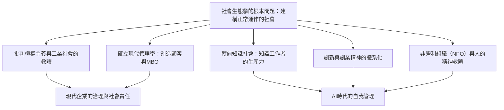
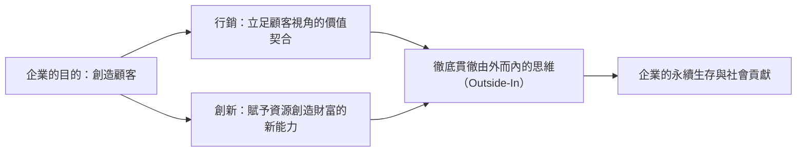
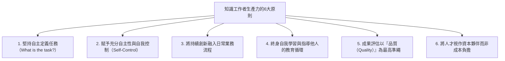

## 1. 導論：20世紀最偉大智者彼得·杜拉克的思想格局

### 1.1 「現代管理學之父」稱號的矮化與作為「社會生態學家」的本質

彼得·F·杜拉克（Peter Ferdinand Drucker, 1909–2005）的名字享譽全球，被世人尊稱為「現代管理學之父（Father of Modern Management）」。然而，他終其一生都對這項頭銜敬謝不敏。杜拉克終生自封並堅持使用的唯一頭銜是——「社會生態學家（Social Ecologist）」。

正如生物學中的生態學（Ecology）觀察並研究動植物與其生存環境之間的交互作用與動態平衡一樣，社會生態學是一門觀察人類在自身所創造的社會環境——企業、政府、大學、醫院、教會以及家庭等各種組織與制度之中，如何生活、工作、建立人際關聯並建構社會秩序的學問。

杜拉克關注的核心，從來不是「如何實現企業利潤最大化的雕蟲小技」，也不是「提高經營管理效率的實用工具」。他畢生不斷追問的根本問題是：**「如何建構一個讓身處其中的人既能保有自由與尊嚴，又能使社會有效運作的『機能健全社會』（a functioning society）？」** 這是一個極具倫理高度、哲學意蘊與人道主義情懷的終極命題。他之所以將畢生心血傾注於商業與企業組織的剖析，是因為在20世紀，工商企業成為了現代社會的代表性機構（Representative Institution），成了決定一般人生活方式與身分認同的最主要場域。

當代許多閱讀杜拉克著作的商務人士與學者，往往忽略了一個至關重要的事實：杜拉克在二戰前的歐洲親歷了納粹主義的崛起，他是從「面對希特勒的極權主義究竟該如何反抗與拯救文明」這份痛切的政治哲學絕望中啟程的。本文將沿著貫穿杜拉克整個人生與全部著作的思想伏流，以萬字長文徹底解構他留給人類的那座宏大深邃的智慧殿堂。



---

### 1.2 維也納的黃昏、納粹主義的崛起，以及源於批判極權主義的組織論

要探尋杜拉克的思想源頭，就必須回到他出生並成長的哈布斯堡帝國末期的維也納。1909年，杜拉克出生於奧匈帝國首都維也納一個富裕的知識分子家庭。他的家中群星閃耀，佛洛伊德、熊彼得、米塞斯、海耶克等當時代表歐洲頂尖智慧的學者都是他父母客廳的座上賓。

然而，隨著第一次世界大戰的爆發，哈布斯堡帝國土崩瓦解。在隨後的1920至1930年代，歐洲社會遭遇了前所未有的精神與社會雙重崩潰。傳統的階級秩序與宗教權威分崩離析，個人失去了原本立足的社群，淪為孤立無援的原子化大眾。1929年席捲全球的大蕭條更是雪上加霜，徹底摧毀了人們對資本主義自由市場與資產階級民主制度的信任。

在這巨大的精神虛無與絕望之中，希特勒的國家社會主義（納粹主義）與史達林的共產主義這兩大極權主義毒瘤應運而生。在法蘭克福取得法學博士學位、作為記者活躍於第一線的青年杜拉克，在現場親眼見證了德國迅速被納粹黑暗吞噬的慘劇。1933年希特勒奪權後，杜拉克毫不猶豫地逃離德國前往英國，並於1937年流亡美國。

對杜拉克而言，法西斯主義與極權主義絕非單純的軍事狂熱或政治瘋癲，而是**「近代西方社會因無法再為個人提供合法的社會地位（Status）與社會功能（Function），從而引發的一場絕望且病態的毀滅性叛亂」**。因此，要從根本上戰勝極權主義，僅僅依靠軍事上的摧毀是遠遠不夠的；人類必須建構一個全新的、非極權主義的自由社會，讓每一位普通公民都能在社會中擁有明確的位置與角色，享有自我實現的機會與不可侵犯的尊嚴。這種強烈的歷史使命感，正是驅使杜拉克走向「組織與管理」探索之路的真正內驅力。

---

## 2. 杜拉克思想的原點：極權主義的絕望與工業社會的救贖

### 2.1 《經濟人的末日》（1939年）—— 馬克思主義與資本主義的局限，法西斯主義的病理

流亡期間的1939年，杜拉克出版了他的第一部劃時代著作《經濟人的末日》（The End of Economic Man: The Origins of Totalitarianism）。這部出自當時未滿30歲的無名青年之手的著作，隨即獲得了溫斯頓·邱吉爾的高度讚譽，並被指定為英國陸軍軍官的必讀參考書。

在這本書中，杜拉克深刻指出，納粹主義的本質並不是「理性的邪惡」，而是「理性的希望化為絕望之後降臨的魔性盲信」。18世紀以來的西方近代社會，一直建立在「經濟人（Economic Man）」這一制度性人性假設之上：資本主義承諾「個人在市場中追求自由經濟利益的活動，將透過看不見的手為整個社會帶來和諧與財富」；而馬克思主義則承諾「透過無產階級革命消滅階級壓迫，將實現真正平等的自由人社會」。

然而，資本主義帶來的卻是長期的失業、懸殊的不平等以及大蕭條的苦難；共產主義帶來的則是血腥的暴政與勞改營。當這兩種神話同時破滅時，西方社會墜入了「經濟自由與經濟平等皆無法保障人類幸福與尊嚴」的虛無主義深淵。

法西斯主義正是趁虛而入。它公然否定經濟理性與經濟自由，利用軍國主義等級秩序、種族主義神話與國家至上主義這些非理性的魔性力量，為絕望的大眾重新賦予了虛幻的「生命意義」與「歸屬感」。杜拉克一針見血地指出：僅僅否定法西斯主義無法讓社會重生。人類必須建立一種超越單純金錢利益、能夠包容經濟理性同時又賦予人以尊嚴與公民身分的「全新社會秩序」。

---

### 2.2 《工業人的未來》（1942年）—— 賦予人社會地位（Status）與功能（Function）的共同體

1942年，伴隨著美國正式捲入二戰，杜拉克出版了《工業人的未來》（The Future of Industrial Man），為戰後社會的重構勾勒了宏偉藍圖。

該書的核心概念是「正當權力（Legitimate Power）」以及個人的「社會地位（Status）」與「社會功能（Function）」。杜拉克認為，一個健康且自由的社會要得以維繫，必須滿足以下兩個先決條件：

1. **正當權力**：統治社會的權力必須得到社群成員的認可，具備合法性與道德權威。
2. **地位與功能**：每一位社會成員在社會中都擁有明確的位置（地位），並能為社會的共同福祉做出獨特的貢獻（功能）。

在19世紀之前的農業社會或早期商業社會中，家庭、鄉村社群與手工業行會保障了個人的地位與功能。然而，隨著第二次工業革命將巨型工廠與現代大企業推上歷史舞台，傳統的社群瓦解了。工廠工人淪為龐大生產機器中隨時可被替換的螺絲釘，陷入了深深的社會無力感之中。

杜拉克敏銳地預言：**「如果現代工業企業僅僅停留在創造財富的經濟機構層面，而不能蛻變為向勞動者提供社會地位與功能的『人性共同體』，那麼自由社會終將再次被極權主義的幽靈吞噬。」** 在此，杜拉克明確宣告：企業在作為工廠主的私有財產之前，首先必須是承擔公共社會責任的自主治理組織（Government）。

---

### 2.3 《公司的概念》（1946年）—— 通用汽車（GM）的內部調查與現代龐大組織的解剖

1943年，杜拉克收到了一個前所未有的邀請。當時全球最大的製造企業、資本主義工業皇冠上的明珠——通用汽車（General Motors, GM）的高階主管團隊向他發出邀請，希望他從外部以客觀視角對通用汽車的經營結構與組織運作進行全方位的深入調研與剖析。

杜拉克在通用汽車總部進駐了整整18個月。他與執行長阿爾弗雷德·史隆（Alfred P. Sloan）等高階主管、工廠廠長、第一線工程師乃至生產線裝配工進行了無數次深度訪談，並列席各項核心經營會議。這項調研成果最終在1946年匯聚成了現代管理學的奠基之作——《公司的概念》（Concept of the Corporation）。

該書是人類歷史上第一部不將現代大企業僅僅視為「經濟組織」，而是視其為**「作為社會基本構成單元的政治與社會機構」**來剖析的劃時代著作。杜拉克洞察到，通用汽車之所以具備驚人的競爭力，秘訣在於史隆開創的「事業部制（Decentralization: 分權化管理）」。史隆沒有採取高度集權的軍隊化管制，而是將權力下放到各個自負盈虧的事業部，讓它們直面市場競爭並承擔經營責任。這種機制使得龐大如怪獸的巨型企業在保持整體協同的同時，依然能夠保有第一線的自主性與靈活性。

---

### 2.4 與史隆的思想對立：GM式由上而下的理性主義 vs 人性化自主組織論

然而，《公司的概念》一書在通用汽車內部卻引發了軒然大波與劇烈反彈。以阿爾弗雷德·史隆為首的通用汽車管理層，對杜拉克在書中提出的人道主義建議表現出強烈的排斥，包括「向工人充分授權」、「建立自我管理團隊」、「推行工廠社區自治」以及「探索保障員工尊嚴與終身雇用」等主張。

在史隆看來，企業是一台極致理性化、將「資本、技術與勞動力進行最佳組合的精密機器」，工人只不過是根據契約以勞動換取報酬的經濟生產單元。史隆將杜拉克的提議斥為「感傷的社會主義空想」，並下令在通用汽車內部將此書列為禁書（諷刺的是，通用汽車當時的死敵——福特汽車的亨利·福特二世卻將此書奉為圭臬，並成功藉此實現了福特汽車奇蹟般的重組與復興）。

杜拉克與史隆的這場思想交鋒，徹底決定了杜拉克此後的思考方向。杜拉克堅決摒棄了由上而下的官僚控制與數據指標至上主義，確立了將畢生心血投入到**「基於對人的潛能與自我控制充滿信任的自主分散型管理模式」**的探索之中。

---

## 3. 「管理學」的誕生與本質體系

### 3.1 《管理的實踐》（1954年）確立的學科範疇

1954年，杜拉克出版了劃時代的經典巨著《管理的實踐》（The Practice of Management）。正是這部著作，使「管理（Management）」在世界歷史上第一次成為一門系統性的學科與專業範疇（Discipline）。在此之前，商業經營普遍被認為是天才創業家的個人直覺、天賜的領袖魅力，或是單純的財務帳目計算技能；杜拉克則將管理昇華為一套「人人皆可學習、掌握並付諸實踐的系統性知識體系」。

杜拉克在書中將管理的普遍職能歸納為三大核心使命：

1. **實現本機構的特定目的與使命**：對於企業而言是創造經濟成果；對於醫院而言是救治病患；對於大學而言是探索知識與培育英才。
2. **使工作富有生產力，並使工作者富有成就感**：最大限度地激發人的潛能，使人們在工作中獲得尊嚴、價值感與持續成長。
3. **妥善處理本機構對社會產生的衝擊（Impacts），並為解決社會問題做出貢獻**：防止組織的運作對社會造成污染或破壞，恪守良好企業公民的道德底線。

這三大使命彼此交織、不可分割，管理者的職責便是在這三者之間始終保持動態的平衡。

---

### 3.2 企業的目的在於「創造顧客」：行銷與創新的雙重驅動

在杜拉克的管理哲學中，最為著名卻也最常被誤解的，莫過於他對「企業目的」的終極定義。杜拉克斬釘截鐵地宣告：

> **「關於企業目的，唯一有效的定義只有一個：那就是創造顧客（There is only one valid definition of business purpose: to create a customer）。」**

絕大多數企業經營者與經濟學家固執地認為「企業的目的就是利潤最大化」。但在杜拉克看來，利潤絕非企業的「目的」，而只是企業得以生存並抵禦未來不確定性與風險的「必要條件（Condition）」或「限制因素（Limitation）」。正如心臟跳動和消耗氧氣是人類維持生命的必要條件，但呼吸本身絕非人生的目的。

沒有顧客，任何企業都會在頃刻間化為烏有。顧客並非自然存在的實體，只有透過企業的價值創造活動，潛在的需求才會被發現並轉化為現實的顧客。因此，為了創造顧客，任何企業組織本質上**僅擁有兩項基本功能（Basic Functions）**：

1. **行銷（Marketing）**：深入理解顧客真實的欲望、現實與價值觀，使產品或服務完全契合顧客的需求。「行銷的目的在於讓銷售變得多餘」。
2. **創新（Innovation）**：賦予現有資源創造新財富的能力，持續向經濟與社會提供全新的價值。

除行銷與創新之外，企業的所有其他活動（人事、財務、會計、採購、物流供應鏈等）都只是為了支撐這兩大基本功能而付出的成本。企業真正創造利潤的唯一源泉，存在於組織外部——那就是「顧客的滿意」。



---

### 3.3 目標管理制度（MBO: Management by Objectives and Self-Control）的真相

杜拉克在《管理的實踐》中提出的最具革命性的概念之一，是「目標管理與自我控制（Management by Objectives and Self-Control: MBO）」。

今天，全球無數大企業都在推行所謂的「MBO考核體系」。然而，正如杜拉克晚年極其痛心指出的那樣：**現代企業中推行的所謂MBO，有99%都墮落成了與杜拉克初衷徹底背道而馳的「指標指派與考核控制工具」**。

杜拉克所提出的MBO，其精髓完全凝聚在後半截詞組上——**「自我控制（Self-Control）」**。傳統的管理方式是上級對下級下達硬性指標，監控進度，透過胡蘿蔔加大棒（信賞必罰）來進行操縱，這是典型的「外在控制（External Control）」，不過是把人視作被動機器的泰勒主義殘餘。

與此相反，杜拉克所構想的真正MBO包含以下嚴密歷程：

1. 全體成員對整個組織的共同目標與使命達成深度共識。
2. 每一位知識工作者與同仁針對這一總體目標，自主思考「我應該做出何種貢獻」，並主動設定個人的工作目標。
3. 建立客觀的資訊回饋系統，使工作者**自己能夠直接獲取衡量自身成果的數據**，而非透過上級來進行資訊壟斷與評斷。
4. 工作者根據回饋自我監控工作進度，自主進行動態修正與調整。

MBO絕不是用來強化上級對下級人身控制的枷鎖，而是**「一種徹底免除外部管制與命令，將每一個人解放為能夠自主決策的專業人士的崇高哲學」**。杜拉克堅信，基於內在動機（Intrinsic Motivation）與自我責任的自主性，才能真正賦予人性以尊嚴，並為組織激發出不可估量的卓越績效。

---

### 3.4 成果（Results）的定義與資源配置：企業的8大關鍵領域

杜拉克嚴厲告誡企業界：決不能僅僅依靠單一指標（如當期營業額或季度利潤）來評價企業的經營狀況。一個企業若要在健康的軌道上持續生存並造福社會，必須在以下**8大關鍵成果領域（Key Result Areas）**中制定均衡的目標並保持敏銳追蹤：

| 領域 | 核心內涵與戰略重要性 |
| :--- | :--- |
| **1. 行銷（Marketing）** | 不僅關注現有市場的占有率，更關注新市場的開拓深度與創造新顧客的能力。 |
| **2. 創新（Innovation）** | 不僅涵蓋產品與服務的創新，更包括組織架構、業務流程與商業模式的全方位革新。 |
| **3. 人才與組織能力** | 同仁能力的持續開發、工作意願的激發、接班梯隊的培養以及團隊的高度自主性。 |
| **4. 財務資源** | 獲取必要投資資本的能力、現金流量的充裕健康度，以及資本的最佳配置效率。 |
| **5. 實體資源** | 廠房、生產設備、辦公設施、數位IT基礎設施等生產基礎的高效性與先進性。 |
| **6. 生產力** | 投入的各種資源（勞動力、資本、時間、原物料）轉化為高附加價值產出的綜合比率。 |
| **7. 社會責任** | 對社群環境、生態保護、法律法規與道德倫理的真誠遵守與積極社會貢獻。 |
| **8. 必要利潤** | 確保前7項戰略目標順利達成、足以抵禦未來經營風險與資本成本所不可或缺的最低利潤水準。 |

杜拉克管理思想的神髓正是在於：**「利潤不是目的，而是生存的檢驗條件。」** 利潤既是過去決策正確與否的體檢成績單，也是為未來承擔不確定性風險所必須支付的「企業續存保險費」。

---

## 4. 知識社會的預見與「知識工作者（Knowledge Worker）」的出現

### 4.1 從《斷裂的年代》（1969年）到《後資本主義社會》（1993年）

在杜拉克浩如煙海的歷史預言中，對人類文明進程產生最深遠震撼的，莫過於他對「知識社會（Knowledge Society）」降臨的宏大洞察。早在1959年出版的《明日的里程碑》（Landmarks of Tomorrow）中，杜拉克便在人類思想史上第一次鑄造了**「知識工作者（Knowledge Worker）」**這一里程碑式的概念。

隨後，在1969年的巨著《斷裂的年代》（The Age of Discontinuity）中，他敏銳地察覺到工業革命以來的傳統經濟結構正在發生劇烈的地殼變動。古典經濟學始終將財富生產的三要素定義為「土地（自然資源）」、「勞動（體力勞動力）」與「資本（機器與廠房）」。然而杜拉克指出，自20世紀後半葉起，這些傳統的生產要素已退居為次要資源，**「知識（Knowledge）」已躍升為人類社會唯一具有決定性意義的核心生產要素**。

到了1993年的《後資本主義社會》（Post-Capitalist Society），杜拉克的這一洞見愈發成熟深邃。在資本主義時代，社會的統治權力掌握在機器與廠房等資產的所有者（資產階級/投資人）手中；而在知識社會中，真正的核心資產是「存在於勞動者大腦之中的知識與專業技能」。知識工作者頭腦中掌握著生產工具，並且能夠自由地帶著這些資產跨組織流動。這使得工作者與組織之間的力量博弈，在人類歷史上第一次發生了根本性的逆轉。

---

### 4.2 從體力勞動（泰勒主義）到知識勞動的歷史性轉變

20世紀人類最耀眼的經濟奇蹟，當屬弗雷德里克·溫斯洛·泰勒（Frederick Winslow Taylor）所創立的「科學管理法」，它使**體力勞動者的生產力實現了近50倍的驚人飛躍**。泰勒透過對傳統工匠憑藉經驗與直覺操作的手工勞動進行嚴格的時間與動作研究，將複雜工序分解、重構為標準化的基本動作。這一場生產力革命催生了大規模製造與大眾消費的富裕中產階級社會，從根本上化解了西方已開發國家爆發馬克思主義階級革命的社會危機。

然而，杜拉克敲響了警鐘：「如果說20世紀管理學對人類的最大貢獻是實現了體力勞動生產力的飛躍，那麼**21世紀管理學所面臨的生死考驗，則是如何提高知識勞動的生產力**。」

體力勞動與知識勞動之間，存在著不可逾越的本質鴻溝：

| 特徵維度 | 體力勞動（Manual Work） | 知識勞動（Knowledge Work） |
| :--- | :--- | :--- |
| **工作的定義** | 工作內容通常是預先明確規定的，毫無歧義（例如：搬運鋼樑、鎖緊螺絲）。 | 必須由工作者自己回答：**「我的任務是什麼？做這項工作的目的是什麼？」** |
| **自主性** | 嚴格服從既定的操作規程被視為美德，受到外部嚴密監督。 | **自主性（Autonomy）**是生死攸關的前提；缺乏自我管理，成果便無從談起。 |
| **持續創新** | 創新由專門的工程師、製程設計師或管理者來設計負責。 | 知識工作者自身必須將**持續創新**作為日常工作不可分割的有機組成部分。 |
| **學習與教育** | 一旦熟練掌握操作規程，只需透過機械重複與熟能生巧即可提高效率。 | 知識迭代極其迅速，**終身持續自我學習與指導他人**是絕對剛需。 |
| **衡量標準** | 主要依據**「數量（Quantity）」**（單位時間內生產了多少個合格零件）。 | 主要依據**「品質（Quality）」**（提出了多麼深刻的洞見，解決了多大維度的難題）。 |
| **生產工具的歸屬** | 工廠、生產線與工具**歸資本家與出資人所有**。 | 核心生產工具（知識、認知能力、專業判斷）**歸工作者的大腦所有**。 |

在知識勞動領域，「拼命加班、延長工時」非但不能保證工作成果，反而往往帶來毀滅性災難。如果面對的是一個從根本上就提錯的問題，那麼計算得越高效、解答得越完美，所造成的資源浪費就越徹底。提高知識勞動的生產力，絕不可能透過泰勒式的緊盯監督或打卡工具來實現，它要求管理範式進行徹底的典範轉移。

---

### 4.3 決定知識工作者生產力的6大原則

在1999年出版的《21世紀的管理挑戰》（Management Challenges for the 21st Century）一書中，杜拉克明確提出了決定知識工作者生產力的「6大基本原則」：

1. **堅持不斷追問「任務是什麼（What is the task?）」**：知識工作中最關鍵的一步，是精準定義「真正需要完成的工作是什麼」。世界上沒有任何事情比高效地做一件本不該做的事更具破壞性。
2. **賦予充分的自主權**：知識工作者必須自己管理自己。唯有自主性，才能孕育出責任感與真正的專業精神。
3. **將持續創新植入工作機制**：在各自的專業領域內，必須時刻自覺探尋新的方法、新的工具與新的價值維度。
4. **形成終身學習與教學相長的正向循環**：知識工作者既是持續汲取新知的受教者，也必須成為傳授知識的導師。沒有比向他人傳授知識更能體系化整理並深化自身認知的方法了。
5. **始終堅持品質優先而非數量考核**：與其炮製100份空洞冗長、缺乏實質價值的分析報告，不如撰寫一份切中要害、洞察未來的頂尖報告，後者足以決定企業的生死存亡。
6. **將知識工作者視作「資產」而非「成本」**：知識工作者不是生產線上的零件配件，而是主動向組織投資智慧與心血的「事業夥伴」。



---

### 4.4 「知識工作者必須成為自己的CEO」：自我管理論

知識社會的到來，迫使每一個個體的生存哲學發生翻天覆地的轉變。在1999年發表的劃時代經典論文《自我管理》（Managing Oneself）中，杜拉克向當代所有人敲響了警鐘。

在傳統農業或手工業時代，一個人的職涯軌跡基本由出身等級或家族世代相傳的營生所決定；在工業時代，一個人只要進入一家大公司，企業人事部門就會為其規劃好直至退休的升遷路徑。然而在知識社會中，**「個人的職涯發展必須由自己來設計，個人的工作成效必須由自己來管理」**。在當今人類平均壽命突破80歲的時代，企業的平均存活週期（約30年）遠遠低於個體的職業生命週期。每一位知識工作者，都必須將自己視為一家獨立營運的創業公司——「個人無限責任公司」的執行長（CEO）。

杜拉克提出的自我管理實戰方法包含以下核心維度：

#### ① 認清自己的優勢（Strengths）
杜拉克人性哲學的基石是：**「唯有依靠優勢，人才能創造卓越；依靠彌補缺點，人永遠無法成就偉大。」**

傳統的學校教育與企業內訓往往將大量精力耗費在挑出受訓者的短板和缺點、並試圖將其拉平到平均線上。然而，把一個人的無能拔高到平庸需要耗費極其巨大的心力，而將一個人的突出優勢打磨成無可替代的頂級水準所消耗的能量卻要少得多，成果卻不可同日而語。

為了精準發現自身的真正優勢，杜拉克開出了一劑被實踐反覆證明有效的唯一良方——**「回饋分析法（Feedback Analysis）」**：
- 每當你做出重大決策或採取關鍵行動時，**在紙上清清楚楚寫下你所期望在未來看到的結果**。
- 在9個月或1年之後，**將實際發生的結果與當初寫下的預期結果進行極其嚴格的比對**。
- 堅持這項做法數年之後，你究竟擅長做什麼、在何種情境下施展優勢能結出碩果、而在哪些領域其實天生遲鈍無能，都將被無比客觀、甚至近乎殘酷地揭示出來。

#### ② 認清自己的工作方式（How I Perform）
與認清優勢同等重要的，是深刻認識自身的行為模式與認知特質：
- **自己究竟是「閱讀型（Reader）」還是「傾聽型（Listener）」？**（艾森豪屬於典型的閱讀型認知者，因此在面對記者口頭連珠炮式的提問時經常語無倫次、屢屢失言；但只要事先讓他審閱文字備忘錄，他就能展現出驚人的統籌決策才華。相反地，羅斯福和杜魯門則是典型的傾聽型溝通者）。
- **自己是透過何種方式獲取知識的？**（是透過寫作來學習，透過與人交談辯論來學習，還是透過動手實作來學習？）。
- **自己更適合擔任決策者（Decision Maker），還是更適合擔任幕僚與顧問（Adviser）？**（作為二號人物智囊表現極其驚豔的副手，一旦被扶正為一把手，往往因優柔寡斷而迅速導致災難性崩潰的例子不勝枚舉）。

#### ③ 為人生的下半場（第二職涯）未雨綢繆
體力勞動者會伴隨著身體機能的衰竭而自然退休；然而知識工作者在40多歲至50多歲時，極易對日復一日熟悉的工作感到倦怠，陷入沉重的「職業倦怠期（Burnout）」。在同一個工作崗位上摸爬滾打20年，往往意味著不再有新的認知刺激，成長陷入停滯。

杜拉克強烈建議所有人：必須在步入40歲門檻之前，著手培育自己的**「第二活動領域（Parallel Career，平行職涯或非營利公益投入）」**。在主業之外構築另一方精神天地，在社群服務、非營利組織、學術探索或志工行動中發揮優勢、創造價值。唯有如此，當遭遇職場重組或事業挫折時，個人的精神尊嚴才不至於徹底瓦解，才能在長壽時代的後半生真正活出豐盈與坦然。

---

## 5. 創新與創業精神的系統化技法

### 5.1 《創新與創業精神》（1985年）

在許多人的迷思中，創新往往被描繪為「某些絕頂天才或特立獨行的狂人在黑夜裡靈光乍現的電光石火」，抑或是依賴天量研發資金（R&D）在象牙塔實驗室中等待石破天驚的基礎科學突破。

1985年，杜拉克發表了巨著《創新與創業精神》（Innovation and Entrepreneurship），以無情的事實將這種充滿浪漫主義色彩的創新神話擊得粉碎。在杜拉克看來，創新根本不是不可捉摸的天才靈感，而是**「一門可以系統化學習、有章可循、能夠組織化實踐的學科範疇（Discipline）」**。

杜拉克對創新給出了經典的本質定義：
> **「創新，就是賦予現有資源創造財富的新能力。不僅如此，在創新發生之前，世間本無所謂『資源』。在人類找到某種物質的用途並賦予其經濟價值之前，任何植物都不過是路邊的野草，任何礦石都不過是無用的頑石。」**

石油在19世紀中葉煉油技術與內燃機被發明之前，只是一種污染農田、散發惡臭的黏稠廢液。將這種廢液轉變為支撐現代文明無盡財富的「戰略資源」的，與其說是自然科學本身，不如說是將技術突破與社會需求深度結合的創新之舉。

---

### 5.2 打破「靈感」神話：創新的7個系統性機會

杜拉克全面系統化地梳理了企業與組織在日常經營中應當雷達般時刻搜尋的**「創新的7個機會來源（The Seven Sources for Innovative Opportunity）」**。這7大來源按照確定性由高到低、風險由小到大的次序科學排列：

```mermaid
flowchart TD
    subgraph 組織內部的事件（風險低·見效快）
        S1["1. 意料之外的事件（成功、失敗或外部事件）"]
        S2["2. 不一致（現實與『理應如此』之間的差距）"]
        S3["3. 流程需求（消除業務流程中的瓶頸）"]
        S4["4. 產業與市場結構的變化（高速成長或市場重組）"]
    end
    subgraph 組織外部的社會變遷（風險中·重要性極高）
        S5["5. 人口結構的變化（最確定的未來預測）"]
        S6["6. 認知、情緒與意義的轉變（杯子『半滿』的感知變化）"]
        S7["7. 新知識（科學技術與新理論。風險最高·前置週期最長）"]
    end
    S1 --> S2 --> S3 --> S4 --> S5 --> S6 --> S7
```

#### ① 意料之外的事件（The Unexpected）
這是風險最低、回報最豐厚，卻往往最容易被傳統成熟企業視若無睹的寶藏，包括「意料之外的成功（Unexpected Success）」與「意料之外的失敗（Unexpected Failure）」。
- **意料之外的成功**：IBM在早期研發大型主機時，原本是將機器定位於嚴苛的高階科學計算領域；然而機器推向市場後，卻在銀行和保險公司的普通帳目處理領域被搶購一空。當時的管理層深感困惑，甚至認為這是「脫軌的偏門」，但IBM最終當機立斷，將全部精銳資源調集押注於這一意料之外的業務需求，從而奠定了日後不可撼動的全球電腦商業帝國。
- 絕大多數企業在月度經營高層會議上，往往耗費數小時激烈討論「未達預算指標的項目（失敗）」，而對那些遠超預期大賣的「意料之外的成功」輕描淡寫地歸結為偶然運氣。杜拉克痛心疾首地告誡：管理報告的第一頁應當只寫「意料之外的成功」，並且必須把最精銳的核心人才派往這些機會的前線。

#### ② 不一致（Incongruities）
指「理所當然的邏輯預期」與「客觀現實之間」出現的脫節與矛盾。
- 20世紀50年代，全球遠洋海運業投入天量資金用於提升輪船航速、降低發動機燃油消耗，然而整個行業的利潤率卻一落千丈。真正的成本黑洞其實根本不在「航行期間」，而是在於輪船靠港後漫長等待裝卸貨物的「泊港滯留時間」。洞察到這一現實矛盾的麥爾坎·麥克林（Malcolm McLean）發明了「貨櫃海運（Containerization）」。他沒有對輪船本身的動力性能做任何無謂折騰，而是透過標準化的金屬箱體將陸地公路運輸與海上貨輪無縫拼合，將貨輪靠港裝卸時間從數週直接壓縮到幾個小時，引發了全球貿易史上最波瀾壯闊的爆發式成長。

#### ③ 流程需求（Process Need）
指現有業務流程中存在的某個痛點、瓶頸或「缺失的一環（Missing Link）」，亟需被克服與替代。
- 例如為了徹底省去底片沖印的繁瑣漫長流程而誕生的拍立得相機（Polaroid），以及為了替代人工長途電話接線員而誕生的自動化電子交換機。

#### ④ 產業與市場結構的變化（Industry and Market Structures）
當一個產業以年均10%以上的超高速狂飆突進時，原有的產業格局注定土崩瓦解，迎來洗牌重構的歷史窗口期。
- 汽車工業崛起初期富豪汽車（Volvo）在車輛安全結構上的差異化破局，以及金融自由化風暴中線上折價證券經紀商的全面崛起。

#### ⑤ 人口結構的變化（Demographics）
在所有**「已經發生的未來（The Future that has already happened）」**中，最為確鑿無疑、最可精準預測的唯一變數，便是人口統計學數據（出生率、死亡率、年齡分布結構、受教育水準）。
- 20年後會有多少名20歲的青年步入社會，只要統計一下今天降生的嬰兒數量即可做到100%精準預測。少子高齡化、工作年齡人口縮減、高等教育普及率攀升……這些早已成定局的人口事實，本身就是由無數個百億級創新機會匯聚而成的金色富礦。

#### ⑥ 認知、情緒與意義的轉變（Changes in Perception）
客觀物理事實沒有發生一絲一毫的改變，但大眾看待世界的「認知架構」與心智模型卻在剎那間發生了翻天覆地的躍遷。
- 就像原本看著「杯子裡還有半杯水」的人們，突然集體覺得「杯子裡只剩半杯水了」。伴隨著現代醫學的日新月異，當代人類的預期壽命大幅延長、身體健康水準達到歷史巔峰，然而現代人卻反而陷入了空前的健康焦慮，對有機純天然食品、健身教練課程與抗老保健品表現出近乎宗教般的狂熱。這並不是因為人類身體變差了，而是大眾對「健康」的心理認知發生了根本躍變，從而催生了體量驚人的全新大健康消費產業。

#### ⑦ 新知識（New Knowledge）
建立在重大科學發現、技術突破或理論創新基礎之上的創新。
- 這是世俗大眾眼中最理直氣壯的「創新典型」。然而杜拉克嚴肅提醒：**以新知識為基礎的創新，在全部7大來源中成功率最低、耗資最驚人、從理論萌芽到商業化落地的前置週期最為漫長**（通常從基礎科學原理的發現到形成成熟商業應用需要耗費25至30年光陰）。此外，此類創新必須依賴多門原本毫不相干的獨立學科知識發生跨界交會（Convergence）才能真正實現價值，其投機性與商業風險極高。

---

### 5.3 系統性揚棄（Systematic Abandonment）：果斷告別昨日成功的勇氣

啟動一項真正意義上的創新，其最關鍵的第一步往往不是「如何絞盡腦汁構思新點子」。杜拉克斬釘截鐵地指出：**「創新的第一步，是有計劃、有系統地淘汰與揚棄（Abandonment）那些陳舊過時、已不再創造價值的業務，果斷告別昨天的輝煌。」**

任何龐大組織都有一個致命宿疾：為了維持那些歷史悠久的既有產品、過氣服務與官僚部門，源源不絕地消耗著組織內部最頂尖的人才儲備與核心現金流。曾經取得過輝煌戰功的舊業務，往往蛻變為組織內部神聖不可侵犯的政治聖域，沒有人敢公開宣判其死刑。結果便是：用於開拓未來的創新資源被徹底吸乾榨盡。

因此，杜拉克給所有組織的最高掌舵者制定了一條嚴格的例行心智追問法則：
> **「假如我們今天還沒有開展這項業務，憑藉我們現在所掌握的所有知識與全部情報，我們今天還會一頭栽進這項業務中去嗎？」**

只要內心的答案是猶豫或是否定的「不」，管理層就必須毫不遲疑地進一步追問：「那麼，面對這一現狀，我們今天必須立刻採取什麼果斷行動？」 這種行動絕不是修修補補的改良主義或苟延殘喘的延命策略，而必須是一場深思熟慮、乾淨俐落的系統性撤退與廢棄。正如不排出凋亡細胞的有機體會迅速衰竭壞死一樣，一個不敢系統性揚棄昨天的企業，注定在窒息中走向消亡。

---

## 6. 組織的治理、社會責任與非營利組織（NPO）的意義

### 6.1 《管理：任務、責任、實務》（1973年）中的3大任務與社會責任的本質

1973年，杜拉克傾注畢生心血推出了集大成之作——全書兩卷、長達千頁的煌煌巨著《管理：任務、責任、實務》（Management: Tasks, Responsibilities, Practices）。

在這部著作中，杜拉克以極具穿透力的哲學視野，對「企業的社會責任（CSR: Corporate Social Responsibility）」進行了遠超世俗膚淺認知的剖析。杜拉克將企業對社會的責任極其嚴謹地劃分為截然不同的兩大維度：

1. **處理本機構對社會造成的負面衝擊（Impacts）**：
   - 包括工業廢氣排放、噪音污染、有毒副產品、對員工身心健康的職業傷害等在生產營運過程中不可避免對自然與社會造成的負面侵蝕。
   - 杜拉克的立場冰冷而堅定：**「無論需要付出多大成本代價，企業必須以自身責任將自身活動所造成的負面衝擊徹底抑制到零。」** 對這種負面衝擊置若罔聞或敷衍推諉，是對社會的赤裸裸背叛，將從根基上自行摧毀企業存在的正當性。
2. **解決社會本身所面臨的系統性頑疾（Social Problems）**：
   - 諸如貧困落後、教育落差、高齡化扶養危機、自然生態惡化等與企業主營業務沒有直接因果關聯的巨觀社會問題。
   - 針對這一領域，杜拉克提出了極其理性的警示準則：「對於普遍的社會頑疾，**唯有在企業能夠憑藉自身的專業優勢將其轉化為商業機會（Business Opportunity）的絕對前提下**，才應當去介入解決。」如果僅僅出於一時道德衝動，盲目越界涉足自身無力應對的社會問題，最終荒廢本業、導致組織陷入破產深淵，這是打著善意旗號的極端不負責任。

---

### 6.2 為何杜拉克晚年傾注心血於非營利組織（NPO/NGO）

從20世紀80年代起，早已站在全球管理智慧之巔的杜拉克，卻出人意料地將大部分精力與智慧無償奉獻給了大學、綜合醫院、女童軍、救世軍（The Salvation Army）以及社群教會等「非營利組織（NPO/NGO: Non-Profit Organizations）」的管理研究與戰略諮詢。1990年，他正式出版了指導專著《非營利組織的管理》（Managing the Non-Profit Organization）。

為何杜拉克會在晚年毅然從資本主義的最前線轉身投入非營利組織的研究？這深深扎根於他畢生求索的終極理想——「建構一個正常運作的社會」。

商業企業透過供應「產品與服務」創造顧客；現代政府依靠頒布「法律與監管」維繫秩序。然而，**企業與政府都無法實現「觸動人的靈魂、重塑人的尊嚴並促成社群的有機再生」**：
- 綜合醫院的最高使命不是攫取利潤，而是撫平創傷、救治生命。
- 教會的最高使命是撫慰與救贖信徒的心靈。
- 救世軍的崇高使命，是幫助沉淪於街頭的酗酒者與流浪漢重塑尊嚴，將其改造為自食其力的自豪公民。

杜拉克一語道破天機：**「非營利組織所要創造的真正成果，正是『一個被轉化了的完整生命（A Changed Human Being）』本身。」**

不僅如此，杜拉克還提出了一個驚世駭俗的戰略逆轉。當時世人都以為「非營利組織必須向商業企業虛心求教現代化管理技巧」；然而杜拉克卻反其道而行之，振聾發聵地指出：**「恰恰相反，在21世紀，商業企業必須虛心向優秀的非營利組織學習真正的管理之道！」**

究其原因，非營利組織沒有任何用金錢報酬來強制約束同仁的槓桿手段，其核心骨幹與參與者大都是無償奉獻的志工。吸引並驅動他們夜以繼日竭誠付出的，唯有「崇高的使命（Mission）」以及「因自身貢獻帶來的崇高自豪感」。正是由於無法用金錢來掩蓋管理層在領導力上的無能與平庸，優秀的非營利組織領導者必須在使命提煉、價值觀對齊與員工自我控制上下足真功夫。而這套凝聚並激發無償志工的最高管理智慧，恰恰是21世紀面對擁有高度自主權的知識工作者時，商業企業必須全面拜讀的終極教科書。

---

## 7. 現代以及AI時代對杜拉克思想的再審視

### 7.1 生成式AI與知識社會的新典範轉移

進入2020年代，以ChatGPT為先鋒的大型語言模型（LLM）與生成式人工智慧（Generative AI）迎來了爆發式躍遷，推動知識社會狂飆突進到了連杜拉克當年也始料未及的極限縱深。

在過去幾十年間被奉為「知識工作核心標誌」的程式碼撰寫、專業文案產出、統計數據分析、法務合約審查以及醫學影像初篩等大量腦力工作，如今都能被AI以超人的速度與驚人的精度批量自動化。當年泰勒主義對體力勞動所進行的機械化生產線解構，如今正以十倍速降臨在白領腦力工作者的頭上。

然而，在這場AI風暴中心，杜拉克的思想非但沒有被淹沒淘汰，反而釋放出愈發耀眼的思想光芒。杜拉克曾反覆強調：**「給出現成答案（Execution）是機器與電腦的工作；而真正體現人類不可替代價值的，永遠是『提出真正有意義的問題（Asking the Right Questions）』。」**

面對人類給定的Prompt（提示詞與指令），AI能夠憑藉浩瀚的已有語料以極高效率整合輸出精彩答卷。然而：
- 「我們這個組織存在於世的真正使命究竟應當是什麼？」
- 「對於顧客而言，什麼才是從未被滿足的終極價值？」
- 「我們當下必須立刻壯士斷腕、果斷揚棄的昨日成就是什麼？」
- 「我們應當對這片土地上的人類命運承擔何種道德倫理責任？」

提出這些觸及存在本質與靈魂深處的元問題，在底層邏輯上是AI無論如何也無法逾越的認知鴻溝。AI越是將日常繁瑣的知識處理流程自動化，人類勞動的核心疆界就越是被逼向杜拉克畢生所探求的彼岸——「價值裁決」、「倫理責任」、「使命確立」與「深度共情」，回歸到純粹的管理哲學本源。

---

### 7.2 敏捷、OKR、青色組織與杜拉克思想的傳承與本質契合

今天當人們在矽谷與創新界熱烈研討「敏捷開發（Agile）」、「OKR（目標與關鍵結果）」抑或是弗雷德里克·拉盧（Frederic Laloux）所倡導的「青色組織（Teal Organization，自主進化型組織）」時，只要稍作溯源就會驚奇地發現：這些看似最前沿的現代管理思潮，其思想核心早在半個多世紀前便被杜拉克論述得透徹淋漓。

- **敏捷開發中的以客戶為中心與迭代演進**，正是杜拉克「企業唯一目的在於創造顧客，必須將行銷與創新融入日常每個細微環節」的當代軟體工程注腳。
- **英特爾前執行長安迪·葛洛夫奠基、Google發揚光大的OKR管理法**，其直接的思想母體正是杜拉克當年提出的MBO（目標管理與自我控制）。
- **青色組織所標榜的自主管理（Self-Management）與身心完整性（Wholeness）**，正是杜拉克自《工業人的未來》起便魂牽夢縈、孜孜以求的「賦予勞動者以社會地位與功能、依靠自我控制驅動的人道主義共同體」在21世紀的數位化轉生。

杜拉克的思想從來不是躺在故紙堆裡的古董遺產。當代一切閃爍著創新光芒的管理理論，無一例外都是站在杜拉克這位智者巨人的肩膀之上，汲取著他在人類管理沃土中播撒的思想養分。

---

### 7.3 結語：邁向尚未實現的「正常運作的社會」

彼得·杜拉克在95歲高齡告別這個世界之前，始終保持著旺盛的思考、寫作與授業熱情。凡是完整通讀過他龐大思想著述的人，最終感受到的絕非單純的商海制勝秘籍，而是**「一種對人類生命潛能的深沉信任，以及對整個人類社會所懷抱的無盡責任擔當」**。

在財富追逐本身淪為異化目的、短期股東至上主義竭澤而漁地消耗自然與人性、技術暴走隱隱威脅人類文明尊嚴的21世紀當下，我們比任何時候都更需要重溫杜拉克的思想原點。

組織，是匯聚人的優勢以造就社會福祉、同時使人的弱點變得無足輕重的神聖器皿。管理，絕非行使冰冷權力的特權，而是喚醒人的責任感、促進人的全面發展、捍衛自由與尊嚴的崇高倫理實踐。

杜拉克終生夢想的那個「讓每一個普通人都能帶著驕傲與尊嚴勞作、作為自主公民為社會貢獻才智、機能健全運作的自由社會」，在今天依然是一項未竟的偉大事業。接過這一棒尚未跑完的火炬，並在我們各自的現實工作中起而行之，正是時代託付給我們每一個人的崇高天職。
