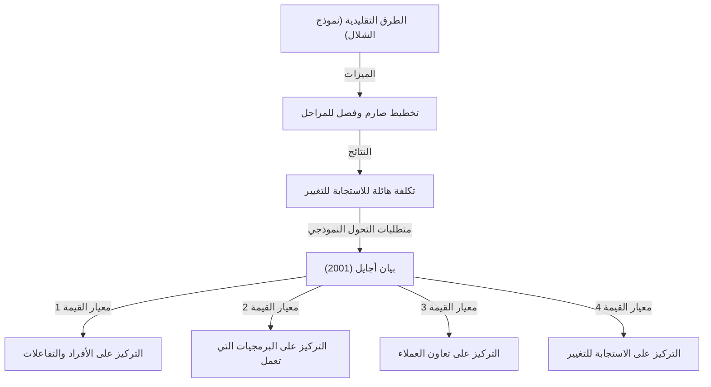
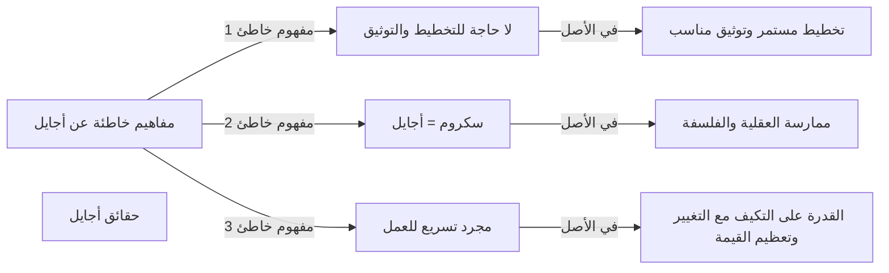

## 1. مقدمة: "بيان أجايل" الذي أصبح حجر الزاوية لتطوير البرمجيات الحديثة

في هذه الأيام، لا يمر يوم دون سماع كلمة "أجايل" (Agile) في صناعة تكنولوجيا المعلومات أو في مواقع تطوير البرمجيات. يتم تقديم العديد من المنهجيات بانتظام مثل سكروم (Scrum)، وكانبان (Kanban)، والبرمجة القصوى (XP)، وتتبنى العديد من الشركات أجايل كنهج لتقديم القيمة "بشكل أسرع وأكثر مرونة". ومع ذلك، قد يكون من المدهش أن القليل من الناس يفهمون بعمق كيف وُلد مفهوم "أجايل" هذا وما هي الفلسفة (Philosophy) التي يستند إليها.

في الفترة من 11 إلى 13 فبراير 2001، اجتمع 17 خبيراً في تطوير البرمجيات في منتجع تزلج يُدعى سنوبيرد في يوتا، الولايات المتحدة. لقد بحثوا عن حلول للمشاكل الخطيرة التي كان يواجهها تطوير البرمجيات في ذلك الوقت، وبعد نقاشات مستفيضة، قاموا بتجميع بيان واحد. هذا هو "بيان أجايل لتطوير البرمجيات" (Agile Manifesto).

في هذا المقال، سوف نتعمق في الخلفية التاريخية التي أدت إلى ولادة بيان أجايل، والشعور بالأزمة تجاه "العمليات الثقيلة" التي واجهتها بيئات التطوير في ذلك الوقت، والقيم المشتركة بين المؤلفين الـ 17، والفلسفة التي يجب أن تتعلمها منظمات التطوير الحديثة حقاً من هذا البيان.

## 2. الخلفية التاريخية: عصر أزمة البرمجيات و"العمليات الثقيلة"

لفهم ما وراء بيان أجايل، من الضروري معرفة كيف كان وضع تطوير البرمجيات في التسعينيات. في ذلك الوقت، كان حجم أنظمة البرمجيات يتوسع بسرعة ويستمر في التعقيد. وترافق مع ذلك ظهور وضع يُعرف باسم "أزمة البرمجيات". حيث تكررت الإخفاقات مثل تجاوز ميزانيات المشاريع، وتأخير التسليم، أو الأنظمة المكتملة التي كانت غير قابلة للاستخدام تماماً.

للتعامل مع هذه الأزمة، حاولت الصناعة السيطرة على المشكلة من خلال "تخطيط أكثر صرامة"، و"توثيق مفصل"، و"إدارة عمليات صارمة". هذا هو ما يُمثل عموماً بـ **العمليات الثقيلة (Heavyweight Processes)** والتي يجسدها "نموذج الشلال" (Waterfall Model).

تتميز العمليات الثقيلة بتقسيم واضح لكل مرحلة من مراحل التطوير (تحديد المتطلبات، التصميم، التنفيذ، الاختبار، الصيانة)، والانتقال إلى المرحلة التالية فقط بعد الانتهاء التام من المرحلة السابقة. كما أن نقل المعلومات بين كل مرحلة كان يتم من خلال كميات هائلة من الوثائق.

ومع ذلك، كان من الصعب للغاية على هذا النهج الاستجابة للتغيرات السريعة في بيئة الأعمال أو المتطلبات الجديدة التي تظهر أثناء التطوير. بناءً على افتراض أن "الخطة بمجرد اتخاذها هي أمر مطلق"، حتى لو تغيرت الاحتياجات الحقيقية للعميل، لم يكن هناك خيار سوى الاستمرار في بناء أنظمة غير مفيدة وفقاً للخطة. كان المطورون مثقلين بالعمليات البيروقراطية والإنشاء اللامتناهي للوثائق، وكانوا يتوقون لمتعة ابتكار "برمجيات تعمل" ذات قيمة حقيقية.

## 3. مؤتمر سنوبيرد: 17 متمرداً

في أواخر التسعينيات، بدأت التحركات للبحث عن طرق تطوير أخف وزناً وأكثر مرونة تظهر في أماكن مختلفة، معارضة لهذا الوضع. لقد كانوا ممارسين حققوا نجاحاً من خلال مناهجهم الخاصة، مثل كينت بيك من البرمجة القصوى (XP)، وكين شوابر وجيف ساذرلاند من سكروم (Scrum)، وأليستير كوكبيرن من منهجية كريستال (Crystal).

على الرغم من أنهم اقترحوا طرقاً مختلفة، إلا أنهم كانوا يشتركون في اعتقاد واحد: "التركيز على الأفراد وتفاعلاتهم بدلاً من العمليات والأدوات". في فبراير 2001، وبناءً على دعوة من روبرت س. مارتن (العم بوب) وآخرين، اجتمع 17 من الدعاة البارزين لـ "العمليات خفيفة الوزن" (Lightweight Processes) في سنوبيرد.

لقد استخرجوا القيم الأساسية المشتركة بين أساليبهم وناقشوا تقديم اتجاه جديد للصناعة ككل. في البداية، أطلقوا على أساليبهم "خفيفة الوزن" (Lightweight)، لكن لأن هذه الكلمة تحمل دلالات سلبية تعني "فارغة" أو "خفيفة"، فقد بحثوا عن كلمة أكثر ملاءمة. ونتيجة لذلك، تم اختيار كلمة **"أجايل" (Agile)**، والتي تعني "رشيق"، "سريع"، و"مرن".

## 4. بيان أجايل لتطوير البرمجيات: المعايير الأربعة للقيم

تجسيداً للنقاشات التي جرت في سنوبيرد، وُلد "بيان أجايل لتطوير البرمجيات"، والذي يتكون من نص موجز لا يتجاوز بضع عشرات من الكلمات. يتكون هذا البيان من المعايير الأربعة التالية للقيم:

> نحن نكشف عن طرق أفضل لتطوير البرمجيات من خلال القيام بذلك ومساعدة الآخرين على القيام به. من خلال هذا العمل وصلنا إلى تقييم:
> 
> - **الأفراد والتفاعلات على العمليات والأدوات**
> - **برمجيات صالحة للعمل على التوثيق الشامل**
> - **تعاون العملاء على التفاوض على العقود**
> - **الاستجابة للتغيير على اتباع خطة**
> 
> أي، بينما يوجد قيمة في العناصر الموجودة على اليسار، فإننا نقدر العناصر الموجودة على اليمين أكثر.

ما يبرز في هذا البيان هو أنه لا يرفض تماماً الأشياء الموجودة على اليسار (العمليات، التوثيق، التفاوض على العقود، التخطيط). إن الإحساس الرائع بالتوازن في قول "بينما يوجد قيمة في العناصر الموجودة على اليسار" ولكن مع ذلك "نحن نقدر العناصر الموجودة على اليمين أكثر" هو السبب في أن هذا البيان لا يزال مدعوماً حتى اليوم كفلسفة عملية حقاً، وليس مجرد وثيقة تمرد.

### تعمق في معايير القيم

1. **الأفراد والتفاعلات على العمليات والأدوات (Individuals and interactions over processes and tools)**
   مهما كانت العمليات ممتازة أو الأدوات المعتمدة حديثة، فإن البشر هم من يستخدمونها. إذا كان هناك حواجز في التواصل أو نقص في الثقة، فسيفشل المشروع. الحوار المباشر بين أعضاء الفريق، والتعاون لحل المشكلات، وخلق بيئة تعظم من مهارات الأفراد ودوافعهم، هي أمور أهم من الالتزام الصارم بالعمليات.

2. **برمجيات صالحة للعمل على التوثيق الشامل (Working software over comprehensive documentation)**
   الوثائق ضرورية، ولكنها في حد ذاتها لا تقدم قيمة للعميل. بدلاً من قضاء الوقت في كتابة مئات الصفحات من المواصفات، فإن تقديم برمجيات تعمل فعلياً بسرعة والحصول على تعليقات من خلال السماح لهم بتجربتها له قيمة أكبر بكثير. "البرمجيات التي تعمل" هي المؤشر الأكثر موثوقية للتقدم.

3. **تعاون العملاء على التفاوض على العقود (Customer collaboration over contract negotiation)**
   المطلوب هو بناء علاقة تعاون كفريق واحد بدلاً من تصادم المطورين والعملاء حول "ما هو مكتوب في العقد وما هو غير مكتوب". غالباً ما لا يفهم العملاء أنفسهم تماماً ما يريدونه حقاً في بداية التطوير. إن التعاون المستمر من خلال التطوير والبحث معاً عن الحل الأمثل هو أقصر طريق للنجاح.

4. **الاستجابة للتغيير على اتباع خطة (Responding to change over following a plan)**
   في بيئة اليوم حيث التغيرات في بيئة الأعمال والتكنولوجيا سريعة، فإن التمسك بالخطة الأولية ليس سوى مخاطرة. الخطة هي مجرد فرضية تستند إلى الوضع الحالي، وهناك حاجة إلى المرونة لمراجعة الخطة دون تردد إذا تم اكتساب رؤى جديدة أو تغيرت الظروف. إن الترحيب بالتغيير كـ "فرصة لخلق ميزة تنافسية" بدلاً من القضاء عليه كـ "عدو يعطل الخطة" هو جوهر أجايل.

## 5. ماذا تعني المبادئ الاثنا عشر

إن "المبادئ الكامنة وراء بيان أجايل (المبادئ الاثنا عشر)" هي التي ترجمت معايير القيم الأربعة إلى مبادئ توجيهية أكثر تحديداً للعمل. فهي تحدد كيف ينبغي لمنظمة أجايل أن تتصرف.

1. **أولويتنا القصوى هي إرضاء العميل من خلال التسليم المبكر والمستمر للبرمجيات ذات القيمة.**
2. **الترحيب بتغيير المتطلبات، حتى في المراحل المتأخرة من التطوير. تسخر عمليات أجايل التغيير لصالح الميزة التنافسية للعميل.**
3. **تسليم برمجيات تعمل بشكل متكرر، من أسبوعين إلى شهرين، مع تفضيل الجدول الزمني الأقصر.**
4. **يجب أن يعمل أصحاب الأعمال والمطورون معاً بشكل يومي طوال المشروع.**
5. **بناء المشاريع حول أفراد متحمسين. امنحهم البيئة والدعم الذي يحتاجون إليه، وثق بهم لإنجاز المهمة.**
6. **الطريقة الأكثر كفاءة وفعالية لنقل المعلومات إلى فريق التطوير وداخله هي المحادثة وجهاً لوجه.**
7. **البرمجيات التي تعمل هي المقياس الأساسي للتقدم.**
8. **تعزز عمليات أجايل التنمية المستدامة. يجب أن يكون الرعاة والمطورون والمستخدمون قادرين على الحفاظ على وتيرة ثابتة إلى أجل غير مسمى.**
9. **الاهتمام المستمر بالتميز التقني والتصميم الجيد يعزز الرشاقة.**
10. **البساطة (فن تقليل كمية العمل غير المنجز) هي أمر أساسي.**
11. **تنبثق أفضل الهياكل والمتطلبات والتصميمات من فرق التنظيم الذاتي.**
12. **على فترات منتظمة، يتفكر الفريق في كيفية أن يصبح أكثر فعالية، ثم يضبط ويعدل سلوكه وفقاً لذلك.**

تغطي هذه المبادئ كلاً من الجوانب التقنية (مثل الارتباط بـ CI/CD، والتطوير المدفوع بالاختبار، وإعادة الهيكلة) والجوانب الإنسانية (الثقة، والاستدامة، والتنظيم الذاتي). على وجه الخصوص، يعكس المبدأ الثامن، "التنمية المستدامة"، وعياً قوياً بالهروب من "مسيرة الموت" (ساعات العمل الطويلة التي لا نهاية لها) التي وقع فيها العديد من المطورين في ذلك الوقت.

## 6. مفاهيم خاطئة وحقائق عن أجايل في العصر الحديث

لقد مر أكثر من 20 عاماً على بيان أجايل، وأصبحت كلمة "أجايل" الآن في الاتجاه السائد بالكامل. ومع ذلك، في مقابل انتشاره، فُقد جوهر أجايل، ولا تزال الحالات التي يصبح فيها مجرد شكل بلا مضمون (ما يسمى "أجايل بالاسم فقط" أو "أجايل الشلال") مستمرة.

تشمل المفاهيم الخاطئة الشائعة ما يلي:
- **"إذا كان أجايل، فلا حاجة للتخطيط أو كتابة الوثائق"**: كما ذكرنا سابقاً، هذا سوء فهم كبير. أجايل يضع الخطط، لكنه لا يثبتها بل يراجعها باستمرار. كما يتم إنشاء الوثائق الضرورية، ولكن يتم تجنب التوثيق المفرط.
- **"أجايل = سكروم"**: سكروم هو أحد الأطر النموذجية لممارسة أجايل، لكنه ليس كل شيء. إذا أصبح مجرد أداء احتفالات سكروم (سكروم اليومي أو مراجعة السبرينت) هو الهدف، فإنه سيتعارض مع معيار القيمة في بيان أجايل: "الأفراد والتفاعلات على العمليات والأدوات".
- **"الهدف من أجايل هو البناء بسرعة"**: يقلل أجايل بالتأكيد من وقت الإنجاز، لكنه ليس مجرد طريقة لتسريع العمل. الهدف الحقيقي هو القدرة على التكيف (Adaptability) من أجل "تقديم الشيء الصحيح في الوقت الصحيح".

## 7. التأثير العميق على الثقافة التنظيمية وآفاق المستقبل

تجاوز بيان أجايل مجرد كونه منهجية لتطوير البرمجيات، وأحدث تحولاً نموذجياً في كيفية تنظيم وإدارة المنظمات. الكلمات الرئيسية المهمة في نظرية التنظيم الحديثة، مثل "الفرق ذاتية التنظيم"، و"السلامة النفسية"، و"القيادة الخادمة"، ترتبط جميعها ارتباطاً وثيقاً بفلسفة أجايل.

في العصر الحالي حيث يُطالب بـ DX (التحول الرقمي)، لا تقتصر الحاجة إلى التحول نحو ثقافة تنظيمية رشيقة (أجايل) على شركات تكنولوجيا المعلومات فحسب، بل تمتد إلى جميع الصناعات مثل التمويل والتصنيع وتجارة التجزئة. في عصر VUCA الذي يتسم بالتغيرات السريعة، أصبحت "القدرة على استشعار التغيير وتغيير الاتجاه بسرعة" أكثر أهمية بكثير من "القدرة على التنفيذ وفقاً للخطة".

ناقش الرواد السبعة عشر الذين صاغوا بيان أجايل بجدية كيف ينبغي أن يكون تطوير البرمجيات في المستقبل، ونسجوا فلسفة لاستعادة الإنسانية. يجب علينا الآن كسر القشرة السطحية المتمثلة في المنهجيات والأطر، والعودة مرة أخرى إلى أصول بيان أجايل المتمثلة في "معايير القيم" و"المبادئ".

## 8. الخاتمة

وراء "بيان أجايل لتطوير البرمجيات"، كان هناك صرخة روح من المهندسين في الميدان الذين عانوا من العمليات الثقيلة والجامدة، وشغف لاستعادة تطوير أكثر إنسانية وإبداعاً. القيم الأربع والمبادئ الاثنا عشر التي تركوها وراءهم تمتلك حقيقة عالمية وخالدة لن تتلاشى مهما تطورت التكنولوجيا.

إذا شعرت يوماً في عملك التطويري اليومي بأنك مقيد بالعمليات، ومطارد بالوثائق، وعلى وشك أن تفقد بصرك عن الغرض الأصلي، فنرجو منك قراءة "بيان أجايل" هذا مرة أخرى. من المؤكد أنك ستجد هناك الإجابة الأكثر أهمية وجوهرية حول سبب قيامنا بصنع البرمجيات وكيف ينبغي لنا التعاون كفريق واحد.
