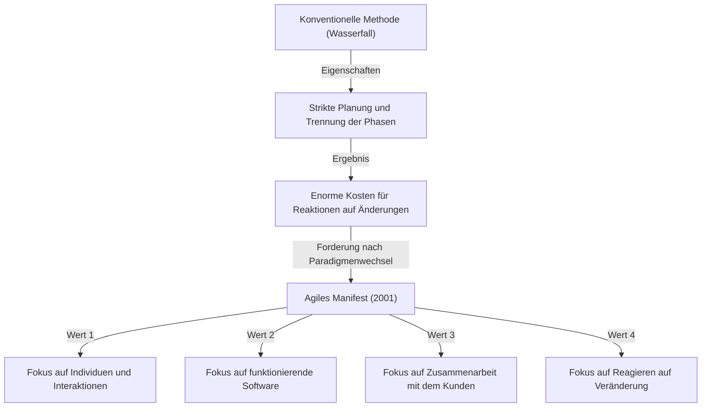
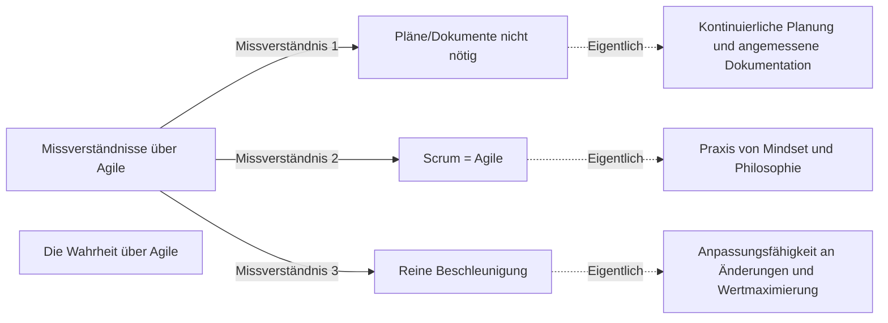

## 1. Einführung: Das "Agile Manifest" als Grundstein der modernen Softwareentwicklung

Heutzutage vergeht kein Tag in der IT-Branche und Softwareentwicklung, an dem man nicht das Wort "Agile" (Agil) hört. Verschiedene Methoden wie Scrum, Kanban und Extreme Programming (XP) werden täglich eingeführt, und viele Unternehmen übernehmen Agile als Ansatz, um "schneller und flexibler" Wert zu liefern. Jedoch verstehen überraschend wenige Menschen wirklich, wie dieses "Agile"-Konzept entstanden ist und auf welcher Philosophie es beruht.

Vom 11. bis 13. Februar 2001 versammelten sich 17 Softwareentwicklungs-Experten im Skigebiet Snowbird in Utah, USA. Sie suchten nach Lösungen für die schwerwiegenden Probleme der damaligen Softwareentwicklung und fassten nach intensiven Diskussionen ein Manifest zusammen. Das ist das "Manifest für Agile Softwareentwicklung (Agile Manifesto)".

In diesem Artikel werden wir die historischen Hintergründe, die zur Entstehung dieses Agilen Manifests führten, das damalige Krisengefühl gegenüber "schwergewichtigen Prozessen" (Heavyweight Processes), die gemeinsamen Werte der 17 Verfasser und die Philosophie, die moderne Entwicklungsorganisationen wirklich aus diesem Manifest lernen sollten, tiefgehend untersuchen.

## 2. Historischer Hintergrund: Das Zeitalter der Softwarekrise und "schwergewichtige Prozesse"

Um die Hintergründe des Agilen Manifests zu verstehen, muss man die Situation der Softwareentwicklung in den 1990er Jahren kennen. Damals nahmen Größe und Komplexität von Softwaresystemen rapide zu. Dies führte zu einer Situation, die als "Softwarekrise" bezeichnet wurde. Budgetüberschreitungen, Terminverzögerungen oder das Scheitern von Projekten, bei denen das fertige System völlig unbrauchbar war, traten häufig auf.

Um dieser Krise zu begegnen, versuchte die Industrie, die Probleme durch "strengere Planung", "detaillierte Dokumentation" und "striktes Prozessmanagement" zu kontrollieren. Dies sind die typischerweise durch das "Wasserfall-Modell" repräsentierten **schwergewichtigen Prozesse (Heavyweight Processes)**.

Das Merkmal schwergewichtiger Prozesse besteht darin, dass jede Entwicklungsphase (Anforderungsanalyse, Design, Implementierung, Test, Wartung) klar abgegrenzt ist und man erst zur nächsten Phase übergeht, wenn die vorherige vollständig abgeschlossen ist. Die Informationsübertragung zwischen den Phasen erfolgte über riesige Mengen an Dokumentationen.

Dieser Ansatz machte es jedoch extrem schwierig, auf schnelle Veränderungen im Geschäftsumfeld oder auf neue Anforderungen, die während der Entwicklung auftauchten, zu reagieren. Unter der Prämisse "einmal beschlossene Pläne sind absolut", blieb den Entwicklern nichts anderes übrig, als weiterhin nutzlose Systeme nach Plan zu bauen, selbst wenn sich die wahren Bedürfnisse der Kunden geändert hatten. Entwickler waren mit bürokratischen Prozessen und endloser Dokumentationserstellung überlastet und hungerten nach der Freude, wirklich wertvolle, "funktionierende Software" zu erschaffen.

## 3. Die Snowbird-Konferenz: 17 Rebellen

Ende der 1990er Jahre begannen sich an verschiedenen Orten Bewegungen zu bilden, die diese Situation in Frage stellten und nach leichteren, flexibleren Entwicklungsmethoden suchten. Praktiker, die mit eigenen Ansätzen Erfolge erzielten, wie Kent Beck von Extreme Programming (XP), Ken Schwaber und Jeff Sutherland von Scrum sowie Alistair Cockburn von der Crystal-Methode.

Obwohl sie jeweils unterschiedliche Methoden befürworteten, teilten sie die gemeinsame Überzeugung: "Individuen und Interaktionen sind wichtiger als Prozesse und Werkzeuge". Im Februar 2001 folgten 17 führende Vertreter leichtgewichtiger Prozesse (Lightweight Processes) dem Aufruf von Robert C. Martin (Uncle Bob) und anderen und trafen sich in Snowbird.

Sie diskutierten, um die gemeinsamen Kernwerte ihrer Methoden zu extrahieren und der gesamten Branche eine neue Richtung zu weisen. Ursprünglich nannten sie ihre Methoden "leichtgewichtig (Lightweight)", aber da dieses Wort negative Nuancen wie "inhaltsleer" oder "unbedeutend" haben konnte, suchten sie nach einem passenderen Begriff. Als Ergebnis wurde das Wort **"Agile (agil)"** gewählt, was "flink", "schnell" und "flexibel" bedeutet.

## 4. Manifest für Agile Softwareentwicklung: 4 Werte

Das Ergebnis der Diskussionen in Snowbird war das "Manifest für Agile Softwareentwicklung", das aus wenigen, prägnanten Sätzen besteht. Dieses Manifest stützt sich auf die folgenden 4 Werte:

> Wir erschließen bessere Wege, Software zu entwickeln, indem wir es selbst tun und anderen dabei helfen. Durch diese Tätigkeit haben wir diese Werte zu schätzen gelernt:
> 
> - **Individuen und Interaktionen mehr als Prozesse und Werkzeuge**
> - **Funktionierende Software mehr als umfassende Dokumentation**
> - **Zusammenarbeit mit dem Kunden mehr als Vertragsverhandlung**
> - **Reagieren auf Veränderung mehr als das Befolgen eines Plans**
> 
> Das heißt, obwohl wir die Werte auf der rechten Seite wichtig finden, schätzen wir die Werte auf der linken Seite höher ein.

Das Herausragende an diesem Manifest ist, dass es die Dinge auf der rechten Seite (Prozesse, Dokumentation, Vertragsverhandlungen, Pläne) nicht völlig ablehnt. Die feine Balance, anzuerkennen, dass "die Werte auf der rechten Seite wichtig sind", aber dennoch "die Werte auf der linken Seite höher einzuschätzen", ist der Grund, warum dieses Manifest nicht nur als rebellisches Dokument, sondern als wirklich praktische Philosophie bis heute unterstützt wird.

### Vertiefung der Werte

1. **Individuen und Interaktionen mehr als Prozesse und Werkzeuge (Individuals and interactions over processes and tools)**
   Egal wie exzellent die Prozesse oder wie modern die Werkzeuge sind, sie werden von Menschen genutzt. Wenn es Kommunikationsbarrieren oder mangelndes Vertrauen gibt, wird das Projekt scheitern. Direkte Interaktionen zwischen Teammitgliedern, Zusammenarbeit bei der Problemlösung und die Schaffung einer Umgebung, die die Fähigkeiten und Motivation des Einzelnen maximiert, sind wichtiger als die strikte Einhaltung von Prozessen.

2. **Funktionierende Software mehr als umfassende Dokumentation (Working software over comprehensive documentation)**
   Dokumentation ist notwendig, bietet dem Kunden aber an sich keinen Mehrwert. Es ist weitaus wertvoller, schnell funktionierende Software bereitzustellen und Feedback durch deren Nutzung zu erhalten, als Zeit damit zu verbringen, hunderte Seiten von Spezifikationen zu schreiben. "Funktionierende Software" ist der zuverlässigste Indikator für den Fortschritt.

3. **Zusammenarbeit mit dem Kunden mehr als Vertragsverhandlung (Customer collaboration over contract negotiation)**
   Anstatt dass sich Entwickler und Kunden darüber streiten, was "im Vertrag steht oder nicht", ist es erforderlich, eine Beziehung aufzubauen, in der sie als ein Team zusammenarbeiten. Oft verstehen Kunden selbst nicht vollständig, was sie zu Beginn der Entwicklung wirklich wollen. Kontinuierliche Zusammenarbeit während der Entwicklung und die gemeinsame Suche nach der optimalen Lösung sind der kürzeste Weg zum Erfolg.

4. **Reagieren auf Veränderung mehr als das Befolgen eines Plans (Responding to change over following a plan)**
   In der heutigen Zeit, in der sich das Geschäftsumfeld und die Technologie rasant verändern, ist das Festhalten an anfänglichen Plänen nur ein Risiko. Pläne sind lediglich Hypothesen im aktuellen Zustand, und es ist Flexibilität erforderlich, um Pläne ohne Zögern anzupassen, wenn neue Erkenntnisse gewonnen werden oder sich die Situation ändert. Veränderungen nicht als "Feind, der Pläne stört" auszuschließen, sondern als "Chance, Wettbewerbsvorteile zu schaffen" willkommen zu heißen, ist die Essenz von Agile.

## 5. Die Bedeutung der 12 Prinzipien

Die "Prinzipien hinter dem Agilen Manifest (12 Prinzipien)" übertragen die 4 Werte in konkretere Handlungsrichtlinien. Sie definieren, wie sich agile Organisationen verhalten sollten.

1. **Unsere höchste Priorität ist es, den Kunden durch frühe und kontinuierliche Auslieferung wertvoller Software zufrieden zu stellen.**
2. **Heiße Anforderungsänderungen selbst spät in der Entwicklung willkommen. Agile Prozesse nutzen Veränderungen zum Wettbewerbsvorteil des Kunden.**
3. **Liefere funktionierende Software regelmäßig innerhalb weniger Wochen oder Monate und bevorzuge dabei die kürzere Zeitspanne.**
4. **Fachexperten und Entwickler müssen während des gesamten Projektes täglich zusammenarbeiten.**
5. **Errichte Projekte rund um motivierte Individuen. Gib ihnen das Umfeld und die Unterstützung, die sie benötigen und vertraue darauf, dass sie die Aufgabe erledigen.**
6. **Die effizienteste und effektivste Methode, Informationen an und innerhalb eines Entwicklungsteams zu übermitteln, ist im Gespräch von Angesicht zu Angesicht.**
7. **Funktionierende Software ist das wichtigste Fortschrittsmaß.**
8. **Agile Prozesse fördern nachhaltige Entwicklung. Die Auftraggeber, Entwickler und Benutzer sollten ein gleichmäßiges Tempo auf unbegrenzte Zeit halten können.**
9. **Ständiges Augenmerk auf technische Exzellenz und gutes Design fördert Agilität.**
10. **Einfachheit -- die Kunst, die Menge nicht getaner Arbeit zu maximieren -- ist essenziell.**
11. **Die besten Architekturen, Anforderungen und Entwürfe entstehen aus selbstorganisierten Teams.**
12. **In regelmäßigen Abständen reflektiert das Team, wie es effektiver werden kann und passt sein Verhalten entsprechend an.**

Diese Prinzipien decken sowohl technische Aspekte (Verbindung zu CI/CD, Test-driven Development, Refactoring usw.) als auch menschliche Aspekte (Vertrauen, Nachhaltigkeit, Selbstorganisation) ab. Insbesondere das 8. Prinzip "nachhaltige Entwicklung" zielte stark darauf ab, sich vom "Death March" (endlos lange Arbeitszeiten), in dem viele Entwickler damals gefangen waren, zu befreien.

## 6. Missverständnisse und Wahrheiten über Agile heute

Mehr als 20 Jahre sind seit dem Agilen Manifest vergangen, und der Begriff "Agile" ist völlig im Mainstream angekommen. Jedoch gibt es im Gegenzug zu seiner Verbreitung auch unzählige Fälle, in denen die Essenz von Agile verloren geht und es zur leeren Hülle wird (sogenanntes "Agile in Name Only" oder "Waterfall-Agile").

Häufige Missverständnisse sind unter anderem:
- **"Wenn es agil ist, brauchen wir keine Pläne und müssen keine Dokumentationen schreiben"**: Wie bereits erwähnt, ist dies ein großes Missverständnis. Agile plant, aber fixiert sich nicht darauf, sondern überprüft kontinuierlich. Auch notwendige Dokumentationen werden erstellt, nur übermäßige Dokumentation wird vermieden.
- **"Agile = Scrum"**: Scrum ist eines der bekanntesten Frameworks zur Umsetzung von Agile, aber nicht das Einzige. Wenn die bloße Durchführung von Scrum-Zeremonien (Daily Scrum oder Sprint Review) zum Selbstzweck wird, widerspricht dies dem Wert "Individuen und Interaktionen mehr als Prozesse und Werkzeuge" des Agilen Manifests.
- **"Das Ziel von Agile ist es, schnell zu bauen"**: Agile verkürzt zwar die Durchlaufzeit (Lead Time), ist aber keine Methode zur reinen Beschleunigung. Das wahre Ziel ist die Anpassungsfähigkeit (Adaptability), um "das Richtige zur richtigen Zeit zu liefern".

## 7. Tiefgreifender Einfluss auf die Organisationskultur und Zukunftsaussichten

Das Agile Manifest brachte einen Paradigmenwechsel, der weit über bloße Softwareentwicklungsmethoden hinausging und Organisations- und Managementmethoden erreichte. Wichtige Schlüsselwörter der modernen Organisationstheorie wie "selbstorganisierte Teams", "psychologische Sicherheit" und "Servant Leadership" sind tief mit der agilen Philosophie verbunden.

In der heutigen Zeit, in der die digitale Transformation (DX) gefordert wird, wird in allen Branchen – nicht nur in IT-Unternehmen, sondern auch in Finanzen, Produktion und Einzelhandel – ein Wandel hin zu einer agilen Organisationskultur verlangt. In der sich schnell verändernden VUCA-Welt ist die "Fähigkeit, Änderungen zu erkennen und schnell den Kurs zu korrigieren", weitaus wichtiger als die "Fähigkeit, nach Plan auszuführen".

Die 17 Pioniere, die das Agile Manifest entwarfen, diskutierten ernsthaft darüber, wie die zukünftige Softwareentwicklung aussehen sollte, und schufen eine Philosophie, um die Menschlichkeit zurückzugewinnen. Wir müssen jetzt die oberflächliche Hülle von Methoden und Frameworks durchbrechen und zu den "Werten" und "Prinzipien", dem Ursprung des Agilen Manifests, zurückkehren.

## 8. Fazit

Hinter dem "Manifest für Agile Softwareentwicklung" standen der Aufschrei der Seele von Ingenieuren vor Ort, die unter starren, schwergewichtigen Prozessen litten, und die Leidenschaft, eine menschlichere und kreativere Entwicklung zurückzugewinnen. Die 4 Werte und 12 Prinzipien, die sie hinterlassen haben, besitzen eine zeitlose, universelle Wahrheit, die nicht verblasst, egal wie sehr sich die Technologie weiterentwickelt.

Wenn Sie in Ihrer täglichen Entwicklungsarbeit jemals an Prozesse gebunden sind, von Dokumenten gejagt werden und dabei sind, das eigentliche Ziel aus den Augen zu verlieren, lesen Sie dieses "Agile Manifest" noch einmal durch. Dort sollten Sie die wichtigsten und essenziellsten Antworten darauf finden, warum wir Software erstellen und wie wir als Team zusammenarbeiten sollten.
