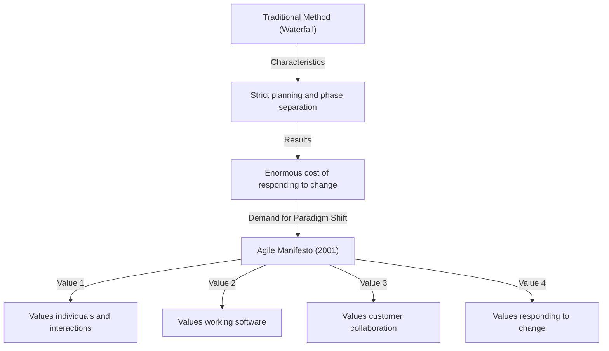
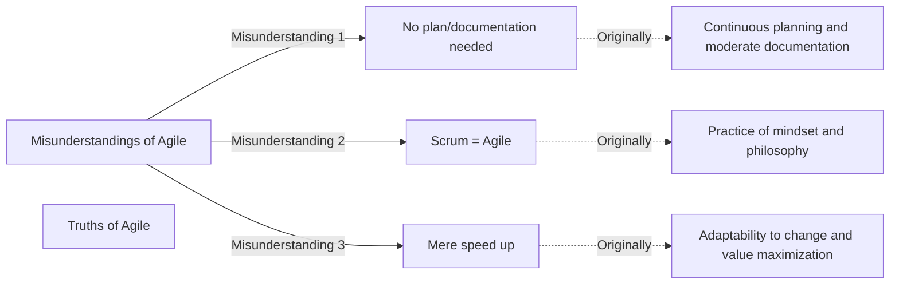

## 1. Introduction: The "Agile Manifesto", the Cornerstone of Modern Software Development

Nowadays, not a day goes by without hearing the word "Agile" in the IT industry and software development sites. Various methods such as Scrum, Kanban, and Extreme Programming (XP) are routinely introduced, and many companies adopt Agile as an approach to deliver value "faster and more flexibly". However, surprisingly few people deeply understand how this concept of "Agile" was born and what philosophy it was based on.

From February 11 to 13, 2001, 17 software development experts gathered at a ski resort called Snowbird in Utah, USA. They sought solutions to the serious problems that software development was facing at the time, and after discussion, they put together a manifesto. That is the "Agile Manifesto for Software Development".

This article will deeply delve into the historical background that led to the birth of this Agile Manifesto, the sense of crisis regarding the "heavyweight processes" faced by development sites at the time, the values shared by the 17 drafters, and the philosophy that modern development organizations should truly learn from this manifesto.

## 2. Historical Background: The Era of Software Crisis and "Heavyweight Processes"

To understand the background of the Agile Manifesto, it is necessary to know the state of software development in the 1990s. At that time, the scale of software systems was rapidly expanding and becoming increasingly complex. Along with this, a situation called the "software crisis" became apparent. Failures such as project budget overruns, delayed deliveries, or completed systems that were completely unusable were occurring frequently.

To deal with this crisis, the industry attempted to control the problems through "stricter planning", "detailed documentation", and "rigid process management". This is what is generally known as **Heavyweight Processes**, represented by the "Waterfall model".

The characteristic of heavyweight processes is that each phase of development (requirements definition, design, implementation, testing, maintenance) is clearly separated, and the next phase is not started until the previous phase is completely finished. In addition, information transfer between each phase was conducted via enormous amounts of documentation.

However, this approach made it extremely difficult to respond to rapid changes in the business environment or new requirements that became apparent during development. Under the premise that "once a plan is decided, it is absolute," even if the true needs of the customer changed, they had no choice but to continue building a useless system according to the plan. Developers were overwhelmed by bureaucratic processes and endless document creation, starving for the joy of creating truly valuable "working software".

## 3. The Snowbird Meeting: 17 Rebels

Starting in the late 1990s, movements to object to this situation and seek lighter and more flexible development methods began to emerge in various places. These included practitioners who had achieved success with their own approaches, such as Kent Beck of Extreme Programming (XP), Ken Schwaber and Jeff Sutherland of Scrum, and Alistair Cockburn of the Crystal methodology.

Although they advocated different methods, they shared a common belief that "individuals and their interactions are more important than processes and tools". In February 2001, at the call of Robert C. Martin (Uncle Bob) and others, 17 prominent advocates of Lightweight Processes gathered in Snowbird.

They discussed to extract the core values common to their methods and present a new direction to the entire industry. Initially, they called their methods "Lightweight", but because this word carries a negative nuance of "lacking substance" or "flimsy", they looked for a more suitable word. As a result, the word chosen was **"Agile"**, meaning "nimble", "quick", or "flexible".

## 4. The Agile Manifesto for Software Development: 4 Values

The "Agile Manifesto for Software Development", composed of just a few dozen words in concise sentences, was produced as a crystallization of the discussions at Snowbird. This manifesto consists of the following four values.

> We are uncovering better ways of developing software by doing it and helping others do it. Through this work we have come to value:
> 
> - **Individuals and interactions over processes and tools**
> - **Working software over comprehensive documentation**
> - **Customer collaboration over contract negotiation**
> - **Responding to change over following a plan**
> 
> That is, while there is value in the items on the right, we value the items on the left more.

The brilliant aspect of this manifesto is that it does not completely deny the items on the right (processes, documentation, contract negotiation, planning). The exquisite sense of balance of "while there is value in the items on the right", yet still "we value the items on the left more" is the reason why this manifesto continues to be supported to this day as a truly practical philosophy rather than just a rebel document.

### Deep Dive into the Values

1. **Individuals and interactions over processes and tools**
   No matter how excellent the processes or the latest tools introduced, it is humans who use them. If there are communication barriers or a lack of trust, the project will fail. Creating an environment that maximizes direct interaction between team members, cooperation for problem-solving, and individual skills and motivation is more important than strictly following processes.

2. **Working software over comprehensive documentation**
   Documentation is necessary, but it does not provide value to the customer in itself. Rather than spending time writing hundreds of pages of specifications, it is far more valuable to provide working software quickly and get feedback by having them interact with it. "Working software" is the most reliable measure of progress.

3. **Customer collaboration over contract negotiation**
   Instead of the development side and the customer side conflicting over "what is written or not written in the contract," they are required to build a relationship where they cooperate as the same team. Customers themselves often do not fully understand what they truly want at the start of development. Continuously collaborating through development and jointly exploring optimal solutions is a shortcut to success.

4. **Responding to change over following a plan**
   In modern times, where changes in the business environment and technology are intense, adhering to initial plans is nothing but a risk. A plan is merely a hypothesis for the current situation, and it requires the flexibility to revise the plan without hesitation when new insights are gained or situations change. The essence of Agile is the attitude of welcoming change as a "chance to create competitive advantage" rather than eliminating it as an "enemy that disrupts the plan".

## 5. What the 12 Principles Mean

The "Principles behind the Agile Manifesto (12 Principles)" broke down the four values into more concrete guidelines for action. These define how an agile organization should behave.

1. **Our highest priority is to satisfy the customer through early and continuous delivery of valuable software.**
2. **Welcome changing requirements, even late in development. Agile processes harness change for the customer's competitive advantage.**
3. **Deliver working software frequently, from a couple of weeks to a couple of months, with a preference to the shorter timescale.**
4. **Business people and developers must work together daily throughout the project.**
5. **Build projects around motivated individuals. Give them the environment and support they need, and trust them to get the job done.**
6. **The most efficient and effective method of conveying information to and within a development team is face-to-face conversation.**
7. **Working software is the primary measure of progress.**
8. **Agile processes promote sustainable development. The sponsors, developers, and users should be able to maintain a constant pace indefinitely.**
9. **Continuous attention to technical excellence and good design enhances agility.**
10. **Simplicity--the art of maximizing the amount of work not done--is essential.**
11. **The best architectures, requirements, and designs emerge from self-organizing teams.**
12. **At regular intervals, the team reflects on how to become more effective, then tunes and adjusts its behavior accordingly.**

These principles cover both technical aspects (connection to CI/CD, Test-Driven Development, refactoring, etc.) and human aspects (trust, sustainability, self-organization). In particular, the 8th principle, "sustainable development," strongly intended to break away from the "death marches (endless long working hours)" that many developers fell into at the time.

## 6. Misunderstandings and Truths of Agile in Modern Times

More than 20 years have passed since the Agile Manifesto, and the word "Agile" has become completely mainstream. However, in exchange for its spread, there are endless cases where the essence of Agile is lost and becomes an empty shell (so-called "Agile in Name Only" or "Water-Scrum-Fall").

Common misunderstandings include the following:
- **"If it's Agile, you don't need a plan or documentation"**: As mentioned above, this is a major misunderstanding. Agile makes plans, but simply reviews them continuously without fixing them. It also creates necessary documents, but only avoids excessive documentation.
- **"Agile = Scrum"**: Scrum is one of the representative frameworks for practicing Agile, but it is not everything. If the sole purpose becomes completing Scrum ceremonies (Daily Scrums and Sprint Reviews), it goes against the value of "Individuals and interactions over processes and tools" of the Agile Manifesto.
- **"Making it faster is the goal of Agile"**: Agile certainly shortens lead times, but it is not just a method for speeding up. Adaptability to "deliver the right thing at the right time" is the true goal.

## 7. Deep Impact on Organizational Culture and Future Prospects

The Agile Manifesto has brought a paradigm shift not only as a software development methodology but also to the nature of organizations and management methods. Important keywords in modern organizational theory, such as "self-organized teams", "psychological safety", and "servant leadership", are all deeply connected to the philosophy of Agile.

In the current era where DX (Digital Transformation) is called for, not only IT companies but also all industries such as finance, manufacturing, and retail are required to transform into an agile organizational culture. In an era of volatile VUCA, the "ability to sense change and change direction quickly" is far more important than the "ability to execute according to a plan."

The 17 pioneers who drafted the Agile Manifesto seriously discussed what software development should be like in the future and spun a philosophy to regain humanity. Now is the time for us to break through the superficial shells of methods and frameworks and return to the "values" and "principles" that are the origin of the Agile Manifesto.

## 8. Conclusion

Behind the "Agile Manifesto for Software Development" were the cries from the souls of frontline engineers suffering from rigid heavyweight processes, and their passion to regain more humane and creative development. The 4 values and 12 principles they left behind have universal truths that transcend time and will not fade, no matter how much technology evolves.

If you ever find yourself bound by processes in your daily development work, chased by documentation, and losing sight of the original purpose, please read this "Agile Manifesto" again. There, you should find the most important and essential answers to why we make software and how we should cooperate as a team.
