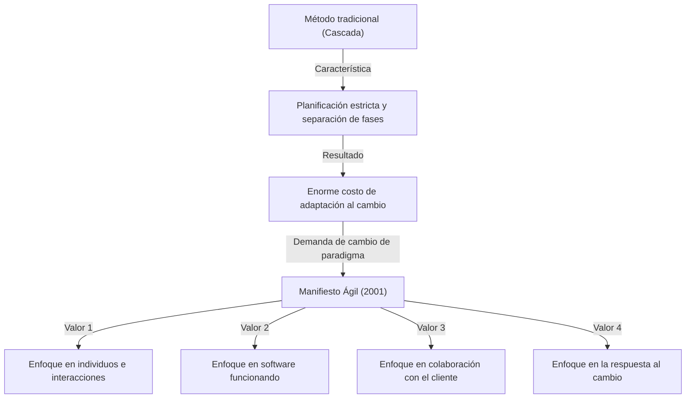
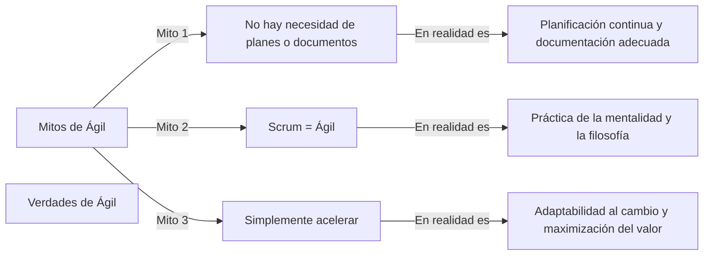

## 1. Introducción: El "Manifiesto Ágil" como piedra angular del desarrollo de software moderno

Hoy en día, no hay un solo día en el que no escuchemos la palabra "Ágil" (Agile) en la industria de TI y en el desarrollo de software. Diferentes metodologías como Scrum, Kanban y Extreme Programming (XP) se introducen rutinariamente, y muchas empresas adoptan Agile como un enfoque para entregar valor "más rápido y con mayor flexibilidad". Sin embargo, sorprendentemente pocas personas entienden profundamente cómo surgió este concepto de "Ágil" y en qué filosofía se basa.

Del 11 al 13 de febrero de 2001, 17 expertos en desarrollo de software se reunieron en una estación de esquí llamada Snowbird, en Utah, Estados Unidos. Exploraron soluciones a los graves problemas que enfrentaba el desarrollo de software en ese momento y, después de debatir, compilaron un solo manifiesto. Ese es el "Manifiesto para el Desarrollo Ágil de Software" (Agile Manifesto).

En este artículo, profundizaremos en el contexto histórico que llevó a la creación de este Manifiesto Ágil, la sensación de crisis frente a los "procesos pesados" que enfrentaban los equipos de desarrollo en ese entonces, los valores compartidos por los 17 redactores, y la filosofía que las organizaciones de desarrollo modernas realmente deberían aprender de este manifiesto.

## 2. Contexto histórico: La era de la crisis del software y los "procesos pesados"

Para comprender el trasfondo del Manifiesto Ágil, es necesario saber cuál era la situación del desarrollo de software en la década de 1990. En ese momento, la escala de los sistemas de software se estaba expandiendo rápidamente y volviéndose cada vez más compleja. Junto con esto, se hizo evidente una situación llamada "crisis del software". Eran frecuentes los fracasos como sobrecostos en los proyectos, retrasos en la entrega, o sistemas completados que eran completamente inutilizables.

Para hacer frente a esta crisis, la industria intentó controlar el problema a través de "planes más estrictos", "documentación detallada" y "gestión estricta de procesos". Esto es lo que generalmente se conoce como **procesos pesados (Heavyweight Processes)**, típicamente representados por el "modelo en cascada" (Waterfall).

La característica de los procesos pesados es que separan claramente cada fase del desarrollo (definición de requisitos, diseño, implementación, pruebas, mantenimiento), y no se pasa a la siguiente fase hasta que la anterior esté completamente terminada. Además, la comunicación entre cada fase se realizaba a través de enormes cantidades de documentación.

Sin embargo, este enfoque dificultaba enormemente la adaptación a los rápidos cambios en el entorno empresarial y a los nuevos requisitos que surgían durante el desarrollo. Bajo la premisa de que "el plan una vez decidido es absoluto", incluso si las verdaderas necesidades del cliente cambiaban, no había más remedio que seguir construyendo un sistema inútil de acuerdo con el plan. Los desarrolladores estaban abrumados por procesos burocráticos y la creación interminable de documentos, y estaban hambrientos de la alegría de crear "software funcionando" verdaderamente valioso.

## 3. La reunión de Snowbird: Los 17 rebeldes

A partir de finales de la década de 1990, comenzaron a surgir movimientos en varios lugares que se oponían a esta situación y buscaban métodos de desarrollo más ligeros y flexibles. Eran practicantes que habían logrado el éxito con sus propios enfoques, como Kent Beck de Extreme Programming (XP), Ken Schwaber y Jeff Sutherland de Scrum, y Alistair Cockburn de la metodología Crystal.

Aunque abogaban por métodos diferentes, compartían la creencia común de que "hay que valorar más a las personas y sus interacciones que a los procesos y herramientas". En febrero de 2001, a instancias de Robert C. Martin (Uncle Bob) y otros, 17 destacados defensores de los procesos ligeros (Lightweight Processes) se reunieron en Snowbird.

Extrajeron los valores fundamentales comunes a sus métodos y debatieron para presentar una nueva dirección a toda la industria. Inicialmente, llamaban a sus métodos "ligeros" (Lightweight), pero como esta palabra tenía una connotación negativa de "carecer de sustancia" o "ser de poco peso", buscaron un término más adecuado. Como resultado, se eligió la palabra **"Ágil" (Agile)**, que significa "ágil", "rápido" y "flexible".

## 4. Manifiesto para el Desarrollo Ágil de Software: 4 valores fundamentales

El fruto de las discusiones en Snowbird fue el "Manifiesto para el Desarrollo Ágil de Software", compuesto por un texto conciso de apenas unas decenas de palabras. Este manifiesto consta de los siguientes 4 valores fundamentales.

> Estamos descubriendo formas mejores de desarrollar software tanto por nuestra propia experiencia como ayudando a terceros. A través de este trabajo hemos aprendido a valorar:
> 
> - **Individuos e interacciones sobre procesos y herramientas**
> - **Software funcionando sobre documentación extensiva**
> - **Colaboración con el cliente sobre negociación contractual**
> - **Respuesta ante el cambio sobre seguir un plan**
> 
> Esto es, aunque valoramos los elementos de la derecha, valoramos más los de la izquierda.

Lo sobresaliente de este manifiesto es que no rechaza por completo los elementos de la derecha (procesos, documentación, contratos, planes). El delicado equilibrio de "aunque valoramos los elementos de la derecha, valoramos más los de la izquierda" es precisamente la razón por la que este manifiesto sigue siendo apoyado hoy en día no solo como un escrito rebelde, sino como una filosofía verdaderamente práctica.

### Profundizando en los valores fundamentales

1. **Individuos e interacciones sobre procesos y herramientas (Individuals and interactions over processes and tools)**
   Por muy excelentes que sean los procesos o las últimas herramientas que se introduzcan, son los humanos quienes las utilizan. Si hay barreras de comunicación o falta de confianza, el proyecto fracasará. Fomentar el diálogo directo entre los miembros del equipo, la cooperación para resolver problemas, y crear un entorno que maximice las habilidades y la motivación de los individuos es más importante que seguir estrictamente el proceso.

2. **Software funcionando sobre documentación extensiva (Working software over comprehensive documentation)**
   La documentación es necesaria, pero no proporciona valor al cliente por sí misma. En lugar de dedicar tiempo a escribir cientos de páginas de especificaciones, entregar rápidamente un software que realmente funcione y obtener retroalimentación al permitir que lo usen es mucho más valioso. El "software funcionando" es el indicador de progreso más confiable.

3. **Colaboración con el cliente sobre negociación contractual (Customer collaboration over contract negotiation)**
   En lugar de que el equipo de desarrollo y el cliente se enfrenten por "lo que está escrito o no en el contrato", se requiere construir una relación en la que colaboren como el mismo equipo. A menudo, los propios clientes no entienden completamente lo que realmente quieren al comienzo del desarrollo. Colaborar continuamente a lo largo del desarrollo y explorar juntos la solución óptima es el atajo hacia el éxito.

4. **Respuesta ante el cambio sobre seguir un plan (Responding to change over following a plan)**
   En el mundo actual, donde los cambios en el entorno empresarial y la tecnología son rápidos, aferrarse al plan inicial es solo un riesgo. Un plan es solo una hipótesis en la situación actual, y si se obtienen nuevos conocimientos o la situación cambia, es necesaria la flexibilidad para modificar el plan sin dudarlo. La actitud de dar la bienvenida al cambio como una "oportunidad para crear una ventaja competitiva", en lugar de rechazarlo como un "enemigo que altera el plan", es la esencia de Agile.

## 5. El significado de los 12 principios

Los 4 valores fundamentales se traducen en pautas de acción más concretas en los "Principios detrás del Manifiesto Ágil" (los 12 principios). Estos definen cómo debe comportarse una organización ágil.

1. **Nuestra mayor prioridad es satisfacer al cliente mediante la entrega temprana y continua de software con valor.**
2. **Aceptamos que los requisitos cambien, incluso en etapas tardías del desarrollo. Los procesos Ágiles aprovechan el cambio para proporcionar ventaja competitiva al cliente.**
3. **Entregamos software funcional frecuentemente, entre dos semanas y dos meses, con preferencia al periodo de tiempo más corto posible.**
4. **Los responsables de negocio y los desarrolladores trabajamos juntos de forma cotidiana durante todo el proyecto.**
5. **Los proyectos se desarrollan en torno a individuos motivados. Hay que darles el entorno y el apoyo que necesitan, y confiarles la ejecución del trabajo.**
6. **El método más eficiente y efectivo de comunicar información al equipo de desarrollo y entre sus miembros es la conversación cara a cara.**
7. **El software funcionando es la medida principal de progreso.**
8. **Los procesos Ágiles promueven el desarrollo sostenible. Los promotores, desarrolladores y usuarios debemos ser capaces de mantener un ritmo constante de forma indefinida.**
9. **La atención continua a la excelencia técnica y al buen diseño mejora la Agilidad.**
10. **La simplicidad, o el arte de maximizar la cantidad de trabajo no realizado, es esencial.**
11. **Las mejores arquitecturas, requisitos y diseños emergen de equipos que se auto-organizan.**
12. **A intervalos regulares el equipo reflexiona sobre cómo ser más efectivo para a continuación ajustar y perfeccionar su comportamiento en consecuencia.**

Estos principios cubren tanto los aspectos técnicos (conexión con CI/CD, desarrollo guiado por pruebas, refactorización, etc.) como los aspectos humanos (confianza, sostenibilidad, auto-organización). En particular, el octavo principio de "desarrollo sostenible" fue fuertemente motivado por el deseo de escapar de la "marcha de la muerte" (largas horas de trabajo sin fin) en la que muchos desarrolladores estaban atrapados en ese momento.

## 6. Mitos y verdades sobre Agile en la actualidad

Han pasado más de 20 años desde el Manifiesto Ágil, y la palabra "Ágil" se ha convertido completamente en la corriente principal. Sin embargo, a cambio de su popularidad, no son raros los casos en que se pierde la esencia de Agile y se convierte en una mera formalidad (el llamado "Ágil solo de nombre" o "Ágil en Cascada").

Los malentendidos comunes incluyen los siguientes:
- **"Si es Ágil, no se necesita planificar ni documentar"**: Como se mencionó anteriormente, este es un gran malentendido. Agile hace planes, pero no los fija, sino que los revisa continuamente. También se crea la documentación necesaria, pero simplemente se evita la documentación excesiva.
- **"Ágil = Scrum"**: Scrum es uno de los marcos de trabajo representativos para practicar Agile, pero no lo es todo. Si la mera ejecución de las ceremonias de Scrum (Daily Scrum y Sprint Review) se convierte en el objetivo, irá en contra del valor del Manifiesto Ágil de "Individuos e interacciones sobre procesos y herramientas".
- **"El objetivo de Agile es construir rápido"**: Agile ciertamente reduce el tiempo de entrega (lead time), pero no es una simple técnica de aceleración. El verdadero propósito es la adaptabilidad (Adaptability) para entregar "lo correcto, en el momento adecuado".

## 7. Impacto profundo en la cultura organizacional y perspectivas futuras

El Manifiesto Ágil ha ido más allá de ser un simple método de desarrollo de software para provocar un cambio de paradigma en la forma en que se estructuran las organizaciones y en los métodos de gestión. Palabras clave importantes en la teoría organizacional moderna, como "equipos auto-organizados", "seguridad psicológica" y "liderazgo de servicio", están todas profundamente conectadas con la filosofía Agile.

En la actualidad, donde se clama por la DX (Transformación Digital), se requiere un cambio hacia una cultura organizacional ágil no solo en las empresas de TI, sino en todas las industrias, incluidas las finanzas, la manufactura y el comercio minorista. Esto se debe a que, en esta era VUCA de cambios rápidos, la capacidad de "detectar cambios y cambiar de dirección rápidamente" es mucho más importante que la capacidad de "ejecutar según lo planeado".

Los 17 pioneros que redactaron el Manifiesto Ágil debatieron seriamente sobre cómo debería ser el futuro del desarrollo de software, y tejieron una filosofía para recuperar la humanidad. Ahora necesitamos romper de nuevo con el caparazón superficial de métodos y marcos de trabajo, y volver al punto de origen del Manifiesto Ágil: sus "valores" y "principios".

## 8. Conclusión

Detrás del "Manifiesto para el Desarrollo Ágil de Software" estaba el grito del alma de los ingenieros sobre el terreno que sufrían bajo procesos pesados y rígidos, y su pasión por recuperar un desarrollo más humano y creativo. Los 4 valores y 12 principios que dejaron poseen una verdad universal y atemporal que no se desvanecerá, sin importar cuánto avance la tecnología.

Si en tu trabajo de desarrollo diario te sientes atado por los procesos, abrumado por los documentos y a punto de perder de vista tu propósito original, asegúrate de volver a leer este "Manifiesto Ágil". Allí seguramente encontrarás las respuestas más importantes y esenciales sobre por qué creamos software y cómo deberíamos cooperar como equipo.
