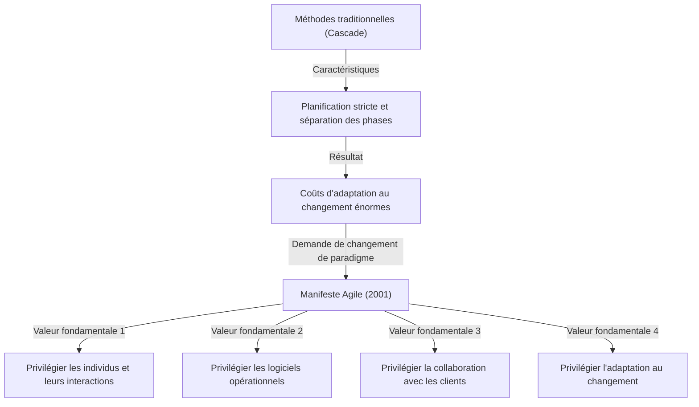
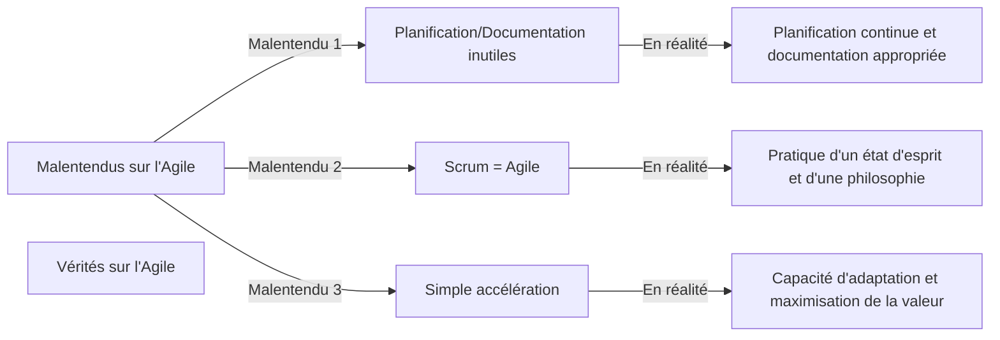

## 1. Introduction : Le « Manifeste Agile » devenu la pierre angulaire du développement logiciel moderne

Aujourd'hui, il ne se passe pas un jour sans que l'on entende le mot « Agile » dans le secteur de l'informatique et du développement de logiciels. Diverses méthodes telles que Scrum, Kanban, ou Extreme Programming (XP) sont régulièrement introduites, et de nombreuses entreprises adoptent l'Agile comme approche pour livrer de la valeur « plus rapidement et de manière plus flexible ». Cependant, peu de personnes comprennent vraiment comment le concept d'« Agile » est né et sur quelle philosophie il a été défini.

Du 11 au 13 février 2001, 17 experts en développement logiciel se sont réunis à Snowbird, une station de ski de l'Utah, aux États-Unis. Ils ont cherché des solutions aux graves problèmes auxquels le développement logiciel était confronté à l'époque et, après de nombreuses discussions, ont élaboré un manifeste unique. C'est le « Manifeste pour le développement Agile de logiciels » (Agile Manifesto).

Dans cet article, nous explorerons en profondeur le contexte historique qui a donné naissance à ce manifeste, le sentiment d'urgence face aux « processus lourds » de l'époque, les valeurs partagées par les 17 auteurs, et la philosophie que les organisations modernes devraient véritablement tirer de ce manifeste.

## 2. Contexte historique : L'ère de la crise logicielle et des « processus lourds »

Pour comprendre les coulisses du Manifeste Agile, il faut connaître l'état du développement logiciel dans les années 1990. À l'époque, l'échelle des systèmes logiciels s'est rapidement étendue et complexifiée. En conséquence, une situation appelée « crise du logiciel » est devenue apparente. Les dépassements de budget, les retards de livraison, ou l'échec de systèmes achevés mais totalement inutilisables étaient fréquents.

Pour faire face à cette crise, l'industrie a tenté de contrôler les problèmes par le biais d'une « planification plus stricte », d'une « documentation détaillée » et d'une « gestion de processus rigide ». C'est ce qu'on appelle généralement les **processus lourds (Heavyweight Processes)**, représentés par le modèle en cascade (Waterfall).

La caractéristique des processus lourds réside dans la séparation claire de chaque phase de développement (définition des exigences, conception, implémentation, tests, maintenance), la phase suivante ne commençant qu'une fois la précédente totalement terminée. De plus, la communication entre chaque phase se faisait via une énorme quantité de documentation.

Cependant, cette approche rendait extrêmement difficile l'adaptation aux changements rapides de l'environnement commercial ou aux nouvelles exigences découvertes en cours de développement. Sous le postulat que « le plan défini est absolu », même si les vrais besoins des clients changeaient, il n'y avait pas d'autre choix que de continuer à créer un système inutile selon le plan. Les développeurs étaient submergés par des processus bureaucratiques et la création sans fin de documents, et aspiraient à la joie de créer des « logiciels fonctionnels » qui apportent une réelle valeur.

## 3. La conférence de Snowbird : Les 17 rebelles

Pour contester cette situation et rechercher des méthodes de développement plus légères et flexibles, un mouvement a commencé à émerger dans divers endroits à la fin des années 1990. Parmi eux se trouvaient des praticiens ayant réussi avec leurs propres approches, comme Kent Beck pour Extreme Programming (XP), Ken Schwaber et Jeff Sutherland pour Scrum, et Alistair Cockburn pour la méthode Crystal.

Bien qu'ils aient préconisé des méthodes différentes, ils partageaient la conviction commune qu'il faut « privilégier les individus et leurs interactions plus que les processus et les outils ». En février 2001, à l'appel de Robert C. Martin (Uncle Bob) et d'autres, 17 des principaux partisans des processus légers (Lightweight Processes) se sont réunis à Snowbird.

Ils ont discuté pour extraire les valeurs fondamentales communes à leurs méthodes et proposer une nouvelle orientation à l'ensemble de l'industrie. Au début, ils appelaient leurs méthodes « légères (Lightweight) », mais comme ce mot avait une connotation négative de « sans substance » ou « faible », ils ont cherché un terme plus approprié. Le mot qu'ils ont finalement choisi a été **« Agile »**, ce qui signifie « prompt », « rapide » et « flexible ».

## 4. Le Manifeste pour le développement Agile de logiciels : Les 4 valeurs fondamentales

Le fruit des discussions à Snowbird a été le « Manifeste pour le développement Agile de logiciels », composé d'un texte concis de seulement quelques dizaines de mots. Ce manifeste repose sur les quatre valeurs fondamentales suivantes.

> Nous découvrons de meilleures façons de développer des logiciels par la pratique et en aidant les autres à le faire. Ces expériences nous ont amenés à valoriser :
> 
> - **Les individus et leurs interactions** plus que les processus et les outils.
> - **Des logiciels opérationnels** plus qu'une documentation exhaustive.
> - **La collaboration avec les clients** plus que la négociation contractuelle.
> - **L'adaptation au changement** plus que le suivi d'un plan.
> 
> Nous reconnaissons la valeur des seconds éléments, mais privilégions les premiers.

L'excellence de ce manifeste réside dans le fait qu'il ne rejette pas totalement les éléments de droite (processus, documentation, négociation contractuelle, plan). Le fait de « reconnaître la valeur des seconds éléments, mais privilégier les premiers » montre un sens de l'équilibre parfait, ce qui explique pourquoi ce manifeste n'est pas simplement un écrit de rébellion, mais une philosophie véritablement pratique qui continue d'être soutenue aujourd'hui.

### Approfondissement des valeurs fondamentales

1. **Les individus et leurs interactions plus que les processus et les outils (Individuals and interactions over processes and tools)**
   Peu importe la qualité du processus ou l'utilisation des outils les plus récents, ce sont des êtres humains qui les utilisent. S'il y a des barrières de communication ou un manque de confiance, le projet échouera. Un dialogue direct entre les membres de l'équipe, une collaboration pour résoudre les problèmes et la création d'un environnement qui maximise les compétences et la motivation individuelles sont plus importants que le strict respect d'un processus.

2. **Des logiciels opérationnels plus qu'une documentation exhaustive (Working software over comprehensive documentation)**
   La documentation est nécessaire, mais elle n'apporte pas en elle-même de la valeur au client. Plutôt que de passer du temps à écrire des centaines de pages de spécifications, il est bien plus précieux de fournir rapidement un logiciel opérationnel et d'obtenir des retours en le faisant utiliser. Un « logiciel opérationnel » est l'indicateur de progression le plus fiable.

3. **La collaboration avec les clients plus que la négociation contractuelle (Customer collaboration over contract negotiation)**
   Au lieu de s'opposer sur ce qui est « écrit ou non dans le contrat », il est nécessaire que les développeurs et les clients établissent une relation de collaboration en tant que membres de la même équipe. Souvent, les clients eux-mêmes ne comprennent pas parfaitement ce qu'ils veulent au début du développement. Collaborer continuellement tout au long du développement et explorer ensemble la solution optimale est le chemin le plus court vers le succès.

4. **L'adaptation au changement plus que le suivi d'un plan (Responding to change over following a plan)**
   Dans un monde moderne où l'environnement commercial et la technologie évoluent rapidement, s'accrocher à un plan initial n'est qu'un risque. Un plan n'est qu'une hypothèse fondée sur la situation actuelle, et il faut faire preuve de flexibilité pour le modifier sans hésitation si de nouvelles connaissances sont acquises ou si la situation change. L'essence de l'Agile est d'accueillir le changement non pas comme un « ennemi perturbant le plan », mais comme une « opportunité de créer un avantage concurrentiel ».

## 5. Ce que signifient les 12 principes

Les « Principes sous-jacents au Manifeste Agile » (les 12 principes) traduisent les 4 valeurs fondamentales en directives d'action plus concrètes. Ils définissent comment une organisation Agile devrait se comporter.

1. **Notre plus haute priorité est de satisfaire le client en livrant rapidement et régulièrement des fonctionnalités à grande valeur ajoutée.**
2. **Accueillez favorablement les demandes de changement, même tard dans le développement. Les processus Agiles exploitent le changement pour donner un avantage compétitif au client.**
3. **Livrez fréquemment un logiciel opérationnel avec des cycles de quelques semaines à quelques mois et une préférence pour les plus courts.**
4. **Les utilisateurs ou leurs représentants et les développeurs doivent travailler ensemble quotidiennement tout au long du projet.**
5. **Réalisez les projets avec des personnes motivées. Fournissez-leur l'environnement et le soutien dont elles ont besoin et faites-leur confiance pour atteindre les objectifs fixés.**
6. **La méthode la plus simple et la plus efficace pour transmettre de l'information à l'équipe de développement et à l'intérieur de celle-ci est le dialogue en face à face.**
7. **Un logiciel opérationnel est la principale mesure d'avancement.**
8. **Les processus Agiles encouragent un rythme de développement soutenable. Les commanditaires, les développeurs et les utilisateurs devraient pouvoir maintenir indéfiniment un rythme constant.**
9. **Une attention continue à l'excellence technique et à une bonne conception renforce l'Agilité.**
10. **La simplicité – c'est-à-dire l'art de maximiser la quantité de travail qu'on ne fait pas – est essentielle.**
11. **Les meilleures architectures, spécifications et conceptions émergent d'équipes auto-organisées.**
12. **À intervalles réguliers, l'équipe réfléchit aux moyens de devenir plus efficace, puis règle et modifie son comportement en conséquence.**

Ces principes couvrent à la fois les aspects techniques (lien avec le CI/CD, le développement piloté par les tests, le refactoring, etc.) et les aspects humains (confiance, durabilité, auto-organisation). Le principe 8, « un rythme de développement soutenable », était particulièrement conçu pour s'éloigner des « marches de la mort (heures supplémentaires interminables) » dans lesquelles de nombreux développeurs étaient piégés à l'époque.

## 6. Les malentendus et vérités sur l'Agile aujourd'hui

Plus de 20 ans après le Manifeste Agile, le mot « Agile » est devenu complètement courant. Cependant, en contrepartie de sa popularité, l'essence de l'Agile s'est souvent perdue et est devenue une coquille vide (les cas d'« Agile de nom seulement » ou d'« Agile en cascade » ne cessent de se produire).

Parmi les malentendus courants, on peut citer :
- **« Avec l'Agile, on n'a pas besoin de planifier ni d'écrire de documentation »** : Comme mentionné précédemment, c'est une grave erreur. L'Agile implique une planification, mais ne la fige pas et la révise continuellement. La documentation nécessaire est également créée, mais on évite une sur-documentation.
- **« Agile = Scrum »** : Scrum est l'un des cadres représentatifs pour pratiquer l'Agile, mais ce n'est pas le seul. Si accomplir les cérémonies de Scrum (les Daily Scrums ou les revues de sprint) devient une fin en soi, cela va à l'encontre de la valeur fondamentale du Manifeste Agile de « privilégier les individus et leurs interactions plus que les processus et les outils ».
- **« Créer rapidement est le but de l'Agile »** : L'Agile réduit certes les délais de livraison, mais ce n'est pas seulement une méthode pour aller plus vite. Le véritable but est l'adaptabilité (Adaptability) pour « fournir la bonne chose au bon moment ».

## 7. L'impact profond sur la culture d'entreprise et les perspectives d'avenir

Le Manifeste Agile a dépassé la simple méthode de développement logiciel pour apporter un changement de paradigme dans l'organisation et la gestion. Des mots-clés importants de la théorie des organisations modernes, tels que « équipes auto-organisées », « sécurité psychologique » et « leadership serviteur », sont tous profondément liés à la philosophie Agile.

À l'heure où l'on prône la transformation numérique (DX), on demande à toutes les industries, et pas seulement au secteur informatique, mais aussi à la finance, à l'industrie manufacturière et à la vente au détail, de se transformer vers une culture organisationnelle Agile. Dans l'ère actuelle de la VUCA (volatilité, incertitude, complexité et ambiguïté), la capacité à « détecter les changements et à pivoter rapidement » est devenue bien plus importante que la « capacité à exécuter un plan tel quel ».

Les 17 pionniers qui ont rédigé le Manifeste Agile ont discuté sérieusement de ce à quoi devrait ressembler l'avenir du développement logiciel et ont forgé une philosophie pour retrouver notre humanité. Il est maintenant temps de briser la coquille superficielle des méthodes et des frameworks et de revenir aux « valeurs fondamentales » et aux « principes » qui sont à l'origine du Manifeste Agile.

## 8. Conclusion

Derrière le « Manifeste pour le développement Agile de logiciels » se trouvaient les cris de l'âme des ingénieurs sur le terrain, souffrant de processus lourds et rigides, et leur passion pour retrouver un développement plus humain et créatif. Les quatre valeurs et les douze principes qu'ils ont laissés possèdent une vérité universelle et intemporelle qui ne s'estompera pas, quelle que soit l'évolution de la technologie.

Si vous vous retrouvez lié par des processus dans vos tâches de développement quotidiennes, submergé par la documentation et sur le point de perdre de vue votre objectif initial, je vous invite à relire ce « Manifeste Agile ». Vous y trouverez sans doute les réponses les plus importantes et essentielles sur la raison pour laquelle nous créons des logiciels et comment nous devons collaborer en équipe.
