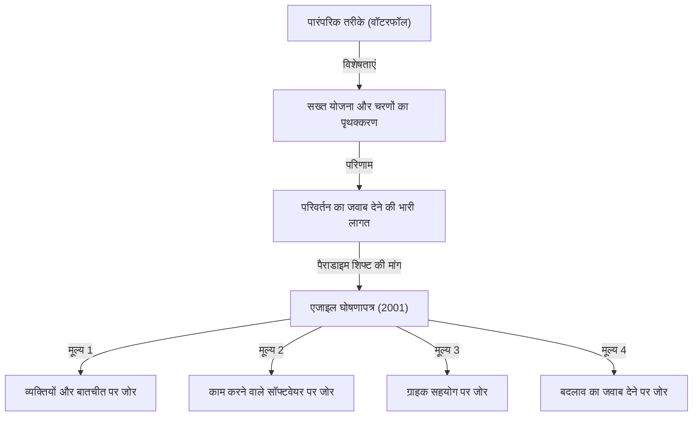
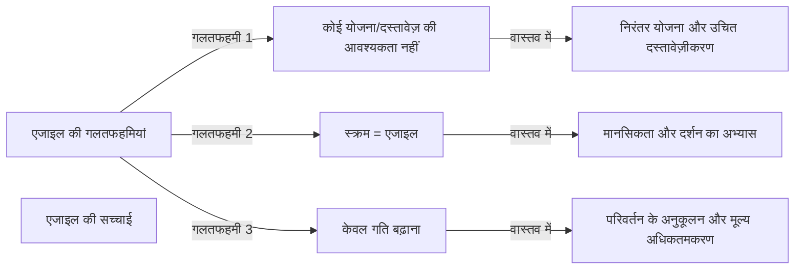

## 1. परिचय: आधुनिक सॉफ्टवेयर विकास की नींव बना "एजाइल घोषणापत्र"

आजकल, आईटी उद्योग और सॉफ्टवेयर विकास में "एजाइल (Agile)" शब्द सुने बिना एक दिन भी नहीं गुजरता। स्क्रम, कानबन, और एक्सट्रीम प्रोग्रामिंग (XP) जैसे विभिन्न तरीके दैनिक रूप से पेश किए जाते हैं, और कई कंपनियां मूल्य को "तेजी से और अधिक लचीलेपन के साथ" वितरित करने के दृष्टिकोण के रूप में एजाइल को अपनाती हैं। हालांकि, आश्चर्यजनक रूप से कम लोग गहराई से समझते हैं कि यह "एजाइल" अवधारणा कैसे पैदा हुई और इसे किस दर्शन पर परिभाषित किया गया था।

11 से 13 फरवरी 2001 तक, 17 सॉफ्टवेयर विकास विशेषज्ञ यूटा, अमेरिका के स्नोबर्ड नामक स्की रिसॉर्ट में एकत्र हुए। उन्होंने उस समय सॉफ्टवेयर विकास के सामने आने वाली गंभीर समस्याओं के समाधान की तलाश की और चर्चा के बाद एक घोषणापत्र तैयार किया। वह "एजाइल सॉफ्टवेयर डेवलपमेंट मेनिफेस्टो (Agile Manifesto)" है।

इस लेख में, हम उस ऐतिहासिक पृष्ठभूमि की गहराई से पड़ताल करेंगे जिसके कारण एजाइल घोषणापत्र का जन्म हुआ, उस समय विकास टीमों के सामने "हेवीवेट प्रक्रियाओं" के प्रति संकट की भावना, 17 लेखकों द्वारा साझा किए गए मूल्य, और वह दर्शन जो आधुनिक विकास संगठनों को वास्तव में इस घोषणापत्र से सीखना चाहिए।

## 2. ऐतिहासिक पृष्ठभूमि: सॉफ्टवेयर संकट का युग और "हेवीवेट प्रक्रियाएं"

एजाइल घोषणापत्र के पीछे की कहानी को समझने के लिए, यह जानना आवश्यक है कि 1990 के दशक में सॉफ्टवेयर विकास किस स्थिति में था। उस समय, सॉफ्टवेयर सिस्टम का पैमाना तेजी से बढ़ रहा था और वे तेजी से जटिल होते जा रहे थे। इसके साथ ही, "सॉफ्टवेयर संकट" नामक स्थिति स्पष्ट हो गई। परियोजनाओं का बजट से अधिक हो जाना, डिलीवरी में देरी, या पूर्ण किए गए सिस्टम का पूरी तरह से बेकार हो जाना जैसी विफलताएं अक्सर होती थीं।

इस संकट से निपटने के लिए, उद्योग ने "सख्त योजना", "विस्तृत दस्तावेज़ीकरण" और "कठोर प्रक्रिया प्रबंधन" के माध्यम से समस्याओं को नियंत्रित करने का प्रयास किया। यह **हेवीवेट प्रक्रियाएं (Heavyweight Processes)** हैं, जिन्हें आम तौर पर "वॉटरफॉल मॉडल" द्वारा दर्शाया जाता है।

हेवीवेट प्रक्रियाओं की विशेषता यह है कि विकास के प्रत्येक चरण (आवश्यकता परिभाषा, डिजाइन, कार्यान्वयन, परीक्षण, रखरखाव) को स्पष्ट रूप से अलग किया जाता है, और अगला चरण पिछले चरण के पूरी तरह से समाप्त होने के बाद ही आगे बढ़ता है। इसके अलावा, प्रत्येक चरण के बीच सूचना का संचार भारी मात्रा में दस्तावेज़ों के माध्यम से किया जाता था।

हालाँकि, इस दृष्टिकोण के लिए व्यावसायिक वातावरण में तेजी से होने वाले बदलावों और विकास के दौरान उभरने वाली नई आवश्यकताओं का जवाब देना बेहद मुश्किल था। इस आधार के तहत कि "एक बार तय की गई योजना पूर्ण है", भले ही ग्राहकों की वास्तविक ज़रूरतें बदल गई हों, उनके पास योजना के अनुसार बेकार सिस्टम बनाना जारी रखने के अलावा कोई विकल्प नहीं था। डेवलपर्स नौकरशाही प्रक्रियाओं और अंतहीन दस्तावेज़ निर्माण में बहुत व्यस्त थे, और वास्तव में मूल्यवान "काम करने वाले सॉफ्टवेयर" बनाने की खुशी के भूखे थे।

## 3. स्नोबर्ड सम्मेलन: 17 विद्रोही

इस स्थिति पर आपत्ति जताते हुए और अधिक हल्के और लचीले विकास विधियों की तलाश में, 1990 के दशक के उत्तरार्ध में विभिन्न स्थानों पर आंदोलन शुरू हुए। ये वे अभ्यासी थे जो अपने स्वयं के अनूठे दृष्टिकोणों के साथ सफल हुए थे, जैसे कि एक्सट्रीम प्रोग्रामिंग (XP) के केंट बेक, स्क्रम के केन श्वाबेर और जेफ सदरलैंड, और क्रिस्टल पद्धति के एलिस्टेयर कॉकबर्न।

हालांकि वे प्रत्येक अलग-अलग तरीकों की वकालत कर रहे थे, लेकिन उनका एक साझा विश्वास था: "प्रक्रियाओं और उपकरणों से अधिक व्यक्तियों और बातचीत को महत्व देना।" फरवरी 2001 में, रॉबर्ट सी. मार्टिन (अंकल बॉब) और अन्य के निमंत्रण पर, लाइटवेट प्रक्रियाओं (Lightweight Processes) के 17 प्रमुख पैरोकार स्नोबर्ड में एकत्र हुए।

उन्होंने अपने तरीकों के लिए सामान्य मुख्य मूल्यों को निकाला और पूरे उद्योग के लिए एक नई दिशा का प्रस्ताव देने के लिए चर्चा की। प्रारंभ में, उन्होंने अपने तरीकों को "लाइटवेट (Lightweight)" कहा, लेकिन क्योंकि इस शब्द का नकारात्मक अर्थ "बिना सामग्री" या "हल्का" था, उन्होंने अधिक उपयुक्त शब्द की खोज की। परिणामस्वरूप, चुना गया शब्द **"एजाइल (Agile)"** था, जिसका अर्थ है "फुर्तीला", "तेज़" या "लचीला"।

## 4. एजाइल सॉफ्टवेयर डेवलपमेंट मेनिफेस्टो: 4 मूल्य

स्नोबर्ड में चर्चाओं के क्रिस्टलीकरण के रूप में बनाया गया "एजाइल सॉफ्टवेयर डेवलपमेंट मेनिफेस्टो" केवल कुछ दर्जन शब्दों के संक्षिप्त पाठ से बना है। यह घोषणापत्र निम्नलिखित 4 मूल्यों पर आधारित है।

> हम सॉफ्टवेयर विकास के बेहतर तरीके खोज रहे हैं, इसे स्वयं करके और दूसरों को इसे करने में मदद करके। इस काम के माध्यम से हम इन मूल्यों को मानने लगे हैं:
> 
> - **प्रक्रियाओं और उपकरणों पर व्यक्तियों और बातचीत को**
> - **व्यापक दस्तावेज़ीकरण पर काम करने वाले सॉफ्टवेयर को**
> - **अनुबंध वार्तालाप पर ग्राहक सहयोग को**
> - **योजना का पालन करने पर बदलाव का जवाब देने को**
> 
> महत्व देते हैं। यानी, जबकि दाईं ओर के आइटमों में मूल्य है, हम बाईं ओर के आइटमों को अधिक महत्व देते हैं।

इस घोषणापत्र का उत्कृष्ट बिंदु यह internal है कि यह बाईं ओर (प्रक्रियाएं, दस्तावेज़ीकरण, अनुबंध वार्तालाप, योजनाएं) की चीजों को पूरी तरह से नकारता नहीं है। "जबकि दाईं ओर के आइटमों में मूल्य है", फिर भी "हम बाईं ओर के आइटमों को अधिक महत्व देते हैं" - यह उत्कृष्ट संतुलन ही कारण है कि इस घोषणापत्र का न केवल विद्रोह के दस्तावेज़ के रूप में बल्कि आज तक वास्तव में व्यावहारिक दर्शन के रूप में समर्थन किया जाना जारी है।

### मूल्यों की गहराई से पड़ताल

1. **प्रक्रियाओं और उपकरणों पर व्यक्तियों और बातचीत को (Individuals and interactions over processes and tools)**
   चाहे आप कितनी भी उत्कृष्ट प्रक्रियाएं या नवीनतम उपकरण पेश करें, उनका उपयोग करने वाले मनुष्य हैं। यदि संचार बाधाएं हैं या विश्वास की कमी है, तो परियोजना विफल हो जाएगी। टीम के सदस्यों के बीच सीधा संवाद, समस्या समाधान के लिए सहयोग, और एक ऐसा वातावरण बनाना जो व्यक्तिगत कौशल और प्रेरणा को अधिकतम करे, प्रक्रियाओं का सख्ती से पालन करने से अधिक महत्वपूर्ण है।

2. **व्यापक दस्तावेज़ीकरण पर काम करने वाले सॉफ्टवेयर को (Working software over comprehensive documentation)**
   दस्तावेज़ आवश्यक हैं, लेकिन वे स्वयं ग्राहक को मूल्य प्रदान नहीं करते हैं। सैकड़ों पृष्ठों के विनिर्देश लिखने में समय बिताने के बजाय, वास्तव में काम करने वाले सॉफ़्टवेयर को जल्दी से वितरित करना और ग्राहकों को इसे आज़माने देकर प्रतिक्रिया प्राप्त करना कहीं अधिक मूल्यवान है। "काम करने वाला सॉफ्टवेयर" प्रगति का सबसे विश्वसनीय संकेतक है।

3. **अनुबंध वार्तालाप पर ग्राहक सहयोग को (Customer collaboration over contract negotiation)**
   विकास पक्ष और ग्राहक पक्ष को "यह अनुबंध में लिखा है या नहीं" पर संघर्ष करने के बजाय, एक ही टीम के रूप में एक साथ सहयोग करने वाला संबंध बनाने की आवश्यकता है। यहां तक कि ग्राहकों को भी अक्सर पूरी तरह से समझ में नहीं आता है कि वे वास्तव में विकास शुरू होने के समय क्या चाहते हैं। विकास के माध्यम से लगातार सहयोग करना और एक साथ सर्वोत्तम समाधान तलाशना सफलता का सबसे छोटा रास्ता है।

4. **योजना का पालन करने पर बदलाव का जवाब देने को (Responding to change over following a plan)**
   आज के कारोबारी माहौल और तेजी से तकनीकी बदलावों में, शुरुआती योजना पर अड़े रहना केवल एक जोखिम है। एक योजना वर्तमान स्थिति के आधार पर केवल एक परिकल्पना है, और नए ज्ञान प्राप्त होने या स्थिति बदलने पर बिना किसी हिचकिचाहट के योजना को संशोधित करने के लिए लचीलापन आवश्यक है। परिवर्तन को "योजना को बाधित करने वाले दुश्मन" के रूप में समाप्त करने के बजाय, इसे "प्रतिस्पर्धात्मक लाभ पैदा करने के अवसर" के रूप में स्वागत करने का दृष्टिकोण एजाइल का सार है।

## 5. 12 सिद्धांतों का क्या अर्थ है

4 मूल्यों को अधिक विशिष्ट कार्रवाई दिशानिर्देशों में "एजाइल मेनिफेस्टो के पीछे के सिद्धांत (12 सिद्धांत)" द्वारा अनुवादित किया गया था। ये परिभाषित करते हैं कि एजाइल संगठनों को कैसे व्यवहार करना चाहिए।

1. **हमारी सर्वोच्च प्राथमिकता मूल्यवान सॉफ्टवेयर के प्रारंभिक और निरंतर वितरण के माध्यम से ग्राहक को संतुष्ट करना है।**
2. **बदलती आवश्यकताओं का स्वागत करें, यहां तक कि विकास के अंतिम चरण में भी। एजाइल प्रक्रियाएं ग्राहक के प्रतिस्पर्धात्मक लाभ के लिए परिवर्तन का उपयोग करती हैं।**
3. **कुछ हफ्तों से लेकर कुछ महीनों के समय के पैमाने पर काम करने वाले सॉफ्टवेयर को बार-बार वितरित करें, कम समय को प्राथमिकता देते हुए।**
4. **व्यवसाय से जुड़े लोगों और डेवलपर्स को पूरे प्रोजेक्ट में रोजाना मिलकर काम करना चाहिए।**
5. **प्रेरित व्यक्तियों के आसपास प्रोजेक्ट बनाएं। उन्हें आवश्यक वातावरण और समर्थन दें, और काम पूरा करने के लिए उन पर भरोसा करें।**
6. **विकास टीम को और उसके भीतर सूचना प्रसारित करने का सबसे कुशल और प्रभावी तरीका आमने-सामने की बातचीत है।**
7. **काम करने वाला सॉफ्टवेयर प्रगति का प्राथमिक माप है।**
8. **एजाइल प्रक्रियाएं टिकाऊ विकास को बढ़ावा देती हैं। प्रायोजकों, डेवलपर्स, और उपयोगकर्ताओं को अनिश्चित काल तक एक निरंतर गति बनाए रखने में सक्षम होना चाहिए।**
9. **तकनीकी उत्कृष्टता और अच्छे डिजाइन पर निरंतर ध्यान एजाइल को बढ़ाता है。**
10. **सरलता - बिना किए गए काम की मात्रा को अधिकतम करने की कला - आवश्यक है।**
11. **सर्वश्रेष्ठ आर्किटेक्चर, आवश्यकताएं, और डिजाइन स्व-संगठित टीमों से उभरते हैं।**
12. **नियमित अंतराल पर, टीम इस बात पर विचार करती है कि अधिक प्रभावी कैसे बनें, फिर उसी के अनुसार अपने व्यवहार को ट्यून और समायोजित करती है।**

ये सिद्धांत तकनीकी पहलुओं (CI/CD, टेस्ट-ड्रिवन डेवलपमेंट, रिफैक्टरिंग, आदि से जुड़ाव) और मानवीय पहलुओं (विश्वास, स्थिरता, स्व-संगठन) दोनों को कवर करते हैं। विशेष रूप से, 8वां सिद्धांत, "टिकाऊ विकास," उस समय कई डेवलपर्स द्वारा अनुभव किए जा रहे "डेथ मार्च" (अंतहीन लंबे काम के घंटे) से दूर जाने के बारे में एक मजबूत जागरूकता थी।

## 6. आधुनिक समय में एजाइल के बारे में गलत धारणाएं और सच्चाई

एजाइल घोषणापत्र को 20 से अधिक वर्ष बीत चुके हैं, और "एजाइल" शब्द पूरी तरह से मुख्यधारा बन गया है। हालांकि, इसके प्रसार के बदले में, ऐसे मामले जहां एजाइल का सार खो जाता है और यह केवल नाम का रह जाता है (तथाकथित "केवल नाम में एजाइल" या "वॉटरफॉल एजाइल") अंतहीन हैं।

सामान्य गलतफहमियों में निम्नलिखित शामिल हैं:
- **"यदि यह एजाइल है, तो आपको योजना की आवश्यकता नहीं है, और आपको दस्तावेज़ लिखने की आवश्यकता नहीं है"**: जैसा कि ऊपर बताया गया है, यह एक बड़ी गलतफहमी है। एजाइल योजना बनाता है, लेकिन इसे तय नहीं करता है बल्कि लगातार इसकी समीक्षा करता है। आवश्यक दस्तावेज़ भी बनाए जाते हैं, लेकिन केवल अत्यधिक दस्तावेज़ीकरण से बचा जाता है।
- **"एजाइल = स्क्रम"**: स्क्रम एजाइल का अभ्यास करने के लिए प्रतिनिधि रूपरेखाओं में से एक है, लेकिन यह सब कुछ नहीं है। यदि स्क्रम के समारोहों (दैनिक स्क्रम और स्प्रिंट समीक्षा) से गुजरना ही एकमात्र लक्ष्य बन जाता है, तो यह एजाइल घोषणापत्र के मूल्य "प्रक्रियाओं और उपकरणों पर व्यक्तियों और बातचीत" के खिलाफ होगा।
- **"एजाइल का उद्देश्य चीजों को तेजी से बनाना है"**: एजाइल निश्चित रूप से लीड समय को कम करता है, लेकिन यह केवल गति बढ़ाने का तरीका नहीं है। "सही समय पर सही चीजें प्रदान करने" के लिए अनुकूलन क्षमता (Adaptability) ही इसका वास्तविक उद्देश्य है।

## 7. संगठनात्मक संस्कृति पर गहरा प्रभाव और भविष्य के दृष्टिकोण

एजाइल घोषणापत्र ने केवल सॉफ्टवेयर विकास विधियों से परे, संगठनों के होने और प्रबंधन विधियों में भी एक प्रतिमान बदलाव लाया है। आधुनिक संगठनात्मक सिद्धांत में "स्व-संगठित टीम", "मनोवैज्ञानिक सुरक्षा", और "सर्वेंट लीडरशिप" जैसे महत्वपूर्ण कीवर्ड सभी एजाइल दर्शन से गहराई से जुड़े हुए हैं।

वर्तमान में, जहां DX (डिजिटल परिवर्तन) की मांग की जा रही है, न केवल आईटी कंपनियों में बल्कि वित्त, विनिर्माण और खुदरा जैसे सभी उद्योगों में एक एजाइल संगठनात्मक संस्कृति में परिवर्तन की आवश्यकता है। ऐसा इसलिए है क्योंकि तेजी से बदलते VUCA की दुनिया में, "परिवर्तनों को भांपने और जल्दी से दिशा बदलने की क्षमता" "योजना के अनुसार निष्पादित करने की क्षमता" से कहीं अधिक महत्वपूर्ण हो गई है।

एजाइल घोषणापत्र का मसौदा तैयार करने वाले 17 अग्रदूतों ने गंभीरता से चर्चा की कि भविष्य का सॉफ्टवेयर विकास कैसा होना चाहिए, और मानवता को पुनः प्राप्त करने के लिए एक दर्शन तैयार किया। अब हमें एक बार फिर तरीकों और रूपरेखाओं के सतही आवरण को तोड़ना चाहिए, और एजाइल घोषणापत्र की उत्पत्ति, "मूल्यों" और "सिद्धांतों" पर वापस लौटना चाहिए।

## 8. निष्कर्ष

"एजाइल सॉफ्टवेयर डेवलपमेंट मेनिफेस्टो" के पीछे उन इंजीनियरों की आत्मा की पुकार थी जो कठोर हेवीवेट प्रक्रियाओं से पीड़ित थे, और अधिक मानवीय और रचनात्मक विकास को पुनः प्राप्त करने का उनका जुनून था। उनके द्वारा छोड़े गए 4 मूल्य और 12 सिद्धांत सार्वभौमिक सत्य हैं जो समय के साथ फीके नहीं पड़ते, चाहे तकनीक कितनी भी विकसित क्यों न हो जाए।

यदि आप खुद को अपनी दैनिक विकास गतिविधियों में प्रक्रियाओं से बंधा हुआ, दस्तावेज़ों के बोझ तले दबा हुआ पाते हैं, और अपनी दृष्टि का मूल उद्देश्य खो रहे हैं, तो कृपया इस "एजाइल घोषणापत्र" को फिर से पढ़ें। वहां, आपको सबसे महत्वपूर्ण और आवश्यक उत्तर मिलना चाहिए कि हम सॉफ्टवेयर क्यों बनाते हैं और हमें एक टीम के रूप में कैसे सहयोग करना चाहिए।
