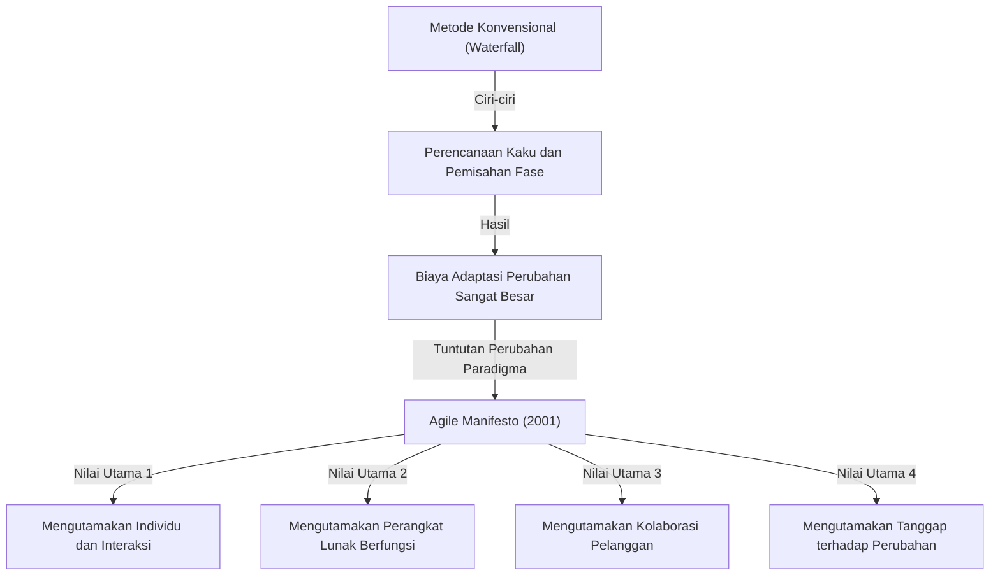
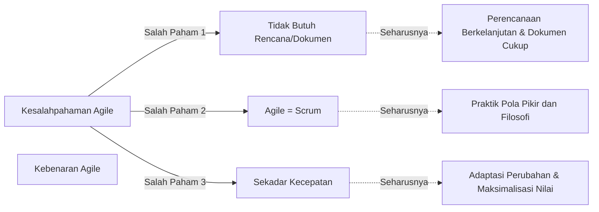

## 1. Pendahuluan: "Agile Manifesto" sebagai Landasan Pengembangan Perangkat Lunak Modern

Saat ini, di industri TI dan pengembangan perangkat lunak, hampir tidak ada hari tanpa mendengar kata "Agile". Berbagai metode seperti Scrum, Kanban, dan eXtreme Programming (XP) diimplementasikan secara rutin, dan banyak perusahaan mengadopsi Agile sebagai pendekatan untuk memberikan nilai "lebih cepat dan lebih fleksibel". Namun, mungkin hanya sedikit orang yang benar-benar memahami secara mendalam bagaimana konsep "Agile" ini lahir dan filosofi apa yang mendasarinya.

Dari tanggal 11 hingga 13 Februari 2001, 17 ahli pengembangan perangkat lunak berkumpul di resor ski Snowbird di Utah, Amerika Serikat. Mereka mencari solusi untuk masalah serius yang dihadapi dalam pengembangan perangkat lunak saat itu, dan setelah berdiskusi, mereka menyusun sebuah deklarasi. Itulah "Agile Software Development Manifesto".

Artikel ini akan mendalami secara tuntas latar belakang sejarah lahirnya Agile Manifesto, rasa krisis terhadap "Proses Kelas Berat (Heavyweight Processes)" yang dihadapi tim pengembangan saat itu, nilai-nilai yang diyakini bersama oleh 17 penyusun, serta filosofi yang benar-benar harus dipelajari oleh organisasi pengembangan modern dari deklarasi ini.

## 2. Latar Belakang Sejarah: Era Krisis Perangkat Lunak dan "Proses Kelas Berat"

Untuk memahami latar belakang Agile Manifesto, kita perlu mengetahui bagaimana kondisi pengembangan perangkat lunak pada tahun 1990-an. Saat itu, skala sistem perangkat lunak berkembang pesat dan semakin kompleks. Seiring dengan hal ini, muncul situasi yang disebut "Krisis Perangkat Lunak". Kegagalan proyek seperti anggaran yang membengkak, keterlambatan jadwal, atau sistem yang sudah selesai tetapi tidak dapat digunakan sama sekali sangat sering terjadi.

Untuk mengatasi krisis ini, industri mencoba mengendalikan masalah melalui "perencanaan yang lebih ketat", "dokumentasi yang detail", dan "manajemen proses yang kaku". Ini yang umumnya dikenal dengan pendekatan **Proses Kelas Berat (Heavyweight Processes)**, yang diwakili oleh "Waterfall Model".

Ciri khas dari Proses Kelas Berat adalah pemisahan yang jelas antara setiap fase pengembangan (Analisis Kebutuhan, Desain, Implementasi, Pengujian, Pemeliharaan), di mana fase berikutnya hanya dapat dimulai setelah fase sebelumnya benar-benar selesai. Selain itu, komunikasi antar fase dilakukan melalui dokumentasi dalam jumlah besar.

Namun, pendekatan ini sangat kesulitan beradaptasi dengan perubahan lingkungan bisnis yang cepat atau kebutuhan baru yang muncul di tengah pengembangan. Dengan asumsi bahwa "rencana yang sudah ditetapkan adalah mutlak", bahkan ketika kebutuhan nyata pelanggan berubah, mereka harus terus membangun sistem yang tidak berguna sesuai rencana awal. Para pengembang tenggelam dalam proses birokratis dan pembuatan dokumentasi yang tiada akhir, sehingga mereka haus akan kepuasan menciptakan "perangkat lunak yang berfungsi" dan benar-benar bernilai.

## 3. Pertemuan Snowbird: 17 Pemberontak

Menentang kondisi ini dan mencari metode pengembangan yang lebih ringan dan fleksibel mulai muncul di berbagai tempat sejak akhir 1990-an. Mereka adalah para praktisi yang telah sukses dengan pendekatannya masing-masing, seperti Kent Beck dengan eXtreme Programming (XP), Ken Schwaber dan Jeff Sutherland dengan Scrum, serta Alistair Cockburn dengan metode Crystal.

Meskipun mereka mengusulkan metode yang berbeda-beda, mereka memiliki satu keyakinan bersama: "Memprioritaskan individu dan interaksi di atas proses dan alat". Pada Februari 2001, atas panggilan Robert C. Martin (Uncle Bob) dan kawan-kawan, 17 perwakilan penggagas "Proses Kelas Ringan (Lightweight Processes)" berkumpul di Snowbird.

Mereka berdiskusi untuk mengekstrak nilai-nilai inti yang sama dari metode masing-masing dan memberikan arah baru bagi seluruh industri. Awalnya, mereka menyebut metode mereka "Ringan (Lightweight)", tetapi karena kata ini memiliki konotasi negatif seperti "tidak berbobot" atau "sepele", mereka mencari kata yang lebih tepat. Hasilnya terpilihlah kata **"Agile"**, yang berarti "tangkas", "cepat", dan "fleksibel".

## 4. Agile Software Development Manifesto: 4 Nilai Utama

Sebagai hasil diskusi di Snowbird, lahirlah "Agile Software Development Manifesto" yang hanya terdiri dari beberapa kalimat singkat dan padat. Deklarasi ini didasarkan pada 4 nilai utama berikut:

> Kami terus mengungkap cara-cara yang lebih baik dalam mengembangkan perangkat lunak dengan melakukannya dan membantu orang lain untuk melakukannya. Melalui pekerjaan ini kami mulai menghargai:
> 
> - **Individu dan interaksi di atas proses dan alat**
> - **Perangkat lunak yang berfungsi di atas dokumentasi yang menyeluruh**
> - **Kolaborasi dengan pelanggan di atas negosiasi kontrak**
> - **Tanggap terhadap perubahan di atas mengikuti rencana**
> 
> Itu berarti, meskipun kami mengakui nilai-nilai yang ada di sisi kanan, kami lebih menghargai nilai-nilai yang ada di sisi kiri.

Kehebatan dari deklarasi ini adalah bahwa mereka sama sekali tidak menolak sepenuhnya hal-hal di sebelah kanan (proses, dokumen, negosiasi kontrak, rencana). Keseimbangan yang luar biasa dari pernyataan "meskipun kami mengakui nilai-nilai yang ada di sisi kanan, kami lebih menghargai nilai-nilai yang ada di sisi kiri" inilah yang membuat deklarasi ini bukan sekadar tulisan pemberontakan, melainkan filosofi praktis sejati yang terus didukung hingga saat ini.

### Pendalaman Nilai Utama

1. **Individu dan interaksi di atas proses dan alat (Individuals and interactions over processes and tools)**
   Sebaik apapun proses atau secanggih apapun alat yang digunakan, yang menggunakannya adalah manusia. Jika terdapat hambatan komunikasi atau kurangnya rasa saling percaya, proyek akan gagal. Dialog langsung antar anggota tim, kolaborasi untuk memecahkan masalah, serta menciptakan lingkungan yang memaksimalkan keterampilan dan motivasi individu jauh lebih penting daripada berpegang teguh pada proses.

2. **Perangkat lunak yang berfungsi di atas dokumentasi yang menyeluruh (Working software over comprehensive documentation)**
   Dokumentasi memang diperlukan, tetapi dokumen itu sendiri tidak memberikan nilai bagi pelanggan. Menghabiskan waktu untuk menulis spesifikasi ratusan halaman tidak lebih berharga dibandingkan dengan cepat memberikan perangkat lunak yang benar-benar berfungsi, sehingga pelanggan dapat mencobanya dan memberikan umpan balik. "Perangkat lunak yang berfungsi" adalah indikator kemajuan yang paling dapat diandalkan.

3. **Kolaborasi dengan pelanggan di atas negosiasi kontrak (Customer collaboration over contract negotiation)**
   Alih-alih saling berhadapan karena masalah "apa yang tertulis/tidak tertulis di kontrak", pihak pengembang dan pelanggan dituntut untuk membangun hubungan kerja sama sebagai satu tim. Sering kali pelanggan sendiri tidak sepenuhnya memahami apa yang benar-benar mereka inginkan saat pengembangan baru dimulai. Kolaborasi terus-menerus dan pencarian solusi optimal bersama-sama sepanjang proses pengembangan adalah jalan pintas menuju kesuksesan.

4. **Tanggap terhadap perubahan di atas mengikuti rencana (Responding to change over following a plan)**
   Di era modern di mana lingkungan bisnis dan teknologi berubah dengan cepat, terpaku pada rencana awal hanyalah sebuah risiko. Rencana hanyalah hipotesis pada saat itu; jika diperoleh pengetahuan baru atau situasi berubah, diperlukan fleksibilitas untuk mengubah rencana tanpa ragu. Alih-alih menolak perubahan sebagai "musuh yang mengacaukan rencana", esensi dari Agile adalah menyambut perubahan sebagai "peluang untuk menciptakan keunggulan kompetitif".

## 5. Makna dari 12 Prinsip

Untuk menerjemahkan keempat nilai utama tersebut menjadi pedoman tindakan yang lebih konkret, lahirlah "12 Prinsip di Balik Agile Manifesto". Prinsip-prinsip ini mendefinisikan bagaimana seharusnya organisasi yang Agile bertindak.

1. **Prioritas utama kami adalah memuaskan pelanggan melalui penyampaian perangkat lunak yang bernilai secara awal dan berkelanjutan.**
2. **Menyambut baik perubahan kebutuhan, bahkan di akhir pengembangan. Proses Agile memanfaatkan perubahan untuk keunggulan kompetitif pelanggan.**
3. **Menyampaikan perangkat lunak yang berfungsi secara rutin, dengan rentang waktu dari beberapa minggu hingga beberapa bulan, dengan preferensi pada rentang waktu yang lebih singkat.**
4. **Orang bisnis dan pengembang harus bekerja sama setiap hari sepanjang proyek.**
5. **Membangun proyek di seputar individu yang termotivasi. Berikan mereka lingkungan dan dukungan yang mereka butuhkan, dan percayakan pekerjaan untuk diselesaikan.**
6. **Metode yang paling efisien dan efektif untuk menyampaikan informasi ke dan di dalam tim pengembangan adalah melalui percakapan tatap muka.**
7. **Perangkat lunak yang berfungsi adalah ukuran utama dari kemajuan.**
8. **Proses Agile mempromosikan pengembangan yang berkelanjutan. Sponsor, pengembang, dan pengguna harus mampu mempertahankan langkah yang konstan tanpa batas waktu.**
9. **Perhatian yang berkesinambungan terhadap keunggulan teknis dan desain yang baik meningkatkan ketangkasan (agility).**
10. **Kesederhanaan (seni memaksimalkan jumlah pekerjaan yang tidak dilakukan) adalah sangat penting.**
11. **Arsitektur, kebutuhan, dan desain terbaik muncul dari tim yang mengatur dirinya sendiri (self-organizing teams).**
12. **Secara berkala, tim merenungkan bagaimana menjadi lebih efektif, lalu menyesuaikan dan menyelaraskan perilakunya.**

Prinsip-prinsip ini mencakup aspek teknis (seperti kaitannya dengan CI/CD, Test-Driven Development, Refactoring) serta aspek manusiawi (kepercayaan, keberlanjutan, pengorganisasian diri). Secara khusus, prinsip ke-8 mengenai "pengembangan yang berkelanjutan" sangat disadari untuk melepaskan diri dari "Death March (kerja lembur tiada akhir)" yang kerap dialami banyak pengembang saat itu.

## 6. Kesalahpahaman dan Kebenaran Agile di Era Modern

Lebih dari 20 tahun telah berlalu sejak Agile Manifesto dibuat, dan kata "Agile" kini telah sepenuhnya menjadi arus utama (mainstream). Namun, seiring dengan meluasnya penggunaannya, tidak sedikit kasus di mana esensi Agile hilang dan hanya menjadi formalitas (biasa disebut "Agile dalam nama saja" atau "Waterfall-Agile").

Beberapa kesalahpahaman yang sering terjadi adalah sebagai berikut:
- **"Kalau Agile berarti tidak butuh rencana, tidak usah bikin dokumen"**: Seperti yang telah dijelaskan, ini adalah kesalahpahaman besar. Agile tetap membuat rencana, tetapi tidak menjadikannya baku, melainkan ditinjau secara terus-menerus. Dokumen yang diperlukan tetap dibuat, namun menghindari dokumentasi yang berlebihan.
- **"Agile = Scrum"**: Scrum adalah salah satu framework representatif untuk mempraktikkan Agile, namun bukan segalanya. Jika hanya menjalankan seremoni Scrum (seperti Daily Scrum atau Sprint Review) sebagai tujuan itu sendiri, maka hal ini bertentangan dengan nilai "individu dan interaksi di atas proses dan alat" pada Agile Manifesto.
- **"Membuat dengan cepat adalah tujuan Agile"**: Agile memang memangkas lead time, tetapi ini bukan sekadar metode untuk mempercepat pekerjaan. Kemampuan beradaptasi (Adaptability) untuk "memberikan hal yang tepat, di waktu yang tepat" adalah tujuan yang sebenarnya.

## 7. Dampak Mendalam pada Budaya Organisasi dan Prospek Masa Depan

Agile Manifesto telah membawa pergeseran paradigma (paradigm shift) tidak hanya pada metode pengembangan perangkat lunak, tetapi juga pada bentuk organisasi dan metode manajemen. Kata kunci penting dalam teori organisasi modern seperti "Tim yang mengatur diri sendiri (Self-organizing teams)", "Keamanan psikologis (Psychological safety)", dan "Servant leadership" semuanya berkaitan erat dengan filosofi Agile.

Di era di mana Transformasi Digital (DX) digaungkan, tidak hanya perusahaan TI, tetapi semua industri seperti keuangan, manufaktur, dan ritel juga dituntut untuk bertransformasi menuju budaya organisasi yang Agile. Hal ini dikarenakan di era VUCA dengan perubahan yang sangat cepat, "kemampuan untuk menyadari perubahan dan segera mengubah arah" jauh lebih penting daripada "kemampuan untuk mengeksekusi sesuai rencana".

Ke-17 pelopor yang merumuskan Agile Manifesto mendiskusikan dengan serius bagaimana seharusnya masa depan pengembangan perangkat lunak, dan merajut filosofi untuk mengembalikan nilai-nilai kemanusiaan. Kini saatnya kita menghancurkan cangkang luar berupa metode atau framework semata, dan kembali pada akar Agile Manifesto yaitu "Nilai Utama" dan "Prinsip-Prinsip".

## 8. Kesimpulan

Di balik "Agile Software Development Manifesto", terdapat jeritan hati para insinyur lapangan yang menderita akibat Proses Kelas Berat yang kaku, serta semangat untuk mengembalikan pengembangan yang lebih manusiawi dan kreatif. Empat nilai dan dua belas prinsip yang mereka tinggalkan mengandung kebenaran universal yang melampaui zaman dan tidak akan pernah pudar, seberapa jauh pun teknologi berkembang.

Jika Anda dalam pekerjaan pengembangan sehari-hari merasa terikat oleh proses, dikejar-kejar oleh dokumen, dan hampir kehilangan tujuan sebenarnya, cobalah baca kembali "Agile Manifesto" ini. Di sana, Anda akan menemukan jawaban yang paling esensial dan penting mengenai mengapa kita membuat perangkat lunak dan bagaimana kita harus bekerja sama sebagai sebuah tim.
