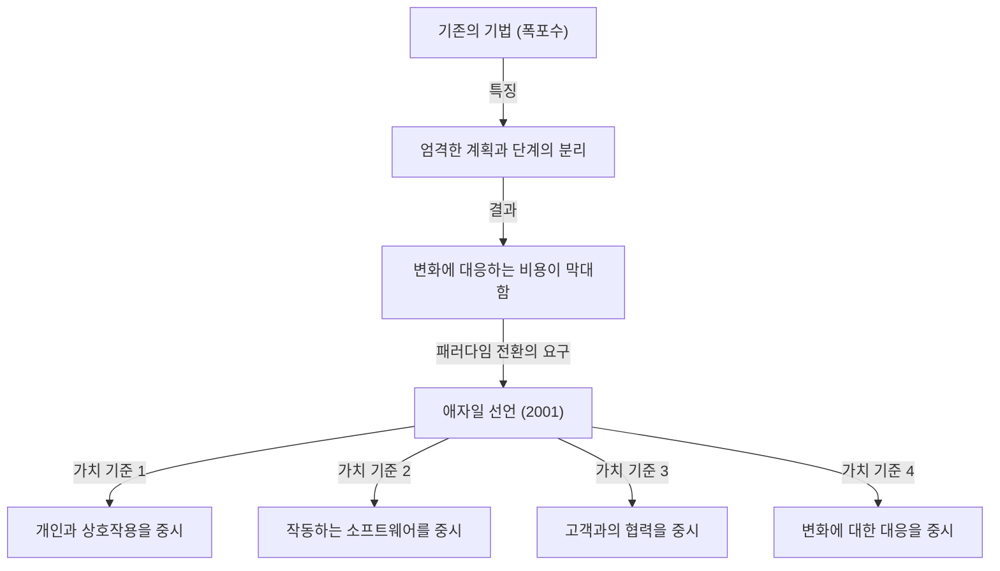
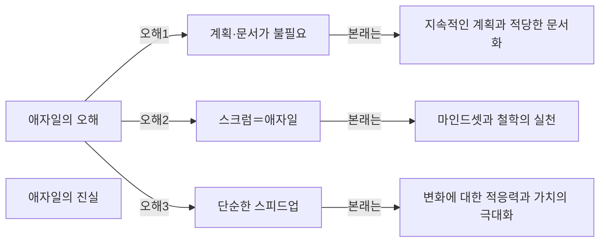

## 1. 서론: 현대 소프트웨어 개발의 주춧돌이 된 '애자일 선언'

현재 IT 업계나 소프트웨어 개발 현장에서 '애자일(Agile)'이라는 단어를 듣지 않는 날이 없습니다. 스크럼, 칸반, 익스트림 프로그래밍(XP) 등 다양한 기법이 일상적으로 도입되어, 많은 기업이 '더 빠르고, 더 유연하게' 가치를 전달하기 위한 접근법으로 애자일을 채택하고 있습니다. 하지만 이 '애자일'이라는 개념이 어떻게 생겨났고, 어떤 사상(철학)을 바탕으로 정의되었는지 깊이 이해하고 있는 사람은 의외로 적을지도 모릅니다.

2001년 2월 11일부터 13일까지, 미국 유타주 스노우버드라는 스키 리조트에 17명의 소프트웨어 개발 전문가들이 모였습니다. 이들은 당시 소프트웨어 개발이 안고 있던 심각한 문제에 대한 해결책을 모색했고, 논의 끝에 하나의 선언을 정리했습니다. 그것이 바로 '애자일 소프트웨어 개발 선언(Agile Manifesto)'입니다.

본 기사에서는 이 애자일 선언이 탄생하게 된 역사적 배경, 당시 개발 현장이 직면했던 '중량급 프로세스'에 대한 위기감, 17명의 기안자들이 공유했던 가치관, 그리고 현대의 개발 조직이 이 선언에서 진정으로 배워야 할 철학에 대해 철저하게 파헤쳐 봅니다.

## 2. 역사적 배경: 소프트웨어 위기의 시대와 '중량급 프로세스'

애자일 선언의 이면을 이해하기 위해서는 1990년대의 소프트웨어 개발이 어떤 상황이었는지 알아야 합니다. 당시 소프트웨어 시스템의 규모는 급속히 확대되고, 점점 더 복잡해지고 있었습니다. 이에 따라 '소프트웨어 위기'라 불리는 상황이 표면화되었습니다. 프로젝트 예산 초과, 납기 지연, 혹은 완성된 시스템을 전혀 사용할 수 없는 실패가 빈번하게 발생했던 것입니다.

이 위기에 대처하기 위해 업계는 '더 엄밀한 계획'과 '상세한 문서', 그리고 '엄격한 프로세스 관리'를 통해 문제를 통제하려고 했습니다. 이것이 일반적으로 '폭포수 모델'로 대표되는 <strong>중량급 프로세스(Heavyweight Processes)</strong>입니다.

중량급 프로세스의 특징은 개발의 각 단계(요구사항 정의, 설계, 구현, 테스트, 유지보수)를 명확히 구분하고, 이전 단계가 완전히 끝나야만 다음 단계로 넘어간다는 점에 있습니다. 또한 각 단계 간의 정보 전달은 방대한 양의 문서를 통해 이루어졌습니다.

하지만 이 접근법은 비즈니스 환경의 급격한 변화나 개발 도중에 밝혀지는 새로운 요구사항에 대응하기가 매우 어려웠습니다. '한 번 정한 계획은 절대적이다'라는 전제 하에서는 고객의 진짜 니즈가 바뀌어버려도 계획대로 쓸모없는 시스템을 계속 만들 수밖에 없었습니다. 개발자들은 관료적인 프로세스와 끝없는 문서 작성에 시달렸고, 진정으로 가치 있는 '작동하는 소프트웨어'를 만들어내는 기쁨에 굶주려 있었습니다.

## 3. 스노우버드 회의: 17명의 반역자들

이러한 상황에 이의를 제기하고, 더 가볍고 유연한 개발 기법을 모색하려는 움직임이 1990년대 후반부터 곳곳에서 일어나기 시작했습니다. 익스트림 프로그래밍(XP)의 켄트 벡, 스크럼의 켄 슈와버와 제프 서덜랜드, 크리스탈 기법의 앨리스터 코오번 등 독자적인 접근법으로 성공을 거두고 있던 실천가들입니다.

이들은 각기 다른 기법을 제창하고 있었지만, '프로세스나 도구보다 사람과 그 상호작용을 중시한다'는 공통된 신념을 가지고 있었습니다. 2001년 2월, 로버트 C. 마틴(엉클 밥) 등의 호소로 경량급 프로세스(Lightweight Processes)의 대표적인 제창자 17명이 스노우버드에 집결했습니다.

이들은 자신들의 기법에 공통되는 핵심적인 가치관을 추출하고, 업계 전체에 새로운 방향성을 제시하기 위한 논의를 진행했습니다. 당초 그들은 자신들의 기법을 '경량급(Lightweight)'이라 불렀지만, 이 단어는 '알맹이가 없다', '가볍다'는 부정적인 뉘앙스를 가지기 때문에 더 적합한 단어를 찾았습니다. 그 결과 선택된 것이 '기민한', '민첩한', '유연한'이라는 의미를 가진 **'애자일(Agile)'**이라는 단어였습니다.

## 4. 애자일 소프트웨어 개발 선언: 4가지 가치 기준

스노우버드에서의 논의의 결정체로 탄생한 것이, 불과 수십 글자의 간결한 문장으로 구성된 '애자일 소프트웨어 개발 선언'입니다. 이 선언은 다음의 4가지 가치 기준으로 이루어져 있습니다.

> 우리는 소프트웨어 개발을 직접 실천하고, 또 다른 사람의 실천을 도와주면서 더 나은 소프트웨어 개발 방법을 찾아가고 있다. 이 작업을 통해 우리는 다음의 가치에 도달하게 되었다.
> 
> - **프로세스와 도구보다 개인과 상호작용을**
> - **포괄적인 문서보다 작동하는 소프트웨어를**
> - **계약 협상보다 고객과의 협력을**
> - **계획을 따르기보다 변화에 대응하기를**
> 
> 가치 있게 여긴다. 즉, 왼쪽에 있는 항목에도 가치가 있음을 인정하면서도, 우리는 오른쪽에 있는 항목에 더 높은 가치를 둔다.

이 선언의 탁월한 점은 왼쪽의 항목(프로세스, 문서, 계약 협상, 계획)을 전면 부정하는 것은 아니라는 점입니다. '왼쪽에 있는 항목에도 가치가 있음을 인정하면서도', 그럼에도 '우리는 오른쪽에 있는 항목에 더 높은 가치를 둔다'는 절묘한 균형 감각이야말로, 이 선언이 단순한 반역의 문서가 아니라 진정으로 실용적인 철학으로서 오늘날까지 계속 지지받는 이유입니다.

### 가치 기준 깊이 파보기

1. **프로세스와 도구보다 개인과 상호작용을 (Individuals and interactions over processes and tools)**
   아무리 뛰어난 프로세스나 최신 도구를 도입해도, 그것을 사용하는 것은 사람입니다. 소통의 장벽이나 신뢰 관계의 결여가 있다면 프로젝트는 실패합니다. 팀 구성원 간의 직접적인 대화, 문제 해결을 위한 협력, 그리고 개인의 기술과 동기를 최대한 이끌어내는 환경 조성이 프로세스를 엄격하게 지키는 것보다 중요합니다.

2. **포괄적인 문서보다 작동하는 소프트웨어를 (Working software over comprehensive documentation)**
   문서는 필요하지만, 그 자체가 고객에게 가치를 제공하는 것은 아닙니다. 수백 페이지의 사양서를 작성하는 데 시간을 쏟기보다는, 실제로 작동하는 소프트웨어를 빨리 제공하고 그것을 만져봄으로써 얻는 피드백이 훨씬 가치 있습니다. '작동하는 소프트웨어'야말로 진척을 보여주는 가장 신뢰할 수 있는 지표입니다.

3. **계약 협상보다 고객과의 협력을 (Customer collaboration over contract negotiation)**
   개발 측과 고객 측이 '계약에 적혀 있다/없다'로 대립하는 것이 아니라, 같은 팀으로서 협력하는 관계를 구축하는 것이 요구됩니다. 고객 자신도 개발이 시작될 시점에는 자신이 진정으로 원하는 것을 완전히 이해하지 못하는 경우가 많습니다. 개발을 통해 지속적으로 협력하고, 함께 최적의 솔루션을 탐색하는 것이 성공의 지름길입니다.

4. **계획을 따르기보다 변화에 대응하기를 (Responding to change over following a plan)**
   비즈니스 환경이나 기술의 변화가 극심한 현대에, 초기의 계획을 고집하는 것은 리스크일 뿐입니다. 계획은 어디까지나 현 상황에서의 가설이며, 새로운 지식을 얻거나 상황이 변했을 경우에는 주저 없이 계획을 수정할 수 있는 유연성이 필요합니다. 변화를 '계획을 어지럽히는 적'으로 배제하는 것이 아니라, '경쟁 우위를 창출할 기회'로 환영하는 자세가 애자일의 진수입니다.

## 5. 12가지 원칙이 의미하는 것

4가지 가치 기준을 보다 구체적인 행동 지침으로 구체화한 것이 '애자일 선언 이면의 원칙(12가지 원칙)'입니다. 이것들은 애자일 조직이 어떻게 행동해야 하는지를 정의하고 있습니다.

1. **우리의 최우선 순위는 가치 있는 소프트웨어를 일찍 그리고 지속적으로 전달하여 고객을 만족시키는 것이다.**
2. **비록 개발의 후반부일지라도 요구사항 변경을 환영하라. 애자일 프로세스는 변화를 활용해 고객의 경쟁력을 높여준다.**
3. **작동하는 소프트웨어를 짧게는 2주에서 길게는 2개월의 간격으로 자주 전달하되, 더 짧은 주기를 선호하라.**
4. **비즈니스 담당자와 개발자는 프로젝트 전체 기간 동안 매일 함께 일해야 한다.**
5. **동기가 부여된 개인들로 프로젝트를 구성하라. 그들이 필요로 하는 환경과 지원을 제공하고, 일이 완수될 것을 믿어라.**
6. **개발 팀에, 그리고 개발 팀 내에 정보를 전달하는 가장 효율적이고 효과적인 방법은 대면 대화이다.**
7. **작동하는 소프트웨어가 진척의 주된 척도이다.**
8. **애자일 프로세스는 지속 가능한 개발을 장려한다. 스폰서, 개발자, 사용자는 일정한 속도를 계속 유지할 수 있어야 한다.**
9. **기술적 탁월성과 좋은 설계에 대한 지속적인 관심이 기민함을 높인다.**
10. **단순성(안 해도 될 일은 최대한 안 하는 기술)은 필수적이다.**
11. **최고의 아키텍처, 요구사항, 설계는 자기 조직적인 팀에서 나온다.**
12. **팀은 정기적으로 어떻게 하면 더 효과적이 될지 숙고한 다음, 그에 따라 팀의 행동을 조율하고 조정한다.**

이러한 원칙들은 기술적인 측면(CI/CD, 테스트 주도 개발, 리팩터링 등으로의 연결)과 인간적인 측면(신뢰, 지속 가능성, 자기 조직화)을 모두 포괄하고 있습니다. 특히 8번째 원칙 '지속 가능한 개발'은 당시 많은 개발자가 빠져 있던 '데스마치(끝없는 장시간 노동)'에서의 탈피를 강하게 의식한 것입니다.

## 6. 현대의 애자일에 대한 오해와 진실

애자일 선언으로부터 20년 이상이 지나, '애자일'이라는 단어는 완전히 주류가 되었습니다. 하지만 그 보급과 맞바꾸어 애자일의 본질을 잃고 형해화되어 버리는 사례(이른바 '이름만 애자일'이나 '폭포수 애자일')도 끊이지 않고 있습니다.

흔한 오해로는 다음과 같은 것들을 들 수 있습니다.
- **"애자일이라면 계획은 필요 없고, 문서도 작성하지 않아도 된다"**: 이는 앞서 언급했듯이 큰 오해입니다. 애자일은 계획을 세우지만, 그것을 고정하지 않고 지속적으로 재검토할 뿐입니다. 문서도 필요한 것은 작성하지만, 과도한 문서화를 피할 뿐입니다.
- **"애자일 = 스크럼이다"**: 스크럼은 애자일을 실천하기 위한 대표적인 프레임워크 중 하나지만, 그것이 전부는 아닙니다. 스크럼의 의식(데일리 스크럼이나 스프린트 리뷰)을 소화하는 것만이 목적이 되어버리면, 애자일 선언의 '프로세스와 도구보다 개인과 상호작용을'이라는 가치 기준에 반하게 됩니다.
- **"빠르게 만드는 것이 애자일의 목적이다"**: 애자일은 확실히 리드 타임을 단축하지만, 단순한 스피드업 기법은 아닙니다. '올바른 것을 올바른 타이밍에 제공하는' 것을 위한 적응력(Adaptability)이야말로 진정한 목적입니다.

## 7. 조직 문화에 미치는 깊은 영향과 미래에 대한 전망

애자일 선언은 단순한 소프트웨어 개발 기법을 넘어, 조직의 이상적인 모습이나 매니지먼트 기법에까지 패러다임 전환을 가져왔습니다. '자기 조직화된 팀', '심리적 안전감', '서번트 리더십' 등 현대 조직론에서의 중요한 키워드들은 모두 애자일 철학과 깊이 연결되어 있습니다.

DX(디지털 트랜스포메이션)가 외쳐지는 현재, IT 기업뿐만 아니라 금융, 제조, 소매 등 모든 산업에서 애자일한 조직 문화로의 변혁이 요구되고 있습니다. 변화가 극심한 VUCA 시대에는 '계획대로 실행하는 능력'보다 '변화를 감지하고 빠르게 방향을 전환하는 능력'이 훨씬 중요해졌기 때문입니다.

애자일 선언을 기안한 17명의 선구자들은 미래의 소프트웨어 개발이 어떠해야 하는지를 진지하게 논의하고, 인간다움을 되찾기 위한 철학을 자아냈습니다. 우리는 다시 한번 기법이나 프레임워크라는 표면적인 껍데기를 깨고, 애자일 선언의 원점인 '가치 기준'과 '원칙'으로 돌아갈 필요가 있습니다.

## 8. 요약

'애자일 소프트웨어 개발 선언'의 이면에는 경직된 중량급 프로세스에 고통받는 현장 엔지니어들의 영혼의 외침과, 보다 인간적이고 창조적인 개발을 되찾으려는 열정이 있었습니다. 그들이 남긴 4가지 가치와 12가지 원칙은 기술이 아무리 진화하더라도 빛바래지 않는, 시대를 초월한 보편적인 진리를 담고 있습니다.

당신이 만약 일상적인 개발 업무에서 프로세스에 얽매이고, 문서에 쫓기며, 본래의 목적을 잃어버릴 것 같을 때는 꼭 이 '애자일 선언'을 다시 읽어보시기 바랍니다. 거기에는 우리가 왜 소프트웨어를 만드는지, 그리고 팀으로서 어떻게 협력해야 하는지에 대한 가장 중요하고 본질적인 해답이 적혀 있을 것입니다.
