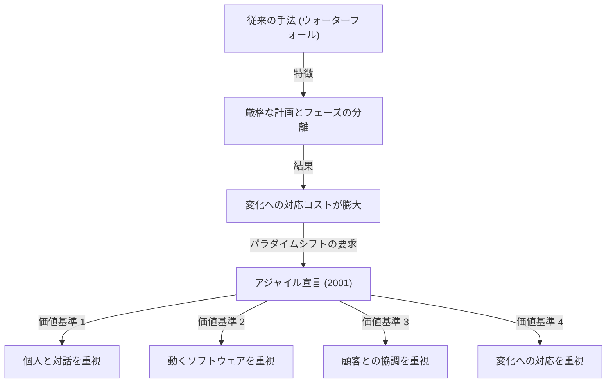
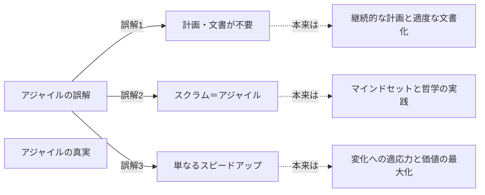

## 1. はじめに：現代ソフトウェア開発の礎となった「アジャイル宣言」

現在、IT業界やソフトウェア開発の現場で「アジャイル（Agile）」という言葉を聞かない日はありません。スクラム、カンバン、エクストリーム・プログラミング（XP）など、様々な手法が日常的に導入され、多くの企業が「より速く、より柔軟に」価値を届けるためのアプローチとしてアジャイルを採用しています。しかし、この「アジャイル」という概念がどのようにして生まれ、どのような思想（フィロソフィー）に基づいて定義されたのかを深く理解している人は意外と少ないかもしれません。

2001年2月11日から13日にかけて、アメリカ・ユタ州のスノーバードというスキーリゾートに、17人のソフトウェア開発の専門家たちが集まりました。彼らは、当時のソフトウェア開発が抱えていた深刻な問題に対する解決策を模索し、議論の末に一つの宣言をまとめ上げました。それが「アジャイルソフトウェア開発宣言（Agile Manifesto）」です。

本記事では、このアジャイル宣言が生まれるに至った歴史的背景、当時の開発現場が直面していた「重量級プロセス」への危機感、17名の起草者たちが共有していた価値観、そして現代の開発組織がこの宣言から真に学ぶべき哲学について、徹底的に深掘りしていきます。

## 2. 歴史的背景：ソフトウェア危機の時代と「重量級プロセス」

アジャイル宣言の裏側を理解するためには、1990年代のソフトウェア開発がどのような状況にあったのかを知る必要があります。当時、ソフトウェアシステムの規模は急速に拡大し、複雑化の一途を辿っていました。これに伴い、「ソフトウェア危機」と呼ばれる状況が顕在化していました。プロジェクトの予算超過、納期の遅延、あるいは完成したシステムが全く使えないといった失敗が頻発していたのです。

この危機に対処するため、業界は「より厳密な計画」と「詳細なドキュメント」、そして「厳格なプロセス管理」によって問題をコントロールしようとしました。これが、一般に「ウォーターフォール・モデル」に代表される**重量級プロセス（Heavyweight Processes）**です。

重量級プロセスの特徴は、開発の各フェーズ（要件定義、設計、実装、テスト、保守）を明確に区切り、前のフェーズが完全に終了してから次のフェーズに進むという点にあります。また、各フェーズ間での情報伝達は、膨大な量のドキュメントを介して行われました。

しかし、このアプローチは、ビジネス環境の急速な変化や、開発途中で明らかになる新たな要件に対応することが極めて困難でした。「一度決めた計画は絶対である」という前提のもとでは、顧客の本当のニーズが変わってしまっても、計画通りに役に立たないシステムを作り続けるしかありませんでした。開発者たちは、官僚的なプロセスと終わりのないドキュメント作成に忙殺され、本当に価値のある「動くソフトウェア」を生み出す喜びに飢えていました。

## 3. スノーバード会議：17人の反逆者たち

こうした状況に異を唱え、より軽量で柔軟な開発手法を模索する動きが、1990年代後半から各地で生まれ始めました。エクストリーム・プログラミング（XP）のケント・ベック、スクラムのケン・シュエイバーやジェフ・サザーランド、クリスタル手法のアリスター・コバーンなど、独自のアプローチで成功を収めていた実践者たちです。

彼らはそれぞれ異なる手法を提唱していましたが、「プロセスやツールよりも、人間とその相互作用を重視する」という共通の信念を持っていました。2001年2月、ロバート・C・マーティン（アンクル・ボブ）らの呼びかけにより、軽量級プロセス（Lightweight Processes）の代表的な提唱者17名がスノーバードに集結しました。

彼らは、自分たちの手法に共通する核心的な価値観を抽出し、業界全体に新たな方向性を提示するための議論を行いました。当初、彼らは自らの手法を「軽量級（Lightweight）」と呼んでいましたが、この言葉は「中身がない」「軽い」という否定的なニュアンスを持つため、より適した言葉を探しました。その結果選ばれたのが、「機敏な」「素早い」「柔軟な」という意味を持つ**「アジャイル（Agile）」**という言葉でした。

## 4. アジャイルソフトウェア開発宣言：4つの価値基準

スノーバードでの議論の結晶として生み出されたのが、わずか数十文字の簡潔な文章で構成された「アジャイルソフトウェア開発宣言」です。この宣言は、以下の4つの価値基準から成り立っています。

> 私たちは、ソフトウェア開発の実践、あるいは実践を手助けをする活動を通じて、よりよい開発方法を見つけだそうとしている。この活動を通して、私たちは以下の価値に至った。
> 
> - **プロセスやツールよりも個人と対話を**
> - **包括的なドキュメントよりも動くソフトウェアを**
> - **契約交渉よりも顧客との協調を**
> - **計画に従うことよりも変化への対応を**
> 
> 価値とする。すなわち、左記の事柄に価値があることを認めながらも、私たちは右記の事柄により価値をおく。

この宣言の卓越した点は、左側の事柄（プロセス、ドキュメント、契約交渉、計画）を全否定しているわけではないという点です。「左記の事柄に価値があることを認めながらも」、それでも「右記の事柄により価値をおく」という絶妙なバランス感覚こそが、この宣言が単なる反逆の書ではなく、真に実用的な哲学として今日まで支持され続けている理由です。

### 価値基準の深掘り

1. **プロセスやツールよりも個人と対話を (Individuals and interactions over processes and tools)**
   どれほど優れたプロセスや最新のツールを導入しても、それを使うのは人間です。コミュニケーションの壁や信頼関係の欠如があれば、プロジェクトは失敗します。チームメンバー間の直接的な対話、問題解決のための協力、そして個人のスキルとモチベーションを最大限に引き出す環境づくりが、プロセスを厳格に守ることよりも重要です。

2. **包括的なドキュメントよりも動くソフトウェアを (Working software over comprehensive documentation)**
   ドキュメントは必要ですが、それ自体が顧客に価値を提供するわけではありません。何百ページもの仕様書を書くことに時間を費やすよりも、実際に動くソフトウェアを早く提供し、それを触ってもらうことで得られるフィードバックのほうが遥かに価値があります。「動くソフトウェア」こそが、進捗の最も信頼できる指標なのです。

3. **契約交渉よりも顧客との協調を (Customer collaboration over contract negotiation)**
   開発側と顧客側が「契約に書かれている・いない」で対立するのではなく、同じチームとして協力し合う関係を築くことが求められます。顧客自身も、開発が始まる時点では自分が本当に欲しいものを完全に理解していないことがよくあります。開発を通じて継続的に協調し、共に最適なソリューションを探索することが成功への近道です。

4. **計画に従うことよりも変化への対応を (Responding to change over following a plan)**
   ビジネス環境や技術の変化が激しい現代において、初期の計画に固執することはリスクでしかありません。計画はあくまで現状における仮説であり、新たな知見が得られたり状況が変わったりした場合には、躊躇なく計画を修正できる柔軟性が必要です。変化を「計画を乱す敵」として排除するのではなく、「競争優位を生み出すチャンス」として歓迎する姿勢がアジャイルの真髄です。

## 5. 12の原則が意味するもの

4つの価値基準をより具体的な行動指針として落とし込んだのが、「アジャイル宣言の背後にある原則（12の原則）」です。これらは、アジャイルな組織がどのように振る舞うべきかを定義しています。

1. **顧客満足を最優先し、価値のあるソフトウェアを早く継続的に提供します。**
2. **要求の変更はたとえ開発の後期であっても歓迎します。変化を味方につけることによって、お客様の競争力を引き上げます。**
3. **動くソフトウェアを、2-3週間から2-3ヶ月というできるだけ短い時間間隔でリリースします。**
4. **ビジネス側の人と開発者は、プロジェクトを通して日々一緒に働かなければなりません。**
5. **意欲に満ちた人々を集めてプロジェクトを構成します。環境と支援を与え仕事が無事終わるまで彼らを信頼します。**
6. **情報を伝えるもっとも効率的で効果的な方法はフェイス・ツー・フェイスで話をすることです。**
7. **動くソフトウェアこそが進捗の最も重要な尺度です。**
8. **アジャイル･プロセスは持続可能な開発を促進します。一定のペースを継続的に維持できるようにしなければなりません。**
9. **技術的卓越性と優れた設計に対する不断の注意が機敏さを高めます。**
10. **シンプルさ（ムダなく作れる量を最大限にすること）が本質です。**
11. **最良のアーキテクチャ・要求・設計は、自己組織的なチームから生み出されます。**
12. **チームがもっと効率を高めることができるかを定期的に振り返り、それに基づいて自分たちのやり方を最適に調整します。**

これらの原則は、技術的な側面（CI/CD、テスト駆動開発、リファクタリングなどへの繋がり）と、人間的な側面（信頼、持続可能性、自己組織化）の両方をカバーしています。特に第8の原則「持続可能な開発」は、当時多くの開発者が陥っていた「デスマーチ（終わりのない長時間労働）」からの脱却を強く意識したものです。

## 6. 現代におけるアジャイルの誤解と真実

アジャイル宣言から20年以上が経過し、「アジャイル」という言葉は完全にメインストリームとなりました。しかし、その普及と引き換えに、アジャイルの本質が失われ、形骸化してしまうケース（いわゆる「名前だけアジャイル」や「ウォーターフォール・アジャイル」）も後を絶ちません。

よくある誤解として、以下のようなものが挙げられます。
- **「アジャイルなら計画はいらない、ドキュメントも書かなくていい」**：これは前述の通り、大きな誤解です。アジャイルは計画を立てますが、それを固定せず継続的に見直すだけです。ドキュメントも必要なものは作成しますが、過剰な文書化を避けるだけです。
- **「アジャイル＝スクラムである」**：スクラムはアジャイルを実践するための代表的なフレームワークの一つですが、それが全てではありません。スクラムのセレモニー（デイリースクラムやスプリントレビュー）をこなすことだけが目的化してしまうと、アジャイル宣言の「プロセスやツールよりも個人と対話を」という価値基準に反することになります。
- **「速く作ることがアジャイルの目的である」**：アジャイルは確かにリードタイムを短縮しますが、単なるスピードアップの手法ではありません。「正しいものを、正しいタイミングで提供する」ための適応力（Adaptability）こそが真の目的です。

## 7. 組織カルチャーへの深い影響と未来への展望

アジャイル宣言は、単なるソフトウェア開発の手法を超えて、組織のあり方やマネジメントの手法にまでパラダイムシフトをもたらしました。「自己組織化されたチーム」「心理的安全性」「サーバントリーダーシップ」といった現代の組織論における重要なキーワードは、すべてアジャイルの哲学と深く結びついています。

DX（デジタルトランスフォーメーション）が叫ばれる現在、IT企業だけでなく、金融、製造、小売などあらゆる産業において、アジャイルな組織文化への変革が求められています。変化の激しいVUCAの時代において、「計画通りに実行する能力」よりも「変化を察知し、素早く方向転換する能力」のほうが遥かに重要になっているからです。

アジャイル宣言を起草した17人の先駆者たちは、未来のソフトウェア開発がどうあるべきかを真剣に議論し、人間らしさを取り戻すための哲学を紡ぎ出しました。私たちは今一度、手法やフレームワークという表面的な殻を打ち破り、アジャイル宣言の原点である「価値基準」と「原則」に立ち返る必要があります。

## 8. まとめ

「アジャイルソフトウェア開発宣言」の裏側には、硬直化した重量級プロセスに苦しむ現場のエンジニアたちの魂の叫びと、より人間的で創造的な開発を取り戻そうとする情熱がありました。彼らが残した4つの価値と12の原則は、テクノロジーがどれほど進化しようとも色褪せることのない、時代を超えた普遍的な真理を持っています。

あなたがもし、日々の開発業務でプロセスに縛られ、ドキュメントに追われ、本来の目的を見失いそうになったときは、ぜひこの「アジャイル宣言」を読み返してみてください。そこには、私たちがなぜソフトウェアを作るのか、そしてどのようにチームとして協力すべきかという、最も重要で本質的な答えが書かれているはずです。
