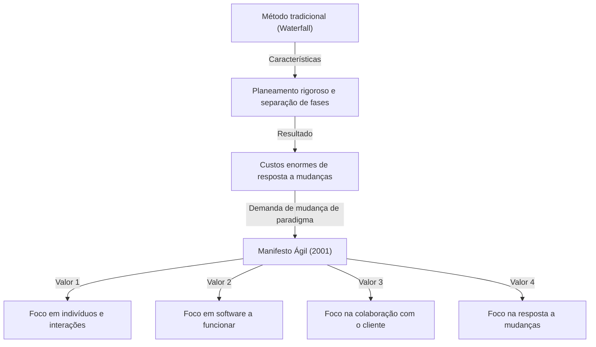
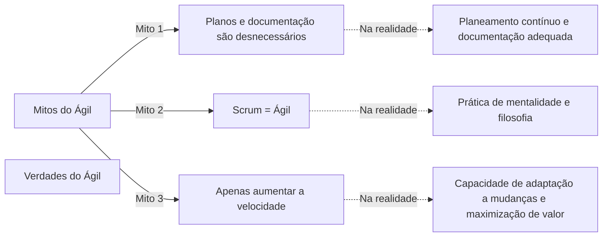

## 1. Introdução: O "Manifesto Ágil" que se tornou a base do desenvolvimento moderno de software

Hoje em dia, não passa um dia sem ouvirmos a palavra "Ágil" (Agile) na indústria de TI e no ambiente de desenvolvimento de software. Várias metodologias, como Scrum, Kanban e eXtreme Programming (XP), são introduzidas rotineiramente, e muitas empresas adotam o Ágil como uma abordagem para entregar valor "mais rápido e com mais flexibilidade". No entanto, o número de pessoas que compreendem profundamente como o conceito "Ágil" nasceu e qual filosofia (philosophy) o baseia é surpreendentemente pequeno.

De 11 a 13 de fevereiro de 2001, 17 especialistas em desenvolvimento de software reuniram-se num resort de esqui chamado Snowbird, em Utah, nos EUA. Eles procuravam soluções para os graves problemas que o desenvolvimento de software enfrentava naquela época e, após muito debate, compilaram um manifesto. Esse é o "Manifesto para Desenvolvimento Ágil de Software" (Agile Manifesto).

Neste artigo, aprofundaremos o contexto histórico que levou à criação deste Manifesto Ágil, a sensação de crise em relação aos "processos pesados" que o ambiente de desenvolvimento enfrentava na época, os valores partilhados pelos 17 autores e a verdadeira filosofia que as organizações modernas de desenvolvimento devem aprender com este manifesto.

## 2. Contexto Histórico: A Era da Crise do Software e os "Processos Pesados"

Para compreender os bastidores do Manifesto Ágil, é necessário saber qual era a situação do desenvolvimento de software nos anos 90. Naquela época, a escala dos sistemas de software estava a expandir-se rapidamente e a tornar-se cada vez mais complexa. Com isso, uma situação chamada "crise do software" tornou-se evidente. Eram frequentes os fracassos como o excesso de orçamento dos projetos, atrasos nas entregas ou sistemas concluídos que eram completamente inutilizáveis.

Para lidar com esta crise, a indústria tentou controlar os problemas através de "planeamento mais rigoroso", "documentação detalhada" e "gestão de processos rigorosa". Isto é o que é geralmente conhecido como **Processos Pesados** (Heavyweight Processes), representados pelo "Modelo Waterfall".

A característica dos processos pesados é que cada fase do desenvolvimento (definição de requisitos, design, implementação, testes, manutenção) é claramente dividida, e só se avança para a fase seguinte quando a anterior estiver completamente concluída. Além disso, a comunicação entre cada fase era feita através de uma enorme quantidade de documentação.

No entanto, esta abordagem tinha imensa dificuldade em responder às rápidas mudanças no ambiente de negócios e aos novos requisitos que surgiam a meio do desenvolvimento. Sob a premissa de que "o plano, uma vez decidido, é absoluto", mesmo que as reais necessidades do cliente mudassem, não havia outra opção senão continuar a construir um sistema inútil de acordo com o plano. Os programadores estavam sobrecarregados com processos burocráticos e com a criação interminável de documentação, ansiosos pela alegria de criar "software a funcionar" que fosse realmente valioso.

## 3. A Conferência de Snowbird: Os 17 Rebeldes

No final dos anos 90, começaram a surgir em vários locais movimentos que se opunham a esta situação e procuravam metodologias de desenvolvimento mais leves e flexíveis. Eram profissionais que tinham alcançado o sucesso com as suas próprias abordagens, como Kent Beck da eXtreme Programming (XP), Ken Schwaber e Jeff Sutherland do Scrum, e Alistair Cockburn da metodologia Crystal.

Embora cada um deles propusesse metodologias diferentes, partilhavam a crença comum de "valorizar mais as pessoas e as suas interações do que processos e ferramentas". Em fevereiro de 2001, a convite de Robert C. Martin (Uncle Bob) e outros, 17 dos principais proponentes dos Processos Leves (Lightweight Processes) reuniram-se em Snowbird.

Eles discutiram para extrair os valores fundamentais comuns às suas metodologias e apresentar uma nova direção para toda a indústria. Inicialmente, chamavam à sua metodologia "Leve" (Lightweight), mas como esta palavra tem uma conotação negativa de "sem conteúdo" ou "insignificante", procuraram um termo mais adequado. A palavra escolhida foi **"Ágil"** (Agile), que significa "ágil", "rápido" e "flexível".

## 4. Manifesto para Desenvolvimento Ágil de Software: 4 Valores

O resultado das discussões em Snowbird foi o "Manifesto para Desenvolvimento Ágil de Software", composto por um texto conciso de apenas algumas dezenas de palavras. Este manifesto baseia-se nos seguintes 4 valores.

> Estamos a descobrir maneiras melhores de desenvolver software, fazendo-o nós mesmos e ajudando outros a fazê-lo. Através deste trabalho, passamos a valorizar:
> 
> - **Indivíduos e interações mais que processos e ferramentas**
> - **Software em funcionamento mais que documentação abrangente**
> - **Colaboração com o cliente mais que negociação de contratos**
> - **Responder a mudanças mais que seguir um plano**
> 
> Ou seja, mesmo havendo valor nos itens à direita, valorizamos mais os itens à esquerda.

O que é notável neste manifesto é que ele não nega completamente os itens da direita (processos, documentação, negociação de contratos, planos). Este equilíbrio perfeito, onde "mesmo havendo valor nos itens à direita", ainda "valorizamos mais os itens à esquerda", é a razão pela qual este manifesto continua a ser apoiado até hoje como uma filosofia verdadeiramente prática, e não apenas como um documento de rebelião.

### Análise aprofundada dos Valores

1. **Indivíduos e interações mais que processos e ferramentas (Individuals and interactions over processes and tools)**
   Não importa o quão bom seja o processo ou as ferramentas mais recentes que introduzir, são as pessoas que os utilizam. Se houver barreiras de comunicação ou falta de confiança, o projeto irá falhar. O diálogo direto entre os membros da equipa, a colaboração na resolução de problemas e a criação de um ambiente que maximize as competências e a motivação individuais são mais importantes do que seguir processos rigorosamente.

2. **Software em funcionamento mais que documentação abrangente (Working software over comprehensive documentation)**
   A documentação é necessária, mas não fornece valor ao cliente por si só. É muito mais valioso entregar rapidamente um software que realmente funcione e obter feedback através da sua utilização, do que gastar tempo a escrever centenas de páginas de especificações. O "software em funcionamento" é o indicador de progresso mais fiável.

3. **Colaboração com o cliente mais que negociação de contratos (Customer collaboration over contract negotiation)**
   A equipa de desenvolvimento e o cliente não devem entrar em conflito sobre o que está "escrito ou não no contrato", mas sim construir uma relação cooperativa como a mesma equipa. É frequente os próprios clientes não compreenderem totalmente o que realmente querem no início do desenvolvimento. Colaborar continuamente ao longo do desenvolvimento e explorar juntos as melhores soluções é o atalho para o sucesso.

4. **Responder a mudanças mais que seguir um plano (Responding to change over following a plan)**
   Numa época em que o ambiente de negócios e a tecnologia mudam rapidamente, agarrar-se ao plano inicial é apenas um risco. Os planos são apenas hipóteses baseadas na situação atual; quando surgem novos conhecimentos ou a situação muda, é necessária a flexibilidade para rever o plano sem hesitar. A essência do Ágil é receber a mudança como uma "oportunidade para criar vantagem competitiva", em vez de a rejeitar como um "inimigo que perturba o plano".

## 5. O que os 12 Princípios Significam

"Os Princípios por trás do Manifesto Ágil" (12 princípios) traduzem os 4 valores em diretrizes comportamentais mais concretas. Eles definem como uma organização ágil se deve comportar.

1. **A nossa maior prioridade é satisfazer o cliente, através da entrega adiantada e contínua de software de valor.**
2. **Aceitar mudanças de requisitos, mesmo no fim do desenvolvimento. Processos ágeis adequam-se a mudanças, para que o cliente possa tirar vantagens competitivas.**
3. **Entregar software a funcionar com frequência, na escala de semanas até meses, com preferência aos períodos mais curtos.**
4. **Pessoas de negócio e programadores devem trabalhar em conjunto e diariamente, durante todo o curso do projeto.**
5. **Construir projetos em torno de indivíduos motivados. Dando-lhes o ambiente e o suporte de que precisam, e confiando neles para fazer o trabalho.**
6. **O método mais eficiente e eficaz de transmitir informações para e entre uma equipa de desenvolvimento é através de conversa cara a cara.**
7. **Software a funcionar é a medida primária de progresso.**
8. **Os processos ágeis promovem o desenvolvimento sustentável. Os patrocinadores, programadores e utilizadores devem ser capazes de manter um ritmo constante indefinidamente.**
9. **Contínua atenção à excelência técnica e bom design aumenta a agilidade.**
10. **Simplicidade (a arte de maximizar a quantidade de trabalho que não precisou ser feito) é essencial.**
11. **As melhores arquiteturas, requisitos e designs emergem de equipas auto-organizáveis.**
12. **Em intervalos regulares, a equipa reflete sobre como se tornar mais eficaz, então afina e ajusta o seu comportamento de acordo.**

Estes princípios cobrem tanto os aspetos técnicos (ligações à CI/CD, Test-Driven Development, refatorização, etc.) como os aspetos humanos (confiança, sustentabilidade, auto-organização). Em particular, o 8º princípio, "desenvolvimento sustentável", teve muito em conta a fuga da "marcha da morte (longas horas de trabalho sem fim)" na qual muitos programadores caíam na época.

## 6. Mitos e Verdades do Ágil na Atualidade

Passaram-se mais de 20 anos desde o Manifesto Ágil, e a palavra "Ágil" tornou-se totalmente mainstream. No entanto, em troca dessa disseminação, os casos em que a essência do Ágil se perde e se torna uma mera formalidade (os chamados "Ágil só de nome" ou "Waterfall-Ágil") continuam a ocorrer.

Entre os mal-entendidos comuns estão:
- **"Se é Ágil, não precisamos de planos, nem de escrever documentação"**: Como mencionado anteriormente, isto é um grande mal-entendido. O Ágil faz planos, mas simplesmente não os fixa, revendo-os continuamente. A documentação necessária também é criada, evitando apenas o excesso de documentação.
- **"Ágil = Scrum"**: O Scrum é um dos frameworks representativos para praticar o Ágil, mas não é tudo. Se o simples cumprimento das cerimónias do Scrum (Daily Scrum e Sprint Review) se tornar um objetivo, isso irá contra o valor do Manifesto Ágil: "Indivíduos e interações mais que processos e ferramentas".
- **"O objetivo do Ágil é construir mais rápido"**: O Ágil certamente encurta o tempo de espera (lead time), mas não é um método apenas para acelerar. O verdadeiro objetivo é a capacidade de adaptação (Adaptability) para entregar "a coisa certa, no momento certo".

## 7. Impacto Profundo na Cultura Organizacional e Perspetivas Futuras

O Manifesto Ágil não é apenas um método de desenvolvimento de software; trouxe uma mudança de paradigma na forma como as organizações operam e são geridas. Palavras-chave importantes na teoria organizacional moderna, como "equipas auto-organizadas", "segurança psicológica" e "liderança servidora", estão todas profundamente ligadas à filosofia do Ágil.

Hoje, num momento em que se clama pela Transformação Digital (DX), não apenas as empresas de TI, mas todas as indústrias, desde as finanças até à manufatura e retalho, são chamadas a mudar para uma cultura organizacional ágil. Na era VUCA de mudanças rápidas, a "capacidade de detetar mudanças e mudar de direção rapidamente" tornou-se muito mais importante do que a "capacidade de executar conforme o planeado".

Os 17 pioneiros que elaboraram o Manifesto Ágil debateram seriamente sobre como deveria ser o futuro do desenvolvimento de software, tecendo uma filosofia para restaurar a nossa humanidade. Chegou o momento de romper a casca superficial das metodologias e frameworks, e regressar à origem do Manifesto Ágil: os seus "valores" e "princípios".

## 8. Conclusão

Por detrás do "Manifesto para Desenvolvimento Ágil de Software" estava o grito das almas dos engenheiros na linha da frente, que sofriam com processos pesados e rígidos, e a sua paixão por recuperar um desenvolvimento mais humano e criativo. Os 4 valores e os 12 princípios que eles nos deixaram possuem uma verdade universal e intemporal que não desaparecerá, por muito que a tecnologia avance.

Se, no seu trabalho diário de desenvolvimento, alguma vez se sentir preso a processos, sufocado por documentação e em risco de perder de vista o seu objetivo original, por favor, releia este "Manifesto Ágil". Lá encontrará a resposta mais importante e essencial sobre as razões pelas quais construímos software e como devemos colaborar enquanto equipa.
