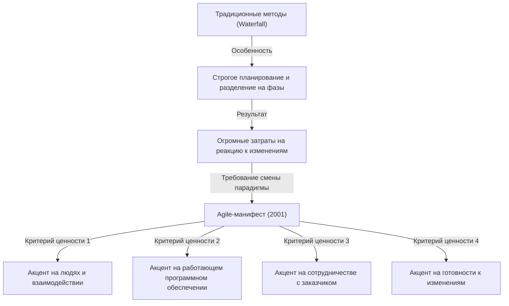
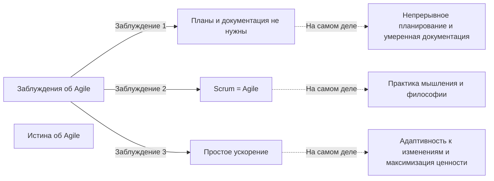

## 1. Введение: «Agile-манифест», ставший краеугольным камнем современной разработки программного обеспечения

Сегодня в IT-индустрии и сфере разработки программного обеспечения не проходит и дня, чтобы мы не услышали слово «Agile». Такие различные методологии, как Scrum, Kanban, Extreme Programming (XP), внедряются повсеместно, и многие компании применяют Agile как подход к предоставлению ценности «быстрее и гибче». Однако, возможно, удивительно мало людей глубоко понимают, как родилась эта концепция «Agile» и на какой философии она была основана.

С 11 по 13 февраля 2001 года на горнолыжном курорте Сноуберд, штат Юта, США, собрались 17 экспертов в области разработки программного обеспечения. Они искали решения серьезных проблем, от которых в то время страдала разработка программного обеспечения, и после обсуждений составили единый манифест. Это был «Манифест гибкой разработки программного обеспечения» (Agile Manifesto).

В этой статье мы подробно рассмотрим исторические предпосылки, приведшие к созданию этого Agile-манифеста, чувство кризиса по поводу «тяжеловесных процессов», с которым столкнулись разработчики того времени, ценности, разделяемые 17 авторами, и философию, которую современные организации-разработчики действительно должны почерпнуть из этого манифеста.

## 2. Исторический контекст: Эпоха программного кризиса и «тяжеловесные процессы»

Чтобы понять подоплеку Agile-манифеста, нам нужно знать, какова была ситуация в разработке программного обеспечения в 1990-х годах. В то время масштаб программных систем стремительно расширялся, и они становились все более сложными. Наряду с этим стала очевидной ситуация, называемая «кризисом программного обеспечения». Проекты постоянно терпели неудачу из-за превышения бюджета, задержек в графике работы или завершенных систем, которые оказались совершенно непригодными.

Чтобы справиться с этим кризисом, отрасль пыталась контролировать проблемы посредством «более строгого планирования», «детальной документации» и «строгого управления процессами». Это так называемые **тяжеловесные процессы (Heavyweight Processes)**, обычно представленные «Каскадной моделью» (Waterfall).

Особенностью тяжеловесных процессов является четкое разделение каждой фазы разработки (определение требований, проектирование, реализация, тестирование, обслуживание) и переход к следующей фазе только после полного завершения предыдущей. Кроме того, передача информации между каждой фазой осуществлялась через огромный объем документации.

Однако этому подходу было крайне сложно реагировать на быстрые изменения в бизнес-среде или новые требования, которые становились очевидными во время разработки. Исходя из предпосылки «однажды принятый план абсолютен», даже если истинные потребности клиента менялись, им ничего не оставалось, кроме как продолжать создавать систему, которая была бы бесполезна по плану. Разработчики были поглощены бюрократическими процессами и бесконечным созданием документации, и жаждали радости от создания действительно ценного, «работающего программного обеспечения».

## 3. Конференция в Сноуберде: 17 бунтарей

Движения, направленные на то, чтобы бросить вызов этой ситуации и найти более легкие и гибкие методы разработки, начали зарождаться в разных местах со второй половины 1990-х годов. Это были практики, которые добились успеха с помощью своих собственных уникальных подходов, такие как Кент Бек из Extreme Programming (XP), Кен Швабер и Джефф Сазерленд из Scrum, и Алистер Кокберн, создатель методологии Crystal.

Каждый из них отстаивал свой метод, но все они разделяли общее убеждение: «Люди и их взаимодействие важнее процессов и инструментов». В феврале 2001 года по призыву Роберта С. Мартина (дядюшки Боба) и других, 17 ведущих сторонников легковесных процессов (Lightweight Processes) собрались в Сноуберде.

Они провели дискуссии, чтобы извлечь основные ценности, общие для их методов, и предложить новое направление для всей отрасли. Первоначально они называли свои методы «легковесными» (Lightweight), но поскольку это слово имело негативный оттенок («пустой» или «несерьезный»), они искали более подходящее слово. В результате было выбрано слово **«Agile»**, что означает «подвижный», «быстрый» и «гибкий».

## 4. Манифест гибкой разработки программного обеспечения: 4 критерия ценности

Результатом дискуссий в Сноуберде стал «Манифест гибкой разработки программного обеспечения», состоящий из краткого текста длиной всего в несколько десятков слов. Этот манифест состоит из следующих 4 критериев ценности.

> Мы постоянно открываем для себя более совершенные методы разработки программного обеспечения, занимаясь разработкой непосредственно и помогая в этом другим. Благодаря этой работе мы пришли к тому, что ценим:
> 
> - **Люди и взаимодействие важнее процессов и инструментов**
> - **Работающий продукт важнее исчерпывающей документации**
> - **Сотрудничество с заказчиком важнее согласования условий контракта**
> - **Готовность к изменениям важнее следования первоначальному плану**
> 
> То есть, не отрицая важности того, что справа, мы всё-таки больше ценим то, что слева.

Выдающаяся черта этого манифеста заключается в том, что он не полностью отрицает элементы с правой стороны (процессы, документация, согласование контрактов, планы). Идеальный баланс «не отрицая важности того, что справа, мы всё-таки больше ценим то, что слева» - вот причина, по которой этот манифест продолжает поддерживаться по сей день не просто как бунтарский документ, а как по-настоящему практичная философия.

### Глубокий анализ критериев ценности

1. **Люди и взаимодействие важнее процессов и инструментов (Individuals and interactions over processes and tools)**
   Независимо от того, насколько отличные процессы или новейшие инструменты вы внедряете, их используют люди. Если существуют коммуникативные барьеры или нехватка доверия, проект потерпит неудачу. Прямой диалог между членами команды, сотрудничество для решения проблем и создание среды, которая максимально повышает навыки и мотивацию каждого, важнее строгого соблюдения процессов.

2. **Работающий продукт важнее исчерпывающей документации (Working software over comprehensive documentation)**
   Документация необходима, но сама по себе она не представляет ценности для клиента. Гораздо ценнее предоставить работающее программное обеспечение на ранней стадии и получить обратную связь, позволив клиенту поработать с ним, чем тратить время на написание сотен страниц спецификаций. «Работающее программное обеспечение» является самым надежным показателем прогресса.

3. **Сотрудничество с заказчиком важнее согласования условий контракта (Customer collaboration over contract negotiation)**
   Требуется не конфликт между разработчиками и клиентами из-за того, что «написано/не написано в контракте», а построение отношений, в которых они сотрудничают как одна команда. Часто сами клиенты не до конца понимают, чего они действительно хотят в начале разработки. Непрерывное сотрудничество на протяжении всей разработки и совместный поиск оптимальных решений - это кратчайший путь к успеху.

4. **Готовность к изменениям важнее следования первоначальному плану (Responding to change over following a plan)**
   В современном мире, где бизнес-среда и технологии быстро меняются, приверженность первоначальному плану - это лишь риск. Планы - это всего лишь гипотезы, основанные на текущей ситуации, и если получены новые знания или ситуация меняется, необходима гибкость, чтобы изменять план без колебаний. Суть Agile заключается в отношении, которое приветствует изменения как «возможность для создания конкурентного преимущества», а не отвергает их как «врагов, нарушающих планы».

## 5. Что означают 12 принципов

«Принципы, лежащие в основе Agile-манифеста» (12 принципов) - это те 4 критерия ценности, воплощенные в более конкретные руководящие принципы действий. Они определяют, как должны вести себя Agile-организации.

1. **Наивысшим приоритетом для нас является удовлетворение потребностей заказчика, благодаря регулярной и ранней поставке ценного программного обеспечения.**
2. **Изменение требований приветствуется, даже на поздних стадиях разработки. Agile-процессы позволяют использовать изменения для обеспечения заказчику конкурентного преимущества.**
3. **Работающее программное обеспечение выпускается часто, с периодичностью от пары недель до пары месяцев, с предпочтением более коротким срокам.**
4. **На протяжении всего проекта разработчики и представители бизнеса должны ежедневно работать вместе.**
5. **Над проектом должны работать мотивированные профессионалы. Чтобы работа была сделана, создайте условия, обеспечьте поддержку и полностью доверьтесь им.**
6. **Непосредственное общение лицом к лицу является наиболее практичным и эффективным способом обмена информацией как с самой командой разработчиков, так и внутри неё.**
7. **Работающее программное обеспечение — основной показатель прогресса.**
8. **Agile-процессы способствуют устойчивому развитию. Спонсоры, разработчики и пользователи должны иметь возможность поддерживать постоянный темп на неопределенный срок.**
9. **Постоянное внимание к техническому совершенству и качеству проектирования повышает гибкость проекта.**
10. **Простота — искусство минимизации лишней работы — крайне необходима.**
11. **Самые лучшие требования, архитектурные и технические решения рождаются у самоорганизующихся команд.**
12. **Команда регулярно пытается найти способы стать более эффективной, а затем настраивает и корректирует свое поведение соответствующим образом.**

Эти принципы охватывают как технические аспекты (переход к CI/CD, разработке через тестирование, рефакторингу и т.д.), так и человеческие аспекты (доверие, устойчивость, самоорганизация). В частности, 8-й принцип, «устойчивое развитие», был направлен на уход от «марша смерти» (бесконечных переработок), в ловушку которого в то время попадали многие разработчики.

## 6. Заблуждения и истина об Agile в наши дни

Прошло более 20 лет со времени создания Agile-манифеста, и слово «Agile» стало абсолютным мейнстримом. Однако в обмен на его популярность, не прекращаются случаи (так называемый «Agile только по названию» или «Waterfall-Agile»), когда суть Agile утрачивается и он становится пустой формальностью.

В качестве типичных заблуждений можно привести следующие:
- **«Раз это Agile, то планы не нужны, и документацию писать не надо»**: Как уже упоминалось выше, это большое заблуждение. Agile составляет планы, но не фиксирует их жестко, а непрерывно пересматривает. Необходимая документация также создается, избегается лишь её избыток.
- **«Agile = Scrum»**: Scrum - это один из типичных фреймворков для практики Agile, но это не всё, что есть в Agile. Если выполнение церемоний Scrum (Daily Scrum или Sprint Review) становится самоцелью, это будет противоречить ценности Agile-манифеста «люди и их взаимодействие важнее процессов и инструментов».
- **«Быстро создавать продукты - это цель Agile»**: Agile действительно сокращает время выполнения, но это не просто метод ускорения. Истинной целью является способность к адаптации (Adaptability), чтобы «предоставлять нужные вещи в нужное время».

## 7. Глубокое влияние на организационную культуру и перспективы на будущее

Agile-манифест вышел за рамки простого метода разработки программного обеспечения и привел к смене парадигмы в организационной структуре и методах управления. Ключевые слова в современной организационной теории, такие как «самоорганизующиеся команды», «психологическая безопасность» и «лидерство-служение» (Servant Leadership), тесно связаны с философией Agile.

В наше время, когда все говорят о цифровой трансформации (DX), переход к Agile-культуре организации требуется не только в IT-компаниях, но и во всех отраслях, таких как финансы, производство и розничная торговля. Это связано с тем, что в эпоху VUCA с ее быстрыми изменениями способность «чувствовать изменения и быстро менять направление» стала гораздо важнее способности «действовать по плану».

17 пионеров, разработавших Agile-манифест, серьезно обсудили, какой должна быть будущая разработка программного обеспечения, и выработали философию для восстановления человечности. Нам необходимо вновь разрушить поверхностную оболочку методов и фреймворков и вернуться к исходной точке Agile-манифеста — «критериям ценности» и «принципам».

## 8. Заключение

За кулисами «Манифеста гибкой разработки программного обеспечения» скрывался крик души инженеров, страдавших от негибких тяжеловесных процессов, и их страсть к возвращению к более человечной и творческой разработке. Оставленные ими 4 ценности и 12 принципов обладают универсальной истиной, которая не тускнеет со временем, независимо от того, насколько далеко зайдет эволюция технологий.

Если вы когда-нибудь почувствуете себя связанными процессами в повседневной работе разработчика, заваленными документацией и готовыми потерять из виду истинную цель, пожалуйста, перечитайте этот «Agile-манифест». В нем вы должны найти наиболее важный и фундаментальный ответ на вопрос, почему мы создаем программное обеспечение и как нам следует сотрудничать в команде.
