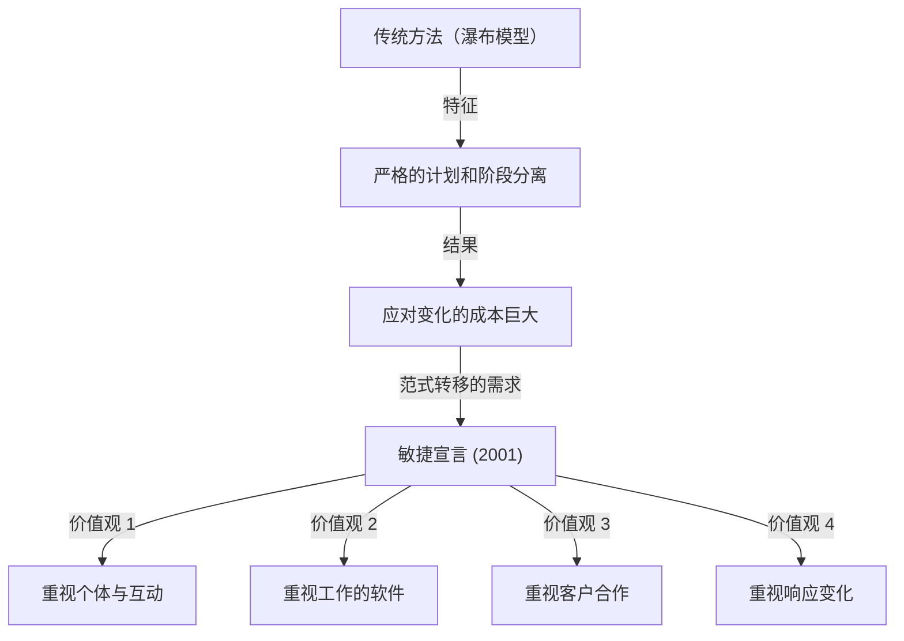
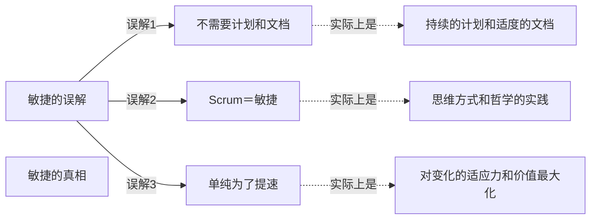

## 1. 引言：作为现代软件开发基石的“敏捷宣言”

如今，在IT行业和软件开发领域，“敏捷（Agile）”一词已经耳熟能详。Scrum、看板、极限编程（XP）等各种方法已被日常采用，许多企业选择敏捷作为“更快、更灵活地”交付价值的方法。然而，出乎意料的是，很少有人真正深入了解“敏捷”这一概念是如何诞生的，以及它是基于何种思想（哲学）被定义的。

2001年2月11日至13日，17名软件开发专家齐聚美国犹他州雪鸟（Snowbird）滑雪胜地。他们致力于为当时软件开发面临的严重问题寻找解决方案，经过讨论，最终整理出了一份宣言。这就是“敏捷软件开发宣言（Agile Manifesto）”。

本文将彻底深入探讨敏捷宣言诞生的历史背景、当时开发一线对“重型过程”的危机感、17位起草者共同拥有的价值观，以及现代开发组织应从该宣言中真正学习的哲学。

## 2. 历史背景：软件危机时代与“重型过程”

要理解敏捷宣言的背后故事，必须了解20世纪90年代软件开发的状况。当时，软件系统的规模迅速扩大，复杂性不断增加。随之而来的是被称为“软件危机”的现象日益明显。项目预算超支、交付延期，或者完成的系统完全无法使用等失败案例频繁发生。

为了应对这一危机，业界试图通过“更严密的计划”、“更详细的文档”以及“严格的过程管理”来控制问题。这通常被称为以“瀑布模型”为代表的**重型过程（Heavyweight Processes）**。

重型过程的特点在于明确划分开发的各个阶段（需求定义、设计、实现、测试、维护），并且只有在上一阶段完全结束后才能进入下一阶段。此外，各个阶段之间的信息传递通过大量文档进行。

然而，这种方法极难适应商业环境的快速变化以及开发过程中出现的新需求。在“一旦确定的计划就是绝对的”前提下，即使客户的真实需求发生改变，也只能继续按照计划开发毫无用处的系统。开发者们忙于官僚化的过程和无休止的文档编写，渴望体验到创造真正有价值的“可工作软件”的喜悦。

## 3. 雪鸟会议：17位反叛者

自20世纪90年代末起，各地开始出现反对这种情况并寻求更轻量、更灵活开发方法的运动。这些实践者通过自己独特的方法取得了成功，如极限编程（XP）的肯特·贝克（Kent Beck）、Scrum的肯·施瓦伯（Ken Schwaber）和杰夫·萨瑟兰（Jeff Sutherland）、水晶方法（Crystal）的阿利斯泰尔·科伯恩（Alistair Cockburn）等。

尽管他们提出了各自不同的方法，但都有一个共同的信念：“强调人及其互动，胜于过程和工具”。2001年2月，在罗伯特·C·马丁（Uncle Bob）等人的号召下，17位轻量级过程（Lightweight Processes）的代表性倡导者聚集在雪鸟。

他们提取了各自方法中共同的核心价值观，并进行了讨论，以期为整个行业提供新的方向。最初，他们称自己的方法为“轻量级（Lightweight）”，但由于这个词带有“缺乏实质”、“轻浮”等负面含义，他们寻找了更合适的词语。最终被选中的是意为“敏捷的”、“迅速的”、“灵活的”词汇：**“敏捷（Agile）”**。

## 4. 敏捷软件开发宣言：4个核心价值观

作为雪鸟会议讨论的结晶，“敏捷软件开发宣言”诞生了，全文由仅数十个字的简练句子构成。该宣言包含以下4个核心价值观：

> 我们一直在实践中探寻更好的软件开发方法，身体力行的同时也帮助他人。由此我们建立了如下价值观：
> 
> - **个体和互动** 高于 过程和工具
> - **工作的软件** 高于 详尽的文档
> - **客户合作** 高于 合同谈判
> - **响应变化** 高于 遵循计划
> 
> 也就是说，尽管右项有其价值，我们更重视左项的价值。

该宣言的卓越之处在于，它并没有全盘否定右侧的事项（过程、文档、合同谈判、计划）。“尽管右项有其价值”，但仍然“更重视左项的价值”，正是这种绝妙的平衡感，使得该宣言不仅仅是一份反叛之书，更作为一门真正实用的哲学，直到今天仍受到广泛支持。

### 深入解读核心价值观

1. **个体和互动 高于 过程和工具 (Individuals and interactions over processes and tools)**
   无论引入多么优秀的过程或最新的工具，使用它们的终究是人。如果存在沟通障碍或缺乏信任关系，项目注定会失败。团队成员之间的直接对话、为解决问题的合作，以及创造一个能最大限度发挥个人技能和积极性的环境，远比严格遵守过程更重要。

2. **工作的软件 高于 详尽的文档 (Working software over comprehensive documentation)**
   文档是必要的，但它本身并不能为客户提供价值。与其把时间花在编写几百页的规格说明书上，不如尽早提供实际可工作的软件，通过让客户体验而获得的反馈远比文档更有价值。“工作的软件”才是衡量进度的最可靠指标。

3. **客户合作 高于 合同谈判 (Customer collaboration over contract negotiation)**
   开发方和客户方不应因为“合同上写了还是没写”而对立，而是需要建立作为同一个团队相互合作的关系。客户自己往往在开发开始时也并不完全了解他们真正想要什么。通过开发过程中的持续协作，共同探索最佳解决方案，才是通往成功的捷径。

4. **响应变化 高于 遵循计划 (Responding to change over following a plan)**
   在商业环境和技术变化日新月异的今天，固守最初的计划只会带来风险。计划充其量只是基于现状的假设，当获得新认知或情况发生变化时，必须具备毫不犹豫地修正计划的灵活性。不把变化视为“破坏计划的敌人”而排斥，而是作为“创造竞争优势的机会”来欢迎，这才是敏捷的真谛。

## 5. 12条原则的意义

将4个核心价值观落实为更具体行动指南的是“敏捷宣言背后的原则（12条原则）”。这些原则定义了敏捷组织应该如何行事。

1. **我们最重要的目标，是通过持续不断地及早交付有价值的软件使客户满意。**
2. **欣然面对需求变化，即使在开发后期也一样。为了客户的竞争优势，敏捷过程掌控变化。**
3. **经常地交付可工作的软件，相隔几星期或一两个月，倾向于采取较短的周期。**
4. **业务人员和开发人员必须相互合作，项目中的每一天都不例外。**
5. **激发个体的斗志，以他们为核心搭建项目。提供所需的环境和支援，辅以信任，从而达成目标。**
6. **不论团队内外，传递信息效果最好效率也最高的方式是面对面的交谈。**
7. **可工作的软件是进度的首要度量标准。**
8. **敏捷过程倡导可持续开发。责任人、开发人员和用户要能够共同维持其步调稳定延续。**
9. **坚持不懈地追求技术卓越和良好设计，敏捷能力由此增强。**
10. **以简洁为本，它是极力减少不必要工作量的艺术。**
11. **最好的架构、需求和设计出自自组织团队。**
12. **团队定期地反思如何能提高成效，并依此调整自身的举止表现。**

这些原则涵盖了技术层面（与[CI/CD](/zh-cn/p/cicd-pipeline-github-actions-best-practices/)、测试驱动开发、重构等相关联）和人的层面（信任、可持续性、自组织）。特别是第8条原则“可持续开发”，强烈意识到了要摆脱当时许多开发者所陷入的“死亡行军（无休止的长时间加班）”。

## 6. 现代敏捷的误解与真相

敏捷宣言发布20多年后，“敏捷”一词已完全成为主流。然而，伴随其普及，敏捷的本质逐渐丧失，流于形式的情况（即所谓的“挂名敏捷”或“瀑布式敏捷”）也层出不穷。

常见的误解包括以下几点：
- **“既然是敏捷，就不需要计划，也不用写文档”**：如前所述，这是一个巨大的误解。敏捷也制定计划，只是不将其固定，而是持续进行调整。也会编写必要的文档，只是避免过度文档化。
- **“敏捷＝Scrum”**：Scrum是实践敏捷的代表性框架之一，但并非全部。如果仅仅将完成Scrum的仪式（如每日站会或冲刺评审）作为目的，那就违背了敏捷宣言中“个体和互动高于过程和工具”的价值观。
- **“快速开发是敏捷的目的”**：敏捷确实能缩短交付周期，但它绝不仅仅是提升速度的方法。具备“在正确的时机交付正确的东西”的适应力（Adaptability），才是敏捷真正的目的。

## 7. 对组织文化的深远影响与未来展望

敏捷宣言不仅超越了单纯的软件开发方法，还为组织的形态和管理方式带来了范式转移。现代组织理论中诸如“自组织团队”、“心理安全感”、“服务型领导”等重要关键词，都与敏捷的哲学有着深厚的渊源。

在数字化转型（DX）呼声高涨的今天，不仅是IT企业，金融、制造、零售等各个行业都被要求向敏捷的组织文化转变。因为在变化剧烈的VUCA时代，相比于“按计划执行的能力”，“敏锐察觉变化并迅速调整方向的能力”要重要得多。

起草敏捷宣言的17位先驱，认真探讨了未来软件开发应有的面貌，并编织出了一套回归人性的哲学。我们今天有必要打破方法论和框架的表面外壳，重新回归敏捷宣言的原点，即“核心价值观”和“原则”。

## 8. 结语

“敏捷软件开发宣言”的背后，是一线工程师们在僵化的重型过程中挣扎的灵魂呐喊，也是他们试图找回更具人性化和创造性开发方式的热情。他们留下的4个核心价值观和12条原则，无论技术如何进化都不会褪色，拥有跨越时代的普遍真理。

如果在日常开发中，你感到被过程束缚、被文档追赶，甚至快要迷失本来目的时，请务必重新阅读这份“敏捷宣言”。在那里，你一定能找到关于我们为什么要做软件，以及团队应该如何合作的，最重要也是最本质的答案。
