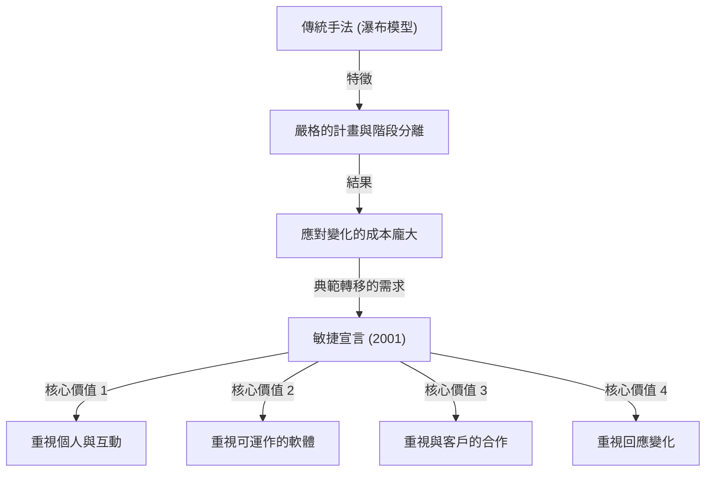
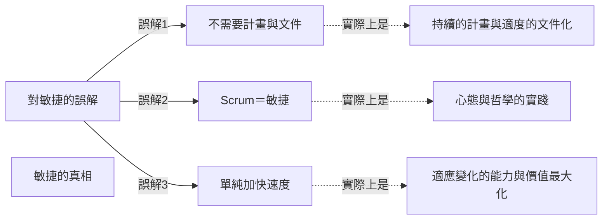

## 1. 前言：成為現代軟體開發基石的「敏捷宣言」

現在在IT業界與軟體開發現場，幾乎每天都會聽到「敏捷（Agile）」這個詞。Scrum、看板（Kanban）、極限程式設計（XP）等各種手法已被日常導入，許多企業採用敏捷作為「更快、更靈活」交付價值的方法。然而，意外地很少有人深入了解這個「敏捷」概念是如何誕生，又是基於什麼樣的思想（哲學）而被定義的。

2001年2月11日至13日，17位軟體開發專家聚集在美國猶他州的雪鳥（Snowbird）滑雪勝地。他們為當時軟體開發所面臨的嚴重問題尋找解決方案，經過討論後總結出了一份宣言。那就是「敏捷軟體開發宣言（Agile Manifesto）」。

本文將深入探討這份敏捷宣言誕生的歷史背景、當時開發現場面臨「重量級流程」的危機感、17位起草者所共享的價值觀，以及現代開發組織應從此宣言中真正學習的哲學。

## 2. 歷史背景：軟體危機時代與「重量級流程」

為了理解敏捷宣言的背後，必須了解1990年代軟體開發的狀況。當時，軟體系統的規模迅速擴大，並朝著複雜化的方向發展。隨之而來的是被稱為「軟體危機」的狀況逐漸浮現。專案預算超支、交期延誤，或者完成的系統完全無法使用等失敗案例頻繁發生。

為應對此危機，業界試圖透過「更嚴密的計畫」、「詳細的文件」以及「嚴格的流程管理」來控制問題。這就是通常以「瀑布模型（Waterfall Model）」為代表的**重量級流程（Heavyweight Processes）**。

重量級流程的特徵在於明確劃分開發的各個階段（需求定義、設計、實作、測試、維護），並且前一個階段必須完全結束才能進入下一個階段。此外，各階段之間的資訊傳遞是透過大量的文件來進行的。

然而，這種方法極難應對商業環境的快速變化，以及開發途中出現的新需求。在「一旦決定的計畫就是絕對的」前提下，即使客戶的真正需求已經改變，也只能繼續按照計畫製作出無用的系統。開發者們被官僚式的流程和無止盡的文件編寫所淹沒，渴望著創造出真正有價值的「可運作軟體」的喜悅。

## 3. 雪鳥會議：17位反叛者

對這種狀況提出異議，並開始摸索更輕量、靈活的開發手法之行動，從1990年代後半期開始在各地湧現。例如極限程式設計（XP）的 Kent Beck、Scrum 的 Ken Schwaber 與 Jeff Sutherland、Crystal 手法的 Alistair Cockburn 等，他們都是以獨特方法取得成功的實踐者。

雖然他們各自提倡不同的手法，但擁有一個共同的信念：「相較於流程與工具，更重視人及其互動」。2001年2月，在 Robert C. Martin（Uncle Bob）等人的號召下，17位輕量級流程（Lightweight Processes）的代表性提倡者齊聚雪鳥。

他們提取了各自手法中共通的核心價值觀，並為向整個業界提出新方向而進行了討論。最初，他們將自己的手法稱為「輕量級（Lightweight）」，但因為這個詞帶有「缺乏內容」、「輕率」的負面含意，所以他們尋找了更合適的詞彙。結果選中了承載著「機敏」、「迅速」、「靈活」之意的**「敏捷（Agile）」**一詞。

## 4. 敏捷軟體開發宣言：4個核心價值

作為雪鳥討論結出的果實，是由短短幾十字簡潔文字組成的「敏捷軟體開發宣言」。這份宣言由以下4個核心價值構成：

> 我們透過親自實踐以及協助他人實踐，正在尋找更好的軟體開發方法。透過這項工作，我們得出了以下價值：
> 
> - **相較於流程與工具，更重視個人與互動**
> - **相較於詳盡的文件，更重視可運作的軟體**
> - **相較於合約談判，更重視與客戶的合作**
> - **相較於遵循計畫，更重視回應變化**
> 
> 也就是說，雖然我們承認左側項目的價值，但我們更看重右側項目的價值。

這份宣言卓越之處在於，它並未全盤否定左側的事物（流程、文件、合約談判、計畫）。「雖然承認左側項目的價值」，但仍然「更看重右側項目的價值」，正是這種絕妙的平衡感，使得這份宣言不只是一份反叛書，而是作為真正實用的哲學，至今仍持續受到支持的原因。

### 深入探討核心價值

1. **相較於流程與工具，更重視個人與互動 (Individuals and interactions over processes and tools)**
   無論導入多麼優秀的流程或最新的工具，使用的終究是人。如果存在溝通障礙或缺乏信任關係，專案就會失敗。團隊成員間直接的對話、為解決問題而合作，以及建立能最大化發揮個人技能與動力的環境，遠比嚴格遵守流程更為重要。

2. **相較於詳盡的文件，更重視可運作的軟體 (Working software over comprehensive documentation)**
   文件是必要的，但它本身並不能為客戶提供價值。與其花費時間編寫數百頁的規格書，不如儘早提供實際可運作的軟體，透過讓客戶操作而獲得的回饋要有價值得多。「可運作的軟體」才是衡量進度最可靠的指標。

3. **相較於合約談判，更重視與客戶的合作 (Customer collaboration over contract negotiation)**
   開發方與客戶方不應為了「合約上有沒有寫」而對立，而是需要建立作為同一個團隊相互合作的關係。客戶自己在開發開始時，往往也沒有完全了解自己真正想要的東西。透過開發持續合作，共同探索最佳解決方案才是邁向成功的捷徑。

4. **相較於遵循計畫，更重視回應變化 (Responding to change over following a plan)**
   在商業環境與技術變化劇烈的現代，固執於初期的計畫只會帶來風險。計畫充其量只是基於現狀的假設，當獲得新知識或情況改變時，需要具備毫不猶豫修改計畫的靈活性。不將變化視為「打亂計畫的敵人」而排除，而是作為「創造競爭優勢的機會」來歡迎，這正是敏捷的精髓。

## 5. 12項原則的意義

將4個核心價值轉化為更具體行動指南的，就是「敏捷宣言背後的原則（12項原則）」。這些原則定義了敏捷組織應該如何運作。

1. **我們最優先的任務是透過儘早且持續地交付有價值的軟體來滿足客戶。**
2. **歡迎改變需求，即使是在開發後期。敏捷流程利用變化來為客戶的競爭優勢服務。**
3. **頻繁地交付可運作的軟體，從幾週到幾個月不等，偏好較短的時間尺度。**
4. **業務人員與開發者必須在專案期間每天一起工作。**
5. **圍繞著有動機的個人建立專案。給予他們所需的環境與支援，並信任他們能完成工作。**
6. **在開發團隊內部傳達資訊最有效率且最有效的方法，就是面對面交談。**
7. **可運作的軟體是衡量進度的主要指標。**
8. **敏捷流程提倡永續的開發。贊助者、開發者與使用者應能無限期地維持穩定的步伐。**
9. **對技術卓越與優良設計的持續關注能提升敏捷性。**
10. **簡潔（最大化未完成工作量的藝術）是不可或缺的。**
11. **最好的架構、需求與設計出自自組織團隊。**
12. **團隊定期反省如何能更有效率，並據此調整其行為。**

這些原則涵蓋了技術層面（連結至 CI/CD、測試驅動開發、重構等）與人性層面（信任、永續性、自組織）。尤其是第8項原則「永續的開發」，強烈意識到要擺脫當時許多開發者陷入的「死亡行軍（無止盡的長時間加班）」。

## 6. 現代對敏捷的誤解與真相

敏捷宣言發表至今已超過20年，「敏捷」一詞已完全成為主流。然而，伴隨其普及，失去了敏捷本質、流於形式的案例（所謂的「僅具虛名的敏捷」或「瀑布式敏捷」）也層出不窮。

常見的誤解包括以下幾點：
- **「如果是敏捷就不需要計畫，也不用寫文件」**：如前所述，這是一個巨大的誤解。敏捷會制定計畫，只是不將其固定，而是持續地重新檢視。文件也會編寫必要的內容，只是避免過度的文件化。
- **「敏捷＝Scrum」**：Scrum是實踐敏捷的代表性框架之一，但並非全部。如果只是將完成 Scrum 的儀式（如每日站會或衝刺審查）當作目的，就會違背敏捷宣言中「相較於流程與工具，更重視個人與互動」的核心價值。
- **「做得快是敏捷的目的」**：敏捷確實能縮短交付週期，但它不僅僅是加快速度的手法。具備為了「在正確的時機提供正確的東西」的適應力（Adaptability）才是真正的目的。

## 7. 對組織文化的深遠影響與對未來的展望

敏捷宣言超越了單純的軟體開發手法，對組織的型態與管理手法也帶來了典範轉移。如「自組織團隊」、「心理安全感」、「僕人式領導」等現代組織理論中的重要關鍵字，全都與敏捷哲學有著深厚的關聯。

在強烈呼籲 DX（數位轉型）的現在，不僅是 IT 企業，金融、製造、零售等所有產業，都被要求向敏捷的組織文化轉型。因為在變化劇烈的 VUCA 時代，相較於「按計畫執行的能力」，「察覺變化並迅速轉換方向的能力」變得重要得多。

起草敏捷宣言的17位先驅者們認真討論了未來軟體開發應有的樣貌，並編織出為了找回人性的哲學。我們現在需要再次打破手法與框架這種表面的外殼，回歸敏捷宣言原點的「核心價值」與「原則」。

## 8. 總結

「敏捷軟體開發宣言」的背後，有著在僵化的重量級流程中受苦的第一線工程師們靈魂的吶喊，以及試圖找回更具人性、更具創造性開發的熱情。他們所留下的4個價值與12項原則，無論科技如何進步都不會褪色，具有超越時代的普遍真理。

如果你在日常的開發業務中被流程束縛、被文件追趕，似乎快要迷失原本的目的時，請務必重新閱讀這份「敏捷宣言」。在那裡，必定寫著我們為什麼要製作軟體，以及團隊應該如何合作這類最重要且最本質的答案。
