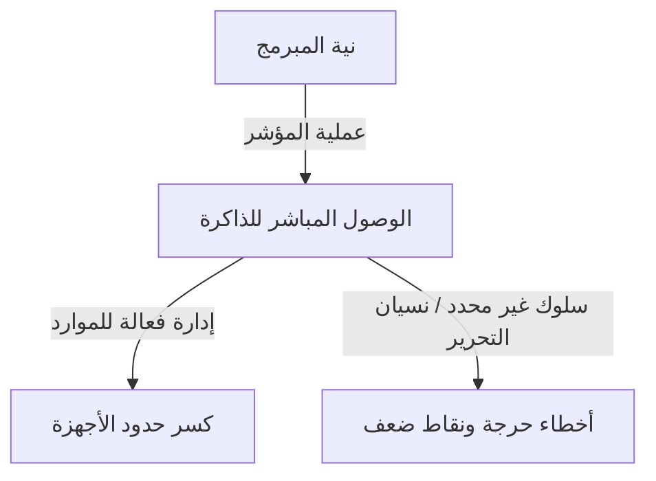
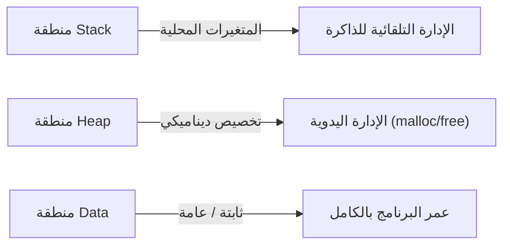

## مقدمة: العبء الثقيل للـ "حرية" في C

في تاريخ لغات البرمجة، من النادر أن تجد لغة مثل C أثرت بعمق على الأجيال اللاحقة وبقيت في الطليعة لفترة طويلة. تم تطوير هذه اللغة بواسطة دينيس ريتشي في عام 1972، وولدت بغرض صريح وهو كتابة نظام التشغيل Unix. إذا كان من الممكن تلخيص فلسفتها الأساسية في عبارة واحدة، فستكون "ثق بالمبرمج" - وهي أيديولوجية بسيطة للغاية ولكنها حازمة بشكل مرعب.

توفر العديد من لغات البرمجة الحديثة (مثل Java أو Python أو أحدث مثل Go و Rust) شبكات أمان متنوعة لمنع المطورين من ارتكاب الأخطاء، أو لمنع تعطل النظام المميت في حالة ارتكاب أخطاء. الإدارة التلقائية للذاكرة من خلال جمع القمامة (garbage collection)، وفحص حدود المصفوفة، والاستدلال القوي للأنواع، ومدققات الاستعارة - تعتمد كل هذه على الفلسفة الحديثة التي تقول "البشر يرتكبون الأخطاء"، في محاولة لتغطيتها على جانب النظام.

ومع ذلك، فإن C مختلفة. تمنح لغة C المطورين حرية لا حصر لها، ولكن في المقابل، تزيل كل شبكات الأمان. أفضل مثال على ذلك هو مفهوم "المؤشر" (Pointer). إن فهم المؤشرات هو فهم C، ويعني لمس جوهر هندسة الكمبيوتر. في هذه المقالة، سوف نتعمق في موضوع المؤشرات والحرية في C، بدءًا من آثارها الفلسفية إلى فوائدها العملية، ومكانتها في نماذج البرمجة الحديثة.

## ما هو المؤشر: حوار مباشر مع الأجهزة

من السهل وصف المؤشر ببساطة بأنه "متغير يخزن عنوان ذاكرة"، ولكن هذا لا يعبر حتى عن نصف قيمته الحقيقية. المؤشر يشبه "العصا السحرية" التي تمنح المبرمجين وصولاً مباشرًا إلى اللوحة الشاسعة لمساحة الذاكرة.

ذاكرة الكمبيوتر هي في الأساس مجرد مصفوفة عملاقة أحادية البعد من الأصفار والآحاد. يقوم نظام التشغيل بتجريد مساحة الذاكرة هذه ويوفر مساحة عنوان افتراضية لكل عملية، ولكن عند تنفيذ برنامج، يتم دائمًا وضع البيانات في مكان ما في هذه المساحة.

باستخدام المؤشرات، يمكن للمبرمجين معالجة ليس فقط "محتويات المتغير" ولكن أيضًا "مكان وجود المتغير". يتيح هذا عمليات متقدمة مثل:

1. **تمرير البيانات بدون نسخ (Zero-copy)**: عند تمرير هياكل بيانات ضخمة كمعلمات للدالة، بدلاً من نسخ البيانات نفسها، يؤدي تمرير الموقع (العنوان) الذي توجد فيه البيانات فقط إلى تحسين هائل في الأداء.
2. **بناء هياكل بيانات ديناميكية**: المؤشرات ضرورية لربط البيانات المتناثرة في الذاكرة لبناء هياكل بيانات معقدة ومرنة مثل القوائم المرتبطة (Linked Lists)، والأشجار (Trees)، والرسوم البيانية (Graphs).
3. **التعيين المباشر لسجلات الأجهزة**: في الأنظمة المضمنة، يعد الوصول إلى الذاكرة عبر المؤشرات الطريقة الوحيدة لمعالجة سجلات الأجهزة الموجودة في عناوين ذاكرة محددة مباشرة.

## ثمن الحرية: المسؤولية الكبيرة لإدارة الذاكرة

تأتي الحرية اللامحدودة التي توفرها المؤشرات مع "مسؤوليات" مقابلة. في C، يجب أن يتم التعامل مع تخصيص الذاكرة وإلغاء تخصيصها يدويًا بالكامل بواسطة المبرمج. لن يتم أبدًا تحرير الذاكرة المخصصة بواسطة `malloc` ما لم يقم المبرمج باستدعاء `free` بشكل صريح.

تخلق فلسفة "الإدارة اليدوية للذاكرة" هذه مخاطر مختلفة (أخطاء متعلقة بالذاكرة) مثل:

- **تسرب الذاكرة (Memory Leak)**: ظاهرة تُستنفد فيها موارد النظام تدريجيًا عن طريق نسيان تحرير الذاكرة المخصصة.
- **المؤشر المتدلي (Dangling Pointer)**: مؤشر يستمر في الإشارة إلى منطقة ذاكرة تم تحريرها بالفعل. محاولة الوصول إليه تسبب سلوكًا غير متوقع وثغرات أمنية (Use-After-Free).
- **تجاوز المخزن المؤقت (Buffer Overrun)**: ظاهرة كتابة البيانات خارج حدود منطقة الذاكرة المخصصة. في التاريخ، هو أحد الأسباب التي أحدثت أكبر عدد من الثغرات الأمنية.

نادرًا ما تحدث هذه المشاكل في اللغات الحديثة المزودة بجمع القمامة. فلماذا تستمر C في الحفاظ على مثل هذا التصميم الخطير؟ هذا من أجل السعي وراء "القدرة على التنبؤ بالأداء" و"التحسين الشديد". من الصعب التنبؤ بموعد تشغيل جامع القمامة (إيقاف مؤقت لـ GC)، مما يجعله أحيانًا غير مناسب للأنظمة التي تتطلب أداءً في الوقت الفعلي أو تطوير نواة نظام التشغيل. في C، "لا يحدث إلا ما يكتبه المبرمج"، مما يسمح بإتقان كامل على سلوك النظام بأكمله.

## مؤشرات الوظائف: تغيير سلوك البرنامج ديناميكيًا

لا تشير المؤشرات إلى البيانات فقط. واحدة من أقوى وأجمل الميزات في C هي "مؤشر الوظيفة" (Function Pointer). باستخدام مؤشرات الوظائف، يمكن الاحتفاظ بالعنوان الذي توجد فيه تعليمات البرنامج (الكود) كمؤشر والتعامل معه كمتغير.

تجعل مؤشرات الوظائف من الممكن تنفيذ مفاهيم "تعدد الأشكال" (Polymorphism) و"الاستدعاءات" (callbacks) من اللغات الموجهة للكائنات حتى في C. على سبيل المثال، فإن وظيفة `qsort`، التي تقوم بفرز مصفوفة، تأخذ مؤشرًا إلى وظيفة مقارنة كوسيطة، مما يسمح لها بتنفيذ عمليات الفرز بمرونة بغض النظر عن نوع البيانات.

العديد من البنى التي تحقق مستوى عاليًا من التجريد باستخدام C، مثل تصميم انتقالات الحالة (آلات الحالة) أو معالجة المقاطعة لبرامج تشغيل الأجهزة في نظام التشغيل، مصممة من خلال الاستفادة بمهارة من مؤشرات الوظائف هذه. إن طمس الحدود بين "البيانات" و"الإجراءات (الكود)" والسماح بإعادة تكوين بنية البرنامج نفسها ديناميكيًا، هذه المرونة هي دليل على أن C ليست مجرد لغة منخفضة المستوى.

## ما تطلبه فلسفة C من المهندسين المعاصرين

في عصر تظهر فيه لغات مثل Rust توازن بين "الأمان والأداء"، قد يبدو نموذج لغة C المتمثل في "المؤشرات والإدارة اليدوية للذاكرة" قديمًا. في الواقع، تتناقص حالات اعتماد C للمشاريع الجديدة.

ومع ذلك، لم تتلاشَ قيمة تعلم C أبدًا. كتابة C مرادف لتجربة مباشرة لكيفية إدارة نظام التشغيل للذاكرة، وكيف يستخدم وحدة المعالجة المركزية ذاكرة التخزين المؤقت، وكيف يتم تعيين هياكل البيانات على الذاكرة.

هناك مقولة مفادها "من يتقن المؤشرات يتقن C". يتعثر العديد من المبتدئين في المؤشرات، ولكن عندما يتغلبون على هذا الجدار ويمكنهم التنقل بحرية في المحيط الشاسع لمساحة الذاكرة، تتسع آفاقهم كمبرمجين بشكل كبير. المشي على حبل مشدود بدون شبكة أمان أمر خطير، ولكن هذا هو بالضبط سبب قدرتنا على الشعور بحساسية بقوة الرياح وتوتر الحبل، واكتساب إحساس مثالي بالتوازن.

## استنتاج

تُبنى فلسفة C على المقايضة بين "الحرية" و"المسؤولية". أيديولوجية التصميم الخاصة بها المتمثلة في توفير سلاح المؤشرات القوي وترك كل شيء لتقدير المبرمج تسبب أحيانًا أخطاءً حرجة، ولكن في الوقت نفسه، إنها المفتاح لاستخلاص إمكانات الأجهزة إلى حدودها المطلقة.

بينما يتطور فعل البرمجة في اتجاه أكثر تجريدًا، وأكثر أمانًا، وأكثر ملاءمة للإنسان، تظل C وجودًا قيمًا يستمر في إظهار "الشكل الخام" لأجهزة الكمبيوتر لنا. عندما ننظر إلى هاوية الذاكرة من خلال المؤشرات، فإننا لا نكتب الكود فحسب؛ بل نجري حوارًا حقيقيًا مع الآلة المعقدة والرائعة المعروفة باسم الكمبيوتر.
