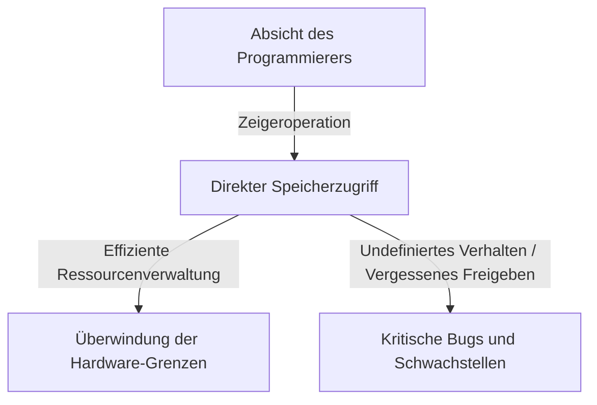
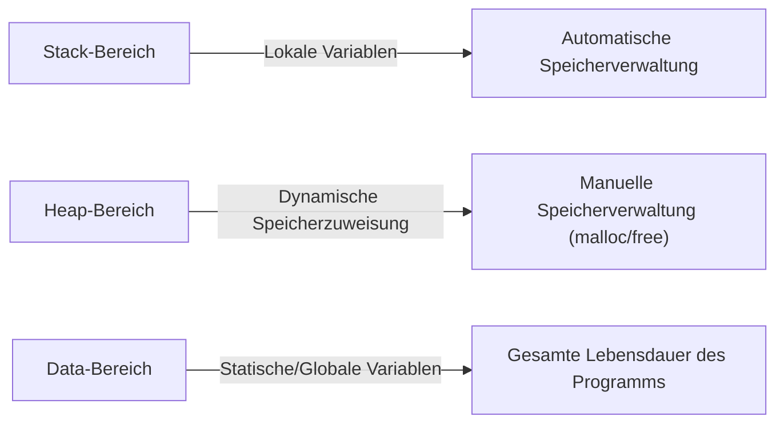

## Einführung: Die schwere Last der "Freiheit" in C

In der Geschichte der Programmiersprachen findet man selten eine Sprache wie C, die nachfolgende Generationen so tiefgreifend beeinflusst hat und so lange an der Spitze geblieben ist. Diese von [Dennis Ritchie](/de/p/biography-dennis-ritchie/) im Jahr 1972 entwickelte Sprache wurde mit dem ausdrücklichen Zweck geboren, das Unix-Betriebssystem zu schreiben. Wenn man ihre zugrunde liegende Philosophie in einem Satz zusammenfassen könnte, wäre es "Vertraue dem Programmierer" - eine sehr einfache, aber erschreckend entschlossene Ideologie.

Viele moderne Programmiersprachen (wie Java, Python oder in jüngerer Zeit Go und Rust) bieten verschiedene Sicherheitsnetze, um zu verhindern, dass Entwickler Fehler machen, oder um fatale Systemabstürze zu verhindern, falls doch Fehler auftreten. Automatische Speicherverwaltung durch Garbage Collection, Überprüfung von Array-Grenzen, leistungsstarke Typinferenz und Borrow Checker – all dies basiert auf der modernen Philosophie, dass "Menschen Fehler machen", und versucht, diese auf der Systemseite zu verdecken.

C ist jedoch anders. C gibt Entwicklern unendliche Freiheit, aber im Gegenzug entfernt es alle Sicherheitsnetze. Das beste Beispiel dafür ist das Konzept des "Zeigers" (Pointer). [Zeiger](/de/p/c-language-pointers-memory-management-stack-heap/) zu verstehen, bedeutet C zu verstehen, und es bedeutet, die Essenz der Computerarchitektur zu berühren. In diesem Artikel werden wir uns tief in das Thema [Zeiger](/de/p/c-language-pointers-memory-management-stack-heap/) und Freiheit in C einarbeiten, von seinen philosophischen Implikationen bis hin zu praktischen Vorteilen und seinem Platz in modernen Programmierparadigmen.

## Was ist ein Zeiger: Direkter Dialog mit der Hardware

Es ist einfach, einen [Zeiger](/de/p/c-language-pointers-memory-management-stack-heap/) als "eine Variable, die eine Speicheradresse speichert" zu beschreiben, aber das drückt nicht einmal die Hälfte seines wahren Wertes aus. Ein [Zeiger](/de/p/c-language-pointers-memory-management-stack-heap/) ist wie ein "Zauberstab", der Programmierern direkten Zugriff auf die riesige Leinwand des Speicherplatzes gibt.

Der Speicher eines Computers ist im Grunde nur ein riesiges eindimensionales Array von Nullen und Einsen. Das Betriebssystem abstrahiert diesen Speicherplatz und stellt jedem Prozess einen virtuellen Adressraum zur Verfügung. Wenn ein Programm jedoch ausgeführt wird, werden die Daten immer irgendwo in diesem Raum platziert.

Durch die Verwendung von Zeigern können Programmierer nicht nur "den Inhalt einer Variablen" manipulieren, sondern auch "wo sich die Variable befindet". Dies ermöglicht fortgeschrittene Operationen wie:

1. **Zero-Copy-Datenübergabe**: Wenn riesige Datenstrukturen als Funktionsargumente übergeben werden, führt die Übergabe nur des Ortes (der Adresse), an dem die Daten vorhanden sind, anstatt der Daten selbst, zu einer dramatischen Leistungssteigerung.
2. **Erstellung dynamischer Datenstrukturen**: [Zeiger](/de/p/c-language-pointers-memory-management-stack-heap/) sind unerlässlich, um im Speicher verstreute Daten zu verknüpfen und komplexe, flexible Datenstrukturen wie verkettete Listen (Linked Lists), Bäume (Trees) und Graphen aufzubauen.
3. **Direktes Mapping auf Hardware-Register**: In eingebetteten Systemen ist der Speicherzugriff über [Zeiger](/de/p/c-language-pointers-memory-management-stack-heap/) die einzige Möglichkeit, direkt auf Hardware-Register zuzugreifen, die sich an bestimmten Speicheradressen befinden.

## Der Preis der Freiheit: Die große Verantwortung der Speicherverwaltung

Die unendliche Freiheit, die [Zeiger](/de/p/c-language-pointers-memory-management-stack-heap/) mit sich bringen, geht mit entsprechenden "Verantwortlichkeiten" einher. In C müssen Speicherzuweisung und -freigabe vollständig manuell vom Programmierer gehandhabt werden. Durch `malloc` zugewiesener Speicher wird niemals freigegeben, es sei denn, der Programmierer ruft explizit `free` auf.

Diese Philosophie der "manuellen Speicherverwaltung" schafft verschiedene Risiken (speicherbezogene Fehler) wie:

- **Speicherleck (Memory Leak)**: Ein Phänomen, bei dem Systemressourcen durch das Vergessen der Freigabe zugewiesenen Speichers allmählich erschöpft werden.
- **Hängender [Zeiger](/de/p/c-language-pointers-memory-management-stack-heap/) (Dangling Pointer)**: Ein [Zeiger](/de/p/c-language-pointers-memory-management-stack-heap/), der weiterhin auf einen Speicherbereich zeigt, der bereits freigegeben wurde. Der Versuch, darauf zuzugreifen, verursacht unvorhersehbares Verhalten und Sicherheitslücken (Use-After-Free).
- **Pufferüberlauf (Buffer Overrun)**: Ein Phänomen, bei dem Daten über die Grenzen des zugewiesenen Speicherbereichs hinaus geschrieben werden. In der Geschichte ist es eine der Ursachen, die die meisten Sicherheitslücken verursacht haben.

Diese Probleme treten in modernen Sprachen, die mit einer Garbage Collection ausgestattet sind, selten auf. Warum behält C dann ein solch gefährliches Design bei? Dies dient der Verfolgung von "Vorhersagbarkeit der Leistung" und "extremer Optimierung". Es ist schwierig vorherzusagen, wann der Garbage Collector ausgeführt wird (GC-Pausen), was ihn manchmal ungeeignet für Systeme macht, die Echtzeitleistung erfordern, oder für die OS-Kernel-Entwicklung. In C "passiert nur das, was der Programmierer schreibt", was eine vollständige Kontrolle über das Verhalten des gesamten Systems ermöglicht.

## Funktionszeiger: Das Verhalten von Programmen dynamisch ändern

[Zeiger](/de/p/c-language-pointers-memory-management-stack-heap/) zeigen nicht nur auf Daten. Eines der mächtigsten und schönsten Features in C ist der "Funktionszeiger". Mithilfe von Funktionszeigern kann die Adresse, an der sich Programmanweisungen (Code) befinden, als [Zeiger](/de/p/c-language-pointers-memory-management-stack-heap/) gehalten und wie eine Variable behandelt werden.

Funktionszeiger machen es möglich, Konzepte von "Polymorphismus" und "Callbacks" aus objektorientierten Sprachen auch in C zu implementieren. Die Funktion `qsort`, die beispielsweise ein Array sortiert, nimmt einen [Zeiger](/de/p/c-language-pointers-memory-management-stack-heap/) auf eine Vergleichsfunktion als Argument entgegen, wodurch sie Sortierprozesse unabhängig vom Datentyp flexibel ausführen kann.

Viele Architekturen, die mit C ein hohes Maß an Abstraktion erreichen, wie z. B. der Entwurf von Zustandsübergängen (Zustandsautomaten) oder die Interrupt-Verarbeitung für Gerätetreiber in einem Betriebssystem, wurden durch geschickte Nutzung dieser Funktionszeiger entworfen. Die Verwischung der Grenzen zwischen "Daten" und "Prozeduren (Code)" und die Möglichkeit, die Struktur des Programms selbst dynamisch zu rekonfigurieren, ist der Beweis dafür, dass C nicht nur eine Low-Level-Sprache ist.

## Was die Philosophie von C von modernen Ingenieuren verlangt

In einer Zeit, in der Sprachen wie Rust aufkommen, die "Sicherheit und Leistung" in Einklang bringen, mag das C-Sprachparadigma von "Zeigern und manueller Speicherverwaltung" altmodisch erscheinen. Tatsächlich gehen die Fälle, in denen C für neue Projekte eingesetzt wird, zurück.

Der Wert, C zu lernen, ist jedoch nie verblasst. Das Schreiben in C ist gleichbedeutend mit der Erfahrung aus erster Hand, wie das Betriebssystem den Speicher verwaltet, wie die CPU Caches nutzt und wie Datenstrukturen auf den Speicher abgebildet werden.

Es gibt ein Sprichwort: "Wer [Zeiger](/de/p/c-language-pointers-memory-management-stack-heap/) meistert, meistert C". Viele Anfänger stolpern über [Zeiger](/de/p/c-language-pointers-memory-management-stack-heap/), aber wenn sie diese Mauer überwinden und frei im weiten Ozean des Speicherplatzes navigieren können, erweitert sich ihr Horizont als Programmierer dramatisch. Ohne Sicherheitsnetz auf dem Drahtseil zu laufen, ist gefährlich, aber genau aus diesem Grund können wir die Stärke des Windes und die Spannung des Seils sensibel spüren und einen perfekten Gleichgewichtssinn erlangen.

## Fazit

Die Philosophie von C baut auf dem Kompromiss zwischen "Freiheit" und "Verantwortung" auf. Seine Design-Ideologie, die mächtige Waffe der [Zeiger](/de/p/c-language-pointers-memory-management-stack-heap/) bereitzustellen und alles dem Ermessen des Programmierers zu überlassen, verursacht manchmal kritische Fehler, ist aber gleichzeitig der Schlüssel, um das Potenzial der Hardware bis an ihre absoluten Grenzen auszuschöpfen.

Während sich die Kunst des Programmierens in eine abstraktere, sicherere und menschenfreundlichere Richtung entwickelt, bleibt C eine wertvolle Präsenz, die uns weiterhin die "rohe Form" von Computern zeigt. Wenn wir durch [Zeiger](/de/p/c-language-pointers-memory-management-stack-heap/) in den Abgrund des Speichers blicken, schreiben wir nicht nur Code; wir führen einen wahren Dialog mit der komplexen und exquisiten Maschine, die als Computer bekannt ist.
