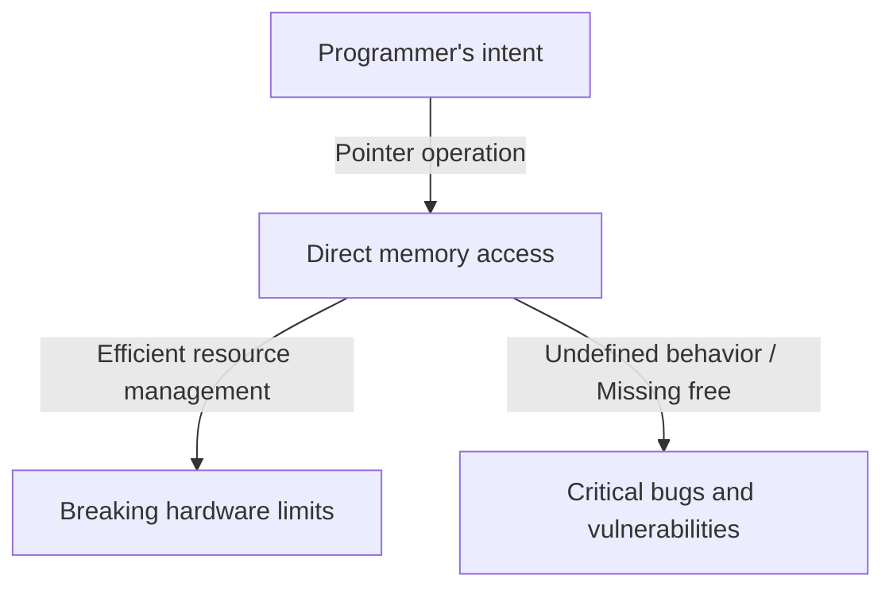
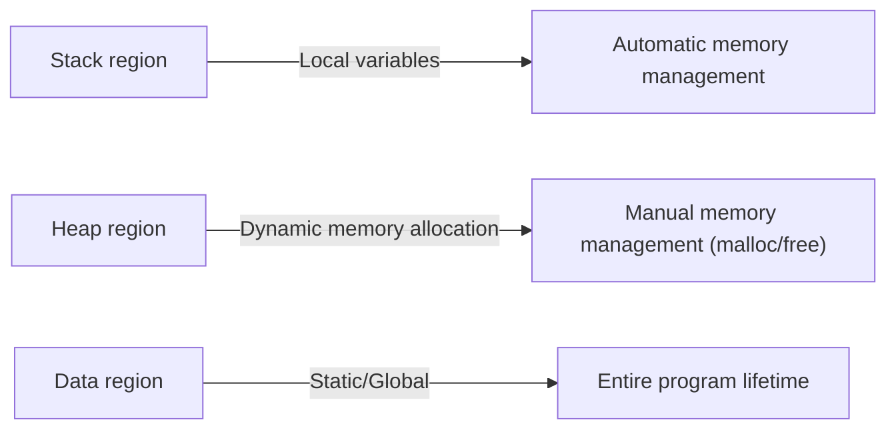

## Introduction: The Heavy Burden of "Freedom" in C

In the history of programming languages, it is rare to find a language like C that has profoundly influenced subsequent generations and remained at the forefront for so long. Developed by Dennis Ritchie in 1972, this language was born with the explicit purpose of writing the Unix operating system. If its underlying philosophy could be summed up in one phrase, it would be "Trust the programmer" — a very simple yet terrifyingly resolute ideology.

Many modern programming languages (such as Java, Python, or more recently Go and Rust) provide various safety nets to prevent developers from making mistakes, or to prevent fatal system crashes if mistakes are made. Automatic memory management via garbage collection, array bounds checking, powerful type inference, and borrow checkers — these are all based on the modern philosophy that "humans make mistakes," attempting to cover them up on the system side.

However, C is different. C gives developers infinite freedom, but in return, it removes all safety nets. The prime example of this is the concept of "Pointer". To understand pointers is to understand C, and it means touching the essence of computer architecture. In this article, we will delve deeply into the theme of pointers and freedom in C, from its philosophical implications to practical benefits, and its place in modern programming paradigms.

## What is a Pointer: Direct Dialogue with Hardware

It is easy to describe a pointer simply as "a variable that stores a memory address," but that does not even tell half of its true value. A pointer is like a "magic wand" that gives programmers direct access to the vast canvas of memory space.

Computer memory is essentially just a giant one-dimensional array of 0s and 1s. The operating system abstracts this memory space and provides a virtual address space for each process, but when a program is executed, data is always placed somewhere in this space.

By using pointers, programmers can manipulate not only "the contents of a variable" but also "where the variable is." This enables advanced operations such as:

1. **Zero-copy data passing**: When passing huge data structures as function arguments, instead of copying the data itself, passing only the location (address) where the data exists realizes a dramatic performance improvement.
2. **Building dynamic data structures**: Pointers are essential for linking data scattered in memory to build complex and flexible data structures such as Linked Lists, Trees, and Graphs.
3. **Direct mapping to hardware registers**: In embedded systems, memory access via pointers is the only way to directly manipulate hardware registers located at specific memory addresses.

## The Price of Freedom: The Heavy Responsibility of Memory Management

The infinite freedom brought by pointers comes with corresponding "responsibilities." In C, memory allocation and deallocation must be handled entirely manually by the programmer. Memory allocated by `malloc` will never be freed unless the programmer explicitly calls `free`.

This philosophy of "manual memory management" creates various risks (memory-related bugs) such as:

- **Memory Leak**: A phenomenon where system resources are gradually depleted by forgetting to free allocated memory.
- **Dangling Pointer**: A pointer that continues to point to a memory area that has already been freed. Attempting to access this causes unpredictable behavior and security vulnerabilities (Use-After-Free).
- **Buffer Overrun**: A phenomenon of writing data beyond the boundaries of the allocated memory area. It is one of the causes that have created the most security holes in history.

These problems rarely occur in modern languages equipped with garbage collection. So why does C continue to maintain such a dangerous design? It is to pursue "predictability of performance" and "extreme optimization." It is difficult to predict when the garbage collector will run (GC pauses), making it sometimes unsuitable for systems requiring real-time performance or OS kernel development. In C, "only what the programmer writes happens," allowing complete mastery over the behavior of the entire system.

## Function Pointers: Dynamically Changing Program Behavior

Pointers do not only point to data. One of the most powerful and beautiful features in C is the "Function Pointer". Using function pointers, the address where program instructions (code) reside can be held as a pointer and treated like a variable.

Function pointers make it possible to implement concepts of "polymorphism" and "callbacks" from object-oriented languages even in C. For example, the `qsort` function, which sorts an array, takes a pointer to a comparison function as an argument, allowing it to flexibly execute sorting processes regardless of the data type.

Many architectures that achieve high-level abstraction using C, such as designing state transitions (state machines) or interrupt handling for device drivers in an OS, are designed by skillfully utilizing these function pointers. Blurring the boundaries between "data" and "procedures (code)" and allowing the structure of the program itself to be dynamically reconfigured, this flexibility is proof that C is not just a low-level language.

## What the Philosophy of C Asks of Modern Engineers

In an era where languages like Rust that balance "safety and performance" are emerging, the C language paradigm of "pointers and manual memory management" might seem old-fashioned. Indeed, the cases of C being adopted for new projects are declining.

However, the value of learning C has never faded. Writing C is synonymous with experiencing firsthand how the operating system manages memory, how the CPU utilizes caches, and how data structures are mapped onto memory.

There is a saying, "He who masters pointers masters C." Many beginners stumble over pointers, but when they overcome that wall and can freely navigate the vast ocean of memory space, their horizons as programmers expand dramatically. Walking a tightrope without a safety net is dangerous, but that is exactly why we can sensitively feel the strength of the wind and the tension of the rope, acquiring a perfect sense of balance.

## Conclusion

The philosophy of C is built upon the trade-off between "freedom" and "responsibility." Its design ideology of providing the powerful weapon of pointers and leaving everything to the programmer's discretion sometimes causes critical bugs, but at the same time, it is the key to drawing out the potential of hardware to its absolute limits.

As the act of programming evolves in a more abstracted, safer, and human-friendly direction, C remains a valuable presence that continues to show us the "raw form" of computers. When we peer into the abyss of memory through pointers, we are not just writing code; we are truly having a dialogue with the complex and exquisite machine known as a computer.
