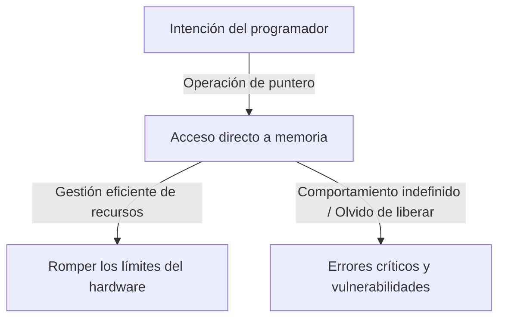
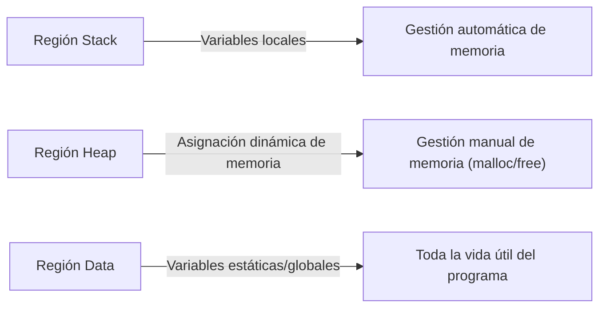

## Introducción: La pesada carga de la "libertad" en C

En la historia de los lenguajes de programación, es raro encontrar un lenguaje como C que haya influido tan profundamente en las generaciones posteriores y se haya mantenido a la vanguardia durante tanto tiempo. Desarrollado por Dennis Ritchie en 1972, este lenguaje nació con el propósito explícito de escribir el sistema operativo Unix. Si su filosofía subyacente pudiera resumirse en una frase, sería "Confía en el programador", una ideología muy simple pero terriblemente resuelta.

Muchos lenguajes de programación modernos (como Java, Python, o más recientemente Go y Rust) proporcionan varias redes de seguridad para evitar que los desarrolladores cometan errores, o para evitar fallos fatales del sistema si se cometen. La gestión automática de memoria a través de la recolección de basura, la comprobación de límites de matrices, la potente inferencia de tipos y los verificadores de préstamos (borrow checkers): todos estos se basan en la filosofía moderna de que "los humanos cometen errores", intentando cubrirlos en el lado del sistema.

Sin embargo, C es diferente. C otorga a los desarrolladores una libertad infinita, pero a cambio, elimina todas las redes de seguridad. El mejor ejemplo de esto es el concepto de "Puntero". Entender los punteros es entender C, y significa tocar la esencia de la arquitectura de computadoras. En este artículo, profundizaremos en el tema de los punteros y la libertad en C, desde sus implicaciones filosóficas hasta sus beneficios prácticos, y su lugar en los paradigmas de programación modernos.

## ¿Qué es un puntero? Diálogo directo con el hardware

Es fácil describir un puntero simplemente como "una variable que almacena una dirección de memoria", pero eso ni siquiera dice la mitad de su verdadero valor. Un puntero es como una "varita mágica" que da a los programadores acceso directo al vasto lienzo del espacio de memoria.

La memoria de la computadora es esencialmente un conjunto unidimensional gigante de 0s y 1s. El sistema operativo abstrae este espacio de memoria y proporciona un espacio de direcciones virtual para cada proceso, pero cuando se ejecuta un programa, los datos siempre se colocan en algún lugar de este espacio.

Al usar punteros, los programadores pueden manipular no solo "el contenido de una variable" sino también "dónde está la variable". Esto permite operaciones avanzadas como:

1. **Paso de datos sin copia (Zero-copy)**: Al pasar estructuras de datos enormes como argumentos de función, en lugar de copiar los datos en sí, pasar solo la ubicación (dirección) donde existen los datos logra una mejora espectacular del rendimiento.
2. **Construcción de estructuras de datos dinámicas**: Los punteros son esenciales para vincular datos dispersos en la memoria para construir estructuras de datos complejas y flexibles como listas enlazadas, árboles y grafos.
3. **Mapeo directo a registros de hardware**: En sistemas embebidos, el acceso a memoria a través de punteros es la única forma de manipular directamente los registros de hardware ubicados en direcciones de memoria específicas.

## El precio de la libertad: La gran responsabilidad de la gestión de memoria

La libertad infinita que brindan los punteros conlleva las "responsabilidades" correspondientes. En C, la asignación y liberación de memoria debe ser manejada completamente a mano por el programador. La memoria asignada por `malloc` nunca se liberará a menos que el programador llame explícitamente a `free`.

Esta filosofía de "gestión manual de la memoria" crea varios riesgos (errores relacionados con la memoria) como:

- **Fuga de memoria (Memory Leak)**: Un fenómeno donde los recursos del sistema se agotan gradualmente al olvidar liberar la memoria asignada.
- **Puntero colgante (Dangling Pointer)**: Un puntero que continúa apuntando a un área de memoria que ya ha sido liberada. Intentar acceder a él causa un comportamiento impredecible y vulnerabilidades de seguridad (Use-After-Free).
- **Desbordamiento de búfer (Buffer Overrun)**: Un fenómeno de escribir datos más allá de los límites del área de memoria asignada. En la historia, es una de las causas que más agujeros de seguridad ha creado.

Estos problemas rara vez ocurren en lenguajes modernos equipados con recolección de basura. Entonces, ¿por qué C continúa manteniendo un diseño tan peligroso? Es para buscar la "previsibilidad del rendimiento" y la "optimización extrema". Es difícil predecir cuándo se ejecutará el recolector de basura (pausas GC), lo que a veces lo hace inadecuado para sistemas que requieren rendimiento en tiempo real o el desarrollo del kernel del sistema operativo. En C, "solo sucede lo que el programador escribe", permitiendo un dominio completo sobre el comportamiento de todo el sistema.

## Punteros a funciones: Cambiando dinámicamente el comportamiento del programa

Los punteros no solo apuntan a datos. Una de las características más potentes y bellas de C es el "Puntero a función". Utilizando punteros a funciones, la dirección donde residen las instrucciones del programa (código) se puede mantener como un puntero y tratarse como una variable.

Los punteros a funciones hacen posible implementar conceptos de "polimorfismo" y "devoluciones de llamada (callbacks)" de lenguajes orientados a objetos incluso en C. Por ejemplo, la función `qsort`, que ordena una matriz, toma un puntero a una función de comparación como argumento, lo que le permite ejecutar de manera flexible los procesos de ordenación independientemente del tipo de datos.

Muchas arquitecturas que logran un alto nivel de abstracción usando C, como el diseño de transiciones de estado (máquinas de estado) o el manejo de interrupciones para controladores de dispositivos en un sistema operativo, se diseñan utilizando hábilmente estos punteros a funciones. Desdibujar los límites entre "datos" y "procedimientos (código)" y permitir que la estructura del programa en sí se reconfigure dinámicamente; esta flexibilidad es la prueba de que C no es solo un lenguaje de bajo nivel.

## Lo que la filosofía de C exige de los ingenieros modernos

En una era donde surgen lenguajes como Rust que equilibran "seguridad y rendimiento", el paradigma del lenguaje C de "punteros y gestión manual de la memoria" podría parecer anticuado. De hecho, los casos en los que se adopta C para nuevos proyectos están disminuyendo.

Sin embargo, el valor de aprender C nunca se ha desvanecido. Escribir C es sinónimo de experimentar de primera mano cómo el sistema operativo gestiona la memoria, cómo la CPU utiliza las memorias caché y cómo las estructuras de datos se asignan en la memoria.

Hay un dicho: "Quien domina los punteros, domina C". Muchos principiantes tropiezan con los punteros, pero cuando superan ese muro y pueden navegar libremente por el vasto océano del espacio de la memoria, sus horizontes como programadores se expanden dramáticamente. Caminar sobre la cuerda floja sin una red de seguridad es peligroso, pero es exactamente por eso que podemos sentir con sensibilidad la fuerza del viento y la tensión de la cuerda, adquiriendo un perfecto sentido del equilibrio.

## Conclusión

La filosofía de C se basa en el equilibrio entre "libertad" y "responsabilidad". Su ideología de diseño de proporcionar el arma poderosa de los punteros y dejar todo a la discreción del programador a veces causa errores críticos, pero al mismo tiempo, es la clave para extraer el potencial del hardware hasta sus límites absolutos.

A medida que el acto de programar evoluciona en una dirección más abstraída, segura y amigable para los humanos, C sigue siendo una presencia valiosa que nos sigue mostrando la "forma cruda" de las computadoras. Cuando nos asomamos al abismo de la memoria a través de punteros, no solo estamos escribiendo código; realmente estamos teniendo un diálogo con la máquina compleja y exquisita conocida como computadora.
