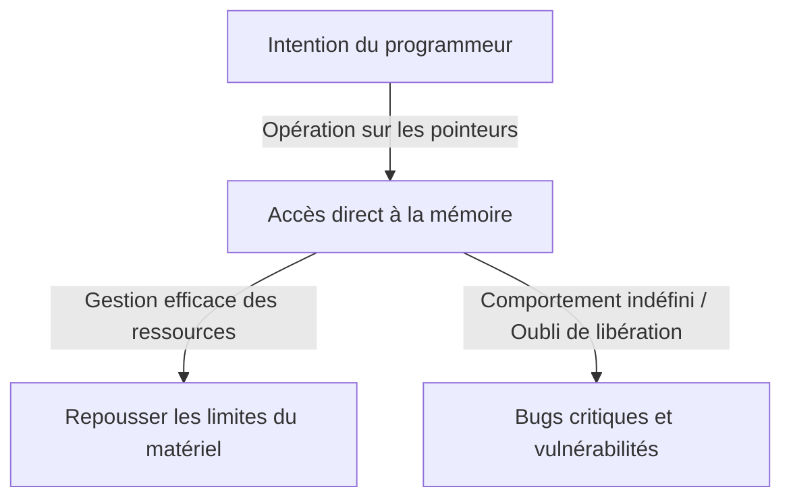
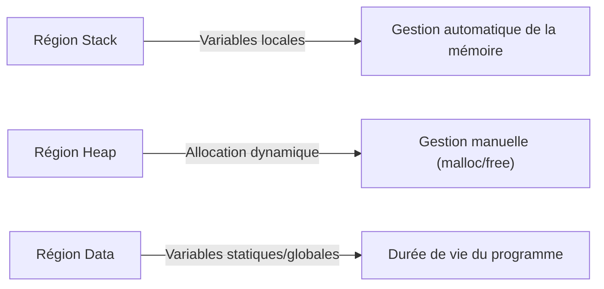

## Introduction : Le lourd fardeau de la "liberté" en C

Dans l'histoire des langages de programmation, il est rare de trouver un langage comme le C qui ait si profondément influencé les générations suivantes et soit resté au premier plan pendant si longtemps. Développé par Dennis Ritchie en 1972, ce langage est né avec l'objectif explicite de coder le système d'exploitation Unix. Si l'on pouvait résumer sa philosophie sous-jacente en une phrase, ce serait "Faites confiance au programmeur" — une idéologie très simple mais terriblement résolue.

De nombreux langages de programmation modernes (tels que Java, Python, ou plus récemment Go et Rust) fournissent divers filets de sécurité pour empêcher les développeurs de commettre des erreurs, ou pour éviter des plantages système fatals si des erreurs sont commises. La gestion automatique de la mémoire via le ramasse-miettes (garbage collection), la vérification des limites des tableaux, la puissante inférence de types et les vérificateurs d'emprunt (borrow checkers) — tout cela repose sur la philosophie moderne selon laquelle "les humains font des erreurs", en essayant de les masquer du côté du système.

Cependant, le C est différent. Le C donne aux développeurs une liberté infinie, mais en retour, il supprime tous les filets de sécurité. Le meilleur exemple en est le concept de "Pointeur". Comprendre les pointeurs, c'est comprendre le C, et cela signifie toucher à l'essence même de l'architecture informatique. Dans cet article, nous plongerons profondément dans le thème des pointeurs et de la liberté en C, depuis ses implications philosophiques jusqu'à ses avantages pratiques, et sa place dans les paradigmes de programmation modernes.

## Qu'est-ce qu'un pointeur : Dialogue direct avec le matériel

Il est facile de décrire un pointeur simplement comme "une variable qui stocke une adresse mémoire", mais cela ne révèle même pas la moitié de sa véritable valeur. Un pointeur est comme une "baguette magique" qui donne aux programmeurs un accès direct à la vaste toile de l'espace mémoire.

La mémoire de l'ordinateur n'est essentiellement qu'un gigantesque tableau unidimensionnel de 0 et de 1. Le système d'exploitation abstrait cet espace mémoire et fournit un espace d'adressage virtuel pour chaque processus, mais lorsqu'un programme est exécuté, les données sont toujours placées quelque part dans cet espace.

En utilisant des pointeurs, les programmeurs peuvent manipuler non seulement "le contenu d'une variable" mais aussi "l'endroit où se trouve la variable". Cela permet des opérations avancées telles que :

1. **Passage de données sans copie (Zero-copy)** : Lors du passage de structures de données énormes comme arguments de fonction, au lieu de copier les données elles-mêmes, le simple fait de passer l'emplacement (adresse) où se trouvent les données permet une amélioration spectaculaire des performances.
2. **Construction de structures de données dynamiques** : Les pointeurs sont essentiels pour relier des données dispersées dans la mémoire afin de construire des structures de données complexes et flexibles telles que les listes chaînées, les arbres et les graphes.
3. **Mappage direct aux registres matériels** : Dans les systèmes embarqués, l'accès à la mémoire via des pointeurs est le seul moyen de manipuler directement les registres matériels situés à des adresses mémoire spécifiques.

## Le prix de la liberté : La lourde responsabilité de la gestion de la mémoire

La liberté infinie apportée par les pointeurs s'accompagne de "responsabilités" correspondantes. En C, l'allocation et la libération de la mémoire doivent être gérées entièrement manuellement par le programmeur. La mémoire allouée par `malloc` ne sera jamais libérée à moins que le programmeur n'appelle explicitement `free`.

Cette philosophie de "gestion manuelle de la mémoire" crée divers risques (bugs liés à la mémoire) tels que :

- **Fuite de mémoire (Memory Leak)** : Un phénomène où les ressources du système s'épuisent progressivement en oubliant de libérer la mémoire allouée.
- **Pointeur fou (Dangling Pointer)** : Un pointeur qui continue de pointer vers une zone mémoire qui a déjà été libérée. Tenter d'y accéder provoque un comportement imprévisible et des vulnérabilités de sécurité (Use-After-Free).
- **Dépassement de tampon (Buffer Overrun)** : Un phénomène d'écriture de données au-delà des limites de la zone mémoire allouée. Dans l'histoire, c'est l'une des causes qui a créé le plus de failles de sécurité.

Ces problèmes se produisent rarement dans les langages modernes équipés d'un ramasse-miettes. Alors pourquoi le C continue-t-il à maintenir une conception aussi dangereuse ? C'est pour rechercher la "prévisibilité des performances" et "l'optimisation extrême". Il est difficile de prédire quand le ramasse-miettes s'exécutera (pauses GC), ce qui le rend parfois inadapté aux systèmes nécessitant des performances en temps réel ou au développement du noyau de l'OS. En C, "seul ce que le programmeur écrit se produit", ce qui permet une maîtrise complète du comportement de l'ensemble du système.

## Pointeurs de fonction : Modifier dynamiquement le comportement du programme

Les pointeurs ne pointent pas seulement vers des données. L'une des fonctionnalités les plus puissantes et les plus belles du C est le "Pointeur de fonction". À l'aide de pointeurs de fonction, l'adresse où résident les instructions du programme (code) peut être conservée comme un pointeur et traitée comme une variable.

Les pointeurs de fonction permettent d'implémenter les concepts de "polymorphisme" et de "rappels (callbacks)" des langages orientés objet même en C. Par exemple, la fonction `qsort`, qui trie un tableau, prend un pointeur vers une fonction de comparaison comme argument, ce qui lui permet d'exécuter de manière flexible des processus de tri quel que soit le type de données.

De nombreuses architectures qui atteignent un haut niveau d'abstraction en utilisant le C, comme la conception de transitions d'état (machines à états) ou la gestion des interruptions pour les pilotes de périphériques dans un OS, sont conçues en utilisant habilement ces pointeurs de fonction. Estomper les frontières entre les "données" et les "procédures (code)" et permettre à la structure du programme elle-même d'être reconfigurée dynamiquement, cette flexibilité est la preuve que le C n'est pas seulement un langage de bas niveau.

## Ce que la philosophie du C demande aux ingénieurs modernes

À une époque où émergent des langages comme Rust qui équilibrent "sécurité et performances", le paradigme du langage C des "pointeurs et de la gestion manuelle de la mémoire" pourrait sembler démodé. En effet, les cas d'adoption du C pour de nouveaux projets sont en baisse.

Cependant, la valeur de l'apprentissage du C ne s'est jamais estompée. Écrire en C est synonyme d'expérimenter de première main comment le système d'exploitation gère la mémoire, comment le CPU utilise les caches, et comment les structures de données sont mappées en mémoire.

Il y a un dicton : "Celui qui maîtrise les pointeurs maîtrise le C". De nombreux débutants trébuchent sur les pointeurs, mais lorsqu'ils surmontent ce mur et peuvent naviguer librement dans le vaste océan de l'espace mémoire, leurs horizons en tant que programmeurs s'élargissent considérablement. Marcher sur une corde raide sans filet de sécurité est dangereux, mais c'est exactement pour cela que nous pouvons ressentir avec sensibilité la force du vent et la tension de la corde, acquérant ainsi un sens parfait de l'équilibre.

## Conclusion

La philosophie du C repose sur le compromis entre "liberté" et "responsabilité". Son idéologie de conception consistant à fournir l'arme puissante des pointeurs et à tout laisser à la discrétion du programmeur provoque parfois des bugs critiques, mais en même temps, c'est la clé pour exploiter le potentiel du matériel jusqu'à ses limites absolues.

Alors que l'acte de programmer évolue dans une direction plus abstraite, plus sûre et plus conviviale pour l'homme, le C reste une présence précieuse qui continue de nous montrer la "forme brute" des ordinateurs. Lorsque nous scrutons l'abîme de la mémoire à travers des pointeurs, nous ne faisons pas qu'écrire du code ; nous avons véritablement un dialogue avec la machine complexe et exquise qu'est l'ordinateur.
