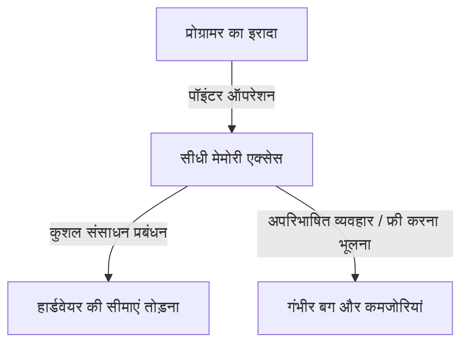
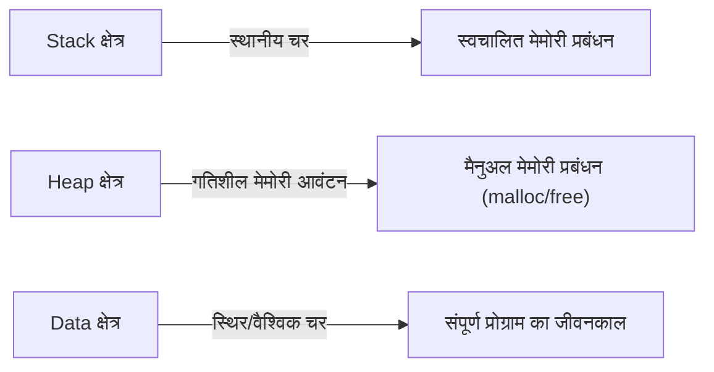

## परिचय: C में "स्वतंत्रता" का भारी बोझ

प्रोग्रामिंग भाषाओं के इतिहास में, C जैसी भाषा को खोजना दुर्लभ है जिसने बाद की पीढ़ियों को इतनी गहराई से प्रभावित किया हो और इतने लंबे समय तक सबसे आगे रही हो। 1972 में डेनिस रिची द्वारा विकसित, इस भाषा का जन्म यूनिक्स (Unix) ऑपरेटिंग सिस्टम लिखने के स्पष्ट उद्देश्य के साथ हुआ था। यदि इसके अंतर्निहित दर्शन को एक वाक्य में संक्षेप में प्रस्तुत किया जा सकता है, तो वह होगा "प्रोग्रामर पर भरोसा करें" (Trust the programmer) — एक बहुत ही सरल लेकिन भयानक रूप से दृढ़ विचारधारा।

कई आधुनिक प्रोग्रामिंग भाषाएं (जैसे Java, Python, या हाल ही में Go और Rust) डेवलपर्स को गलतियां करने से रोकने के लिए, या यदि गलतियां होती हैं तो घातक सिस्टम क्रैश को रोकने के लिए विभिन्न सुरक्षा जाल (safety nets) प्रदान करती हैं। कचरा संग्रहण (garbage collection) के माध्यम से स्वचालित मेमोरी प्रबंधन, सरणी सीमा की जाँच (array bounds checking), शक्तिशाली प्रकार अनुमान (type inference) और बॉरो चेकर्स (borrow checkers) — ये सभी आधुनिक दर्शन पर आधारित हैं कि "इंसान गलतियाँ करते हैं," और इसे सिस्टम की तरफ से कवर करने का प्रयास करते हैं।

हालाँकि, C अलग है। C डेवलपर्स को अनंत स्वतंत्रता देता है, लेकिन बदले में, यह सभी सुरक्षा जाल हटा देता है। इसका सबसे अच्छा उदाहरण "पॉइंटर" (Pointer) की अवधारणा है। पॉइंटर्स को समझना C को समझना है, और इसका अर्थ है कंप्यूटर आर्किटेक्चर के सार को छूना। इस लेख में, हम C में पॉइंटर्स और स्वतंत्रता के विषय पर गहराई से विचार करेंगे, इसके दार्शनिक निहितार्थों से लेकर व्यावहारिक लाभों तक, और आधुनिक प्रोग्रामिंग प्रतिमानों में इसके स्थान तक।

## पॉइंटर क्या है: हार्डवेयर के साथ सीधा संवाद

किसी पॉइंटर को केवल "एक चर जो मेमोरी एड्रेस को संग्रहीत करता है" के रूप में वर्णित करना आसान है, लेकिन यह इसके वास्तविक मूल्य का आधा भी नहीं बताता है। एक पॉइंटर एक "जादू की छड़ी" की तरह है जो प्रोग्रामर को मेमोरी स्पेस के विशाल कैनवास तक सीधी पहुंच प्रदान करता है।

कंप्यूटर की मेमोरी मूल रूप से केवल 0 और 1 का एक विशाल एक-आयामी सरणी है। ऑपरेटिंग सिस्टम इस मेमोरी स्पेस को सारगर्भित करता है और प्रत्येक प्रक्रिया के लिए एक वर्चुअल एड्रेस स्पेस प्रदान करता है, लेकिन जब कोई प्रोग्राम निष्पादित होता है, तो डेटा हमेशा इस स्पेस में कहीं रखा जाता है।

पॉइंटर्स का उपयोग करके, प्रोग्रामर न केवल "चर की सामग्री" बल्कि यह भी हेरफेर कर सकते हैं कि "चर कहां है"। यह उन्नत संचालन को सक्षम बनाता है जैसे:

1. **जीरो-कॉपी (Zero-copy) डेटा पासिंग**: विशाल डेटा संरचनाओं को फ़ंक्शन तर्कों के रूप में पास करते समय, डेटा को स्वयं कॉपी करने के बजाय, केवल उस स्थान (पते) को पास करना जहां डेटा मौजूद है, प्रदर्शन में नाटकीय सुधार का एहसास कराता है।
2. **गतिशील डेटा संरचनाओं का निर्माण**: मेमोरी में बिखरे हुए डेटा को जोड़ने के लिए जटिल और लचीले डेटा संरचनाओं जैसे लिंक्ड लिस्ट (Linked List), ट्री (Tree) और ग्राफ़ (Graph) के निर्माण के लिए पॉइंटर्स आवश्यक हैं।
3. **हार्डवेयर रजिस्टरों के लिए सीधी मैपिंग**: एम्बेडेड सिस्टम में, पॉइंटर्स के माध्यम से मेमोरी एक्सेस विशिष्ट मेमोरी एड्रेस पर स्थित हार्डवेयर रजिस्टरों में सीधे हेरफेर करने का एकमात्र तरीका है।

## स्वतंत्रता की कीमत: मेमोरी प्रबंधन की भारी जिम्मेदारी

पॉइंटर्स द्वारा लाई गई अनंत स्वतंत्रता संबंधित "जिम्मेदारियों" के साथ आती है। C में, मेमोरी आवंटन और डी-आवंटन को पूरी तरह से प्रोग्रामर द्वारा मैन्युअल रूप से नियंत्रित किया जाना चाहिए। `malloc` द्वारा आवंटित मेमोरी तब तक कभी मुक्त नहीं होगी जब तक प्रोग्रामर स्पष्ट रूप से `free` को कॉल न करे।

"मैनुअल मेमोरी प्रबंधन" का यह दर्शन विभिन्न जोखिम (मेमोरी-संबंधित बग) पैदा करता है जैसे:

- **मेमोरी लीक (Memory Leak)**: एक ऐसी घटना जहां आवंटित मेमोरी को मुक्त करना भूल जाने से सिस्टम संसाधन धीरे-धीरे कम हो जाते हैं।
- **डैंगलिंग पॉइंटर (Dangling Pointer)**: एक पॉइंटर जो उस मेमोरी क्षेत्र को इंगित करता रहता है जिसे पहले ही मुक्त किया जा चुका है। इसे एक्सेस करने का प्रयास अप्रत्याशित व्यवहार और सुरक्षा कमजोरियों (Use-After-Free) का कारण बनता है।
- **बफर ओवररन (Buffer Overrun)**: आवंटित मेमोरी क्षेत्र की सीमाओं से परे डेटा लिखने की एक घटना। इतिहास में, यह उन कारणों में से एक है जिसने सबसे अधिक सुरक्षा छेद (security holes) बनाए हैं।

ये समस्याएं कचरा संग्रहण (garbage collection) से लैस आधुनिक भाषाओं में शायद ही कभी होती हैं। तो फिर C इतना खतरनाक डिज़ाइन क्यों बनाए रखता है? यह "प्रदर्शन की भविष्यवाणी" और "अत्यधिक अनुकूलन" को आगे बढ़ाने के लिए है। यह अनुमान लगाना मुश्किल है कि कचरा संग्रहकर्ता कब चलेगा (GC पॉज़), जिससे यह कभी-कभी उन प्रणालियों के लिए अनुपयुक्त हो जाता है जिन्हें रीयल-टाइम प्रदर्शन या OS कर्नेल विकास की आवश्यकता होती है। C में, "केवल वही होता है जो प्रोग्रामर लिखता है", जिससे पूरे सिस्टम के व्यवहार पर पूर्ण निपुणता मिलती है।

## फ़ंक्शन पॉइंटर्स: प्रोग्राम के व्यवहार को गतिशील रूप से बदलना

पॉइंटर्स केवल डेटा को इंगित नहीं करते हैं। C में सबसे शक्तिशाली और सुंदर विशेषताओं में से एक "फ़ंक्शन पॉइंटर" (Function Pointer) है। फ़ंक्शन पॉइंटर्स का उपयोग करके, वह पता जहां प्रोग्राम निर्देश (कोड) रहते हैं, एक पॉइंटर के रूप में रखा जा सकता है और एक चर की तरह व्यवहार किया जा सकता है।

फ़ंक्शन पॉइंटर्स C में भी ऑब्जेक्ट-ओरिएंटेड भाषाओं से "बहुरूपता" (Polymorphism) और "कॉल बैक" (callbacks) की अवधारणाओं को लागू करना संभव बनाते हैं। उदाहरण के लिए, `qsort` फ़ंक्शन, जो एक सरणी को सॉर्ट करता है, एक तर्क के रूप में एक तुलना फ़ंक्शन के पॉइंटर को लेता है, जिससे यह डेटा प्रकार की परवाह किए बिना सॉर्टिंग प्रक्रियाओं को लचीले ढंग से निष्पादित कर सकता है।

कई आर्किटेक्चर जो C का उपयोग करके उच्च-स्तरीय अमूर्तता (abstraction) प्राप्त करते हैं, जैसे कि स्टेट ट्रांज़िशन (स्टेट मशीन) को डिज़ाइन करना या OS में डिवाइस ड्राइवरों के लिए इंटरप्ट हैंडलिंग, इन फ़ंक्शन पॉइंटर्स का कुशलतापूर्वक उपयोग करके डिज़ाइन किए गए हैं। "डेटा" और "प्रक्रियाओं (कोड)" के बीच की सीमाओं को धुंधला करना और प्रोग्राम की संरचना को गतिशील रूप से पुन: कॉन्फ़िगर करने की अनुमति देना, यह लचीलापन इस बात का प्रमाण है कि C केवल एक निम्न-स्तरीय भाषा नहीं है।

## C का दर्शन आधुनिक इंजीनियरों से क्या मांगता है

एक ऐसे युग में जहाँ Rust जैसी भाषाएँ उभर रही हैं जो "सुरक्षा और प्रदर्शन" को संतुलित करती हैं, "पॉइंटर्स और मैनुअल मेमोरी प्रबंधन" का C भाषा प्रतिमान पुराने ढंग का लग सकता है। दरअसल, नई परियोजनाओं के लिए C को अपनाए जाने के मामले घट रहे हैं।

हालाँकि, C सीखने का मूल्य कभी फीका नहीं पड़ा है। C लिखना इस बात का प्रत्यक्ष अनुभव करने का पर्याय है कि ऑपरेटिंग सिस्टम मेमोरी का प्रबंधन कैसे करता है, CPU कैश का उपयोग कैसे करता है, और डेटा संरचनाओं को मेमोरी पर कैसे मैप किया जाता है।

एक कहावत है, "जो पॉइंटर्स में महारत हासिल करता है वह C में महारत हासिल करता है।" कई शुरुआती पॉइंटर्स पर ठोकर खाते हैं, लेकिन जब वे उस दीवार को पार कर लेते हैं और मेमोरी स्पेस के विशाल महासागर में स्वतंत्र रूप से नेविगेट कर सकते हैं, तो प्रोग्रामर के रूप में उनके क्षितिज का नाटकीय रूप से विस्तार होता है। सुरक्षा जाल के बिना तनी हुई रस्सी पर चलना खतरनाक है, लेकिन ठीक इसी वजह से हम हवा की ताकत और रस्सी के तनाव को संवेदनशीलता से महसूस कर सकते हैं, जिससे संतुलन की सही भावना प्राप्त होती है।

## निष्कर्ष

C का दर्शन "स्वतंत्रता" और "जिम्मेदारी" के बीच व्यापार-बंद (trade-off) पर बना है। पॉइंटर्स का शक्तिशाली हथियार प्रदान करने और सब कुछ प्रोग्रामर के विवेक पर छोड़ने की इसकी डिज़ाइन विचारधारा कभी-कभी महत्वपूर्ण बग का कारण बनती है, लेकिन साथ ही, यह हार्डवेयर की क्षमता को उसकी पूर्ण सीमाओं तक खींचने की कुंजी है।

चूँकि प्रोग्रामिंग का कार्य अधिक अमूर्त, सुरक्षित और मानव-अनुकूल दिशा में विकसित होता है, C एक मूल्यवान उपस्थिति बनी हुई है जो हमें कंप्यूटर का "कच्चा रूप" दिखाती रहती है। जब हम पॉइंटर्स के माध्यम से मेमोरी के गर्त में झांकते हैं, तो हम सिर्फ कोड नहीं लिख रहे होते हैं; हम वास्तव में कंप्यूटर नामक जटिल और उत्कृष्ट मशीन के साथ संवाद कर रहे होते हैं।
