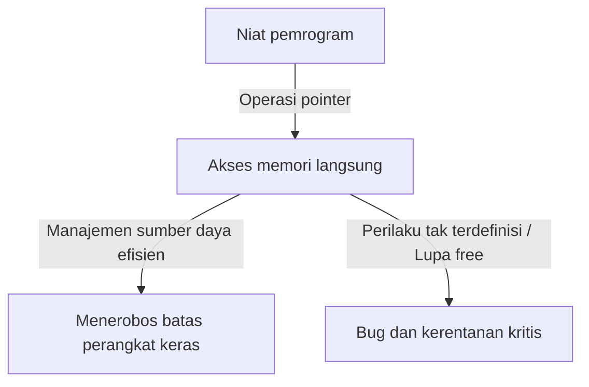
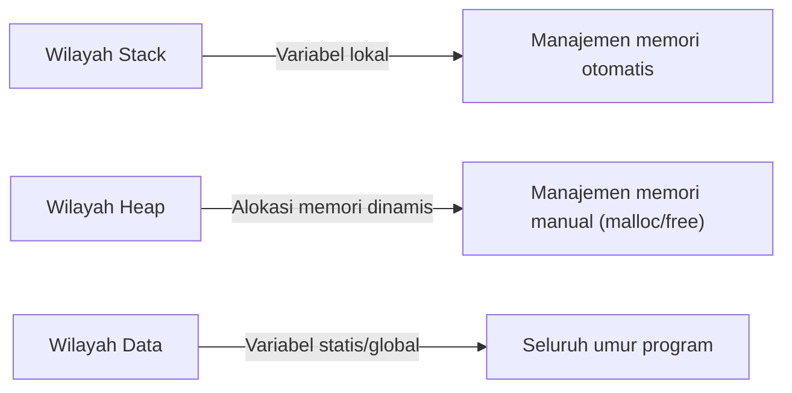

## Pengantar: Beban Berat dari "Kebebasan" dalam C

Dalam sejarah bahasa pemrograman, jarang ditemukan bahasa seperti C yang sangat memengaruhi generasi berikutnya dan tetap berada di garis depan selama itu. Dikembangkan oleh Dennis Ritchie pada tahun 1972, bahasa ini lahir dengan tujuan eksplisit untuk menulis sistem operasi Unix. Jika filosofi yang mendasarinya dapat disimpulkan dalam satu frasa, itu adalah "Percayai pemrogram" — sebuah ideologi yang sangat sederhana namun sangat teguh.

Banyak bahasa pemrograman modern (seperti Java, Python, atau yang lebih baru Go dan Rust) menyediakan berbagai jaring pengaman untuk mencegah pengembang membuat kesalahan, atau untuk mencegah kerusakan sistem yang fatal jika terjadi kesalahan. Manajemen memori otomatis melalui pengumpulan sampah (garbage collection), pemeriksaan batas array, inferensi tipe yang kuat, dan pemeriksa peminjaman (borrow checkers) — ini semua didasarkan pada filosofi modern bahwa "manusia membuat kesalahan," mencoba menutupi mereka di sisi sistem.

Namun, C berbeda. C memberi pengembang kebebasan tak terbatas, tetapi sebagai imbalannya, ia menghilangkan semua jaring pengaman. Contoh utama dari ini adalah konsep "Pointer". Memahami pointer berarti memahami C, dan itu berarti menyentuh esensi arsitektur komputer. Dalam artikel ini, kita akan menggali lebih dalam tema pointer dan kebebasan dalam C, dari implikasi filosofisnya hingga manfaat praktisnya, dan tempatnya dalam paradigma pemrograman modern.

## Apa itu Pointer: Dialog Langsung dengan Perangkat Keras

Sangat mudah untuk mendeskripsikan pointer secara sederhana sebagai "variabel yang menyimpan alamat memori", tetapi itu bahkan tidak menceritakan separuh dari nilai sebenarnya. Pointer ibarat "tongkat ajaib" yang memberi pemrogram akses langsung ke kanvas ruang memori yang luas.

Memori komputer pada dasarnya hanyalah susunan satu dimensi raksasa dari angka 0 dan 1. Sistem operasi mengabstraksi ruang memori ini dan menyediakan ruang alamat virtual untuk setiap proses, tetapi ketika sebuah program dieksekusi, data selalu ditempatkan di suatu tempat di ruang ini.

Dengan menggunakan pointer, pemrogram tidak hanya dapat memanipulasi "isi variabel" tetapi juga "di mana variabel itu berada." Hal ini memungkinkan operasi tingkat lanjut seperti:

1. **Penerusan data tanpa salinan (Zero-copy)**: Saat meneruskan struktur data besar sebagai argumen fungsi, daripada menyalin data itu sendiri, meneruskan hanya lokasi (alamat) tempat data tersebut berada akan mewujudkan peningkatan kinerja yang dramatis.
2. **Membangun struktur data dinamis**: Pointer sangat penting untuk menghubungkan data yang tersebar di memori guna membangun struktur data yang kompleks dan fleksibel seperti Linked List, Tree, dan Graph.
3. **Pemetaan langsung ke register perangkat keras**: Dalam sistem tertanam (embedded), akses memori melalui pointer adalah satu-satunya cara untuk memanipulasi langsung register perangkat keras yang terletak di alamat memori tertentu.

## Harga dari Kebebasan: Tanggung Jawab Berat dari Manajemen Memori

Kebebasan tak terbatas yang dibawa oleh pointer datang dengan "tanggung jawab" yang sesuai. Dalam C, alokasi dan dealokasi memori harus ditangani sepenuhnya secara manual oleh pemrogram. Memori yang dialokasikan oleh `malloc` tidak akan pernah dibebaskan kecuali jika pemrogram secara eksplisit memanggil `free`.

Filosofi "manajemen memori manual" ini menciptakan berbagai risiko (bug terkait memori) seperti:

- **Kebocoran Memori (Memory Leak)**: Sebuah fenomena di mana sumber daya sistem secara bertahap habis karena lupa membebaskan memori yang dialokasikan.
- **Pointer Menggantung (Dangling Pointer)**: Pointer yang terus menunjuk ke area memori yang telah dibebaskan. Mencoba mengaksesnya menyebabkan perilaku tak terduga dan kerentanan keamanan (Use-After-Free).
- **Buffer Overrun**: Fenomena menulis data melampaui batas area memori yang dialokasikan. Secara historis, ini adalah salah satu penyebab yang telah menciptakan lubang keamanan terbanyak.

Masalah ini jarang terjadi dalam bahasa modern yang dilengkapi dengan pengumpulan sampah. Lalu mengapa C terus mempertahankan desain berbahaya seperti itu? Ini untuk mengejar "prediktabilitas kinerja" dan "optimasi ekstrem". Sulit untuk memprediksi kapan pengumpul sampah akan berjalan (jeda GC), yang terkadang membuatnya tidak cocok untuk sistem yang memerlukan kinerja waktu nyata atau pengembangan kernel sistem operasi. Dalam C, "hanya yang ditulis pemrogram yang terjadi", yang memungkinkan penguasaan penuh atas perilaku seluruh sistem.

## Pointer Fungsi: Mengubah Perilaku Program Secara Dinamis

Pointer tidak hanya menunjuk ke data. Salah satu fitur paling kuat dan indah di C adalah "Pointer Fungsi". Dengan menggunakan pointer fungsi, alamat tempat instruksi program (kode) berada dapat disimpan sebagai pointer dan diperlakukan seperti variabel.

Pointer fungsi memungkinkan penerapan konsep "polimorfisme" dan "callback" dari bahasa berorientasi objek bahkan dalam C. Misalnya, fungsi `qsort`, yang mengurutkan array, mengambil pointer ke fungsi perbandingan sebagai argumen, sehingga dapat secara fleksibel mengeksekusi proses penyortiran terlepas dari tipe data.

Banyak arsitektur yang mencapai abstraksi tingkat tinggi menggunakan C, seperti merancang transisi status (state machines) atau penanganan interupsi untuk driver perangkat dalam suatu sistem operasi, dirancang dengan secara cerdas memanfaatkan pointer fungsi ini. Mengaburkan batas antara "data" dan "prosedur (kode)" dan memungkinkan struktur program itu sendiri untuk dikonfigurasi ulang secara dinamis, fleksibilitas ini merupakan bukti bahwa C bukan hanya bahasa tingkat rendah.

## Apa yang Dituntut Filosofi C dari Insinyur Modern

Di era di mana bahasa seperti Rust yang menyeimbangkan "keamanan dan kinerja" bermunculan, paradigma bahasa C tentang "pointer dan manajemen memori manual" mungkin tampak kuno. Memang, kasus C yang diadopsi untuk proyek-proyek baru semakin menurun.

Namun, nilai mempelajari C tidak pernah pudar. Menulis C identik dengan mengalami secara langsung bagaimana sistem operasi mengelola memori, bagaimana CPU memanfaatkan cache, dan bagaimana struktur data dipetakan ke memori.

Ada pepatah yang mengatakan, "Dia yang menguasai pointer akan menguasai C." Banyak pemula tersandung pada pointer, tetapi ketika mereka melewati tembok itu dan dapat dengan bebas menavigasi lautan luas ruang memori, cakrawala mereka sebagai pemrogram berkembang secara dramatis. Berjalan di atas tali tanpa jaring pengaman memang berbahaya, tetapi justru karena itulah kita bisa merasakan secara sensitif kekuatan angin dan ketegangan tali, sehingga memperoleh keseimbangan yang sempurna.

## Kesimpulan

Filosofi C dibangun di atas pertukaran antara "kebebasan" dan "tanggung jawab". Ideologi desainnya yang menyediakan senjata ampuh berupa pointer dan menyerahkan segalanya pada kebijaksanaan pemrogram terkadang menyebabkan bug kritis, tetapi pada saat yang sama, ini adalah kunci untuk mengeluarkan potensi perangkat keras hingga batas mutlaknya.

Seiring tindakan pemrograman berkembang ke arah yang lebih diabstraksikan, lebih aman, dan ramah manusia, C tetap menjadi kehadiran berharga yang terus menunjukkan kepada kita "bentuk mentah" komputer. Ketika kita mengintip ke dalam jurang memori melalui pointer, kita tidak hanya sekadar menulis kode; kita benar-benar sedang berdialog dengan mesin kompleks dan istimewa yang dikenal sebagai komputer.
