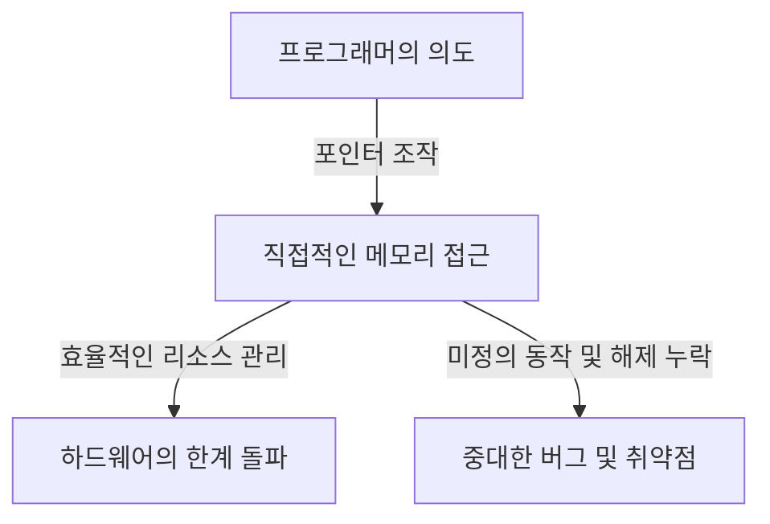
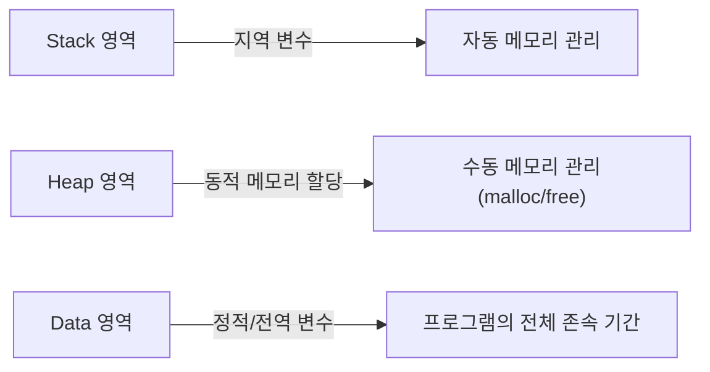

## 시작하며: C언어가 가진 '자유'라는 이름의 중압감

프로그래밍 언어의 역사에 있어서 C언어만큼 후세에 지대한 영향을 미치고 오랜 기간 최전선에서 계속 활약하고 있는 언어는 드뭅니다. 1972년 데니스 리치에 의해 개발된 이 언어는 Unix 운영 체제를 작성한다는 명확한 목적 하에 탄생했습니다. 그 밑바탕에 흐르는 철학을 한마디로 표현하자면, 그것은 '프로그래머를 신뢰하라(Trust the programmer)'라는 매우 단순하지만 두려울 정도의 각오를 수반하는 사상입니다.

현대의 많은 프로그래밍 언어(예를 들어 Java, Python 또는 최근의 Go나 Rust 등)는 개발자가 실수를 저지르지 않도록, 혹은 실수를 하더라도 치명적인 시스템 크래시로 이어지지 않도록 다양한 안전 장치(안전망)를 제공하고 있습니다. 가비지 컬렉션에 의한 자동 메모리 관리, 배열의 경계 검사, 강력한 타입 추론과 빌로우 체커 등 이들은 모두 '인간은 실수를 하는 생물이다'라는 전제에 서서 시스템 측에서 그것을 커버하려는 현대적인 철학에 기반하고 있습니다.

하지만 C언어는 다릅니다. C언어는 개발자에게 무한한 자유를 주지만, 그 대가로 일체의 안전망을 제거했습니다. 그 대표적인 예가 '포인터(Pointer)'라는 개념입니다. 포인터를 이해하는 것은 C언어를 이해하는 것이며, 컴퓨터 아키텍처의 진수에 닿는 것을 의미합니다. 본 기사에서는 C언어에 있어서의 포인터와 자유라는 주제에 대해 그 철학적인 의미부터 실천적인 혜택, 그리고 현대의 프로그래밍 패러다임에 있어서의 위치까지 깊이 파고들어 보겠습니다.

## 포인터란 무엇인가: 하드웨어와의 직접적인 대화

포인터를 단순한 '메모리 주소를 저장하는 변수'라고 표현하기는 쉽지만, 그것은 포인터의 진정한 가치를 절반도 말해주지 않습니다. 포인터는 프로그래머에게 메모리 공간이라는 광대한 캔버스에 대한 직접적인 접근 권한을 부여하는 '마법의 지팡이'와 같은 것입니다.

컴퓨터의 메모리는 본질적으로 0과 1이 늘어선 거대한 1차원 배열에 불과합니다. 운영 체제는 이 메모리 공간을 추상화하여 프로세스마다 가상 주소 공간을 제공하지만, 프로그램이 실행될 때 데이터는 반드시 이 공간상의 어딘가에 배치됩니다.

포인터를 사용함으로써 프로그래머는 '변수의 내용'뿐만 아니라 '변수가 어디에 있는지'를 조작할 수 있습니다. 이를 통해 다음과 같은 고도화된 조작이 가능해집니다.

1. **제로 카피(Zero-copy) 데이터 전달**: 거대한 데이터 구조를 함수의 인수로 전달할 때 데이터 자체를 복사하는 것이 아니라 데이터가 존재하는 위치(주소)만을 전달함으로써 극적인 성능 향상을 실현합니다.
2. **동적 데이터 구조의 구축**: 연결 리스트(Linked List), 트리(Tree), 그래프(Graph) 등 메모리상에 산재한 데이터를 결합하여 복잡하고 유연한 데이터 구조를 구축하기 위해서는 포인터가 필수적입니다.
3. **하드웨어 레지스터로의 직접 매핑**: 임베디드 시스템에서 특정 메모리 주소에 배치된 하드웨어 레지스터를 직접 조작하기 위해서는 포인터를 매개로 한 메모리 접근이 유일한 수단이 됩니다.

## 자유의 대가: 메모리 관리의 무거운 책임

포인터에 의해 주어지는 무한한 자유에는 그에 상응하는 '책임'이 뒤따릅니다. C언어에서는 메모리 할당과 해제가 완전히 프로그래머의 수동으로 이루어져야 합니다. `malloc`을 통해 할당된 메모리는 프로그래머가 명시적으로 `free`를 호출하지 않는 한 영원히 해제되지 않습니다.

이 '수동 메모리 관리'라는 철학은 다음과 같은 다양한 위험(메모리 관련 버그)을 낳습니다.

- **메모리 누수(Memory Leak)**: 할당한 메모리를 해제하는 것을 잊음으로써 시스템 리소스가 서서히 고갈되는 현상.
- **댕글링 포인터(Dangling Pointer)**: 이미 해제된 메모리 영역을 계속 가리키는 포인터. 이에 접근하려고 하면 예측할 수 없는 동작이나 보안 취약점(Use-After-Free)을 유발합니다.
- **버퍼 오버런(Buffer Overrun)**: 할당된 메모리 영역의 경계를 넘어 데이터를 기록해 버리는 현상. 역사상 가장 많은 보안 허점을 낳은 원인 중 하나입니다.

이러한 문제들은 가비지 컬렉션을 갖춘 현대의 언어에서는 거의 발생하지 않습니다. 그렇다면 왜 C언어는 이처럼 위험성을 내포한 설계를 계속 유지하고 있는 것일까요? 그것은 '성능의 예측 가능성'과 '극한의 최적화'를 추구하기 때문입니다. 가비지 컬렉터는 언제 메모리 회수 처리가 실행될지(GC 일시 정지)를 예측하기 어려워, 실시간성이 요구되는 시스템이나 OS 커널 개발에는 적합하지 않은 경우가 있습니다. C언어에서는 '프로그래머가 작성한 대로의 일만 일어나기' 때문에 시스템 전체의 동작을 완전히 장악할 수 있는 것입니다.

## 함수 포인터: 프로그램의 동작을 동적으로 변경

포인터가 가리키는 것은 데이터뿐만이 아닙니다. C언어에 있어서 가장 강력하고 아름다운 기능 중 하나가 '함수 포인터(Function Pointer)'입니다. 함수 포인터를 사용하면 프로그램상의 명령(코드)이 존재하는 주소를 포인터로 유지하고, 이를 변수처럼 다룰 수 있습니다.

함수 포인터를 통해 C언어에서도 객체 지향 언어의 '다형성(Polymorphism)'이나 '콜백(Callback)' 개념을 구현하는 것이 가능합니다. 예를 들어 배열의 정렬을 수행하는 `qsort` 함수는 비교 함수에 대한 포인터를 인수로 취함으로써 어떤 데이터형이든 유연하게 정렬 처리를 실행할 수 있습니다.

상태 전이(상태 머신) 설계나 OS의 디바이스 드라이버 인터럽트 처리 등, C언어를 사용하여 고도의 추상화를 실현하는 아키텍처의 대부분은 이 함수 포인터를 교묘하게 이용하여 설계되어 있습니다. '데이터'와 '절차(코드)'의 경계선을 모호하게 하고, 프로그램의 구조 자체를 동적으로 재구성할 수 있는 이 유연성이야말로 C언어가 단순한 저급 언어에 머무르지 않는 증거라고 할 수 있을 것입니다.

## C언어의 철학이 현대 엔지니어에게 묻는 것

Rust와 같이 '안전성과 성능'을 양립시킨 언어가 대두되는 현대에 있어서 C언어가 가진 '포인터와 수동 메모리 관리'라는 패러다임은 구식으로 비칠지도 모릅니다. 실제로 신규 프로젝트에서 C언어가 채택되는 사례는 감소 추세에 있습니다.

하지만 C언어를 배우는 것의 가치는 결코 퇴색되지 않았습니다. C언어를 작성한다는 것은 운영 체제가 어떻게 메모리를 관리하고, CPU가 어떻게 캐시를 이용하며, 데이터 구조가 어떻게 메모리상에 매핑되는지를 피부로 느끼는 것과 동의어입니다.

"포인터를 지배하는 자가 C언어를 지배한다"는 말이 있습니다. 포인터에서 좌절하는 초보자가 많지만, 그 벽을 넘어 메모리 공간이라는 광대한 바다를 자유자재로 항해할 수 있게 되었을 때 프로그래머로서의 시야는 극적으로 넓어집니다. 안전망 없는 줄타기는 위험하지만, 그렇기 때문에 우리는 바람의 세기나 밧줄의 장력을 민감하게 느끼고 완벽한 균형 감각을 익힐 수 있는 것입니다.

## 결론

C언어의 철학은 '자유'와 '책임'의 트레이드오프 위에서 성립되어 있습니다. 포인터라는 강력한 무기를 부여하고 모든 것을 프로그래머의 재량에 맡기는 그 설계 사상은 때로 중대한 버그를 일으키는 원인이 되기도 하지만, 동시에 하드웨어의 잠재력을 극한까지 끌어내기 위한 열쇠이기도 합니다.

프로그래밍이라는 행위가 더욱 추상화되고, 안전하며, 인간 친화적인 방향으로 진화해 가는 가운데 C언어는 컴퓨터의 '날 것 그대로의 모습'을 우리에게 계속 보여주는 귀중한 존재입니다. 포인터를 통해 메모리의 심연을 들여다볼 때, 우리는 단순히 코드를 작성하고 있는 것이 아니라 컴퓨터라는 복잡하고 정교한 기계와 진정한 대화를 하고 있는 것이라고 할 수 있을 것입니다.
