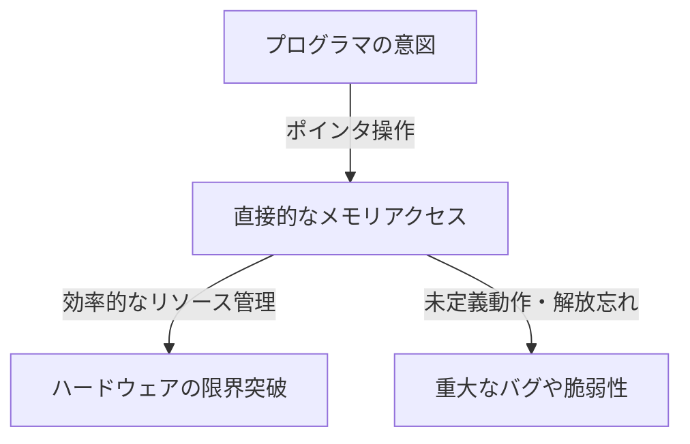
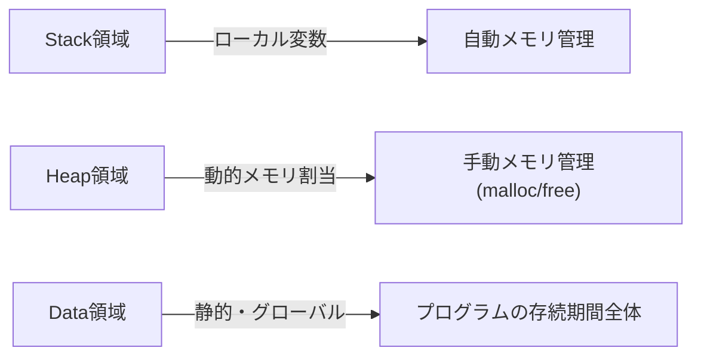

## はじめに：C言語がもつ「自由」という名の重圧

プログラミング言語の歴史において、C言語ほど後世に多大な影響を与え、かつ長きにわたって第一線で活躍し続けている言語は稀です。1972年に[デニス・リッチー](/p/biography-dennis-ritchie/)によって開発されたこの言語は、Unixオペレーティングシステムを記述するという明確な目的のもとに誕生しました。その根底に流れる哲学を一言で表すならば、それは「プログラマを信頼する（Trust the programmer）」という極めてシンプルな、しかし恐ろしいほどの覚悟を伴う思想です。

現代の多くのプログラミング言語（例えばJava、Python、あるいはより最近のGoやRustなど）は、開発者が過ちを犯さないように、あるいは過ちを犯したとしても致命的なシステムクラッシュに至らないように、様々な安全装置（セーフティネット）を提供しています。ガベージコレクションによる自動メモリ管理、配列の境界チェック、強力な型推論とボローチェッカーなど、これらはすべて「人間はミスをする生き物である」という前提に立ち、システム側でそれをカバーしようとする現代的な哲学に基づいています。

しかし、C言語は違います。C言語は開発者に対して無限の自由を与えますが、その代償として一切のセーフティネットを取り払っています。その最たる例が「[ポインタ](/p/c-language-pointers-memory-management-stack-heap/)（Pointer）」という概念です。[ポインタ](/p/c-language-pointers-memory-management-stack-heap/)を理解することは、C言語を理解することであり、コンピュータアーキテクチャの真髄に触れることを意味します。本記事では、C言語における[ポインタ](/p/c-language-pointers-memory-management-stack-heap/)と自由というテーマについて、その哲学的な意味合いから実践的な恩恵、そして現代のプログラミングパラダイムにおける位置づけまでを深く掘り下げていきます。

## ポインタとは何か：ハードウェアとの直接対話

[ポインタ](/p/c-language-pointers-memory-management-stack-heap/)を単なる「メモリアドレスを格納する変数」と表現するのは容易ですが、それは[ポインタ](/p/c-language-pointers-memory-management-stack-heap/)の真の価値を半分も語っていません。[ポインタ](/p/c-language-pointers-memory-management-stack-heap/)は、プログラマに対してメモリ空間という広大なキャンバスへの直接的なアクセス権を与える「魔法の杖」のようなものです。

コンピュータのメモリは、本質的には0と1が並んだ巨大な一次元の配列に過ぎません。オペレーティングシステムはこのメモリ空間を抽象化し、プロセスごとに仮想的なアドレス空間を提供しますが、プログラムが実行される際、データは必ずこの空間上のどこかに配置されます。

[ポインタ](/p/c-language-pointers-memory-management-stack-heap/)を使用することで、プログラマは「変数の中身」だけでなく「変数がどこにあるか」を操作することができます。これにより、以下のような高度な操作が可能になります。

1. **ゼロコピー（Zero-copy）でのデータ受け渡し**: 巨大なデータ構造を関数の引数として渡す際、データそのものをコピーするのではなく、データが存在する場所（アドレス）のみを渡すことで、劇的なパフォーマンス向上を実現します。
2. **動的データ構造の構築**: 連結リスト（Linked List）、木構造（Tree）、グラフ（Graph）など、メモリ上に散在するデータを結びつけ、複雑で柔軟なデータ構造を構築するためには[ポインタ](/p/c-language-pointers-memory-management-stack-heap/)が不可欠です。
3. **ハードウェアレジスタへの直接マッピング**: 組み込みシステムにおいて、特定のメモリアドレスに配置されたハードウェアのレジスタを直接操作するためには、[ポインタ](/p/c-language-pointers-memory-management-stack-heap/)を介したメモリアクセスが唯一の手段となります。

## 自由の代償：メモリ管理の重い責任

[ポインタ](/p/c-language-pointers-memory-management-stack-heap/)によってもたらされる無限の自由には、それ相応の「責任」が伴います。C言語では、メモリの確保と解放は完全にプログラマの手動で行われなければなりません。`malloc` によって割り当てられたメモリは、プログラマが明示的に `free` を呼び出さない限り、永遠に解放されることはありません。

この「手動メモリ管理」という哲学は、以下のような様々なリスク（メモリ関連のバグ）を生み出します。

- **メモリリーク (Memory Leak)**: 確保したメモリを解放し忘れることで、システムのリソースが徐々に枯渇していく現象。
- **ダングリング[ポインタ](/p/c-language-pointers-memory-management-stack-heap/) (Dangling Pointer)**: 既に解放されたメモリ領域を指し示し続ける[ポインタ](/p/c-language-pointers-memory-management-stack-heap/)。これにアクセスしようとすると、予測不可能な動作やセキュリティ脆弱性（Use-After-Free）を引き起こします。
- **バッファオーバーラン (Buffer Overrun)**: 確保されたメモリ領域の境界を越えてデータを書き込んでしまう現象。歴史上、最も多くのセキュリティホールを生み出してきた原因の一つです。

これらの問題は、現代のガベージコレクションを備えた言語ではほとんど発生しません。では、なぜC言語はこのような危険性を孕んだ設計を維持し続けているのでしょうか。それは「パフォーマンスの予測可能性」と「極限の最適化」を追求するためです。ガベージコレクタは、いつメモリ回収の処理が走るか（GCポーズ）を予測することが難しく、リアルタイム性が求められるシステムやOSのカーネル開発には不向きな場合があります。C言語では「プログラマが記述した通りのことしか起きない」ため、システム全体の挙動を完全に掌握することができるのです。

## 関数ポインタ：プログラムの振る舞いを動的に変える

[ポインタ](/p/c-language-pointers-memory-management-stack-heap/)が指し示すのはデータだけではありません。C言語において最も強力で、そして美しい機能の一つが「関数[ポインタ](/p/c-language-pointers-memory-management-stack-heap/)（Function Pointer）」です。関数[ポインタ](/p/c-language-pointers-memory-management-stack-heap/)を使用すると、プログラム上の命令（コード）が存在するアドレスを[ポインタ](/p/c-language-pointers-memory-management-stack-heap/)として保持し、それを変数のように扱うことができます。

関数[ポインタ](/p/c-language-pointers-memory-management-stack-heap/)によって、C言語でもオブジェクト指向言語における「ポリモーフィズム（多態性）」や「コールバック」の概念を実装することが可能です。例えば、配列のソートを行う `qsort` 関数は、比較関数への[ポインタ](/p/c-language-pointers-memory-management-stack-heap/)を引数に取ることで、どのようなデータ型であっても柔軟にソート処理を実行することができます。

状態遷移（ステートマシン）の設計や、OSにおけるデバイスドライバの割り込み処理など、C言語を用いて高度な抽象化を実現するアーキテクチャの多くは、この関数[ポインタ](/p/c-language-pointers-memory-management-stack-heap/)を巧みに利用して設計されています。「データ」と「手続き（コード）」の境界線を曖昧にし、プログラムの構造自体を動的に組み替えることができるこの柔軟性こそが、C言語がただの低級言語に留まらない証と言えるでしょう。

## C言語の哲学が現代のエンジニアに問いかけるもの

Rustのような「安全性とパフォーマンス」を両立させた言語が台頭する現代において、C言語の持つ「[ポインタ](/p/c-language-pointers-memory-management-stack-heap/)と手動メモリ管理」というパラダイムは古臭いものに映るかもしれません。実際に、新規のプロジェクトでC言語が採用されるケースは減少傾向にあります。

しかし、C言語を学ぶことの価値は決して色褪せていません。C言語を書くということは、オペレーティングシステムがどのようにメモリを管理し、CPUがどのようにキャッシュを利用し、データ構造がどのようにメモリ上にマッピングされるのかを肌で感じることと同義です。

「[ポインタ](/p/c-language-pointers-memory-management-stack-heap/)を制する者はC言語を制す」という言葉があります。[ポインタ](/p/c-language-pointers-memory-management-stack-heap/)で躓く初心者は多いですが、その壁を乗り越え、メモリ空間という広大な海を自由自在に航海できるようになったとき、プログラマとしての視野は劇的に広がります。セーフティネットのない綱渡りは危険ですが、だからこそ私たちは風の強さやロープの張力を敏感に感じ取り、完璧なバランス感覚を身につけることができるのです。

## 結論

C言語の哲学は、「自由」と「責任」のトレードオフの上に成り立っています。[ポインタ](/p/c-language-pointers-memory-management-stack-heap/)という強力な武器を与え、全てをプログラマの裁量に委ねるその設計思想は、時に重大なバグを引き起こす原因ともなりますが、同時にハードウェアのポテンシャルを極限まで引き出すための鍵でもあります。

プログラミングという行為が、より抽象化され、安全で、人間に優しい方向へと進化していく中で、C言語はコンピュータの「生の姿」を私たちに見せ続けてくれる貴重な存在です。[ポインタ](/p/c-language-pointers-memory-management-stack-heap/)を通じてメモリの深淵を覗き込むとき、私たちは単にコードを書いているのではなく、計算機という複雑で精巧な機械と真の対話をしているのだと言えるでしょう。
