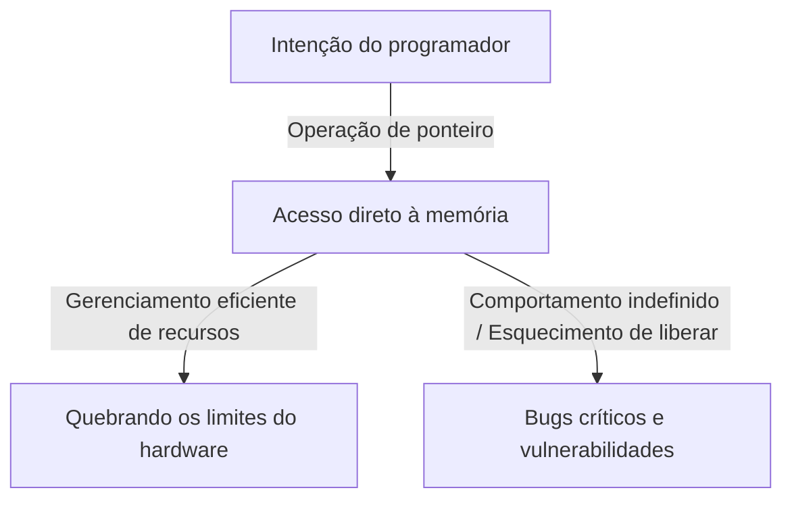
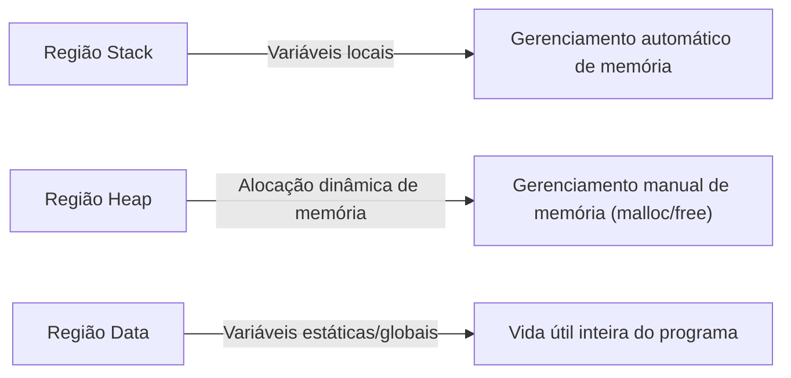

## Introdução: O Pesado Fardo da "Liberdade" em C

Na história das linguagens de programação, é raro encontrar uma linguagem como C que tenha influenciado tão profundamente as gerações subsequentes e permanecido na vanguarda por tanto tempo. Desenvolvida por Dennis Ritchie em 1972, essa linguagem nasceu com o propósito explícito de escrever o sistema operacional Unix. Se sua filosofia subjacente pudesse ser resumida em uma frase, seria "Confie no programador" — uma ideologia muito simples, mas terrivelmente resoluta.

Muitas linguagens de programação modernas (como Java, Python ou, mais recentemente, Go e Rust) fornecem várias redes de segurança para evitar que os desenvolvedores cometam erros ou para evitar falhas fatais do sistema caso ocorram erros. Gerenciamento automático de memória via coleta de lixo (garbage collection), verificação de limites de array, poderosa inferência de tipos e verificadores de empréstimo (borrow checkers) — tudo isso é baseado na filosofia moderna de que "humanos cometem erros", tentando encobri-los no lado do sistema.

No entanto, C é diferente. C dá aos desenvolvedores liberdade infinita, mas, em troca, remove todas as redes de segurança. O melhor exemplo disso é o conceito de "Ponteiro". Entender os ponteiros é entender C e significa tocar a essência da arquitetura de computadores. Neste artigo, nos aprofundaremos no tema ponteiros e liberdade em C, desde suas implicações filosóficas até benefícios práticos e seu lugar nos paradigmas de programação modernos.

## O Que É Um Ponteiro: Diálogo Direto com o Hardware

É fácil descrever um ponteiro simplesmente como "uma variável que armazena um endereço de memória", mas isso nem sequer diz metade de seu verdadeiro valor. Um ponteiro é como uma "varinha mágica" que dá aos programadores acesso direto à vasta tela do espaço de memória.

A memória do computador é essencialmente apenas um gigantesco array unidimensional de 0s e 1s. O sistema operacional abstrai esse espaço de memória e fornece um espaço de endereço virtual para cada processo, mas quando um programa é executado, os dados são sempre colocados em algum lugar nesse espaço.

Ao usar ponteiros, os programadores podem manipular não apenas "o conteúdo de uma variável", mas também "onde a variável está". Isso permite operações avançadas, como:

1. **Passagem de dados sem cópia (Zero-copy)**: Ao passar estruturas de dados enormes como argumentos de função, em vez de copiar os dados em si, passar apenas o local (endereço) onde os dados existem resulta em uma melhora drástica de desempenho.
2. **Construção de estruturas de dados dinâmicas**: Ponteiros são essenciais para vincular dados espalhados na memória e construir estruturas de dados complexas e flexíveis, como listas encadeadas (Linked Lists), árvores (Trees) e grafos (Graphs).
3. **Mapeamento direto a registradores de hardware**: Em sistemas embarcados, o acesso à memória via ponteiros é a única maneira de manipular diretamente os registradores de hardware localizados em endereços de memória específicos.

## O Preço da Liberdade: A Grande Responsabilidade do Gerenciamento de Memória

A liberdade infinita trazida pelos ponteiros vem com "responsabilidades" correspondentes. Em C, a alocação e liberação de memória devem ser tratadas de forma totalmente manual pelo programador. A memória alocada por `malloc` nunca será liberada, a menos que o programador chame explicitamente `free`.

Essa filosofia de "gerenciamento manual de memória" cria vários riscos (bugs relacionados à memória), como:

- **Vazamento de memória (Memory Leak)**: Um fenômeno no qual os recursos do sistema se esgotam gradualmente por esquecimento de liberar a memória alocada.
- **Ponteiro pendente (Dangling Pointer)**: Um ponteiro que continua apontando para uma área de memória que já foi liberada. Tentar acessá-lo causa comportamento imprevisível e vulnerabilidades de segurança (Use-After-Free).
- **Estouro de buffer (Buffer Overrun)**: Um fenômeno de gravação de dados além dos limites da área de memória alocada. Na história, é uma das causas que mais criaram falhas de segurança.

Esses problemas raramente ocorrem em linguagens modernas equipadas com coleta de lixo. Então, por que C continua mantendo um design tão perigoso? É para buscar "previsibilidade de desempenho" e "otimização extrema". É difícil prever quando o coletor de lixo será executado (pausas do GC), o que às vezes o torna inadequado para sistemas que exigem desempenho em tempo real ou para o desenvolvimento do kernel do sistema operacional. Em C, "só acontece o que o programador escreve", permitindo o domínio completo sobre o comportamento de todo o sistema.

## Ponteiros de Função: Alterando Dinamicamente o Comportamento do Programa

Ponteiros não apontam apenas para dados. Um dos recursos mais poderosos e belos de C é o "Ponteiro de Função". Usando ponteiros de função, o endereço onde as instruções do programa (código) residem pode ser mantido como um ponteiro e tratado como uma variável.

Ponteiros de função tornam possível implementar conceitos de "polimorfismo" e "callbacks" (retornos de chamada) de linguagens orientadas a objetos, mesmo em C. Por exemplo, a função `qsort`, que ordena um array, recebe um ponteiro para uma função de comparação como argumento, permitindo que ela execute processos de ordenação de forma flexível, independentemente do tipo de dados.

Muitas arquiteturas que atingem alto nível de abstração usando C, como o design de transições de estado (máquinas de estado) ou manipulação de interrupções para drivers de dispositivo em um sistema operacional, são projetadas utilizando habilmente esses ponteiros de função. Desfocar os limites entre "dados" e "procedimentos (código)" e permitir que a estrutura do próprio programa seja reconfigurada dinamicamente, essa flexibilidade é a prova de que C não é apenas uma linguagem de baixo nível.

## O Que a Filosofia de C Exige dos Engenheiros Modernos

Numa época em que surgem linguagens como Rust, que equilibram "segurança e desempenho", o paradigma da linguagem C de "ponteiros e gerenciamento manual de memória" pode parecer antiquado. Na verdade, os casos em que C é adotado para novos projetos estão diminuindo.

No entanto, o valor de aprender C nunca desapareceu. Escrever em C é sinônimo de experimentar em primeira mão como o sistema operacional gerencia a memória, como a CPU utiliza caches e como as estruturas de dados são mapeadas na memória.

Há um ditado: "Aquele que domina ponteiros domina C". Muitos iniciantes tropeçam em ponteiros, mas quando superam esse muro e conseguem navegar livremente pelo vasto oceano do espaço de memória, seus horizontes como programadores se expandem dramaticamente. Andar na corda bamba sem uma rede de segurança é perigoso, mas é exatamente por isso que podemos sentir com sensibilidade a força do vento e a tensão da corda, adquirindo um perfeito senso de equilíbrio.

## Conclusão

A filosofia de C baseia-se na troca entre "liberdade" e "responsabilidade". Sua ideologia de design de fornecer a arma poderosa dos ponteiros e deixar tudo a critério do programador às vezes causa bugs críticos, mas, ao mesmo tempo, é a chave para extrair o potencial do hardware até seus limites absolutos.

À medida que o ato de programar evolui em uma direção mais abstraída, segura e amigável aos humanos, C continua sendo uma presença valiosa que continua nos mostrando a "forma bruta" dos computadores. Quando espiamos o abismo da memória por meio de ponteiros, não estamos apenas escrevendo código; estamos verdadeiramente tendo um diálogo com a máquina complexa e requintada conhecida como computador.
