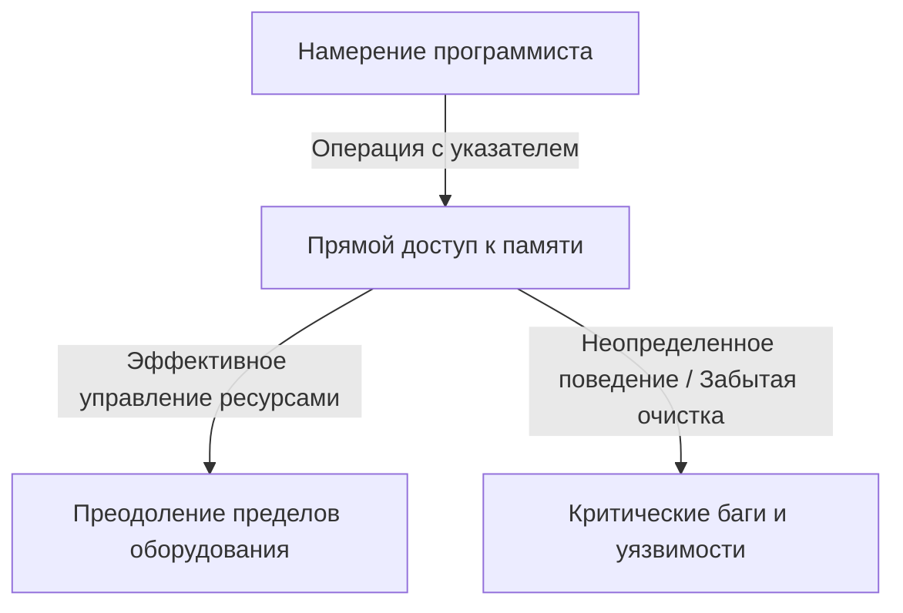
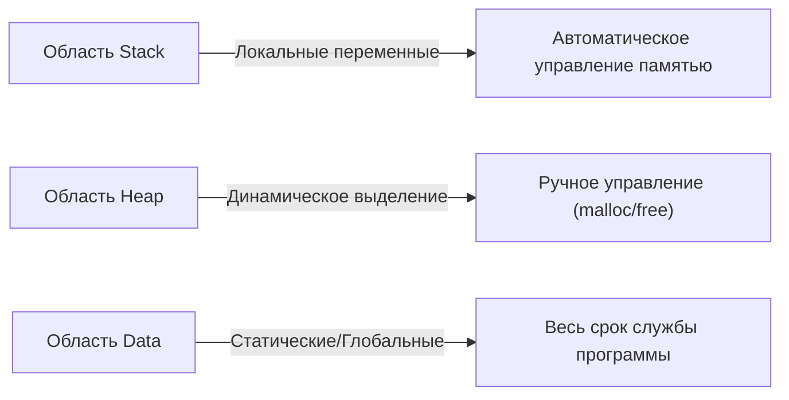

## Введение: Тяжелое бремя «свободы» в C

В истории языков программирования редко можно встретить такой язык, как C, который оказал бы столь глубокое влияние на последующие поколения и так долго оставался бы на переднем крае. Разработанный Деннисом Ритчи в 1972 году, этот язык был создан с четкой целью — написать операционную систему Unix. Если можно было бы резюмировать его основополагающую философию одной фразой, то это было бы «Доверяй программисту» — очень простая, но пугающе решительная идеология.

Многие современные языки программирования (такие как Java, Python, или более новые Go и Rust) предоставляют различные страховочные сетки, чтобы предотвратить ошибки разработчиков, или чтобы избежать фатальных сбоев системы в случае их возникновения. Автоматическое управление памятью с помощью сборки мусора (garbage collection), проверка границ массивов, мощный вывод типов и анализаторы заимствований (borrow checkers) — все это основано на современной философии, гласящей, что «людям свойственно ошибаться», пытаясь скрыть эти ошибки на стороне системы.

Однако C — другой. C дает разработчикам безграничную свободу, но взамен убирает все страховочные сетки. Лучшим примером этого является концепция «Указателя» (Pointer). Понять указатели — значит понять C, и это означает прикоснуться к сути компьютерной архитектуры. В этой статье мы глубоко погрузимся в тему указателей и свободы в C, от ее философского значения до практических преимуществ, и ее места в современных парадигмах программирования.

## Что такое указатель: Прямой диалог с оборудованием

Легко описать указатель просто как «переменную, которая хранит адрес памяти», но это не передает и половины его истинной ценности. Указатель подобен «волшебной палочке», которая дает программистам прямой доступ к огромному холсту пространства памяти.

Память компьютера по сути представляет собой просто гигантский одномерный массив из 0 и 1. Операционная система абстрагирует это пространство памяти и предоставляет виртуальное адресное пространство для каждого процесса, но при выполнении программы данные всегда размещаются где-то в этом пространстве.

Используя указатели, программисты могут манипулировать не только «содержимым переменной», но и тем, «где эта переменная находится». Это делает возможными такие продвинутые операции, как:

1. **Передача данных без копирования (Zero-copy)**: При передаче огромных структур данных в качестве аргументов функции вместо копирования самих данных передача только местоположения (адреса), где существуют данные, обеспечивает резкое повышение производительности.
2. **Построение динамических структур данных**: Указатели необходимы для связывания разбросанных в памяти данных для построения сложных и гибких структур данных, таких как связные списки (Linked List), деревья (Tree) и графы (Graph).
3. **Прямое отображение на аппаратные регистры**: Во встроенных системах доступ к памяти через указатели — это единственный способ напрямую манипулировать аппаратными регистрами, расположенными по определенным адресам памяти.

## Цена свободы: Тяжелая ответственность за управление памятью

Безграничная свобода, которую дают указатели, влечет за собой соответствующие «обязанности». В C выделение и освобождение памяти должны полностью осуществляться программистом вручную. Память, выделенная с помощью `malloc`, никогда не будет освобождена, если программист явно не вызовет `free`.

Эта философия «ручного управления памятью» порождает различные риски (ошибки, связанные с памятью), такие как:

- **Утечка памяти (Memory Leak)**: Явление, при котором системные ресурсы постепенно истощаются из-за того, что программист забывает освободить выделенную память.
- **Висячий указатель (Dangling Pointer)**: Указатель, который продолжает указывать на область памяти, которая уже была освобождена. Попытка получить к ней доступ вызывает непредсказуемое поведение и уязвимости безопасности (Use-After-Free).
- **Переполнение буфера (Buffer Overrun)**: Явление записи данных за пределы выделенной области памяти. В истории это одна из причин, которая породила наибольшее количество дыр в безопасности.

Эти проблемы редко встречаются в современных языках, оснащенных сборкой мусора. Так почему же C продолжает поддерживать такой опасный дизайн? Это делается ради «предсказуемости производительности» и «экстремальной оптимизации». Трудно предсказать, когда запустится сборщик мусора (паузы GC), что иногда делает его непригодным для систем, требующих производительности в реальном времени, или разработки ядра ОС. В C «происходит только то, что пишет программист», что позволяет полностью контролировать поведение всей системы.

## Указатели на функции: Динамическое изменение поведения программы

Указатели указывают не только на данные. Одной из самых мощных и красивых особенностей C является «Указатель на функцию» (Function Pointer). Используя указатели на функции, адрес, по которому находятся инструкции программы (код), можно хранить в виде указателя и обращаться с ним как с переменной.

Указатели на функции позволяют реализовать концепции «полиморфизма» и «обратных вызовов» (callbacks) из объектно-ориентированных языков даже в C. Например, функция `qsort`, которая сортирует массив, принимает в качестве аргумента указатель на функцию сравнения, что позволяет ей гибко выполнять процессы сортировки независимо от типа данных.

Многие архитектуры, достигающие высокого уровня абстракции с помощью C, такие как проектирование переходов состояний (конечные автоматы) или обработка прерываний для драйверов устройств в ОС, разработаны с умелым использованием этих указателей на функции. Стирание границ между «данными» и «процедурами (кодом)» и возможность динамической реконфигурации структуры самой программы — эта гибкость является доказательством того, что C — это не просто низкоуровневый язык.

## Что философия C требует от современных инженеров

В эпоху, когда появляются языки вроде Rust, балансирующие между «безопасностью и производительностью», парадигма языка C «указателей и ручного управления памятью» может показаться старомодной. Действительно, случаи использования C для новых проектов сокращаются.

Однако ценность изучения C никуда не исчезла. Писать на C — значит на собственном опыте познавать, как операционная система управляет памятью, как ЦП использует кэш и как структуры данных отображаются в памяти.

Есть поговорка: «Тот, кто освоит указатели, освоит C». Многие новички спотыкаются об указатели, но когда они преодолевают эту стену и могут свободно перемещаться в бескрайнем океане пространства памяти, их кругозор как программистов резко расширяется. Идти по канату без страховки опасно, но именно поэтому мы можем чутко ощущать силу ветра и натяжение веревки, приобретая идеальное чувство равновесия.

## Заключение

Философия C строится на компромиссе между «свободой» и «ответственностью». Ее идеология проектирования — предоставление мощного оружия указателей и передача всего на усмотрение программиста — иногда становится причиной критических багов, но в то же время является ключом к раскрытию потенциала оборудования до его абсолютных пределов.

По мере того как программирование развивается в более абстрактном, безопасном и удобном для человека направлении, C остается ценным явлением, которое продолжает показывать нам «голую форму» компьютеров. Когда мы заглядываем в бездну памяти через указатели, мы не просто пишем код; мы действительно ведем диалог со сложной и изысканной машиной, известной как компьютер.
