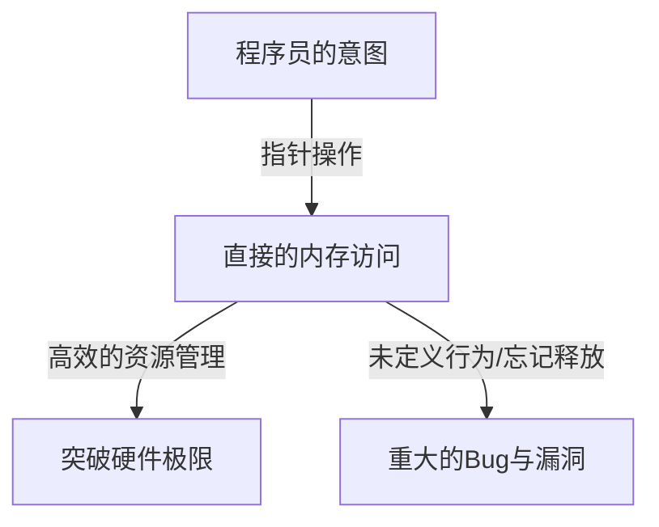
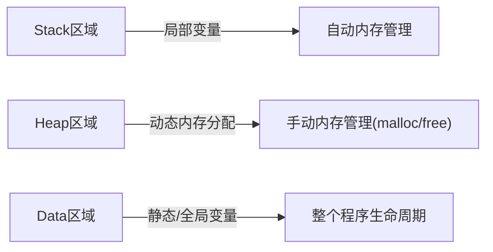

## 引言：C语言中名为“自由”的重压

在编程语言的历史上，很少有哪种语言能像C语言一样对后世产生如此深远的影响，并长期活跃在第一线。这门由[丹尼斯·里奇](/zh-cn/p/biography-dennis-ritchie/)于1972年开发的语言，其诞生有着明确的目的——编写Unix操作系统。如果用一句话来概括其底层哲学，那就是“信任程序员（Trust the programmer）”——这是一种极其简单却令人敬畏的觉悟。

许多现代编程语言（如Java、Python，或近期的Go和Rust）提供了各种安全网，以防止开发者犯错，或者在犯错时避免致命的系统崩溃。通过垃圾回收进行自动内存管理、数组边界检查、强大的类型推导和借用检查器——这些都是基于“人类总会犯错”的现代哲学，试图在系统层面予以弥补。

然而，C语言不同。C语言赋予开发者无限的自由，但作为代价，它拆除了一切安全网。最典型的例子就是“指针（Pointer）”的概念。理解指针就是理解C语言，也意味着触及计算机架构的精髓。本文将深入探讨C语言中的指针与自由这一主题，从其哲学意义到实际优势，再到其在现代编程范式中的地位。

## 指针是什么：与硬件的直接对话

将指针简单地描述为“存储内存地址的变量”很容易，但这甚至没有道出其真正价值的一半。指针就像一根“魔杖”，赋予程序员对内存空间这块广阔画布的直接访问权。

计算机的内存本质上不过是排列着0和1的巨大一维数组。操作系统将这个内存空间抽象化，为每个进程提供虚拟地址空间，但在程序执行时，数据必定会被放置在这个空间的某个位置。

通过使用指针，程序员不仅可以操作“变量的内容”，还可以操作“变量所在的位置”。这使得以下高级操作成为可能：

1. **零拷贝（Zero-copy）的数据传递**：将庞大的数据结构作为函数参数传递时，不复制数据本身，而只传递数据所在的位置（地址），从而实现性能的急剧提升。
2. **构建动态数据结构**：要将散布在内存中的数据连接起来，构建链表（Linked List）、树（Tree）、图（Graph）等复杂且灵活的数据结构，指针是不可或缺的。
3. **直接映射到硬件寄存器**：在嵌入式系统中，要直接操作配置在特定内存地址的硬件寄存器，通过指针进行内存访问是唯一的手段。

## 自由的代价：内存管理的沉重责任

指针带来的无限自由伴随着相应的“责任”。在C语言中，内存的分配和释放必须完全由程序员手动完成。通过 `malloc` 分配的内存，除非程序员显式调用 `free`，否则永远不会被释放。

这种“手动内存管理”的哲学引发了以下各种风险（与内存相关的Bug）：

- **内存泄漏 (Memory Leak)**：由于忘记释放已分配的内存，导致系统资源逐渐枯竭的现象。
- **悬空指针 (Dangling Pointer)**：继续指向已被释放的内存区域的指针。如果尝试访问它，会引发不可预测的行为或安全漏洞（Use-After-Free）。
- **缓冲区溢出 (Buffer Overrun)**：将数据写入超出已分配内存区域边界的现象。在历史上，这是造成最多安全漏洞的原因之一。

这些问题在配备垃圾回收机制的现代语言中几乎不会发生。那么，为什么C语言要继续维持这种危险的设计呢？这是为了追求“性能的可预测性”和“极限的优化”。垃圾回收器很难预测何时会执行内存回收处理（GC停顿），有时不适合需要实时性的系统或OS内核开发。在C语言中，“只会发生程序员所编写的事情”，因此可以完全掌控整个系统的行为。

## 函数指针：动态改变程序的行为

指针指向的不仅仅是数据。C语言中最强大、最优美的特性之一就是“函数指针（Function Pointer）”。使用函数指针，可以将程序指令（代码）所在的地址作为指针保存，并像变量一样处理它。

通过函数指针，C语言也能实现面向对象语言中“多态性（Polymorphism）”或“回调（Callback）”的概念。例如，对数组进行排序的 `qsort` 函数通过接收指向比较函数的指针作为参数，无论是什么数据类型，都能灵活地执行排序处理。

在使用C语言实现高度抽象的架构中，如OS中的状态机设计或设备驱动程序的中断处理，大多巧妙地利用了这种函数指针。模糊“数据”与“过程（代码）”的界限，并能够动态地重组程序结构本身，这种灵活性正是C语言不仅限于低级语言的证明。

## C语言的哲学对现代工程师的启示

在Rust这种兼顾“安全性与性能”的语言崛起的现代，“指针与手动内存管理”的C语言范式可能显得有些过时。事实上，在新项目中采用C语言的情况正在减少。

然而，学习C语言的价值并未褪色。编写C语言代码，等同于亲身体验操作系统如何管理内存、CPU如何利用缓存、数据结构如何映射到内存上。

有句话说：“掌握指针者掌握C语言”。许多初学者在指针上跌倒，但当他们跨越这道墙，能够在内存空间这片浩瀚的海洋中自由航行时，作为程序员的视野将得到戏剧性的拓宽。没有安全网的走钢丝固然危险，但正因如此，我们才能敏锐地感受到风的强度和绳索的张力，从而练就完美的平衡感。

## 结论

C语言的哲学建立在“自由”与“责任”的权衡之上。赋予指针这一强大的武器，并将一切交由程序员裁量的设计思想，有时会成为引发重大Bug的原因，但同时也是将硬件潜力发挥到极致的钥匙。

在编程行为向着更加抽象、安全、人性化的方向进化的过程中，C语言仍然是我们窥见计算机“本来面目”的宝贵存在。当我们通过指针凝视内存的深渊时，可以说我们不仅仅是在编写代码，而是在与被称为计算机的这台复杂而精密的机器进行真正的对话。
