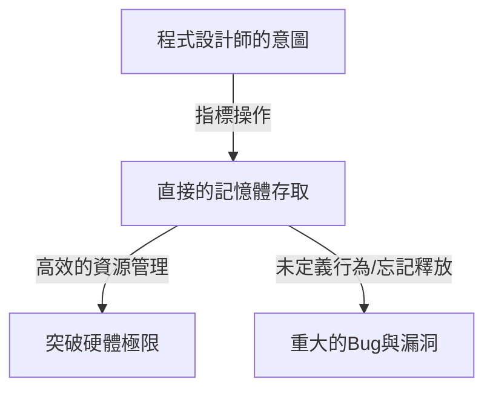
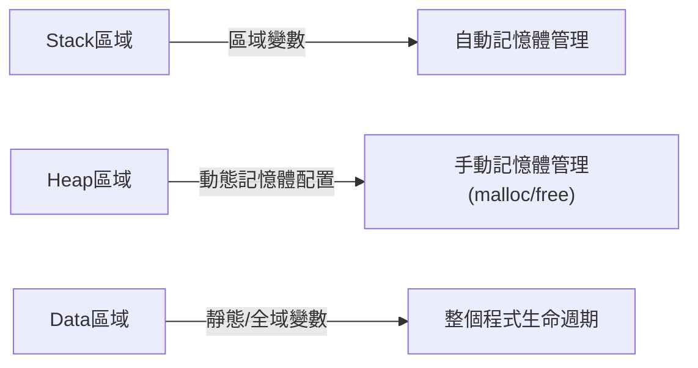

## 簡介：C語言中名為「自由」的重壓

在程式語言的歷史上，很少有哪種語言能像C語言一樣對後世產生如此深遠的影響，並長期活躍在第一線。這門由丹尼斯·里奇於1972年開發的語言，其誕生有著明確的目的——撰寫Unix作業系統。如果用一句話來概括其底層哲學，那就是「信任程式設計師（Trust the programmer）」——這是一種極其簡單卻令人敬畏的覺悟。

許多現代程式語言（如Java、Python，或近期的Go和Rust）提供了各種安全網，以防止開發者犯錯，或者在犯錯時避免致命的系統崩潰。透過垃圾回收進行自動記憶體管理、陣列邊界檢查、強大的型別推導和借用檢查器——這些都是基於「人類總會犯錯」的現代哲學，試圖在系統層面予以彌補。

然而，C語言不同。C語言賦予開發者無限的自由，但作為代價，它拆除了一切安全網。最典型的例子就是「指標（Pointer）」的概念。理解指標就是理解C語言，也意味著觸及電腦架構的精髓。本文將深入探討C語言中的指標與自由這一主題，從其哲學意義到實際優勢，再到其在現代程式設計範式中的地位。

## 指標是什麼：與硬體的直接對話

將指標簡單地描述為「儲存記憶體位址的變數」很容易，但這甚至沒有道出其真正價值的一半。指標就像一根「魔杖」，賦予程式設計師對記憶體空間這塊廣闊畫布的直接存取權。

電腦的記憶體本質上不過是排列著0和1的巨大一維陣列。作業系統將這個記憶體空間抽象化，為每個處理程序提供虛擬位址空間，但在程式執行時，資料必定會被放置在這個空間的某個位置。

透過使用指標，程式設計師不僅可以操作「變數的內容」，還可以操作「變數所在的位置」。這使得以下進階操作成為可能：

1. **零拷貝（Zero-copy）的資料傳遞**：將龐大的資料結構作為函式參數傳遞時，不複製資料本身，而只傳遞資料所在的位置（位址），從而實現效能的急劇提升。
2. **建構動態資料結構**：要將散布在記憶體中的資料連接起來，建構鏈結串列（Linked List）、樹（Tree）、圖（Graph）等複雜且靈活的資料結構，指標是不可或缺的。
3. **直接映射到硬體暫存器**：在嵌入式系統中，要直接操作配置在特定記憶體位址的硬體暫存器，透過指標進行記憶體存取是唯一的手段。

## 自由的代價：記憶體管理的沉重責任

指標帶來的無限自由伴隨著相應的「責任」。在C語言中，記憶體的配置和釋放必須完全由程式設計師手動完成。透過 `malloc` 配置的記憶體，除非程式設計師顯式呼叫 `free`，否則永遠不會被釋放。

這種「手動記憶體管理」的哲學引發了以下各種風險（與記憶體相關的Bug）：

- **記憶體洩漏 (Memory Leak)**：由於忘記釋放已配置的記憶體，導致系統資源逐漸枯竭的現象。
- **懸空指標 (Dangling Pointer)**：繼續指向已被釋放的記憶體區域的指標。如果嘗試存取它，會引發不可預測的行為或安全漏洞（Use-After-Free）。
- **緩衝區溢位 (Buffer Overrun)**：將資料寫入超出已配置記憶體區域邊界的現象。在歷史上，這是造成最多安全漏洞的原因之一。

這些問題在配備垃圾回收機制的現代語言中幾乎不會發生。那麼，為什麼C語言要繼續維持這種危險的設計呢？這是為了追求「效能的可預測性」和「極限的最佳化」。垃圾回收器很難預測何時會執行記憶體回收處理（GC停頓），有時不適合需要即時性的系統或OS核心開發。在C語言中，「只會發生程式設計師所撰寫的事情」，因此可以完全掌控整個系統的行為。

## 函式指標：動態改變程式的行為

指標指向的不僅僅是資料。C語言中最強大、最優美的特性之一就是「函式指標（Function Pointer）」。使用函式指標，可以將程式指令（程式碼）所在的位址作為指標保存，並像變數一樣處理它。

透過函式指標，C語言也能實現物件導向語言中「多型（Polymorphism）」或「回呼（Callback）」的概念。例如，對陣列進行排序的 `qsort` 函式透過接收指向比較函式的指標作為參數，無論是什麼資料型別，都能靈活地執行排序處理。

在使用C語言實現高度抽象的架構中，如OS中的狀態機設計或裝置驅動程式的中斷處理，大多巧妙地利用了這種函式指標。模糊「資料」與「程序（程式碼）」的界線，並能夠動態地重組程式結構本身，這種靈活性正是C語言不僅限於低階語言的證明。

## C語言的哲學對現代工程師的啟示

在Rust這種兼顧「安全性與效能」的語言崛起的現代，「指標與手動記憶體管理」的C語言範式可能顯得有些過時。事實上，在新專案中採用C語言的情況正在減少。

然而，學習C語言的價值並未褪色。撰寫C語言程式碼，等同於親身體驗作業系統如何管理記憶體、CPU如何利用快取、資料結構如何映射到記憶體上。

有句話說：「掌握指標者掌握C語言」。許多初學者在指標上跌倒，但當他們跨越這道牆，能夠在記憶體空間這片浩瀚的海洋中自由航行時，作為程式設計師的視野將得到戲劇性的拓寬。沒有安全網的走鋼索固然危險，但正因如此，我們才能敏銳地感受到風的強度和繩索的張力，從而練就完美的平衡感。

## 結論

C語言的哲學建立在「自由」與「責任」的權衡之上。賦予指標這一強大的武器，並將一切交由程式設計師裁量的設計思想，有時會成為引發重大Bug的原因，但同時也是將硬體潛力發揮到極致的鑰匙。

在程式設計行為朝著更加抽象、安全、人性化的方向進化的過程中，C語言仍然是我們窺見電腦「本來面目」的寶貴存在。當我們透過指標凝視記憶體的深淵時，可以說我們不僅僅是在撰寫程式碼，而是在與被稱為電腦的這台複雜而精密的機器進行真正的對話。
