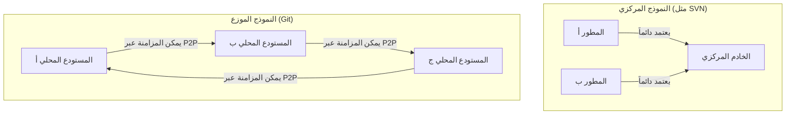
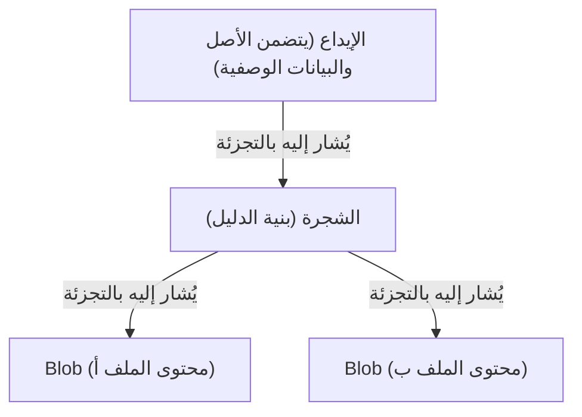

# فلسفة Git (جماليات اللامركزية)

في عالم تطوير البرمجيات، من النادر العثور على أداة غيرت تفكير المطورين وسير عملهم بشكل جذري مثل Git. متجاوزاً إطار كونه مجرد "أداة لإدارة سجل الملفات"، يمتلك Git "فلسفة" قوية في جوهره. إنها جمالية تدعمها ثلاثة أعمدة: اللامركزية (Decentralization)، والاستقلالية (Autonomy)، والثقة التشفيرية (Cryptographic Trust).

في هذا المقال، سنتعمق من منظور البنية الهندسية في الفلسفة التي استند إليها لينوس تورفالدس (Linus Torvalds)، مبتكر نواة لينكس، لإنشاء Git، وكيف سحر المطورين حول العالم، وأصبح الأساس لثقافة المصادر المفتوحة اليوم.

## 1. خلفية التأسيس: نقيض المركزية

في عام 2005، عندما وُلد Git، كانت أنظمة التحكم في الإصدار (VCS) السائدة مثل CVS و Subversion (SVN) "مركزية". كانت هذه الأنظمة تعتمد على نموذج يوجد فيه خادم مركزي ضخم واحد، يصل إليه جميع المطورين للحصول على أحدث الرموز، وإرسال (إيداع) تغييراتهم إلى الخادم.

ومع ذلك، في المشاريع الضخمة مثل نواة لينكس حيث يشارك آلاف الأشخاص حول العالم في التطوير في نفس الوقت، كان النموذج المركزي يعاني من اختناق قاتل. كان الاتصال بالخادم أمراً إلزامياً، وكانت هناك نقطة فشل مفردة (Single Point of Failure)، وقبل كل شيء، "كان إنشاء الفروع ودمجها ثقيلاً وبطيئاً".

انطلاقاً من استيائه الشديد من الأنظمة الحالية، قرر لينوس بناء نظام جديد تماماً للتحكم في الإصدار بنفسه. وهنا تم اعتماد التحول النموذجي "الموزع" (Distributed).

في Git، توجد "نسخة كاملة من المستودع" على الأجهزة المحلية لكل شخص. حتى بدون الاتصال بالشبكة، يمكنك البحث في السجل بأكمله، وإنشاء الفروع، وإجراء عمليات الإيداع (commits). لم يكن هذا مجرد تحسين في الأداء، بل كان تحولاً فلسفياً لمنح "سيادة كاملة" لكل مطور.

## 2. جماليات مخطط الإيداع: DAG (الرسم البياني الموجه غير الدوري)

أهم مفهوم لفهم البنية الداخلية لـ Git هو "DAG (الرسم البياني الموجه غير الدوري: Directed Acyclic Graph)". لا يدير Git السجل كمجرد "سلسلة من التصحيحات (الاختلافات)"، بل يبني العلاقات بين اللقطات (snapshots) كـ DAG.

يحتوي كل إيداع (commit) على مؤشر (شجرة) للقطة المشروع بأكمله في تلك اللحظة، ومؤشر واحد أو أكثر إلى "الإيداع الأصلي". من خلال سلسلة بنية البيانات البسيطة هذه، يعبر Git عن السجل المعقد لتفرع الفروع ودمجها كرسم بياني خالٍ من التناقضات الرياضية.

يكمن جمال هذا النهج في أن السجل يتم التعبير عنه بشكل طبيعي ليس كـ "خط واحد" بل كـ "خطوط زمنية متعددة تسير بالتوازي". يمكن للمطورين تفريع التاريخ بحرية، والتجربة، وإذا فشلوا يمكنهم التخلي عن ذلك الفرع، وإذا نجحوا يمكنهم دمجه في التيار الرئيسي. لا يصبح السجل مجرد سجل للماضي، بل "مسار تفكير" المطور نفسه.

## 3. الفروع كـ "مختبرات خفيفة الوزن"

في SVN، كان إنشاء فرع يعني نسخ الدليل، وهي عملية ثقيلة تستهلك الوقت ومساحة القرص. لذلك، كان إنشاء الفروع حدثاً خاصاً يشكل حاجزاً نفسياً عالياً.

ومع ذلك، في Git، الفرع هو مجرد "مؤشر ديناميكي يشير إلى إيداع معين (قيمة تجزئة مكونة من 40 حرفاً داخل ملف)". تكلفة إنشاء فرع تقترب حرفياً من الصفر.

أدى هذا التصميم للـ "فروع الرخيصة" (Cheap Branches) إلى تغيير منهجية التطوير نفسها. ظهرت مفاهيم مثل فروع الميزات (feature branches) وفروع المواضيع (topic branches)، وترسخت ممارسة "حتى لو كان التغيير صغيراً، أنشئ فرعاً وجرب أولاً". وقد منح هذا المطورين "حرية التجربة والخطأ دون خوف من الفشل".

## 4. الثقة التشفيرية: SHA-1 ونظام الملفات القابل للعنونة بالمحتوى

في الأنظمة اللامركزية، التحدي الأكبر هو كيفية ضمان "سلامة البيانات" (Integrity). في بيئة يمكن لأي شخص فيها تعديل المستودع وتبادل التعليمات البرمجية مع بعضهم البعض، كيف تثبت أن الرموز لم يتم التلاعب بها وأن السجل صالح؟

حل Git هذه المشكلة بأناقة من خلال "نظام الملفات القابل للعنونة بالمحتوى" (Content-Addressable Filesystem). يتم تحديد جميع الكائنات داخل Git (الإيداعات، الأشجار، والـ BLOBs التي هي محتويات الملفات) وحفظها بواسطة قيمة تجزئة SHA-1 (رقم سداسي عشري مكون من 40 حرفاً) يتم حسابها بناءً على محتوياتها.

إذا تغير بايت واحد من محتوى الملف، تتغير قيمة التجزئة الخاصة بذلك الملف، وتتغير قيمة التجزئة للشجرة التي تحتويه، ونتيجة لذلك تتغير قيمة التجزئة للإيداع أيضاً. بمعنى آخر، التلاعب بجزء من السجل سراً مستحيل تشفيرياً.

كان لدى لينوس تورفالدس إرادة قوية عند تصميم Git بـ "عدم السماح مطلقاً بتدمير البيانات أو التلاعب بها". يجسد نموذج التجزئة في Git الشكل النهائي للامركزية، الذي يشبه تقنية البلوك تشين (Blockchain)، حيث تتأصل الثقة في البيانات نفسها دون الاعتماد على سلطة مركزية (خادم).

## 5. الدمج والحوار: البرمجة كعملية اجتماعية

تكمن القوة الحقيقية لـ Git في "الدمج" (Merge) الذي يوحد التاريخ المتفرع. في التطوير الموزع، من الشائع أن يقوم عدة مطورين بتحرير نفس الملف في نفس الوقت، مما يؤدي إلى تعارضات (conflicts) شديدة.

على الرغم من خوارزمية الدمج الممتازة في Git، إلا أنه لا تزال تحدث تعارضات لا يمكن حلها آلياً. ومع ذلك، في فلسفة Git، التعارض ليس "خطأ"، بل ميزة توضح "النقاط التي تتطلب حواراً بين المطورين".

لمن سيتم اعتماد الرموز، أم هل سيتم كتابة منطق جديد يستفيد من كليهما؟ حل تعارضات الدمج يصبح عملية اجتماعية للتوفيق بين "النوايا" الكامنة وراء الرموز. يوفر Git بيئة معزولة (sandbox) كاملة لإجراء هذه العملية محلياً وبأمان.

## 6. إضفاء الطابع الديمقراطي على ثقافة المصادر المفتوحة وصعود GitHub

غيّرت فلسفة Git اللامركزية جذرياً كيفية تطوير المصادر المفتوحة. في تطوير المصادر المفتوحة في الماضي، كان هناك تسلسل هرمي واضح بين نخبة قليلة (المودعون الأساسيون - core committers) لديهم "حق الإيداع" في المستودع المركزي، والمطورين العاديين الذين يرسلون التصحيحات عبر القوائم البريدية.

ومع ذلك، في عالم Git، يمتلك كل شخص "نسخة مطابقة" (clone) من المستودع الأصلي، ويكون هو "الحاكم المطلق" في جهازه المحلي. بعد إجراء التغييرات، يطلب من المستودع الأصلي "إدراج تغييراتي (Pull Request)". بفضل مفهوم طلب السحب هذا (وهو مفهوم غير مدمج في Git نفسه بل بنته GitHub فوق نموذج Git الموزع)، تم إضفاء الطابع الديمقراطي على المساهمة في الرموز البرمجية بشكل كبير.

طالما أن جودة التعليمات البرمجية جيدة، سيتم دمجها بغض النظر عمن كتبها. ساعدت الطبيعة المسطحة لبنية Git على تعزيز تشكيل مجتمع تطوير مفتوح وحر قائم على الجدارة.

## 7. الخلاصة: ما يعلمنا إياه Git

Git ليس مجرد أداة. إنه تعبير برمجي عن "الحرية" و"المسؤولية".

عدم الاعتماد على خادم مركزي، وامتلاك التاريخ والسيادة الكاملة بين يديك. التفريع (branch) والتجربة والخطأ دون خوف من الفشل. ومشاركة تلك النتائج مع الآخرين، ونسج التاريخ معاً (الدمج) من خلال الحوار.

جماليات اللامركزية لا تعني الاعتماد على سلطة معينة، بل بناء "شبكة ثقة" تستند إلى الاستقلالية الفردية وقابلية التحقق التشفيري. وراء الأوامر التي نكتبها كل يوم مثل `git commit` أو `git push`، تنبض فلسفة عظيمة سعت لجعل تطوير البرمجيات حراً وديمقراطياً.
