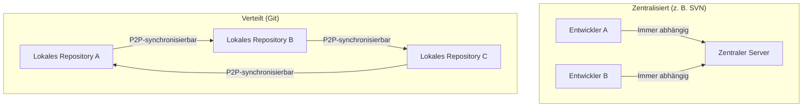
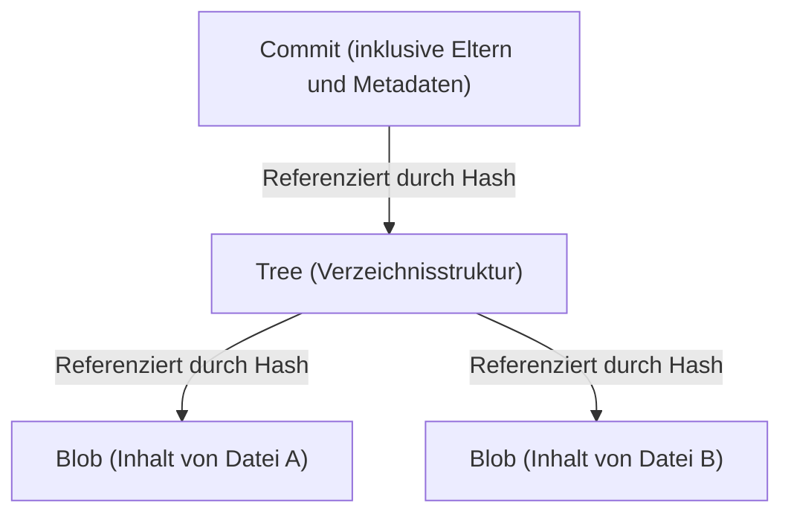

# Die Philosophie von Git (Die Ästhetik der Dezentralisierung)

In der Welt der Softwareentwicklung gibt es nur wenige Tools, die das Denken und den Workflow von Entwicklern so grundlegend verändert haben wie Git. Git ist mehr als nur ein „Tool zur Verwaltung des Dateiverlaufs“ und hat eine starke „Philosophie“ an seiner Basis. Es ist eine Ästhetik, die auf drei Säulen ruht: Dezentralisierung (Decentralization), Autonomie (Autonomy) und kryptografisches Vertrauen (Cryptographic Trust).

In diesem Artikel werden wir aus architektonischer Sicht tiefgehend untersuchen, unter welcher Philosophie Linus Torvalds, der Schöpfer des Linux-Kernels, Git erschaffen hat und wie es Entwickler weltweit faszinierte und die Grundlage der heutigen Open-Source-Kultur bildete.

## 1. Hintergrund der Entstehung: Die Antithese zur Zentralisierung

Als Git 2005 entstand, waren Versionskontrollsysteme (VCS) wie CVS und Subversion (SVN) „zentralisiert“ und dominierten den Markt. Dies war ein Modell, bei dem es einen einzigen riesigen zentralen Server gab, auf den alle Entwickler zugriffen, um den neuesten Code zu erhalten, und an den sie ihre Änderungen sendeten (committeten).

In einem riesigen Projekt wie dem Linux-Kernel, an dem tausende von Menschen auf der ganzen Welt gleichzeitig teilnehmen, hatte das zentralisierte Modell jedoch einen fatalen Engpass. Die Notwendigkeit einer Verbindung zum Server, das Vorhandensein eines Single Point of Failure und vor allem die Tatsache, dass „das Erstellen und Zusammenführen von Branches schwerfällig und langsam ist“.

Aus starker Unzufriedenheit mit dem bestehenden System beschloss Linus, ein völlig neues Versionskontrollsystem von Grund auf neu zu entwickeln. Der dort angewandte Paradigmenwechsel war „verteilt“ (Distributed).

In Git existiert eine „vollständige Kopie des Repositories“ auf der lokalen Maschine jedes Einzelnen. Auch ohne Netzwerkverbindung kann man die gesamte Vergangenheit durchsuchen, Branches erstellen und Commits durchführen. Dies war nicht nur eine Leistungssteigerung, sondern ein philosophischer Wandel, der jedem einzelnen Entwickler „vollständige Souveränität“ verlieh.

## 2. Die Ästhetik des Commit-Graphen: DAG (Gerichteter azyklischer Graph)

Das wichtigste Konzept zum Verständnis der internen Struktur von Git ist der „DAG (Directed Acyclic Graph: Gerichteter azyklischer Graph)“. Git verwaltet die Historie nicht einfach als „eine Abfolge von Patches (Unterschieden)“, sondern konstruiert die Beziehung zwischen Snapshots als DAG.

Jeder Commit hat einen [Zeiger](/de/p/c-language-pointers-memory-management-stack-heap/) (Tree) auf den Snapshot des gesamten Projekts zu diesem Zeitpunkt sowie [Zeiger](/de/p/c-language-pointers-memory-management-stack-heap/) auf einen oder mehrere „Eltern-Commits“. Durch diese einfache Verkettung von Datenstrukturen drückt Git komplexe Verzweigungen und Merge-Historien von Branches als mathematisch konsistenten Graphen aus.

Die Schönheit dieses Ansatzes liegt darin, dass die Historie nicht als „eine einzige Linie“ dargestellt wird, sondern natürlich als „mehrere parallele Zeitlinien“. Entwickler können die Historie frei verzweigen, experimentieren, die Verzweigung verwerfen, wenn sie scheitert, oder sie in den Hauptstrom einfügen, wenn sie erfolgreich ist. Die Historie ist nicht nur eine Aufzeichnung der Vergangenheit, sondern die „Spur der Gedanken“ des Entwicklers selbst.

## 3. Der Branch als „Leichtgewichtiges Labor“

In SVN bedeutete das Erstellen eines Branches das Kopieren eines Verzeichnisses, eine schwere Operation, die Zeit und Speicherplatz verbrauchte. Daher war das Erstellen eines Branches ein besonderes Ereignis, und die psychologische Hürde war hoch.

In Git ist ein Branch jedoch nichts weiter als „ein dynamischer [Zeiger](/de/p/c-language-pointers-memory-management-stack-heap/), der auf einen bestimmten Commit verweist (ein 40-stelliger Hashwert in einer Datei)“. Die Kosten für die Erstellung eines Branches liegen buchstäblich fast bei null.

Dieses Design von „billigen Branches“ (Cheap Branches) hat die Entwicklungsmethodik selbst verändert. Konzepte wie Feature-Branches und Topic-Branches entstanden, und die Praxis etablierte sich: „Egal wie klein die Änderung ist, erstelle zuerst einen Branch und experimentiere“. Dies gab den Entwicklern die „Freiheit, durch Versuch und Irrtum ohne Angst vor dem Scheitern zu lernen“.

## 4. Kryptografisches Vertrauen: SHA-1 und inhaltsadressierte Speicherung

In einem dezentralen System besteht die größte Herausforderung darin, die „Datenintegrität“ (Integrity) sicherzustellen. Wie kann in einer Umgebung, in der jeder das Repository ändern und Code miteinander austauschen kann, bewiesen werden, dass der Code nicht manipuliert wurde und die Historie legitim ist?

Git hat dieses Problem auf elegante Weise durch ein „inhaltsadressiertes Dateisystem“ (Content-Addressable Filesystem) gelöst. Alle Objekte in Git (Commits, Trees und BLOBS, die Dateiinhalte) werden durch einen SHA-1-Hashwert (eine 40-stellige Hexadezimalzahl) identifiziert und gespeichert, der basierend auf ihrem Inhalt berechnet wird.

Wenn sich der Inhalt einer Datei um auch nur ein Byte ändert, ändert sich der Hashwert der Datei, der Hashwert des Baums, der sie enthält, ändert sich und folglich ändert sich auch der Hashwert des Commits. Mit anderen Worten, es ist kryptografisch unmöglich, einen Teil der Historie heimlich zu manipulieren.

Linus Torvalds hatte bei der Entwicklung von Git den starken Willen: „Datenzerstörung oder Manipulation absolut nicht zuzulassen“. Das Hash-Modell von Git verkörpert die ultimative Form der Dezentralisierung, ähnlich der [Blockchain](/de/p/blockchain-technology-smart-contract-distributed-ledger/), bei der das Vertrauen in die Daten selbst eingebettet ist, ohne auf eine zentrale Autorität (Server) angewiesen zu sein.

## 5. Mergen und Dialog: Programmierung als sozialer Prozess

Die wahre Stärke von Git liegt im „Merge“, das die verzweigte Historie integriert. In der verteilten Entwicklung ist es an der Tagesordnung, dass mehrere Entwickler gleichzeitig dieselbe Datei bearbeiten und heftig kollidieren (Konflikt).

Obwohl der Merge-Algorithmus von Git hervorragend ist, treten dennoch Konflikte auf, die nicht mechanisch gelöst werden können. In der Philosophie von Git ist ein Konflikt jedoch kein „Fehler“, sondern eine Funktion, die deutlich auf „Punkte hinweist, an denen ein Dialog zwischen Entwicklern erforderlich ist“.

Wessen Code übernommen wird oder ob eine neue Logik geschrieben wird, die beide nutzt. Die Lösung von Merge-Konflikten wird zu einem sozialen Prozess der Abstimmung der „Absichten“ hinter dem Code. Git bietet eine vollständige Sandbox, um diesen Prozess lokal und sicher durchzuführen.

## 6. Demokratisierung der Open-Source-Kultur und der Aufstieg von GitHub

Die dezentrale Philosophie von Git hat die Art und Weise der Open-Source-Entwicklung grundlegend verändert. In der früheren Open-Source-Entwicklung gab es eine klare Hierarchie: Eine kleine privilegierte Klasse (Core-Committer) mit „Commit-Rechten“ an einem zentralen Repository und allgemeine Entwickler, die Patches über Mailinglisten verschickten.

In der Git-Welt hat jedoch jeder einen „vollständigen Klon“ des ursprünglichen Repositories und ist auf seinem lokalen Computer sein eigener „absoluter Monarch“. Nach der Durchführung von Änderungen fordert er das Hauptrepository auf: „Bitte übernimm meine Änderungen (Pull Request)“. Durch das Konzept des Pull Requests (das nicht in Git selbst integriert ist, sondern ein von GitHub auf dem verteilten Modell von Git aufgebautes Konzept) wurde die Code-Beisteuerung drastisch demokratisiert.

Solange die Qualität des Codes gut ist, wird er gemergt, unabhängig davon, wer ihn geschrieben hat. Die flache Natur der Architektur von Git unterstützte die Bildung einer offenen und freien Entwickler-Community, die auf einer Leistungsgesellschaft (Meritokratie) basiert.

## 7. Fazit: Was uns Git lehrt

Git ist nicht nur ein Tool. Es ist ein softwaremäßiger Ausdruck von „Freiheit“ und „Verantwortung“.

Nicht von einem zentralen Server abhängig zu sein, sondern eine vollständige Historie und Souveränität in den eigenen Händen zu haben. Ohne Angst vor dem Scheitern zu verzweigen (Branch) und durch Versuch und Irrtum zu lernen. Und die Ergebnisse mit anderen zu teilen und die Historie durch Dialog zusammenzuführen (Merge).

Die Ästhetik der Dezentralisierung besteht nicht darin, sich auf eine bestimmte Autorität zu verlassen, sondern ein „Netzwerk des Vertrauens“ aufzubauen, das auf individueller Autonomie und kryptografischer Überprüfbarkeit basiert. Hinter den Befehlen `git commit` und `git push`, die wir jeden Tag beiläufig eintippen, atmet eine großartige Philosophie, die versuchte, die Softwareentwicklung frei und demokratisch zu gestalten.
