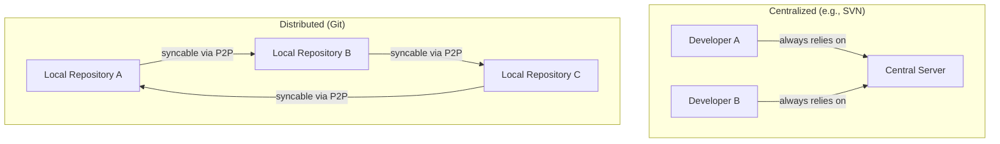
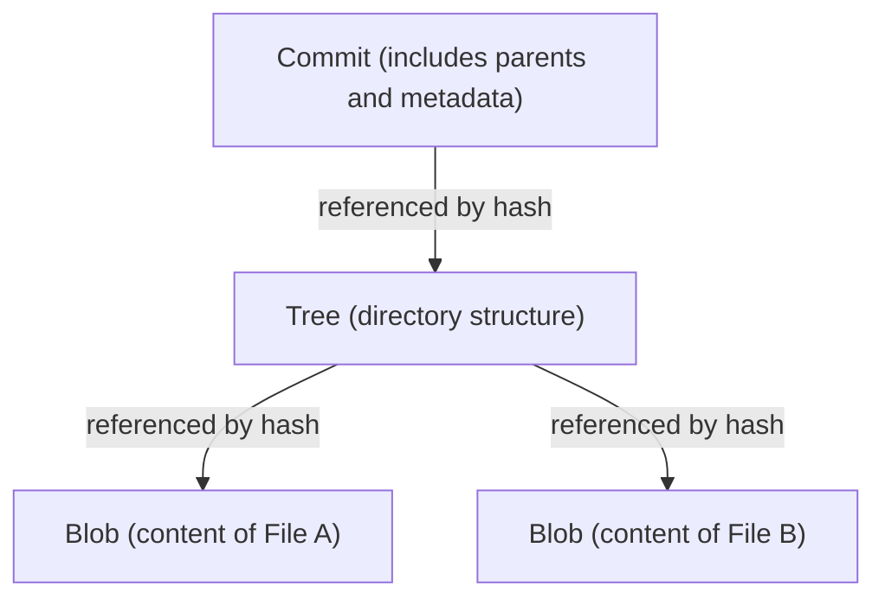

# The Philosophy of Git (The Aesthetics of Decentralization)

In the world of software development, tools that fundamentally transform a developer's thinking and workflow are rare, but Git is one of them. Transcending the boundaries of a mere "tool for managing file history," Git has a powerful "philosophy" at its core. It is an aesthetic supported by three pillars: Decentralization, Autonomy, and Cryptographic Trust.

In this article, we will delve into the ideas that led Linux kernel creator Linus Torvalds to build Git from an architectural perspective, exploring how it captivated developers worldwide and formed the foundation of today's open-source culture.

## 1. Background of its Birth: An Antithesis to Centralization

Back in 2005 when Git was born, mainstream Version Control Systems (VCS) like CVS and Subversion (SVN) were "centralized". These operated on a model where a single, massive central server existed, and all developers accessed it to retrieve the latest code and send (commit) their changes.

However, for a gigantic project like the Linux kernel, where thousands of people worldwide participate in development simultaneously, the centralized model had a fatal bottleneck. It required a constant connection to the server, created a Single Point of Failure, and, above all, meant that "creating and merging branches was heavy and slow."

Driven by strong dissatisfaction with existing systems, Linus decided to build an entirely new version control system himself. The paradigm shift adopted there was the "Distributed" approach.

In Git, a "complete copy of the repository" exists on every individual's local machine. Even without a network connection, you can search the entire past history, create branches, and make commits. This was not merely a performance improvement; it was an ideological shift that granted "absolute sovereignty" to each and every developer.

## 2. The Aesthetics of the Commit Graph: DAG (Directed Acyclic Graph)

The most important concept for understanding Git's internal structure is the "DAG (Directed Acyclic Graph)." Git does not manage history merely as a "sequence of patches (diffs)"; rather, it constructs the relationships between snapshots as a DAG.

Each commit holds a pointer (tree) to a snapshot of the entire project at that moment, as well as pointers to one or more "parent commits." Through this simple chain of data structures, Git mathematically expresses complex branching and merging history as an inconsistent-free graph.

The beauty of this approach lies in the fact that history is naturally represented not as a "single line" but as "multiple timelines advancing in parallel." Developers can freely branch history, experiment, discard the branch if it fails, or merge it into the main stream if it succeeds. History becomes not just a record of the past, but the very "trail of the developer's thought process."

## 3. Branches as a "Lightweight Experimental Ground"

In SVN, creating a branch meant copying a directory, a heavy operation that consumed time and disk space. As a result, cutting a branch was a special event with a high psychological hurdle.

However, in Git, a branch is nothing more than a "dynamic pointer (a 40-character hash value in a file) pointing to a specific commit." The cost of creating a branch is literally close to zero.

This design of "Cheap Branches" transformed development methodologies themselves. Concepts like feature branches and topic branches were born, establishing the practice of "always creating a branch to experiment first, no matter how small the change." This granted developers the "freedom to trial and error without fear of failure."

## 4. Cryptographic Trust: SHA-1 and Content-Addressability

In a decentralized system, the biggest challenge is how to ensure "data integrity." In an environment where anyone can modify the repository and exchange code with one another, how do you prove that the code hasn't been tampered with and that the history is legitimate?

Git elegantly solved this problem with a "Content-Addressable Filesystem." All objects within Git (commits, trees, and blobs that are file contents) are identified and stored by a SHA-1 hash value (a 40-character hexadecimal string) calculated based on their content.

If even a single byte of a file's content changes, the file's hash value changes, the tree's hash value containing it changes, and consequently, the commit's hash value changes as well. In other words, secretly tampering with part of the history is cryptographically impossible.

In designing Git, Linus Torvalds had a strong resolve to "never allow data corruption or tampering." Git's hash model embodies the ultimate form of decentralization—akin to blockchain—where trust is intrinsic to the data itself, without relying on a central authority (server).

## 5. Merging and Dialogue: Programming as a Social Process

The true value of Git lies in the "Merge," which integrates diverging histories. In distributed development, it is a daily occurrence for multiple developers to edit the same file simultaneously and fiercely conflict.

While Git's merge algorithms are excellent, conflicts that cannot be resolved mechanically still occur. However, in Git's philosophy, a conflict is not an "error" but a feature that highlights "points where dialogue between developers is necessary."

Whose code should be adopted, or should new logic be written to utilize both? Resolving a merge conflict becomes a social process of aligning the "intentions" behind the code. Git provides a complete sandbox to perform this process safely locally.

## 6. The Democratization of Open Source Culture and the Rise of GitHub

Git's philosophy of decentralization fundamentally changed the nature of open-source development. In past open-source development, there was a clear hierarchy between a small privileged class (core committers) who held "commit rights" to the central repository and general developers who submitted patches via mailing lists.

However, in the world of Git, everyone has a "full clone" of the original repository, and locally, they are their own "absolute monarch." After making changes, they request the original repository to "pull in my changes (Pull Request)." Through this concept of the Pull Request (a concept not built into Git itself, but built by GitHub on top of Git's distributed model), code contributions were drastically democratized.

As long as the code quality is good, it will be merged regardless of who wrote it. The flat nature of Git's architecture encouraged the formation of open and free development communities based on meritocracy.

## 7. Conclusion: What Git Teaches Us

Git is not merely a tool. It is a software-based expression of "freedom" and "responsibility."

Not depending on a central server, holding complete history and sovereignty in one's own hands. Branching out without fear of failure and engaging in trial and error. And sharing those results with others, weaving history together (merging) through dialogue.

The aesthetics of decentralization are about building a "network of trust" based on individual autonomy and cryptographic verifiability, rather than relying on a specific authority. Behind the `git commit` and `git push` commands we casually type every day breathes a grand philosophy that sought to make software development free and democratic.
