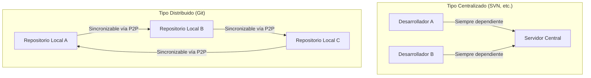
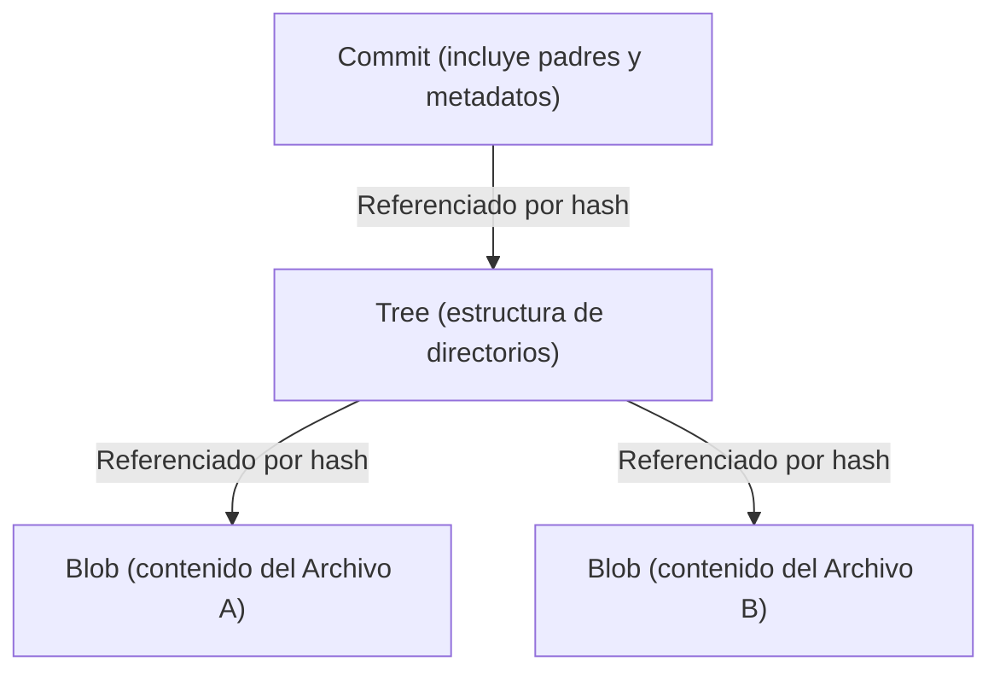

# La Filosofía de Git (La Estética de la Descentralización)

En el mundo del desarrollo de software, es raro encontrar una herramienta que haya transformado fundamentalmente el pensamiento y el flujo de trabajo de los desarrolladores como lo ha hecho Git. Más allá de ser una simple "herramienta para gestionar el historial de archivos", Git posee una poderosa "filosofía" en sus raíces. Es una estética sostenida por tres pilares: Descentralización (Decentralization), Autonomía (Autonomy) y Confianza Criptográfica (Cryptographic Trust).

En este artículo, profundizaremos desde el punto de vista de la arquitectura en qué tipo de ideología se basó Linus Torvalds, el creador del kernel de Linux, para crear Git, y cómo logró cautivar a desarrolladores de todo el mundo y formar la base de la cultura actual del código abierto.

## 1. El Contexto de su Nacimiento: Antítesis a la Centralización

En 2005, cuando nació Git, la corriente principal de los Sistemas de Control de Versiones (VCS) era de tipo "centralizado", como CVS o Subversion (SVN). Estos son modelos donde existe un único y enorme servidor central, al cual todos los desarrolladores acceden para obtener el código más reciente y enviar (commit) sus propios cambios.

Sin embargo, en un proyecto gigante como el kernel de Linux, donde miles de personas de todo el mundo participan simultáneamente en el desarrollo, el tipo centralizado tenía un cuello de botella fatal. Requería una conexión obligatoria al servidor, existía un Punto Único de Fallo (Single Point of Failure), y sobre todo, "la creación y fusión (merge) de ramas era pesada y lenta".

Linus, motivado por una fuerte insatisfacción con los sistemas existentes, decidió construir un sistema de control de versiones completamente nuevo con sus propias manos. Fue entonces cuando adoptó el cambio de paradigma de ser "Distribuido (Distributed)".

En Git, existe una "copia completa del repositorio" en la máquina local de cada individuo. Incluso sin estar conectado a la red, se puede buscar en todo el historial pasado, crear ramas y hacer commits. Esto no fue una simple mejora de rendimiento, sino un cambio ideológico que otorgó "soberanía completa" a cada desarrollador.

## 2. La Estética del Grafo de Commits: DAG (Grafo Acíclico Dirigido)

El concepto más importante para entender la estructura interna de Git es el "DAG (Directed Acyclic Graph: Grafo Acíclico Dirigido)". Git no gestiona el historial como una simple "secuencia de parches (diferencias)", sino que construye las relaciones entre las instantáneas (snapshots) como un DAG.

Cada commit tiene un puntero (árbol) a una instantánea de todo el proyecto en ese momento, y [punteros](/es/p/c-language-pointers-memory-management-stack-heap/) a uno o más "commits padres". Mediante esta simple cadena de estructuras de datos, Git expresa historiales complejos de bifurcación de ramas y fusiones como un grafo matemáticamente libre de contradicciones.

La belleza de este enfoque radica en que el historial se expresa naturalmente no como "una sola línea", sino como "múltiples líneas de tiempo que avanzan en paralelo". Los desarrolladores pueden bifurcar libremente la historia, experimentar, y si fallan pueden descartar esa bifurcación, o si tienen éxito, pueden fusionarla con la corriente principal. El historial no es un simple registro del pasado, sino la "trayectoria de pensamiento" del propio desarrollador.

## 3. Las Ramas como "Campos de Experimentación Ligeros"

En SVN, crear una rama significaba copiar un directorio, una operación pesada que consumía tiempo y espacio en disco. Por eso, crear una rama era un evento especial con una alta barrera psicológica.

Sin embargo, en Git, una rama no es más que un "puntero dinámico que señala a un commit específico (un valor hash de 40 caracteres en un archivo)". El costo de crear una rama es literalmente cercano a cero.

Este diseño de "Ramas Baratas (Cheap Branches)" transformó el método de desarrollo en sí. Nacieron conceptos como las ramas de características (feature branches) o de temas (topic branches), y se estableció la práctica de "por muy pequeño que sea el cambio, primero corta una rama y experimenta". Esto dio a los desarrolladores la "libertad de experimentar mediante ensayo y error sin miedo al fracaso".

## 4. Confianza Criptográfica: SHA-1 y el Sistema Basado en el Contenido

En un sistema descentralizado, el mayor desafío es cómo garantizar la "Integridad de los datos (Integrity)". En un entorno donde cualquiera puede modificar el repositorio e intercambiar código entre sí, ¿cómo se demuestra que el código no ha sido manipulado y que el historial es legítimo?

Git resolvió este problema de manera elegante mediante un "Sistema de Archivos Direccionable por Contenido (Content-Addressable Filesystem)". Todos los objetos dentro de Git (commits, árboles y BLOBs que son el contenido de los archivos) se identifican y almacenan mediante un valor hash SHA-1 (40 caracteres hexadecimales) calculado en base a su contenido.

Si cambia un solo byte del contenido de un archivo, cambiará el valor hash de ese archivo, lo que cambiará el valor hash del árbol que lo contiene, y como resultado, el valor hash del commit también cambiará. En otras palabras, modificar secretamente parte del historial es criptográficamente imposible.

Al diseñar Git, Linus Torvalds tenía la firme intención de "no permitir bajo ninguna circunstancia la destrucción o falsificación de datos". El modelo de hashes de Git encarna la forma definitiva de descentralización, similar a la cadena de bloques ([blockchain](/es/p/blockchain-technology-smart-contract-distributed-ledger/)), donde la confianza reside intrínsecamente en los datos mismos sin depender de una autoridad central (servidor).

## 5. Fusión y Diálogo: La Programación como Proceso Social

El verdadero valor de Git reside en la "Fusión (Merge)" que integra historias bifurcadas. En el desarrollo distribuido, es algo cotidiano que varios desarrolladores editen el mismo archivo simultáneamente, provocando severos conflictos (conflicts).

El algoritmo de fusión de Git es excelente, pero aún así ocurren conflictos que no pueden resolverse mecánicamente. Sin embargo, en la filosofía de Git, un conflicto no es un "error", sino una función que indica claramente "un punto donde se necesita el diálogo entre los desarrolladores".

¿De quién se adoptará el código? ¿O se escribirá una nueva lógica que aproveche ambos? Resolver un conflicto de fusión se convierte en un proceso social para alinear la "intención" detrás del código. Git proporciona una caja de arena (sandbox) completa para llevar a cabo este proceso de forma local y segura.

## 6. La Democratización de la Cultura de Código Abierto y el Ascenso de GitHub

La filosofía descentralizada de Git cambió fundamentalmente la forma en que se realiza el desarrollo de código abierto. En el desarrollo de código abierto del pasado, existía una clara jerarquía entre una pequeña élite privilegiada (core committers) que tenía "derechos de commit" en el repositorio central, y los desarrolladores generales que enviaban parches a través de listas de correo.

Pero en el mundo de Git, cualquiera tiene un "clon completo" del repositorio original, y en su entorno local, cada uno es un "monarca absoluto". Después de hacer cambios, se le pide al original: "Por favor, incorpora mis cambios (Pull Request)". Gracias a este concepto de Pull Request (que no está incorporado en Git en sí, sino que es un concepto que GitHub construyó sobre el modelo distribuido de Git), la contribución de código se democratizó drásticamente.

Mientras la calidad del código sea buena, será fusionado sin importar quién lo haya escrito. La naturaleza plana de la arquitectura de Git fomentó la formación de comunidades de desarrollo abiertas y libres basadas en la meritocracia.

## 7. Conclusión: Lo que Git nos Enseña

Git no es solo una herramienta. Es una expresión en forma de software sobre la "libertad" y la "responsabilidad".

No depender de un servidor central, sino tener un historial completo y soberanía en nuestras propias manos. Bifurcar (branch) sin miedo a fallar, y experimentar mediante ensayo y error. Y luego, compartir esos resultados con otros y entrelazar la historia a través del diálogo (merge).

La estética de la descentralización no es depender de una autoridad específica, sino construir una "red de confianza" basada en la autonomía individual y la verificabilidad criptográfica. Detrás de los comandos `git commit` y `git push` que escribimos de manera casual todos los días, respira una gran filosofía que intentó hacer que el desarrollo de software fuera libre y democrático.
