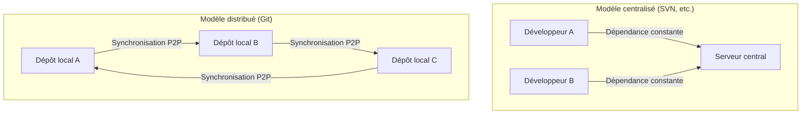
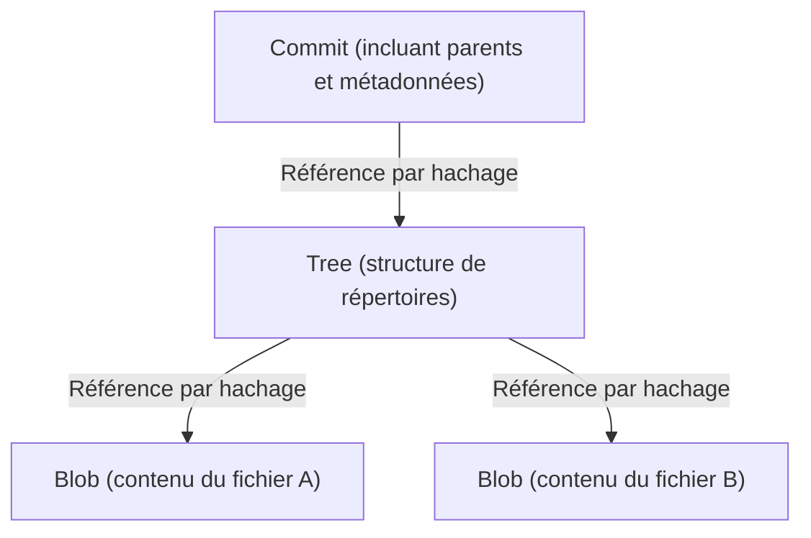

# La Philosophie de Git (L'esthétique de la décentralisation)

Dans le monde du développement logiciel, il est rare qu'un outil ait transformé de façon aussi fondamentale la pensée et le flux de travail des développeurs que Git. Dépassant le simple cadre d'un « outil de gestion de l'historique des fichiers », Git possède en son cœur une « philosophie » puissante. Il s'agit d'une esthétique soutenue par trois piliers : la décentralisation (Decentralization), l'autonomie (Autonomy) et la confiance cryptographique (Cryptographic Trust).

Dans cet article, nous explorerons en profondeur, d'un point de vue architectural, sous quelle philosophie Linus Torvalds, le créateur du noyau Linux, a conçu Git, comment il a séduit les développeurs du monde entier, et comment il a fini par former la base de la culture open source actuelle.

## 1. Contexte de création : l'antithèse de la centralisation

À l'époque de la création de Git en 2005, les systèmes de contrôle de version (VCS) dominants, tels que CVS et Subversion (SVN), étaient « centralisés ». Il s'agit d'un modèle où un énorme serveur central existe, auquel tous les développeurs accèdent pour obtenir le code le plus récent et envoyer (commiter) leurs propres modifications au serveur.

Cependant, dans d'énormes projets comme le noyau Linux où des milliers de personnes du monde entier participent simultanément au développement, le modèle centralisé présentait un goulot d'étranglement fatal. La nécessité d'une connexion au serveur, l'existence d'un point de défaillance unique (Single Point of Failure), et surtout le fait que « la création et la fusion de branches sont lourdes et lentes ».

Linus, motivé par une forte insatisfaction envers les systèmes existants, a décidé de construire lui-même un tout nouveau système de contrôle de version. Le changement de paradigme adopté à ce moment-là fut celui du système « distribué » (Distributed).

Dans Git, une « copie complète du dépôt » existe sur la machine locale de chaque personne. Même sans connexion au réseau, il est possible de rechercher dans tout l'historique passé, de créer des branches et d'effectuer des commits. Ce n'est pas seulement une amélioration des performances, mais un changement philosophique consistant à donner une « souveraineté totale » à chaque développeur.

## 2. L'esthétique du graphe de commits : DAG (Graphe orienté acyclique)

Le concept le plus important pour comprendre la structure interne de Git est le « DAG (Directed Acyclic Graph : Graphe orienté acyclique) ». Git ne gère pas l'historique comme une simple « succession de correctifs (différences) », mais construit les relations entre les instantanés (snapshots) sous forme de DAG.

Chaque commit possède un pointeur (tree) vers un instantané de l'ensemble du projet à ce moment-là, ainsi que des pointeurs vers un ou plusieurs « commits parents ». Grâce à cette simple chaîne de structures de données, Git représente l'historique complexe des bifurcations et des fusions de branches comme un graphe mathématiquement cohérent.

La beauté de cette approche réside dans le fait que l'historique s'exprime naturellement non pas comme une « ligne unique », mais comme « plusieurs chronologies avançant en parallèle ». Les développeurs peuvent librement bifurquer l'historique, expérimenter, puis abandonner la branche en cas d'échec, ou la fusionner avec la branche principale en cas de succès. L'historique n'est pas simplement un enregistrement du passé, mais devient la « trace de la pensée » même du développeur.

## 3. Les branches, un « terrain d'expérimentation léger »

Dans SVN, la création d'une branche signifiait copier un répertoire, une opération lourde qui consommait du temps et de l'espace disque. Par conséquent, créer une branche était un événement spécial avec une barrière psychologique élevée.

Cependant, dans Git, une branche n'est qu'un « pointeur dynamique pointant vers un commit spécifique (une valeur de hachage de 40 caractères dans un fichier) ». Le coût de création d'une branche est littéralement proche de zéro.

Cette conception de « branches peu coûteuses » (Cheap Branches) a transformé les méthodes de développement elles-mêmes. Des concepts tels que les branches de fonctionnalités (feature branches) et les branches de thèmes (topic branches) sont nés, et la pratique de « créer d'abord une branche pour expérimenter, quelle que soit la taille de la modification » s'est installée. Cela a donné aux développeurs « la liberté de procéder par essais et erreurs sans crainte de l'échec ».

## 4. Confiance cryptographique : SHA-1 et adressage par contenu

Dans un système décentralisé, le plus grand défi est de savoir comment garantir « l'intégrité des données » (Integrity). Dans un environnement où n'importe qui peut modifier le dépôt et échanger du code mutuellement, comment prouver que le code n'a pas été falsifié et que l'historique est légitime ?

Git a résolu ce problème avec élégance grâce à un « système de fichiers adressable par contenu » (Content-Addressable Filesystem). Tous les objets dans Git (commits, trees, et les BLOBs qui sont le contenu des fichiers) sont identifiés et stockés par une valeur de hachage SHA-1 (un nombre hexadécimal de 40 caractères) calculée à partir de leur contenu.

Si le contenu d'un fichier change d'un seul octet, la valeur de hachage de ce fichier change, la valeur de hachage du tree qui le contient change, et par conséquent la valeur de hachage du commit change également. En d'autres termes, il est cryptographiquement impossible de falsifier secrètement une partie de l'historique.

Linus Torvalds, lors de la conception de Git, avait la ferme volonté de « ne jamais permettre la destruction ou la falsification des données ». Le modèle de hachage de Git incarne la forme ultime de la décentralisation, comparable à la blockchain, où la confiance est inhérente aux données elles-mêmes, sans dépendre d'une autorité centrale (serveur).

## 5. Fusion et dialogue : la programmation comme processus social

La véritable force de Git réside dans la « fusion » (Merge), qui intègre les histoires bifurquées. Dans le développement distribué, il est courant que plusieurs développeurs éditent le même fichier simultanément, provoquant des conflits (conflicts) intenses.

L'algorithme de fusion de Git est exceptionnel, mais des conflits qui ne peuvent pas être résolus mécaniquement surviennent tout de même. Cependant, dans la philosophie de Git, un conflit n'est pas une « erreur », mais une fonctionnalité qui met en évidence « un point où un dialogue entre les développeurs est nécessaire ».

Quel code adopter, ou faut-il écrire une nouvelle logique qui tire parti des deux ? La résolution d'un conflit de fusion devient un processus social d'alignement des « intentions » qui se cachent derrière le code. Git offre un bac à sable parfait pour mener à bien ce processus localement et en toute sécurité.

## 6. Démocratisation de la culture open source et l'essor de GitHub

La philosophie décentralisée de Git a fondamentalement changé la nature du développement open source. Dans l'ancien développement open source, il existait une hiérarchie claire entre une minorité de privilégiés (les core committers) ayant le « droit de commit » sur le dépôt central, et les développeurs ordinaires qui envoyaient des correctifs via des listes de diffusion.

Cependant, dans le monde de Git, chacun possède un « clone complet » du dépôt original, et chacun est le « monarque absolu » de son environnement local. Après avoir apporté des modifications, on demande à l'original de « prendre en compte mes modifications » (Pull Request). Grâce à ce concept de Pull Request (qui n'est pas intégré à Git lui-même, mais que GitHub a construit au-dessus du modèle distribué de Git), la contribution au code a été radicalement démocratisée.

Tant que la qualité du code est bonne, il est fusionné, peu importe qui l'a écrit. La nature horizontale de l'architecture de Git a encouragé la formation de communautés de développement ouvertes et libres, basées sur la méritocratie.

## 7. Conclusion : Ce que Git nous apprend

Git n'est pas seulement un outil. C'est l'expression logicielle de la « liberté » et de la « responsabilité ».

Ne pas dépendre d'un serveur central et détenir l'historique complet et la souveraineté entre ses propres mains. Bifurquer (créer des branches) et procéder par essais et erreurs sans crainte de l'échec. Ensuite, partager ces résultats avec d'autres et tisser l'histoire ensemble par le dialogue (fusionner).

L'esthétique de la décentralisation ne consiste pas à dépendre d'une autorité spécifique, mais à construire un « réseau de confiance » basé sur l'autonomie individuelle et la vérifiabilité cryptographique. Derrière les commandes `git commit` et `git push` que nous tapons nonchalamment chaque jour, respire une philosophie grandiose qui a cherché à rendre le développement logiciel libre et démocratique.
